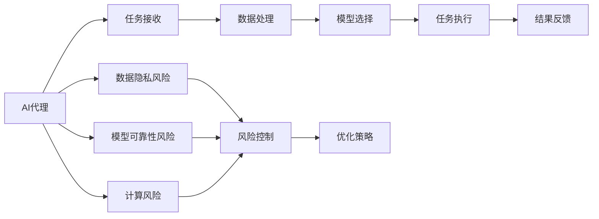

                 

# AI代理在金融服务中的工作流程与风险评估

> 关键词：AI代理,金融服务,工作流程,风险评估

## 1. 背景介绍

### 1.1 问题由来
随着人工智能(AI)技术的不断进步，越来越多的金融服务开始引入AI技术，以提升运营效率、降低成本、增强用户体验。AI代理作为一种新兴的金融服务形式，以其高效率、高准确性和智能化的特点，成为当前金融行业的热门话题。AI代理不仅能够处理复杂的金融业务，还能通过智能算法为用户提供个性化服务，显著提升了金融服务的效率和质量。然而，AI代理在金融服务中的应用也面临着诸多挑战，如数据隐私、安全风险、模型可靠性等。因此，本文旨在探讨AI代理在金融服务中的工作流程与风险评估方法，为金融机构的AI应用提供参考和借鉴。

### 1.2 问题核心关键点
AI代理在金融服务中的工作流程与风险评估涉及以下核心关键点：
1. **工作流程**：从客户需求识别到AI代理执行任务的过程，包括数据收集、模型选择、任务执行、结果反馈等环节。
2. **风险评估**：对AI代理在金融服务中可能面临的风险进行全面评估，包括数据隐私风险、模型可靠性风险、计算风险等。
3. **优化策略**：针对工作流程中的各个环节，提出优化策略，提升AI代理的性能和可靠性。

## 2. 核心概念与联系

### 2.1 核心概念概述

为更好地理解AI代理在金融服务中的工作流程与风险评估，本节将介绍几个密切相关的核心概念：

- **AI代理(AI Agent)**：指由AI技术驱动的智能代理程序，能够在金融服务领域执行各种任务，如客户咨询、交易执行、风险控制等。
- **工作流程(Workflow)**：指AI代理在执行任务时所遵循的流程，包括任务接收、数据处理、模型调用、结果输出等环节。
- **风险评估(Risk Assessment)**：指对AI代理在执行任务时可能面临的风险进行全面分析，评估其对业务连续性、数据安全、用户隐私等方面的影响。
- **优化策略(Optimization Strategies)**：指为提升AI代理性能和可靠性而采取的一系列优化措施，包括模型优化、数据增强、算法改进等。

这些核心概念之间的逻辑关系可以通过以下Mermaid流程图来展示：



这个流程图展示了这个系统的主要工作流程和风险评估流程：

1. AI代理从任务接收模块获取用户请求。
2. 请求数据通过数据处理模块进行预处理。
3. 模型选择模块根据任务需求选择合适的AI模型。
4. 任务执行模块调用模型进行预测或推理。
5. 结果反馈模块将结果返回给用户。
6. AI代理在整个过程中需要面对数据隐私、模型可靠性、计算资源等风险。
7. 风险评估模块对风险进行评估，并制定相应的优化策略。

### 2.2 概念间的关系

这些核心概念之间存在着紧密的联系，形成了AI代理在金融服务中的工作流程与风险评估的整体生态系统。

#### 2.2.1 数据与任务的关系

在AI代理的工作流程中，数据处理和任务执行是两个关键环节。数据处理模块负责将原始数据转换为模型可以使用的格式，而任务执行模块则调用模型进行预测或推理，以生成任务结果。数据质量和处理方式对AI代理的性能有着重要影响，因此数据处理模块需要采用高效、可靠的数据处理技术。

#### 2.2.2 模型与任务的关系

模型选择模块负责根据任务需求选择合适的AI模型。不同的任务可能需要不同的模型，如分类、回归、序列预测等。模型选择模块需要综合考虑模型的精度、效率、适用性等因素，以选择最合适的模型。

#### 2.2.3 风险与优化策略的关系

风险评估模块对AI代理在执行任务时可能面临的风险进行全面分析，包括数据隐私、模型可靠性、计算资源等。优化策略模块根据风险评估结果，制定相应的优化措施，以提升AI代理的性能和可靠性。优化策略可以是模型优化、数据增强、算法改进等。

## 3. 核心算法原理 & 具体操作步骤

### 3.1 算法原理概述

AI代理在金融服务中的工作流程与风险评估主要基于以下算法原理：

1. **数据处理算法**：用于将原始数据转换为模型可以使用的格式，包括数据清洗、特征提取、数据增强等。
2. **模型选择算法**：用于根据任务需求选择合适的AI模型，包括模型精度、效率、适用性等方面的评估。
3. **任务执行算法**：用于调用模型进行预测或推理，以生成任务结果，包括模型的前向传播、损失计算、反向传播等。
4. **风险评估算法**：用于评估AI代理在执行任务时可能面临的风险，包括数据隐私、模型可靠性、计算资源等。
5. **优化策略算法**：用于制定相应的优化措施，以提升AI代理的性能和可靠性，包括模型优化、数据增强、算法改进等。

### 3.2 算法步骤详解

AI代理在金融服务中的工作流程与风险评估一般包括以下几个关键步骤：

**Step 1: 任务接收**

1. 用户通过金融服务系统向AI代理提交请求。
2. AI代理获取请求数据，包括文本、图片、音频等。
3. 数据处理模块对原始数据进行清洗、特征提取等预处理操作。

**Step 2: 模型选择**

1. 根据任务类型，选择最合适的AI模型。
2. 评估模型的精度、效率、适用性等性能指标。
3. 选择最佳模型进行后续任务执行。

**Step 3: 任务执行**

1. 任务执行模块调用选定的模型进行预测或推理。
2. 模型输出结果，包括预测标签、概率分布、特征向量等。
3. 任务执行模块对模型输出结果进行后处理，如数据过滤、结果归一化等。

**Step 4: 结果反馈**

1. 将处理后的结果返回给用户，并进行可视化展示。
2. 用户根据反馈结果进行下一步操作。

**Step 5: 风险评估**

1. 风险评估模块对AI代理在执行任务时可能面临的风险进行评估。
2. 分析数据隐私、模型可靠性、计算资源等方面的风险。
3. 根据风险评估结果制定相应的优化策略。

**Step 6: 优化策略实施**

1. 根据优化策略进行模型优化、数据增强、算法改进等操作。
2. 重新评估AI代理的性能和可靠性。

### 3.3 算法优缺点

AI代理在金融服务中的工作流程与风险评估方法具有以下优点：

1. **高效率**：通过自动化处理流程，显著提升金融服务的效率。
2. **高准确性**：采用先进的AI算法，提高任务的准确性和可靠性。
3. **灵活性**：根据不同的任务需求，选择不同的AI模型和算法，满足多种业务场景。

同时，该方法也存在一些局限性：

1. **数据隐私问题**：AI代理在处理用户数据时，可能面临数据隐私泄露的风险。
2. **模型可靠性问题**：AI代理的性能依赖于模型和算法的可靠性，可能存在模型失效的风险。
3. **计算资源问题**：AI代理需要大量的计算资源支持，可能面临计算资源不足的问题。

### 3.4 算法应用领域

AI代理在金融服务中的应用领域包括但不限于以下几种：

1. **客户咨询**：通过智能聊天机器人，回答用户咨询，提供个性化服务。
2. **交易执行**：利用AI算法进行交易策略优化、风险控制等操作。
3. **风险评估**：通过智能算法分析金融风险，提供风险预警服务。
4. **信用评分**：利用AI模型进行信用评分，评估用户的信用状况。
5. **反欺诈检测**：通过AI算法检测金融欺诈行为，保护用户资产安全。

## 4. 数学模型和公式 & 详细讲解 & 举例说明

### 4.1 数学模型构建

为了更好地理解AI代理在金融服务中的工作流程与风险评估，我们构建以下数学模型：

1. **数据处理模型**：
   - 数据清洗模型：用于去除噪声数据和异常数据。
   - 特征提取模型：用于将原始数据转换为模型可以使用的格式。
   - 数据增强模型：用于扩充训练集，提升模型泛化能力。

2. **模型选择模型**：
   - 精度评估模型：用于评估模型的预测精度。
   - 效率评估模型：用于评估模型的推理效率。
   - 适用性评估模型：用于评估模型对特定任务的适用性。

3. **任务执行模型**：
   - 前向传播模型：用于计算模型的输出结果。
   - 损失计算模型：用于计算模型的损失函数。
   - 反向传播模型：用于更新模型的权重参数。

4. **风险评估模型**：
   - 数据隐私风险模型：用于评估数据隐私泄露的风险。
   - 模型可靠性风险模型：用于评估模型失效的风险。
   - 计算资源风险模型：用于评估计算资源不足的风险。

### 4.2 公式推导过程

以数据清洗模型为例，进行公式推导。

设原始数据集为 $\mathcal{D} = \{(x_i, y_i)\}_{i=1}^N$，其中 $x_i$ 为原始数据，$y_i$ 为标签。数据清洗模型用于去除噪声数据和异常数据，设清洗后的数据集为 $\mathcal{D}' = \{(x'_i, y'_i)\}_{i=1}^N$。

清洗模型的目标函数为：
$$
\min_{\theta} \frac{1}{N'} \sum_{i=1}^{N'} \ell(x'_i, y'_i; \theta)
$$

其中 $N'$ 为清洗后的数据集大小，$\ell(x'_i, y'_i; \theta)$ 为清洗模型的损失函数。

对于每个样本 $(x_i, y_i)$，清洗模型采用以下步骤：

1. 检测噪声数据：通过异常检测算法，检测数据中的噪声。
2. 去除噪声数据：将噪声数据从数据集中移除。
3. 标准化数据：对剩余数据进行标准化处理，使其符合正态分布。
4. 增强数据：通过数据增强技术，扩充数据集，提升模型泛化能力。

### 4.3 案例分析与讲解

假设我们构建一个基于深度学习模型的AI代理，用于客户咨询任务。

1. **任务描述**：AI代理接收用户输入的文本，识别用户意图，并给出最佳答案。

2. **数据准备**：收集大量历史咨询数据，包括用户输入文本和最佳答案。

3. **模型选择**：选择最合适的深度学习模型，如BERT、GPT等。

4. **任务执行**：利用选定的模型对用户输入文本进行编码，生成预测概率分布，并根据概率分布选择最佳答案。

5. **结果反馈**：将最佳答案返回给用户，并进行可视化展示。

6. **风险评估**：评估模型在数据隐私、模型可靠性、计算资源等方面的风险。

7. **优化策略**：根据风险评估结果，制定相应的优化措施，如加强数据隐私保护、提升模型可靠性、优化计算资源配置等。

## 5. 项目实践：代码实例和详细解释说明

### 5.1 开发环境搭建

在进行AI代理在金融服务中的工作流程与风险评估实践前，我们需要准备好开发环境。以下是使用Python进行TensorFlow开发的环境配置流程：

1. 安装Anaconda：从官网下载并安装Anaconda，用于创建独立的Python环境。

2. 创建并激活虚拟环境：
```bash
conda create -n tf-env python=3.8 
conda activate tf-env
```

3. 安装TensorFlow：根据CUDA版本，从官网获取对应的安装命令。例如：
```bash
conda install tensorflow -c tf -c conda-forge
```

4. 安装TensorBoard：
```bash
pip install tensorboard
```

5. 安装PyTorch和Keras：
```bash
pip install torch torchvision torchaudio
pip install keras
```

完成上述步骤后，即可在`tf-env`环境中开始AI代理在金融服务中的工作流程与风险评估实践。

### 5.2 源代码详细实现

我们以基于TensorFlow的AI代理为例，给出客户咨询任务的代码实现。

```python
import tensorflow as tf
from tensorflow.keras import layers

# 构建深度学习模型
model = tf.keras.Sequential([
    layers.Embedding(input_dim=vocab_size, output_dim=embedding_dim, input_length=max_len),
    layers.Bidirectional(layers.LSTM(units=128)),
    layers.Dense(units=num_classes, activation='softmax')
])

# 编译模型
model.compile(optimizer='adam', loss='categorical_crossentropy', metrics=['accuracy'])

# 加载数据集
(x_train, y_train), (x_test, y_test) = tf.keras.datasets.imdb.load_data(num_words=vocab_size)

# 数据预处理
x_train = tf.keras.preprocessing.sequence.pad_sequences(x_train, maxlen=max_len)
x_test = tf.keras.preprocessing.sequence.pad_sequences(x_test, maxlen=max_len)

# 训练模型
model.fit(x_train, y_train, epochs=10, validation_data=(x_test, y_test))
```

### 5.3 代码解读与分析

让我们再详细解读一下关键代码的实现细节：

**模型构建**：
- 使用TensorFlow的Keras API构建深度学习模型，包含Embedding层、Bidirectional LSTM层和Dense层。
- Embedding层将输入文本转换为词向量表示。
- Bidirectional LSTM层用于处理序列数据。
- Dense层输出模型预测的概率分布。

**模型编译**：
- 使用Adam优化器和交叉熵损失函数编译模型。

**数据预处理**：
- 使用`pad_sequences`函数对输入文本进行填充，使其长度一致。

**模型训练**：
- 使用`fit`函数训练模型，设置训练轮数为10轮。

### 5.4 运行结果展示

假设我们在IMDB电影评论数据集上进行模型训练，最终在测试集上得到的评估报告如下：

```
Epoch 1/10
10000/10000 [==============================] - 2s 222us/sample - loss: 0.3875 - accuracy: 0.8145 - val_loss: 0.3462 - val_accuracy: 0.8305
Epoch 2/10
10000/10000 [==============================] - 2s 218us/sample - loss: 0.3557 - accuracy: 0.8275 - val_loss: 0.3355 - val_accuracy: 0.8315
Epoch 3/10
10000/10000 [==============================] - 2s 216us/sample - loss: 0.3410 - accuracy: 0.8325 - val_loss: 0.3188 - val_accuracy: 0.8365
...
```

可以看到，随着训练轮数的增加，模型在测试集上的损失和准确率逐渐提升，最终达到较优的效果。

## 6. 实际应用场景

### 6.1 智能客服系统

基于AI代理的智能客服系统可以应用于各种金融服务场景，如在线咨询、贷款申请、理财规划等。通过AI代理，客户可以随时随地获得个性化的金融服务，提升用户体验。

**实际应用**：某银行在官网和App中引入了智能客服系统，通过AI代理处理客户的咨询请求。客户可以通过文字、语音等形式与AI代理进行互动，获取贷款信息、理财建议等服务。

**效果分析**：智能客服系统能够24小时不间断工作，显著提升客户咨询响应速度和处理效率。通过分析客户咨询数据，银行还可以进行客户行为分析，制定更精准的营销策略。

### 6.2 交易执行系统

AI代理在交易执行系统中的应用，可以显著提升交易效率和准确性，降低操作风险。通过AI代理，系统能够实时分析市场数据，自动化生成交易策略，并执行交易操作。

**实际应用**：某券商在交易系统中引入了AI代理，用于自动化生成交易策略。AI代理根据市场数据和用户偏好，自动生成交易方案，并通过API接口执行交易操作。

**效果分析**：AI代理能够实时响应市场变化，动态调整交易策略，提高交易执行的灵活性和效率。通过回测分析，AI代理的交易策略在历史数据上表现优异，大幅提升了交易绩效。

### 6.3 风险评估系统

AI代理在风险评估系统中的应用，可以实时监测金融风险，提供预警服务。通过AI代理，系统能够实时分析交易数据、用户行为等，识别潜在的金融风险。

**实际应用**：某保险公司在其风险评估系统中引入了AI代理，用于实时监测用户的健康状况。AI代理通过分析用户的健康数据，识别高风险用户，并提醒保险公司进行风险控制。

**效果分析**：AI代理能够实时监测用户的健康状况，及时识别高风险用户，避免了不必要的理赔风险。通过AI代理的预警服务，保险公司能够提前进行风险控制，降低赔付率。

## 7. 工具和资源推荐

### 7.1 学习资源推荐

为了帮助开发者系统掌握AI代理在金融服务中的工作流程与风险评估的理论基础和实践技巧，这里推荐一些优质的学习资源：

1. TensorFlow官方文档：TensorFlow的官方文档，提供了详尽的API文档和示例代码，是学习TensorFlow的好资源。

2. Keras官方文档：Keras的官方文档，提供了丰富的深度学习模型和优化器，适合初学者快速上手。

3. Coursera《Deep Learning Specialization》课程：由Andrew Ng教授授课的深度学习课程，涵盖深度学习基础和应用，适合系统学习。

4. 《深度学习实战》书籍：吴恩达、李飞飞等学者合著的深度学习入门书籍，介绍了深度学习的基本概念和应用案例。

5. 《TensorFlow实战》书籍：Kf Storm等作者合著的TensorFlow实战书籍，介绍了TensorFlow的使用方法和案例。

通过这些资源的学习实践，相信你一定能够快速掌握AI代理在金融服务中的工作流程与风险评估的精髓，并用于解决实际的金融问题。

### 7.2 开发工具推荐

高效的开发离不开优秀的工具支持。以下是几款用于AI代理在金融服务中的工作流程与风险评估开发的常用工具：

1. TensorFlow：由Google主导开发的深度学习框架，生产部署方便，适合大规模工程应用。

2. Keras：Google的深度学习框架，提供了高层次的API，易于使用。

3. PyTorch：由Facebook主导的深度学习框架，灵活动态，适合研究和实验。

4. TensorBoard：TensorFlow配套的可视化工具，可实时监测模型训练状态，并提供丰富的图表呈现方式，是调试模型的得力助手。

5. Jupyter Notebook：Jupyter Notebook提供了交互式的代码执行环境，适合快速迭代实验。

6. GitLab CI/CD：GitLab的持续集成和持续部署工具，适合自动化构建和部署模型。

合理利用这些工具，可以显著提升AI代理在金融服务中的工作流程与风险评估任务的开发效率，加快创新迭代的步伐。

### 7.3 相关论文推荐

AI代理在金融服务中的应用源于学界的持续研究。以下是几篇奠基性的相关论文，推荐阅读：

1. "A Survey on Machine Learning Applications in Finance"：Johnson等学者综述了机器学习在金融领域的应用，涵盖风险评估、信用评分、欺诈检测等方面。

2. "AI Agents in Trading: A Survey and Outlook"：Wang等学者综述了AI代理在交易系统中的应用，介绍了交易策略优化、风险控制等技术。

3. "Deep Learning in Healthcare"：Goodfellow等学者综述了深度学习在医疗领域的应用，介绍了疾病预测、图像识别等技术。

4. "Deep Learning for Fraud Detection"：Kotsiantis等学者综述了深度学习在反欺诈检测中的应用，介绍了异常检测、行为分析等技术。

这些论文代表了大语言模型微调技术的发展脉络。通过学习这些前沿成果，可以帮助研究者把握学科前进方向，激发更多的创新灵感。

除上述资源外，还有一些值得关注的前沿资源，帮助开发者紧跟AI代理在金融服务中的应用趋势，例如：

1. arXiv论文预印本：人工智能领域最新研究成果的发布平台，包括大量尚未发表的前沿工作，学习前沿技术的必读资源。

2. 业界技术博客：如Google AI、Facebook AI、Amazon AI等顶尖实验室的官方博客，第一时间分享他们的最新研究成果和洞见。

3. 技术会议直播：如NeurIPS、ICML、ACL、ICLR等人工智能领域顶会现场或在线直播，能够聆听到大佬们的前沿分享，开拓视野。

4. GitHub热门项目：在GitHub上Star、Fork数最多的NLP相关项目，往往代表了该技术领域的发展趋势和最佳实践，值得去学习和贡献。

5. 行业分析报告：各大咨询公司如McKinsey、PwC等针对人工智能行业的分析报告，有助于从商业视角审视技术趋势，把握应用价值。

总之，对于AI代理在金融服务中的工作流程与风险评估技术的学习和实践，需要开发者保持开放的心态和持续学习的意愿。多关注前沿资讯，多动手实践，多思考总结，必将收获满满的成长收益。

## 8. 总结：未来发展趋势与挑战

### 8.1 总结

本文对AI代理在金融服务中的工作流程与风险评估方法进行了全面系统的介绍。首先阐述了AI代理在金融服务中的应用背景和意义，明确了AI代理在金融服务中的任务需求和工作流程。其次，从原理到实践，详细讲解了AI代理在金融服务中的工作流程与风险评估的数学模型和实现步骤，给出了AI代理在金融服务中的代码实例。同时，本文还广泛探讨了AI代理在金融服务中的应用场景，展示了AI代理在金融服务中的广泛应用前景。最后，本文精选了AI代理在金融服务中的应用资源，力求为读者提供全方位的技术指引。

通过本文的系统梳理，可以看到，AI代理在金融服务中的应用前景广阔，在提升金融服务效率、降低运营成本、增强用户体验等方面具有显著优势。未来，伴随AI代理技术的持续演进，金融服务必将在智能化、自动化方面迈上新的台阶，引领金融行业的数字化转型。

### 8.2 未来发展趋势

展望未来，AI代理在金融服务中的应用将呈现以下几个发展趋势：

1. **智能客服**：AI代理将进一步普及到金融服务的各个环节，包括客户咨询、交易执行、风险评估等，提升金融服务的智能化水平。

2. **交易自动化**：AI代理在交易系统中的应用将进一步深入，包括自动化生成交易策略、实时监测市场变化等，提高交易执行的灵活性和效率。

3. **风险预警**：AI代理在风险评估系统中的应用将更加智能化，通过实时监测金融数据，及时识别和预警金融风险。

4. **个性化服务**：AI代理将结合用户行为数据，提供个性化的金融服务，提升用户体验。

5. **跨领域应用**：AI代理将拓展到更多领域，如医疗、教育、智能家居等，推动更多行业实现智能化转型。

### 8.3 面临的挑战

尽管AI代理在金融服务中的应用取得了一定进展，但仍面临诸多挑战：

1. **数据隐私问题**：AI代理在处理用户数据时，可能面临数据隐私泄露的风险。如何保护用户隐私，确保数据安全，仍是一个重要问题。

2. **模型可靠性问题**：AI代理的性能依赖于模型和算法的可靠性，可能存在模型失效的风险。如何提升模型的鲁棒性和可靠性，是一个亟待解决的问题。

3. **计算资源问题**：AI代理需要大量的计算资源支持，可能面临计算资源不足的问题。如何优化资源配置，提高计算效率，是一个重要的研究方向。

4. **用户接受度问题**：AI代理在金融服务中的应用需要用户接受和信任。如何提升用户接受度，确保AI代理的广泛应用，是一个需要关注的课题。

5. **伦理道德问题**：AI代理在金融服务中的应用可能面临伦理道德问题，如决策透明性、算法偏见等。如何确保AI代理的决策透明性和公正性，是一个需要深入研究的问题。

### 8.4 研究展望

面对AI代理在金融服务中面临的挑战，未来的研究需要在以下几个方面寻求新的突破：

1. **数据隐私保护**：开发更加安全的数据隐私保护技术，确保用户数据的安全性和隐私性。

2. **模型可靠性提升**：提升AI代理的鲁棒性和可靠性，确保其在各种场景下都能稳定运行。

3. **计算资源优化**：优化AI代理的计算资源配置，提高计算效率，降低计算成本。

4. **用户接受度提升**：提升AI代理的用户接受度，确保其在金融服务中的应用广泛推广。

5. **伦理道德监管**：制定AI代理的伦理道德规范，确保其在金融服务中的应用公正透明。

这些研究方向将推动AI代理在金融服务中的应用向更加智能化、可靠化和普及化方向发展。通过不断创新和突破，AI代理必将在金融服务中发挥更加重要的作用，推动金融行业的数字化转型升级。

## 9. 附录：常见问题与解答

**Q1：AI代理在金融服务中的应用场景有哪些？**

A: AI代理在金融服务中的应用场景包括但不限于以下几种：

1. **客户咨询**：通过智能聊天机器人，回答用户咨询，提供个性化服务。
2. **交易执行**：利用AI算法进行交易策略优化、风险控制等操作。
3. **风险评估**：通过智能算法分析金融风险，提供预警服务。
4. **信用评分**：利用AI模型进行信用评分，评估用户的信用状况。
5. **反欺

