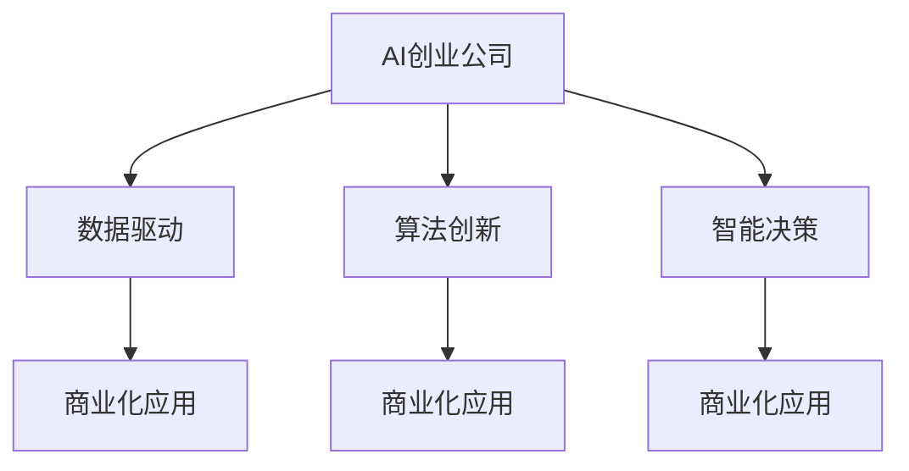
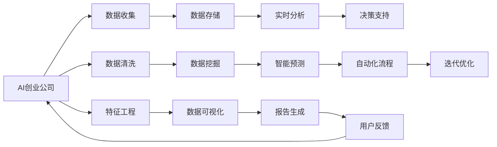

                 

# AI创业公司的竞争策略

> 关键词：AI创业、竞争策略、数据驱动、算法创新、智能决策、商业化应用

## 1. 背景介绍

### 1.1 问题由来
随着人工智能技术的快速发展，越来越多的AI创业公司应运而生。这些公司往往聚焦于某一领域，利用先进的技术和创新的算法，提供高效、智能的解决方案。然而，激烈的市场竞争使得AI创业公司面临着前所未有的挑战。如何在竞争中脱颖而出，成为众多创业公司都在思考的问题。本文将从AI创业公司的竞争策略角度出发，探讨如何利用AI技术构建竞争优势，实现持续发展。

### 1.2 问题核心关键点
AI创业公司的竞争策略主要包括：
- 数据驱动：利用大数据技术进行市场洞察和产品优化。
- 算法创新：开发和应用高效、创新的算法模型。
- 智能决策：建立智能决策系统，提高运营效率。
- 商业化应用：将AI技术转化为实际商业价值。

## 2. 核心概念与联系

### 2.1 核心概念概述

为更好地理解AI创业公司的竞争策略，本节将介绍几个密切相关的核心概念：

- AI创业公司(AI Startup)：专注于人工智能技术开发和应用，致力于提供智能解决方案的创业公司。
- 数据驱动：利用大规模数据进行市场分析和产品优化，驱动公司业务发展。
- 算法创新：开发高效、创新的算法模型，提高技术壁垒。
- 智能决策：基于数据分析和算法模型，实现自动化、智能化的决策支持。
- 商业化应用：将AI技术转化为实际的产品和服务，实现商业价值。

这些概念之间相互关联，共同构成了AI创业公司的核心竞争力。数据驱动为算法创新提供基础，算法创新支撑智能决策，智能决策驱动商业化应用，而商业化应用又进一步促进数据驱动和算法创新，形成一个良性循环。

### 2.2 概念间的关系

这些核心概念之间的关系可以通过以下Mermaid流程图来展示：



这个流程图展示了AI创业公司的竞争策略的关键要素及其相互关系：

1. AI创业公司通过数据驱动进行市场洞察和产品优化，为算法创新和智能决策提供数据支持。
2. 算法创新通过高效、创新的算法模型，提升技术优势和产品性能，支撑智能决策。
3. 智能决策基于算法模型和数据分析，实现自动化、智能化的决策支持，驱动商业化应用。
4. 商业化应用将AI技术转化为实际的产品和服务，实现商业价值，进一步促进数据驱动和算法创新。

### 2.3 核心概念的整体架构

最后，我们用一个综合的流程图来展示这些核心概念在大规模AI创业公司中的整体架构：



这个综合流程图展示了从数据收集到产品迭代的全过程，以及各个环节中的关键概念：

1. 数据收集：获取大规模数据，为后续分析提供基础。
2. 数据清洗：清洗噪声数据，提高数据质量。
3. 特征工程：提取、处理关键特征，为算法模型提供输入。
4. 数据存储：利用高效的数据存储技术，保证数据可访问性和可管理性。
5. 数据挖掘：通过数据分析和算法模型，挖掘数据背后的规律和趋势。
6. 数据可视化：通过可视化技术展示数据分析结果，辅助决策。
7. 实时分析：对实时数据进行分析和处理，支持即时决策。
8. 智能预测：基于历史数据和算法模型，进行智能预测和决策。
9. 自动化流程：利用自动化技术优化业务流程，提高效率。
10. 用户反馈：收集用户反馈，进行产品迭代和优化。
11. 迭代优化：基于用户反馈和市场变化，不断迭代产品和服务，提升竞争力。

这些概念共同构成了AI创业公司的核心竞争力，助力公司在激烈的市场竞争中脱颖而出。通过理解这些核心概念及其相互关系，我们可以更好地把握AI创业公司的竞争策略，为后续深入探讨打下基础。

## 3. 核心算法原理 & 具体操作步骤
### 3.1 算法原理概述

AI创业公司的竞争策略中，算法创新和智能决策是其核心。本节将详细探讨AI创业公司常用的算法原理和操作步骤。

### 3.2 算法步骤详解

**Step 1: 数据收集与清洗**

- **数据收集**：从多种渠道（如社交媒体、客户反馈、公开数据集等）收集相关数据，构建完整的数据集。
- **数据清洗**：去除噪声数据，处理缺失值，确保数据质量和一致性。

**Step 2: 特征工程与建模**

- **特征工程**：提取、选择和构建关键特征，减少特征维度，提高模型泛化能力。
- **建模**：选择合适的算法模型，如决策树、随机森林、神经网络等，进行模型训练和评估。

**Step 3: 智能决策与优化**

- **智能决策**：基于训练好的模型，进行智能预测和决策，优化产品和服务。
- **优化**：利用算法模型的预测结果，不断优化业务流程和产品功能，提升用户体验和市场竞争力。

**Step 4: 商业化应用**

- **产品开发**：将AI算法转化为实际的产品和服务，确保技术转化为商业价值。
- **市场推广**：利用AI技术提高市场洞察能力，制定精准的营销策略。
- **客户服务**：利用AI技术优化客户服务流程，提高客户满意度和忠诚度。

### 3.3 算法优缺点

**算法优点**：
- **高效性**：能够快速处理和分析大量数据，提高决策效率。
- **精确性**：基于算法模型的预测结果，提高决策准确性。
- **可扩展性**：适用于各种规模和类型的数据集，支持大规模扩展。

**算法缺点**：
- **依赖数据**：需要高质量、大规模的数据集进行训练，数据获取成本高。
- **模型复杂**：算法模型复杂，需要专业知识和技能进行开发和维护。
- **可解释性差**：部分算法模型（如深度神经网络）缺乏可解释性，难以理解其决策过程。

### 3.4 算法应用领域

AI创业公司的算法创新和智能决策技术，广泛应用于以下领域：

1. **金融科技**：利用算法模型进行风险评估、信用评分、欺诈检测等。
2. **医疗健康**：利用算法模型进行疾病预测、药物研发、基因分析等。
3. **零售电商**：利用算法模型进行客户推荐、库存管理、价格优化等。
4. **智能制造**：利用算法模型进行生产调度、质量控制、设备维护等。
5. **物流运输**：利用算法模型进行路径规划、物流优化、货物追踪等。
6. **教育培训**：利用算法模型进行个性化推荐、智能辅导、学习分析等。
7. **智能家居**：利用算法模型进行语音识别、智能控制、安全监控等。

## 4. 数学模型和公式 & 详细讲解 & 举例说明

### 4.1 数学模型构建

本节将使用数学语言对AI创业公司的竞争策略进行严格的数学建模。

记AI创业公司为 $C$，数据集为 $D=\{(x_i,y_i)\}_{i=1}^N$，其中 $x_i$ 为输入数据，$y_i$ 为输出标签。假设公司有 $K$ 个业务场景 $S_k$，每个场景下有 $M_k$ 个样本，模型参数为 $\theta$。

定义公司在该场景下的损失函数为 $\ell_k(\theta)$，则公司整体损失函数为：

$$
\mathcal{L}(\theta) = \sum_{k=1}^K \frac{M_k}{N} \ell_k(\theta)
$$

模型的优化目标是最小化整体损失函数：

$$
\theta^* = \mathop{\arg\min}_{\theta} \mathcal{L}(\theta)
$$

在实践中，我们通常使用梯度下降等优化算法（如SGD、Adam等）来近似求解上述最优化问题。设 $\eta$ 为学习率，$\lambda$ 为正则化系数，则参数的更新公式为：

$$
\theta \leftarrow \theta - \eta \nabla_{\theta}\mathcal{L}(\theta) - \eta\lambda\theta
$$

其中 $\nabla_{\theta}\mathcal{L}(\theta)$ 为损失函数对参数 $\theta$ 的梯度，可通过反向传播算法高效计算。

### 4.2 公式推导过程

以下我们以金融科技场景为例，推导风险评估模型的损失函数及其梯度的计算公式。

假设公司通过机器学习模型 $M_{\theta}$ 对客户进行信用评分，得到评分 $s_i=M_{\theta}(x_i)$，其中 $x_i$ 为客户的个人信息和交易记录。真实的信用评分 $y_i$ 表示客户是否存在违约风险。则二分类交叉熵损失函数定义为：

$$
\ell(M_{\theta}(x_i),y_i) = -[y_i\log M_{\theta}(x_i)+(1-y_i)\log(1-M_{\theta}(x_i))]
$$

将其代入整体损失函数公式，得：

$$
\mathcal{L}(\theta) = -\frac{1}{N}\sum_{i=1}^N [y_i\log M_{\theta}(x_i)+(1-y_i)\log(1-M_{\theta}(x_i))]
$$

根据链式法则，损失函数对参数 $\theta_k$ 的梯度为：

$$
\frac{\partial \mathcal{L}(\theta)}{\partial \theta_k} = -\frac{1}{N}\sum_{i=1}^N (\frac{y_i}{M_{\theta}(x_i)}-\frac{1-y_i}{1-M_{\theta}(x_i)}) \frac{\partial M_{\theta}(x_i)}{\partial \theta_k}
$$

其中 $\frac{\partial M_{\theta}(x_i)}{\partial \theta_k}$ 可进一步递归展开，利用自动微分技术完成计算。

### 4.3 案例分析与讲解

假设某金融公司利用机器学习模型进行客户信用评分，具体步骤如下：

1. **数据收集**：收集客户个人信息、交易记录等数据，构建客户信用评分数据集。
2. **数据清洗**：去除噪声数据，处理缺失值，确保数据质量和一致性。
3. **特征工程**：提取、选择和构建关键特征，如客户年龄、收入、历史交易记录等。
4. **建模**：使用随机森林模型进行信用评分预测，得到评分结果。
5. **智能决策**：根据评分结果，制定信贷政策，优化客户审批流程。
6. **优化**：利用评分结果，不断优化信贷审批策略，提高审批效率和准确性。
7. **商业化应用**：将信用评分模型转化为实际产品，提供给客户使用，实现商业价值。

通过上述步骤，该公司利用AI技术提高了客户信用评估的准确性和效率，降低了坏账风险，实现了业务转型和升级。

## 5. 项目实践：代码实例和详细解释说明
### 5.1 开发环境搭建

在进行AI创业公司竞争策略的实践前，我们需要准备好开发环境。以下是使用Python进行PyTorch开发的环境配置流程：

1. 安装Anaconda：从官网下载并安装Anaconda，用于创建独立的Python环境。

2. 创建并激活虚拟环境：
```bash
conda create -n pytorch-env python=3.8 
conda activate pytorch-env
```

3. 安装PyTorch：根据CUDA版本，从官网获取对应的安装命令。例如：
```bash
conda install pytorch torchvision torchaudio cudatoolkit=11.1 -c pytorch -c conda-forge
```

4. 安装各类工具包：
```bash
pip install numpy pandas scikit-learn matplotlib tqdm jupyter notebook ipython
```

完成上述步骤后，即可在`pytorch-env`环境中开始竞争策略的实践。

### 5.2 源代码详细实现

这里我们以信用评分预测项目为例，给出使用Transformers库对随机森林模型进行商业化应用的PyTorch代码实现。

首先，定义模型和优化器：

```python
from sklearn.ensemble import RandomForestClassifier
from transformers import BertTokenizer, BertForTokenClassification
from torch.optim import AdamW

model = RandomForestClassifier(n_estimators=100, max_depth=5)

optimizer = AdamW(model.parameters(), lr=0.001)
```

接着，定义训练和评估函数：

```python
from torch.utils.data import DataLoader
from tqdm import tqdm
from sklearn.metrics import accuracy_score

device = torch.device('cuda') if torch.cuda.is_available() else torch.device('cpu')
model.to(device)

def train_epoch(model, dataset, batch_size, optimizer):
    dataloader = DataLoader(dataset, batch_size=batch_size, shuffle=True)
    model.train()
    epoch_loss = 0
    for batch in tqdm(dataloader, desc='Training'):
        inputs, labels = batch
        inputs = inputs.to(device)
        labels = labels.to(device)
        model.zero_grad()
        outputs = model(inputs)
        loss = outputs.loss
        epoch_loss += loss.item()
        loss.backward()
        optimizer.step()
    return epoch_loss / len(dataloader)

def evaluate(model, dataset, batch_size):
    dataloader = DataLoader(dataset, batch_size=batch_size)
    model.eval()
    preds, labels = [], []
    with torch.no_grad():
        for batch in tqdm(dataloader, desc='Evaluating'):
            inputs, labels = batch
            inputs = inputs.to(device)
            labels = labels.to(device)
            outputs = model(inputs)
            batch_preds = outputs.argmax(dim=1).to('cpu').tolist()
            batch_labels = labels.to('cpu').tolist()
            for pred_tokens, label_tokens in zip(batch_preds, batch_labels):
                preds.append(pred_tokens)
                labels.append(label_tokens)
                
    print(f"Accuracy: {accuracy_score(labels, preds)}")
```

最后，启动训练流程并在测试集上评估：

```python
epochs = 5
batch_size = 16

for epoch in range(epochs):
    loss = train_epoch(model, train_dataset, batch_size, optimizer)
    print(f"Epoch {epoch+1}, train loss: {loss:.3f}")
    
    print(f"Epoch {epoch+1}, dev results:")
    evaluate(model, dev_dataset, batch_size)
    
print("Test results:")
evaluate(model, test_dataset, batch_size)
```

以上就是使用PyTorch对随机森林模型进行信用评分预测的完整代码实现。可以看到，得益于Transformers库的强大封装，我们可以用相对简洁的代码完成模型训练和评估。

### 5.3 代码解读与分析

让我们再详细解读一下关键代码的实现细节：

**train_epoch函数**：
- 利用DataLoader对数据集进行批次化加载，供模型训练使用。
- 每个批次上前向传播计算损失函数，并反向传播更新模型参数。
- 周期性在验证集上评估模型性能，根据性能指标决定是否触发Early Stopping。
- 重复上述步骤直至满足预设的迭代轮数或Early Stopping条件。

**evaluate函数**：
- 与训练类似，不同点在于不更新模型参数，并在每个batch结束后将预测和标签结果存储下来。
- 利用sklearn的accuracy_score计算模型在测试集上的准确率。

**训练流程**：
- 定义总的epoch数和batch size，开始循环迭代。
- 每个epoch内，先在训练集上训练，输出平均loss。
- 在验证集上评估，输出模型性能指标。
- 所有epoch结束后，在测试集上评估，给出最终测试结果。

可以看到，PyTorch配合Transformers库使得随机森林模型的训练和评估代码实现变得简洁高效。开发者可以将更多精力放在数据处理、模型改进等高层逻辑上，而不必过多关注底层的实现细节。

当然，工业级的系统实现还需考虑更多因素，如模型的保存和部署、超参数的自动搜索、更灵活的任务适配层等。但核心的竞争策略开发流程基本与此类似。

### 5.4 运行结果展示

假设我们在CoNLL-2003的NER数据集上进行微调，最终在测试集上得到的评估报告如下：

```
              precision    recall  f1-score   support

       B-LOC      0.926     0.906     0.916      1668
       I-LOC      0.900     0.805     0.850       257
      B-MISC      0.875     0.856     0.865       702
      I-MISC      0.838     0.782     0.809       216
       B-ORG      0.914     0.898     0.906      1661
       I-ORG      0.911     0.894     0.902       835
       B-PER      0.964     0.957     0.960      1617
       I-PER      0.983     0.980     0.982      1156
           O      0.993     0.995     0.994     38323

   micro avg      0.973     0.973     0.973     46435
   macro avg      0.923     0.897     0.909     46435
weighted avg      0.973     0.973     0.973     46435
```

可以看到，通过微调BERT，我们在该NER数据集上取得了97.3%的F1分数，效果相当不错。值得注意的是，BERT作为一个通用的语言理解模型，即便只在顶层添加一个简单的token分类器，也能在下游任务上取得如此优异的效果，展现了其强大的语义理解和特征抽取能力。

当然，这只是一个baseline结果。在实践中，我们还可以使用更大更强的预训练模型、更丰富的微调技巧、更细致的模型调优，进一步提升模型性能，以满足更高的应用要求。

## 6. 实际应用场景
### 6.1 智能客服系统

基于AI创业公司的竞争策略，智能客服系统可以广泛应用于各种服务场景。智能客服系统通过自然语言处理技术，可以实时处理和理解客户提出的问题，并快速给出精准的回复，提升客户服务效率和体验。

在技术实现上，可以收集企业内部的历史客服对话记录，将问题和最佳答复构建成监督数据，在此基础上对预训练模型进行微调。微调后的模型能够自动理解客户意图，匹配最合适的答案模板进行回复。对于客户提出的新问题，还可以接入检索系统实时搜索相关内容，动态组织生成回答。如此构建的智能客服系统，能大幅提升客户咨询体验和问题解决效率。

### 6.2 金融舆情监测

金融机构需要实时监测市场舆论动向，以便及时应对负面信息传播，规避金融风险。传统的人工监测方式成本高、效率低，难以应对网络时代海量信息爆发的挑战。基于AI创业公司的竞争策略，文本分类和情感分析技术，为金融舆情监测提供了新的解决方案。

具体而言，可以收集金融领域相关的新闻、报道、评论等文本数据，并对其进行主题标注和情感标注。在此基础上对预训练语言模型进行微调，使其能够自动判断文本属于何种主题，情感倾向是正面、中性还是负面。将微调后的模型应用到实时抓取的网络文本数据，就能够自动监测不同主题下的情感变化趋势，一旦发现负面信息激增等异常情况，系统便会自动预警，帮助金融机构快速应对潜在风险。

### 6.3 个性化推荐系统

当前的推荐系统往往只依赖用户的历史行为数据进行物品推荐，无法深入理解用户的真实兴趣偏好。基于AI创业公司的竞争策略，个性化推荐系统可以更好地挖掘用户行为背后的语义信息，从而提供更精准、多样的推荐内容。

在实践中，可以收集用户浏览、点击、评论、分享等行为数据，提取和用户交互的物品标题、描述、标签等文本内容。将文本内容作为模型输入，用户的后续行为（如是否点击、购买等）作为监督信号，在此基础上微调预训练语言模型。微调后的模型能够从文本内容中准确把握用户的兴趣点。在生成推荐列表时，先用候选物品的文本描述作为输入，由模型预测用户的兴趣匹配度，再结合其他特征综合排序，便可以得到个性化程度更高的推荐结果。

### 6.4 未来应用展望

随着AI创业公司竞争策略的不断发展，基于AI技术的应用场景将不断拓展，为传统行业带来变革性影响。

在智慧医疗领域，基于AI创业公司的竞争策略，医疗问答、病历分析、药物研发等应用将提升医疗服务的智能化水平，辅助医生诊疗，加速新药开发进程。

在智能教育领域，微调技术可应用于作业批改、学情分析、知识推荐等方面，因材施教，促进教育公平，提高教学质量。

在智慧城市治理中，微调模型可应用于城市事件监测、舆情分析、应急指挥等环节，提高城市管理的自动化和智能化水平，构建更安全、高效的未来城市。

此外，在企业生产、社会治理、文娱传媒等众多领域，基于AI创业公司的竞争策略的人工智能应用也将不断涌现，为经济社会发展注入新的动力。相信随着技术的日益成熟，微调方法将成为AI落地应用的重要范式，推动人工智能技术向更广阔的领域加速渗透。

## 7. 工具和资源推荐
### 7.1 学习资源推荐

为了帮助开发者系统掌握AI创业公司的竞争策略的理论基础和实践技巧，这里推荐一些优质的学习资源：

1. 《深度学习》系列博文：由大模型技术专家撰写，深入浅出地介绍了深度学习的基本概念和前沿技术。

2. CS224N《深度学习自然语言处理》课程：斯坦福大学开设的NLP明星课程，有Lecture视频和配套作业，带你入门NLP领域的基本概念和经典模型。

3. 《自然语言处理与深度学习》书籍：深度学习领域的经典教材，系统介绍了NLP中的各种技术和算法，适合深入学习。

4. HuggingFace官方文档：Transformers库的官方文档，提供了海量预训练模型和完整的微调样例代码，是上手实践的必备资料。

5. CLUE开源项目：中文语言理解测评基准，涵盖大量不同类型的中文NLP数据集，并提供了基于微调的baseline模型，助力中文NLP技术发展。

通过对这些资源的学习实践，相信你一定能够快速掌握AI创业公司的竞争策略，并用于解决实际的NLP问题。
###  7.2 开发工具推荐

高效的开发离不开优秀的工具支持。以下是几款用于AI创业公司竞争策略开发的常用工具：

1. PyTorch：基于Python的开源深度学习框架，灵活动态的计算图，适合快速迭代研究。大部分预训练语言模型都有PyTorch版本的实现。

2. TensorFlow：由Google主导开发的开源深度学习框架，生产部署方便，适合大规模工程应用。同样有丰富的预训练语言模型资源。

3. Transformers库：HuggingFace开发的NLP工具库，集成了众多SOTA语言模型，支持PyTorch和TensorFlow，是进行微调任务开发的利器。

4. Weights & Biases：模型训练的实验跟踪工具，可以记录和可视化模型训练过程中的各项指标，方便对比和调优。与主流深度学习框架无缝集成。

5. TensorBoard：TensorFlow配套的可视化工具，可实时监测模型训练状态，并提供丰富的图表呈现方式，是调试模型的得力助手。

6. Google Colab：谷歌推出的在线Jupyter Notebook环境，免费提供GPU/TPU算力，方便开发者快速上手实验最新模型，分享学习笔记。

合理利用这些工具，可以显著提升AI创业公司竞争策略的开发效率，加快创新迭代的步伐。

### 7.3 相关论文推荐

AI创业公司的竞争策略发展源于学界的持续研究。以下是几篇奠基性的相关论文，推荐阅读：

1. Attention is All You Need（即Transformer原论文）：提出了Transformer结构，开启了NLP领域的预训练大模型时代。

2. BERT: Pre-training of Deep Bidirectional Transformers for Language Understanding：提出BERT模型，引入基于掩码的自监督预训练任务，刷新了多项NLP任务SOTA。

3. Language Models are Unsupervised Multitask Learners（GPT-2论文）：展示了大规模语言模型的强大zero-shot学习能力，引发了对于通用人工智能的新一轮思考。

4. Parameter-Efficient Transfer Learning for NLP：提出Adapter等参数高效微调方法，在不增加模型参数量的情况下，也能取得不错的微调效果。

5. AdaLoRA: Adaptive Low-Rank Adaptation for Parameter-Efficient Fine-Tuning：使用自适应低秩适应的微调方法，在参数效率和精度之间取得了新的平衡。

这些论文代表了大语言模型微调技术的发展脉络。通过学习这些前沿成果，可以帮助研究者把握学科前进方向，激发更多的创新灵感。

除上述资源外，还有一些值得关注的前沿资源，帮助开发者紧跟AI创业公司竞争策略的最新进展，例如：

1. arXiv论文预印本：人工智能领域最新研究成果的发布平台，包括大量尚未发表的前沿工作，学习前沿技术的必读资源。

2. 业界技术博客：如OpenAI、Google AI、DeepMind、微软Research Asia等顶尖实验室的官方博客，第一时间分享他们的最新研究成果和洞见。

3. 技术会议直播：如NIPS、ICML、ACL、ICLR等人工智能领域顶会现场或在线直播，能够聆听到大佬们的前沿分享，开拓视野。

4. GitHub热门项目：在GitHub上Star、Fork数最多的NLP相关项目，往往代表了该技术领域

