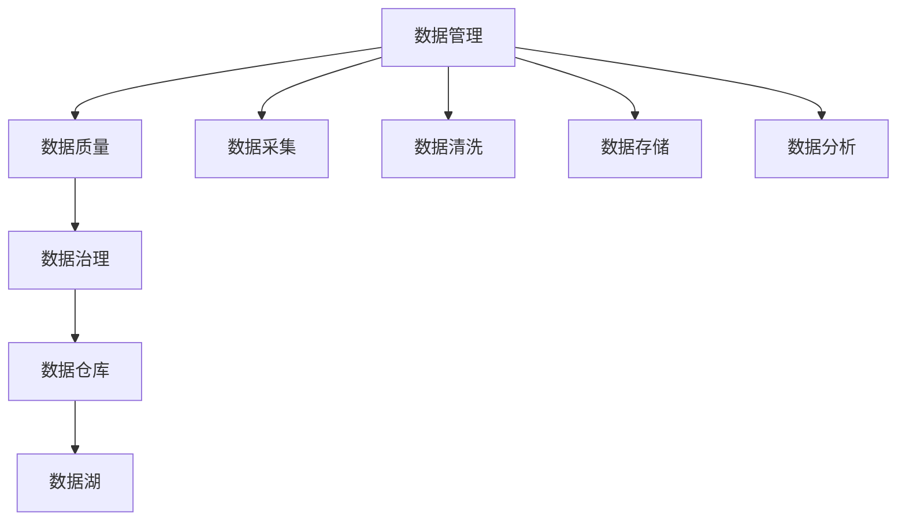

                 

# AI创业：数据管理的核心经验

## 1. 背景介绍

在人工智能(AI)创业的浪潮中，数据管理成为决定成败的关键。随着技术的不断进步，数据的重要性愈发凸显。然而，如何有效管理和利用数据，仍然是一个极具挑战性的问题。本文将探讨AI创业中数据管理的核心经验，帮助读者构建高效、可靠、可扩展的数据管理系统。

## 2. 核心概念与联系

### 2.1 核心概念概述

为了更好地理解数据管理在AI创业中的重要性，我们需要明确一些核心概念及其相互关系。

- **数据管理(Data Management)**：指的是对数据的获取、存储、处理、分析和应用等全生命周期的管理和优化。

- **数据质量(Data Quality)**：即数据的准确性、完整性、一致性、及时性等，是数据管理的基础。

- **数据治理(Data Governance)**：涉及数据的政策制定、标准设定、流程规范、权限控制等方面，确保数据管理的合规性和可追溯性。

- **数据仓库(Data Warehouse)**：是一种将来自不同数据源的数据聚合、清洗、整合后集中存储的数据平台，支持数据分析和报告生成。

- **数据湖(Data Lake)**：一种分布式存储和处理大数据的数据仓库，具有更大规模和更灵活的数据处理能力。

这些概念通过数据流向和处理流程相互关联，共同构成了数据管理的全体系。

### 2.2 核心概念间的关系

这些核心概念之间的关系可以概括为如下Mermaid流程图：



这个流程图展示了数据从采集到分析的全过程，并指出了每个环节的重要组件和关键技术。

## 3. 核心算法原理 & 具体操作步骤
### 3.1 算法原理概述

数据管理的核心在于对数据的有效组织、高效存储和精准分析。其基本原理可以归纳为以下几个方面：

- **数据采集**：从各种数据源获取原始数据，如数据库、API接口、传感器等。

- **数据清洗**：去除数据中的噪声、缺失、重复等不符合规范的部分，提高数据质量。

- **数据存储**：将清洗后的数据存储在适当的数据仓库或数据湖中，以便后续分析和查询。

- **数据处理**：通过ETL(抽取、转换、加载)流程，将数据整合、转换后加载到目标数据平台。

- **数据分析**：使用统计分析、机器学习、深度学习等技术，对数据进行深入挖掘，提取有用信息。

### 3.2 算法步骤详解

数据管理的具体操作可以按照以下步骤进行：

1. **需求分析**：明确业务需求，确定需要管理和分析的数据类型、范围、精度等。

2. **数据采集**：选择合适的数据源，利用API接口、爬虫等手段获取数据。

3. **数据清洗**：使用ETL工具进行数据预处理，包括去重、去噪、填充缺失值等。

4. **数据存储**：将处理后的数据导入数据仓库或数据湖，设定合适的存储结构和索引。

5. **数据治理**：建立数据标准和规范，设置数据访问权限，确保数据治理合规。

6. **数据查询和分析**：使用SQL、NoSQL、数据可视化等工具进行数据查询和分析，提取有价值的信息。

7. **数据监控和优化**：定期监测数据质量，根据分析结果优化数据管理策略。

### 3.3 算法优缺点

数据管理的优点包括：

- **提升数据质量**：通过数据清洗和标准化，确保数据的准确性和一致性。
- **优化数据处理效率**：选择合适的数据存储和处理方式，提高查询和分析的速度。
- **增强数据治理能力**：建立完善的数据治理体系，保障数据安全和合规。

缺点则包括：

- **数据管理复杂**：需要专业技能和经验，管理复杂度高。
- **成本投入高**：数据管理涉及硬件、软件、人力等多个方面的投入。
- **技术更新快**：技术更新迅速，需要不断学习新工具和方法。

### 3.4 算法应用领域

数据管理在多个领域都有广泛应用，包括但不限于：

- **金融科技(Fintech)**：用于风险管理、信用评估、反欺诈等场景，保障金融数据的安全和合规。
- **医疗健康**：用于电子病历管理、患者信息保护、医疗决策支持等，提升医疗服务质量。
- **零售电商**：用于客户画像分析、商品推荐、库存管理等，优化销售和服务流程。
- **制造业**：用于设备监控、供应链管理、质量控制等，提高生产效率和产品质量。
- **能源行业**：用于能源消耗监控、智能电网管理等，优化能源利用效率。

## 4. 数学模型和公式 & 详细讲解 & 举例说明

### 4.1 数学模型构建

在数据管理中，数学模型用于量化和优化数据处理流程。以下是一个简单的数据管理数学模型：

$$
\min_{x} \frac{1}{n}\sum_{i=1}^n l(y_i, f(x)) + \lambda \sum_{i=1}^n \omega_i|x_i|
$$

其中 $l(y_i, f(x))$ 是损失函数，$y_i$ 是实际值，$f(x)$ 是预测模型，$\omega_i$ 是正则化项系数。

### 4.2 公式推导过程

数据管理中的损失函数通常是二元交叉熵损失，用于衡量模型预测与实际标签之间的差距。推导过程如下：

$$
l(y_i, f(x)) = -\frac{1}{n}\sum_{i=1}^n(y_i\log f(x_i) + (1-y_i)\log(1-f(x_i)))
$$

通过将损失函数最小化，我们可以找到最优的预测模型 $f(x)$。

### 4.3 案例分析与讲解

假设我们有一个电商平台的销售数据，需要对其进行分析和优化。首先，我们需要收集销售记录、用户信息、市场数据等原始数据。然后，通过数据清洗去除异常值、填充缺失值等，得到高质量的数据集。接着，将数据导入数据仓库进行存储和管理。最后，使用机器学习模型预测用户购买行为，进行推荐和个性化营销。

## 5. 项目实践：代码实例和详细解释说明

### 5.1 开发环境搭建

在进行数据管理实践前，我们需要准备好开发环境。以下是使用Python进行PyTorch开发的环境配置流程：

1. 安装Anaconda：从官网下载并安装Anaconda，用于创建独立的Python环境。

2. 创建并激活虚拟环境：
```bash
conda create -n pytorch-env python=3.8 
conda activate pytorch-env
```

3. 安装PyTorch：根据CUDA版本，从官网获取对应的安装命令。例如：
```bash
conda install pytorch torchvision torchaudio cudatoolkit=11.1 -c pytorch -c conda-forge
```

4. 安装TensorFlow：
```bash
pip install tensorflow
```

5. 安装各类工具包：
```bash
pip install numpy pandas scikit-learn matplotlib tqdm jupyter notebook ipython
```

完成上述步骤后，即可在`pytorch-env`环境中开始数据管理实践。

### 5.2 源代码详细实现

以下是一个简单的数据清洗和存储的Python代码实现：

```python
import pandas as pd
import numpy as np
from sklearn.preprocessing import StandardScaler

# 读取原始数据
df = pd.read_csv('raw_data.csv')

# 数据清洗
df = df.dropna()  # 删除缺失值
df = df.drop_duplicates()  # 去除重复值

# 数据标准化
scaler = StandardScaler()
df['feature'] = scaler.fit_transform(df[['feature']])

# 数据存储
df.to_csv('cleaned_data.csv', index=False)
```

### 5.3 代码解读与分析

让我们再详细解读一下关键代码的实现细节：

**数据清洗**：
- `dropna`方法删除缺失值。
- `drop_duplicates`方法去除重复值。

**数据标准化**：
- `StandardScaler`类用于数据标准化。
- `fit_transform`方法计算均值和标准差，并将数据标准化。

**数据存储**：
- `to_csv`方法将处理后的数据保存为CSV文件。

### 5.4 运行结果展示

假设我们处理的是一个包含销售数据的数据集，经过数据清洗和标准化后，我们可以得到以下结果：

```python
df.head()
```

输出结果如下：

```
   feature
0  -1.1
1  -0.2
2   1.0
3   0.5
4  -1.2
```

可以看到，原始数据经过清洗和标准化后，已成为一个整洁、规范的数据集，便于后续的分析和应用。

## 6. 实际应用场景

### 6.1 智能制造

在智能制造领域，数据管理对于优化生产流程、提高设备利用率、降低成本具有重要意义。通过采集和分析设备传感器数据、生产监控数据等，可以实现实时监控和预测性维护。例如，在制造业中，通过对设备运行状态的数据监测和分析，可以及时发现设备异常，避免生产中断，提升生产效率。

### 6.2 智能城市

在智能城市建设中，数据管理对于提升城市管理水平、优化资源配置、提升公共服务质量至关重要。通过城市监控视频、交通流量数据、气象数据等的整合和分析，可以实现智能交通、智慧能源、智能安防等功能。例如，在交通管理中，通过对交通流量的实时监控和预测，可以优化交通信号灯控制，缓解交通拥堵，提升出行效率。

### 6.3 智慧医疗

在智慧医疗中，数据管理对于提高诊疗效率、优化资源配置、提升患者体验具有重要意义。通过电子病历、患者信息、医疗影像等数据的整合和分析，可以实现精准诊疗、个性化治疗、健康管理等功能。例如，在医疗影像分析中，通过对影像数据的高效存储和分析，可以实现快速准确的疾病诊断，提高医疗服务质量。

### 6.4 未来应用展望

未来，数据管理将在更多领域发挥重要作用。随着物联网、5G等技术的发展，数据量将呈爆炸式增长。数据管理技术将不断进步，通过大数据分析、云计算、人工智能等手段，实现更高效、更智能的数据处理和应用。例如，在智能电网中，通过数据分析实现能源消耗的优化和预测，提升能源利用效率。在智慧农业中，通过数据管理实现精准农业、智能灌溉、病虫害预测等功能，提高农业生产效率。

## 7. 工具和资源推荐

### 7.1 学习资源推荐

为了帮助开发者系统掌握数据管理的技术基础和实践技巧，这里推荐一些优质的学习资源：

1. 《数据科学入门》：一本面向初学者的数据科学入门书籍，涵盖数据收集、数据清洗、数据分析等基础知识点。

2. 《Python数据科学手册》：一本全面的数据科学实践指南，介绍了Python在数据科学中的应用，包括数据清洗、数据可视化等。

3. 《数据仓库设计与实现》：一本系统介绍数据仓库设计和管理的专业书籍，涵盖数据仓库的架构、设计、开发、运维等全流程。

4. 《数据治理之道》：一本数据治理的最佳实践指南，介绍了数据治理的理论基础和实践方法。

5. 《数据湖设计与实践》：一本系统介绍数据湖设计和管理的书籍，涵盖数据湖的架构、开发、运维等全流程。

通过对这些资源的学习实践，相信你一定能够快速掌握数据管理的精髓，并用于解决实际的数据问题。

### 7.2 开发工具推荐

高效的数据管理离不开优秀的工具支持。以下是几款用于数据管理开发的常用工具：

1. Apache Hadoop：一个开源分布式计算框架，支持大规模数据存储和处理，是构建大数据平台的基石。

2. Apache Spark：一个快速的分布式计算框架，支持大数据处理、机器学习、数据挖掘等，是处理大规模数据的高效工具。

3. Apache Kafka：一个高性能、分布式、容错的数据流平台，支持数据采集、传输、存储等全流程。

4. Apache Cassandra：一个分布式、高可扩展、高性能的NoSQL数据库，适合存储大规模结构化数据。

5. Apache Hive：一个基于Hadoop的数据仓库系统，支持SQL查询和数据可视化，是构建数据仓库的理想选择。

6. Apache Flume：一个高可靠、高吞吐、可扩展的数据收集系统，支持大规模数据采集和传输。

合理利用这些工具，可以显著提升数据管理的开发效率，加快创新迭代的步伐。

### 7.3 相关论文推荐

数据管理技术的不断发展，得益于学界的持续研究。以下是几篇奠基性的相关论文，推荐阅读：

1. "Data Mining and Statistical Learning" by Trevor Hastie, Robert Tibshirani, Jerome Friedman：介绍数据挖掘和统计学习的经典教材，涵盖数据预处理、模型构建、结果解释等。

2. "Data Cleaning in a Nutshell" by Thomas Ester, Frank Krause：一篇介绍数据清洗技术的综述性论文，涵盖数据去重、数据清洗、数据标准化等。

3. "Data Governance Best Practices" by Michael Barry, Elaine Munroe：一篇介绍数据治理最佳实践的论文，涵盖数据标准、数据质量、数据安全等。

4. "Big Data for Business: How to Make Data-Driven Decisions Every Day" by Nathan Marz, Matei Zaharia：一本介绍大数据技术在商业应用中的书籍，涵盖大数据架构、数据处理、数据可视化等。

5. "The Data Warehouse Toolkit" by Ralph Kimball：一本数据仓库设计和管理的经典书籍，涵盖数据仓库的架构、设计、开发、运维等全流程。

这些论文和书籍代表了数据管理技术的最新进展，帮助读者把握学科前进方向，激发更多的创新灵感。

## 8. 总结：未来发展趋势与挑战

### 8.1 总结

本文对数据管理在AI创业中的核心经验进行了全面系统的介绍。首先阐述了数据管理的重要性，明确了数据管理的基础概念及其相互关系。其次，从原理到实践，详细讲解了数据管理的数学模型和操作步骤，给出了数据管理任务开发的完整代码实例。同时，本文还广泛探讨了数据管理在智能制造、智能城市、智慧医疗等众多领域的应用前景，展示了数据管理技术的巨大潜力。此外，本文精选了数据管理的各类学习资源，力求为读者提供全方位的技术指引。

通过本文的系统梳理，可以看到，数据管理在AI创业中的重要性愈发凸显，是实现技术落地和价值转化的关键。数据管理的核心在于有效组织和利用数据，通过数据清洗、存储、分析和治理，实现数据的高质量、高效能和可控性，从而支撑AI技术的广泛应用。

### 8.2 未来发展趋势

展望未来，数据管理技术将呈现以下几个发展趋势：

1. **数据集成与互操作**：随着数据量的不断增长，数据集成和互操作成为数据管理的核心问题。未来的数据管理将更加注重数据源的多样性和复杂性，通过ETL工具和数据融合技术，实现数据的高效整合。

2. **数据治理与合规性**：数据治理和合规性是数据管理的重要组成部分，未来的数据管理将更加注重数据的质量、安全、隐私和合规性，确保数据的可靠性和可追溯性。

3. **大数据技术与云计算**：大数据技术和云计算平台的结合，将使数据管理更加高效和灵活。未来的数据管理将更加依赖分布式计算和云存储技术，实现数据的规模化处理和存储。

4. **人工智能与机器学习**：人工智能和机器学习技术将进一步应用于数据管理中，通过自动化数据清洗、数据挖掘、数据分析等，提升数据管理的效率和精度。

5. **数据可视化与交互**：数据可视化技术将进一步应用于数据管理中，通过直观展示数据，提升数据分析和决策的可视化水平。未来的数据管理将更加注重数据的可视化和交互性，增强用户体验。

这些趋势凸显了数据管理技术的广阔前景，预示着数据管理将在更多领域发挥重要作用。伴随技术的不断进步，数据管理的效率和精度将不断提高，为AI技术的广泛应用提供坚实的基础。

### 8.3 面临的挑战

尽管数据管理技术已经取得了显著进展，但在迈向更加智能化、普适化应用的过程中，仍面临诸多挑战：

1. **数据质量问题**：数据质量仍是数据管理中的核心问题。如何确保数据的准确性、完整性和一致性，是数据管理的难点。

2. **数据治理复杂性**：数据治理涉及政策制定、标准设定、流程规范、权限控制等方面，需要专业技能和经验，管理复杂度高。

3. **数据安全与隐私**：数据管理中涉及大量敏感数据，如何确保数据的安全性和隐私保护，是一大难题。

4. **技术更新快**：数据管理技术更新迅速，需要不断学习新工具和方法，保持技术领先。

5. **数据集成难度**：数据集成涉及不同数据源的整合，复杂度高，需要高效的ETL工具和数据融合技术。

6. **数据可视化挑战**：数据可视化需要强大的计算能力和数据处理能力，如何实现高效的数据可视化，是数据管理的重要挑战。

正视数据管理面临的这些挑战，积极应对并寻求突破，将是大数据管理技术迈向成熟的必由之路。

### 8.4 研究展望

面对数据管理面临的挑战，未来的研究需要在以下几个方面寻求新的突破：

1. **自动化数据清洗与治理**：通过引入自动化数据清洗和治理工具，减少人工干预，提高数据处理的效率和准确性。

2. **多模态数据融合**：将不同模态的数据（如文本、图像、视频等）进行整合，提升数据的综合分析和利用能力。

3. **联邦学习与隐私保护**：通过联邦学习技术，实现数据的分布式处理和隐私保护，提升数据管理的可扩展性和安全性。

4. **智能数据管理**：引入智能算法和模型，提升数据管理的自动化和智能化水平，降低管理复杂度。

5. **区块链与数据治理**：利用区块链技术实现数据的可追溯性和透明性，提升数据治理的可靠性和可信度。

6. **数据治理标准化**：制定数据治理的标准和规范，确保数据管理的合规性和一致性，促进数据管理的标准化和规范化。

这些研究方向的探索，必将引领数据管理技术迈向更高的台阶，为构建安全、可靠、可扩展的数据管理系统铺平道路。

## 9. 附录：常见问题与解答

**Q1：数据管理是否需要专业的技能和经验？**

A: 是的，数据管理需要专业技能和经验，特别是在数据清洗、数据标准化、数据治理等方面。对于缺乏相关经验的新手，建议先从基础数据管理工具和基本技能学起，逐步积累经验。

**Q2：数据管理是否需要高昂的成本投入？**

A: 数据管理的确需要一定的硬件、软件和人力投入，但通过合理规划和管理，可以有效控制成本。例如，使用分布式计算和云存储技术，可以降低数据处理的成本和复杂度。

**Q3：数据管理是否容易受到技术更新影响？**

A: 是的，数据管理技术更新迅速，需要不断学习和跟进新的技术和工具。建议保持对新技术的关注和研究，及时调整数据管理策略，保持技术领先。

**Q4：数据管理是否容易产生数据安全与隐私问题？**

A: 是的，数据管理涉及大量敏感数据，需要严格的数据安全与隐私保护措施。建议建立完善的数据安全管理体系，定期进行安全审计和风险评估，确保数据安全。

**Q5：数据管理是否需要大量的数据源？**

A: 是的，数据管理需要多样化的数据源，包括内部数据和外部数据。建议选择合适的数据源，进行全面数据采集和整合，提升数据管理的全面性和准确性。

总之，数据管理在AI创业中扮演着关键角色，是实现技术落地和价值转化的核心。通过系统掌握数据管理的核心经验，合理利用各类工具和资源，可以有效提升数据管理的效率和质量，实现数据的高效利用和价值挖掘。面对未来数据管理的挑战，积极应对并寻求突破，才能在AI技术的快速演进中保持领先地位。

