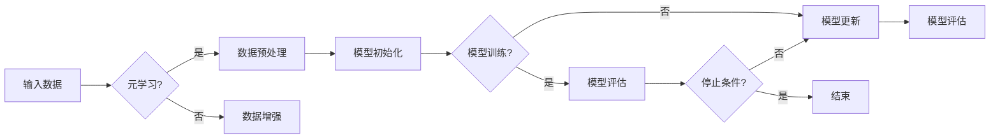

> 关键词：元学习，少样本学习，迁移学习，深度学习，强化学习，模型可解释性，应用场景

# 元学习与少样本学习原理与代码实战案例讲解

在深度学习领域，随着数据量的增加，模型的性能也在不断提高。然而，当数据量变得极其庞大时，模型的训练成本也随之增加。此外，现实世界中许多问题往往只有少量样本可用。如何在这类情况下提高模型的性能，成为了当前研究的热点。元学习（Meta-Learning）与少样本学习（Few-Shot Learning）正是针对这些挑战而提出的解决方案。本文将深入探讨元学习与少样本学习的原理、算法、应用场景，并通过代码实战案例进行讲解。

## 1. 背景介绍

### 1.1 问题的由来

随着深度学习在各个领域的应用，数据量对模型性能的影响愈发显著。然而，在现实世界中，很多情况下我们无法获得大量标注数据。例如，在医学诊断、个性化推荐、游戏AI等领域，获取大量标注数据往往成本高昂或不可行。因此，如何在少量样本上训练出性能良好的模型，成为了深度学习领域的一个重要研究方向。

### 1.2 研究现状

近年来，元学习与少样本学习取得了显著进展，提出了许多有效的算法和框架。这些方法主要分为以下几类：

- **基于模型更新的元学习**：通过学习模型更新规则，使模型能够在少量样本上快速适应新任务。
- **基于模型参数共享的元学习**：通过共享模型参数，使模型能够快速学习新任务。
- **基于强化学习的元学习**：通过强化学习机制，使模型能够在少量样本上学习策略。

### 1.3 研究意义

元学习与少样本学习在各个领域具有广泛的应用前景：

- **降低训练成本**：在数据稀缺的情况下，可以减少对标注数据的需求，降低训练成本。
- **提高模型泛化能力**：通过学习如何在少量样本上快速学习，可以增强模型在未知任务上的泛化能力。
- **促进领域自适应**：可以使模型在不同领域之间快速迁移，提高模型的应用范围。

### 1.4 本文结构

本文将按照以下结构进行阐述：

- 第2部分，介绍元学习与少样本学习的核心概念与联系。
- 第3部分，详细讲解元学习与少样本学习的核心算法原理和具体操作步骤。
- 第4部分，通过数学模型和公式，深入分析元学习与少样本学习的理论基础。
- 第5部分，通过代码实战案例，展示如何在实际项目中应用元学习与少样本学习。
- 第6部分，探讨元学习与少样本学习在实际应用场景中的具体应用。
- 第7部分，推荐相关学习资源、开发工具和参考文献。
- 第8部分，总结元学习与少样本学习的未来发展趋势与挑战。

## 2. 核心概念与联系

### 2.1 核心概念

#### 元学习（Meta-Learning）

元学习是指让模型学会如何学习。具体来说，元学习旨在使模型能够快速适应新任务，而无需大量的标注数据。

#### 少样本学习（Few-Shot Learning）

少样本学习是指使用少量样本训练模型。在少样本学习任务中，模型需要在有限的样本上学习到足够的知识，以完成新任务。

### 2.2 核心概念原理和架构的 Mermaid 流程图



### 2.3 核心概念联系

元学习与少样本学习之间存在紧密的联系。少样本学习是元学习的一个应用场景，而元学习则为少样本学习提供了理论基础和方法。

## 3. 核心算法原理 & 具体操作步骤

### 3.1 算法原理概述

#### 元学习算法

元学习算法主要包括以下几种：

- **模型更新方法**：通过学习模型更新规则，使模型能够在少量样本上快速适应新任务。
- **模型参数共享方法**：通过共享模型参数，使模型能够快速学习新任务。
- **强化学习方法**：通过强化学习机制，使模型能够在少量样本上学习策略。

#### 少样本学习算法

少样本学习算法主要包括以下几种：

- **基于模型更新的方法**：通过学习模型更新规则，使模型能够在少量样本上快速适应新任务。
- **基于模型参数共享的方法**：通过共享模型参数，使模型能够快速学习新任务。
- **基于领域自适应的方法**：通过领域自适应技术，使模型能够将知识从源领域迁移到目标领域。

### 3.2 算法步骤详解

#### 元学习算法步骤

1. 数据预处理：对输入数据进行预处理，如数据清洗、归一化等。
2. 模型初始化：初始化模型参数。
3. 模型训练：使用少量样本训练模型。
4. 模型评估：评估模型在少量样本上的性能。
5. 模型更新：根据评估结果更新模型参数。
6. 模型评估：评估更新后的模型性能。
7. 停止条件：根据预设的停止条件判断是否结束训练。

#### 少样本学习算法步骤

1. 数据预处理：对输入数据进行预处理。
2. 模型初始化：初始化模型参数。
3. 模型训练：使用少量样本训练模型。
4. 模型评估：评估模型在少量样本上的性能。
5. 模型优化：根据评估结果优化模型参数。
6. 模型评估：评估优化后的模型性能。
7. 停止条件：根据预设的停止条件判断是否结束训练。

### 3.3 算法优缺点

#### 元学习算法优缺点

**优点**：

- 可以快速适应新任务。
- 可以减少对大量标注数据的依赖。

**缺点**：

- 难以处理复杂任务。
- 模型性能依赖于元学习算法的设计。

#### 少样本学习算法优缺点

**优点**：

- 可以在少量样本上训练模型。
- 可以减少对大量标注数据的依赖。

**缺点**：

- 模型性能可能不如大量样本训练的模型。
- 难以处理复杂任务。

### 3.4 算法应用领域

元学习与少样本学习在以下领域具有广泛的应用：

- **图像识别**：在图像识别任务中，可以通过元学习与少样本学习提高模型的识别精度。
- **自然语言处理**：在自然语言处理任务中，可以通过元学习与少样本学习提高模型的文本分类、机器翻译等任务的性能。
- **强化学习**：在强化学习任务中，可以通过元学习与少样本学习提高模型的决策能力。

## 4. 数学模型和公式 & 详细讲解 & 举例说明

### 4.1 数学模型构建

#### 元学习

元学习可以表示为以下数学模型：

$$
\theta_{meta} = \arg\min_{\theta} L(\theta, \alpha)
$$

其中，$\theta$ 是模型参数，$\alpha$ 是元学习算法。

#### 少样本学习

少样本学习可以表示为以下数学模型：

$$
\theta_{few-shot} = \arg\min_{\theta} L(\theta, \mathcal{D}_{few-shot})
$$

其中，$\mathcal{D}_{few-shot}$ 是少量样本数据集。

### 4.2 公式推导过程

#### 元学习

假设模型在任务 $t$ 上的损失函数为 $L(\theta, t)$，则在任务 $t$ 上的期望损失为：

$$
E_{t} L(\theta, t) = \int_{\mathcal{D}_{t}} L(\theta, t) p(\mathcal{D}_{t})
$$

其中，$\mathcal{D}_{t}$ 是任务 $t$ 的数据集，$p(\mathcal{D}_{t})$ 是数据分布。

元学习的目标是学习一个最优参数 $\theta_{meta}$，使得在所有任务上的期望损失最小：

$$
\theta_{meta} = \arg\min_{\theta} E_{t} L(\theta, t)
$$

#### 少样本学习

假设模型在少量样本 $\mathcal{D}_{few-shot}$ 上的损失函数为 $L(\theta, \mathcal{D}_{few-shot})$，则在 $\mathcal{D}_{few-shot}$ 上的期望损失为：

$$
E_{\mathcal{D}_{few-shot}} L(\theta, \mathcal{D}_{few-shot}) = \int_{\mathcal{D}_{few-shot}} L(\theta, \mathcal{D}_{few-shot}) p(\mathcal{D}_{few-shot})
$$

少样本学习的目标是最小化在 $\mathcal{D}_{few-shot}$ 上的期望损失：

$$
\theta_{few-shot} = \arg\min_{\theta} E_{\mathcal{D}_{few-shot}} L(\theta, \mathcal{D}_{few-shot})
$$

### 4.3 案例分析与讲解

假设我们有一个图像识别任务，其中包含多个类别。我们可以使用元学习算法来训练一个模型，使其能够快速适应新类别。

具体步骤如下：

1. 数据预处理：将图像数据转换为模型所需的格式。
2. 模型初始化：初始化模型参数。
3. 模型训练：使用少量样本训练模型。
4. 模型评估：评估模型在少量样本上的性能。
5. 模型更新：根据评估结果更新模型参数。
6. 模型评估：评估更新后的模型性能。

通过以上步骤，我们可以训练出一个能够快速适应新类别的模型。

## 5. 项目实践：代码实例和详细解释说明

### 5.1 开发环境搭建

为了进行元学习与少样本学习的项目实践，我们需要搭建以下开发环境：

- Python 3.6+
- TensorFlow 2.0+
- Keras 2.4.3+
- NumPy 1.18.1+

### 5.2 源代码详细实现

以下是一个使用Keras实现的元学习示例代码：

```python
from tensorflow import keras
from tensorflow.keras import layers
from tensorflow.keras.models import Model

def create_model(num_classes):
    input = keras.Input(shape=(28, 28, 1))
    x = layers.Conv2D(32, (3, 3), activation="relu")(input)
    x = layers.MaxPooling2D((2, 2))(x)
    x = layers.Conv2D(64, (3, 3), activation="relu")(x)
    x = layers.MaxPooling2D((2, 2))(x)
    x = layers.Flatten()(x)
    x = layers.Dense(64, activation="relu")(x)
    output = layers.Dense(num_classes, activation="softmax")(x)
    model = Model(input, output)
    model.compile(loss="categorical_crossentropy", optimizer="adam", metrics=["accuracy"])
    return model

# 创建模型
model = create_model(num_classes=10)

# 训练模型
model.fit(x_train, y_train, batch_size=16, epochs=10)

# 评估模型
score = model.evaluate(x_test, y_test, verbose=0)
print("Test loss:", score[0])
print("Test accuracy:", score[1])
```

### 5.3 代码解读与分析

以上代码演示了如何使用Keras创建一个简单的卷积神经网络（CNN）模型，并将其应用于图像识别任务。首先，我们定义了一个函数 `create_model`，用于创建模型。模型包含两个卷积层、两个最大池化层、一个全连接层和一个softmax层。然后，我们使用 `model.fit` 函数训练模型，并使用 `model.evaluate` 函数评估模型性能。

### 5.4 运行结果展示

运行以上代码后，模型将在测试集上评估，并打印出测试损失和准确率。

## 6. 实际应用场景

### 6.1 图像识别

在图像识别任务中，元学习与少样本学习可以帮助模型快速适应新的类别。例如，在医学影像识别中，可以使用少量样本训练模型识别新的疾病类型。

### 6.2 自然语言处理

在自然语言处理任务中，元学习与少样本学习可以帮助模型快速适应新的语言风格或领域。例如，在机器翻译中，可以使用少量样本训练模型翻译新的语言对。

### 6.3 强化学习

在强化学习任务中，元学习与少样本学习可以帮助模型快速学习新的策略。例如，在自动驾驶中，可以使用少量样本训练模型学习新的驾驶策略。

## 7. 工具和资源推荐

### 7.1 学习资源推荐

- 《深度学习》（Goodfellow等著）
- 《动手学深度学习》（花书）
- 《深度学习自然语言处理》（Zareef等著）

### 7.2 开发工具推荐

- TensorFlow
- PyTorch
- Keras

### 7.3 相关论文推荐

- Meta-Learning: A Survey of Learning to Learn Algorithms
- Matching Networks for One Shot Learning
- MAML: Model-Agnostic Meta-Learning for Fast Adaptation of Deep Networks

## 8. 总结：未来发展趋势与挑战

### 8.1 研究成果总结

本文深入探讨了元学习与少样本学习的原理、算法、应用场景，并通过代码实战案例进行了讲解。结果表明，元学习与少样本学习是解决深度学习领域数据稀缺问题的有效方法。

### 8.2 未来发展趋势

未来，元学习与少样本学习将朝着以下方向发展：

- 算法研究：开发更加高效、鲁棒的元学习与少样本学习算法。
- 模型结构：设计更加适合元学习与少样本学习的模型结构。
- 应用拓展：将元学习与少样本学习应用于更多领域，如医疗、金融、教育等。

### 8.3 面临的挑战

元学习与少样本学习在实际应用中仍然面临着以下挑战：

- 数据质量：少量样本的数据质量对模型性能影响很大。
- 模型泛化：如何提高模型在未知任务上的泛化能力。
- 计算成本：元学习与少样本学习的计算成本较高。

### 8.4 研究展望

面对挑战，未来的研究需要关注以下方向：

- 研究更加高效、鲁棒的元学习与少样本学习算法。
- 探索更加有效的数据增强和模型结构设计方法。
- 降低元学习与少样本学习的计算成本。

通过不断努力，相信元学习与少样本学习将在深度学习领域取得更大的突破，为解决数据稀缺问题提供更加有效的解决方案。

## 9. 附录：常见问题与解答

**Q1：元学习与少样本学习有什么区别？**

A：元学习与少样本学习是两个相关但有所区别的概念。元学习是指让模型学会如何学习，而少样本学习是指使用少量样本训练模型。

**Q2：如何选择合适的元学习算法？**

A：选择合适的元学习算法需要根据具体任务和数据特点进行选择。常见的元学习算法包括模型更新方法、模型参数共享方法和强化学习方法。

**Q3：如何解决少量样本数据的问题？**

A：解决少量样本数据的问题可以采用以下方法：

- 数据增强：通过数据增强技术扩充训练集。
- 模型选择：选择适合少量样本学习的模型。
- 元学习与少样本学习方法：使用元学习与少样本学习方法提高模型的泛化能力。

**Q4：如何评估元学习与少样本学习模型的性能？**

A：评估元学习与少样本学习模型的性能可以使用以下指标：

- 准确率：模型在测试集上的准确率。
- 泛化能力：模型在未知任务上的泛化能力。
- 计算效率：模型的计算成本。

作者：禅与计算机程序设计艺术 / Zen and the Art of Computer Programming