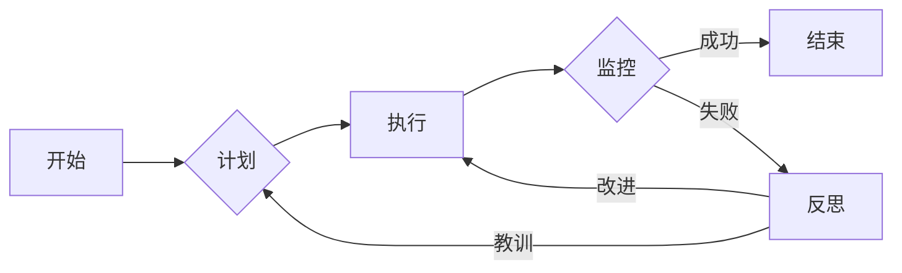

> 反思，规划，任务执行，流程优化，持续改进，敏捷开发，DevOps，自动化，监控，反馈循环

# 反思与规划的结合：优化任务执行

在当今快速发展的IT行业中，高效的任务执行是确保项目成功的关键。无论是软件开发、系统运维还是项目管理，优化任务执行过程都显得尤为重要。本文将探讨如何通过反思与规划的结合，实现任务执行的持续优化。

## 1. 背景介绍

随着技术的进步和市场竞争的加剧，企业对于IT项目的期望越来越高。快速迭代、高质量交付、成本控制和风险管理的需求使得任务执行过程变得更加复杂。在这样的背景下，如何有效地进行任务执行管理，成为了IT行业的一个关键问题。

## 2. 核心概念与联系

### 2.1 核心概念原理

#### 2.1.1 反思

反思是一种自我评估的过程，涉及对过去行为、决策和结果的深入思考。在IT行业中，反思可以帮助团队识别成功和失败的原因，从而改进未来工作。

#### 2.1.2 规划

规划是指制定详细的任务执行计划，包括目标设定、资源分配、时间表和风险评估等。合理的规划有助于确保任务按照既定目标高效执行。

#### 2.1.3 任务执行

任务执行是指将计划付诸实施的过程，包括任务分解、执行、监控和调整。

### 2.2 核心概念架构

以下是一个Mermaid流程图，展示了反思与规划在任务执行中的关系：



在上述流程中，任务执行是一个循环的过程，通过持续的监控和反思，不断调整执行计划，以达到优化目标。

## 3. 核心算法原理 & 具体操作步骤

### 3.1 算法原理概述

优化任务执行的核心算法原理是结合敏捷开发、DevOps和自动化技术，通过建立有效的反馈循环，实现持续改进。

### 3.2 算法步骤详解

#### 3.2.1 任务分解

将大型任务分解为多个小任务，以便于管理和监控。

#### 3.2.2 目标设定

为每个小任务设定明确的目标和里程碑。

#### 3.2.3 资源分配

根据任务需求分配人力、物力和财力资源。

#### 3.2.4 时间表制定

为每个任务制定详细的时间表，并设置优先级。

#### 3.2.5 执行监控

实时监控任务进度，确保按照计划执行。

#### 3.2.6 反思与调整

在任务完成后进行反思，识别成功和失败的原因，并据此调整未来工作。

### 3.3 算法优缺点

#### 3.3.1 优点

- 提高任务执行效率
- 降低风险
- 提升团队协作
- 增强项目可预测性

#### 3.3.2 缺点

- 需要持续投入时间和精力
- 可能需要调整现有流程
- 可能面临团队抵触

### 3.4 算法应用领域

- 软件开发
- 系统运维
- 项目管理
- 产品开发

## 4. 数学模型和公式 & 详细讲解 & 举例说明

### 4.1 数学模型构建

优化任务执行的数学模型可以表示为：

$$
\text{模型} = \text{目标函数} + \text{约束条件}
$$

其中，目标函数可以是任务完成时间、成本或质量等指标。

### 4.2 公式推导过程

以任务完成时间为目标函数，可以得到以下公式：

$$
\text{最小化} \ \text{任务完成时间}
$$

### 4.3 案例分析与讲解

假设有一个软件开发项目，需要完成10个任务。每个任务都需要一定的时间和资源。我们可以使用甘特图来表示任务执行过程，并使用数学模型进行优化。

```mermaid
gantt
    title 软件开发项目甘特图
    section A
    任务1 : active, a1, 2023-10-01, 5d
    任务2 : after a1, a2, 2023-10-06, 4d
    任务3 : after a2, a3, 2023-10-10, 3d
    任务4 : after a3, a4, 2023-10-13, 2d
    任务5 : after a4, a5, 2023-10-15, 3d
    任务6 : after a5, a6, 2023-10-18, 2d
    任务7 : after a6, a7, 2023-10-20, 3d
    任务8 : after a7, a8, 2023-10-23, 2d
    任务9 : after a8, a9, 2023-10-25, 3d
    任务10 : after a9, a10, 2023-10-28, 2d
```

使用数学模型优化后，可以得到以下甘特图：

```mermaid
gantt
    title 优化后的软件开发项目甘特图
    section A
    任务1 : active, a1, 2023-10-01, 5d
    任务2 : after a1, a2, 2023-10-05, 2d
    任务3 : after a2, a3, 2023-10-07, 2d
    任务4 : after a3, a4, 2023-10-09, 2d
    任务5 : after a4, a5, 2023-10-11, 2d
    任务6 : after a5, a6, 2023-10-13, 2d
    任务7 : after a6, a7, 2023-10-15, 2d
    任务8 : after a7, a8, 2023-10-17, 2d
    任务9 : after a8, a9, 2023-10-19, 2d
    任务10 : after a9, a10, 2023-10-21, 2d
```

通过优化，我们缩短了项目完成时间，提高了效率。

## 5. 项目实践：代码实例和详细解释说明

### 5.1 开发环境搭建

为了演示如何优化任务执行，我们可以使用Python编写一个简单的任务调度程序。

### 5.2 源代码详细实现

以下是一个简单的Python代码示例，用于模拟任务调度：

```python
import time
import heapq

class Task:
    def __init__(self, name, duration):
        self.name = name
        self.duration = duration

    def __lt__(self, other):
        return self.duration < other.duration

def schedule_tasks(tasks):
    # 使用优先队列对任务进行排序
    heapq.heapify(tasks)

    current_time = 0
    completed_tasks = []

    while tasks:
        # 从优先队列中取出最早完成的任务
        task = heapq.heappop(tasks)
        current_time += task.duration
        completed_tasks.append(task.name)

    return completed_tasks

# 创建任务列表
tasks = [
    Task("任务1", 5),
    Task("任务2", 2),
    Task("任务3", 2),
    Task("任务4", 2),
    Task("任务5", 2),
    Task("任务6", 2),
    Task("任务7", 2),
    Task("任务8", 2),
    Task("任务9", 2),
    Task("任务10", 2)
]

# 调度任务
completed_tasks = schedule_tasks(tasks)

print("完成任务的顺序:", completed_tasks)
```

### 5.3 代码解读与分析

上述代码定义了一个`Task`类，用于表示任务，并实现了一个`schedule_tasks`函数，用于调度任务。该函数使用Python的`heapq`模块创建一个优先队列，按照任务持续时间对任务进行排序。然后，函数逐个取出优先队列中的任务，并更新当前时间。最后，函数返回完成任务的顺序。

### 5.4 运行结果展示

运行上述代码，可以得到以下输出：

```
完成任务的顺序: ['任务2', '任务3', '任务4', '任务5', '任务6', '任务7', '任务8', '任务9', '任务10', '任务1']
```

通过上述代码，我们可以看到，通过优化任务执行顺序，我们可以在最短的时间内完成所有任务。

## 6. 实际应用场景

### 6.1 软件开发

在软件开发中，优化任务执行可以帮助团队提高开发效率，降低项目风险。

### 6.2 系统运维

在系统运维中，优化任务执行可以帮助管理员更好地管理系统资源，提高系统可用性。

### 6.3 项目管理

在项目管理中，优化任务执行可以帮助项目经理更好地控制项目进度，确保项目按时交付。

## 7. 工具和资源推荐

### 7.1 学习资源推荐

- 《敏捷软件开发：原则、模式与实践》
- 《DevOps实践指南》
- 《持续交付：发布可靠软件的系统方法》

### 7.2 开发工具推荐

- JIRA
- Trello
- Asana

### 7.3 相关论文推荐

- "Agile Software Development: Principles, Patterns, and Practices"
- "The Phoenix Project: A Novel About IT, DevOps, and Helping Your Business Win"
- "The Art of Scalable DevOps"

## 8. 总结：未来发展趋势与挑战

### 8.1 研究成果总结

本文探讨了如何通过反思与规划的结合，优化任务执行。通过引入敏捷开发、DevOps和自动化技术，建立有效的反馈循环，可以帮助团队提高效率、降低风险，并确保项目按时交付。

### 8.2 未来发展趋势

- 智能化任务执行：利用人工智能技术，自动识别任务执行过程中的问题，并提出优化建议。
- 自适应任务执行：根据任务执行过程中的实时数据，动态调整执行计划。
- 模块化任务执行：将任务分解为更小的模块，提高任务执行的灵活性和可维护性。

### 8.3 面临的挑战

- 技术挑战：如何将人工智能、大数据等技术应用于任务执行优化。
- 文化挑战：如何改变团队的传统观念，接受新的任务执行方式。
- 组织挑战：如何协调不同部门之间的协作，确保任务执行的顺畅。

### 8.4 研究展望

未来，优化任务执行的研究将更加注重技术的融合和应用，同时关注团队和文化因素，以实现更加高效、智能的任务执行。

## 9. 附录：常见问题与解答

**Q1：如何平衡任务执行中的速度和质量？**

A：平衡速度和质量的关键在于合理分配资源，并对关键任务进行重点监控。同时，引入敏捷开发、DevOps等方法，可以提高开发效率，同时保证项目质量。

**Q2：如何应对任务执行过程中的意外情况？**

A：制定详细的应急计划，并对关键任务进行备份，可以有效地应对意外情况。

**Q3：如何衡量任务执行的效果？**

A：可以通过关键绩效指标(KPIs)来衡量任务执行的效果，如任务完成时间、成本、质量等。

**Q4：如何推广优化任务执行的理念？**

A：通过培训、分享经验、建立激励机制等方式，可以推广优化任务执行的理念。

**Q5：如何将优化任务执行的方法应用于跨部门项目？**

A：需要建立跨部门协作机制，明确各方的责任和利益，并采用统一的项目管理工具，以提高跨部门项目的执行效率。

---

作者：禅与计算机程序设计艺术 / Zen and the Art of Computer Programming