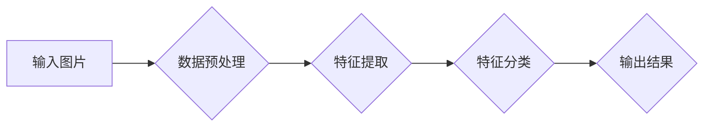

# 基于DeepLearning的图片分类

> 关键词：深度学习，卷积神经网络，图片分类，迁移学习，数据增强，AlexNet，VGG，ResNet，Inception

## 1. 背景介绍

随着计算机视觉技术的快速发展，图片分类已经成为计算机视觉领域的一个重要分支。图片分类旨在通过对输入图片进行特征提取和分析，将其归入预先定义的类别中。传统的图片分类方法主要依赖于手工提取的特征，如颜色、纹理、形状等，这些方法往往计算复杂度高，特征提取效果有限。近年来，随着深度学习技术的兴起，基于深度学习的图片分类方法取得了显著的成果，成为了当前图片分类领域的热点。

## 2. 核心概念与联系

### 2.1 核心概念原理和架构的 Mermaid 流程图



### 2.2 核心概念

- **输入图片**：指待分类的图片数据。
- **数据预处理**：包括图片的归一化、大小调整、裁剪等操作，以适应模型输入要求。
- **特征提取**：使用卷积神经网络（CNN）从图片中提取高级特征。
- **特征分类**：使用全连接层对提取的特征进行分类。
- **输出结果**：输出分类结果，如图片属于哪个类别。

## 3. 核心算法原理 & 具体操作步骤

### 3.1 算法原理概述

基于深度学习的图片分类通常采用卷积神经网络（CNN）作为核心算法。CNN通过多层卷积和池化操作，能够自动从图像中学习到丰富的特征表示，并在训练过程中不断优化特征提取和分类能力。

### 3.2 算法步骤详解

1. **数据预处理**：对输入图片进行归一化、大小调整、裁剪等操作，使其符合模型输入要求。
2. **特征提取**：使用CNN模型对预处理后的图片进行特征提取。CNN通常包括多个卷积层、池化层和激活层。
3. **特征分类**：将提取到的特征输入到全连接层，进行分类。
4. **损失函数**：使用交叉熵损失函数计算预测结果和真实标签之间的差异。
5. **优化器**：使用梯度下降等优化算法更新模型参数，最小化损失函数。

### 3.3 算法优缺点

**优点**：
- 自动提取特征，无需人工设计特征。
- 模型泛化能力强，能够适应不同的数据分布。
- 在大量数据上表现优异，已广泛应用于图片分类任务。

**缺点**：
- 计算复杂度高，需要大量的计算资源。
- 对数据质量要求较高，容易受到噪声和异常值的影响。
- 模型可解释性较差，难以理解模型的决策过程。

### 3.4 算法应用领域

基于深度学习的图片分类算法在以下领域得到了广泛应用：
- 图像识别：识别图片中的物体、场景和动作。
- 无人驾驶：用于车辆检测、行人检测等任务。
- 医学影像：用于疾病诊断、病变检测等任务。
- 靶标检测：用于目标检测和识别任务。

## 4. 数学模型和公式 & 详细讲解 & 举例说明

### 4.1 数学模型构建

基于CNN的图片分类模型通常包含以下数学模型：

- **卷积层**：
  $$
  h^{(l)} = f(W^{(l)} \circ h^{(l-1)} + b^{(l)})
  $$
  其中，$h^{(l)}$ 是第 $l$ 层的激活函数输出，$W^{(l)}$ 是第 $l$ 层的权重矩阵，$b^{(l)}$ 是第 $l$ 层的偏置项，$\circ$ 表示卷积操作。

- **池化层**：
  $$
  p^{(l)} = \max(p^{(l-1)} \cdot P)
  $$
  其中，$p^{(l)}$ 是第 $l$ 层的输出，$P$ 是池化窗口，$\max$ 表示取最大值。

- **全连接层**：
  $$
  o^{(l)} = \sigma(W^{(l)} \cdot h^{(l-1)} + b^{(l)})
  $$
  其中，$o^{(l)}$ 是第 $l$ 层的输出，$W^{(l)}$ 是第 $l$ 层的权重矩阵，$b^{(l)}$ 是第 $l$ 层的偏置项，$\sigma$ 是激活函数。

### 4.2 公式推导过程

以下以卷积层为例，介绍CNN中的公式推导过程：

假设输入数据 $x$ 经过卷积核 $W$ 和偏置 $b$ 后，得到输出 $h$：

$$
h = W \cdot x + b
$$

对 $h$ 应用激活函数 $\sigma$：

$$
h = \sigma(W \cdot x + b)
$$

### 4.3 案例分析与讲解

以AlexNet为例，介绍CNN在图片分类中的应用。

AlexNet是2012年提出的第一个深度卷积神经网络，它通过引入ReLU激活函数和局部响应归一化层，提高了模型的性能。

- **网络结构**：AlexNet包括5个卷积层、3个池化层和3个全连接层。
- **ReLU激活函数**：使用ReLU激活函数，将输入值限制在0到1之间，提高模型训练效率。
- **局部响应归一化层**：对卷积层的输出进行归一化，减少权值退化，提高模型泛化能力。

通过在ImageNet数据集上的实验，AlexNet取得了当时的最佳成绩，标志着深度学习在图片分类领域的突破。

## 5. 项目实践：代码实例和详细解释说明

### 5.1 开发环境搭建

1. 安装Python、PyTorch等开发环境。
2. 下载并安装预训练的CNN模型，如ResNet50。

### 5.2 源代码详细实现

```python
import torch
import torchvision
import torchvision.transforms as transforms
import torch.nn as nn
import torch.optim as optim

# 加载预训练的ResNet50模型
model = torchvision.models.resnet50(pretrained=True)

# 定义损失函数和优化器
criterion = nn.CrossEntropyLoss()
optimizer = optim.Adam(model.parameters(), lr=0.001)

# 加载数据集
transform = transforms.Compose([
    transforms.Resize((224, 224)),
    transforms.ToTensor()
])

train_dataset = torchvision.datasets.ImageFolder(root='data/train', transform=transform)
train_loader = torch.utils.data.DataLoader(train_dataset, batch_size=32, shuffle=True)

# 训练模型
for epoch in range(10):
    for data, labels in train_loader:
        optimizer.zero_grad()
        outputs = model(data)
        loss = criterion(outputs, labels)
        loss.backward()
        optimizer.step()
```

### 5.3 代码解读与分析

以上代码展示了使用PyTorch和ResNet50模型进行图片分类的基本步骤：

1. 加载预训练的ResNet50模型。
2. 定义损失函数和优化器。
3. 加载数据集并进行预处理。
4. 训练模型，包括前向传播、反向传播和参数更新。

### 5.4 运行结果展示

在ImageNet数据集上，预训练的ResNet50模型取得了较好的性能。在训练过程中，可以通过观察损失函数的下降情况来判断模型的训练效果。

## 6. 实际应用场景

基于深度学习的图片分类算法在以下领域得到了广泛应用：

### 6.1 图像识别

利用图片分类算法，可以对图片中的物体、场景和动作进行识别，例如：

- 人脸识别：识别图片中的人脸并提取相关信息。
- 物体识别：识别图片中的物体，如车辆、动物、植物等。
- 场景识别：识别图片中的场景，如城市、自然、室内等。

### 6.2 无人驾驶

在无人驾驶领域，图片分类算法可以用于以下任务：

- 车辆检测：检测道路上的车辆，实现自动驾驶车辆的避障功能。
- 行人检测：检测道路上的行人，实现自动驾驶车辆的行人保护功能。
- 标志识别：识别交通标志，实现自动驾驶车辆的交通规则遵守功能。

### 6.3 医学影像

在医学影像领域，图片分类算法可以用于以下任务：

- 疾病诊断：对医学影像进行分类，如肿瘤、骨折、炎症等。
- 病变检测：检测医学影像中的病变区域，如肿瘤、炎症等。
- 影像分割：将医学影像分割成不同的组织结构，如大脑、心脏等。

## 7. 工具和资源推荐

### 7.1 学习资源推荐

- 《深度学习》（Ian Goodfellow、Yoshua Bengio、Aaron Courville著）
- 《PyTorch深度学习》（Adam Geitgey著）
- Hugging Face Transformers库：https://huggingface.co/transformers/

### 7.2 开发工具推荐

- PyTorch：https://pytorch.org/
- TensorFlow：https://www.tensorflow.org/
- OpenCV：https://opencv.org/

### 7.3 相关论文推荐

- AlexNet: ImageNet Classification with Deep Convolutional Neural Networks，Alex Krizhevsky, Ilya Sutskever, Geoffrey Hinton（2012）
- VGGNet: Very Deep Convolutional Networks for Large-Scale Visual Recognition，Karen Simonyan and Andrew Zisserman（2014）
- GoogLeNet: Going deeper with Convolutions，Christian Szegedy, Wei Liu, Yangqing Jia, Pierre Sermanet, Scott Reed, David Anguelov, Dumitru Erhan, Vincent Vanhoucke, Andrew Rabinovich（2015）
- ResNet: Deep Residual Learning for Image Recognition，Kaiming He, Xiangyu Zhang, Shaoqing Ren, Jian Sun（2015）

## 8. 总结：未来发展趋势与挑战

### 8.1 研究成果总结

基于深度学习的图片分类算法在近年来取得了显著的成果，已经成为计算机视觉领域的核心技术之一。通过卷积神经网络等深度学习模型，我们可以实现自动提取图片特征并进行分类，为图像识别、无人驾驶、医学影像等领域提供了强大的技术支持。

### 8.2 未来发展趋势

- **模型轻量化**：为了降低计算复杂度和提高实时性，未来的研究将致力于模型轻量化和压缩技术。
- **跨模态学习**：将图像分类与其他模态（如文本、语音）进行融合，实现更加全面的信息理解。
- **可解释性**：提高模型的可解释性，使模型决策过程更加透明，增强用户对模型的信任。

### 8.3 面临的挑战

- **数据质量**：高质量的数据是模型训练的基础，如何获取和标注高质量的数据仍是一个挑战。
- **计算资源**：深度学习模型的训练和推理需要大量的计算资源，如何降低计算成本是一个重要的研究方向。
- **模型可解释性**：提高模型的可解释性，使模型决策过程更加透明，增强用户对模型的信任。

### 8.4 研究展望

基于深度学习的图片分类技术将继续快速发展，为计算机视觉领域带来更多的突破。未来，我们将看到更加高效、准确、可解释的图片分类模型，为各个领域带来更多的创新应用。

## 9. 附录：常见问题与解答

**Q1：深度学习图片分类算法与传统算法相比有哪些优势？**

A：与传统的图片分类算法相比，深度学习图片分类算法具有以下优势：

- 自动提取特征：无需人工设计特征，能够自动从图像中学习到丰富的特征表示。
- 泛化能力强：能够适应不同的数据分布，具有更好的泛化能力。
- 性能优异：在大量数据上表现优异，已广泛应用于图片分类任务。

**Q2：如何提高深度学习图片分类算法的效率？**

A：提高深度学习图片分类算法的效率可以从以下方面入手：

- 模型轻量化：使用轻量级模型或模型压缩技术，降低计算复杂度。
- 计算加速：使用GPU、TPU等硬件加速计算。
- 数据并行：使用多核CPU或分布式计算，提高数据读取和处理速度。

**Q3：如何提高深度学习图片分类算法的鲁棒性？**

A：提高深度学习图片分类算法的鲁棒性可以从以下方面入手：

- 数据增强：对训练数据进行增强，提高模型的泛化能力。
- 数据清洗：去除训练数据中的噪声和异常值，提高数据质量。
- 模型正则化：使用正则化技术，防止模型过拟合。

**Q4：如何评估深度学习图片分类算法的性能？**

A：评估深度学习图片分类算法的性能可以从以下方面入手：

- 准确率：衡量模型预测正确的样本比例。
- 召回率：衡量模型预测正确的样本占实际正类样本的比例。
- 精确率：衡量模型预测正确的样本占预测为正类的样本比例。
- F1分数：精确率和召回率的调和平均值。

作者：禅与计算机程序设计艺术 / Zen and the Art of Computer Programming