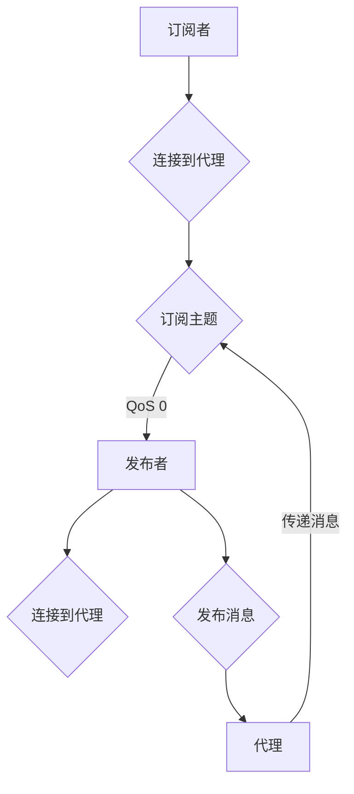

# 基于Java的智能家居设计：如何使用MQTT协议实现设备通讯

> 关键词：智能家居，MQTT协议，Java，设备通讯，物联网，消息队列，MQTT客户端，嵌入式系统

## 1. 背景介绍

随着物联网（IoT）技术的快速发展，智能家居系统逐渐成为人们日常生活的一部分。智能家居系统通过将家庭中的各种设备连接起来，实现设备之间的数据交换和远程控制，从而提供更加便捷、舒适和智能的生活体验。MQTT（Message Queuing Telemetry Transport）协议作为一种轻量级的消息传输协议，因其低功耗、低带宽和可伸缩等特点，成为智能家居设备通讯的理想选择。

本文将介绍如何使用Java实现智能家居系统中的设备通讯，重点讲解如何利用MQTT协议进行设备间的消息传递。通过本文的学习，读者将能够了解MQTT协议的基本原理，掌握使用Java开发MQTT客户端的方法，并能够将MQTT协议应用于实际的智能家居项目中。

## 2. 核心概念与联系

### 2.1 MQTT协议原理

MQTT是一种基于发布/订阅模式的轻量级消息传输协议，它允许设备之间进行异步消息传递。以下是MQTT协议的核心概念和流程：

- **主题（Topic）**：MQTT中的消息按照主题进行分类。发布者（Publisher）将消息发布到特定的主题上，订阅者（Subscriber）则订阅感兴趣的特定主题，以便接收相关消息。
- **质量等级（Quality of Service, QoS）**：MQTT协议定义了三种质量等级，用于控制消息的传输可靠性。
  - QoS 0：最多一次传输
  - QoS 1：至少一次传输
  - QoS 2：仅一次传输
- **发布/订阅流程**：
  1. 订阅者连接到MQTT代理（Broker）。
  2. 订阅者订阅感兴趣的主题。
  3. 发布者将消息发布到特定主题。
  4. 代理将消息传递给所有订阅该主题的订阅者。

Mermaid流程图如下：



### 2.2 Java与MQTT

Java作为一种跨平台的编程语言，具有良好的生态系统和丰富的库资源。在智能家居设计中，Java可以用来开发MQTT客户端，实现设备的连接、消息的订阅和发布。

## 3. 核心算法原理 & 具体操作步骤

### 3.1 算法原理概述

使用Java实现MQTT客户端的原理主要包括以下几个步骤：

1. 创建MQTT客户端实例。
2. 设置MQTT连接参数，如代理地址、端口、用户名、密码等。
3. 建立与MQTT代理的连接。
4. 订阅感兴趣的Topic。
5. 发布消息到指定的Topic。
6. 监听消息，并处理接收到的消息。
7. 断开与MQTT代理的连接。

### 3.2 算法步骤详解

以下是使用Java实现MQTT客户端的具体步骤：

1. **添加MQTT客户端库**

   首先，需要在项目中添加MQTT客户端库。由于Java没有官方的MQTT客户端库，我们可以使用开源的MQTT客户端库，如Paho MQTT。

2. **创建MQTT客户端实例**

   使用Paho MQTT库创建MQTT客户端实例：

   ```java
   import org.eclipse.paho.client.mqttv3.MqttClient;
   import org.eclipse.paho.client.mqttv3.MqttConnectOptions;

   MqttConnectOptions options = new MqttConnectOptions();
   options.setServerURIs(new String[] {"tcp://localhost:1883"});
   options.setCleanSession(true);
   options.setAutomaticReconnect(true);

   MqttClient client = new MqttClient(options.getServerURIs()[0], "clientID");
   ```

3. **连接到MQTT代理**

   使用客户端实例连接到MQTT代理：

   ```java
   client.connect(options);
   ```

4. **订阅主题**

   订阅感兴趣的Topic：

   ```java
   client.subscribe("home/sensor/temperature", 2);
   ```

5. **发布消息**

   发布消息到指定的Topic：

   ```java
   byte[] payload = "Temperature: 23.5 C".getBytes();
   client.publish("home/sensor/temperature", payload, 2, true);
   ```

6. **监听消息**

   监听接收到的消息：

   ```java
   client.setCallback(new DefaultMqttClientCallback() {
       @Override
       public void messageArrived(String topic, MqttMessage message) throws Exception {
           System.out.println("Received message: " + new String(message.getPayload()));
       }
   });
   ```

7. **断开连接**

   断开与MQTT代理的连接：

   ```java
   client.disconnect();
   ```

### 3.3 算法优缺点

使用Java实现MQTT客户端具有以下优点：

- **跨平台**：Java应用程序可以在任何支持Java的环境中运行，包括嵌入式系统、服务器等。
- **丰富的库资源**：Java拥有丰富的开源库资源，可以方便地实现各种功能。
- **社区支持**：Java拥有庞大的开发者社区，可以获取大量的技术支持和资源。

然而，使用Java实现MQTT客户端也存在一些缺点：

- **性能开销**：Java应用程序的启动速度和运行效率可能不如C/C++等编译型语言。
- **内存占用**：Java应用程序的内存占用可能比C/C++应用程序更大。

### 3.4 算法应用领域

使用Java实现MQTT客户端可以应用于以下领域：

- **智能家居**：实现家庭设备的连接和控制，如灯光、温度、湿度等。
- **工业物联网**：实现工业设备的监控和控制，如生产线、能源管理等。
- **智能城市**：实现城市基础设施的监控和管理，如交通、能源、环境等。

## 4. 数学模型和公式 & 详细讲解 & 举例说明

MQTT协议本身不涉及复杂的数学模型和公式，但我们可以使用数学方法描述MQTT协议中的一些关键概念。

### 4.1 数学模型构建

以下是一个简单的数学模型，用于描述MQTT消息的传输过程：

$$
QoS = \begin{cases} 
0 & \text{消息最多传输一次} \\
1 & \text{消息至少传输一次} \\
2 & \text{消息仅传输一次} 
\end{cases}
$$

其中，$QoS$ 代表消息的质量等级。

### 4.2 公式推导过程

MQTT消息的质量等级决定了消息的传输可靠性。以下是三种质量等级的推导过程：

- **QoS 0**：消息在发送后不会被确认，也不保证到达。这种情况下，消息可能丢失、重复或延迟。
- **QoS 1**：消息在发送后会发送一个确认消息，接收方在收到确认消息后会发送一个确认确认消息。如果接收方没有收到确认确认消息，它会重新发送消息。
- **QoS 2**：消息在发送后会发送两个确认消息，接收方在收到第二个确认消息后才会发送确认确认消息。这种情况下，消息只会传输一次，且保证到达。

### 4.3 案例分析与讲解

以下是一个使用Java实现MQTT客户端的简单案例：

```java
import org.eclipse.paho.client.mqttv3.*;

public class MqttClientExample {
    public static void main(String[] args) {
        String brokerUrl = "tcp://localhost:1883";
        String clientId = "JavaMqttClient";
        String topic = "home/sensor/temperature";

        MqttClient client = new MqttClient(brokerUrl, clientId);
        MqttConnectOptions options = new MqttConnectOptions();
        options.setCleanSession(true);

        try {
            client.connect(options);
            client.subscribe(topic, 2);

            client.setCallback(new IMqttMessageListener() {
                @Override
                public void messageArrived(String topic, MqttMessage message) throws Exception {
                    System.out.println("Received message: " + new String(message.getPayload()));
                }
            });

            Thread.sleep(60000); // 等待一段时间，以便接收消息

            client.disconnect();
        } catch (MqttException | InterruptedException e) {
            e.printStackTrace();
        }
    }
}
```

在这个案例中，我们创建了一个MQTT客户端，连接到本地MQTT代理，订阅了`home/sensor/temperature`主题，并设置了消息质量等级为2。客户端监听接收到的消息，并在控制台打印消息内容。

## 5. 项目实践：代码实例和详细解释说明

### 5.1 开发环境搭建

要使用Java实现MQTT客户端，需要以下开发环境：

- Java开发工具包（JDK）
- Maven或Gradle构建工具
- Paho MQTT客户端库

以下是使用Maven创建项目的示例：

```xml
<project xmlns="http://maven.apache.org/POM/4.0.0"
         xmlns:xsi="http://www.w3.org/2001/XMLSchema-instance"
         xsi:schemaLocation="http://maven.apache.org/POM/4.0.0 http://maven.apache.org/xsd/maven-4.0.0.xsd">
    <modelVersion>4.0.0</modelVersion>

    <groupId>com.example</groupId>
    <artifactId>mqtt-client</artifactId>
    <version>1.0-SNAPSHOT</version>

    <dependencies>
        <dependency>
            <groupId>org.eclipse.paho</groupId>
            <artifactId>org.eclipse.paho.client.mqttv3</artifactId>
            <version>1.2.5</version>
        </dependency>
    </dependencies>
</project>
```

### 5.2 源代码详细实现

以下是一个使用Java实现MQTT客户端的完整示例：

```java
import org.eclipse.paho.client.mqttv3.*;

public class MqttClientExample {
    public static void main(String[] args) {
        String brokerUrl = "tcp://localhost:1883";
        String clientId = "JavaMqttClient";
        String topic = "home/sensor/temperature";

        MqttClient client = new MqttClient(brokerUrl, clientId);
        MqttConnectOptions options = new MqttConnectOptions();
        options.setCleanSession(true);

        try {
            client.connect(options);
            client.subscribe(topic, 2);

            client.setCallback(new IMqttMessageListener() {
                @Override
                public void messageArrived(String topic, MqttMessage message) throws Exception {
                    System.out.println("Received message: " + new String(message.getPayload()));
                }
            });

            Thread.sleep(60000); // 等待一段时间，以便接收消息

            client.disconnect();
        } catch (MqttException | InterruptedException e) {
            e.printStackTrace();
        }
    }
}
```

### 5.3 代码解读与分析

上述代码演示了如何使用Java实现一个简单的MQTT客户端。首先，我们创建了一个`MqttClient`实例，并设置了连接选项。然后，我们连接到MQTT代理，订阅了`home/sensor/temperature`主题，并设置了消息质量等级为2。最后，我们设置了一个回调函数，用于处理接收到的消息。

### 5.4 运行结果展示

当运行上述代码时，客户端将连接到MQTT代理，并订阅了`home/sensor/temperature`主题。如果代理上发布了该主题的消息，客户端将接收并打印消息内容。

## 6. 实际应用场景

MQTT协议在智能家居、工业物联网、智能城市等众多领域都有广泛的应用。以下是一些实际应用场景的示例：

- **智能家居**：使用MQTT协议连接和控制家庭中的各种设备，如灯光、温度、湿度、安全摄像头等。
- **工业物联网**：使用MQTT协议实现工业设备的监控和控制，如生产线、能源管理、环境监测等。
- **智能城市**：使用MQTT协议实现城市基础设施的监控和管理，如交通、能源、环境等。

## 7. 工具和资源推荐

### 7.1 学习资源推荐

- 《MQTT: The Complete Guide》
- 《Eclipse Paho MQTT Java Client Documentation》
- 《Java MQTT Client Tutorial》

### 7.2 开发工具推荐

- IntelliJ IDEA
- Eclipse
- Maven或Gradle

### 7.3 相关论文推荐

- 《MQTT: A Protocol for Sensor Networks and the Internet of Things》
- 《The Design of the Message Queuing Telemetry Transport (MQTT) Protocol》

## 8. 总结：未来发展趋势与挑战

### 8.1 研究成果总结

本文介绍了基于Java的智能家居设计，重点讲解了如何使用MQTT协议实现设备通讯。通过本文的学习，读者可以了解到MQTT协议的基本原理，掌握使用Java开发MQTT客户端的方法，并能够将MQTT协议应用于实际的智能家居项目中。

### 8.2 未来发展趋势

随着物联网技术的不断发展，MQTT协议将在智能家居、工业物联网、智能城市等领域得到更加广泛的应用。以下是一些未来发展趋势：

- **更高效的协议**：随着物联网设备的增多，MQTT协议将需要更加高效，以支持更高的吞吐量和更低的延迟。
- **更安全的数据传输**：随着数据安全意识的提高，MQTT协议将需要更加安全，以防止数据泄露和恶意攻击。
- **更丰富的应用场景**：MQTT协议将应用于更多的领域，如医疗、教育、交通等。

### 8.3 面临的挑战

尽管MQTT协议具有许多优点，但在实际应用中仍面临一些挑战：

- **安全性**：如何确保数据传输的安全性，防止数据泄露和恶意攻击。
- **可伸缩性**：如何应对物联网设备数量的激增，保证系统的可伸缩性。
- **互操作性**：如何实现不同厂商设备的互操作性，以构建统一的物联网生态系统。

### 8.4 研究展望

为了应对未来发展趋势和挑战，MQTT协议和相关技术的研究需要关注以下几个方面：

- **安全性增强**：研究更加安全的加密算法和认证机制，确保数据传输的安全性。
- **可伸缩性优化**：研究更加高效的协议栈和分布式架构，提高系统的可伸缩性。
- **标准化和互操作性**：推动MQTT协议的标准化，促进不同厂商设备的互操作性。

通过不断的研究和改进，MQTT协议将在物联网领域发挥越来越重要的作用，为构建更加智能、安全、高效的未来世界做出贡献。

## 9. 附录：常见问题与解答

**Q1：为什么选择MQTT协议进行智能家居设备通讯？**

A：MQTT协议具有以下优点，使其成为智能家居设备通讯的理想选择：

- **轻量级**：MQTT协议占用带宽和资源较少，适合在资源受限的嵌入式设备上运行。
- **低延迟**：MQTT协议支持快速的消息传输，适合实时性要求较高的应用场景。
- **可伸缩性**：MQTT协议支持大规模设备的连接和通讯，适合构建大规模物联网系统。

**Q2：如何使用Java实现MQTT客户端？**

A：使用Java实现MQTT客户端，可以采用以下步骤：

1. 添加Paho MQTT客户端库。
2. 创建MQTT客户端实例，并设置连接选项。
3. 建立与MQTT代理的连接。
4. 订阅感兴趣的Topic。
5. 发布消息到指定的Topic。
6. 监听接收到的消息。
7. 断开与MQTT代理的连接。

**Q3：MQTT协议支持哪些消息质量等级？**

A：MQTT协议支持以下三种消息质量等级：

- **QoS 0**：最多一次传输
- **QoS 1**：至少一次传输
- **QoS 2**：仅一次传输

**Q4：如何保证MQTT协议的安全性？**

A：为了保证MQTT协议的安全性，可以采取以下措施：

- 使用SSL/TLS加密连接
- 采用认证机制，如用户名和密码
- 对消息内容进行加密

**Q5：MQTT协议与HTTP协议有什么区别？**

A：MQTT协议与HTTP协议的区别主要体现在以下几个方面：

- **协议开销**：MQTT协议开销较小，适合在带宽受限的环境中运行。
- **连接方式**：MQTT协议采用发布/订阅模式，而HTTP协议采用请求/响应模式。
- **实时性**：MQTT协议支持实时消息传输，而HTTP协议的实时性较差。

作者：禅与计算机程序设计艺术 / Zen and the Art of Computer Programming