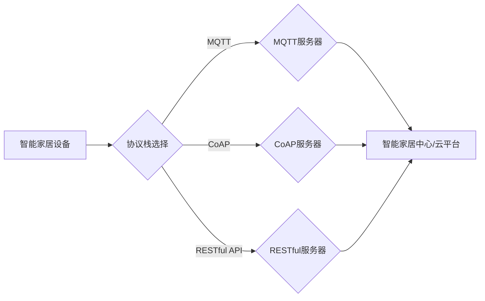

> 关键词：智能家居，Java，物联网，互联网协议栈，MQTT，CoAP，RESTful API，设计模式，安全性，可扩展性

# 基于Java的智能家居设计：征服智能家居的互联网协议栈-从Java视角

智能家居市场正在迅速发展，越来越多的家庭开始拥抱智能化的生活方式。Java作为一种成熟、稳定且具有广泛社区支持的语言，成为了智能家居系统开发的热门选择。本文将深入探讨基于Java的智能家居设计，重点关注互联网协议栈的选择、架构设计、核心算法以及实际应用场景。

## 1. 背景介绍

智能家居系统通常由多个设备组成，如智能灯泡、智能插座、智能门锁、智能温控器等。这些设备通过网络连接到智能家居中心或云平台，实现远程控制、数据分析等功能。为了实现设备间的互联互通，智能家居系统需要一套完善的互联网协议栈。

## 2. 核心概念与联系

### 2.1 核心概念

- **物联网（IoT）**: 物联网是指将各种信息传感设备与互联网相结合，实现万物互联的智能网络。
- **智能家居**: 指利用物联网技术将家庭中的各种设备连接起来，实现智能化管理、控制和生活便利。
- **互联网协议栈**: 指一组协议，用于在设备间进行数据传输和通信。
- **MQTT (Message Queuing Telemetry Transport)**: 一种轻量级的消息传输协议，适用于低功耗、低带宽的网络环境。
- **CoAP (Constrained Application Protocol)**: 一种专门为资源受限的物联网设备设计的简单、轻量级的网络协议。
- **RESTful API**: 一种基于REST架构的API设计风格，用于实现设备与服务器之间的数据交互。

### 2.2 架构的 Mermaid 流程图



## 3. 核心算法原理 & 具体操作步骤

### 3.1 算法原理概述

智能家居系统的核心算法包括设备控制算法、数据分析算法和用户交互算法。

- **设备控制算法**: 通过互联网协议栈实现对智能家居设备的控制，如开关灯、调节温度等。
- **数据分析算法**: 对收集到的数据进行分析，如能耗分析、用户行为分析等。
- **用户交互算法**: 提供用户界面，实现用户与智能家居系统的交互。

### 3.2 算法步骤详解

#### 3.2.1 设备控制算法

1. 用户通过用户界面发送控制命令。
2. 控制命令通过互联网协议栈发送到智能家居中心或云平台。
3. 智能家居中心或云平台解析控制命令，并将其发送到目标设备。
4. 目标设备接收控制命令并执行相应操作。

#### 3.2.2 数据分析算法

1. 智能家居设备收集数据并上传到智能家居中心或云平台。
2. 智能家居中心或云平台对数据进行存储、处理和分析。
3. 分析结果用于优化设备控制策略、提供用户反馈等。

#### 3.2.3 用户交互算法

1. 用户通过用户界面与智能家居系统进行交互。
2. 用户界面将用户输入转换为API请求。
3. API请求通过互联网协议栈发送到智能家居中心或云平台。
4. 智能家居中心或云平台处理API请求并返回结果。
5. 用户界面显示处理结果。

### 3.3 算法优缺点

#### 3.3.1 设备控制算法

优点：
- 实现简单，易于实现。
- 可扩展性强，支持多种设备控制。

缺点：
- 实时性要求较高，对网络延迟敏感。
- 安全性需要特别注意，防止未授权访问。

#### 3.3.2 数据分析算法

优点：
- 可提供有价值的数据分析结果。
- 可用于优化设备控制策略，提高能源效率。

缺点：
- 数据处理和分析需要消耗一定计算资源。
- 需要大量数据支持，数据质量对分析结果影响较大。

#### 3.3.3 用户交互算法

优点：
- 提高用户使用体验。
- 可实现个性化设置。

缺点：
- 用户界面设计复杂，需要充分考虑用户体验。
- 需要处理各种异常情况，如网络故障、设备离线等。

### 3.4 算法应用领域

智能家居设备的控制、数据分析、用户交互等算法在以下领域有广泛应用：

- 智能家居
- 工业物联网
- 智能城市
- 智能医疗
- 智能交通

## 4. 数学模型和公式 & 详细讲解 & 举例说明

智能家居系统中的数学模型主要涉及数据分析部分，以下是一个简单的例子：

$$
E(t) = \sum_{i=1}^{n} e_i(t)
$$

其中，$E(t)$ 表示在时间 $t$ 时的总能耗，$e_i(t)$ 表示第 $i$ 个设备的能耗。

假设智能家居系统中有 $n$ 个设备，每个设备的能耗可以通过以下公式计算：

$$
e_i(t) = P_i(t) \times t
$$

其中，$P_i(t)$ 表示设备 $i$ 在时间 $t$ 时的功率，$t$ 表示时间。

## 5. 项目实践：代码实例和详细解释说明

### 5.1 开发环境搭建

1. 安装Java开发工具包（JDK）。
2. 安装Eclipse、IntelliJ IDEA等Java集成开发环境（IDE）。
3. 安装MQTT、CoAP等协议客户端库。

### 5.2 源代码详细实现

以下是一个使用Java编写的MQTT客户端示例：

```java
import org.eclipse.paho.client.mqttv3.MqttConnectOptions;
import org.eclipse.paho.client.mqttv3.IMqttDeliveryToken;
import org.eclipse.paho.client.mqttv3.MqttMessage;
import org.eclipse.paho.client.mqttv3.MqttClient;
import org.eclipse.paho.client.mqttv3.persist.MemoryPersistence;

public class MqttClientExample {
    public static void main(String[] args) {
        MemoryPersistence persistence = new MemoryPersistence();
        MqttClient client = new MqttClient("tcp://localhost:1883", "ClientID", persistence);

        MqttConnectOptions connOpts = new MqttConnectOptions();
        connOpts.setCleanSession(true);
        connOpts.setAutomaticReconnect(true);

        try {
            client.connect(connOpts);
            String topic = "test/topic";
            byte[] payload = "Hello MQTT".getBytes();
            MqttMessage message = new MqttMessage(payload);
            message.setQoS(1);
            IMqttDeliveryToken token = client.publish(topic, message);
            token.waitForCompletion();
            System.out.println("Message published");
        } catch (Exception e) {
            System.out.println("Exception: " + e.getMessage());
        } finally {
            client.disconnect();
        }
    }
}
```

### 5.3 代码解读与分析

以上代码展示了如何使用Java和Paho MQTT客户端库创建一个简单的MQTT客户端。首先，创建一个MemoryPersistence对象用于存储客户端会话信息。然后，创建一个MqttClient对象并设置连接选项，包括服务端地址、客户端ID、是否清除会话等。接着，连接到MQTT服务器，并发布一条消息到指定主题。最后，断开连接。

### 5.4 运行结果展示

运行以上代码后，客户端将连接到本地MQTT服务器，并发布一条消息到“test/topic”主题。

## 6. 实际应用场景

智能家居系统在以下场景中具有广泛应用：

- **智能照明**: 用户可以通过手机应用程序远程控制家中的智能灯泡开关和亮度。
- **智能安防**: 通过智能摄像头和门锁，实现家庭安全监控和远程访问。
- **智能温控**: 通过智能温控器，实现家庭温度的自动调节，节省能源。
- **智能家电**: 通过智能插座，实现家电的远程控制，提高生活便利性。

## 7. 工具和资源推荐

### 7.1 学习资源推荐

- 《Java EE开发实战》
- 《物联网应用开发实战》
- 《MQTT协议详解》
- 《CoAP协议详解》

### 7.2 开发工具推荐

- Eclipse
- IntelliJ IDEA
- Paho MQTT客户端库
- Eclipse Paho MQTT服务器

### 7.3 相关论文推荐

- 《MQTT协议设计与实现》
- 《CoAP协议设计与实现》
- 《智能家居系统架构设计与实现》

## 8. 总结：未来发展趋势与挑战

### 8.1 研究成果总结

智能家居系统在近年来取得了显著的发展，Java作为智能家居系统开发的热门选择，具有强大的社区支持和丰富的开发工具。基于Java的智能家居设计在设备控制、数据分析、用户交互等方面取得了良好的效果。

### 8.2 未来发展趋势

- 智能家居系统将更加智能化、个性化和便捷。
- 物联网协议栈将更加成熟和标准化。
- 智能家居系统将与其他智能系统（如智能城市、智能交通等）深度融合。

### 8.3 面临的挑战

- 智能家居系统的安全性问题需要得到重视。
- 智能家居系统的互操作性需要得到解决。
- 智能家居系统的隐私保护问题需要得到关注。

### 8.4 研究展望

未来，智能家居系统将朝着更加智能化、便捷化和安全的方向发展。Java作为一种成熟、稳定且具有广泛社区支持的语言，将继续在智能家居系统开发中发挥重要作用。

## 9. 附录：常见问题与解答

**Q1：Java在智能家居系统开发中有什么优势？**

A1：Java具有以下优势：
- 成熟的生态系统和丰富的开发工具。
- 良好的跨平台性。
- 强大的社区支持和丰富的开源项目。

**Q2：如何选择合适的物联网协议栈？**

A2：选择物联网协议栈时，需要考虑以下因素：
- 设备的硬件和软件平台。
- 网络环境。
- 数据传输需求。
- 安全性要求。

**Q3：如何保证智能家居系统的安全性？**

A3：为了保证智能家居系统的安全性，需要采取以下措施：
- 使用安全的通信协议。
- 对用户账户和密码进行加密存储。
- 定期更新系统和软件。
- 定期进行安全审计。

**Q4：如何提高智能家居系统的互操作性？**

A4：为了提高智能家居系统的互操作性，需要：
- 采用开放的标准协议。
- 提供统一的API接口。
- 加强行业合作。

作者：禅与计算机程序设计艺术 / Zen and the Art of Computer Programming