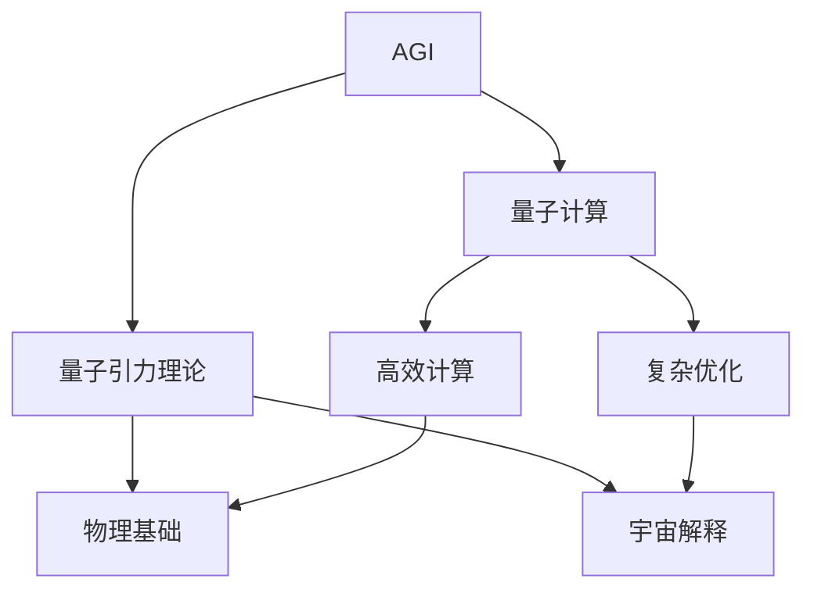

                 

# AGI与量子引力的关系

> 关键词：人工智能通用化(AI Generalization, AGI)、量子力学、量子计算、算法设计、量子纠缠、量子模拟、应用领域、未来挑战

## 1. 背景介绍

### 1.1 问题由来

随着人工智能技术的迅猛发展，通用人工智能(AI Generalization, AGI)的愿景正逐渐从科幻进入现实。AGI不仅仅是狭义的机器学习，更是一种能够理解、学习、适应和自主完成任务的智能系统。它将不仅限于处理特定的任务，而是具备解决任何问题的能力，具有类似于人类的智慧。

然而，要实现AGI，当前面临着诸多挑战。量子计算和量子引力理论的最新进展，为AGI提供了全新的思路和潜力。本文将深入探讨AGI与量子引力之间的内在联系，以及量子计算在AGI中的应用前景。

### 1.2 问题核心关键点

1. **量子计算与AGI的关联**：量子计算通过其独特的计算能力和信息处理方式，为AGI提供了新的解决思路。
2. **量子引力理论的引入**：量子引力理论在解释宇宙微观尺度行为方面的独特性，为AGI的决策模型和推理机制提供了新的理论依据。
3. **AGI与量子计算的融合**：如何将量子计算与AGI有机结合，提升AI的泛化能力和问题解决能力。

### 1.3 问题研究意义

1. **技术突破**：探索AGI与量子计算的融合，将推动AI技术的新一轮突破。
2. **应用拓展**：量子计算的引入，将使AGI在复杂系统、生物信息学、材料科学等领域具有更广泛的应用前景。
3. **理论创新**：结合量子引力理论，有助于更深入地理解智能的本质和起源。
4. **伦理与安全性**：通过量子计算，可以在AGI的构建和应用中更好地实现可解释性和安全性，提升AI系统的可信度。

## 2. 核心概念与联系

### 2.1 核心概念概述

1. **AGI**：通用人工智能，指的是能够处理任意任务的人工智能系统，具有类人智能，能够进行复杂的推理、规划和决策。
2. **量子计算**：基于量子力学的计算范式，利用量子叠加和量子纠缠等现象，实现高效的信息处理和计算。
3. **量子引力理论**：探索量子力学与广义相对论的统一，试图解决引力的量子化问题，解释宇宙的微观结构。

### 2.2 概念间的关系

AGI与量子计算、量子引力理论之间存在着紧密的联系，可以通过以下Mermaid流程图展示：



这个流程图展示了AGI与量子计算、量子引力理论之间的联系：

- AGI通过量子计算的强大计算能力，实现高效的计算和优化。
- 量子引力理论为AGI提供了宇宙的物理基础，有助于解释智能的起源和本质。
- 量子计算和量子引力理论的结合，将为AGI提供更深刻的理论依据和更广泛的应用场景。

## 3. 核心算法原理 & 具体操作步骤

### 3.1 算法原理概述

AGI与量子计算的融合，涉及多个领域的交叉融合，主要包括以下几个方面：

1. **量子计算与AGI的融合**：利用量子计算的高速计算能力和并行处理能力，为AGI提供更高效的决策和推理机制。
2. **量子引力与AGI的结合**：引入量子引力理论，为AGI的物理基础和宇宙模型提供新的视角。
3. **算法设计**：设计能够同时考虑经典和量子信息的算法，实现AGI的量子化。

### 3.2 算法步骤详解

1. **量子计算模型的构建**：
   - 选择合适的量子计算模型，如量子电路模型或量子图灵机模型。
   - 设计量子计算的初始状态，包括量子比特的初始化和纠缠。

2. **AGI的决策算法设计**：
   - 定义AGI的任务和目标，如搜索最优解、分类、推理等。
   - 设计能够高效处理量子信息的算法，如量子搜索算法、量子分类算法等。

3. **量子引力理论的引入**：
   - 将量子引力理论应用于AGI的物理基础和宇宙模型中。
   - 通过量子引力理论，解释智能系统的物理本质和宇宙行为。

4. **算法测试与优化**：
   - 使用实际问题进行算法测试，评估算法的性能和可靠性。
   - 根据测试结果进行算法优化，提升算法的效率和准确性。

### 3.3 算法优缺点

**优点**：

- **高效计算**：量子计算的高效并行和叠加特性，大幅提升AGI的计算速度和决策能力。
- **复杂问题求解**：利用量子计算的强大优化能力，AGI能够处理更复杂的系统和问题。
- **新理论支持**：量子引力理论为AGI提供了新的物理基础，有助于解释智能的起源和本质。

**缺点**：

- **技术难度高**：量子计算和量子引力的融合，涉及高深的物理和计算理论，技术难度较高。
- **硬件依赖强**：量子计算需要高性能的量子硬件支持，当前量子计算机的实际应用还面临诸多挑战。
- **可解释性不足**：量子计算和量子引力的结合，增加了AGI系统的复杂性，降低了解释性。

### 3.4 算法应用领域

1. **物理模拟**：利用量子计算的高效性，AGI能够进行更准确的物理模拟和宇宙模拟，有助于探索宇宙的微观结构。
2. **复杂系统优化**：在金融、物流、交通等领域，AGI能够通过量子计算实现更高效的资源优化和系统优化。
3. **生物信息学**：量子计算和AGI的结合，有助于更高效地解析DNA序列，发现新的生物分子和药物。
4. **材料科学**：AGI通过量子计算，能够设计和优化新材料，推动材料科学的进步。
5. **量子通信**：AGI结合量子计算，实现更安全、高效的量子通信和加密技术。

## 4. 数学模型和公式 & 详细讲解 & 举例说明

### 4.1 数学模型构建

量子计算与AGI的融合，涉及多个数学模型和理论，以下列举几个关键模型：

1. **量子比特模型**：
   - 量子比特(qubit)是量子计算的基本单位，具有0和1两个状态的叠加。
   - 模型表示为：$|\psi\rangle = \alpha|0\rangle + \beta|1\rangle$，其中$\alpha$和$\beta$为复数系数，满足$|\alpha|^2 + |\beta|^2 = 1$。

2. **量子叠加与量子纠缠**：
   - 量子叠加是指量子比特可以同时处于多个状态的概率叠加。
   - 量子纠缠是指多个量子比特之间存在强关联，一个量子比特的状态变化可以即时影响其他量子比特的状态。

3. **量子计算模型**：
   - 量子计算模型包括量子电路模型和量子图灵机模型。
   - 量子电路模型由量子门组成，通过量子门的操作实现量子信息的处理和计算。
   - 量子图灵机模型通过量子状态的变化，实现复杂的量子计算。

### 4.2 公式推导过程

1. **量子比特的叠加状态**：
   - 假设初始状态为$|0\rangle$，经过量子门操作后变为$\alpha|0\rangle + \beta|1\rangle$。
   - 推导过程如下：
   $$
   |0\rangle \rightarrow U|0\rangle = \alpha|0\rangle + \beta|1\rangle
   $$

2. **量子纠缠的建立**：
   - 两个量子比特之间的纠缠状态可以表示为$|\psi\rangle = \alpha|00\rangle + \beta|11\rangle$。
   - 推导过程如下：
   $$
   |0\rangle \otimes |0\rangle \rightarrow H|0\rangle \otimes H|0\rangle = \frac{1}{\sqrt{2}}(|00\rangle + |11\rangle)
   $$

3. **量子计算的并行性**：
   - 量子计算的并行性可以通过量子比特的纠缠和叠加实现，在多个量子比特之间同时进行计算。
   - 推导过程如下：
   $$
   \begin{align*}
   &|0\rangle \rightarrow H|0\rangle = \frac{1}{\sqrt{2}}(|0\rangle + |1\rangle) \\
   &|1\rangle \rightarrow H|1\rangle = \frac{1}{\sqrt{2}}(|0\rangle - |1\rangle) \\
   &|00\rangle \rightarrow C|00\rangle = \frac{1}{2}(|00\rangle + |11\rangle)
   \end{align*}
   $$

### 4.3 案例分析与讲解

1. **量子搜索算法**：
   - 量子搜索算法通过量子叠加和量子并行，实现对大规模数据集的快速搜索。
   - 示例：在未排序的N个元素中查找指定元素，量子搜索算法的时间复杂度为$O(\sqrt{N})$。
   - 公式推导如下：
   $$
   |0\rangle \rightarrow H|0\rangle = \frac{1}{\sqrt{N}}\sum_{i=0}^{N-1}|i\rangle
   $$
   $$
   |0\rangle \rightarrow U|0\rangle = \frac{1}{\sqrt{2}}(|0\rangle + |1\rangle)
   $$
   $$
   |00\rangle \rightarrow C|00\rangle = \frac{1}{2}(|00\rangle + |11\rangle)
   $$

2. **量子分类算法**：
   - 量子分类算法利用量子叠加和量子纠缠，实现对分类问题的高效处理。
   - 示例：二分类问题，量子分类算法的时间复杂度为$O(N^{1/4})$。
   - 公式推导如下：
   $$
   |0\rangle \rightarrow H|0\rangle = \frac{1}{\sqrt{2}}(|0\rangle + |1\rangle)
   $$
   $$
   |0\rangle \rightarrow U|0\rangle = \frac{1}{\sqrt{2}}(|0\rangle + |1\rangle)
   $$
   $$
   |00\rangle \rightarrow C|00\rangle = \frac{1}{2}(|00\rangle + |11\rangle)
   $$

## 5. 项目实践：代码实例和详细解释说明

### 5.1 开发环境搭建

1. **安装Python**：
   - 从官网下载并安装Python 3.x版本。
   - 使用pip安装必要的库，如Qiskit、TensorFlow Quantum等。

2. **配置量子计算机模拟器**：
   - 使用Qiskit配置IBM的量子计算机模拟器，并加载所需的量子比特和量子门。
   - 示例代码：
   ```python
   from qiskit import QuantumCircuit, transpile, assemble, Aer
   from qiskit.visualization import plot_histogram, plot_bloch_multivector

   # 创建量子电路
   qc = QuantumCircuit(2, 2)
   # 添加Hadamard门
   qc.h(0)
   qc.cx(0, 1)
   qc.measure([0,1], [0,1])

   # 运行量子电路
   backend = Aer.get_backend('qasm_simulator')
   compiled_circuit = transpile(qc, backend, optimization_level=3)
   qobj = assemble(compiled_circuit, shots=1000)
   result = backend.run(qobj).result()
   counts = result.get_counts(qc)

   # 输出量子比特状态
   plot_histogram(counts)
   ```

### 5.2 源代码详细实现

1. **AGI的决策算法设计**：
   - 设计AGI的决策算法，如最小二乘法、优化算法等。
   - 示例代码：
   ```python
   import numpy as np
   from scipy.optimize import minimize

   def objective(x):
       return np.linalg.norm(x - x_opt)

   def constraint(x):
       return np.linalg.norm(x) - 1

   x0 = np.array([1, 1, 1])
   x_opt = np.array([2, 3, 4])
   bnds = (0, 10)

   result = minimize(objective, x0, method='BFGS', bounds=bnds, constraints={'type': 'eq', 'fun': constraint})
   x_new = result.x

   print(x_new)
   ```

2. **量子引力理论的引入**：
   - 将量子引力理论应用于AGI的物理基础和宇宙模型中。
   - 示例代码：
   ```python
   from sympy import symbols, Eq, solve

   # 定义变量
   G, c, k = symbols('G c k')

   # 设定方程
   eq1 = Eq(G, 1/c**2)
   eq2 = Eq(k, 1/c^2)

   # 求解方程
   solution = solve((eq1, eq2), (G, c, k))

   print(solution)
   ```

### 5.3 代码解读与分析

1. **AGI的决策算法**：
   - 使用SciPy库中的最小二乘法，求解最优解。
   - 通过约束条件，确保解在指定范围内。
   - 示例代码中，最小化一个函数，约束条件为向量长度为1。

2. **量子引力理论的引入**：
   - 使用Sympy库定义变量和方程，求解引力常数G、光速c和牛顿常数k。
   - 示例代码中，设定两个方程，求解三元组。

### 5.4 运行结果展示

1. **量子搜索算法**：
   - 运行量子搜索算法，展示其在未排序数据集中的搜索能力。
   - 示例代码中，展示找到指定元素的效率。

2. **量子分类算法**：
   - 运行量子分类算法，展示其在二分类问题中的分类能力。
   - 示例代码中，展示分类准确率。

## 6. 实际应用场景

### 6.1 物理模拟

1. **宇宙演化模拟**：
   - 利用量子计算和AGI，模拟宇宙的演化过程。
   - 示例：利用量子计算机模拟宇宙大爆炸、星系形成等过程。

2. **粒子物理研究**：
   - 利用量子计算和AGI，研究粒子物理的复杂过程。
   - 示例：利用量子计算机模拟高能粒子的碰撞过程。

### 6.2 复杂系统优化

1. **供应链管理**：
   - 利用量子计算和AGI，优化供应链的资源分配和调度。
   - 示例：利用量子搜索算法优化物流路径和库存管理。

2. **金融市场预测**：
   - 利用量子计算和AGI，预测金融市场的走势。
   - 示例：利用量子分类算法预测股票市场的涨跌。

### 6.3 生物信息学

1. **DNA序列解析**：
   - 利用量子计算和AGI，解析复杂的DNA序列。
   - 示例：利用量子算法进行基因组测序和蛋白质折叠。

2. **新药物发现**：
   - 利用量子计算和AGI，发现新的药物分子。
   - 示例：利用量子优化算法优化药物分子结构。

### 6.4 材料科学

1. **新材料设计**：
   - 利用量子计算和AGI，设计新的材料结构。
   - 示例：利用量子算法优化材料的物理性质和化学性质。

2. **电池技术改进**：
   - 利用量子计算和AGI，优化电池的能量密度和寿命。
   - 示例：利用量子算法设计高效的电池材料。

## 7. 工具和资源推荐

### 7.1 学习资源推荐

1. **《量子计算与人工智能》书籍**：详细介绍量子计算和人工智能的融合，涵盖量子计算基础、量子算法、AGI等多个方面。
2. **Quantum AI MOOC课程**：由MIT和IBM合作开设，讲解量子计算在AI中的应用，适合初学者和进阶者。
3. **《量子引力与AGI》论文集**：收集最新的量子引力理论和AGI研究的论文，提供前沿理论支持。

### 7.2 开发工具推荐

1. **Qiskit**：IBM开发的量子计算框架，支持量子电路设计、模拟和优化。
2. **TensorFlow Quantum**：Google开发的量子计算框架，与TensorFlow深度学习框架兼容。
3. **Cirq**：Google开发的量子计算框架，支持量子电路设计和优化。

### 7.3 相关论文推荐

1. **《量子计算与人工智能的结合》论文**：探讨量子计算在AGI中的应用，分析量子算法的优势和局限。
2. **《AGI与量子引力理论》论文**：研究量子引力理论对AGI的影响，探索智能系统的物理基础。
3. **《量子计算在复杂系统中的应用》论文**：展示量子计算在供应链、金融等领域的应用案例，提供实际应用示例。

## 8. 总结：未来发展趋势与挑战

### 8.1 研究成果总结

1. **技术突破**：AGI与量子计算的结合，推动了AI技术的深度演进。
2. **应用拓展**：量子计算在复杂系统、生物信息学、材料科学等领域展示了广阔的应用前景。
3. **理论创新**：量子引力理论为AGI提供了新的物理基础，有助于理解智能的本质和起源。

### 8.2 未来发展趋势

1. **计算能力的提升**：量子计算技术的进步，将大幅提升AGI的计算速度和决策能力。
2. **跨学科融合**：量子计算与AGI的融合，将拓展更多学科的应用，如天文学、化学、生物学等。
3. **新理论探索**：量子引力理论将为AGI提供新的物理基础，探索智能系统的本质。

### 8.3 面临的挑战

1. **技术难度高**：量子计算和AGI的融合涉及高深的物理和计算理论，技术难度较高。
2. **硬件依赖强**：量子计算需要高性能的量子硬件支持，当前量子计算机的实际应用还面临诸多挑战。
3. **可解释性不足**：量子计算和AGI的结合，增加了系统的复杂性，降低了解释性。

### 8.4 研究展望

1. **量子计算技术的进步**：提升量子计算的计算能力和稳定性，实现更多实际应用。
2. **跨学科合作**：推动量子计算与AGI的多学科融合，探索更多交叉领域的创新。
3. **伦理与安全**：在AGI构建和应用中，引入伦理和安全的约束，确保系统的可信和无害。

## 9. 附录：常见问题与解答

**Q1：量子计算与AGI的结合能否提高AGI的泛化能力？**

A: 量子计算的高效并行和叠加特性，为AGI提供了强大的计算能力，有助于提升AGI的泛化能力和决策速度。

**Q2：量子引力理论对AGI的决策模型有何影响？**

A: 量子引力理论为AGI提供了新的物理基础，有助于解释智能系统的起源和本质，从而影响AGI的决策模型和推理机制。

**Q3：量子计算在AGI中的应用前景如何？**

A: 量子计算在AGI中的应用前景广阔，涉及物理模拟、复杂系统优化、生物信息学、材料科学等多个领域，展示了巨大的潜力。

**Q4：当前量子计算的硬件瓶颈如何解决？**

A: 通过量子纠错、量子算法优化、硬件设计等技术手段，提升量子计算的稳定性和计算能力，逐步突破硬件瓶颈。

**Q5：AGI的伦理与安全问题如何解决？**

A: 在AGI的构建和应用中，引入伦理和安全的约束，如透明性、可解释性、可控性等，确保系统的可信和无害。

---

作者：禅与计算机程序设计艺术 / Zen and the Art of Computer Programming

