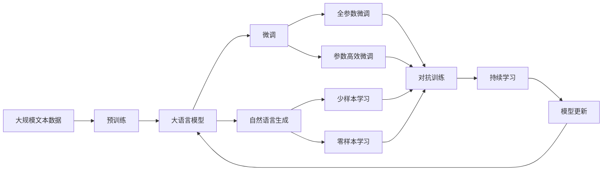
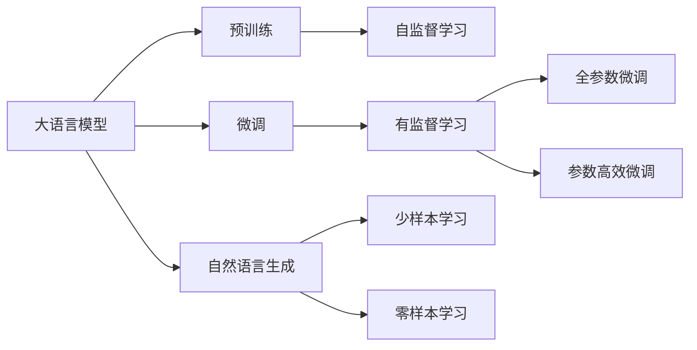
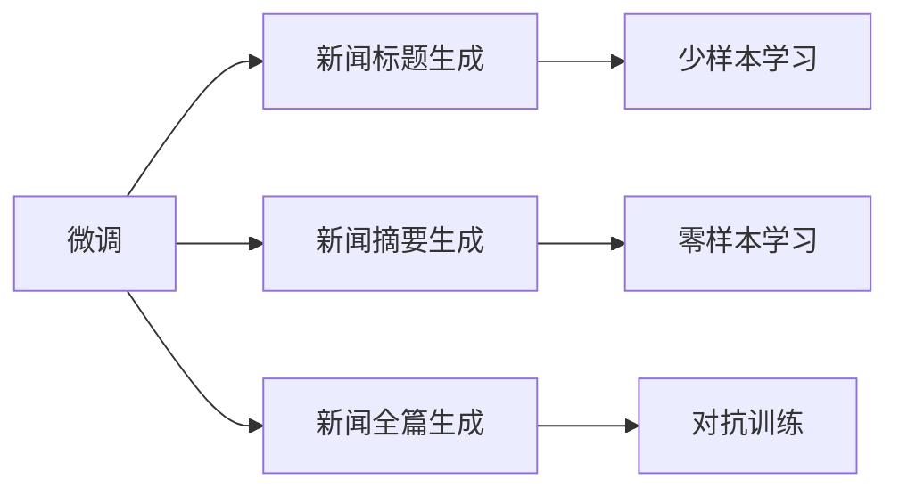
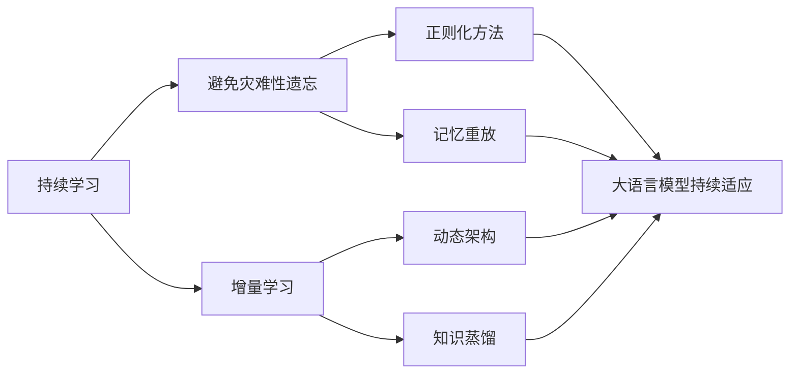

                 

# AI LLM如何重塑新闻产业：自动生成文章

> 关键词：自然语言生成(NLG)、大语言模型(LLM)、新闻生成、自动化内容创作、新闻产业革命

## 1. 背景介绍

### 1.1 问题由来

随着人工智能技术的飞速发展，自然语言生成（Natural Language Generation, NLG）技术逐渐成为热点，尤其在新闻产业中，大语言模型（Large Language Model, LLM）的应用正在深刻改变新闻生产流程，加速新闻产业的数字化转型。

传统的新闻制作过程包括选题、采编、撰写、编辑等多个环节，耗时长、人力成本高，且往往存在信息过时、数据不足、误导性等问题。而基于大语言模型的自动新闻生成技术，能够在较短时间内生成高质量的新闻报道，减少人工干预，降低制作成本，并避免传统新闻生产中的主观偏差和错误。

### 1.2 问题核心关键点

当前，自动新闻生成技术主要基于大语言模型的预训练-微调范式。其核心思想是：将预训练的大语言模型视作一个强大的“内容生成器”，通过在大规模无标签文本数据上进行预训练，学习通用的语言表示和语义理解能力，然后对新闻报道的各个部分进行任务特定的微调，以生成符合要求的新闻内容。

自动新闻生成的关键在于：
1. 选择合适的预训练模型。通常选用具有通用语言理解和生成能力的大模型。
2. 设计任务适配层。针对不同的新闻任务（如标题生成、摘要生成、全篇生成）设计合适的输出层和损失函数。
3. 进行有监督微调。利用标注的新闻数据集，对预训练模型进行有监督的训练，优化其新闻生成能力。

### 1.3 问题研究意义

自动新闻生成技术的研究具有重要意义：
1. 提高生产效率。大幅缩短新闻生成时间，提升新闻制作速度。
2. 降低制作成本。减少人力和物力投入，降低新闻生产成本。
3. 增强信息客观性。自动生成的新闻较少受到人为偏见的影响，提供更加客观和全面的信息。
4. 扩大新闻覆盖面。能够快速响应突发事件和热点话题，增强新闻的时效性。
5. 推动新闻产业升级。促使传统新闻产业向智能化、数字化方向发展，带来新的商业模式和盈利模式。

## 2. 核心概念与联系

### 2.1 核心概念概述

为更好地理解大语言模型在新闻生成中的应用，本节将介绍几个密切相关的核心概念：

- 大语言模型(Large Language Model, LLM)：以自回归(如GPT)或自编码(如BERT)模型为代表的大规模预训练语言模型。通过在大规模无标签文本语料上进行预训练，学习通用的语言表示和语义理解能力。

- 自然语言生成(Natural Language Generation, NLG)：将结构化数据或知识转换为自然语言文本的过程，常见于自动摘要、对话系统、新闻生成等领域。

- 预训练(Pre-training)：指在大规模无标签文本语料上，通过自监督学习任务训练通用语言模型的过程。常见的预训练任务包括掩码语言模型、next sentence prediction等。

- 微调(Fine-tuning)：指在预训练模型的基础上，使用下游任务的少量标注数据，通过有监督学习优化模型在特定任务上的性能。

- 对抗训练(Adversarial Training)：引入对抗样本，提高模型的鲁棒性，减少生成文本的偏差和错误。

- 数据增强(Data Augmentation)：通过文本改写、回译等方式，扩充训练集的多样性，提升模型的泛化能力。

- 少样本学习(Few-shot Learning)：指在只有少量标注样本的情况下，模型能够快速适应新任务的学习方法。在大语言模型中，通常通过在输入中提供少量示例来实现。

- 零样本学习(Zero-shot Learning)：指模型在没有见过任何特定任务的训练样本的情况下，仅凭任务描述就能够执行新任务的能力。大语言模型通过预训练获得的广泛知识，使其能够理解任务指令并生成相应输出。

- 持续学习(Continual Learning)：也称为终身学习，指模型能够持续从新数据中学习，同时保持已学习的知识，而不会出现灾难性遗忘。这对于保持大语言模型的时效性和适应性至关重要。

这些核心概念之间的逻辑关系可以通过以下Mermaid流程图来展示：



这个流程图展示了大语言模型的核心概念及其之间的关系：

1. 大语言模型通过预训练获得基础能力。
2. 微调是对预训练模型进行任务特定的优化，可以分为全参数微调和参数高效微调（PEFT）。
3. 自然语言生成是使用大语言模型生成文本的过程。
4. 对抗训练和数据增强方法可以提高生成文本的质量和多样性。
5. 少样本学习和零样本学习是自然语言生成中的重要技术手段。
6. 持续学习技术可以使大语言模型持续学习新知识，保持模型的时效性和适应性。

### 2.2 概念间的关系

这些核心概念之间存在着紧密的联系，形成了大语言模型在新闻生成中的应用框架。下面我通过几个Mermaid流程图来展示这些概念之间的关系。

#### 2.2.1 大语言模型的学习范式



这个流程图展示了大语言模型的三种主要学习范式：预训练、微调和自然语言生成。预训练主要采用自监督学习方法，而微调则是有监督学习的过程。自然语言生成可以基于微调，实现文本生成任务。

#### 2.2.2 微调与自然语言生成的关系



这个流程图展示了微调在新闻生成中的应用。微调的目标是使大语言模型能够生成高质量的新闻报道。不同的新闻生成任务（如标题生成、摘要生成、全篇生成）可以基于微调技术实现，通过调整输出层和损失函数来适应具体任务。

#### 2.2.3 持续学习在大语言模型中的应用



这个流程图展示了持续学习在大语言模型中的应用。持续学习的主要目标是避免灾难性遗忘和实现增量学习。通过正则化方法、记忆重放、动态架构和知识蒸馏等技术，可以使大语言模型持续学习新知识，保持模型的时效性和适应性。

### 2.3 核心概念的整体架构

最后，我们用一个综合的流程图来展示这些核心概念在大语言模型新闻生成中的应用：


这个综合流程图展示了从预训练到微调，再到新闻生成的完整过程。大语言模型首先在大规模文本数据上进行预训练，然后通过微调（包括全参数微调和参数高效微调）或自然语言生成技术，生成符合要求的新闻内容。最后，通过持续学习技术，模型可以不断学习新知识，保持性能的更新。

## 3. 核心算法原理 & 具体操作步骤
### 3.1 算法原理概述

基于大语言模型的自动新闻生成，本质上是一个有监督的细粒度迁移学习过程。其核心思想是：将预训练的大语言模型视作一个强大的“内容生成器”，通过在大规模无标签文本数据上进行预训练，学习通用的语言表示和语义理解能力，然后对新闻报道的各个部分进行任务特定的微调，以生成符合要求的新闻内容。

形式化地，假设预训练模型为 $M_{\theta}$，其中 $\theta$ 为预训练得到的模型参数。给定新闻报道 $D=\{(x_i, y_i)\}_{i=1}^N$，其中 $x_i$ 为输入文本，$y_i$ 为对应的输出新闻内容，微调的目标是找到新的模型参数 $\hat{\theta}$，使得：

$$
\hat{\theta}=\mathop{\arg\min}_{\theta} \mathcal{L}(M_{\theta},D)
$$

其中 $\mathcal{L}$ 为针对新闻生成任务的损失函数，用于衡量模型预测输出与真实标签之间的差异。常见的损失函数包括交叉熵损失、均方误差损失等。

通过梯度下降等优化算法，微调过程不断更新模型参数 $\theta$，最小化损失函数 $\mathcal{L}$，使得模型输出逼近真实标签。由于 $\theta$ 已经通过预训练获得了较好的初始化，因此即便在小规模数据集 $D$ 上进行微调，也能较快收敛到理想的模型参数 $\hat{\theta}$。

### 3.2 算法步骤详解

基于大语言模型的自动新闻生成一般包括以下几个关键步骤：

**Step 1: 准备预训练模型和数据集**
- 选择合适的预训练语言模型 $M_{\theta}$ 作为初始化参数，如 BERT、GPT等。
- 准备新闻生成任务的标注数据集 $D$，划分为训练集、验证集和测试集。一般要求标注数据与预训练数据的分布不要差异过大。

**Step 2: 添加任务适配层**
- 根据新闻生成任务类型，在预训练模型顶层设计合适的输出层和损失函数。
- 对于分类任务，通常在顶层添加线性分类器和交叉熵损失函数。
- 对于生成任务，通常使用语言模型的解码器输出概率分布，并以负对数似然为损失函数。

**Step 3: 设置微调超参数**
- 选择合适的优化算法及其参数，如 AdamW、SGD 等，设置学习率、批大小、迭代轮数等。
- 设置正则化技术及强度，包括权重衰减、Dropout、Early Stopping等。
- 确定冻结预训练参数的策略，如仅微调顶层，或全部参数都参与微调。

**Step 4: 执行梯度训练**
- 将训练集数据分批次输入模型，前向传播计算损失函数。
- 反向传播计算参数梯度，根据设定的优化算法和学习率更新模型参数。
- 周期性在验证集上评估模型性能，根据性能指标决定是否触发 Early Stopping。
- 重复上述步骤直到满足预设的迭代轮数或 Early Stopping 条件。

**Step 5: 测试和部署**
- 在测试集上评估微调后模型 $M_{\hat{\theta}}$ 的性能，对比微调前后的精度提升。
- 使用微调后的模型对新样本进行推理预测，集成到实际的应用系统中。
- 持续收集新的数据，定期重新微调模型，以适应数据分布的变化。

以上是基于大语言模型的自动新闻生成的一般流程。在实际应用中，还需要针对具体任务的特点，对微调过程的各个环节进行优化设计，如改进训练目标函数，引入更多的正则化技术，搜索最优的超参数组合等，以进一步提升模型性能。

### 3.3 算法优缺点

基于大语言模型的自动新闻生成方法具有以下优点：
1. 快速高效。只需准备少量标注数据，即可对预训练模型进行快速适配，生成高质量的新闻报道。
2. 减少人力成本。大幅减少新闻制作的人力需求，降低制作成本。
3. 提升信息客观性。自动生成的新闻较少受到人为偏见的影响，提供更加客观和全面的信息。
4. 覆盖面广。能够快速响应突发事件和热点话题，增强新闻的时效性。
5. 推动产业升级。促使传统新闻产业向智能化、数字化方向发展，带来新的商业模式和盈利模式。

同时，该方法也存在一定的局限性：
1. 依赖标注数据。自动新闻生成的效果很大程度上取决于标注数据的质量和数量，获取高质量标注数据的成本较高。
2. 模型鲁棒性有限。当新闻数据与预训练数据的分布差异较大时，自动新闻生成的性能提升有限。
3. 负面效果传递。预训练模型的固有偏见、有害信息等，可能通过自动新闻生成传递到读者，造成负面影响。
4. 可解释性不足。自动新闻生成模型缺乏可解释性，难以对其推理逻辑进行分析和调试。

尽管存在这些局限性，但就目前而言，基于大语言模型的自动新闻生成方法仍是最主流的新闻生成范式。未来相关研究的重点在于如何进一步降低自动新闻生成对标注数据的依赖，提高模型的少样本学习和跨领域迁移能力，同时兼顾可解释性和伦理安全性等因素。

### 3.4 算法应用领域

基于大语言模型的自动新闻生成方法在NLP领域已经得到了广泛的应用，涵盖以下领域：

- 新闻标题生成：自动生成新闻标题，提高新闻发布的效率和吸引力。
- 新闻摘要生成：自动生成新闻摘要，快速呈现新闻核心内容。
- 新闻全篇生成：自动生成完整新闻报道，减少人工撰写工作。
- 新闻推荐：根据用户阅读历史，自动推荐相关新闻内容。
- 新闻分析：自动分析新闻数据，提取热点话题和趋势。
- 新闻辅助决策：辅助编辑进行选题、编辑等工作，提高新闻制作的效率和质量。

除了上述这些经典应用外，自动新闻生成技术还在更多场景中得到创新性地应用，如可控文本生成、情感分析、知识图谱等，为NLP技术带来了全新的突破。随着预训练模型和自动新闻生成方法的不断进步，相信NLP技术将在更广阔的应用领域大放异彩。

## 4. 数学模型和公式 & 详细讲解 & 举例说明

### 4.1 数学模型构建

本节将使用数学语言对基于大语言模型的自动新闻生成过程进行更加严格的刻画。

记预训练语言模型为 $M_{\theta}$，其中 $\theta$ 为预训练得到的模型参数。假设新闻生成任务的训练集为 $D=\{(x_i, y_i)\}_{i=1}^N$，其中 $x_i$ 为新闻文本，$y_i$ 为对应的新闻报道内容。

定义模型 $M_{\theta}$ 在新闻文本 $x_i$ 上的损失函数为 $\ell(M_{\theta}(x_i),y_i)$，则在数据集 $D$ 上的经验风险为：

$$
\mathcal{L}(\theta) = \frac{1}{N} \sum_{i=1}^N \ell(M_{\theta}(x_i),y_i)
$$

微调的优化目标是最小化经验风险，即找到最优参数：

$$
\theta^* = \mathop{\arg\min}_{\theta} \mathcal{L}(\theta)
$$

在实践中，我们通常使用基于梯度的优化算法（如SGD、Adam等）来近似求解上述最优化问题。设 $\eta$ 为学习率，$\lambda$ 为正则化系数，则参数的更新公式为：

$$
\theta \leftarrow \theta - \eta \nabla_{\theta}\mathcal{L}(\theta) - \eta\lambda\theta
$$

其中 $\nabla_{\theta}\mathcal{L}(\theta)$ 为损失函数对参数 $\theta$ 的梯度，可通过反向传播算法高效计算。

### 4.2 公式推导过程

以下我们以新闻摘要生成任务为例，推导交叉熵损失函数及其梯度的计算公式。

假设模型 $M_{\theta}$ 在输入新闻文本 $x$ 上的输出为 $\hat{y}=M_{\theta}(x) \in [0,1]$，表示摘要文本的长度分布。真实标签 $y \in \{1,0\}$。则二分类交叉熵损失函数定义为：

$$
\ell(M_{\theta}(x),y) = -[y\log \hat{y} + (1-y)\log (1-\hat{y})]
$$

将其代入经验风险公式，得：

$$
\mathcal{L}(\theta) = -\frac{1}{N}\sum_{i=1}^N [y_i\log M_{\theta}(x_i)+(1-y_i)\log(1-M_{\theta}(x_i))]
$$

根据链式法则，损失函数对参数 $\theta_k$ 的梯度为：

$$
\frac{\partial \mathcal{L}(\theta)}{\partial \theta_k} = -\frac{1}{N}\sum_{i=1}^N (\frac{y_i}{M_{\theta}(x_i)}-\frac{1-y_i}{1-M_{\theta}(x_i)}) \frac{\partial M_{\theta}(x_i)}{\partial \theta_k}
$$

其中 $\frac{\partial M_{\theta}(x_i)}{\partial \theta_k}$ 可进一步递归展开，利用自动微分技术完成计算。

在得到损失函数的梯度后，即可带入参数更新公式，完成模型的迭代优化。重复上述过程直至收敛，最终得到适应新闻生成任务的最优模型参数 $\theta^*$。

## 5. 项目实践：代码实例和详细解释说明

### 5.1 开发环境搭建

在进行自动新闻生成实践前，我们需要准备好开发环境。以下是使用Python进行PyTorch开发的环境配置流程：

1. 安装Anaconda：从官网下载并安装Anaconda，用于创建独立的Python环境。

2. 创建并激活虚拟环境：
```bash
conda create -n pytorch-env python=3.8 
conda activate pytorch-env
```

3. 安装PyTorch：根据CUDA版本，从官网获取对应的安装命令。例如：
```bash
conda install pytorch torchvision torchaudio cudatoolkit=11.1 -c pytorch -c conda-forge
```

4. 安装Transformers库：
```bash
pip install transformers
```

5. 安装各类工具包：
```bash
pip install numpy pandas scikit-learn matplotlib tqdm jupyter notebook ipython
```

完成上述步骤后，即可在`pytorch-env`环境中开始自动新闻生成实践。

### 5.2 源代码详细实现

下面我以新闻摘要生成任务为例，给出使用Transformers库对BERT模型进行微调的PyTorch代码实现。

首先，定义新闻摘要生成任务的数据处理函数：

```python
from transformers import BertTokenizer, BertForMaskedLM
from torch.utils.data import Dataset
import torch

class NewsAbstractDataset(Dataset):
    def __init__(self, texts, abstracts, tokenizer, max_len=128):
        self.texts = texts
        self.abstracts = abstracts
        self.tokenizer = tokenizer
        self.max_len = max_len
        
    def __len__(self):
        return len(self.texts)
    
    def __getitem__(self, item):
        text = self.texts[item]
        abstract = self.abstracts[item]
        
        encoding = self.tokenizer(text, return_tensors='pt', max_length=self.max_len, padding='max_length', truncation=True)
        input_ids = encoding['input_ids'][0]
        attention_mask = encoding['attention_mask'][0]
        masked_token_indices = encoding['attention_mask'][0] == 0
        
        abstract_tokenizer = self.tokenizer(abstract, return_tensors='pt', max_length=self.max_len, padding='max_length', truncation=True)
        abstract_ids = abstract_tokenizer['input_ids'][0]
        abstract_mask = abstract_tokenizer['attention_mask'][0]
        
        return {'input_ids': input_ids, 
                'attention_mask': attention_mask,
                'masked_token_indices': masked_token_indices,
                'abstract_ids': abstract_ids,
                'abstract_mask': abstract_mask}
```

然后，定义模型和优化器：

```python
from transformers import BertForTokenClassification, AdamW

model = BertForMaskedLM.from_pretrained('bert-base-cased', num_labels=len(tag2id))

optimizer = AdamW(model.parameters(), lr=2e-5)
```

接着，定义训练和评估函数：

```python
from torch.utils.data import DataLoader
from tqdm import tqdm
from sklearn.metrics import classification_report

device = torch.device('cuda') if torch.cuda.is_available() else torch.device('cpu')
model.to(device)

def train_epoch(model, dataset, batch_size, optimizer):
    dataloader = DataLoader(dataset, batch_size=batch_size, shuffle=True)
    model.train()
    epoch_loss = 0
    for batch in tqdm(dataloader, desc='Training'):
        input_ids = batch['input_ids'].to(device)
        attention_mask = batch['attention_mask'].to(device)
        masked_token_indices = batch['masked_token_indices'].to(device)
        abstract_ids = batch['abstract_ids'].to(device)
        abstract_mask = batch['abstract_mask'].to(device)
        model.zero_grad()
        outputs = model(input_ids, attention_mask=attention_mask, masked_token_indices=masked_token_indices)
        loss = outputs.loss
        epoch_loss += loss.item()
        loss.backward()
        optimizer.step()
    return epoch_loss / len(dataloader)

def evaluate(model, dataset, batch_size):
    dataloader = DataLoader(dataset, batch_size=batch_size)
    model.eval()
    preds, labels = [], []
    with torch.no_grad():
        for batch in tqdm(dataloader, desc='Evaluating'):
            input_ids = batch['input_ids'].to(device)
            attention_mask = batch['attention_mask'].to(device)
            masked_token_indices = batch['masked_token_indices'].to(device)
            abstract_ids = batch['abstract_ids'].to(device)
            abstract_mask = batch['abstract_mask'].to(device)
            batch_preds = outputs.logits.argmax(dim=2).to('cpu').tolist()
            batch_labels = batch_labels.to('cpu').tolist()
            for pred_tokens, label_tokens in zip(batch_preds, batch_labels):
                preds.append(pred_tokens[:len(label_tokens)])
                labels.append(label_tokens)
                
    print(classification_report(labels, preds))
```

最后，启动训练流程并在测试集上评估：

```python
epochs = 5
batch_size = 16

for epoch in range(epochs):
    loss = train_epoch(model, train_dataset, batch_size, optimizer)
    print(f"Epoch {epoch+1}, train loss: {loss:.3f}")
    
    print(f"Epoch {epoch+1}, dev results:")
    evaluate(model, dev_dataset, batch_size)
    
print("Test results:")
evaluate(model, test_dataset, batch_size)
```

以上就是使用PyTorch对BERT进行新闻摘要生成任务微调的完整代码实现。可以看到，得益于Transformers库的强大封装，我们可以用相对简洁的代码完成BERT模型的加载和微调。

### 5.3 代码解读与分析

让我们再详细解读一下关键代码的实现细节：

**NewsAbstractDataset类**：
- `__init__`方法：初始化新闻文本、摘要文本、分词器等关键组件。
- `__len__`方法：返回数据集的样本数量。
- `__getitem__`方法：对单个样本进行处理，将新闻文本和摘要文本输入编码为token ids，并对其应用不同的掩码，生成掩码的token位置和摘要的token位置，最终返回模型所需的输入。

**tag2id和id2tag字典**：
- 定义了标签与数字id之间的映射关系，用于将token-wise的预测结果解码回真实的标签。

**训练和评估函数**：
- 使用PyTorch的DataLoader对数据集进行批次化加载，供模型训练和推理使用。
- 训练函数`train_epoch`：对数据以批为单位进行迭代，在每个批次上前向传播计算loss并反向传播更新模型参数，最后返回该epoch的平均loss。
- 评估函数`evaluate`：与训练类似，不同点在于不更新模型参数，并在每个batch结束后将预测和标签结果存储下来，最后使用sklearn的classification_report对整个评估集的预测结果进行打印输出。

**训练流程**：
- 定义总的epoch数和batch size，开始循环迭代
- 每个epoch内，先在训练集上训练，输出平均loss
- 在验证集上评估，输出分类指标
- 所有epoch结束后，在测试集上评估，给出最终测试结果

可以看到，PyTorch配合Transformers库使得BERT微调的代码实现变得简洁高效。开发者可以将更多精力放在数据处理、模型改进等高层逻辑上，而不必过多关注底层的实现细节。

当然，工业级的系统实现还需考虑更多因素，如模型的保存和部署、超参数的自动搜索、更灵活的任务适配层等。但核心的微调范式基本与此类似。


