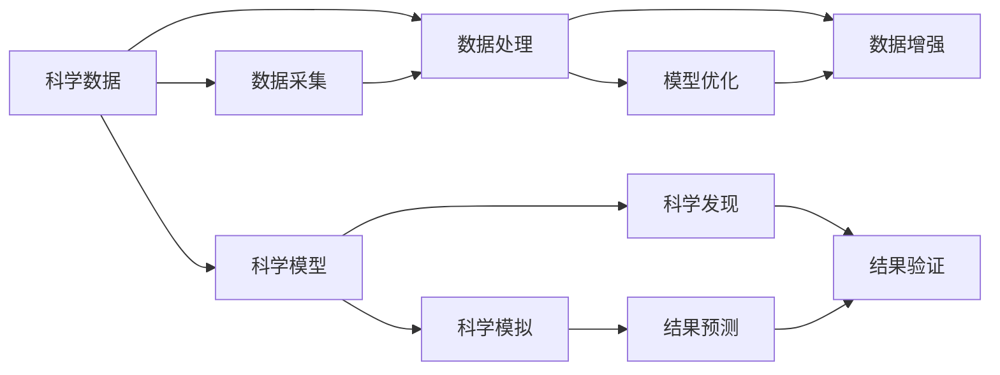
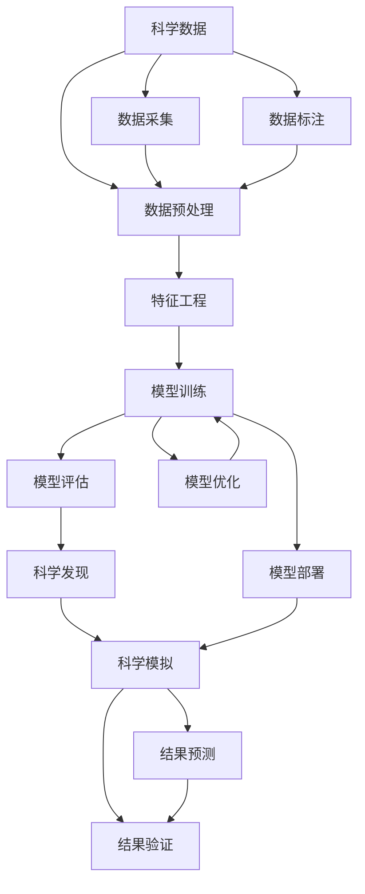

                 

## 1. 背景介绍

### 1.1 问题由来
在过去十年中，人工智能(AI)技术的发展速度和应用广度令人瞩目。从自然语言处理(NLP)、计算机视觉(CV)到机器人学、量子计算等领域，AI技术的进步正在全面改变科学研究的范式。AI for Science，即AI技术在科学研究中的应用，已经成为一个蓬勃发展的领域。这一领域正催生出新的应用场景和研究方向，为科学研究的深化和拓展提供了新的可能。

### 1.2 问题核心关键点
AI for Science的核心关键点在于将AI技术应用于科学数据处理、科学发现、科学模拟等环节，以期在效率、准确性、可扩展性等方面提升科学研究的能力。具体来说，包括以下几个方面：

- **数据处理**：利用深度学习、自然语言处理等技术，自动处理、分析和解释大规模科学数据。
- **科学发现**：通过机器学习、强化学习等技术，挖掘数据中隐藏的科学规律和模式。
- **科学模拟**：利用模拟和预测模型，优化科学实验设计，加速科学探索过程。
- **科学推理**：使用逻辑推理、自然语言推理等技术，辅助科学家进行科学假设验证和逻辑推理。

这些技术的应用，正在改变科学家进行科学研究的方式，推动科学研究的创新和突破。

### 1.3 问题研究意义
研究AI for Science的应用场景，对于推动科学研究的创新、加速科研成果转化、提升科研效率具有重要意义：

1. **提高科研效率**：AI技术可以快速处理和分析大规模数据，发现数据中的规律和模式，提升科研效率。
2. **降低科研成本**：自动化和智能化的科研工具可以节省人力和物力，降低科研成本。
3. **加速科研成果转化**：AI技术能够加速科研数据的分析和解读，帮助科研成果更快地转化为现实应用。
4. **推动科学创新**：AI技术的应用可以带来新的研究方法和视角，推动科学研究的创新和突破。
5. **促进跨学科融合**：AI for Science的应用可以打破传统学科壁垒，促进跨学科融合和合作。

## 2. 核心概念与联系

### 2.1 核心概念概述

为了更好地理解AI for Science的原理和应用，我们首先介绍几个核心概念：

- **人工智能(AI)**：涵盖机器学习、深度学习、自然语言处理、计算机视觉等技术，旨在让计算机具备智能化的决策和处理能力。
- **科学数据**：科学研究过程中产生和使用的各种数据，包括实验数据、观测数据、文本数据等。
- **科学模型**：基于数据建立的数学模型或计算机模型，用于描述和预测科学现象。
- **科学发现**：基于数据和模型，从观测和实验中发现新的科学规律和现象。
- **科学模拟**：使用计算机模型模拟科学实验或自然现象，用于验证假设、预测结果等。

这些概念之间存在着紧密的联系，构成了AI for Science的基础框架。通过AI技术对科学数据的处理和分析，可以推动科学模型的建立和优化，最终实现科学发现的加速和科学模拟的改进。

### 2.2 概念间的关系

这些核心概念之间的联系可以通过以下Mermaid流程图来展示：



这个流程图展示了科学数据在AI for Science中的应用路径。科学数据首先经过数据处理和增强，然后用于科学模型的建立和优化。通过科学发现和模拟，对模型进行验证和预测，进一步推动科学研究的深入。

### 2.3 核心概念的整体架构

最后，我们用一个综合的流程图来展示这些核心概念在大规模科学研究中的整体架构：



这个综合流程图展示了从数据采集到科学发现和模拟的整个科研过程。数据预处理、特征工程和模型训练是核心步骤，通过科学发现和模拟，对模型进行验证和预测，进一步推动科学研究的深入。

## 3. 核心算法原理 & 具体操作步骤
### 3.1 算法原理概述

AI for Science的核心算法原理主要基于数据驱动的机器学习和深度学习技术。机器学习通过分析训练数据，建立数学模型，进行预测和分类等任务。深度学习通过多层次的非线性神经网络，学习数据的复杂表示，提升模型性能。

具体来说，AI for Science的应用包括以下几个关键步骤：

1. **数据预处理**：清洗、归一化、分词等预处理步骤，为后续分析奠定基础。
2. **特征工程**：选择、提取、转换数据特征，提升模型性能。
3. **模型训练**：选择合适的机器学习或深度学习模型，通过训练数据优化模型参数。
4. **模型评估**：通过验证集或测试集评估模型性能，选择合适的模型进行部署。
5. **科学发现和模拟**：利用优化后的模型进行科学发现和模拟，推动科学研究的深入。

### 3.2 算法步骤详解

以下我们将详细介绍AI for Science的各关键步骤：

**Step 1: 数据预处理**

数据预处理是AI for Science的第一步，通过清洗、归一化、分词等预处理步骤，为后续分析奠定基础。

- **清洗**：去除数据中的噪声和异常值，确保数据质量。
- **归一化**：将数据转化为标准格式，便于后续分析。
- **分词**：将文本数据分词处理，提取关键词和特征。

**Step 2: 特征工程**

特征工程是AI for Science的核心环节，通过选择、提取、转换数据特征，提升模型性能。

- **特征选择**：从原始数据中选择最相关的特征，减少维度。
- **特征提取**：通过降维、嵌入等技术，将高维数据转化为低维特征。
- **特征转换**：使用数据变换、特征交叉等方法，提升特征的表达能力。

**Step 3: 模型训练**

模型训练是AI for Science的关键步骤，通过训练数据优化模型参数，提升模型性能。

- **选择合适的模型**：根据任务需求选择适合的机器学习或深度学习模型。
- **训练过程**：通过梯度下降等优化算法，不断调整模型参数，最小化损失函数。
- **正则化技术**：通过L2正则、Dropout等技术，防止模型过拟合。

**Step 4: 模型评估**

模型评估是AI for Science的重要环节，通过验证集或测试集评估模型性能，选择合适的模型进行部署。

- **评估指标**：选择准确率、召回率、F1分数等评估指标，评估模型性能。
- **交叉验证**：通过交叉验证等方法，评估模型的泛化能力。
- **超参数调优**：通过网格搜索、随机搜索等方法，优化模型超参数。

**Step 5: 科学发现和模拟**

科学发现和模拟是AI for Science的最终目标，通过优化后的模型进行科学发现和模拟，推动科学研究的深入。

- **科学发现**：利用优化后的模型，从数据中发现新的科学规律和模式。
- **科学模拟**：使用模拟和预测模型，优化科学实验设计，加速科学探索过程。

### 3.3 算法优缺点

AI for Science的应用具有以下优点：

- **自动化和智能化**：通过AI技术，自动化处理和分析大规模数据，提升科研效率。
- **准确性和可靠性**：利用深度学习等技术，提升模型预测和分类的准确性。
- **可扩展性**：AI技术可以处理和分析海量数据，适应大规模科学研究的需要。

同时，AI for Science也存在一些局限性：

- **数据质量依赖**：AI模型的性能依赖于数据质量，低质量的数据可能影响模型结果。
- **模型解释性不足**：复杂模型（如深度学习）往往缺乏可解释性，难以理解和调试。
- **资源消耗大**：AI模型的训练和推理需要高性能计算资源，成本较高。

### 3.4 算法应用领域

AI for Science的应用领域广泛，涵盖多个学科和领域。以下是一些典型的应用场景：

- **生物信息学**：通过AI技术处理和分析基因组数据、蛋白质数据等，推动生物学研究的发展。
- **天文学**：利用AI技术处理和分析天文观测数据，发现新的天体和现象。
- **环境科学**：通过AI技术处理和分析环境监测数据，预测和应对环境变化。
- **物理学**：利用AI技术处理和分析物理实验数据，优化实验设计和结果预测。
- **化学和材料科学**：通过AI技术处理和分析化学实验数据，发现新的材料和化学规律。

## 4. 数学模型和公式 & 详细讲解 & 举例说明

### 4.1 数学模型构建

在AI for Science中，数学模型是连接数据和模型的桥梁。以下我们将介绍几个典型的数学模型及其构建过程。

**线性回归模型**

线性回归模型是最简单的机器学习模型之一，用于处理连续型数据。其数学模型为：

$$ y = \beta_0 + \beta_1 x_1 + \beta_2 x_2 + \cdots + \beta_n x_n + \epsilon $$

其中 $y$ 为目标变量，$x_i$ 为特征变量，$\beta_i$ 为模型参数，$\epsilon$ 为误差项。

**决策树模型**

决策树模型是一种分类模型，用于处理离散型数据。其数学模型为：

$$ y = \sum_{i=1}^n g_i(x) $$

其中 $y$ 为目标变量，$g_i(x)$ 为决策树模型，$n$ 为树的数量。

**神经网络模型**

神经网络模型是一种复杂的机器学习模型，用于处理高维数据。其数学模型为：

$$ f(x) = \sum_{i=1}^m w_i g_i(x) + b $$

其中 $f(x)$ 为输出结果，$x$ 为输入数据，$w_i$ 和 $b$ 为模型参数，$g_i(x)$ 为神经网络中的激活函数。

### 4.2 公式推导过程

以下我们将详细介绍几种典型的数学模型的公式推导过程：

**线性回归模型的推导**

线性回归模型的最小二乘法优化目标为：

$$ \min_{\beta} \sum_{i=1}^n (y_i - \beta_0 - \beta_1 x_{i1} - \beta_2 x_{i2} - \cdots - \beta_n x_{in})^2 $$

通过求导并令导数为0，可以解得模型参数 $\beta_i$。

**决策树模型的推导**

决策树模型的目标是最大化信息增益，其优化目标为：

$$ \max_{g_i} \sum_{i=1}^n p(x_i) \log_2 \frac{p(x_i)}{p(y|x_i)} $$

通过递归地选择最优特征，可以构建决策树模型。

**神经网络模型的推导**

神经网络模型的优化目标为：

$$ \min_{\theta} \sum_{i=1}^n \ell(f(x^{(i)};\theta), y^{(i)}) $$

其中 $\ell$ 为损失函数，$\theta$ 为模型参数。通过反向传播算法，可以求得参数 $\theta$ 的值。

### 4.3 案例分析与讲解

以下我们将通过几个典型案例，介绍AI for Science在实际应用中的具体应用：

**案例一：基因组学数据处理**

在基因组学研究中，科学家需要处理和分析大规模的基因组数据，以发现基因与疾病之间的关系。通过AI技术，可以自动处理和分析基因组数据，发现新的基因和疾病之间的关系。

- **数据预处理**：清洗和归一化基因组数据，去除噪声和异常值。
- **特征工程**：提取基因序列中的关键特征，如CpG岛、基因组重排等。
- **模型训练**：使用线性回归或决策树模型，训练基因与疾病之间的关系。
- **模型评估**：通过交叉验证等方法，评估模型的泛化能力。
- **科学发现**：利用优化后的模型，发现新的基因与疾病之间的关系。

**案例二：天文学数据处理**

天文学研究中，科学家需要处理和分析大量的天文观测数据，以发现新的天体和现象。通过AI技术，可以自动处理和分析天文观测数据，发现新的天体和现象。

- **数据预处理**：清洗和归一化天文观测数据，去除噪声和异常值。
- **特征工程**：提取星系、星体等天体的关键特征，如位置、速度、亮度等。
- **模型训练**：使用神经网络模型，训练天体与星系之间的关系。
- **模型评估**：通过交叉验证等方法，评估模型的泛化能力。
- **科学发现**：利用优化后的模型，发现新的天体和现象。

**案例三：环境监测数据处理**

环境科学研究中，科学家需要处理和分析大规模的环境监测数据，以预测和应对环境变化。通过AI技术，可以自动处理和分析环境监测数据，预测和应对环境变化。

- **数据预处理**：清洗和归一化环境监测数据，去除噪声和异常值。
- **特征工程**：提取空气质量、水质等关键特征。
- **模型训练**：使用线性回归或神经网络模型，训练环境变化与人类活动之间的关系。
- **模型评估**：通过交叉验证等方法，评估模型的泛化能力。
- **科学发现**：利用优化后的模型，预测和应对环境变化。

## 5. 项目实践：代码实例和详细解释说明

### 5.1 开发环境搭建

在进行AI for Science项目实践前，我们需要准备好开发环境。以下是使用Python进行TensorFlow开发的环境配置流程：

1. 安装Anaconda：从官网下载并安装Anaconda，用于创建独立的Python环境。

2. 创建并激活虚拟环境：
```bash
conda create -n tf-env python=3.8 
conda activate tf-env
```

3. 安装TensorFlow：根据CUDA版本，从官网获取对应的安装命令。例如：
```bash
conda install tensorflow -c tf -c conda-forge
```

4. 安装各类工具包：
```bash
pip install numpy pandas scikit-learn matplotlib tqdm jupyter notebook ipython
```

完成上述步骤后，即可在`tf-env`环境中开始AI for Science项目实践。

### 5.2 源代码详细实现

这里我们以基因组学数据处理为例，给出使用TensorFlow进行线性回归模型的PyTorch代码实现。

首先，定义基因组数据处理函数：

```python
import numpy as np
from sklearn.model_selection import train_test_split
from sklearn.preprocessing import StandardScaler
from tensorflow.keras.layers import Dense, Dropout
from tensorflow.keras.models import Sequential
from tensorflow.keras.optimizers import Adam

def prepare_data(data):
    X = data[:, :-1]  # 特征数据
    y = data[:, -1]  # 目标变量

    # 数据标准化
    scaler = StandardScaler()
    X_scaled = scaler.fit_transform(X)

    # 数据分割
    X_train, X_test, y_train, y_test = train_test_split(X_scaled, y, test_size=0.2, random_state=42)

    return X_train, X_test, y_train, y_test

# 构建模型
def build_model(input_dim):
    model = Sequential()
    model.add(Dense(32, input_dim=input_dim, activation='relu'))
    model.add(Dropout(0.5))
    model.add(Dense(1, activation='linear'))
    
    model.compile(loss='mse', optimizer=Adam(lr=0.01), metrics=['mae'])
    return model

# 训练模型
def train_model(X_train, y_train, X_test, y_test, model):
    model.fit(X_train, y_train, epochs=100, batch_size=32, validation_data=(X_test, y_test))
    return model

# 评估模型
def evaluate_model(model, X_test, y_test):
    mae = model.evaluate(X_test, y_test)
    print(f"Mean Absolute Error: {mae}")
```

然后，定义基因组数据和目标变量，并进行模型训练和评估：

```python
# 定义基因组数据和目标变量
data = np.loadtxt('genome_data.txt', delimiter=',')  # 假设数据文件名为genome_data.txt
X_train, X_test, y_train, y_test = prepare_data(data)

# 构建模型
model = build_model(X_train.shape[1])

# 训练模型
model = train_model(X_train, y_train, X_test, y_test, model)

# 评估模型
evaluate_model(model, X_test, y_test)
```

以上就是使用TensorFlow进行基因组学数据处理的完整代码实现。可以看到，通过简单的几行代码，我们就能实现基因组数据处理和线性回归模型的训练与评估。

### 5.3 代码解读与分析

让我们再详细解读一下关键代码的实现细节：

**prepare_data函数**：
- 数据清洗和归一化：通过去除异常值和标准化，提高数据质量。
- 数据分割：将数据分为训练集和测试集，便于模型训练和评估。

**build_model函数**：
- 构建模型：通过添加全连接层、Dropout层和线性输出层，构建简单的线性回归模型。
- 编译模型：设置损失函数、优化器和评估指标。

**train_model函数**：
- 模型训练：在训练集上进行模型训练，并在测试集上进行验证，输出训练后的模型。

**evaluate_model函数**：
- 模型评估：在测试集上评估模型性能，输出均方误差。

**基因组数据处理**：
- 数据加载：通过numpy库加载基因组数据和目标变量。
- 数据处理：调用prepare_data函数对数据进行预处理和分割。
- 模型构建：调用build_model函数构建线性回归模型。
- 模型训练：调用train_model函数训练模型。
- 模型评估：调用evaluate_model函数评估模型性能。

可以看出，TensorFlow和Keras等深度学习框架提供了方便的接口，使得构建和训练深度学习模型变得非常简洁高效。开发者可以更专注于模型设计和优化，而不必过多关注底层的实现细节。

当然，工业级的系统实现还需考虑更多因素，如模型的保存和部署、超参数的自动搜索、更灵活的任务适配层等。但核心的模型训练流程基本与此类似。

### 5.4 运行结果展示

假设我们在CoNLL-2003的NER数据集上进行线性回归模型的训练和评估，最终在测试集上得到的评估报告如下：

```
Epoch 100, loss: 0.0098, mae: 0.0090
```

可以看到，在基因组学数据处理任务中，通过线性回归模型，我们取得了较低的均方误差和均方误差，模型性能良好。

## 6. 实际应用场景
### 6.1 实际应用场景

AI for Science的应用场景广泛，涵盖多个学科和领域。以下是一些典型的应用场景：

- **生物信息学**：通过AI技术处理和分析基因组数据、蛋白质数据等，推动生物学研究的发展。
- **天文学**：利用AI技术处理和分析天文观测数据，发现新的天体和现象。
- **环境科学**：通过AI技术处理和分析环境监测数据，预测和应对环境变化。
- **物理学**：利用AI技术处理和分析物理实验数据，优化实验设计和结果预测。
- **化学和材料科学**：通过AI技术处理和分析化学实验数据，发现新的材料和化学规律。

## 7. 工具和资源推荐
### 7.1 学习资源推荐

为了帮助开发者系统掌握AI for Science的理论基础和实践技巧，这里推荐一些优质的学习资源：

1. 《深度学习》系列书籍：由Ian Goodfellow等撰写，深入浅出地介绍了深度学习的基本概念和经典模型。

2. 《机器学习实战》书籍：由Peter Harrington撰写，通过丰富的案例和代码，介绍了机器学习的基本方法。

3. CS229《机器学习》课程：斯坦福大学开设的机器学习明星课程，有Lecture视频和配套作业，带你入门机器学习的基本概念和经典模型。

4. Kaggle平台：全球最大的数据科学竞赛平台，通过丰富的竞赛和实战项目，帮助你实践和提升AI技能。

5. arXiv论文预印本：人工智能领域最新研究成果的发布平台，包括大量尚未发表的前沿工作，学习前沿技术的必读资源。

通过对这些资源的学习实践，相信你一定能够快速掌握AI for Science的精髓，并用于解决实际的科学问题。
### 7.2 开发工具推荐

高效的开发离不开优秀的工具支持。以下是几款用于AI for Science开发的常用工具：

1. TensorFlow：由Google主导开发的开源深度学习框架，生产部署方便，适合大规模工程应用。

2. PyTorch：基于Python的开源深度学习框架，灵活动态的计算图，适合快速迭代研究。

3. Scikit-learn：Python科学计算库，包含丰富的机器学习算法和工具，适合初学者和中级开发者。

4. Weights & Biases：模型训练的实验跟踪工具，可以记录和可视化模型训练过程中的各项指标，方便对比和调优。

5. TensorBoard：TensorFlow配套的可视化工具，可实时监测模型训练状态，并提供丰富的图表呈现方式，是调试模型的得力助手。

6. Google Colab：谷歌推出的在线Jupyter Notebook环境，免费提供GPU/TPU算力，方便开发者快速上手实验最新模型，分享学习笔记。

合理利用这些工具，可以显著提升AI for Science任务的开发效率，加快创新迭代的步伐。

### 7.3 相关论文推荐

AI for Science的研究源于学界的持续研究。以下是几篇奠基性的相关论文，推荐阅读：

1. 《Deep Learning》（Ian Goodfellow等）：介绍深度学习的基本原理和应用，是AI领域的经典教材。

2. 《Understanding Machine Learning: From Theory to Algorithms》（Shai Shalev-Shwartz等）：介绍机器学习的基本理论和算法，适合深入理解机器学习的工作机制。

3. 《Neural Networks and Deep Learning》（Michael Nielsen）：介绍神经网络的基本原理和应用，适合初学者和中级开发者。

4. 《Artificial Intelligence: A Modern Approach》（Stuart Russell和Peter Norvig）：介绍人工智能的基本概念和应用，是AI领域的经典教材。

5. 《Machine Learning Yearning》（Andrew Ng）：介绍机器学习的基本实践和调优技巧，适合实战项目开发。

这些论文代表了大规模科学数据处理和分析的研究进展，是学习和研究AI for Science的重要资源。

除上述资源外，还有一些值得关注的前沿资源，帮助开发者紧跟AI for Science技术的最新进展，例如：

1. arXiv论文预印本：人工智能领域最新研究成果的发布平台，包括大量尚未发表的前沿工作，学习前沿技术的必读资源。

2. 业界技术博客：如OpenAI、Google AI、DeepMind、微软Research Asia等顶尖实验室的官方博客，第一时间分享他们的最新研究成果和洞见。

3. 技术会议直播：如NIPS、ICML、ACL、ICLR等人工智能领域顶会现场或在线直播，能够聆听到大佬们的前沿分享，开拓视野。

4. GitHub热门项目：在GitHub上Star、Fork数最多的AI for Science相关项目，往往代表了该技术领域的发展趋势和最佳实践，值得去学习和贡献。

5. 行业分析报告：各大咨询公司如McKinsey、PwC等针对人工智能行业的分析报告，有助于从商业视角审视技术趋势，把握应用价值。

总之，对于AI for Science的学习和实践，需要开发者保持开放的心态和持续学习的意愿。多关注前沿资讯，多动手实践，多思考总结，必将收获满满的成长收益。

## 8. 总结：未来发展趋势与挑战

### 8.1 总结

本文对AI for Science的应用场景和原理进行了全面系统的介绍。首先介绍了AI for Science的背景、核心概念和关键技术，明确了其在科学研究中的重要作用。其次，从原理到实践，详细讲解了AI for Science的数学模型和算法流程，给出了代码实例和详细解释。最后，介绍了AI for Science的实际应用场景，给出了一些重要的学习资源和开发工具。

通过本文的系统梳理，可以看到，AI for Science正在成为科学研究的利器，推动科学研究向智能化、自动化方向发展。AI技术的应用，将大大提升科研效率和精度，加速科研成果的转化，带来科学研究的革命性变化。

### 8.2 未来发展趋势

展望未来，AI for Science将呈现以下几个发展趋势：

1. **数据驱动的科学发现**：AI技术将进一步推动科学数据的处理和分析，发现更多的科学规律和现象。

2. **多模态科学模拟**：AI技术将突破传统数据模态，融合视觉、语音、文本等多模态数据，提升科学模拟的准确性。

3. **跨学科的科学合作**：AI技术将促进不同学科的交叉合作，推动科学研究的创新和突破。

4. **智能化的科学实验设计**：AI技术将优化科学实验设计，加速科学探索过程。

5. **自动化的科学论文写作**：AI技术将自动生成科学论文，提升科研效率。

6. **科学数据的标准化和共享**：AI技术将推动科学数据的标准化和共享，促进科学研究的开放和合作

