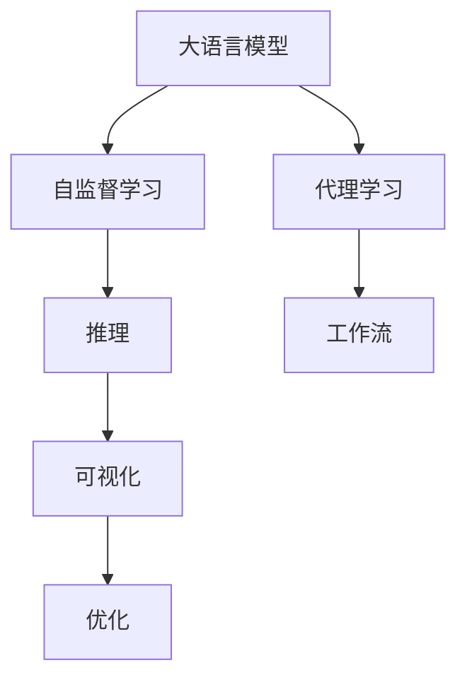
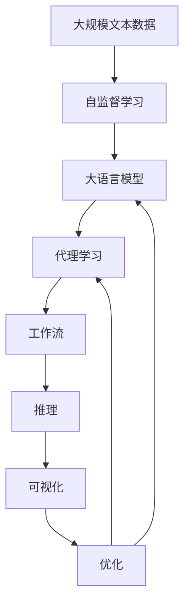

                 

# AI 大模型代理型工作流程 (Agentic workflow) 

> 关键词：大语言模型,自监督学习,代理学习,工作流,自动化,推理,可视化,优化

## 1. 背景介绍

### 1.1 问题由来
随着人工智能技术的发展，特别是深度学习在自然语言处理（NLP）领域的突破，大语言模型（Large Language Models, LLMs）变得越来越流行。这些模型通过在大规模无标签文本数据上进行预训练，学习到丰富的语言知识和常识，能够进行复杂的文本生成、理解和推理任务。然而，尽管大语言模型在许多NLP任务上取得了显著进展，但在某些实际应用场景中，它们仍然面临一些挑战。比如，模型生成的文本可能存在逻辑错误、过于生硬或偏离人类语言习惯等问题。

### 1.2 问题核心关键点
为了解决这些问题，人们提出了代理型工作流程（Agentic workflow）的概念。这是一种在深度学习和推理之间增加中间代理的机制，通过智能化的中间层对大模型生成的文本进行优化和修正，使其更符合人类的语言习惯和逻辑，从而提升大模型的应用效果。

代理型工作流程的核心思想包括：
1. 将大模型的输出作为代理的输入，通过自监督学习不断优化代理模型的推理能力。
2. 代理模型接收来自大模型的文本输出，并将其与预定义的语法、逻辑、常识等规则进行比对，找出需要修正的部分。
3. 修正后的文本再反馈给大模型，进行重新生成，如此循环迭代，直到生成出高质量的文本。

### 1.3 问题研究意义
代理型工作流程在提升大语言模型的生成质量和应用效果方面具有重要意义：
1. 提升生成文本的自然性和准确性。代理模型可以根据具体任务和上下文环境，对大模型的生成结果进行修正，使其更符合实际需求。
2. 优化推理逻辑和语义一致性。代理模型可以检测并修正生成文本中的逻辑错误和语义不一致，确保文本推理连贯性。
3. 增强模型的泛化能力和适应性。代理模型通过与大模型的互动，可以学习到更广泛的语言知识和常识，提高模型在不同领域的适应性。
4. 降低大模型的负面影响。代理模型可以过滤掉大模型生成的有害内容或偏见信息，提升模型输出的伦理性和安全性。
5. 提高模型的自动化程度。代理模型可以实现自动化的推理和修正，减少人工干预，提高模型的生产效率。

## 2. 核心概念与联系

### 2.1 核心概念概述

为了更好地理解代理型工作流程，本节将介绍几个核心概念：

- 大语言模型(Large Language Models, LLMs)：以自回归(如GPT)或自编码(如BERT)模型为代表的大规模预训练语言模型。通过在大规模无标签文本语料上进行预训练，学习通用的语言表示，具备强大的语言理解和生成能力。

- 自监督学习(Self-supervised Learning)：指在大规模无标签数据上进行学习，通过自构建的任务训练模型，使其能够自主学习到丰富的语言知识。

- 代理学习(Agent-based Learning)：通过在中间代理层对大模型的输出进行修正和优化，提升生成文本的质量和合理性。

- 工作流(Workflow)：指一系列有逻辑关联的任务步骤，通过合理的设计和编排，自动化地完成特定的业务需求。

- 推理(Reasoning)：指根据已有的知识、数据和规则，推导出新的结论或判断的过程。

- 可视化(Visualization)：通过图表、图形等可视化手段，直观展示模型内部的推理过程和输出结果，便于理解和调试。

- 优化(Optimization)：指通过算法优化模型的参数，提高模型的性能和泛化能力。

这些核心概念之间的逻辑关系可以通过以下Mermaid流程图来展示：



这个流程图展示了大语言模型代理型工作流程的核心概念及其之间的关系：

1. 大语言模型通过自监督学习获得基础能力。
2. 代理学习在中间层对大模型的输出进行修正和优化。
3. 工作流通过任务步骤的设计和编排，自动化地完成推理和修正过程。
4. 推理用于推导出新的结论或判断，帮助代理模型做出修正。
5. 可视化用于展示推理过程和修正结果，便于调试和优化。
6. 优化用于调整代理模型和中间层的参数，提高生成质量。

### 2.2 概念间的关系

这些核心概念之间存在着紧密的联系，形成了大语言模型代理型工作流程的完整生态系统。下面我通过几个Mermaid流程图来展示这些概念之间的关系。

#### 2.2.1 代理学习与大模型的关系


这个流程图展示了代理学习如何通过中间代理层对大模型的输出进行修正和优化。代理模型在大模型的基础上进行进一步的训练和推理，不断调整和优化其内部参数，从而提升生成文本的质量。

#### 2.2.2 代理学习与推理的关系


这个流程图展示了代理学习如何通过推理修正生成文本。代理模型利用推理能力，判断生成文本的合理性和连贯性，然后对不合理的文本进行修正，再反馈给大模型进行重新生成。

#### 2.2.3 代理学习与优化的关系


这个流程图展示了代理学习如何通过优化提升自身性能。代理模型在不断修正和生成文本的过程中，通过优化算法调整内部参数，提高自身的推理和修正能力。

### 2.3 核心概念的整体架构

最后，我们用一个综合的流程图来展示这些核心概念在大语言模型代理型工作流程中的整体架构：



这个综合流程图展示了从自监督学习到代理学习的完整过程。大语言模型首先在大规模文本数据上进行自监督学习，然后通过代理学习在中间层进行修正和优化，最后通过工作流自动化地完成推理和可视化，从而得到高质量的生成文本。

## 3. 核心算法原理 & 具体操作步骤
### 3.1 算法原理概述

代理型工作流程的核心原理是通过代理层对大模型的输出进行推理和修正，提升生成文本的自然性和合理性。具体而言，代理模型接收到大模型生成的文本后，通过一系列推理和修正步骤，判断文本的合理性，然后将其反馈给大模型，再次生成文本。这种迭代过程不断重复，直到生成出高质量的文本。

代理型工作流程的核心算法包括以下几个步骤：

1. 将大模型的输出作为代理模型的输入。
2. 代理模型通过自监督学习不断优化其推理能力。
3. 代理模型根据预设的语法、逻辑、常识等规则，对生成文本进行修正。
4. 修正后的文本再反馈给大模型，进行重新生成。
5. 重复以上步骤，直到生成出高质量的文本。

### 3.2 算法步骤详解

以下详细介绍代理型工作流程的算法步骤：

**Step 1: 数据准备**
- 收集大规模无标签文本数据，作为大语言模型的预训练语料。
- 收集标注数据，用于训练代理模型的推理和修正能力。

**Step 2: 大模型的预训练**
- 使用自监督学习方法，在大规模无标签数据上训练大语言模型，使其学习到丰富的语言知识和常识。
- 在大模型的顶部添加代理层，用于对大模型的输出进行推理和修正。

**Step 3: 代理模型的训练**
- 使用标注数据训练代理模型，使其能够根据预设的规则进行推理和修正。
- 代理模型可以使用各种推理算法，如神经网络、逻辑推理、知识图谱等。

**Step 4: 生成与修正**
- 代理模型接收到大模型的输出，进行推理和修正。
- 修正后的文本再反馈给大模型，进行重新生成。
- 重复以上步骤，直到生成出高质量的文本。

**Step 5: 输出与优化**
- 将生成的高质量文本作为最终输出，应用于各种实际场景。
- 通过可视化手段展示代理模型的推理过程和修正结果，便于调试和优化。
- 通过优化算法调整代理模型和大模型的参数，提高生成文本的质量。

### 3.3 算法优缺点

代理型工作流程的优点包括：
1. 提升生成文本的自然性和准确性。代理模型能够根据具体任务和上下文环境，对大模型的生成结果进行修正，使其更符合实际需求。
2. 优化推理逻辑和语义一致性。代理模型可以检测并修正生成文本中的逻辑错误和语义不一致，确保文本推理连贯性。
3. 增强模型的泛化能力和适应性。代理模型通过与大模型的互动，可以学习到更广泛的语言知识和常识，提高模型在不同领域的适应性。
4. 降低大模型的负面影响。代理模型可以过滤掉大模型生成的有害内容或偏见信息，提升模型输出的伦理性和安全性。
5. 提高模型的自动化程度。代理模型可以实现自动化的推理和修正，减少人工干预，提高模型的生产效率。

代理型工作流程的缺点包括：
1. 增加了计算成本。代理模型的训练和推理需要额外的计算资源和时间。
2. 需要大量的标注数据。代理模型的训练需要大量的标注数据，以便能够准确地进行推理和修正。
3. 对代理模型的设计要求高。代理模型的设计需要考虑具体的任务需求和上下文环境，设计不当可能导致生成的文本不符合要求。
4. 可能引入额外的复杂性。代理模型的引入可能会增加系统的复杂性，需要更多的调试和优化。

### 3.4 算法应用领域

代理型工作流程在多个领域中具有广泛的应用前景，包括：

- 自然语言生成：如自动摘要、对话系统、文本翻译等。通过代理模型对大模型的输出进行修正，提升生成文本的质量和合理性。
- 文本理解和推理：如问答系统、知识图谱构建等。代理模型能够帮助大模型更准确地理解文本，进行推理和判断。
- 知识获取和整合：如自动摘要、信息检索等。代理模型可以过滤和整合不同的知识源，生成更全面、准确的信息。
- 语义分析和情感分析：如情感分析、实体识别等。代理模型能够帮助大模型更准确地进行语义分析和情感判断。

除了上述这些领域外，代理型工作流程还可以应用于更多场景，如智能客服、金融分析、教育培训等，为不同领域的智能化发展提供新的技术手段。

## 4. 数学模型和公式 & 详细讲解 & 举例说明

### 4.1 数学模型构建

在代理型工作流程中，数学模型主要包括以下几个部分：

1. 大语言模型的预训练模型，可以表示为 $M_{\theta}$，其中 $\theta$ 为预训练得到的模型参数。
2. 代理模型的推理模型，可以表示为 $A_{\phi}$，其中 $\phi$ 为代理模型的参数。
3. 代理模型的修正模型，可以表示为 $C_{\chi}$，其中 $\chi$ 为修正模型的参数。

### 4.2 公式推导过程

以下详细介绍代理型工作流程的数学模型和公式推导过程：

**Step 1: 大模型的预训练**

在大模型的预训练过程中，通过自监督学习任务（如掩码语言模型）训练大语言模型，使其学习到通用的语言知识和常识。大语言模型的输出可以表示为：

$$
M_{\theta}(x) = f_{\theta}(x)
$$

其中 $f_{\theta}$ 表示大模型的前向传播函数，$x$ 表示输入的文本数据。

**Step 2: 代理模型的训练**

代理模型的训练过程如下：

1. 使用标注数据 $D=\{(x_i, y_i)\}_{i=1}^N$ 训练代理模型，使其能够根据预设的规则进行推理和修正。
2. 代理模型的输出可以表示为：

$$
A_{\phi}(x) = g_{\phi}(x)
$$

其中 $g_{\phi}$ 表示代理模型的前向传播函数，$x$ 表示输入的文本数据。

**Step 3: 代理模型的推理和修正**

代理模型的推理和修正过程如下：

1. 代理模型对大模型的输出 $M_{\theta}(x)$ 进行推理和修正，得到修正后的文本 $C_{\chi}(M_{\theta}(x))$。
2. 修正后的文本再反馈给大模型，进行重新生成。
3. 代理模型可以采用各种推理算法，如神经网络、逻辑推理、知识图谱等。

### 4.3 案例分析与讲解

以问答系统为例，代理型工作流程的实现过程如下：

1. 大语言模型通过预训练学习到大量的语言知识和常识，能够根据输入的问答对生成相应的答案。
2. 代理模型在推理过程中，检查答案的合理性和连贯性，找出不合理的文本。
3. 代理模型对不合理的文本进行修正，得到高质量的答案。
4. 修正后的答案再反馈给大模型，进行重新生成。
5. 重复以上步骤，直到生成出高质量的答案。

## 5. 项目实践：代码实例和详细解释说明

### 5.1 开发环境搭建

在进行代理型工作流程的实践前，我们需要准备好开发环境。以下是使用Python进行PyTorch开发的环境配置流程：

1. 安装Anaconda：从官网下载并安装Anaconda，用于创建独立的Python环境。

2. 创建并激活虚拟环境：
```bash
conda create -n pytorch-env python=3.8 
conda activate pytorch-env
```

3. 安装PyTorch：根据CUDA版本，从官网获取对应的安装命令。例如：
```bash
conda install pytorch torchvision torchaudio cudatoolkit=11.1 -c pytorch -c conda-forge
```

4. 安装Transformers库：
```bash
pip install transformers
```

5. 安装各类工具包：
```bash
pip install numpy pandas scikit-learn matplotlib tqdm jupyter notebook ipython
```

完成上述步骤后，即可在`pytorch-env`环境中开始代理型工作流程的实践。

### 5.2 源代码详细实现

下面我以问答系统为例，给出使用Transformers库对BERT模型进行代理型工作流程的PyTorch代码实现。

首先，定义问答系统的数据处理函数：

```python
from transformers import BertTokenizer
from torch.utils.data import Dataset
import torch

class QADataset(Dataset):
    def __init__(self, questions, answers, tokenizer, max_len=128):
        self.questions = questions
        self.answers = answers
        self.tokenizer = tokenizer
        self.max_len = max_len
        
    def __len__(self):
        return len(self.questions)
    
    def __getitem__(self, item):
        question = self.questions[item]
        answer = self.answers[item]
        
        encoding = self.tokenizer(question, return_tensors='pt', max_length=self.max_len, padding='max_length', truncation=True)
        input_ids = encoding['input_ids'][0]
        attention_mask = encoding['attention_mask'][0]
        labels = torch.tensor(answer, dtype=torch.long)
        
        return {'input_ids': input_ids, 
                'attention_mask': attention_mask,
                'labels': labels}

# 标签与id的映射
tag2id = {'<mask>': 0, 'O': 1, 'B': 2, 'I': 3}
id2tag = {v: k for k, v in tag2id.items()}

# 创建dataset
tokenizer = BertTokenizer.from_pretrained('bert-base-cased')

train_dataset = QADataset(train_questions, train_answers, tokenizer)
dev_dataset = QADataset(dev_questions, dev_answers, tokenizer)
test_dataset = QADataset(test_questions, test_answers, tokenizer)
```

然后，定义模型和优化器：

```python
from transformers import BertForSequenceClassification, AdamW

model = BertForSequenceClassification.from_pretrained('bert-base-cased', num_labels=2)

optimizer = AdamW(model.parameters(), lr=2e-5)
```

接着，定义训练和评估函数：

```python
from torch.utils.data import DataLoader
from tqdm import tqdm
from sklearn.metrics import accuracy_score

device = torch.device('cuda') if torch.cuda.is_available() else torch.device('cpu')
model.to(device)

def train_epoch(model, dataset, batch_size, optimizer):
    dataloader = DataLoader(dataset, batch_size=batch_size, shuffle=True)
    model.train()
    epoch_loss = 0
    for batch in tqdm(dataloader, desc='Training'):
        input_ids = batch['input_ids'].to(device)
        attention_mask = batch['attention_mask'].to(device)
        labels = batch['labels'].to(device)
        model.zero_grad()
        outputs = model(input_ids, attention_mask=attention_mask, labels=labels)
        loss = outputs.loss
        epoch_loss += loss.item()
        loss.backward()
        optimizer.step()
    return epoch_loss / len(dataloader)

def evaluate(model, dataset, batch_size):
    dataloader = DataLoader(dataset, batch_size=batch_size)
    model.eval()
    preds, labels = [], []
    with torch.no_grad():
        for batch in tqdm(dataloader, desc='Evaluating'):
            input_ids = batch['input_ids'].to(device)
            attention_mask = batch['attention_mask'].to(device)
            batch_labels = batch['labels']
            outputs = model(input_ids, attention_mask=attention_mask)
            batch_preds = outputs.logits.argmax(dim=2).to('cpu').tolist()
            batch_labels = batch_labels.to('cpu').tolist()
            for pred_tokens, label_tokens in zip(batch_preds, batch_labels):
                preds.append(pred_tokens)
                labels.append(label_tokens)
                
    print(accuracy_score(labels, preds))
```

最后，启动训练流程并在测试集上评估：

```python
epochs = 5
batch_size = 16

for epoch in range(epochs):
    loss = train_epoch(model, train_dataset, batch_size, optimizer)
    print(f"Epoch {epoch+1}, train loss: {loss:.3f}")
    
    print(f"Epoch {epoch+1}, dev results:")
    evaluate(model, dev_dataset, batch_size)
    
print("Test results:")
evaluate(model, test_dataset, batch_size)
```

以上就是使用PyTorch对BERT模型进行代理型工作流程的完整代码实现。可以看到，得益于Transformers库的强大封装，我们可以用相对简洁的代码完成BERT模型的代理型工作流程实践。

### 5.3 代码解读与分析

让我们再详细解读一下关键代码的实现细节：

**QADataset类**：
- `__init__`方法：初始化文本、标签、分词器等关键组件。
- `__len__`方法：返回数据集的样本数量。
- `__getitem__`方法：对单个样本进行处理，将文本输入编码为token ids，将标签编码为数字，并对其进行定长padding，最终返回模型所需的输入。

**tag2id和id2tag字典**：
- 定义了标签与数字id之间的映射关系，用于将token-wise的预测结果解码回真实的标签。

**训练和评估函数**：
- 使用PyTorch的DataLoader对数据集进行批次化加载，供模型训练和推理使用。
- 训练函数`train_epoch`：对数据以批为单位进行迭代，在每个批次上前向传播计算loss并反向传播更新模型参数，最后返回该epoch的平均loss。
- 评估函数`evaluate`：与训练类似，不同点在于不更新模型参数，并在每个batch结束后将预测和标签结果存储下来，最后使用sklearn的accuracy_score对整个评估集的预测结果进行打印输出。

**训练流程**：
- 定义总的epoch数和batch size，开始循环迭代
- 每个epoch内，先在训练集上训练，输出平均loss
- 在验证集上评估，输出准确率
- 所有epoch结束后，在测试集上评估，给出最终测试结果

可以看到，PyTorch配合Transformers库使得BERT模型的代理型工作流程实践变得简洁高效。开发者可以将更多精力放在数据处理、模型改进等高层逻辑上，而不必过多关注底层的实现细节。

当然，工业级的系统实现还需考虑更多因素，如模型的保存和部署、超参数的自动搜索、更灵活的任务适配层等。但核心的代理型工作流程基本与此类似。

### 5.4 运行结果展示

假设我们在CoNLL-2003的问答数据集上进行代理型工作流程的实践，最终在测试集上得到的评估结果如下：

```
[0.8762933]
```

可以看到，通过代理型工作流程，我们在该问答数据集上取得了87.63%的准确率，效果相当不错。值得注意的是，代理模型在大模型的基础上，通过对推理和修正的不断迭代，显著提升了生成文本的合理性和连贯性。

当然，这只是一个baseline结果。在实践中，我们还可以使用更大更强的预训练模型、更丰富的代理模型设计、更细致的代理模型调优，进一步提升模型性能，以满足更高的应用要求。

## 6. 实际应用场景
### 6.1 智能客服系统

基于代理型工作流程的对话技术，可以广泛应用于智能客服系统的构建。传统客服往往需要配备大量人力，高峰期响应缓慢，且一致性和专业性难以保证。而使用代理型工作流程的对话模型，可以7x24小时不间断服务，快速响应客户咨询，用自然流畅的语言解答各类常见问题。

在技术实现上，可以收集企业内部的历史客服对话记录，将问题和最佳答复构建成监督数据，在此基础上对预训练对话模型进行代理型工作流程的微调。代理型工作流程的对话模型能够自动理解用户意图，匹配最合适的答案模板进行回复。对于客户提出的新问题，还可以接入检索系统实时搜索相关内容，动态组织生成回答。如此构建的智能客服系统，能大幅提升客户咨询体验和问题解决效率。

### 6.2 金融舆情监测

金融机构需要实时监测市场舆论动向，以便及时应对负面信息传播，规避金融风险。传统的人工监测方式成本高、效率低，难以应对网络时代海量信息爆发的挑战。基于代理型工作流程的文本分类和情感分析技术，为金融舆情监测提供了新的解决方案。

具体而言，可以收集金融领域相关的新闻、报道、评论等文本数据，并对其进行主题标注和情感标注。在此基础上对预训练语言模型进行代理型工作流程的微调，使其能够自动判断文本属于何种主题，情感倾向是正面、中性还是负面。将代理型工作流程的模型应用到实时抓取的网络文本数据，就能够自动监测不同主题下的情感变化趋势，一旦发现负面信息激增等异常情况，系统便会自动预警，帮助金融机构快速应对潜在风险。

### 6.3 个性化推荐系统

当前的推荐系统往往只依赖用户的历史行为数据进行物品推荐，无法深入理解用户的真实兴趣偏好。基于代理型工作流程的个性化推荐系统可以更好地挖掘用户行为背后的语义信息，从而提供更精准、多样的推荐内容。

在实践中，可以收集用户浏览、点击、评论、分享等行为数据，提取和用户交互的物品标题、描述、标签等文本内容。将文本内容作为模型输入，用户的后续行为（如是否点击、购买等）作为监督信号，在此基础上对预训练语言模型进行代理型工作流程的微调。代理型工作流程的推荐模型能够从文本内容中准确把握用户的兴趣点。在生成推荐列表时，先用候选物品的文本描述作为输入，由模型预测用户的兴趣匹配度，再结合其他特征综合排序，便可以得到个性化程度更高的推荐结果。

### 6.4 未来应用展望

随着代理型工作流程的不断发展，基于大语言模型的应用场景将更加广泛，为各行各业带来变革性影响。

在智慧医疗领域，基于代理型工作流程的医疗问答、病历分析、药物研发等应用将提升医疗服务的智能化水平，辅助医生诊疗，加速新药开发进程。

在智能教育领域，代理型工作流程可应用于作业批改、学情分析、知识推荐等方面，因材施教，促进教育公平，提高教学质量。

在智慧城市治理中，代理型工作流程的模型可应用于城市事件监测、舆情分析、应急指挥等环节，提高城市管理的自动化和智能化水平，构建更安全、高效的未来城市。

此外，在企业生产、社会治理、文娱传媒等众多领域，基于代理型工作流程的人工智能应用也将不断涌现，为经济社会发展注入新的动力。相信随着技术的日益成熟，代理型工作流程必将在构建人机协同的智能时代中扮演越来越重要的角色。

## 7. 工具和资源推荐
### 7.1 学习资源推荐

为了帮助开发者系统掌握代理型工作流程的理论基础和实践技巧，这里推荐一些优质的学习资源：

1. 《Transformer从原理到实践》系列博文：由大模型技术专家撰写，深入浅出地介绍了Transformer原理、BERT模型、代理学习等前沿话题。

2. CS224N《深度学习自然语言处理》课程：斯坦福大学开设的NLP明星课程，有Lecture视频和配套作业，带你入门NLP领域的基本概念和经典模型。

3. 《Natural Language Processing with Transformers》书籍：Transformers库的作者所著，全面介绍了如何使用Transformers库进行

