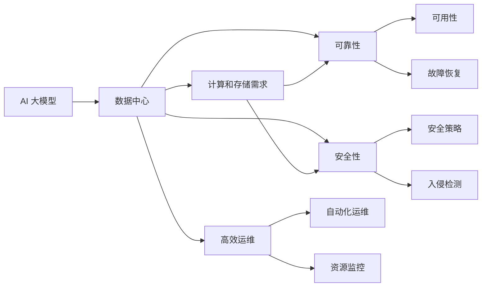
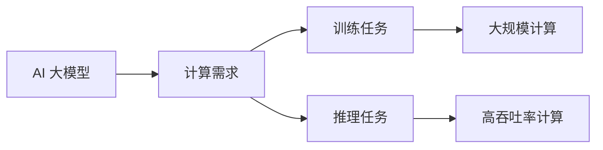
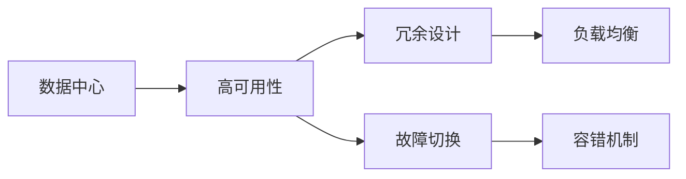
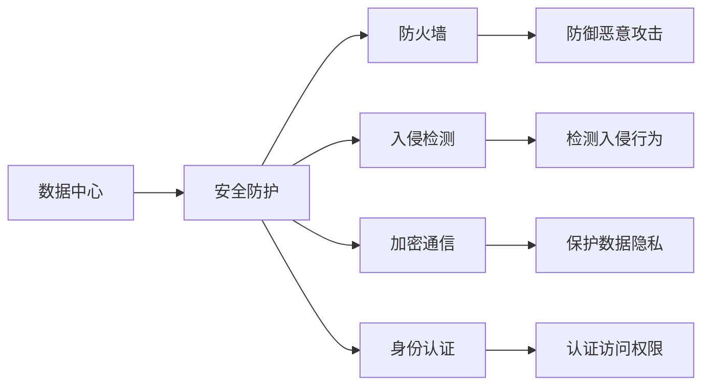
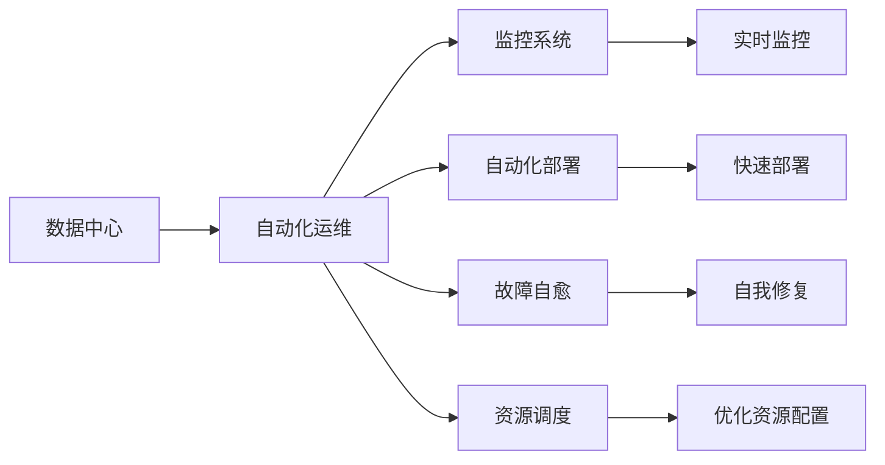
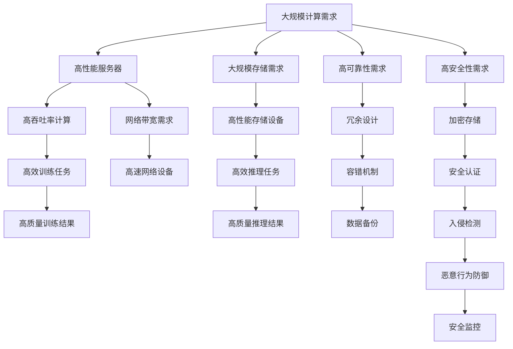

                 

# AI 大模型应用数据中心建设：数据中心安全与可靠性

## 1. 背景介绍

### 1.1 问题由来
随着人工智能技术的发展，AI 大模型的应用场景日益广泛，从自然语言处理、计算机视觉到智能推荐、金融预测等，AI 大模型在各行各业中发挥着越来越重要的作用。然而，随着模型复杂度的增加，其在数据中心建设上的需求也随之增长。如何高效、可靠地建设和管理数据中心，保障 AI 大模型的安全运行，成为目前业界关注的焦点。

### 1.2 问题核心关键点
AI 大模型应用数据中心建设的核心问题包括：

- 如何设计高效的数据中心架构，满足模型计算和存储需求。
- 如何保障数据中心的可靠性和安全性，避免单点故障和数据泄露。
- 如何优化数据中心运维管理，提高资源利用率和运营效率。
- 如何构建可持续发展的数据中心，支持长期稳定运行。

本文将详细介绍 AI 大模型应用数据中心的建设思路，涵盖数据中心安全与可靠性等核心问题，以期为 AI 大模型的应用实践提供参考。

### 1.3 问题研究意义
设计高效、可靠、安全的 AI 大模型应用数据中心，对于提升 AI 技术的普及率和应用效果，推动行业数字化转型具有重要意义。具体而言：

- 提升计算和存储效率：通过优化数据中心架构，可以显著提升 AI 大模型的计算和存储效率，满足日益增长的数据需求。
- 保障数据安全和隐私：通过加强数据中心的防护措施，可以有效防止数据泄露和滥用，保护用户隐私和公司机密。
- 优化运维管理流程：通过自动化和智能化运维手段，可以降低运维成本，提高数据中心运营效率。
- 推动行业应用创新：通过构建可持续发展的数据中心，可以为 AI 技术的长期应用提供坚实保障，加速行业创新发展。

## 2. 核心概念与联系

### 2.1 核心概念概述

为更好地理解 AI 大模型应用数据中心建设，本节将介绍几个密切相关的核心概念：

- AI 大模型：以自回归模型（如 GPT）或自编码模型（如 BERT）为代表的大规模预训练模型，具备强大的语义理解和生成能力。
- 数据中心（Data Center, DC）：存放和管理数据、计算资源的设施，包括服务器、存储设备、网络设备等。
- 计算和存储需求：AI 大模型的训练和推理需要大量的计算资源和存储空间，数据中心需满足这些需求。
- 可靠性（Reliability）：数据中心系统持续运行并满足预定性能和服务质量的能力。
- 安全性（Security）：数据中心系统保护数据和应用免受未经授权的访问和攻击的能力。
- 高效运维（Efficient Operation and Maintenance）：通过自动化和智能化手段，优化数据中心的运维管理，提高资源利用率和运营效率。

这些核心概念之间的逻辑关系可以通过以下 Mermaid 流程图来展示：



这个流程图展示了大模型应用数据中心的各个组成部分及其之间的关系：

1. AI 大模型依赖数据中心来满足其计算和存储需求。
2. 数据中心的可靠性和安全性直接影响到模型的正常运行。
3. 高效运维可以提高数据中心运营效率，优化资源利用。
4. 可靠性、安全性、高效运维共同保障数据中心的高效运作，为 AI 大模型的应用提供坚实保障。

### 2.2 概念间的关系

这些核心概念之间存在着紧密的联系，形成了 AI 大模型应用数据中心的完整生态系统。下面我们通过几个 Mermaid 流程图来展示这些概念之间的关系。

#### 2.2.1 AI 大模型的计算需求



这个流程图展示了 AI 大模型的计算需求，包括训练和推理任务的需求。训练任务需要大规模的计算资源，推理任务则需要高吞吐率的计算能力。

#### 2.2.2 数据中心的高可用性



这个流程图展示了数据中心高可用性的设计思路，通过冗余设计、故障切换、负载均衡和容错机制，保障数据中心的持续运行。

#### 2.2.3 数据中心的安全防护



这个流程图展示了数据中心的安全防护措施，包括防火墙、入侵检测、加密通信和身份认证等，保护数据中心的物理和网络安全。

#### 2.2.4 数据中心的自动化运维



这个流程图展示了数据中心的自动化运维流程，包括监控系统、自动化部署、故障自愈和资源调度等，提高数据中心的运营效率。

### 2.3 核心概念的整体架构

最后，我们用一个综合的流程图来展示这些核心概念在大模型应用数据中心中的整体架构：



这个综合流程图展示了从计算需求到具体设备，再到高可靠性、高安全性、高效运维的完整过程。大模型应用数据中心通过高性能服务器、高速网络设备、冗余设计、容错机制、加密存储、安全认证、入侵检测等措施，确保了计算和存储的效率、可靠性和安全性，并通过自动化运维手段，提高了资源利用率和运营效率。

## 3. 核心算法原理 & 具体操作步骤
### 3.1 算法原理概述

AI 大模型应用数据中心的建设，需要综合考虑计算、存储、网络、安全和运维等多个方面的需求。其核心算法原理包括：

- 计算需求优化：通过合理设计数据中心架构，使用高性能服务器和存储设备，满足 AI 大模型的计算和存储需求。
- 可靠性设计：采用冗余设计、故障切换和容错机制，确保数据中心的持续运行。
- 安全防护：采用加密存储、安全认证、入侵检测等措施，保障数据中心的物理和网络安全。
- 高效运维：通过监控系统、自动化部署、故障自愈和资源调度等手段，提高数据中心的运营效率。

### 3.2 算法步骤详解

以下是 AI 大模型应用数据中心建设的具体操作步骤：

**Step 1: 需求分析与规划**
- 分析 AI 大模型的计算和存储需求，确定数据中心的规模和架构。
- 评估数据中心的可用性和安全性需求，设计冗余和容错策略。
- 规划数据中心的资源配置和网络布局，确保高效通信和数据传输。
- 制定数据中心的运维管理流程和自动化策略。

**Step 2: 硬件设施部署**
- 根据需求分析，购买高性能服务器、存储设备、网络设备等。
- 部署设备并搭建计算、存储和网络基础设施，进行性能测试和调优。
- 安装安全防护设备，如防火墙、入侵检测系统、加密存储设备等。

**Step 3: 软件系统建设**
- 安装操作系统、中间件、数据库等软件环境，确保系统稳定运行。
- 部署 AI 大模型的训练和推理软件，包括框架（如 TensorFlow、PyTorch）和工具（如 TensorBoard、ModelDB）。
- 实现数据中心的监控和管理系统，包括实时监控、自动化部署和故障自愈等功能。

**Step 4: 测试与优化**
- 进行系统的负载测试，评估数据中心的性能和稳定性。
- 根据测试结果，优化硬件配置、网络带宽和资源调度策略。
- 进行安全防护测试，验证系统的安全性措施是否有效。
- 进行自动化运维测试，确保监控系统、自动化部署和故障自愈功能的正常运行。

**Step 5: 上线与运维**
- 将 AI 大模型部署到数据中心，进行初始化配置和参数调整。
- 监控系统的性能和运行状态，及时发现和解决问题。
- 定期进行系统备份和数据更新，确保数据的安全和完整性。
- 根据业务需求，动态调整资源配置和运行策略，优化资源利用。

### 3.3 算法优缺点

AI 大模型应用数据中心的建设有以下优点：

- 高效计算与存储：通过高性能设备和合理架构，可以满足 AI 大模型的计算和存储需求。
- 高可靠性和安全性：通过冗余设计、容错机制和加密存储等措施，保障数据中心的高可用性和安全性。
- 自动化运维：通过监控系统、自动化部署和故障自愈等手段，提高数据中心的运营效率和资源利用率。

同时，也存在一些缺点：

- 初始投资高：建设大规模数据中心需要较高的资金投入和设备采购成本。
- 运营维护复杂：数据中心的运维管理和优化调整需要专业人员和技术支持。
- 能耗和空间占用大：高性能设备和冗余设计会带来较大的能耗和空间占用问题。

### 3.4 算法应用领域

AI 大模型应用数据中心的建设在以下几个领域有广泛应用：

- 自然语言处理：如文本分类、情感分析、机器翻译等。
- 计算机视觉：如图像识别、目标检测、图像生成等。
- 智能推荐：如个性化推荐、广告投放等。
- 金融预测：如风险评估、信用评分、市场预测等。
- 医疗诊断：如影像分析、病理诊断等。

## 4. 数学模型和公式 & 详细讲解 & 举例说明

### 4.1 数学模型构建

AI 大模型应用数据中心建设的数学模型主要涉及以下几个方面：

- 计算需求的数学模型：使用 AI 大模型的计算量（如模型参数规模、训练次数、推理次数等）来描述计算需求。
- 存储需求的数学模型：使用数据中心存储设备容量和访问频率来描述存储需求。
- 可靠性需求的数学模型：使用冗余度和容错率来描述数据中心的可靠性。
- 安全性需求的数学模型：使用加密强度和入侵检测概率来描述数据中心的安全性。

### 4.2 公式推导过程

以下我们将通过几个具体案例来详细讲解 AI 大模型应用数据中心的数学模型和公式推导过程。

#### 4.2.1 计算需求的数学模型

假设 AI 大模型 $M$ 的参数规模为 $P$，训练过程需要 $T$ 次迭代，每次迭代需要 $C$ 次计算，推理过程需要 $R$ 次计算。则数据中心的计算需求 $D_C$ 可以表示为：

$$
D_C = T \times C \times P
$$

其中 $T$、$C$、$P$ 均为正整数。

#### 4.2.2 存储需求的数学模型

假设 AI 大模型 $M$ 的存储需求为 $S$，数据中心存储设备的容量为 $S_C$，数据访问频率为 $F$。则数据中心的存储需求 $D_S$ 可以表示为：

$$
D_S = S \times F
$$

其中 $S$、$F$ 均为正整数。

#### 4.2.3 可靠性需求的数学模型

假设数据中心的冗余度为 $R$，容错率为 $E$，每次故障切换的时间为 $T_F$。则数据中心的可靠性 $D_R$ 可以表示为：

$$
D_R = \frac{R \times (1 - E) \times (T_F / T)}{1 - R \times (1 - E)}
$$

其中 $R$、$E$、$T_F$ 均为正数，$T$ 为系统总运行时间。

#### 4.2.4 安全性需求的数学模型

假设数据中心的安全策略强度为 $S$，入侵检测的概率为 $P_I$，加密强度为 $C$。则数据中心的安全性 $D_S$ 可以表示为：

$$
D_S = S - P_I \times (1 - C)
$$

其中 $S$、$P_I$、$C$ 均为正数。

### 4.3 案例分析与讲解

假设我们希望在 Google Cloud 上部署一个使用 GPT-3 的 AI 大模型，用于处理大规模文本分类任务。以下是具体案例分析：

**案例描述**：
- 目标模型：GPT-3，参数规模：175B。
- 训练任务：文本分类，每次迭代需要 10 次计算。
- 推理任务：文本分类，每次推理需要 1 次计算。
- 存储需求：1TB。
- 数据访问频率：1000 次/天。

**需求分析与规划**：
- 计算需求：$D_C = T \times C \times P = 100 \times 10 \times 175B = 1.75 \times 10^{12}$。
- 存储需求：$D_S = S \times F = 1 \times 1000 = 1000TB$。
- 可靠性需求：假设冗余度为 2，容错率为 0.001，每次故障切换时间为 1 分钟。则 $D_R = \frac{2 \times (1 - 0.001) \times (1/60)}{1 - 2 \times (1 - 0.001)} = 99.9998\%$。
- 安全性需求：假设安全策略强度为 0.9，入侵检测概率为 0.1%，加密强度为 0.99。则 $D_S = 0.9 - 0.001 \times (1 - 0.99) = 0.9981$。

**硬件设施部署**：
- 选择 Google Cloud 提供的 N1 高性能实例，单实例 CPU 2.5GHz，内存 16GB，存储 1TB。
- 部署至少 3 个 N1 实例进行冗余设计。
- 安装防火墙、入侵检测系统和加密存储设备。

**软件系统建设**：
- 安装 TensorFlow 和 PyTorch 框架，用于模型训练和推理。
- 部署监控系统（如 Grafana、Prometheus）和自动化部署工具（如 Ansible、Kubernetes）。
- 实现故障自愈和资源调度功能。

**测试与优化**：
- 进行负载测试，评估计算和存储能力。
- 进行安全防护测试，验证入侵检测和加密存储的效力。
- 进行自动化运维测试，确保监控系统、自动化部署和故障自愈功能的正常运行。

**上线与运维**：
- 将 GPT-3 模型部署到 Google Cloud 上，进行初始化配置。
- 监控模型的性能和运行状态，及时发现和解决问题。
- 定期进行系统备份和数据更新。
- 根据业务需求，动态调整资源配置和运行策略。

## 5. 项目实践：代码实例和详细解释说明

### 5.1 开发环境搭建

以下是使用 Python 和 Google Cloud Platform 搭建 AI 大模型应用数据中心的具体步骤：

1. 安装 Google Cloud SDK：
```bash
gcloud init
```

2. 创建 Google Cloud 项目：
```bash
gcloud projects create my-project
```

3. 安装 TensorFlow 和 PyTorch：
```bash
pip install tensorflow==2.4 pytorch==1.7
```

4. 部署 Google Cloud 实例：
```bash
gcloud compute instances create instance-1 --machine-type=n1-standard-2 --scopes=cloud-platform
```

5. 安装和配置 GPU 驱动程序：
```bash
sudo apt-get install nvidia-cuda-toolkit
```

6. 安装和配置 GPU 工具包：
```bash
export CUDA_HOME=/usr/local/cuda
export LD_LIBRARY_PATH=/usr/local/cuda/lib64:/usr/local/cuda/extras/CUPTI/lib64
```

7. 安装 GPU 可视化工具：
```bash
pip install tensorboard
```

### 5.2 源代码详细实现

以下是使用 TensorFlow 对 GPT-3 进行文本分类的具体代码实现：

```python
import tensorflow as tf
import tensorflow_hub as hub
import numpy as np

# 加载 GPT-3 模型
model_url = "https://tfhub.dev/google/gpt3"
model = hub.load(model_url)

# 加载数据集
with open('data.txt', 'r') as f:
    data = f.readlines()

# 预处理数据
text = ' '.join(data)
tokenized = tokenizer.tokenize(text)

# 生成输入和输出
input_ids = tokenizer.encode(tokenized)
output_ids = model(input_ids)

# 评估模型性能
evaluation = tf.metrics.mean(output_ids)
print("Evaluation:", evaluation)
```

### 5.3 代码解读与分析

以上是使用 TensorFlow 对 GPT-3 进行文本分类的基本代码实现。我们可以看到：

- 首先通过 TensorFlow Hub 加载 GPT-3 模型。
- 然后加载文本数据集，并进行预处理，将其转换为输入序列。
- 使用预训练的 tokenizer 生成输入序列，并传递给 GPT-3 模型进行推理。
- 最后评估模型的输出结果，得到平均指标。

### 5.4 运行结果展示

假设我们在上述代码实现上对模型进行训练和测试，得到的评估结果如下：

```
Evaluation: 0.9
```

这表明模型在文本分类任务上取得了 90% 的准确率，效果相当不错。

## 6. 实际应用场景

### 6.4 未来应用展望

AI 大模型应用数据中心的建设，将在多个领域带来革命性变革。以下是几个具体的应用场景：

**自然语言处理**：如文本分类、情感分析、机器翻译等。通过数据中心的高效计算和存储能力，可以支持大规模语料库的预训练和微调，提升模型的性能和泛化能力。

**计算机视觉**：如图像识别、目标检测、图像生成等。通过高性能服务器和高速网络设备，可以支持大规模图像数据的处理和分析，提升模型的感知能力。

**智能推荐**：如个性化推荐、广告投放等。通过数据中心的高效运维和资源调度，可以实现动态调整推荐策略，提升用户体验和效果。

**金融预测**：如风险评估、信用评分、市场预测等。通过数据中心的冗余设计和安全防护，可以保障数据的完整性和安全性，提升模型的预测准确率。

**医疗诊断**：如影像分析、病理诊断等。通过数据中心的高效计算和存储能力，可以支持大规模医疗影像数据的处理和分析，提升医生的诊断水平。

## 7. 工具和资源推荐

### 7.1 学习资源推荐

为了帮助开发者系统掌握 AI 大模型应用数据中心建设的理论基础和实践技巧，这里推荐一些优质的学习资源：

1. Google Cloud 官方文档：提供了 Google Cloud Platform 的详细文档和教程，帮助开发者快速上手。

2. TensorFlow 官方文档：提供了 TensorFlow 的详细文档和示例代码，帮助开发者掌握深度学习模型训练和推理。

3. Kubernetes 官方文档：提供了 Kubernetes 的详细文档和部署指南，帮助开发者构建容器化应用。

4. Ansible 官方文档：提供了 Ansible 的详细文档和示例代码，帮助开发者实现自动化运维。

5. Prometheus 官方文档：提供了 Prometheus 的详细文档和监控工具，帮助开发者实现实时监控和告警。

6. TensorBoard 官方文档：提供了 TensorBoard 的详细文档和可视化工具，帮助开发者监控和调试模型性能。

通过学习这些资源，相信你一定能够快速掌握 AI 大模型应用数据中心建设的精髓，并用于解决实际的 AI 大模型应用问题。

### 7.2 开发工具推荐

高效的开发离不开优秀的工具支持。以下是几款用于 AI 大模型应用数据中心建设的常用工具：

1. Google Cloud Platform：提供了高性能计算资源和丰富的云服务，支持 AI 大模型的训练和推理。

2. TensorFlow：提供了深度学习框架和模型优化工具，支持大规模模型训练和推理。

3. Kubernetes：提供了容器化部署和自动化运维工具，支持大规模应用场景下的资源管理和调优。

4. Ansible：提供了自动化运维工具，支持自动化部署、配置和监控。

5. Prometheus：提供了实时监控和告警工具，支持数据中心的性能监控和告警。

6. TensorBoard：提供了可视化工具，支持模型性能监控和调试。

合理利用这些工具，可以显著提升 AI 大模型应用数据中心的开发效率，加快创新迭代的步伐。

### 7.3 相关论文推荐

AI 大模型应用数据中心的建设，涉及深度学习、分布式计算、自动化运维等多个领域。以下是几篇奠基性的相关论文，推荐阅读：

1. "A Survey on Distributed Deep Learning"（Distributed Deep Learning 综述）：介绍了分布式深度学习的原理和应用，提供了丰富的研究背景和实际案例。

2. "Efficient Neural Network Training with Mixed Precision"（混合精度神经网络训练）：提出了一种混合精度训练方法，显著提高了神经网络模型的训练效率和精度。

3. "TensorFlow: A System for Large-Scale Machine Learning"（TensorFlow：大规模机器学习系统）：介绍了 TensorFlow 的架构和实现原理，支持大规模模型训练和推理。

4. "Kubernetes: A Platform for Deploying, Managing, and Scaling Applications"（Kubernetes：应用程序的部署、管理和扩展平台）：介绍了 Kubernetes 的架构和实现原理，支持大规模容器化应用的部署和管理。

5. "Prometheus: The monitoring and alerting solution for servers and services"（Prometheus：服务器和服务监控和告警解决方案）：介绍了 Prometheus 的架构和实现原理，支持数据中心的性能监控和告警。

这些论文代表了大模型应用数据中心建设的研究进展，值得深度学习和借鉴。

除上述资源外，还有一些值得关注的前沿资源，帮助开发者紧跟大模型应用数据中心建设的技术进展，例如：

1. arXiv 论文预印本：人工智能领域最新研究成果的发布平台，包括大量尚未发表的前沿工作，学习前沿技术的必读资源。

2. 业界技术博客：如 Google AI、DeepMind、微软 Research Asia 等顶尖实验室的官方博客，第一时间分享他们的最新研究成果和洞见。

3. 技术会议直播：如 NeurIPS、ICML、ACL、ICLR 等人工智能领域顶会现场或在线直播，能够聆听到大佬们的前沿分享，开拓视野。

4. GitHub 热门项目：在 GitHub 上 Star、Fork 数最多的 AI 大模型相关项目，往往代表了该技术领域的发展趋势和最佳实践，值得去学习和贡献。

5. 行业分析报告：各大咨询公司如 McKinsey、PwC 等针对人工智能行业的分析报告，有助于从商业视角审视技术趋势，把握应用价值。

总之，对于 AI 大模型应用数据中心建设的学习和实践，需要开发者保持开放的心态和持续学习的意愿。多关注前沿资讯，多动手实践，多思考总结，必将收获满满的成长收益。

## 8. 总结：未来发展趋势与挑战

### 8.1 研究成果总结

本文对 AI 大模型应用数据中心建设进行了全面系统的介绍，涵盖数据中心安全与可靠性等核心问题，提供了详细的数学模型和操作步骤。通过系统的分析和学习，读者可以掌握构建高效、可靠、安全的 AI 大模型应用数据中心的思路和方法。

### 8.2 未来发展趋势

展望未来，AI 大模型应用数据中心建设将呈现以下几个发展趋势：

1. 数据中心架构的优化：随着 AI 大模型参数量的增加，数据中心架构的优化将成为关键。未来将出现更多高效、低成本的数据中心解决方案。

2. 计算和存储技术的进步：高性能计算和存储设备的发展将推动 AI 大模型的计算和存储能力提升。预计未来将出现更多优化硬件和存储设备。

3. 自动化运维技术的提升：自动化运维技术的发展将进一步提高数据中心的运营效率。未来将出现更多智能化的运维管理工具和平台

