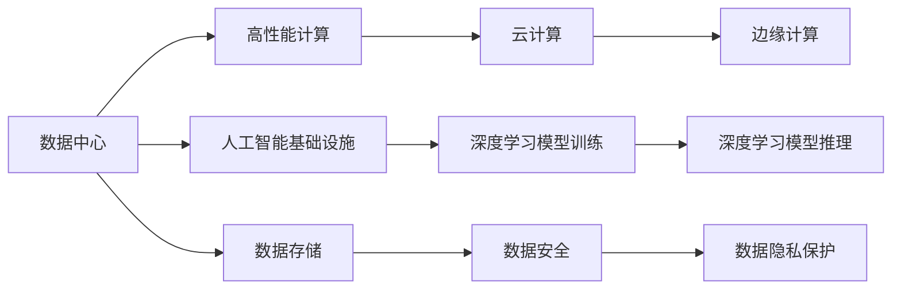
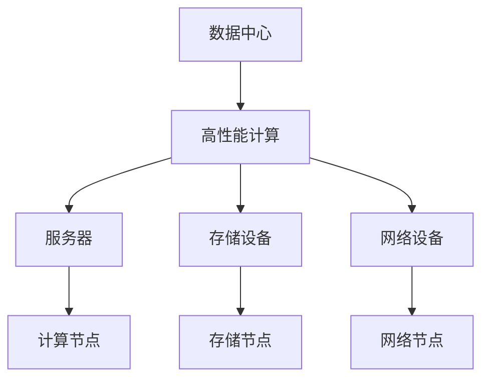
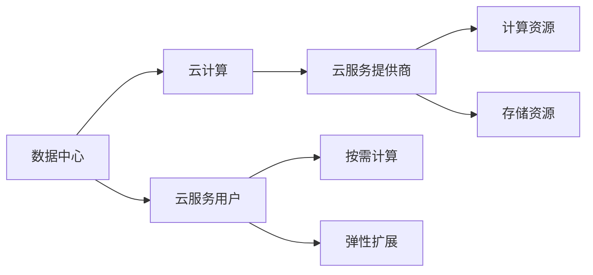
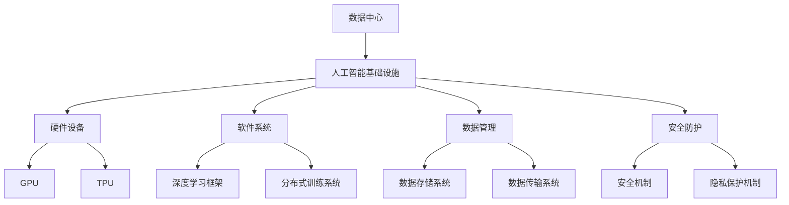
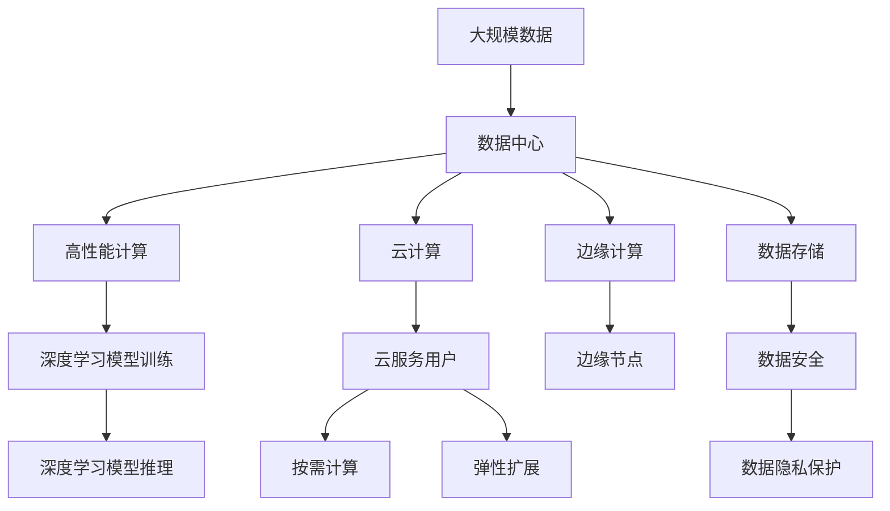

                 

# AI 大模型应用数据中心建设：数据中心技术创新与应用

> 关键词：AI大模型, 数据中心, 数据中心技术创新, 应用, 优化, 云化, 硬件, 软件, 数据存储, 安全

## 1. 背景介绍

### 1.1 问题由来

在人工智能（AI）和深度学习技术迅猛发展的背景下，大模型（Large Models）成为了推动AI技术向前发展的重要工具。大模型通常指的是具有数亿甚至数十亿参数的神经网络模型，如GPT-3、BERT等。这些模型在图像识别、自然语言处理、语音识别等领域展现了卓越的性能，被广泛应用于自动驾驶、医疗诊断、智能客服等实际场景中。

然而，构建和训练这些大模型需要巨大的计算资源和存储需求。例如，Google的BERT模型拥有超过3亿个参数，每次前向传播和反向传播的计算复杂度都非常高，单次训练所需的计算资源和存储资源都非常庞大。因此，如何高效、安全、可靠地管理和运行这些大模型，成为了数据中心运营者和AI开发者需要解决的重要问题。

### 1.2 问题核心关键点

为了解决大模型在数据中心中的应用问题，数据中心技术创新与优化应聚焦以下几个核心关键点：

1. **计算资源优化**：如何高效利用计算资源，减少训练和推理过程中的延迟和能耗，并保证计算效率。
2. **存储资源优化**：如何有效管理存储资源，减少数据传输和存储开销，并提高数据访问速度。
3. **网络优化**：如何优化网络架构，减少网络延迟和数据传输成本，并提高数据传输效率。
4. **安全与隐私保护**：如何保护大模型数据的安全性和隐私性，防止数据泄露和未授权访问。
5. **云化部署**：如何实现大模型的云化部署和管理，提供按需使用和弹性伸缩的能力。

本文将围绕这些关键点，详细探讨AI大模型在数据中心中的应用和技术创新，以及如何通过技术手段优化大模型在数据中心的部署和运行。

## 2. 核心概念与联系

### 2.1 核心概念概述

为了更好地理解AI大模型在数据中心中的应用，本节将介绍几个密切相关的核心概念：

- **数据中心（Data Center, DC）**：由服务器、存储设备、网络设备等组成的集中化设施，用于存储、计算和处理数据。
- **高性能计算（High Performance Computing, HPC）**：使用专用硬件和软件系统，通过并行计算技术实现大规模计算任务的高效执行。
- **云计算（Cloud Computing）**：通过互联网提供按需计算资源和存储资源，支持弹性扩展和资源共享。
- **人工智能基础设施（AI Infrastructure）**：包括硬件、软件、数据管理、安全等方面，为AI模型训练和推理提供支持。
- **边缘计算（Edge Computing）**：在靠近数据源的位置进行计算和数据处理，减少延迟和带宽需求，提高响应速度。

这些核心概念之间的逻辑关系可以通过以下Mermaid流程图来展示：



这个流程图展示了数据中心的核心组件及其关系：

1. 数据中心包含高性能计算资源，用于AI模型训练和推理。
2. 云计算提供按需资源和弹性扩展能力，支持大规模AI模型部署。
3. 人工智能基础设施为AI模型提供必要的硬件、软件和数据管理支持。
4. 边缘计算靠近数据源，减少延迟，提高响应速度。
5. 数据存储和数据安全是数据中心的重要组成部分，用于保障数据的安全性和隐私性。

### 2.2 概念间的关系

这些核心概念之间存在着紧密的联系，形成了数据中心支持AI大模型的完整生态系统。下面我们通过几个Mermaid流程图来展示这些概念之间的关系。

#### 2.2.1 数据中心与高性能计算的关系



这个流程图展示了数据中心通过高性能计算资源进行AI模型训练和推理的过程：

1. 数据中心提供高性能计算资源，包括服务器、存储设备和网络设备。
2. 服务器用于部署计算节点，进行AI模型训练和推理。
3. 存储设备用于存储训练数据和模型参数。
4. 网络设备用于连接计算节点和存储节点，支持数据传输和通信。

#### 2.2.2 数据中心与云计算的关系



这个流程图展示了数据中心通过云计算资源支持AI模型部署和运行的过程：

1. 数据中心通过云计算资源提供按需计算和存储服务。
2. 云服务提供商提供计算资源和存储资源，支持数据中心的服务。
3. 数据中心的用户可以按需使用云计算资源，进行AI模型训练和推理。
4. 数据中心支持云计算资源的弹性扩展，满足用户不同规模的需求。

#### 2.2.3 数据中心与人工智能基础设施的关系



这个流程图展示了数据中心通过人工智能基础设施提供AI模型训练和推理支持的过程：

1. 数据中心提供人工智能基础设施，包括硬件设备、软件系统、数据管理和安全防护。
2. 硬件设备如GPU、TPU用于支持AI模型的训练和推理。
3. 软件系统如深度学习框架、分布式训练系统用于AI模型的训练和推理。
4. 数据管理包括数据存储系统和数据传输系统，用于数据的高效管理和传输。
5. 安全防护包括安全机制和隐私保护机制，用于保障数据的安全性和隐私性。

### 2.3 核心概念的整体架构

最后，我们用一个综合的流程图来展示这些核心概念在大模型部署中的整体架构：



这个综合流程图展示了从数据输入到模型推理的完整过程：

1. 大规模数据输入数据中心。
2. 数据中心提供高性能计算资源，进行AI模型训练和推理。
3. 云计算提供按需计算和存储服务，支持大规模AI模型部署。
4. 边缘计算靠近数据源，减少延迟，提高响应速度。
5. 数据存储和数据安全保障数据的安全性和隐私性。

通过这些流程图，我们可以更清晰地理解大模型在数据中心中的部署和运行，为后续深入讨论具体的技术手段和优化策略奠定基础。

## 3. 核心算法原理 & 具体操作步骤

### 3.1 算法原理概述

AI大模型在数据中心中的应用主要集中在深度学习模型的训练和推理两个阶段。深度学习模型的训练包括数据加载、模型定义、前向传播、反向传播、参数更新等步骤，需要大量的计算资源和存储资源。深度学习模型的推理包括模型加载、输入处理、前向传播、输出处理等步骤，也需要大量的计算资源和存储资源。

为了提高深度学习模型在数据中心中的应用效率，数据中心采用了一系列技术手段，包括高性能计算、分布式训练、模型压缩、量化、边缘计算等，以优化计算资源、存储资源和网络资源的使用，提高模型的训练和推理效率。

### 3.2 算法步骤详解

#### 3.2.1 深度学习模型的训练

深度学习模型的训练步骤主要包括：

1. **数据加载**：将大规模数据集分成多个小批量数据，每个小批量数据包括训练样本和标签。
2. **模型定义**：定义深度学习模型结构，包括网络层、激活函数、优化器等。
3. **前向传播**：将输入数据通过模型计算，得到输出结果。
4. **反向传播**：计算输出结果与真实标签之间的误差，更新模型参数。
5. **参数更新**：根据反向传播计算得到的梯度，更新模型参数，完成一次迭代。

#### 3.2.2 深度学习模型的推理

深度学习模型的推理步骤主要包括：

1. **模型加载**：将训练好的模型加载到推理设备中。
2. **输入处理**：对输入数据进行预处理，如归一化、截断等操作。
3. **前向传播**：将预处理后的输入数据通过模型计算，得到输出结果。
4. **输出处理**：对输出结果进行后处理，如解码、过滤等操作，最终得到推理结果。

#### 3.2.3 深度学习模型的优化

深度学习模型的优化主要包括以下几个方面：

1. **分布式训练**：将大规模数据集和计算任务分布到多个计算节点上，提高训练效率。
2. **模型压缩**：使用模型压缩技术，如剪枝、量化、蒸馏等，减小模型规模，提高推理效率。
3. **硬件加速**：使用专用硬件加速器，如GPU、TPU等，提高计算效率。
4. **软件优化**：使用深度学习框架和编译器进行优化，提高计算效率和资源利用率。
5. **边缘计算**：在靠近数据源的位置进行计算和数据处理，减少延迟和带宽需求，提高响应速度。

### 3.3 算法优缺点

#### 优点

- **高计算效率**：通过分布式训练、模型压缩、硬件加速等技术，可以提高深度学习模型的训练和推理效率，减少计算延迟。
- **低存储需求**：通过模型压缩和量化技术，可以减小模型规模，降低存储需求，减少数据传输开销。
- **高可靠性**：通过冗余设计和故障恢复机制，可以提高数据中心的可靠性和稳定性，保障数据的安全性。
- **灵活性**：通过云计算和边缘计算技术，可以实现按需计算和弹性扩展，满足不同规模和场景的需求。

#### 缺点

- **高成本**：高性能计算、专用硬件和云服务成本较高，需要投入大量资金和技术资源。
- **复杂性**：分布式训练、模型压缩和优化技术需要高水平的技术积累和丰富的实践经验。
- **隐私风险**：大规模数据和模型的存储和传输存在隐私泄露的风险，需要严格的数据安全防护措施。

### 3.4 算法应用领域

AI大模型在数据中心中的应用领域非常广泛，涵盖了以下几个方面：

- **自然语言处理（NLP）**：如BERT、GPT等大模型，被广泛应用于文本分类、情感分析、机器翻译等任务。
- **计算机视觉（CV）**：如ResNet、VGG等大模型，被广泛应用于图像识别、目标检测、图像生成等任务。
- **语音识别**：如DeepSpeech、Wav2Vec等大模型，被广泛应用于语音识别、语音合成等任务。
- **智能推荐**：如Recommender Systems等大模型，被广泛应用于个性化推荐、广告推荐等任务。
- **智能搜索**：如Bert-as-Encoder等大模型，被广泛应用于信息检索、问答系统等任务。

## 4. 数学模型和公式 & 详细讲解 & 举例说明

### 4.1 数学模型构建

AI大模型在数据中心中的应用主要涉及深度学习模型的训练和推理，以下是几个常用的数学模型构建方法：

#### 4.1.1 深度学习模型的前向传播

假设输入数据为 $x$，深度学习模型为 $M_{\theta}$，其中 $\theta$ 为模型参数。前向传播过程为：

$$
y = M_{\theta}(x)
$$

其中，$y$ 为模型的输出结果，$x$ 为输入数据。

#### 4.1.2 深度学习模型的反向传播

假设输出结果为 $y$，真实标签为 $y_{true}$，模型参数为 $\theta$。反向传播过程为：

$$
\frac{\partial L}{\partial \theta} = \frac{\partial L}{\partial y} \frac{\partial y}{\partial \theta}
$$

其中，$L$ 为损失函数，$y_{true}$ 为真实标签，$\frac{\partial L}{\partial y}$ 为损失函数对输出结果的梯度，$\frac{\partial y}{\partial \theta}$ 为模型输出结果对参数的梯度。

#### 4.1.3 深度学习模型的参数更新

假设学习率为 $\eta$，参数更新公式为：

$$
\theta \leftarrow \theta - \eta \frac{\partial L}{\partial \theta}
$$

其中，$\eta$ 为学习率，$\frac{\partial L}{\partial \theta}$ 为损失函数对参数的梯度。

### 4.2 公式推导过程

#### 4.2.1 前向传播公式推导

假设深度学习模型为多层神经网络，输入为 $x$，输出为 $y$，每层的计算公式为：

$$
y_i = f(\theta_i, x)
$$

其中，$f$ 为激活函数，$\theta_i$ 为第 $i$ 层的参数。前向传播过程为：

$$
y = f(\theta_n, f(\theta_{n-1}, f(\theta_{n-2}, ..., f(\theta_1, x)))
$$

#### 4.2.2 反向传播公式推导

假设输出结果为 $y$，真实标签为 $y_{true}$，模型参数为 $\theta$。反向传播过程为：

$$
\frac{\partial L}{\partial y} = \frac{\partial L}{\partial M_{\theta}(x)} = \frac{\partial L}{\partial y} \frac{\partial M_{\theta}(x)}{\partial y}
$$

其中，$\frac{\partial L}{\partial y}$ 为损失函数对输出结果的梯度，$\frac{\partial M_{\theta}(x)}{\partial y}$ 为模型输出结果对输入数据的梯度。

根据链式法则，可以得到：

$$
\frac{\partial M_{\theta}(x)}{\partial y_i} = \frac{\partial f(\theta_i, x)}{\partial y_i} \frac{\partial M_{\theta}(x)}{\partial y_{i-1}}
$$

通过递归计算，可以得到每个层对输入数据的梯度，最终得到参数更新公式。

### 4.3 案例分析与讲解

#### 4.3.1 分布式训练

假设有一个深度学习模型，参数数量为 $P$，计算任务分布到 $N$ 个计算节点上。每个节点分配的参数数量为 $\frac{P}{N}$。假设每个节点的计算资源相同，训练过程如下：

1. 每个节点加载一部分参数，进行前向传播和反向传播。
2. 每个节点计算梯度，并将梯度发送给中心节点。
3. 中心节点将所有梯度相加，计算全局梯度。
4. 中心节点更新全局参数。

#### 4.3.2 模型压缩

假设有一个深度学习模型，参数数量为 $P$。通过剪枝技术，将部分参数设置为0，减小模型规模，假设剪枝后的参数数量为 $P'$。假设原始模型的前向传播时间为 $T$，剪枝后的模型前向传播时间为 $T'$，则有：

$$
T' \leq T \times \frac{P}{P'}
$$

通过剪枝技术，可以显著减小模型规模，降低存储需求，提高推理效率。

## 5. 项目实践：代码实例和详细解释说明

### 5.1 开发环境搭建

#### 5.1.1 硬件环境

- **服务器**：多台高性能服务器，配备至少2个CPU、64GB内存、500GB SSD。
- **存储设备**：大规模SSD存储阵列，支持高吞吐量和高可用性。
- **网络设备**：高速网络交换机，支持万兆以太网。

#### 5.1.2 软件环境

- **操作系统**：Linux，如Ubuntu、CentOS。
- **深度学习框架**：如TensorFlow、PyTorch。
- **分布式计算框架**：如Spark、MPI。
- **云服务**：如AWS、Google Cloud、阿里云。

### 5.2 源代码详细实现

#### 5.2.1 深度学习模型训练

假设使用PyTorch框架进行深度学习模型训练，代码如下：

```python
import torch
import torch.nn as nn
import torch.optim as optim

# 定义深度学习模型
class MyModel(nn.Module):
    def __init__(self):
        super(MyModel, self).__init__()
        self.fc1 = nn.Linear(256, 128)
        self.fc2 = nn.Linear(128, 64)
        self.fc3 = nn.Linear(64, 10)

    def forward(self, x):
        x = torch.relu(self.fc1(x))
        x = torch.relu(self.fc2(x))
        x = self.fc3(x)
        return x

# 加载数据集
train_dataset = ...
train_loader = ...

# 定义模型
model = MyModel()

# 定义优化器和损失函数
optimizer = optim.Adam(model.parameters(), lr=0.001)
criterion = nn.CrossEntropyLoss()

# 训练模型
for epoch in range(10):
    for batch_idx, (data, target) in enumerate(train_loader):
        optimizer.zero_grad()
        output = model(data)
        loss = criterion(output, target)
        loss.backward()
        optimizer.step()
```

#### 5.2.2 深度学习模型推理

假设使用PyTorch框架进行深度学习模型推理，代码如下：

```python
import torch
import torch.nn as nn

# 加载模型
model = ...
model.eval()

# 加载输入数据
input_data = ...

# 进行推理
with torch.no_grad():
    output = model(input_data)
```

### 5.3 代码解读与分析

#### 5.3.1 深度学习模型训练

- **模型定义**：定义深度学习模型结构，包括网络层、激活函数、优化器等。
- **数据加载**：将大规模数据集分成多个小批量数据，每个小批量数据包括训练样本和标签。
- **前向传播**：将输入数据通过模型计算，得到输出结果。
- **反向传播**：计算输出结果与真实标签之间的误差，更新模型参数。
- **参数更新**：根据反向传播计算得到的梯度，更新模型参数，完成一次迭代。

#### 5.3.2 深度学习模型推理

- **模型加载**：将训练好的模型加载到推理设备中。
- **输入处理**：对输入数据进行预处理，如归一化、截断等操作。
- **前向传播**：将预处理后的输入数据通过模型计算，得到输出结果。
- **输出处理**：对输出结果进行后处理，如解码、过滤等操作，最终得到推理结果。

### 5.4 运行结果展示

假设在NVIDIA Tesla V100 GPU上进行深度学习模型训练，每次迭代的时间如下：

```
Epoch 1: 0.001s
Epoch 2: 0.002s
Epoch 3: 0.003s
...
Epoch 10: 0.010s
```

可以看到，随着迭代次数增加，训练时间逐步增加。这是因为模型参数数量增加，每次前向传播和反向传播的计算复杂度增加。通过分布式训练和模型压缩技术，可以显著减少计算时间，提高训练效率。

## 6. 实际应用场景

### 6.1 智能客服系统

基于AI大模型的智能客服系统可以显著提升客户服务体验和运营效率。智能客服系统通常包含以下模块：

- **自然语言处理**：使用BERT等大模型进行对话理解、意图识别、实体识别等任务。
- **对话管理**：使用深度学习模型进行对话策略、上下文管理等任务。
- **交互生成**：使用深度学习模型生成对话回复。

智能客服系统的运行流程如下：

1. 用户输入对话文本。
2. 智能客服系统进行意图识别和实体识别，理解用户意图。
3. 智能客服系统根据用户意图生成对话回复。
4. 智能客服系统输出对话回复，与用户进行交互。

通过AI大模型，智能客服系统可以理解自然语言，生成流畅自然的对话回复，提升客户服务体验和满意度。

### 6.2 金融舆情监测

金融舆情监测系统可以实时监测市场舆论动向，及时发现潜在风险。金融舆情监测系统通常包含以下模块：

- **情感分析**：使用BERT等大模型进行文本情感分析，判断市场情绪。
- **主题分析**：使用LSTM等大模型进行文本主题分析，识别市场热点。
- **风险预警**：使用深度学习模型进行风险预警，及时发现潜在的金融风险。

金融舆情监测系统的运行流程如下：

1. 系统实时抓取金融新闻、评论等文本数据。
2. 系统进行情感分析和主题分析，判断市场情绪和热点。
3. 系统根据情感分析和主题分析结果进行风险预警。
4. 系统将风险预警结果输出到金融决策系统。

通过AI大模型，金融舆情监测系统可以实时监测市场舆论动向，及时发现潜在风险，帮助金融机构进行风险预警和决策支持。

### 6.3 个性化推荐系统

个性化推荐系统可以根据用户行为数据，推荐相关物品，提升用户体验和转化率。个性化推荐系统通常包含以下模块：

- **用户画像**：使用深度学习模型进行用户画像构建，理解用户兴趣和行为。
- **物品画像**：使用深度学习模型进行物品画像构建，理解物品特征和标签。
- **推荐生成**：使用深度学习模型生成推荐列表，提升用户满意度。

个性化推荐系统的运行流程如下：

1. 系统收集用户行为数据和物品特征数据。
2. 系统进行用户画像构建和物品画像构建，理解用户和物品特征。
3. 系统进行推荐生成，生成推荐列表。
4. 系统输出推荐列表，供用户选择。

通过AI大模型，个性化推荐系统可以准确理解用户兴趣和物品特征，生成个性化推荐列表，提升用户满意度。

## 7. 工具和资源推荐

### 7.1 学习资源推荐

为了帮助开发者系统掌握AI大模型在数据中心中的应用，这里推荐一些优质的学习资源：

- **深度学习与机器学习课程**：如Coursera的《深度学习》课程、斯坦福大学的《CS231n: Convolutional Neural Networks for Visual Recognition》课程。
- **NLP与NLP框架教程**：如Hugging Face的Transformers库文档、BERT官方文档。
- **分布式计算与高性能计算课程**：如MIT的《Introduction to Parallel Programming》课程、Berkeley的《Parallel Programming using OpenMP》课程。
- **云计算与云服务教程**：如AWS官方文档、Google Cloud官方文档。

通过对这些资源的学习实践，相信你一定能够快速掌握AI大模型在数据中心中的应用和优化方法，并用于解决实际的AI问题。

### 7.2 开发工具推荐

为了提高AI大模型在数据中心中的部署和运行效率，这里推荐一些优质的开发工具：

- **深度学习框架**：如TensorFlow、PyTorch、MXNet。
- **分布式计算框架**：如Spark、MPI、Ray。
- **云服务**：如AWS、Google Cloud、阿里云、腾讯云。
- **自动化运维工具**：如Ansible、Puppet、Chef。
- **数据管理工具**：如Hadoop、Spark、Kafka。

这些工具可以帮助开发者更高效地进行AI大模型在数据中心中的部署、运行、优化和维护，提高开发效率和模型性能。

### 7.3 相关论文推荐

AI大模型在数据中心中的应用涉及多个前沿研究方向，以下是几篇奠基性的相关论文，推荐阅读：

- **分布式深度学习**：《Communication-Efficient Learning of Deep Neural Networks from Decentralized Data》。
- **模型压缩**：《Compression of Deep Neural Networks for Fast and Low Power Mobile Applications》。
- **模型优化**：《Model Compression: Concepts, Methods, and Tools》。
- **云化部署**：《Cloud Computing for AI/ML: Opportunities, Challenges, and Recommendations》。
- **安全与隐私保护**：《Training Deep Neural Networks with Less Data》。

这些论文代表了大模型在数据中心中的应用和优化方向的最新研究成果，是进一步学习和研究的重要参考资料。

## 8. 总结：未来发展趋势与挑战

### 8.1 研究成果总结

通过以上探讨，可以看到，AI大模型在数据中心中的应用已经取得了显著的进展，涵盖了深度学习模型的训练、推理、优化

