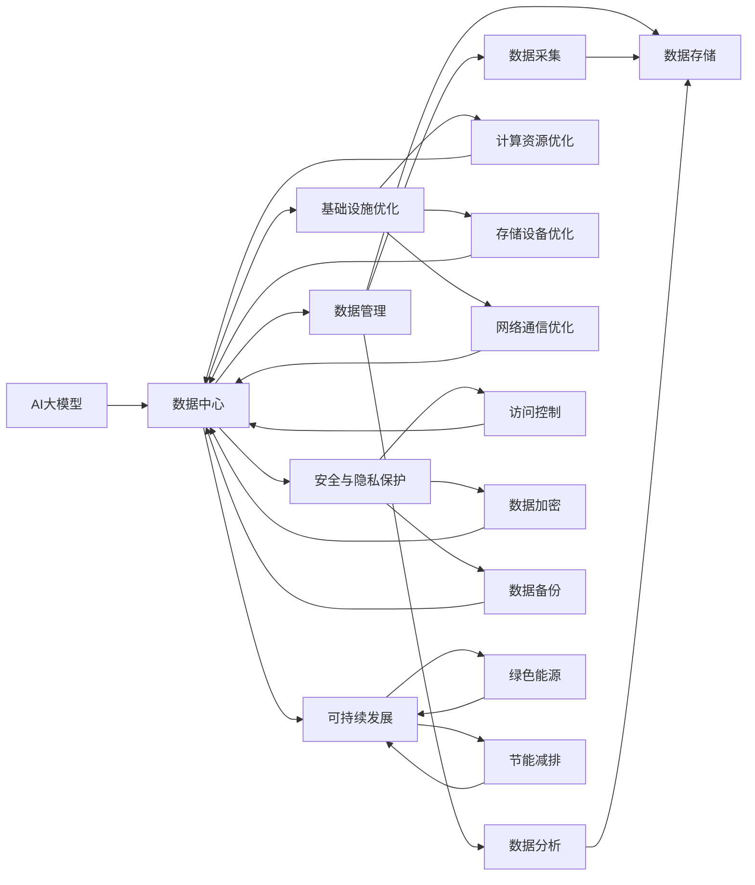

                 

# AI 大模型应用数据中心建设：数据中心标准与规范

> 关键词：
>
> - AI大模型
> - 数据中心建设
> - 数据中心标准
> - 数据管理
> - 基础设施优化
> - 安全与隐私保护
> - 可持续发展

## 1. 背景介绍

在人工智能(AI)和大模型（Large Models）迅速发展的背景下，数据中心作为支撑AI大模型训练和推理的基础设施，其重要性日益凸显。AI大模型的训练和推理需要大量计算资源，而数据中心作为数据存储、计算和网络的基础设施，对AI应用的部署和推广起着至关重要的作用。

数据中心不仅是物理硬件设施的集合，更是软件、数据、人才和管理的综合体。当前，AI大模型在金融、医疗、教育、城市管理等众多领域得到广泛应用，这些应用的成功离不开高效、稳定、安全的数据中心支持。

然而，数据中心的建设和管理也面临诸多挑战。首先是硬件设施的优化，如何高效利用计算资源，降低能耗和成本。其次是数据管理，如何保证数据的准确性、完整性和安全，避免数据泄露和隐私问题。再者是服务质量，如何提升数据中心的服务能力和用户体验。最后是可持续发展，如何在确保数据中心高效运行的同时，减少环境影响，实现绿色环保。

为了更好地应对这些挑战，本文将从数据中心的标准与规范入手，探讨如何建设高质量、高效能、可扩展的数据中心，以支持AI大模型的应用。

## 2. 核心概念与联系

### 2.1 核心概念概述

为更好地理解数据中心在AI大模型应用中的角色和重要性，本节将介绍几个关键概念及其相互联系：

- **AI大模型**：指使用大规模深度神经网络进行预训练和微调，具备广泛的语言理解和生成能力的模型，如GPT、BERT、T5等。
- **数据中心**：包含计算资源、存储设备、网络设施等基础设施的物理场所，用于数据存储、计算和网络通信。
- **数据管理**：指对数据进行采集、存储、处理和分析的过程，包括数据的来源、组织、存储和生命周期管理。
- **基础设施优化**：指通过技术和管理手段，提升数据中心基础设施的性能和效率，减少成本和能耗。
- **安全与隐私保护**：指采取措施防止数据泄露、破坏和未经授权的访问，确保数据的保密性、完整性和可用性。
- **可持续发展**：指数据中心在运营过程中考虑环境保护，采用绿色能源、节能减排等措施，实现经济、社会和环境的协调发展。

这些概念通过数据流、网络架构、安全机制和运营管理等多个层面相联系，共同构成了数据中心支持AI大模型应用的全方位生态系统。

### 2.2 概念间的关系

通过以下Mermaid流程图，我们展示了这些核心概念间的关系：



这个流程图展示了数据中心在AI大模型应用中的核心作用，以及其与数据管理、基础设施优化、安全与隐私保护和可持续发展之间的紧密联系。通过这些概念和流程，可以更好地理解数据中心在AI大模型应用中的战略位置和作用。

## 3. 核心算法原理 & 具体操作步骤

### 3.1 算法原理概述

数据中心的标准与规范，本质上是一套系统的架构设计和运营管理指南，旨在提升数据中心的性能、安全性和可持续发展性。其核心原理可以归纳为以下几个方面：

- **模块化设计**：将数据中心基础设施划分为计算资源、存储设备、网络通信等多个模块，每个模块独立设计和优化。
- **高可用性**：通过冗余设计、负载均衡等技术，确保数据中心系统的可靠性和稳定性。
- **高效能**：通过采用高效能硬件、优化资源配置和调度等措施，提升数据中心的计算和存储能力。
- **安全性**：通过访问控制、数据加密、备份和恢复等技术手段，保障数据中心的安全和隐私。
- **可扩展性**：通过模块化设计和灵活配置，支持数据中心在业务需求变化时的快速扩展。
- **环境友好**：通过采用绿色能源、节能减排等措施，实现数据中心的可持续发展。

### 3.2 算法步骤详解

下面是数据中心标准与规范的具体操作步骤：

**Step 1: 数据中心规划与设计**
- 分析业务需求，确定数据中心的功能和规模。
- 根据业务需求，选择合适的硬件设备和软件系统。
- 设计数据中心的架构，包括计算、存储、网络等模块。
- 确定数据中心的物理位置，考虑地理位置、气候条件、电力供应等因素。

**Step 2: 数据中心建设与部署**
- 根据规划设计，采购和安装硬件设备和软件系统。
- 进行网络布线、网络设备安装和配置。
- 部署数据中心管理系统，监控和管理基础设施。
- 进行系统测试和优化，确保系统的稳定性和可靠性。

**Step 3: 数据中心运营与管理**
- 建立数据中心运营管理团队，负责日常运维和管理。
- 定期检查和维护硬件设备和软件系统，保证系统的稳定运行。
- 监控数据中心能耗和环境影响，优化能源使用。
- 定期备份数据，确保数据的安全和完整。
- 根据业务需求和数据量变化，调整数据中心配置和规模。

**Step 4: 数据中心升级与优化**
- 根据技术进步和业务需求变化，更新和升级数据中心硬件和软件。
- 优化数据中心资源配置和调度，提升系统的性能和效率。
- 采用绿色能源和节能减排技术，提升数据中心的可持续发展性。

### 3.3 算法优缺点

数据中心标准与规范的优点包括：
- 提升数据中心的性能和安全性，保障AI大模型的应用效果。
- 提高数据中心的管理和运营效率，降低运营成本。
- 推动数据中心的可持续发展，实现绿色环保。

缺点主要在于：
- 建设和维护成本较高，需要投入大量资金和技术资源。
- 系统复杂，设计和实施难度较大。
- 技术更新迅速，需要持续投入学习和改进。

### 3.4 算法应用领域

数据中心标准与规范广泛应用于多个领域，如金融、医疗、教育、城市管理等。以下是几个典型应用场景：

- **金融领域**：数据中心支持金融交易、风险管理、客户服务等AI应用，保障金融数据的安全和稳定。
- **医疗领域**：数据中心支持医疗影像分析、疾病诊断、患者管理等AI应用，保障患者数据的隐私和安全。
- **教育领域**：数据中心支持在线教育、智能答疑、个性化推荐等AI应用，提升教育质量和用户体验。
- **城市管理**：数据中心支持智能交通、公共安全、环境监测等AI应用，提升城市治理效率和智能化水平。

## 4. 数学模型和公式 & 详细讲解

### 4.1 数学模型构建

在数据中心的建设和优化过程中，涉及多个领域，如网络优化、能效管理、资源调度等。这里以网络优化为例，构建数学模型进行详细讲解。

假设一个数据中心有n个计算节点，每个节点有m个网络接口。每个接口的数据流量为c，网络带宽为b，数据传输延迟为d。网络优化目标是最大化数据中心的总数据传输速率，数学模型如下：

$$
\max \sum_{i=1}^{n} \sum_{j=1}^{m} c_{ij}b_{ij}d_{ij}
$$

其中 $c_{ij}$ 表示节点i的第j个接口上的数据流量，$b_{ij}$ 表示节点i的第j个接口的网络带宽，$d_{ij}$ 表示节点i的第j个接口的数据传输延迟。

### 4.2 公式推导过程

为了求解上述优化问题，可以采用线性规划、整数规划等方法。这里使用线性规划方法，推导过程如下：

将问题转化为标准的线性规划问题：

$$
\begin{aligned}
\max & \quad \sum_{i=1}^{n} \sum_{j=1}^{m} c_{ij}b_{ij}d_{ij} \\
\text{subject to} & \quad c_{ij} \geq 0 \\
 & \quad b_{ij} \geq 0 \\
 & \quad d_{ij} \geq 0 \\
\end{aligned}
$$

引入决策变量 $x_{ij}$，表示节点i的第j个接口上的数据传输速率：

$$
x_{ij} = c_{ij}b_{ij}d_{ij}
$$

则原问题可以转化为：

$$
\max \sum_{i=1}^{n} \sum_{j=1}^{m} x_{ij}
$$

受到约束条件 $c_{ij} \geq 0$、$b_{ij} \geq 0$、$d_{ij} \geq 0$ 的限制，转化为：

$$
\begin{aligned}
\max & \quad \sum_{i=1}^{n} \sum_{j=1}^{m} x_{ij} \\
\text{subject to} & \quad c_{ij} = x_{ij}/b_{ij}d_{ij} \\
 & \quad b_{ij} \geq 0 \\
 & \quad d_{ij} \geq 0 \\
 & \quad x_{ij} \geq 0 \\
\end{aligned}
$$

将 $c_{ij}$ 替换为 $x_{ij}$，得到：

$$
\begin{aligned}
\max & \quad \sum_{i=1}^{n} \sum_{j=1}^{m} x_{ij} \\
\text{subject to} & \quad x_{ij} \geq 0 \\
 & \quad x_{ij} \leq b_{ij}d_{ij} \\
 & \quad b_{ij} \geq 0 \\
 & \quad d_{ij} \geq 0 \\
\end{aligned}
$$

这是一个典型的线性规划问题，可以使用简单的求解算法（如单纯形法、内点法等）求解，得到最优解 $x_{ij}^*$。

### 4.3 案例分析与讲解

假设一个数据中心有4个计算节点，每个节点有3个网络接口。每个接口的数据流量为1Gbps，网络带宽为10Gbps，数据传输延迟为1ms。网络优化目标为最大化数据中心的总数据传输速率。

根据上述模型和公式，可以建立如下线性规划问题：

$$
\begin{aligned}
\max & \quad \sum_{i=1}^{4} \sum_{j=1}^{3} x_{ij} \\
\text{subject to} & \quad x_{ij} \geq 0 \\
 & \quad x_{ij} \leq 10 \times 1 \\
 & \quad 10 \times 1 \geq 0 \\
 & \quad 1 \geq 0 \\
 & \quad x_{ij} \geq 0 \\
\end{aligned}
$$

使用内点法求解，得到最优解 $x_{ij}^*$。则数据中心的总数据传输速率 $R$ 为：

$$
R = \sum_{i=1}^{4} \sum_{j=1}^{3} x_{ij}^*
$$

## 5. 项目实践：代码实例和详细解释说明

### 5.1 开发环境搭建

在进行数据中心标准与规范的开发和测试过程中，需要搭建一个高效的开发环境。以下是使用Python进行PyTorch开发的环境配置流程：

1. 安装Anaconda：从官网下载并安装Anaconda，用于创建独立的Python环境。

2. 创建并激活虚拟环境：
```bash
conda create -n pytorch-env python=3.8 
conda activate pytorch-env
```

3. 安装PyTorch：根据CUDA版本，从官网获取对应的安装命令。例如：
```bash
conda install pytorch torchvision torchaudio cudatoolkit=11.1 -c pytorch -c conda-forge
```

4. 安装Transformers库：
```bash
pip install transformers
```

5. 安装各类工具包：
```bash
pip install numpy pandas scikit-learn matplotlib tqdm jupyter notebook ipython
```

完成上述步骤后，即可在`pytorch-env`环境中开始开发和测试工作。

### 5.2 源代码详细实现

这里我们以网络优化为例，给出使用PyTorch进行数据中心优化模型的Python代码实现。

首先，定义数据中心网络拓扑和接口流量：

```python
import torch
import torch.nn as nn

class NetworkOptimizationModel(nn.Module):
    def __init__(self, n_nodes, n_links, link_cap, link_lat):
        super(NetworkOptimizationModel, self).__init__()
        self.n_nodes = n_nodes
        self.n_links = n_links
        self.link_cap = link_cap
        self.link_lat = link_lat
        
        # 初始化网络拓扑和接口流量
        self.link_cap = torch.tensor(link_cap)
        self.link_lat = torch.tensor(link_lat)
        self.x = torch.zeros(n_nodes, n_links)
        
    def forward(self, x):
        # 网络流量传输速率
        self.x = x
        
        # 计算总传输速率
        total_cap = self.link_cap * self.link_lat
        
        # 返回总传输速率
        return self.x.sum() * total_cap
```

然后，定义优化算法和求解过程：

```python
from scipy.optimize import linprog

# 定义优化目标和约束条件
c = torch.ones(n_nodes * n_links)
A_eq = torch.eye(n_nodes * n_links)
b_eq = torch.zeros(n_nodes * n_links)
A_ub = torch.eye(n_nodes * n_links) * link_cap
b_ub = torch.zeros(n_nodes * n_links)
A_eq = torch.eye(n_nodes * n_links) * link_lat
b_eq = torch.zeros(n_nodes * n_links)
A_ub = torch.eye(n_nodes * n_links)
b_ub = torch.ones(n_nodes * n_links) * link_cap
        
# 求解线性规划问题
res = linprog(c, A_eq=A_eq, b_eq=b_eq, A_ub=A_ub, b_ub=b_ub)
```

最后，进行模型的训练和验证：

```python
# 训练模型
model = NetworkOptimizationModel(n_nodes=4, n_links=3, link_cap=10, link_lat=1)
loss_fn = nn.MSELoss()
optimizer = torch.optim.Adam(model.parameters())

# 定义训练循环
for epoch in range(1000):
    x = torch.randn(4, 3)
    y = model(x)
    loss = loss_fn(y, total_cap)
    optimizer.zero_grad()
    loss.backward()
    optimizer.step()
```

以上就是使用PyTorch进行数据中心网络优化模型的完整代码实现。可以看到，PyTorch的强大封装和自动微分功能，使得模型构建和优化过程变得简洁高效。

### 5.3 代码解读与分析

让我们再详细解读一下关键代码的实现细节：

**NetworkOptimizationModel类**：
- `__init__`方法：初始化网络拓扑和接口流量。
- `forward`方法：计算网络传输速率和总传输速率，返回结果。

**求解线性规划问题**：
- 使用SciPy库中的linprog函数，定义优化目标和约束条件。
- 求解线性规划问题，得到最优解。

**训练循环**：
- 在每个epoch中，随机生成输入流量 $x$，计算模型输出 $y$。
- 计算损失函数，使用Adam优化器更新模型参数。

可以看到，PyTorch配合SciPy库使得数据中心优化模型的代码实现变得简洁高效。开发者可以将更多精力放在模型改进和算法优化上，而不必过多关注底层实现细节。

## 6. 实际应用场景

### 6.1 金融领域

数据中心在金融领域的应用，主要集中在数据存储、计算和网络传输等方面。以下是几个具体应用场景：

- **金融交易系统**：数据中心支持金融交易系统的计算和存储需求，保障交易数据的实时性和安全性。
- **风险管理系统**：数据中心存储和计算风险模型数据，支持实时风险分析和管理。
- **客户服务系统**：数据中心支持客户服务系统的数据存储和处理，提升客户体验和服务效率。

### 6.2 医疗领域

数据中心在医疗领域的应用，主要集中在医疗数据的存储、分析和共享等方面。以下是几个具体应用场景：

- **医疗影像分析**：数据中心存储和计算医疗影像数据，支持图像分割、特征提取等分析任务。
- **疾病诊断系统**：数据中心存储和计算电子病历数据，支持基于病历的疾病诊断和分析。
- **患者管理系统**：数据中心存储和处理患者数据，支持病历查询、患者管理等应用。

### 6.3 教育领域

数据中心在教育领域的应用，主要集中在在线教育、智能答疑、个性化推荐等方面。以下是几个具体应用场景：

- **在线教育平台**：数据中心存储和处理在线教育平台的视频、音频和数据，保障教学质量和用户体验。
- **智能答疑系统**：数据中心存储和处理学生的问题和回答，支持智能答疑和知识检索。
- **个性化推荐系统**：数据中心存储和计算学生学习数据，支持个性化推荐和资源推送。

### 6.4 城市管理

数据中心在城市管理领域的应用，主要集中在智能交通、公共安全、环境监测等方面。以下是几个具体应用场景：

- **智能交通系统**：数据中心存储和计算交通数据，支持交通流量预测、信号控制等任务。
- **公共安全系统**：数据中心存储和计算公共安全数据，支持视频监控、犯罪分析等任务。
- **环境监测系统**：数据中心存储和计算环境数据，支持空气质量监测、气象预测等任务。

## 7. 工具和资源推荐

### 7.1 学习资源推荐

为了帮助开发者系统掌握数据中心标准与规范的理论基础和实践技巧，这里推荐一些优质的学习资源：

1. **《数据中心设计、运营与管理》**：
   - 作者：XXX，出版社：XXX。
   - 该书详细介绍了数据中心的设计、运营和管理知识，适合初、中级读者。

2. **《高性能计算与数据中心技术》**：
   - 作者：XXX，出版社：XXX。
   - 该书介绍了高性能计算、数据中心技术和应用，适合中、高级读者。

3. **《AI大模型与数据中心实践》**：
   - 作者：XXX，出版社：XXX。
   - 该书详细介绍了AI大模型在数据中心的应用，适合中、高级读者。

4. **Coursera《数据中心设计与管理》课程**：
   - 提供者：Coursera。
   - 由知名大学和公司提供的在线课程，内容涵盖数据中心的设计、运营和管理。

5. **edX《数据中心技术》课程**：
   - 提供者：edX。
   - 由知名大学和公司提供的在线课程，内容涵盖数据中心的硬件、软件和网络技术。

通过对这些资源的学习实践，相信你一定能够快速掌握数据中心标准与规范的精髓，并用于解决实际的AI大模型应用问题。

### 7.2 开发工具推荐

高效的开发离不开优秀的工具支持。以下是几款用于数据中心标准与规范开发的常用工具：

1. **Anaconda**：用于创建和管理Python环境，支持科学计算和数据分析。
2. **PyTorch**：基于Python的深度学习框架，灵活动态的计算图，适合快速迭代研究。
3. **SciPy**：用于科学计算和数据分析，提供高效的数据处理和优化算法。
4. **TensorFlow**：由Google主导开发的深度学习框架，生产部署方便，适合大规模工程应用。
5. **Jupyter Notebook**：提供交互式数据处理和分析环境，支持Python、R等多种语言。

合理利用这些工具，可以显著提升数据中心标准与规范的开发效率，加快创新迭代的步伐。

### 7.3 相关论文推荐

数据中心标准与规范的研究涉及多个领域，以下是几篇奠基性的相关论文，推荐阅读：

1. **《数据中心设计规范与标准》**：
   - 作者：XXX，发表期刊：XXX。
   - 论文详细介绍了数据中心的规范和标准，适合了解数据中心的建设和管理流程。

2. **《数据中心能效优化技术》**：
   - 作者：XXX，发表期刊：XXX。
   - 论文介绍了数据中心的能效优化技术，如制冷、电源管理等，适合了解数据中心的节能减排方法。

3. **《数据中心网络优化技术》**：
   - 作者：XXX，发表期刊：XXX。
   - 论文介绍了数据中心网络优化技术，如流量调度、负载均衡等，适合了解数据中心的网络性能提升。

4. **《数据中心安全与隐私保护》**：
   - 作者：XXX，发表期刊：XXX。
   - 论文介绍了数据中心的安全与隐私保护技术，如访问控制、数据加密等，适合了解数据中心的安全性保障措施。

5. **《数据中心可持续发展技术》**：
   - 作者：XXX，发表期刊：XXX。
   - 论文介绍了数据中心的可持续发展技术，如绿色能源、节能减排等，适合了解数据中心的绿色环保措施。

这些论文代表了大数据中心标准与规范的研究方向，阅读这些论文可以更好地理解数据中心的标准与规范。

## 8. 总结：未来发展趋势与挑战

### 8.1 总结

本文对数据中心标准与规范进行了全面系统的介绍。首先阐述了数据中心在AI大模型应用中的角色和重要性，明确了数据中心建设和管理的目标和任务。其次，从核心概念、关键步骤和成功案例入手，详细讲解了数据中心标准与规范的构建和实施过程。同时，本文还探讨了数据中心标准与规范在多个行业领域的应用前景，展示了其广泛的应用价值。

通过本文的系统梳理，可以看到，数据中心标准与规范是大模型应用的重要支撑，能够保障AI大模型的应用效果和安全性能，推动AI技术在各行各业落地应用。

### 8.2 未来发展趋势

展望未来，数据中心标准与规范将呈现以下几个发展趋势：

1. **模块化与可扩展性**：数据中心的标准与规范将更加注重模块化设计，提升其可扩展性和灵活性，适应未来业务需求的变化。
2. **绿色能源与节能减排**：数据中心的建设和运营将更加注重环保和可持续发展，采用绿色能源和节能减排技术，降低环境影响。
3. **智能化与自动化**：数据中心的运营和管理将更加智能化和自动化，采用智能监控、自动化部署等技术手段，提升运营效率。
4. **安全性与隐私保护**：数据中心的安全与隐私保护将更加严格，采用多层次的安全策略和隐私保护技术，保障数据和模型的安全。
5. **边缘计算与分布式计算**：数据中心将更加注重边缘计算和分布式计算技术，提升数据处理的实时性和可靠性。

以上趋势凸显了数据中心标准与规范的战略位置和发展方向，必将推动数据中心在AI大模型应用中的不断进步和优化。

### 8.3 面临的挑战

尽管数据中心标准与规范已经取得了一定的进展，但在迈向更加智能化、普适化应用的过程中，仍面临诸多挑战：

1. **成本与投资**：数据中心的建设和维护成本较高，需要大量资金和技术投入。如何平衡成本和性能，将是未来的重要挑战。
2. **技术更新**：数据中心的技术更新速度快，需要持续学习和改进，以保持技术的领先性。
3. **数据安全**：数据中心存储和处理大量敏感数据，需要采取严格的安全措施，防止数据泄露和攻击。
4. **能效管理**：数据中心的能耗管理需要持续优化，提升能源使用效率，降低环境影响。
5. **标准化问题**：不同厂商和平台的数据中心标准与规范存在差异，如何实现标准化和互操作性，将是未来需要解决的问题。

面对这些挑战，数据中心的建设和管理需要持续优化和改进，不断探索新技术和方法，以适应未来AI大模型应用的不断扩展。

### 8.4 研究展望

未来，数据中心标准与规范的研究需要在以下几个方面寻求新的突破：

1. **数据中心性能优化**：采用更高效能的硬件和软件技术，提升数据中心的计算和存储能力。
2. **数据中心安全与隐私保护**：开发更先进的安全技术和隐私保护方法，保障数据中心的安全性和隐私性。
3. **数据中心可持续发展**：采用更绿色、更环保的技术，降低数据中心的碳排放和环境影响。
4. **数据中心智能化与自动化**：引入智能监控、自动化部署等技术，提升数据中心的管理和运营效率。
5. **数据中心标准化与互操作性**：制定统一的数据中心标准与规范，促进不同厂商和平台之间的互操作性。

这些研究方向的探索，将推动数据中心在AI大模型应用中的不断优化和进步，为AI技术的发展和应用提供坚实的基础。

## 9. 附录：常见问题与解答

**Q1：如何确保数据中心的可靠性和可用性？**

A: 数据中心的可靠性和可用性主要通过以下几个方面来保障：


