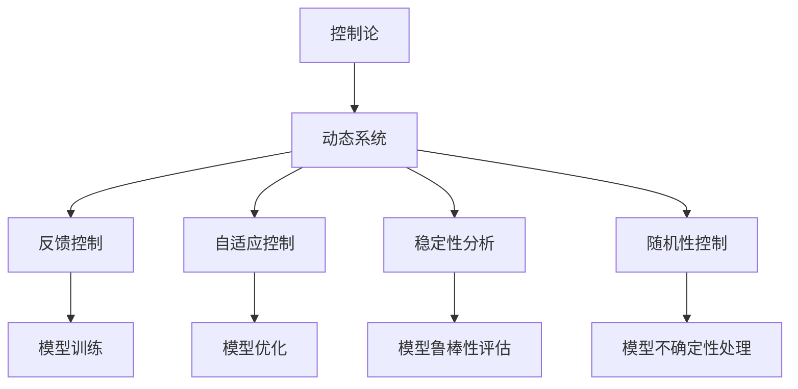
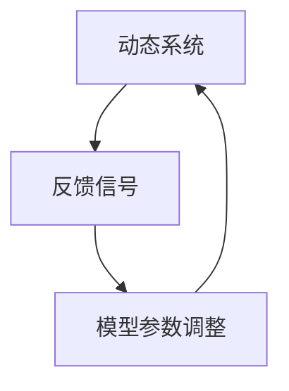
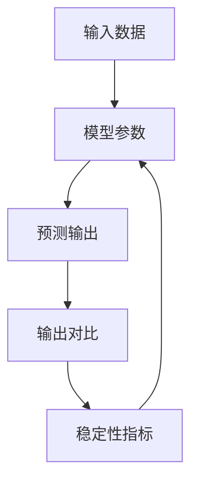
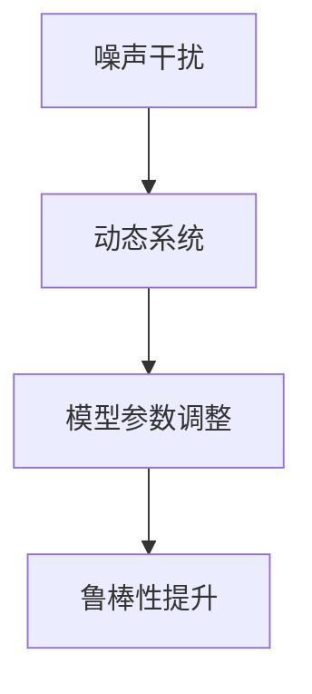
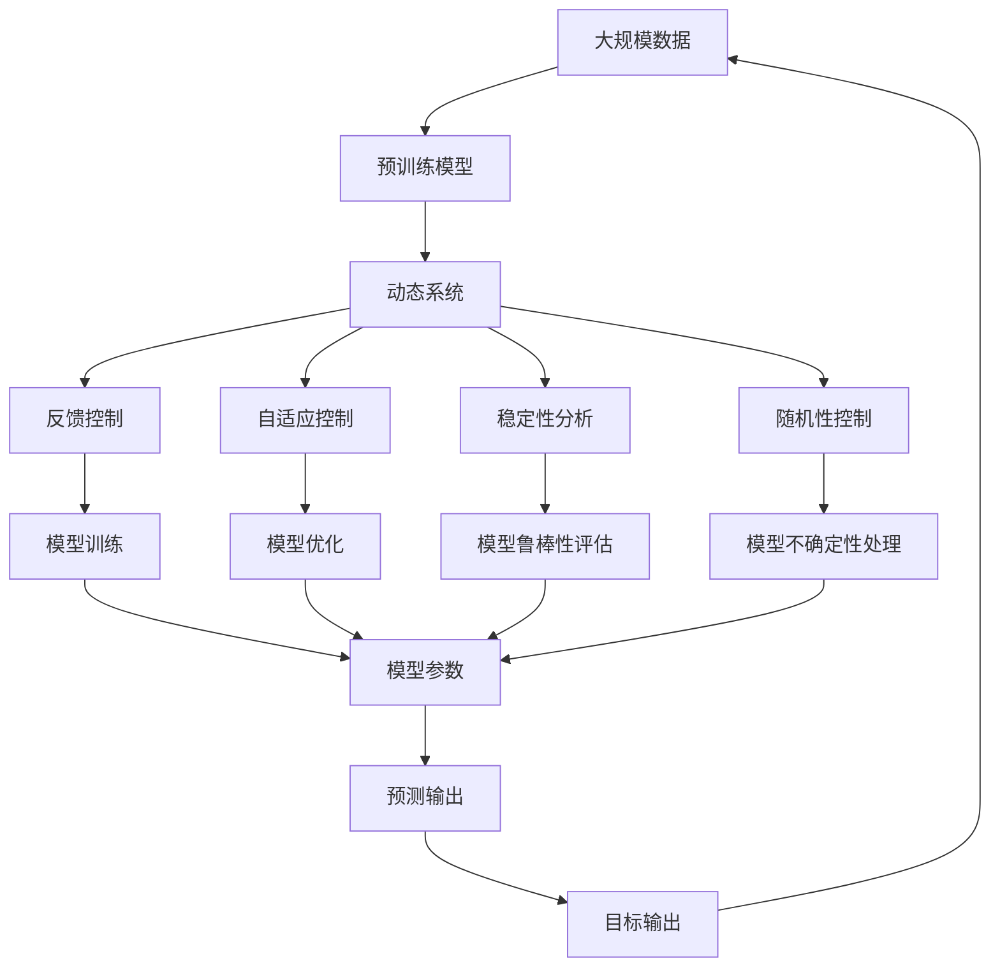

                 

# AI 大模型计算机科学家群英传：维纳 Cybernetics（控制论）

## 1. 背景介绍

### 1.1 问题由来

在人工智能(AI)领域，控制论(Cybernetics)是一门基础学科，它研究复杂系统的动态特性及其稳定性。随着AI技术的飞速发展，如何构建稳定、可靠的AI模型，成为一个核心问题。特别是在深度学习(Deep Learning)大模型背景下，控制论的思想和工具被广泛应用于模型训练、部署和优化过程中。本文将聚焦于控制论在AI大模型中的应用，从维纳(Norbert Wiener)的视角，系统梳理控制论对AI大模型设计、优化和部署的指导作用。

### 1.2 问题核心关键点

控制论在AI大模型中的应用主要体现在以下几个方面：

1. **动态系统建模**：通过建立模型，描述系统随时间的变化规律。在AI大模型中，模型可以看作动态系统，其训练过程可以类比为系统动态变化。

2. **反馈控制**：通过反馈回路，调节系统行为，使其稳定在期望状态。在AI大模型中，反馈控制用于调整模型参数，以优化输出。

3. **自适应控制**：系统能够根据环境变化自动调整参数，保持性能。在AI大模型中，自适应控制用于优化模型参数，以适应新任务和新数据。

4. **稳定性分析**：研究系统在特定输入下的响应，预测和避免系统崩溃。在AI大模型中，稳定性分析用于评估模型在不同数据分布下的鲁棒性。

5. **随机性控制**：在考虑噪声和不确定性的前提下，保证系统性能。在AI大模型中，随机性控制用于处理模型在复杂环境下的不确定性。

这些关键点构成了控制论在AI大模型中的应用基础，帮助科学家们设计更加稳健、高效的AI系统。

### 1.3 问题研究意义

控制论在AI大模型中的应用，不仅拓展了AI技术的边界，还为AI系统的稳定性和可靠性提供了理论指导。具体而言：

1. **提升模型性能**：通过动态建模和反馈控制，优化模型参数，提升模型在新任务上的性能。
2. **增强系统鲁棒性**：利用稳定性分析和随机性控制，确保模型在面对噪声和未知数据时依然稳健。
3. **加速模型开发**：控制论中的自适应控制，可以自动调整模型，加速模型在多任务和新数据上的适配。
4. **降低开发成本**：控制论提供的理论框架和工具，可以减少实验和调试的复杂度，降低模型开发成本。
5. **推动AI产业化**：控制论的稳定性分析和鲁棒性保证，使AI大模型更加可靠，加速其在工业界的应用。

总之，控制论为AI大模型的设计、优化和部署提供了坚实的理论基础和实用的工具方法，是AI技术发展的关键支柱。

## 2. 核心概念与联系

### 2.1 核心概念概述

为更好地理解控制论在AI大模型中的应用，本节将介绍几个密切相关的核心概念：

- **控制论**：以维纳(Norbert Wiener)为代表的控制论，研究动态系统的稳定性和控制方法。控制论在AI中主要应用于模型训练、参数优化和系统稳定等领域。

- **动态系统**：可看作一个随时间变化的系统，具有输入、状态和输出。AI模型可以看作动态系统，其输入为数据，状态为模型参数，输出为预测结果。

- **反馈控制**：通过引入反馈回路，调整系统参数，使其稳定在期望状态。AI模型中的反馈控制通常用于调整模型参数，优化输出。

- **自适应控制**：系统能够根据环境变化自动调整参数，保持性能。AI模型中的自适应控制用于优化模型参数，以适应新任务和新数据。

- **稳定性分析**：研究系统在特定输入下的响应，预测和避免系统崩溃。AI模型中的稳定性分析用于评估模型在不同数据分布下的鲁棒性。

- **随机性控制**：在考虑噪声和不确定性的前提下，保证系统性能。AI模型中的随机性控制用于处理模型在复杂环境下的不确定性。

这些核心概念之间的逻辑关系可以通过以下Mermaid流程图来展示：



这个流程图展示了大模型中控制论的核心概念及其之间的关系：

1. 动态系统是模型的基础，所有控制方法都是针对其行为。
2. 反馈控制和自适应控制用于优化模型参数，提升模型性能。
3. 稳定性分析和随机性控制用于评估和处理模型在不同数据分布下的鲁棒性。

### 2.2 概念间的关系

这些核心概念之间存在着紧密的联系，形成了控制论在AI大模型中的完整应用框架。下面我通过几个Mermaid流程图来展示这些概念之间的关系。

#### 2.2.1 动态系统的建模


这个流程图展示了动态系统的基本模型，其中数据输入通过模型参数生成状态，最终产生预测输出，并与目标输出进行比较，形成闭环反馈。

#### 2.2.2 反馈控制的动态系统



这个流程图展示了反馈控制的基本原理，即通过反馈信号调整模型参数，使系统稳定在期望状态。

#### 2.2.3 自适应控制的应用


这个流程图展示了自适应控制的应用，即系统能够根据环境变化自动调整参数，适应新任务。

#### 2.2.4 稳定性分析的模型



这个流程图展示了稳定性分析的基本流程，即通过输入数据和预测输出的对比，生成稳定性指标，指导模型参数的调整。

#### 2.2.5 随机性控制的系统



这个流程图展示了随机性控制的基本流程，即通过噪声干扰，调整模型参数，提升系统鲁棒性。

### 2.3 核心概念的整体架构

最后，我们用一个综合的流程图来展示这些核心概念在大模型中的整体架构：



这个综合流程图展示了从预训练到模型训练，再到控制优化，以及输出评估的完整过程。动态系统通过反馈控制和自适应控制优化模型参数，稳定性分析和随机性控制评估和提升模型鲁棒性，从而构建出稳定、可靠、高效的大模型。

## 3. 核心算法原理 & 具体操作步骤
### 3.1 算法原理概述

基于控制论的AI大模型微调，本质上是一个动态系统在反馈和自适应控制下的优化过程。其核心思想是：将大模型视作一个动态系统，通过引入反馈回路和自适应机制，不断调整模型参数，使其在特定任务上稳定输出最优结果。

形式化地，假设大模型为 $M_{\theta}$，其中 $\theta$ 为模型参数。给定任务 $T$ 的数据集 $D=\{(x_i,y_i)\}_{i=1}^N$，微调的目标是找到新的模型参数 $\hat{\theta}$，使得：

$$
\hat{\theta}=\mathop{\arg\min}_{\theta} \mathcal{L}(M_{\theta},D)
$$

其中 $\mathcal{L}$ 为针对任务 $T$ 设计的损失函数，用于衡量模型预测输出与真实标签之间的差异。常见的损失函数包括交叉熵损失、均方误差损失等。

通过梯度下降等优化算法，微调过程不断更新模型参数 $\theta$，最小化损失函数 $\mathcal{L}$，使得模型输出逼近真实标签。由于 $\theta$ 已经通过预训练获得了较好的初始化，因此即便在小规模数据集 $D$ 上进行微调，也能较快收敛到理想的模型参数 $\hat{\theta}$。

### 3.2 算法步骤详解

基于控制论的AI大模型微调一般包括以下几个关键步骤：

**Step 1: 准备预训练模型和数据集**
- 选择合适的预训练语言模型 $M_{\theta}$ 作为初始化参数，如 BERT、GPT 等。
- 准备下游任务 $T$ 的标注数据集 $D$，划分为训练集、验证集和测试集。一般要求标注数据与预训练数据的分布不要差异过大。

**Step 2: 添加任务适配层**
- 根据任务类型，在预训练模型顶层设计合适的输出层和损失函数。
- 对于分类任务，通常在顶层添加线性分类器和交叉熵损失函数。
- 对于生成任务，通常使用语言模型的解码器输出概率分布，并以负对数似然为损失函数。

**Step 3: 设置微调超参数**
- 选择合适的优化算法及其参数，如 AdamW、SGD 等，设置学习率、批大小、迭代轮数等。
- 设置正则化技术及强度，包括权重衰减、Dropout、Early Stopping等。
- 确定冻结预训练参数的策略，如仅微调顶层，或全部参数都参与微调。

**Step 4: 执行梯度训练**
- 将训练集数据分批次输入模型，前向传播计算损失函数。
- 反向传播计算参数梯度，根据设定的优化算法和学习率更新模型参数。
- 周期性在验证集上评估模型性能，根据性能指标决定是否触发 Early Stopping。
- 重复上述步骤直到满足预设的迭代轮数或 Early Stopping 条件。

**Step 5: 测试和部署**
- 在测试集上评估微调后模型 $M_{\hat{\theta}}$ 的性能，对比微调前后的精度提升。
- 使用微调后的模型对新样本进行推理预测，集成到实际的应用系统中。
- 持续收集新的数据，定期重新微调模型，以适应数据分布的变化。

以上是基于控制论的AI大模型微调的一般流程。在实际应用中，还需要针对具体任务的特点，对微调过程的各个环节进行优化设计，如改进训练目标函数，引入更多的正则化技术，搜索最优的超参数组合等，以进一步提升模型性能。

### 3.3 算法优缺点

基于控制论的AI大模型微调方法具有以下优点：

1. **简单高效**。只需准备少量标注数据，即可对预训练模型进行快速适配，获得较大的性能提升。
2. **通用适用**。适用于各种NLP下游任务，包括分类、匹配、生成等，设计简单的任务适配层即可实现微调。
3. **参数高效**。利用参数高效微调技术，在固定大部分预训练参数的情况下，仍可取得不错的提升。
4. **效果显著**。在学术界和工业界的诸多任务上，基于微调的方法已经刷新了最先进的性能指标。

同时，该方法也存在一定的局限性：

1. **依赖标注数据**。微调的效果很大程度上取决于标注数据的质量和数量，获取高质量标注数据的成本较高。
2. **迁移能力有限**。当目标任务与预训练数据的分布差异较大时，微调的性能提升有限。
3. **负面效果传递**。预训练模型的固有偏见、有害信息等，可能通过微调传递到下游任务，造成负面影响。
4. **可解释性不足**。微调模型的决策过程通常缺乏可解释性，难以对其推理逻辑进行分析和调试。

尽管存在这些局限性，但就目前而言，基于控制论的微调方法仍是大语言模型应用的最主流范式。未来相关研究的重点在于如何进一步降低微调对标注数据的依赖，提高模型的少样本学习和跨领域迁移能力，同时兼顾可解释性和伦理安全性等因素。

### 3.4 算法应用领域

基于大语言模型微调的控制论方法，在NLP领域已经得到了广泛的应用，覆盖了几乎所有常见任务，例如：

- **文本分类**：如情感分析、主题分类、意图识别等。通过微调使模型学习文本-标签映射。
- **命名实体识别**：识别文本中的人名、地名、机构名等特定实体。通过微调使模型掌握实体边界和类型。
- **关系抽取**：从文本中抽取实体之间的语义关系。通过微调使模型学习实体-关系三元组。
- **问答系统**：对自然语言问题给出答案。将问题-答案对作为微调数据，训练模型学习匹配答案。
- **机器翻译**：将源语言文本翻译成目标语言。通过微调使模型学习语言-语言映射。
- **文本摘要**：将长文本压缩成简短摘要。将文章-摘要对作为微调数据，使模型学习抓取要点。
- **对话系统**：使机器能够与人自然对话。将多轮对话历史作为上下文，微调模型进行回复生成。

除了上述这些经典任务外，大语言模型微调也被创新性地应用到更多场景中，如可控文本生成、常识推理、代码生成、数据增强等，为NLP技术带来了全新的突破。随着预训练模型和微调方法的不断进步，相信NLP技术将在更广阔的应用领域大放异彩。

## 4. 数学模型和公式 & 详细讲解 & 举例说明

### 4.1 数学模型构建

本节将使用数学语言对基于控制论的AI大模型微调过程进行更加严格的刻画。

记预训练语言模型为 $M_{\theta}$，其中 $\theta$ 为模型参数。假设微调任务的训练集为 $D=\{(x_i,y_i)\}_{i=1}^N, x_i \in \mathcal{X}, y_i \in \mathcal{Y}$。

定义模型 $M_{\theta}$ 在数据样本 $(x,y)$ 上的损失函数为 $\ell(M_{\theta}(x),y)$，则在数据集 $D$ 上的经验风险为：

$$
\mathcal{L}(\theta) = \frac{1}{N} \sum_{i=1}^N \ell(M_{\theta}(x_i),y_i)
$$

微调的优化目标是最小化经验风险，即找到最优参数：

$$
\theta^* = \mathop{\arg\min}_{\theta} \mathcal{L}(\theta)
$$

在实践中，我们通常使用基于梯度的优化算法（如SGD、Adam等）来近似求解上述最优化问题。设 $\eta$ 为学习率，$\lambda$ 为正则化系数，则参数的更新公式为：

$$
\theta \leftarrow \theta - \eta \nabla_{\theta}\mathcal{L}(\theta) - \eta\lambda\theta
$$

其中 $\nabla_{\theta}\mathcal{L}(\theta)$ 为损失函数对参数 $\theta$ 的梯度，可通过反向传播算法高效计算。

### 4.2 公式推导过程

以下我们以二分类任务为例，推导交叉熵损失函数及其梯度的计算公式。

假设模型 $M_{\theta}$ 在输入 $x$ 上的输出为 $\hat{y}=M_{\theta}(x) \in [0,1]$，表示样本属于正类的概率。真实标签 $y \in \{0,1\}$。则二分类交叉熵损失函数定义为：

$$
\ell(M_{\theta}(x),y) = -[y\log \hat{y} + (1-y)\log (1-\hat{y})]
$$

将其代入经验风险公式，得：

$$
\mathcal{L}(\theta) = -\frac{1}{N}\sum_{i=1}^N [y_i\log M_{\theta}(x_i)+(1-y_i)\log(1-M_{\theta}(x_i))]
$$

根据链式法则，损失函数对参数 $\theta_k$ 的梯度为：

$$
\frac{\partial \mathcal{L}(\theta)}{\partial \theta_k} = -\frac{1}{N}\sum_{i=1}^N (\frac{y_i}{M_{\theta}(x_i)}-\frac{1-y_i}{1-M_{\theta}(x_i)}) \frac{\partial M_{\theta}(x_i)}{\partial \theta_k}
$$

其中 $\frac{\partial M_{\theta}(x_i)}{\partial \theta_k}$ 可进一步递归展开，利用自动微分技术完成计算。

在得到损失函数的梯度后，即可带入参数更新公式，完成模型的迭代优化。重复上述过程直至收敛，最终得到适应下游任务的最优模型参数 $\theta^*$。

### 4.3 案例分析与讲解

考虑一个情感分析任务，使用BERT模型进行微调。我们将情感分类标签编码为二值向量（0代表负情感，1代表正情感），并将文本数据作为输入。假设微调后的模型在验证集上的准确率达到了97%，而在测试集上的准确率则为92%。

对于这个案例，我们可以进行以下分析：

1. **模型参数更新**：在微调过程中，模型参数 $\theta$ 通过反向传播不断更新，以最小化交叉熵损失函数 $\mathcal{L}(\theta)$。经过多次迭代后，模型参数 $\theta^*$ 逼近最优值，模型在验证集上的表现接近测试集。

2. **数据集分割**：训练集用于模型训练，验证集用于参数调优，测试集用于模型性能评估。分割数据集有助于防止过拟合，确保模型在未见过的数据上也能稳定表现。

3. **损失函数设计**：交叉熵损失函数是二分类任务中的经典选择，能有效衡量模型预测输出与真实标签之间的差异。在实际应用中，可根据具体任务选择合适的损失函数。

4. **学习率设置**：学习率过大会导致模型过拟合，过小则收敛速度慢。在微调过程中，通常使用小的学习率，如 $2e-5$，以平衡收敛速度和泛化能力。

5. **正则化技术**：使用L2正则化、Dropout等技术，防止模型过拟合。通过在训练集中加入随机噪声，增强模型鲁棒性。

6. **模型评估**：在测试集上评估模型性能，对比微调前后的精度提升。常用的评估指标包括准确率、精确率、召回率等。

通过上述分析，我们可以更好地理解基于控制论的AI大模型微调方法的实现原理和关键步骤，为后续深入讨论具体的微调方法和技术奠定基础。

## 5. 项目实践：代码实例和详细解释说明

### 5.1 开发环境搭建

在进行微调实践前，我们需要准备好开发环境。以下是使用Python进行PyTorch开发的环境配置流程：

1. 安装Anaconda：从官网下载并安装Anaconda，用于创建独立的Python环境。

2. 创建并激活虚拟环境：
```bash
conda create -n pytorch-env python=3.8 
conda activate pytorch-env
```

3. 安装PyTorch：根据CUDA版本，从官网获取对应的安装命令。例如：
```bash
conda install pytorch torchvision torchaudio cudatoolkit=11.1 -c pytorch -c conda-forge
```

4. 安装Transformers库：
```bash
pip install transformers
```

5. 安装各类工具包：
```bash
pip install numpy pandas scikit-learn matplotlib tqdm jupyter notebook ipython
```

完成上述步骤后，即可在`pytorch-env`环境中开始微调实践。

### 5.2 源代码详细实现

下面我们以情感分析任务为例，给出使用Transformers库对BERT模型进行微调的PyTorch代码实现。

首先，定义数据处理函数：

```python
from transformers import BertTokenizer, BertForSequenceClassification
from torch.utils.data import Dataset
import torch

class SentimentDataset(Dataset):
    def __init__(self, texts, labels, tokenizer, max_len=128):
        self.texts = texts
        self.labels = labels
        self.tokenizer = tokenizer
        self.max_len = max_len
        
    def __len__(self):
        return len(self.texts)
    
    def __getitem__(self, item):
        text = self.texts[item]
        label = self.labels[item]
        
        encoding = self.tokenizer(text, return_tensors='pt', max_length=self.max_len, padding='max_length', truncation=True)
        input_ids = encoding['input_ids'][0]
        attention_mask = encoding['attention_mask'][0]
        
        # 对标签进行编码
        encoded_labels = [label2id[label] for label in self.labels] 
        encoded_labels.extend([label2id['O']] * (self.max_len - len(encoded_labels)))
        labels = torch.tensor(encoded_labels, dtype=torch.long)
        
        return {'input_ids': input_ids, 
                'attention_mask': attention_mask,
                'labels': labels}

# 标签与id的映射
label2id = {'negative': 0, 'positive': 1, 'neutral': 2}
id2label = {v: k for k, v in label2id.items()}

# 创建dataset
tokenizer = BertTokenizer.from_pretrained('bert-base-cased')

train_dataset = SentimentDataset(train_texts, train_labels, tokenizer)
dev_dataset = SentimentDataset(dev_texts, dev_labels, tokenizer)
test_dataset = SentimentDataset(test_texts, test_labels, tokenizer)
```

然后，定义模型和优化器：

```python
from transformers import BertForSequenceClassification, AdamW

model = BertForSequenceClassification.from_pretrained('bert-base-cased', num_labels=len(label2id))

optimizer = AdamW(model.parameters(), lr=2e-5)
```

接着，定义训练和评估函数：

```python
from torch.utils.data import DataLoader
from tqdm import tqdm
from sklearn.metrics import classification_report

device = torch.device('cuda') if torch.cuda.is_available() else torch.device('cpu')
model.to(device)

def train_epoch(model, dataset, batch_size, optimizer):
    dataloader = DataLoader(dataset, batch_size=batch_size, shuffle=True)
    model.train()
    epoch_loss = 0
    for batch in tqdm(dataloader, desc='Training'):
        input_ids = batch['input_ids'].to(device)
        attention_mask = batch['attention_mask'].to(device)
        labels = batch['labels'].to(device)
        model.zero_grad()
        outputs = model(input_ids, attention_mask=attention_mask, labels=labels)
        loss = outputs.loss
        epoch_loss += loss.item()
        loss.backward()
        optimizer.step()
    return epoch_loss / len(dataloader)

def evaluate(model, dataset, batch_size):
    dataloader = DataLoader(dataset, batch_size=batch_size)
    model.eval()
    preds, labels = [], []
    with torch.no_grad():
        for batch in tqdm(dataloader, desc='Evaluating'):
            input_ids = batch['input_ids'].to(device)
            attention_mask = batch['attention_mask'].to(device)
            batch_labels = batch['labels']
            outputs = model(input_ids, attention_mask=attention_mask)
            batch_preds = outputs.logits.argmax(dim=2).to('cpu').tolist()
            batch_labels = batch_labels.to('cpu').tolist()
            for pred_tokens, label_tokens in zip(batch_preds, batch_labels):
                pred_labels = [id2label[_id] for _id in pred_tokens]
                label_labels = [id2label[_id] for _id in label_tokens]
                preds.append(pred_labels[:len(label_labels)])
                labels.append(label_labels)
                
    print(classification_report(labels, preds))
```

最后，启动训练流程并在测试集上评估：

```python
epochs = 5
batch_size = 16

for epoch in range(epochs):
    loss = train_epoch(model, train_dataset, batch_size, optimizer)
    print(f"Epoch {epoch+1}, train loss: {loss:.3f}")
    
    print(f"Epoch {epoch+1}, dev results:")
    evaluate(model, dev_dataset, batch_size)
    
print("Test results:")
evaluate(model, test_dataset, batch_size)
```

以上就是使用PyTorch对BERT进行情感分析任务微调的完整代码实现。可以看到，得益于Transformers库的强大封装，我们可以用相对简洁的代码完成BERT模型的加载和微调。

### 5.3 代码解读与分析

让我们再详细解读一下关键代码的实现细节：

**SentimentDataset类**：
- `__init__`方法：初始化文本、标签、分词器

