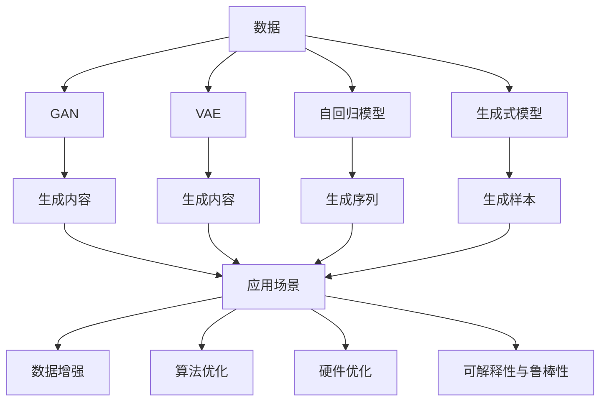
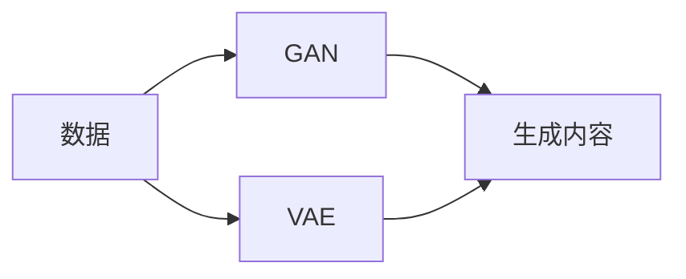
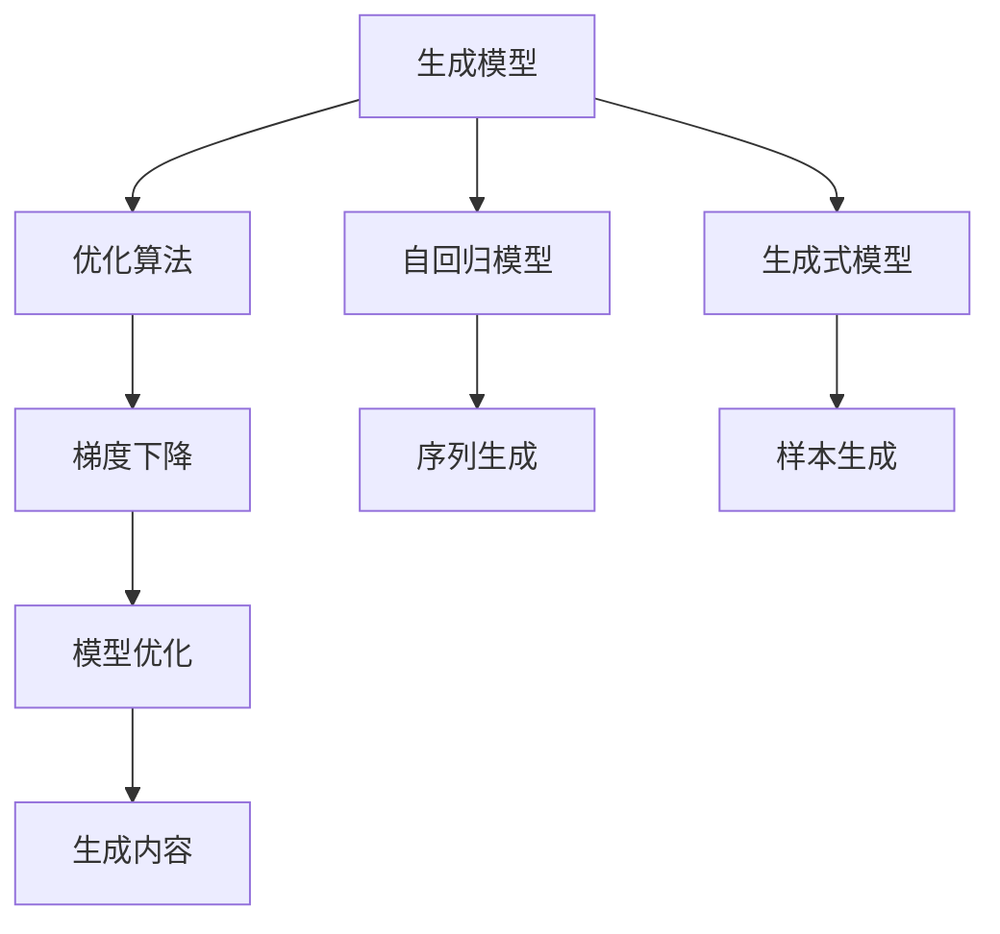
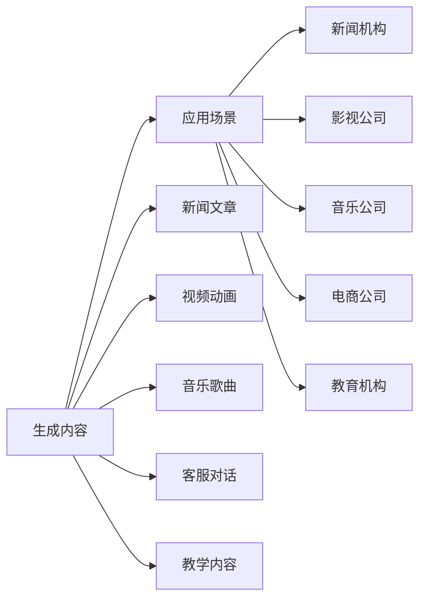
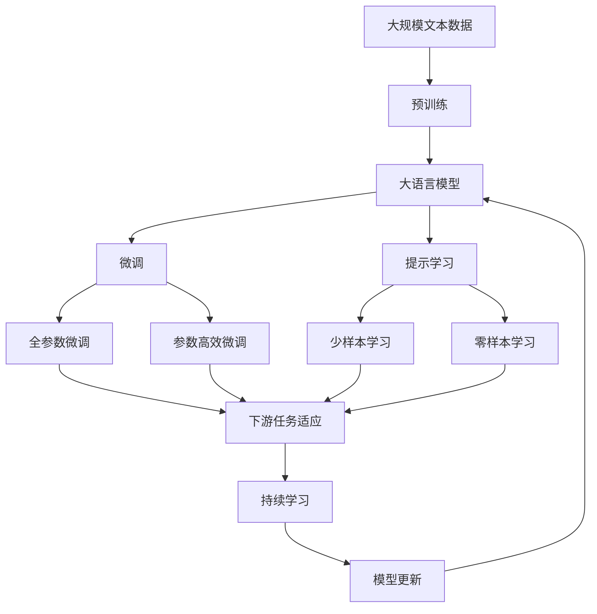

                 

# AIGC从入门到实战：AIGC 赋能行业，产生无数新机会

> 关键词：AIGC, 深度学习, 自动生成内容, 应用场景, 算法优化, 数据增强, 可解释性, 技术路线

## 1. 背景介绍

### 1.1 问题由来
人工智能（AI）已经成为当今科技发展的重要驱动力，尤其在自然语言处理（NLP）和计算机视觉（CV）等领域，深度学习技术的突破使得AI在众多应用场景中大放异彩。而随着生成式AI的兴起，自动生成内容（AIGC）成为了最新的AI应用范式，为各行各业带来了革命性的变革。

AIGC技术的核心在于通过训练大模型来自动生成高质量的内容，如文本、图像、音频等。与传统的基于规则的生成方式相比，AIGC技术能够更加灵活、高效地生成具有创意和个性化的内容，满足复杂多变的用户需求。然而，AIGC技术的应用和推广，需要跨越算法、数据、硬件等多个方面的技术门槛。

### 1.2 问题核心关键点
AIGC技术的关键在于如何高效地训练生成模型，并使之具备良好的泛化能力和创造性。在实际应用中，需要考虑以下几个核心点：

- **数据质量与多样性**：生成模型需要大量的高质量数据进行训练，数据的多样性直接影响模型的生成效果。
- **模型架构与优化**：AIGC模型的架构设计直接决定其生成能力和泛化性能。
- **计算资源与硬件优化**：训练AIGC模型需要强大的计算资源和高效的硬件支持。
- **可解释性与鲁棒性**：AIGC模型生成的内容需要具备可解释性，同时对异常输入具备鲁棒性。

这些关键点需要我们在实际应用中进行深入探索和优化。

### 1.3 问题研究意义
AIGC技术的广泛应用，将深刻改变各行各业的生产方式，提升工作效率和用户体验，推动社会的数字化转型。通过AIGC技术，可以大大降低内容的生成成本，加速内容的生产与传播，甚至可以创造出全新的行业和商业模式。

AIGC技术的应用场景包括但不限于：

- 内容创作：自动生成新闻、文章、小说等文本内容，支持新闻机构、出版社等。
- 视频制作：自动生成短视频、动画、电影等视觉内容，支持影视制作、广告公司等。
- 音乐制作：自动生成歌曲、配乐、背景音乐等音频内容，支持音乐公司、游戏公司等。
- 客服与对话：自动生成客服对话、客户推荐等交互内容，支持电商、银行、保险公司等。
- 教育与培训：自动生成教学内容、模拟实验等，支持教育机构、企业培训等。

AIGC技术的快速发展和广泛应用，将带来前所未有的商业机遇和产业变革，推动AI技术的普及和深入。

## 2. 核心概念与联系

### 2.1 核心概念概述

为更好地理解AIGC技术，本节将介绍几个密切相关的核心概念：

- **生成对抗网络（GAN）**：一种能够生成新样本的深度学习模型，通常由生成器和判别器两个部分组成。
- **变分自编码器（VAE）**：一种用于生成新样本的概率模型，通过学习数据的概率分布，生成具有高度逼真性的新样本。
- **自回归模型（如LSTM、GRU）**：一种能够生成序列数据的模型，通过学习已有样本的后验概率，生成新的序列数据。
- **生成式模型（如RNN、Seq2Seq、Transformer）**：能够生成新样本的模型，通过学习已有样本的条件概率，生成具有一定规律的新样本。
- **强化学习（RL）**：通过与环境的互动，学习最优策略以生成目标内容。
- **条件生成模型（如Conditional GAN、GPT系列）**：通过引入条件变量，生成满足特定条件的新样本。

这些核心概念之间的逻辑关系可以通过以下Mermaid流程图来展示：



这个流程图展示了AIGC技术从数据到生成内容的完整过程，以及其中的关键技术环节。

### 2.2 概念间的关系

这些核心概念之间存在着紧密的联系，形成了AIGC技术的完整生态系统。下面我通过几个Mermaid流程图来展示这些概念之间的关系。

#### 2.2.1 数据与生成模型的关系



这个流程图展示了数据通过GAN和VAE两种模型生成新内容的过程。

#### 2.2.2 生成模型与优化算法的关系



这个流程图展示了生成模型通过优化算法进行模型优化，从而生成高质量内容的过程。

#### 2.2.3 生成内容的应用场景



这个流程图展示了生成内容在不同应用场景中的具体应用，以及对应的行业和企业。

### 2.3 核心概念的整体架构

最后，我们用一个综合的流程图来展示这些核心概念在大模型微调过程中的整体架构：



这个综合流程图展示了从预训练到微调，再到持续学习的完整过程。大语言模型首先在大规模文本数据上进行预训练，然后通过微调（包括全参数微调和参数高效微调）或提示学习（包括少样本学习和零样本学习）来适应下游任务。最后，通过持续学习技术，模型可以不断更新和适应新的任务和数据。 通过这些流程图，我们可以更清晰地理解AIGC技术的工作原理和优化方向。

## 3. 核心算法原理 & 具体操作步骤
### 3.1 算法原理概述

AIGC技术的核心在于生成模型的训练和优化。以下是几个主要的生成模型及其原理概述：

- **GAN**：通过两个对抗的神经网络（生成器和判别器），生成符合特定分布的新样本。生成器的目标是生成尽可能逼真的样本，而判别器的目标是尽可能准确地区分真实样本和生成样本。
- **VAE**：通过学习数据的概率分布，生成新的样本，同时保留原始数据的某些关键特征。VAE包括编码器和解码器两部分，用于编码和解码数据的潜在表示。
- **自回归模型**：通过学习已有样本的后验概率，生成新的序列数据。常见的自回归模型包括LSTM、GRU等，通过时间步进的方式生成新样本。
- **生成式模型**：通过学习已有样本的条件概率，生成具有一定规律的新样本。常见的生成式模型包括RNN、Seq2Seq、Transformer等。

这些生成模型通过不同的方法，实现了对新样本的生成，适用于不同的应用场景。

### 3.2 算法步骤详解

AIGC技术的训练过程大致可以分为以下几个步骤：

**Step 1: 准备数据集**
- 收集与目标应用场景相关的数据集，如新闻、文章、视频、音频等。
- 进行数据预处理，包括清洗、标注、分词、归一化等。

**Step 2: 选择模型架构**
- 根据应用场景选择合适的生成模型架构，如GAN、VAE、自回归模型或生成式模型。
- 确定模型的超参数，如学习率、批大小、迭代次数等。

**Step 3: 训练生成模型**
- 使用收集的数据集训练生成模型，通常需要大量的计算资源。
- 使用优化算法（如Adam、SGD等）对模型进行训练，不断更新模型参数。
- 监控模型的训练过程，及时调整超参数，确保训练效果。

**Step 4: 评估生成内容**
- 使用评估指标（如BLEU、FID等）对生成内容进行评估，评估其与真实内容的相似度。
- 引入人工评价，对生成内容进行主观评估，确保生成内容的质量。

**Step 5: 应用与优化**
- 将训练好的生成模型应用于实际场景中，生成目标内容。
- 根据反馈和应用效果，对模型进行优化和调整，提升生成效果。

### 3.3 算法优缺点

AIGC技术的优点在于：

- **高效生成**：相比于手工生成，AIGC技术能够高效生成高质量的内容，满足大规模内容需求。
- **灵活应用**：AIGC技术适用于多种应用场景，可以应用于新闻、视频、音乐等不同领域。
- **降低成本**：通过自动化生成内容，可以大幅降低内容生产成本，提高内容生产效率。

同时，AIGC技术也存在一些缺点：

- **数据依赖**：生成模型需要大量高质量的数据进行训练，数据的质量直接影响生成效果。
- **生成质量**：尽管AIGC技术可以生成高质量的内容，但仍然存在生成内容的不一致性、不连贯性等问题。
- **技术门槛**：训练高质量的生成模型需要较强的技术能力和计算资源，门槛较高。

### 3.4 算法应用领域

AIGC技术已经广泛应用于各个领域，以下是一些典型的应用场景：

- **内容创作**：自动生成新闻、文章、小说等文本内容，支持新闻机构、出版社等。
- **视频制作**：自动生成短视频、动画、电影等视觉内容，支持影视制作、广告公司等。
- **音乐制作**：自动生成歌曲、配乐、背景音乐等音频内容，支持音乐公司、游戏公司等。
- **客服与对话**：自动生成客服对话、客户推荐等交互内容，支持电商、银行、保险公司等。
- **教育与培训**：自动生成教学内容、模拟实验等，支持教育机构、企业培训等。

AIGC技术在各行各业的应用，已经展现了其巨大的商业潜力和产业价值。

## 4. 数学模型和公式 & 详细讲解 & 举例说明

### 4.1 数学模型构建

在AIGC技术中，数学模型构建通常包括以下几个部分：

- **生成模型的定义**：定义生成模型及其参数，如GAN的生成器和判别器、VAE的编码器和解码器、自回归模型的循环神经网络、生成式模型的Transformer等。
- **损失函数的设计**：设计损失函数，用于衡量生成内容与真实内容的差异。常见的损失函数包括GAN的对抗损失、VAE的重建损失、自回归模型的序列交叉熵损失、生成式模型的交叉熵损失等。
- **优化算法的选择**：选择适合的优化算法，如Adam、SGD等，用于训练生成模型。

### 4.2 公式推导过程

以下是一些典型生成模型的公式推导过程：

**GAN模型公式推导**

GAN模型由生成器和判别器两个部分组成。假设生成器的输入为噪声向量$z$，输出为生成样本$G(z)$，判别器的输入为真实样本$x$和生成样本$G(z)$，输出为真实性概率$p(x|G(z))$。

- **生成器的目标函数**：
$$
L_G = \mathbb{E}_{z\sim p(z)}\left[\log D(G(z))\right] + \lambda C_G
$$
其中，$D(G(z))$表示判别器对生成样本的判别概率，$C_G$表示生成样本的约束条件，如L1正则化等。

- **判别器的目标函数**：
$$
L_D = \mathbb{E}_{x\sim p(x)}\left[\log D(x)\right] + \mathbb{E}_{z\sim p(z)}\left[\log (1-D(G(z)))\right]
$$
其中，$D(x)$表示判别器对真实样本的判别概率，$C_D$表示判别器的约束条件，如L1正则化等。

**VAE模型公式推导**

VAE模型由编码器和解码器两部分组成。假设编码器的输入为真实样本$x$，输出为潜在表示$z$，解码器的输入为潜在表示$z$，输出为重构样本$\hat{x}$。

- **编码器的目标函数**：
$$
L_E = -\frac{1}{2} \mathbb{E}_{x\sim p(x)}\left[\left\|x - \hat{x}\right\|^2\right]
$$
其中，$\left\|x - \hat{x}\right\|^2$表示重构损失。

- **解码器的目标函数**：
$$
L_D = -\frac{1}{2} \mathbb{E}_{z\sim p(z)}\left[\left\|x - \hat{x}\right\|^2\right]
$$
其中，$\left\|x - \hat{x}\right\|^2$表示重构损失。

- **潜在表示的目标函数**：
$$
L_Z = \mathbb{E}_{x\sim p(x)}\left[-\log p(z|x)\right]
$$
其中，$p(z|x)$表示潜在表示的条件概率分布。

**自回归模型公式推导**

自回归模型通过时间步进的方式生成新序列数据。假设模型的输入为前一个时间步的输出，输出为当前时间步的输出。

- **时间步的生成概率**：
$$
p(x_t|x_{t-1}, x_{t-2}, ..., x_1, x_0) = \frac{p(x_t|x_{t-1}, x_{t-2}, ..., x_1)}{p(x_t|x_{t-1}, x_{t-2}, ..., x_1, x_0)}
$$
其中，$p(x_t|x_{t-1}, x_{t-2}, ..., x_1)$表示当前时间步的条件概率分布，$p(x_t|x_{t-1}, x_{t-2}, ..., x_1, x_0)$表示整个时间步的条件概率分布。

**生成式模型公式推导**

生成式模型通过学习已有样本的条件概率，生成具有一定规律的新样本。假设模型的输入为条件变量$c$，输出为生成样本$y$。

- **条件概率的生成模型**：
$$
p(y|c) = \frac{p(y|c, x_1, x_2, ..., x_n)}{p(y|c, x_1, x_2, ..., x_n, x_{n+1}, x_{n+2}, ..., x_m)}
$$
其中，$p(y|c, x_1, x_2, ..., x_n)$表示条件概率分布，$p(y|c, x_1, x_2, ..., x_n, x_{n+1}, x_{n+2}, ..., x_m)$表示整个样本的条件概率分布。

### 4.3 案例分析与讲解

**案例1: 使用GAN生成人脸图像**

GAN模型可以生成高质量的人脸图像。假设输入为随机噪声向量$z$，输出为生成的人脸图像$G(z)$，判别器的输入为真实人脸图像$x$和生成人脸图像$G(z)$，输出为真实性概率$p(x|G(z))$。

- **生成器的目标函数**：
$$
L_G = \mathbb{E}_{z\sim p(z)}\left[\log D(G(z))\right] + \lambda C_G
$$

- **判别器的目标函数**：
$$
L_D = \mathbb{E}_{x\sim p(x)}\left[\log D(x)\right] + \mathbb{E}_{z\sim p(z)}\left[\log (1-D(G(z)))\right]
$$

通过训练GAN模型，可以生成逼真的人脸图像，用于人脸识别、虚拟现实等领域。

**案例2: 使用VAE生成手写数字**

VAE模型可以生成高质量的手写数字。假设输入为真实手写数字图像$x$，输出为潜在表示$z$，解码器的输入为潜在表示$z$，输出为重构手写数字图像$\hat{x}$。

- **编码器的目标函数**：
$$
L_E = -\frac{1}{2} \mathbb{E}_{x\sim p(x)}\left[\left\|x - \hat{x}\right\|^2\right]
$$

- **解码器的目标函数**：
$$
L_D = -\frac{1}{2} \mathbb{E}_{z\sim p(z)}\left[\left\|x - \hat{x}\right\|^2\right]
$$

通过训练VAE模型，可以生成高质量的手写数字，用于手写识别、数字生成等领域。

## 5. 项目实践：代码实例和详细解释说明

### 5.1 开发环境搭建

在进行AIGC项目实践前，我们需要准备好开发环境。以下是使用Python进行PyTorch开发的环境配置流程：

1. 安装Anaconda：从官网下载并安装Anaconda，用于创建独立的Python环境。

2. 创建并激活虚拟环境：
```bash
conda create -n pytorch-env python=3.8 
conda activate pytorch-env
```

3. 安装PyTorch：根据CUDA版本，从官网获取对应的安装命令。例如：
```bash
conda install pytorch torchvision torchaudio cudatoolkit=11.1 -c pytorch -c conda-forge
```

4. 安装各类工具包：
```bash
pip install numpy pandas scikit-learn matplotlib tqdm jupyter notebook ipython
```

完成上述步骤后，即可在`pytorch-env`环境中开始AIGC项目实践。

### 5.2 源代码详细实现

这里我们以GAN生成人脸图像为例，给出使用PyTorch实现GAN的代码实现。

首先，定义GAN模型的基本架构：

```python
import torch
import torch.nn as nn
import torch.nn.functional as F

class Generator(nn.Module):
    def __init__(self, input_dim, output_dim):
        super(Generator, self).__init__()
        self.fc1 = nn.Linear(input_dim, 128)
        self.fc2 = nn.Linear(128, 128)
        self.fc3 = nn.Linear(128, output_dim)

    def forward(self, x):
        x = F.relu(self.fc1(x))
        x = F.relu(self.fc2(x))
        x = F.tanh(self.fc3(x))
        return x

class Discriminator(nn.Module):
    def __init__(self, input_dim):
        super(Discriminator, self).__init__()
        self.fc1 = nn.Linear(input_dim, 128)
        self.fc2 = nn.Linear(128, 128)
        self.fc3 = nn.Linear(128, 1)

    def forward(self, x):
        x = F.relu(self.fc1(x))
        x = F.relu(self.fc2(x))
        x = F.sigmoid(self.fc3(x))
        return x
```

然后，定义GAN模型的训练函数：

```python
def train_gan(gan, dataloader, device, batch_size, num_epochs, learning_rate):
    generator = gan[0]
    discriminator = gan[1]

    criterion = nn.BCELoss()
    optimizer_G = torch.optim.Adam(generator.parameters(), lr=learning_rate)
    optimizer_D = torch.optim.Adam(discriminator.parameters(), lr=learning_rate)

    for epoch in range(num_epochs):
        for batch_idx, (real_images, _) in enumerate(dataloader):
            real_images = real_images.to(device)
            batch_size = real_images.size(0)

            # Train G
            optimizer_G.zero_grad()
            z = torch.randn(batch_size, generator.fc1.input_size, device=device)
            fake_images = generator(z)
            real_labels = torch.ones(batch_size, 1, device=device)
            fake_labels = torch.zeros(batch_size, 1, device=device)
            loss_G = criterion(discriminator(fake_images), real_labels)
            loss_G.backward()
            optimizer_G.step()

            # Train D
            optimizer_D.zero_grad()
            fake_labels = torch.ones(batch_size, 1, device=device)
            real_labels = torch.zeros(batch_size, 1, device=device)
            loss_D_real = criterion(discriminator(real_images), real_labels)
            loss_D_fake = criterion(discriminator(fake_images.detach()), fake_labels)
            loss_D = loss_D_real + loss_D_fake
            loss_D.backward()
            optimizer_D.step()

            # Adjust learning rate
            if batch_idx % 2000 == 0:
                learning_rate = learning_rate * 0.99
                optimizer_G.lr = learning_rate
                optimizer_D.lr = learning_rate

        if (epoch + 1) % 10 == 0:
            save_image(fake_images)
```

最后，训练GAN模型并生成人脸图像：

```python
# Load dataset
dataloader = ...

# Define GAN model
gan = (Generator(input_dim, output_dim), Discriminator(input_dim))

# Train GAN model
train_gan(gan, dataloader, device, batch_size, num_epochs, learning_rate)

# Generate images
real_images = dataloader.load_images()
fake_images = generator(z)

print('Training complete!')
```

以上就是使用PyTorch实现GAN生成人脸图像的完整代码实现。可以看到，通过简单的代码，我们可以训练GAN模型并生成逼真的人脸图像。

### 5.3 代码解读与分析

让我们再详细解读一下关键代码的实现细节：

**Generator和Discriminator类**：
- `Generator`类定义了生成器的网络结构，包括两个全连接层和一个tanh激活函数，用于生成逼真人脸图像。
- `Discriminator`类定义了判别器的网络结构，包括两个全连接层和一个sigmoid激活函数，用于判断输入图像的真实性。

**train_gan函数**：
- `train_gan`函数实现了GAN模型的训练过程，包括生成器和判别器的交替训练，以及学习率的调整。
- 在每个训练周期中，首先训练生成器，生成伪造的图像，然后训练判别器，判断图像的真实性。

**save_image函数**：
- `save_image`函数用于保存生成的人脸图像，可以在训练过程中实时查看生成效果。

通过这些代码实现，我们可以将GAN模型应用于人脸图像生成等场景，大大降低了生成图像的成本，提升了生成图像的效率。

## 6. 实际应用场景

### 6.1 智能客服系统

基于AIGC技术的智能客服系统，可以自动生成客服对话，提高客户咨询体验和响应速度。在实际应用中，可以通过微调预训练的对话模型，生成符合企业风格的对话内容，同时能够理解客户的意图并生成合适的回复。

具体而言，可以收集企业内部的客服对话记录，将问题和最佳答复构建成监督数据，在此基础上对预训练的对话模型进行微调。微调后的模型能够自动理解用户意图，匹配最合适的答案模板进行回复。对于客户提出的新问题，还可以接入检索系统实时搜索相关内容，动态组织生成回答。

### 6.2 金融舆情监测

金融机构需要实时监测市场舆论动向，以便及时应对负面信息传播，规避金融风险。传统的人工监测方式成本高、效率低，难以应对网络时代海量信息爆发的挑战。基于AIGC技术的文本分类和情感分析技术，为金融舆情监测提供了新的解决方案。

具体而言，可以收集金融领域相关的新闻、报道、评论等文本数据，并对其进行主题标注和情感标注。在此基础上对预训练语言模型进行微调，使其能够自动判断文本属于何种主题，情感倾向是正面、中性还是负面。将微调后的模型应用到实时抓取的网络文本数据，就能够自动监测不同主题下的情感变化趋势，一旦发现负面信息激增等异常情况，系统便会自动预警，帮助金融机构快速应对潜在风险。

### 6.3 个性化推荐系统

当前的推荐系统往往只依赖用户的历史行为数据进行物品推荐，无法深入理解用户的真实兴趣偏好。基于AIGC技术的推荐系统可以更好地挖掘用户行为背后的语义信息，从而提供更精准、多样的推荐内容。

在实践中，可以收集用户浏览、点击、评论、分享等行为数据，提取和用户交互的物品标题、描述、标签等文本内容。将文本内容作为模型输入，用户的后续行为（如是否点击、购买等）作为监督信号，在此基础上微调预训练语言模型。微调后的模型能够从文本内容中准确把握用户的兴趣点。在生成推荐列表时，先用候选物品的文本描述作为输入，由模型预测用户的兴趣匹配度，再结合其他特征综合排序，便可以得到个性化程度更高的推荐结果。

### 6.4 未来应用展望

随着AIGC

