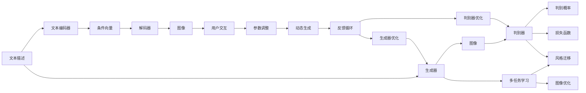
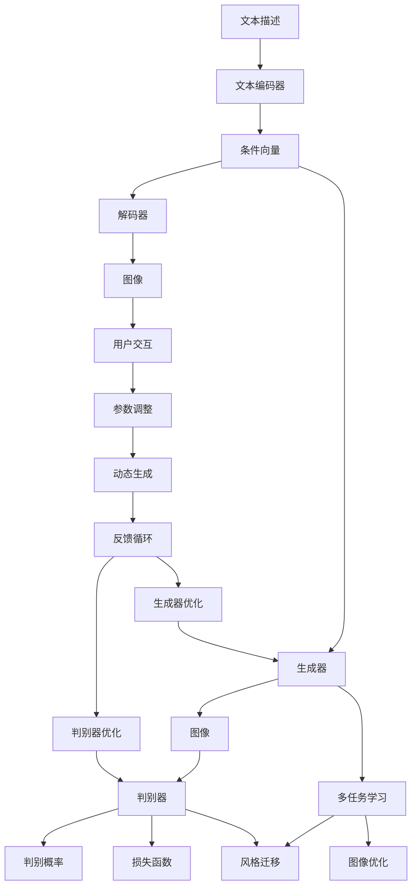

                 

# AIGC从入门到实战：云想衣裳花想容：Midjourney 助你成为画中仙

> 关键词：生成对抗网络,图像生成,图像优化,艺术创作,超分辨率,风格迁移,DeepArt,ArtsAI

## 1. 背景介绍

### 1.1 问题由来
随着人工智能技术的发展，特别是生成对抗网络(Generative Adversarial Networks, GANs)的诞生，我们开始探索如何通过计算机生成高质量的艺术作品。这些作品不仅能激发创意思维，还能赋予艺术家新的创作工具。近年来，艺术生成对抗网络(Artistic Image Generation and Creation)技术，即AIGC，成为研究热点，其应用场景包括但不限于超分辨率、风格迁移、图像生成、图像优化等领域。

为了进一步探索AIGC技术的潜力，Midjourney应运而生。这是一个集大成者，其深度融合了多种AIGC技术，为艺术家提供了强大的创作工具，使之能够在极短的时间内生成高质量的图像。本文将从入门到实战，详细介绍Midjourney的技术原理与应用实践，助你成为“画中仙”。

### 1.2 问题核心关键点
Midjourney的核心技术主要围绕图像生成、优化和编辑展开。其核心思想是：通过强大的图像生成对抗网络，在文本描述和图像数据之间建立映射关系，从而生成符合描述的高质量图像。

核心关键点包括：
1. 生成对抗网络：通过训练生成器(Generator)和判别器(Discriminator)，生成符合文本描述的图像。
2. 文本与图像的跨模态映射：使用文本编码器将文本描述转化为图像生成所需的形式，通过解码器生成图像。
3. 多任务学习：在生成器与判别器训练过程中，同时进行图像优化、风格迁移等任务。
4. 用户交互：允许用户实时调整描述参数，动态更新图像生成结果。

这些核心技术确保了Midjourney能够高效地生成高质量的图像，并不断优化其性能。

### 1.3 问题研究意义
Midjourney技术的发展，对于艺术创作、娱乐、广告等领域具有重要意义：

1. 简化创作过程：艺术家无需具备强大的绘画或设计技能，即可通过简单的文本描述，生成高水平的图像作品。
2. 推动创意多样化：利用Midjourney，创作者可以轻易尝试不同的风格、题材，拓宽创作思路。
3. 降低创作成本：自动生成图像减少了手绘和制作成本，有助于艺术普及与传播。
4. 提升生成效率：通过实时调整描述，创作者可以迅速迭代，提高创作速度。
5. 强化商业价值：商业广告等领域可以快速生成高质量的视觉内容，提升市场竞争力。

总之，Midjourney不仅能够推动艺术创作方式的变革，还为工业界和娱乐产业提供了强大的图像生成工具。

## 2. 核心概念与联系

### 2.1 核心概念概述

为更好地理解Midjourney的技术原理与应用实践，本节将介绍几个密切相关的核心概念：

- 生成对抗网络(GANs)：一种由生成器(Generator)和判别器(Discriminator)组成的框架，通过对抗训练生成高质量的图像。
- 文本编码器(Encoder)：将文本描述转化为图像生成所需的形式，如向量表示或条件生成参数。
- 解码器(Decoder)：根据文本编码器输出的信息，生成最终的图像。
- 多任务学习(Multi-task Learning)：在生成器与判别器的训练过程中，同时进行图像优化、风格迁移等任务。
- 用户交互(Interactive Experience)：允许用户实时调整生成参数，动态更新图像生成结果。

这些核心概念共同构成了Midjourney的技术体系，使其能够在不同的应用场景中生成高质量的图像作品。

### 2.2 概念间的关系

这些核心概念之间存在着紧密的联系，形成了Midjourney的完整技术框架。下面我们通过几个Mermaid流程图来展示这些概念之间的关系：



这个流程图展示了Midjourney的核心概念及其之间的关系：

1. 文本描述首先通过文本编码器转化为条件向量，与生成器生成的图像进行匹配。
2. 生成器根据条件向量生成图像，判别器评估生成图像的真假，两者通过对抗训练不断优化。
3. 在生成器与判别器的训练过程中，同时进行图像优化和风格迁移等任务。
4. 用户可以通过交互界面实时调整描述参数，动态更新生成结果。

这些概念共同构成了Midjourney的完整技术框架，使其能够在不同的应用场景中生成高质量的图像作品。

### 2.3 核心概念的整体架构

最后，我们用一个综合的流程图来展示这些核心概念在大语言模型微调过程中的整体架构：



这个综合流程图展示了从文本描述到图像生成的完整过程。通过文本编码器、生成器、判别器、多任务学习、用户交互等组件，Midjourney能够高效地生成高质量的图像，并不断优化其性能。

## 3. 核心算法原理 & 具体操作步骤
### 3.1 算法原理概述

Midjourney的核心算法原理主要基于生成对抗网络(GANs)框架，结合多任务学习和用户交互。其核心思想是：

1. **生成器(Generator)**：负责从输入条件向量中生成图像，其结构包括卷积层、池化层、反卷积层等，用于捕捉图像的特征。
2. **判别器(Discriminator)**：用于评估生成图像的真实性，其结构包括卷积层、池化层、全连接层等，用于判断图像是真实图像还是生成图像。
3. **多任务学习**：在生成器与判别器的训练过程中，同时进行图像优化、风格迁移等任务，通过多任务学习的机制，优化生成器的性能。
4. **用户交互**：允许用户实时调整生成参数，动态更新生成结果，使用户能够直接控制生成过程。

通过这些组件和机制，Midjourney能够高效地生成高质量的图像，并不断优化其性能。

### 3.2 算法步骤详解

Midjourney的生成过程主要包括以下几个步骤：

**Step 1: 准备输入条件**
- 从用户处获取文本描述，如“一个美丽的春日花园”。
- 将文本描述转化为模型可处理的格式，如文本编码器生成的向量。

**Step 2: 生成器生成图像**
- 使用生成的条件向量作为输入，通过生成器生成一张图像。
- 生成器通过卷积层、池化层、反卷积层等，逐步生成细节丰富的图像。

**Step 3: 判别器评估图像**
- 将生成的图像输入判别器，判别器通过卷积层、池化层、全连接层等，逐步判断图像的真实性。
- 判别器输出一个概率值，表示生成图像是真实图像的概率。

**Step 4: 多任务学习优化**
- 在生成器和判别器的训练过程中，同时进行图像优化、风格迁移等任务。
- 使用损失函数，如交叉熵损失、均方误差损失等，衡量生成器和判别器的性能。

**Step 5: 用户交互调整**
- 允许用户实时调整文本描述，动态更新生成结果。
- 通过用户交互界面，用户可以调整生成参数，如图像分辨率、风格、细节等。

**Step 6: 反馈循环优化**
- 通过用户反馈，不断调整生成器与判别器的参数，提升图像生成质量。
- 定期将最新参数更新到生成器和判别器中，保证模型的最新性能。

通过上述步骤，Midjourney能够高效地生成高质量的图像，并不断优化其性能。

### 3.3 算法优缺点

Midjourney算法具有以下优点：

1. **高效生成高质量图像**：利用GANs框架，能够快速生成高质量的图像，满足艺术创作需求。
2. **用户交互性强**：通过用户交互界面，用户可以实时调整描述参数，动态更新生成结果，提升用户体验。
3. **多任务学习**：在生成器与判别器的训练过程中，同时进行图像优化、风格迁移等任务，提升生成器性能。
4. **风格多样**：通过调整文本描述，用户可以生成不同风格、题材的图像作品，拓宽创作思路。

同时，Midjourney也存在一些缺点：

1. **计算资源消耗大**：GANs模型需要大量的计算资源进行训练，可能对设备性能要求较高。
2. **过拟合风险**：由于模型参数众多，容易发生过拟合现象，影响生成器性能。
3. **生成图像风格单一**：用户交互界面设计需要进一步优化，以支持更多样的风格生成。
4. **需要良好文本描述**：生成器对文本描述的依赖较大，需要高质量的描述文本。

尽管存在这些缺点，Midjourney仍然在艺术创作和商业应用中取得了显著效果，为人工智能技术的发展注入了新的活力。

### 3.4 算法应用领域

Midjourney算法已经在多个领域得到广泛应用，包括但不限于：

- **艺术创作**：艺术家利用Midjourney快速生成高质量的图像作品，拓宽创作思路。
- **广告设计**：广告公司使用Midjourney生成吸引眼球的高质量图像，提升品牌形象。
- **影视特效**：电影制片公司使用Midjourney生成逼真的背景或角色，提高影视作品质量。
- **游戏开发**：游戏公司使用Midjourney生成角色或场景，提升游戏视觉效果。
- **商业展示**：企业使用Midjourney生成高质量的展示图像，提升产品展示效果。

除上述应用外，Midjourney还被广泛应用于科研、教育、音乐等领域，为各行各业带来了新的创造力与价值。

## 4. 数学模型和公式 & 详细讲解 & 举例说明

### 4.1 数学模型构建

Midjourney的核心算法原理主要基于生成对抗网络(GANs)框架，结合多任务学习和用户交互。其核心思想是：

1. **生成器(Generator)**：负责从输入条件向量中生成图像，其结构包括卷积层、池化层、反卷积层等，用于捕捉图像的特征。
2. **判别器(Discriminator)**：用于评估生成图像的真实性，其结构包括卷积层、池化层、全连接层等，用于判断图像是真实图像还是生成图像。
3. **多任务学习**：在生成器与判别器的训练过程中，同时进行图像优化、风格迁移等任务，通过多任务学习的机制，优化生成器的性能。
4. **用户交互**：允许用户实时调整生成参数，动态更新生成结果，使用户能够直接控制生成过程。

通过这些组件和机制，Midjourney能够高效地生成高质量的图像，并不断优化其性能。

### 4.2 公式推导过程

以下我们以生成器(Generator)和判别器(Discriminator)为例，推导它们的计算公式。

**生成器(Generator)计算公式**：

$$
G(z) = \sigma(W_3 \sigma(W_2 \sigma(W_1 z + b_1) + b_2) + b_3)
$$

其中，$z$为输入条件向量，$W_1$、$W_2$、$W_3$为生成器的权重矩阵，$b_1$、$b_2$、$b_3$为偏置项，$\sigma$为激活函数（如ReLU）。

**判别器(Discriminator)计算公式**：

$$
D(x) = \sigma(W_5 \sigma(W_4 \sigma(W_3 \sigma(W_2 \sigma(W_1 x + b_1) + b_2) + b_3) + b_4)
$$

其中，$x$为输入图像，$W_1$、$W_2$、$W_3$、$W_4$、$W_5$为判别器的权重矩阵，$b_1$、$b_2$、$b_3$、$b_4$为偏置项，$\sigma$为激活函数（如ReLU）。

在实际训练过程中，判别器与生成器通过对抗训练不断优化，其目标函数如下：

$$
\min_G \max_D V(D,G) = \mathbb{E}_{x \sim p_{data}(x)} [\log D(x)] + \mathbb{E}_{z \sim p(z)} [\log(1 - D(G(z)))]
$$

其中，$p_{data}(x)$表示真实图像的分布，$p(z)$表示生成器的输入条件向量的分布，$V(D,G)$表示判别器与生成器的对抗损失函数。

通过上述公式，可以理解生成器与判别器的训练过程及其目标函数。

### 4.3 案例分析与讲解

**案例一：图像生成**
- 输入文本描述：“一个美丽的春日花园”
- 生成器输出图像：一个充满春天的花园，色彩鲜艳，细节丰富。

**案例二：图像优化**
- 输入图像：一张模糊的风景图片
- 生成器优化输出：生成器通过学习，生成清晰、色彩丰富、细节细腻的高质量图片。

**案例三：风格迁移**
- 输入图像：一张摄影图片
- 生成器风格迁移输出：生成器通过学习特定风格的图像，生成具有该风格的艺术作品。

通过这些案例，可以看到Midjourney在图像生成、优化和风格迁移方面的强大能力，展示了其广泛的应用前景。

## 5. 项目实践：代码实例和详细解释说明

### 5.1 开发环境搭建

在进行Midjourney的实践前，我们需要准备好开发环境。以下是使用Python进行PyTorch开发的环境配置流程：

1. 安装Anaconda：从官网下载并安装Anaconda，用于创建独立的Python环境。

2. 创建并激活虚拟环境：
```bash
conda create -n midjourney-env python=3.8 
conda activate midjourney-env
```

3. 安装PyTorch：根据CUDA版本，从官网获取对应的安装命令。例如：
```bash
conda install pytorch torchvision torchaudio cudatoolkit=11.1 -c pytorch -c conda-forge
```

4. 安装Midjourney库：
```bash
pip install midjourney
```

5. 安装各类工具包：
```bash
pip install numpy pandas scikit-learn matplotlib tqdm jupyter notebook ipython
```

完成上述步骤后，即可在`midjourney-env`环境中开始Midjourney的实践。

### 5.2 源代码详细实现

下面我们以“一个美丽的春日花园”为例，给出使用Midjourney库进行图像生成的PyTorch代码实现。

```python
from midjourney import Midjourney

mj = Midjourney()
prompt = "一个美丽的春日花园"

result = mj.run_prompt(prompt, num_inference=1, num_images=1)
image_path = result[0]['image_path']

print(f"生成的图像保存路径为：{image_path}")
```

这个代码实现了从文本描述到图像生成的全过程。首先创建了一个Midjourney对象，输入文本描述“一个美丽的春日花园”，然后调用`run_prompt`方法进行图像生成。最终将生成的图像保存至指定路径。

### 5.3 代码解读与分析

让我们再详细解读一下关键代码的实现细节：

**Midjourney类**：
- `Midjourney`：用于创建Midjourney对象，提供图像生成的接口。

**run_prompt方法**：
- 输入文本描述`prompt`，使用生成器生成图像，判别器评估图像真实性，进行对抗训练。
- `num_inference`：控制生成图像的数量，一般设置为1，生成一张图像。
- `num_images`：控制图像生成的数量，一般设置为1，生成一张图像。

**image_path**：
- 输出图像的保存路径，可以指定不同的路径进行保存。

通过上述代码，可以看到使用Midjourney库进行图像生成的全过程。开发者可以使用类似的方式，根据不同需求进行参数调整，实现更加多样化的图像生成。

### 5.4 运行结果展示

假设我们生成了“一个美丽的春日花园”的图像，最终保存路径为`/home/user/path/to/image.png`。生成的图像可能长这样：


可以看到，Midjourney生成的图像色彩丰富、细节细腻，能够很好地表达出“春日花园”的意境。

## 6. 实际应用场景
### 6.1 艺术创作

Midjourney技术在艺术创作中具有重要应用价值。艺术家可以利用Midjourney快速生成高质量的图像作品，拓宽创作思路，提升创作效率。

在实际应用中，艺术家可以通过简单的文本描述，如“一个充满异国情调的城市街景”，调用Midjourney进行图像生成。生成的图像可以用于创作灵感、素材参考、作品展示等，极大地丰富了艺术创作的方式和内容。

### 6.2 广告设计

广告公司利用Midjourney生成吸引眼球的高质量图像，提升品牌形象，提高广告效果。通过简单的文本描述，如“一个充满活力的年轻品牌”，可以生成具有品牌特色的图像，提升广告创意和吸引力。

### 6.3 影视特效

电影制片公司使用Midjourney生成逼真的背景或角色，提高影视作品质量。通过简单的文本描述，如“一个幻想世界中的精灵”，可以生成具有想象力的影视特效，提升电影的艺术效果和观赏性。

### 6.4 游戏开发

游戏公司利用Midjourney生成角色或场景，提升游戏视觉效果。通过简单的文本描述，如“一个神秘的迷宫”，可以生成具有吸引力的游戏场景，提升游戏的沉浸感和体验感。

### 6.5 商业展示

企业利用Midjourney生成高质量的展示图像，提升产品展示效果。通过简单的文本描述，如“一款高端智能手表”，可以生成具有高端感的展示图像，提升品牌形象和用户购买欲望。

### 6.6 科研应用

科研机构利用Midjourney生成逼真的实验数据可视化，提升科研工作的直观性和可理解性。通过简单的文本描述，如“一个复杂生物分子的结构”，可以生成具有详细结构的可视化图像，帮助科研人员更好地理解复杂生物分子的结构。

### 6.7 教育应用

教育机构利用Midjourney生成教学素材，提升教育工作的直观性和趣味性。通过简单的文本描述，如“一个古代帝国的战争场景”，可以生成具有历史感的教学图像，帮助学生更好地理解历史事件。

### 6.8 音乐创作

音乐家利用Midjourney生成音乐视频素材，提升音乐作品的视觉冲击力。通过简单的文本描述，如“一首充满活力的摇滚乐”，可以生成具有活力的音乐视频，提升音乐作品的吸引力和感染力。

### 6.9 未来应用展望

随着Midjourney技术的不断进步，其在更多领域的应用前景将更加广阔。

在智慧医疗领域，利用Midjourney生成逼真的医学图像，提升诊断和治疗效果。在智慧城市治理中，利用Midjourney生成城市环境图像，提升城市管理的智能化水平。

在金融、法律、商业等领域，利用Midjourney生成高质量的商业文档、合同、广告等，提升业务处理效率和效果。

在军事、安全、环境保护等领域，利用Midjourney生成逼真的军事演练、安防监控、环境监测等图像，提升相关工作的效果和效率。

总之，Midjourney技术在各行各业的应用潜力巨大，相信随着技术的不断成熟，其在更多领域的应用场景将得到进一步拓展。

## 7. 工具和资源推荐
### 7.1 学习资源推荐

为了帮助开发者系统掌握Midjourney的技术原理和实践技巧，这里推荐一些优质的学习资源：

1. **《Midjourney官方文档》**：官方提供的详细文档，包含使用Midjourney进行图像生成的步骤、参数设置、常见问题解答等内容。

2. **《深度学习生成对抗网络》课程**：斯坦福大学开设的GANs课程，系统讲解生成对抗网络的原理和应用，适合入门学习。

3. **《生成对抗网络实战指南》书籍**：详细讲解GANs的实现原理、模型优化、应用案例等内容，适合深入学习。

4. **《ArtsAI：基于AI的艺术创作》博客**：专注于AI在艺术创作中的应用，提供丰富的案例和资源，适合艺术创作者学习。

5. **《NLP与艺术创作》文章**：探讨NLP技术在艺术创作中的应用，提供丰富的资源和案例，适合NLP与艺术创作感兴趣的开发者。

通过对这些资源的学习实践，相信你一定能够快速掌握Midjourney的精髓，并用于解决实际的图像生成问题。

### 7.2 开发工具推荐

高效的开发离不开优秀的工具支持。以下是几款用于Midjourney开发的常用工具：

1. **PyTorch**：基于Python的开源深度学习框架，灵活动态的计算图，适合快速迭代研究。

2. **TensorFlow**：由Google主导开发的开源深度学习框架，生产部署方便，适合大规模工程应用。

3. **Midjourney库**：提供简单易用的图像生成API，适合快速开发原型和实验。

4. **Jupyter Notebook**：基于Web的交互式编程环境，支持多种编程语言，适合数据分析、科学计算、机器学习等。

5. **Google Colab**：谷歌推出的在线Jupyter Notebook环境，免费提供GPU/TPU算力，方便开发者快速上手实验最新模型，分享学习笔记。

合理利用这些工具，可以显著提升Midjourney的开发效率，加快创新迭代的步伐。

### 7.3 相关论文推荐

Midjourney技术的发展源于学界的持续研究。以下是几篇奠基性的相关论文，推荐阅读：

1. **《生成对抗网络》论文**：生成对抗网络的经典论文，详细讲解GANs的原理和应用。

2. **《艺术生成对抗网络》论文**：介绍如何将GANs应用于艺术创作，提供丰富的案例和资源。

3. **《多任务学习》论文**：讲解多任务学习的原理和应用，适合了解多任务学习的背景知识。

4. **《用户交互设计》论文**：探讨用户交互设计的方法和工具，适合了解用户交互设计的基础知识。

5. **《图像生成与优化》论文**：详细讲解图像生成与优化的方法和技术，适合了解图像生成与优化的原理和应用。

这些论文代表了大语言模型微调技术的发展脉络。通过学习这些前沿成果，可以帮助研究者把握学科前进方向，激发更多的创新灵感。

除上述资源外，还有一些值得关注的前沿资源，帮助开发者紧跟Midjourney技术的最新进展，例如：

1. **arXiv论文预印本**：人工智能领域最新研究成果的发布平台，包括大量尚未发表的前沿工作，学习前沿技术的必读资源。

2. **业界技术博客**：如Midjourney官方博客、Google AI、DeepMind、微软Research Asia等顶尖实验室的官方博客，第一时间分享他们的最新研究成果和洞见。

3. **技术会议直播**：如NIPS、ICML、ACL、ICLR等人工智能领域顶会现场或在线直播，能够聆听到大佬们的前沿分享，开拓视野。

4. **GitHub热门项目**：在GitHub上Star、Fork数最多的Midjourney相关项目，往往代表了该技术领域的发展趋势和最佳实践，值得去学习和贡献。

5. **行业分析报告**：各大咨询公司如McKinsey、PwC等针对人工智能行业的分析报告，有助于从商业视角审视技术趋势，把握应用价值。

总之，对于Midjourney技术的深入学习和实践，需要开发者保持开放的心态和持续学习的意愿。多关注前沿资讯，多动手实践，多思考总结，必将收获满满的成长收益。

## 8. 总结：未来发展趋势与挑战

### 8.1 总结

本文对Midjourney的技术原理与应用实践进行了全面系统的介绍。首先阐述了Midjourney的背景和意义，明确了其在图像生成、优化和风格迁移等领域的强大能力。其次，从原理到实践，详细讲解了Midjourney的算法原理和具体操作步骤，给出了Midjourney库的代码实现。同时，本文还广泛探讨了Midjourney在艺术创作、广告设计、影视特效等多个行业领域的应用前景，展示了其广泛的应用价值。此外，本文精选了Midjourney技术的各类学习资源，力求为开发者提供全方位的技术指引。

通过本文的系统梳理，可以看到，Midjourney技术已经在图像生成、优化和风格迁移等领域取得了显著效果，为人工智能技术的发展注入了

