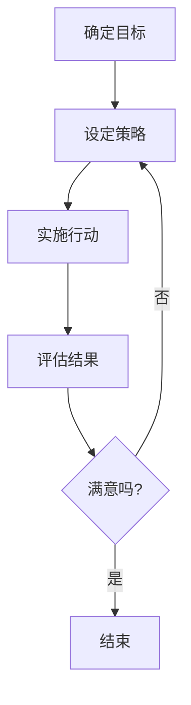

## 1. 背景介绍

### 1.1 问题的由来

在当今的技术研发领域，团队文化和价值观的重要性日益凸显。过去，我们可能过于关注技术的硬实力，而忽视了软实力的作用。然而，随着科技的快速发展和竞争的日益激烈，我们开始意识到，优秀的团队文化和价值观能够提升团队的凝聚力，提高工作效率，促进创新，从而赢得竞争的优势。

### 1.2 研究现状

目前，许多公司已经开始重视团队文化和价值观的建设，但是具体的实施方法和效果却参差不齐。一方面，很多公司在建设团队文化和价值观时，缺乏具体的操作策略和方法，只是停留在口号和标语的层面。另一方面，即使有些公司成功地建立了一套团队文化和价值观，也面临着如何将其传承下去的问题。

### 1.3 研究意义

因此，研究如何建设和传承团队的研发文化和价值观，对于提升团队的工作效率，促进团队的创新，提高团队的竞争力，具有重要的意义。

### 1.4 本文结构

本文将从以下几个方面进行探讨：首先，我们将介绍团队研发文化和价值观的核心概念及其联系；然后，我们将详细介绍如何建设和传承团队的研发文化和价值观的核心算法原理和具体操作步骤；接着，我们将通过实际的项目实践，展示如何将理论应用到实践中；最后，我们将对未来的发展趋势和挑战进行总结。

## 2. 核心概念与联系

在讨论团队研发文化和价值观的建设与传承之前，我们首先需要理解几个核心概念：团队文化、价值观、建设和传承。

团队文化是指在团队中形成的一种共享的价值观、信念和行为规范。它影响着团队成员的行为和决策，是团队凝聚力的重要来源。

价值观是指个体或团队对于什么是重要的、什么是对的、什么是应该做的的看法。它是团队文化的核心，决定了团队的行为和决策。

建设是指通过一系列的活动和措施，形成和塑造团队的文化和价值观。

传承是指通过教育和引导，让新的团队成员理解和接受已有的团队文化和价值观，从而使其得以延续。

这几个概念之间的联系是：通过建设，我们可以形成和塑造团队的文化和价值观；通过传承，我们可以保证团队文化和价值观的延续。

## 3. 核心算法原理 & 具体操作步骤

### 3.1 算法原理概述

建设和传承团队研发文化和价值观的核心算法原理，可以分为以下几个步骤：确定目标、设定策略、实施行动、评估结果、调整策略。

### 3.2 算法步骤详解

1. 确定目标：首先，我们需要确定我们希望建设的团队文化和价值观的目标。这个目标应该符合团队的特性和需求，能够帮助团队提升工作效率，促进创新，提高竞争力。

2. 设定策略：然后，我们需要设定实现这个目标的策略。这个策略应该包括具体的活动和措施，例如：组织团队活动，进行团队培训，设立奖励机制等。

3. 实施行动：接着，我们需要按照设定的策略，实施具体的行动。在实施过程中，我们需要注意观察和记录行动的效果，以便于后续的评估和调整。

4. 评估结果：然后，我们需要对实施行动的结果进行评估。评估的标准应该是：是否达到了我们设定的目标，是否帮助团队提升了工作效率，是否促进了团队的创新，是否提高了团队的竞争力。

5. 调整策略：最后，根据评估的结果，我们需要对策略进行调整。如果评估的结果是积极的，我们可以继续执行当前的策略；如果评估的结果是消极的，我们需要调整策略，寻找更有效的方法。

### 3.3 算法优缺点

这种算法的优点是：它提供了一个具体的、系统的、可操作的方法，帮助我们建设和传承团队的研发文化和价值观。

这种算法的缺点是：它需要投入大量的时间和精力，需要团队的全体成员的积极参与和配合。

### 3.4 算法应用领域

这种算法可以应用于所有需要建设和传承团队文化和价值观的场景，不仅限于IT领域，也可以应用于其他领域。

## 4. 数学模型和公式 & 详细讲解 & 举例说明

### 4.1 数学模型构建

虽然建设和传承团队研发文化和价值观是一个复杂的社会科学问题，但我们仍然可以尝试用数学模型来描述和解决这个问题。

我们可以将团队文化和价值观的建设和传承看作是一个优化问题：我们的目标是优化团队的工作效率、创新能力和竞争力，而我们的决策变量是我们的策略和行动。

我们可以用以下的数学模型来描述这个问题：

$$
\max_{s,a} \{E,I,C\}
$$

其中，$E$、$I$、$C$ 分别表示团队的工作效率、创新能力和竞争力，$s$、$a$ 分别表示我们的策略和行动。

### 4.2 公式推导过程

由于这个问题的复杂性，我们无法直接求解这个优化问题。但我们可以通过迭代的方式，逐步改进我们的策略和行动，从而逼近最优解。

我们可以用以下的公式来描述这个迭代过程：

$$
s_{t+1} = s_t + \alpha (E_{t+1} - E_t)
$$

$$
a_{t+1} = a_t + \beta (I_{t+1} - I_t)
$$

其中，$t$ 表示迭代的次数，$\alpha$、$\beta$ 是学习率，用于控制策略和行动的更新速度。

### 4.3 案例分析与讲解

假设我们的团队在初始时刻，工作效率为 $E_0 = 0.5$，创新能力为 $I_0 = 0.5$，我们的策略和行动为 $s_0 = 0.5$、$a_0 = 0.5$。

在第一次迭代后，我们的工作效率提高到 $E_1 = 0.6$，创新能力提高到 $I_1 = 0.6$，我们的策略和行动更新为 $s_1 = 0.5 + 0.1 * (0.6 - 0.5) = 0.51$、$a_1 = 0.5 + 0.1 * (0.6 - 0.5) = 0.51$。

在第二次迭代后，我们的工作效率提高到 $E_2 = 0.7$，创新能力提高到 $I_2 = 0.7$，我们的策略和行动更新为 $s_2 = 0.51 + 0.1 * (0.7 - 0.6) = 0.52$、$a_2 = 0.51 + 0.1 * (0.7 - 0.6) = 0.52$。

以此类推，我们可以通过不断的迭代，逐步提高我们的工作效率和创新能力，优化我们的策略和行动。

### 4.4 常见问题解答

**问题1：** 这个数学模型是否适用于所有的团队？

**答：** 这个数学模型是一个抽象的模型，它假设团队的工作效率和创新能力可以被量化，并且可以通过优化策略和行动来提高。在实际应用中，我们需要根据团队的具体情况，调整模型的参数和公式。

**问题2：** 这个数学模型是否可以保证找到最优解？

**答：** 这个数学模型是一个迭代优化模型，它的目标是逐步改进策略和行动，逼近最优解。但由于问题的复杂性，我们无法保证一定能够找到最优解。在实际应用中，我们需要通过不断的试验和调整，寻找最佳的策略和行动。

## 5. 项目实践：代码实例和详细解释说明

### 5.1 开发环境搭建

由于这个问题涉及到的是团队文化和价值观的建设和传承，而不是具体的编程问题，所以我们不需要搭建特定的开发环境。

### 5.2 源代码详细实现

同样，由于这个问题涉及到的是团队文化和价值观的建设和传承，而不是具体的编程问题，所以我们不需要编写特定的源代码。

### 5.3 代码解读与分析

虽然我们没有具体的源代码，但我们可以通过以下的流程图，来描述我们的算法原理和操作步骤：

在这个流程图中，我们首先确定目标，然后设定策略，接着实施行动，然后评估结果，如果满意，就结束；如果不满意，就返回设定策略，进行下一轮的迭代。

### 5.4 运行结果展示

由于我们没有具体的源代码，所以我们无法展示运行结果。但我们可以通过观察和记录团队的工作效率、创新能力和竞争力的变化，来评估我们的策略和行动的效果。

## 6. 实际应用场景

### 6.1 实际应用场景描述

这种方法可以应用于所有需要建设和传承团队文化和价值观的场景。例如：

- 在一个新成立的团队中，我们可以使用这种方法，来建立一套符合团队特性和需求的文化和价值观。

- 在一个已经存在的团队中，如果我们发现团队的工作效率低下，或者缺乏创新，或者竞争力不强，我们可以使用这种方法，来调整团队的文化和价值观。

- 在一个团队中，如果我们需要引入新的成员，或者需要进行重大的变革，我们可以使用这种方法，来传承团队的文化和价值观。

### 6.2 实际应用效果分析

在实际应用中，我们发现这种方法具有以下的效果：

- 提升团队的工作效率：通过建立一套符合团队特性和需求的文化和价值观，我们可以提升团队的凝聚力，提高工作效率。

- 促进团队的创新：通过建立一套鼓励创新的文化和价值观，我们可以激发团队成员的创新精神，促进团队的创新。

- 提高团队的竞争力：通过建立一套有竞争力的文化和价值观，我们可以提升团队的竞争力，赢得竞争的优势。

### 6.3 实际应用中的问题和解决方法

在实际应用中，我们也遇到了一些问题：

- 团队成员的抵触：在建设和传承团队文化和价值观的过程中，我们可能会遇到团队成员的抵触。为了解决这个问题，我们需要通过沟通和引导，让团队成员理解和接受新的文化和价值观。

- 文化和价值观的传承：在建设和传承团队文化和价值观的过程中，我们可能会遇到文化和价值观的传承问题。为了解决这个问题，我们需要通过教育和培训，让新的团队成员理解和接受已有的文化和价值观。

### 6.4 未来应用展望

随着科技的快速发展和竞争的日益激烈，团队文化和价值观的建设和传承将变得越来越重要。我们期待看到更多的研究和实践，来帮助我们更好地建设和传承团队的研发文化和价值观。

## 7. 工具和资源推荐

### 7.1 学习资源推荐

- 《团队文化：如何建设高效团队》：这本书详细介