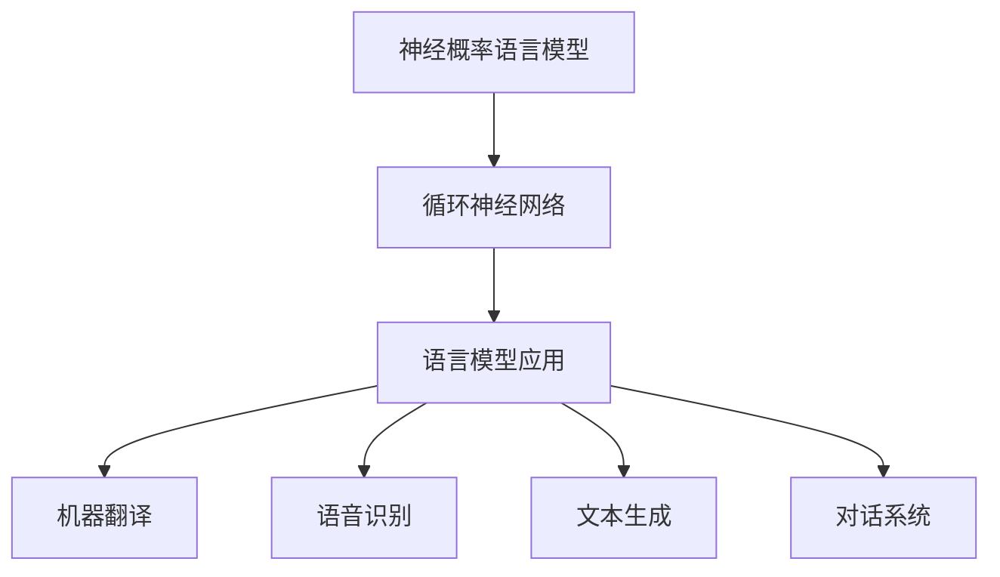

# 山重水复疑无路：神经概率语言模型和循环神经网络

## 1. 背景介绍

### 1.1 问题的由来

在自然语言处理(NLP)领域,传统的统计语言模型存在一些固有的缺陷和局限性。这些模型通常基于n-gram统计,无法很好地捕捉长距离依赖关系和上下文语义信息。随着深度学习技术的兴起,神经网络模型展现出了强大的表达能力和建模能力,为解决这些问题提供了新的思路。

神经概率语言模型(Neural Probabilistic Language Model, NPLM)和循环神经网络(Recurrent Neural Network, RNN)就是这种新型神经网络模型的代表,它们能够更好地对序列数据(如自然语言)进行建模,捕捉长期依赖关系,并产生更准确、更流畅的语言输出。

### 1.2 研究现状

近年来,NPLM和RNN在自然语言处理领域取得了卓越的成就,成为语言模型的主流方法。著名的模型如Word2Vec、GloVe、ELMo、BERT等,都是基于这些技术发展而来。它们在机器翻译、语音识别、文本生成、对话系统等多个任务中表现出色。

然而,这些模型也面临一些挑战,如训练过程复杂、计算资源需求高、存在暴露偏置(Exposure Bias)问题等。研究人员一直在探索新的模型结构、训练策略和优化方法,以提高模型的性能和鲁棒性。

### 1.3 研究意义

NPLM和RNN是当前自然语言处理领域的核心技术,对于构建智能对话系统、自动问答系统、自动文本摘要和自动创作系统等具有重要意义。深入研究这些模型的原理和实现细节,有助于我们更好地理解和应用这些技术,推动自然语言处理领域的发展。

### 1.4 本文结构

本文将全面介绍神经概率语言模型和循环神经网络的基本原理、核心算法、数学模型、实现细节和应用场景。我们将从以下几个方面进行阐述:

1. 核心概念与联系
2. 核心算法原理与具体操作步骤
3. 数学模型和公式详细讲解与案例分析
4. 项目实践:代码实例和详细解释说明
5. 实际应用场景
6. 工具和资源推荐
7. 总结:未来发展趋势与挑战
8. 附录:常见问题与解答

## 2. 核心概念与联系

神经概率语言模型(NPLM)和循环神经网络(RNN)是密切相关的两个概念,它们共同构建了当代语言模型的核心框架。

**神经概率语言模型(NPLM)**是一种使用神经网络来计算语言序列概率的模型。与传统的n-gram统计语言模型不同,NPLM能够更好地捕捉长距离依赖关系和上下文语义信息。它通过神经网络对输入序列进行编码,然后计算下一个词的概率分布。

**循环神经网络(RNN)**是一种特殊的神经网络结构,专门设计用于处理序列数据,如自然语言、语音、时间序列等。RNN在隐藏层之间引入了循环连接,使得网络能够捕捉序列中的长期依赖关系。RNN通常与NPLM结合使用,作为NPLM的编码器,对输入序列进行编码和建模。

NPLM和RNN的结合,使得语言模型能够更好地捕捉语言的上下文信息和长期依赖关系,从而产生更准确、更流畅的语言输出。这种模型已经广泛应用于多个自然语言处理任务,如机器翻译、语音识别、文本生成、对话系统等,取得了卓越的成绩。

## 3. 核心算法原理 & 具体操作步骤

### 3.1 算法原理概述

神经概率语言模型(NPLM)和循环神经网络(RNN)的核心算法原理可以概括为以下几个关键点:

1. **序列建模**: NPLM和RNN都是针对序列数据(如自然语言)进行建模的模型。它们能够捕捉序列中的长期依赖关系和上下文信息。

2. **概率计算**: NPLM的目标是计算给定上下文下,下一个词出现的概率分布。这个概率分布由神经网络模型计算得到。

3. **循环结构**: RNN通过在隐藏层之间引入循环连接,使得网络能够捕捉序列中的长期依赖关系。这种循环结构是RNN的核心特征。

4. **参数共享**: RNN在处理序列数据时,对于每个时间步,都使用相同的权重参数进行计算。这种参数共享机制使得RNN能够高效地处理可变长度的序列。

5. **反向传播算法**: NPLM和RNN都采用反向传播算法进行模型训练,根据输出和目标之间的误差,不断调整网络参数,使模型逐步拟合训练数据。

### 3.2 算法步骤详解

以下是NPLM和RNN算法的具体操作步骤:

1. **数据预处理**:将自然语言数据转换为适合模型输入的形式,通常是将文本序列转换为词向量序列。

2. **模型初始化**:初始化NPLM和RNN模型的参数,包括权重矩阵、偏置向量等。

3. **前向传播**:
   - 对于NPLM,将输入序列通过嵌入层转换为词向量表示,然后输入到神经网络模型中,计算下一个词的概率分布。
   - 对于RNN,将输入序列逐个时间步输入到RNN单元中,每个时间步的隐藏状态由当前输入和上一时间步的隐藏状态计算得到。最后一个时间步的隐藏状态通常作为序列的编码表示。

4. **损失计算**:根据模型输出的概率分布和真实目标之间的差异,计算损失函数(如交叉熵损失)。

5. **反向传播**:利用反向传播算法,计算损失函数相对于模型参数的梯度,并根据梯度更新模型参数。

6. **迭代训练**:重复执行步骤3-5,不断优化模型参数,直到模型收敛或达到预设的迭代次数。

7. **模型评估**:在测试集上评估模型的性能,常用指标包括困惑度(Perplexity)、BLEU分数等。

8. **模型应用**:将训练好的NPLM和RNN模型应用于实际任务,如机器翻译、语音识别、文本生成等。

### 3.3 算法优缺点

**优点**:

- 能够捕捉长期依赖关系和上下文语义信息,克服了传统n-gram模型的局限性。
- 通过端到端的训练,能够自动学习有效的特征表示,无需人工设计特征。
- 模型结构灵活,可以通过调整网络层数、神经元数量等参数,适应不同的任务和数据。
- 在多个自然语言处理任务上表现出色,成为主流的语言模型方法。

**缺点**:

- 训练过程复杂,需要大量的计算资源和训练数据。
- 存在梯度消失/爆炸问题,影响模型对长序列的建模能力。
- 可能存在暴露偏置(Exposure Bias)问题,即训练和推理阶段的数据分布不一致。
- 对于一些特殊的语言现象(如长距离依赖、复杂语法结构等),模型的表现可能不够理想。

### 3.4 算法应用领域

NPLM和RNN广泛应用于自然语言处理领域的多个任务,包括但不限于:

- **机器翻译**: 将源语言文本翻译为目标语言文本。
- **语音识别**: 将语音信号转录为文本。
- **文本生成**: 根据给定的上下文或主题,自动生成连贯、流畅的文本。
- **对话系统**: 构建智能对话代理,与用户进行自然语言交互。
- **文本摘要**: 自动生成文本的摘要或概括。
- **情感分析**: 分析文本中的情感倾向(积极、消极等)。
- **命名实体识别**: 识别文本中的人名、地名、组织机构名等实体。
- **关系抽取**: 从文本中抽取实体之间的语义关系。

除了自然语言处理领域,NPLM和RNN也可以应用于其他涉及序列数据的领域,如生物信息学、时间序列预测、音乐生成等。

## 4. 数学模型和公式 & 详细讲解 & 举例说明

### 4.1 数学模型构建

神经概率语言模型(NPLM)和循环神经网络(RNN)的数学模型构建过程如下:

1. **符号定义**:
   - 令 $x_t$ 表示时间步 $t$ 的输入词向量
   - 令 $y_t$ 表示时间步 $t$ 的输出词向量(即目标词)
   - 令 $h_t$ 表示时间步 $t$ 的隐藏状态向量
   - 令 $W$、$U$、$V$ 分别表示输入权重矩阵、循环权重矩阵和输出权重矩阵
   - 令 $b$、$c$ 分别表示隐藏层偏置向量和输出层偏置向量

2. **前向传播**:
   对于简单的RNN模型,在时间步 $t$ 的前向传播计算过程为:

   $$h_t = \tanh(W x_t + U h_{t-1} + b)$$
   $$\hat{y}_t = \text{softmax}(V h_t + c)$$

   其中 $\tanh$ 为双曲正切激活函数,用于引入非线性;$\text{softmax}$ 函数将输出转换为概率分布。

3. **损失函数**:
   通常使用交叉熵损失函数来衡量模型输出的概率分布与真实目标之间的差异:

   $$\mathcal{L}(\theta) = -\frac{1}{T} \sum_{t=1}^T \log P(y_t | x_{\leq t}; \theta)$$

   其中 $\theta$ 表示模型参数集合,包括 $W$、$U$、$V$、$b$、$c$ 等;$T$ 为序列长度。

4. **反向传播**:
   利用反向传播算法,计算损失函数相对于模型参数的梯度,并根据梯度更新参数:

   $$\theta_{t+1} = \theta_t - \eta \frac{\partial \mathcal{L}(\theta_t)}{\partial \theta_t}$$

   其中 $\eta$ 为学习率,用于控制参数更新的步长。

以上是NPLM和RNN的基本数学模型,实际模型可能会有所变形和扩展,如引入注意力机制、门控循环单元等,以提高模型的表现能力。

### 4.2 公式推导过程

接下来,我们将详细推导RNN模型的前向传播和反向传播公式。

**前向传播公式推导**:

在时间步 $t$,RNN的隐藏状态 $h_t$ 由当前输入 $x_t$ 和上一时间步的隐藏状态 $h_{t-1}$ 计算得到:

$$h_t = f(W x_t + U h_{t-1} + b)$$

其中 $f$ 为激活函数,如 $\tanh$ 或 $\text{ReLU}$。

将激活函数展开,我们得到:

$$h_t = \tanh(W x_t + U h_{t-1} + b)$$

接下来,将隐藏状态 $h_t$ 输入到输出层,计算输出概率分布:

$$\hat{y}_t = \text{softmax}(V h_t + c)$$

其中 $\hat{y}_t$ 表示时间步 $t$ 的输出概率分布,每个元素对应一个词的概率;$V$ 为输出权重矩阵;$c$ 为输出偏置向量。

**反向传播公式推导**:

我们以交叉熵损失函数为例,推导反向传播公式。

在时间步 $t$