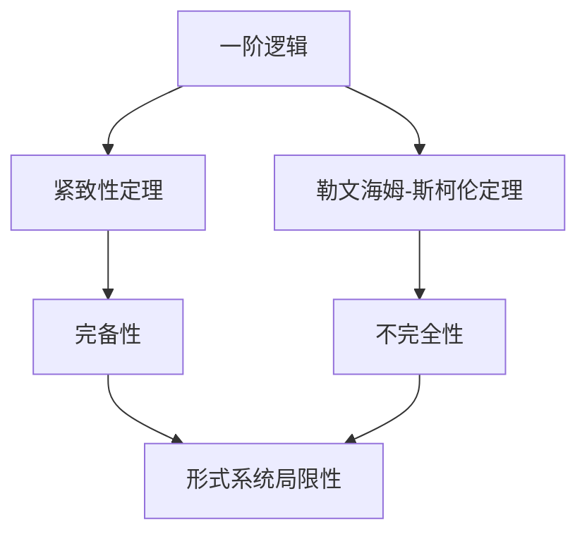

# 数理逻辑：紧致性定理和勒文海姆-斯柯伦定理

## 1. 背景介绍

### 1.1 问题的由来

数理逻辑是一门研究形式语言、演绎系统和计算理论的学科。它为计算机科学、数学和哲学等领域提供了坚实的理论基础。在数理逻辑中,有两个重要的定理:紧致性定理和勒文海姆-斯柯伦定理,它们揭示了形式系统的局限性,对于理解计算的本质具有重要意义。

### 1.2 研究现状

紧致性定理和勒文海姆-斯柯伦定理是20世纪初期由著名逻辑学家库尔特·哥德尔(Kurt Gödel)和阿隆佐·徐奇(Alonzo Church)等人提出的。这两个定理揭示了任何足够强大的形式系统都存在着内在的局限性,即存在某些命题无法在该系统中被证明或否证。

这一发现对于数学基础研究产生了深远影响,也引发了人们对计算能力和人工智能局限性的反思。目前,这两个定理在逻辑学、计算理论和人工智能等领域仍然是研究的热点课题。

### 1.3 研究意义

紧致性定理和勒文海姆-斯柯伦定理的意义在于:

1. 阐明了形式系统的局限性,揭示了任何足够强大的形式系统都存在无法证明或否证的命题。
2. 为计算理论奠定了坚实的理论基础,影响了计算机科学的发展方向。
3. 引发了人们对人工智能局限性的思考,促进了对智能本质的探索。
4. 在数学基础研究中具有重要地位,影响了数学哲学的发展。

### 1.4 本文结构

本文将从以下几个方面深入探讨紧致性定理和勒文海姆-斯柯伦定理:

1. 核心概念与联系
2. 核心算法原理与具体操作步骤
3. 数学模型和公式详细讲解与举例说明
4. 项目实践:代码实例和详细解释说明
5. 实际应用场景
6. 工具和资源推荐
7. 总结:未来发展趋势与挑战
8. 附录:常见问题与解答

## 2. 核心概念与联系

紧致性定理和勒文海姆-斯柯伦定理虽然独立提出,但它们之间存在着内在的联系。

紧致性定理(Gödel's Completeness Theorem)阐述了一阶逻辑的完备性,即一阶逻辑中所有可证的命题都是可满足的。形式化地说,如果一个句子在一阶逻辑中是可证的,那么它在所有模型中都是正确的。

另一方面,勒文海姆-斯柯伦定理(Löwenheim-Skolem Theorem)则阐述了一阶逻辑的不完全性。它指出,如果一个理论有一个无限模型,那么它也必然有一个可数无限模型。换言之,任何一阶理论都无法完全刻画无限集合的性质。

这两个定理揭示了一阶逻辑的局限性:虽然它是完备的,但无法完全捕捉无限集合的性质。这种矛盾性反映了形式系统的内在局限,为后来哥德尔不完备性定理奠定了基础。

## 3. 核心算法原理与具体操作步骤

### 3.1 算法原理概述

#### 紧致性定理

紧致性定理的核心思想是建立一阶逻辑的语法和语义之间的对应关系。具体来说,它证明了如果一个句子在一阶逻辑中是可证的,那么它在所有模型中都是正确的。

该定理的证明过程包括两个方向:

1. 证明语法推理规则的正确性,即如果一个句子可以从一组前提推导出来,那么它在所有满足这些前提的模型中都是正确的。
2. 证明语法推理规则的完全性,即如果一个句子在所有模型中都是正确的,那么它就可以从一组前提推导出来。

通过这种方式,紧致性定理建立了一阶逻辑的完备性,确保了语法推理和语义真值之间的一致性。

#### 勒文海姆-斯柯伦定理

勒文海姆-斯柯伦定理则揭示了一阶逻辑的不完全性。它的核心思想是通过构造一个可数无限模型来证明,如果一个理论有一个无限模型,那么它也必然有一个可数无限模型。

该定理的证明过程包括两个步骤:

1. 勒文海姆定理:如果一个理论有一个无限模型,那么它也有一个可数无限模型。
2. 斯柯伦定理:如果一个理论有一个无限模型,那么它也有一个可数无限模型,且该模型可以嵌入到任何其他无限模型中。

通过这种方式,勒文海姆-斯柯伦定理揭示了一阶逻辑无法完全刻画无限集合的性质,从而暴露出形式系统的局限性。

### 3.2 算法步骤详解

#### 紧致性定理算法步骤

1. 构建一阶逻辑的语法系统,包括语法规则、公理和推理规则。
2. 定义一阶逻辑的语义系统,包括解释、模型和真值赋值。
3. 证明语法推理规则的正确性:
   - 对于每一条推理规则,证明如果前提在某个模型中为真,那么结论也在该模型中为真。
4. 证明语法推理规则的完全性:
   - 构造一个特殊的模型,称为"Henkin模型"。
   - 证明如果一个句子在所有模型中都是正确的,那么它就可以从一组前提推导出来。
5. 结合正确性和完全性,得出紧致性定理:一个句子在一阶逻辑中是可证的,当且仅当它在所有模型中都是正确的。

#### 勒文海姆-斯柯伦定理算法步骤

1. 勒文海姆定理步骤:
   - 假设一个理论有一个无限模型。
   - 构造一个可数无限模型,使其满足该理论的所有句子。
2. 斯柯伦定理步骤:
   - 假设一个理论有一个无限模型。
   - 构造一个可数无限模型,使其满足该理论的所有句子。
   - 证明该可数无限模型可以嵌入到任何其他无限模型中。
3. 结合勒文海姆定理和斯柯伦定理,得出勒文海姆-斯柯伦定理:如果一个理论有一个无限模型,那么它也必然有一个可数无限模型,且该模型可以嵌入到任何其他无限模型中。

### 3.3 算法优缺点

#### 紧致性定理

优点:

- 确立了一阶逻辑的完备性,保证了语法推理和语义真值之间的一致性。
- 为形式化推理提供了坚实的理论基础,在数学和计算机科学中具有重要应用。

缺点:

- 证明过程复杂,需要构造特殊的"Henkin模型"。
- 只适用于一阶逻辑,对于高阶逻辑或其他形式系统,需要进行相应的扩展和修改。

#### 勒文海姆-斯柯伦定理

优点:

- 揭示了一阶逻辑的不完全性,暴露出形式系统的局限性。
- 为后来哥德尔不完备性定理奠定了基础,对数学基础研究产生了深远影响。

缺点:

- 证明过程也相对复杂,需要构造特殊的可数无限模型。
- 虽然揭示了一阶逻辑的不完全性,但并未给出解决方案或替代方案。

### 3.4 算法应用领域

紧致性定理和勒文海姆-斯柯伦定理在以下领域具有重要应用:

1. **数学基础研究**:这两个定理对于探索数学基础、形式化数学理论具有重要意义。
2. **计算机科学**:紧致性定理为形式化推理提供了理论基础,在自动定理证明、程序验证等领域有应用。勒文海姆-斯柯伦定理则揭示了形式系统的局限性,影响了计算理论的发展。
3. **人工智能**:这两个定理引发了人们对人工智能局限性的思考,促进了对智能本质的探索。
4. **逻辑学**:作为逻辑学的核心内容,这两个定理在逻辑推理、模型理论等领域有广泛应用。
5. **哲学**:它们对于探讨数学基础、形式化理论的局限性等问题具有重要意义,影响了数学哲学的发展。

## 4. 数学模型和公式详细讲解与举例说明

### 4.1 数学模型构建

#### 紧致性定理数学模型

为了证明紧致性定理,我们需要构建一个特殊的模型,称为"Henkin模型"。Henkin模型的构建过程如下:

1. 定义一个理论 $T$ 和一个无矛盾的句子集合 $\Gamma$。
2. 构造 $\Gamma$ 的极大无矛盾扩展 $\Gamma^*$,即包含 $\Gamma$ 并且是无矛盾的最大句子集合。
3. 定义 $\Gamma^*$ 上的等价关系 $\sim$,即对于任意句子 $\varphi$ 和 $\psi$,如果 $\varphi \leftrightarrow \psi \in \Gamma^*$,那么 $\varphi \sim \psi$。
4. 构造商集 $D = \{\varphi/_\sim : \varphi \text{ 是一个句子}\}$,即将所有等价的句子合并为一个等价类。
5. 在 $D$ 上定义解释 $I$,对于每个常元 $c$,令 $I(c) = c/_\sim$;对于每个函数符号 $f$,令 $I(f)$ 是一个适当定义的函数;对于每个关系符号 $R$,令 $I(R) = \{\langle \varphi_1/_\sim, \ldots, \varphi_n/_\sim \rangle : R(\varphi_1, \ldots, \varphi_n) \in \Gamma^*\}$。
6. 证明构造的 $\langle D, I \rangle$ 是 $T$ 的一个模型,且对于任意句子 $\varphi$,如果 $\varphi \in \Gamma^*$,那么 $\langle D, I \rangle \models \varphi$。

通过构造这个特殊的Henkin模型,我们可以证明语法推理规则的完全性,从而得到紧致性定理。

#### 勒文海姆-斯柯伦定理数学模型

为了证明勒文海姆-斯柯伦定理,我们需要构造一个可数无限模型。构造过程如下:

1. 假设一个理论 $T$ 有一个无限模型 $\mathcal{M}$。
2. 选取 $\mathcal{M}$ 中的一个无限可数子集 $A$。
3. 构造 $A$ 上的一个模型 $\mathcal{N}$,使得 $\mathcal{N}$ 满足 $T$ 的所有句子。
4. 证明 $\mathcal{N}$ 是一个可数无限模型,且可以嵌入到任何其他无限模型中。

具体来说,对于任意一个无限模型 $\mathcal{M}$,我们可以构造一个可数无限模型 $\mathcal{N}$ 如下:

1. 令 $A$ 是 $\mathcal{M}$ 的一个可数无限子集。
2. 定义 $\mathcal{N}$ 的基础集为 $A$。
3. 对于每个常元 $c$,令 $c^{\mathcal{N}} = c^{\mathcal{M}}$。
4. 对于每个 $n$ 元函数符号 $f$,定义 $f^{\mathcal{N}}$ 如