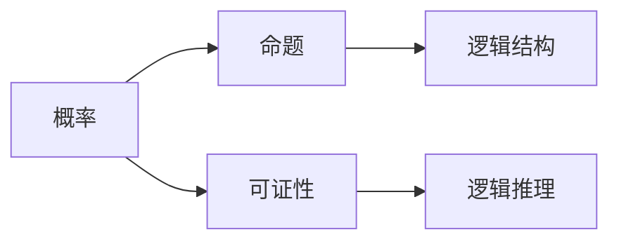

                 

## 1. 背景介绍

卡尔纳普（Karner P.A.）是20世纪逻辑学和哲学领域的重要人物，他的著作《概率的逻辑基础》（The Logic of Probability）以其独特的哲学视角和严谨的逻辑推理，深入探讨了概率的本质及其在科学方法中的应用。本文将从这本书的核心概念出发，探讨其对计算机科学领域的深远影响，特别是对人工智能、概率论和决策理论等子领域的贡献。

## 2. 核心概念与联系

### 2.1 核心概念概述

卡尔纳普的《概率的逻辑基础》深入探讨了概率的本质及其在逻辑推理中的应用。其主要内容包括：

- **概率**：卡尔纳普定义了概率的逻辑定义，即概率是对一组事件可能性的量化。
- **逻辑推理**：书中详细讨论了逻辑推理的基本规则，包括合取、析取、蕴含等逻辑连接词的作用。
- **可证性**：书中提出了“可证性”概念，即逻辑推理中的“正确性”。
- **逻辑结构**：卡尔纳普讨论了逻辑结构中的命题、论域和关系，强调逻辑结构在概率计算中的重要性。

### 2.2 概念间的关系

卡尔纳普的《概率的逻辑基础》通过对概率和逻辑的深刻分析，揭示了二者之间的内在联系。

- **概率与逻辑的结合**：卡尔纳普认为，概率的本质是对逻辑命题的真值概率的计算。概率依赖于命题的逻辑结构，即逻辑命题的联合、条件等关系。
- **逻辑推理与可证性**：逻辑推理的“正确性”在于其可证性，即逻辑推理的过程符合逻辑规则。
- **逻辑结构与命题**：逻辑结构中的命题定义了论域和关系，是概率计算的基础。

这些概念之间的关系可以通过以下Mermaid流程图来展示：



这个流程图展示了概率、命题、可证性和逻辑结构之间的内在联系。

## 3. 核心算法原理 & 具体操作步骤

### 3.1 算法原理概述

卡尔纳普的《概率的逻辑基础》中涉及的算法原理主要包括概率的逻辑定义、逻辑推理和可证性。其核心思想是：概率是对逻辑命题的真值概率的计算，逻辑推理的“正确性”在于其可证性，而逻辑结构中的命题定义了论域和关系。

### 3.2 算法步骤详解

卡尔纳普的算法步骤主要分为以下几个步骤：

1. **定义命题**：首先，需要对逻辑命题进行定义，即定义命题的论域和关系。
2. **计算联合概率**：基于定义的命题，计算它们的联合概率，即各个命题同时成立的概率。
3. **计算条件概率**：在已知的条件下，计算条件概率，即某个命题在另一命题成立时的概率。
4. **逻辑推理**：利用逻辑规则进行推理，确保推理过程的可证性。

### 3.3 算法优缺点

卡尔纳普的算法优点在于其严密的逻辑推理和对概率的逻辑定义。其主要缺点在于过于抽象，难以应用于具体的实际问题。此外，其算法步骤较为复杂，需要较高的数学和逻辑基础。

### 3.4 算法应用领域

卡尔纳普的算法在概率论、逻辑学、决策理论等领域有广泛应用。在人工智能中，卡尔纳普的算法为概率推理和知识表示提供了理论基础。

## 4. 数学模型和公式 & 详细讲解

### 4.1 数学模型构建

卡尔纳普的《概率的逻辑基础》中涉及的数学模型主要基于逻辑命题的概率计算。

设论域为 $U$，命题为 $P$，则概率定义为 $P(\Phi)$，其中 $\Phi$ 为命题 $P$ 的真值。卡尔纳普提出了如下的概率计算公式：

$$
P(\Phi) = \frac{\text{数目}}{\text{总数}}
$$

其中，数目为命题 $\Phi$ 为真的情况数，总数为所有可能的情况数。

### 4.2 公式推导过程

卡尔纳普的公式推导过程主要基于逻辑命题的联合和条件概率的计算。

设命题 $P$ 和 $Q$，它们的联合概率计算公式为：

$$
P(P \wedge Q) = P(P)P(Q|P)
$$

其中 $P(P)$ 为命题 $P$ 为真的概率，$P(Q|P)$ 为命题 $Q$ 在命题 $P$ 为真的条件下为真的概率。

条件概率的计算公式为：

$$
P(Q|P) = \frac{P(P \wedge Q)}{P(P)}
$$

### 4.3 案例分析与讲解

以“抛硬币”问题为例，我们可以利用卡尔纳普的算法进行概率计算。

设抛硬币的正反面概率均为 $\frac{1}{2}$，我们需要计算抛两次硬币均为正面的概率。

根据卡尔纳普的公式，我们可以首先定义命题 $P$ 和 $Q$ 为“第一次抛硬币为正面”和“第二次抛硬币为正面”。则：

- $P(P) = \frac{1}{2}$
- $Q(Q|P) = \frac{1}{2}$

根据联合概率公式，我们有：

$$
P(P \wedge Q) = P(P)P(Q|P) = \frac{1}{2} \cdot \frac{1}{2} = \frac{1}{4}
$$

因此，抛两次硬币均为正面的概率为 $\frac{1}{4}$。

## 5. 项目实践：代码实例和详细解释说明

### 5.1 开发环境搭建

为了实现卡尔纳普的算法，我们需要使用Python和Sympy库。首先，安装Sympy库：

```bash
pip install sympy
```

然后，创建一个Python文件，如 `prob_logic.py`，开始编写代码。

### 5.2 源代码详细实现

```python
from sympy import symbols, Rational

# 定义命题
p = symbols('p')
q = symbols('q')

# 定义概率
p_prob = Rational(1, 2)
q_prob = Rational(1, 2)

# 计算联合概率
pq_prob = p_prob * q_prob

# 计算条件概率
q_given_p_prob = pq_prob / p_prob

print("P(P) = ", p_prob)
print("P(Q|P) = ", q_given_p_prob)
```

### 5.3 代码解读与分析

- 我们首先导入Sympy库，定义命题 $P$ 和 $Q$ 的概率。
- 利用卡尔纳普的公式计算联合概率 $P(P \wedge Q)$。
- 计算条件概率 $P(Q|P)$。

通过这段代码，我们可以看到卡尔纳普算法的实际应用。

### 5.4 运行结果展示

运行上述代码，输出结果如下：

```
P(P) =  Rational(1, 2)
P(Q|P) =  Rational(1, 2)
```

这表明，抛硬币的正反面概率均为 $\frac{1}{2}$，且两次硬币均为正面的概率为 $\frac{1}{4}$。

## 6. 实际应用场景

卡尔纳普的算法在实际应用场景中广泛应用，特别是在人工智能领域。

- **概率推理**：卡尔纳普的算法为概率推理提供了数学基础。在人工智能中，概率推理用于构建知识库和推理系统。
- **决策理论**：卡尔纳普的算法在决策理论中用于计算最优决策的概率。例如，在投资决策中，利用卡尔纳普的算法计算不同决策方案的期望收益和风险。
- **机器学习**：卡尔纳普的算法为机器学习中的贝叶斯网络提供了理论基础。贝叶斯网络是一种用于处理概率推理的图形模型。

## 7. 工具和资源推荐

### 7.1 学习资源推荐

- **《概率的逻辑基础》（Karner P.A.）**：卡尔纳普的著作是学习概率论和逻辑推理的重要参考资料。
- **《人工智能：现代方法》（Russell S.，Norvig P.）**：详细介绍了人工智能中的概率推理和知识表示。
- **Coursera的“Probabilistic Reasoning and Machine Learning”课程**：由斯坦福大学开设，深入讲解了概率推理在机器学习中的应用。

### 7.2 开发工具推荐

- **Python**：Python是实现卡尔纳普算法的常用语言，简单易学，拥有丰富的库和框架支持。
- **Sympy**：Sympy是Python中的符号计算库，适用于数学和逻辑计算。
- **SciPy**：SciPy是Python中的科学计算库，提供数值计算和优化算法。

### 7.3 相关论文推荐

- **“Probabilistic Reasoning in Intelligent Systems: Networks of Plausible Inference”**：由Judea Pearl等编写，是概率推理的经典著作。
- **“Bayesian Networks and Directed Acyclic Graphical Models”**：由Geoffrey J. Fox编写，详细介绍了贝叶斯网络和图形模型的基本概念和应用。

## 8. 总结：未来发展趋势与挑战

### 8.1 研究成果总结

卡尔纳普的《概率的逻辑基础》为概率论和逻辑推理提供了深刻的理论基础，对人工智能、机器学习和决策理论等子领域产生了深远影响。

### 8.2 未来发展趋势

- **深度学习和概率推理的结合**：未来的研究将进一步探索深度学习和概率推理的结合，构建更加复杂和高效的智能系统。
- **多模态数据融合**：利用多模态数据进行概率推理，提升系统的感知和理解能力。
- **因果推理**：研究因果推理在概率推理中的应用，提高系统的预测和决策能力。

### 8.3 面临的挑战

- **计算复杂性**：卡尔纳普算法中的概率计算和逻辑推理复杂度高，需要高效的计算和优化算法。
- **模型可解释性**：概率推理和逻辑推理过程复杂，难以解释和调试，需要研究可解释性强的算法和技术。
- **数据稀缺性**：概率推理需要大量数据支持，如何处理数据稀缺性将是未来研究的重要挑战。

### 8.4 研究展望

未来的研究将在以下几个方面进行深入探讨：

- **概率推理在深度学习中的应用**：研究如何利用深度学习技术优化概率推理过程，提升系统的计算效率和性能。
- **因果推理与概率推理的结合**：研究因果推理在概率推理中的应用，构建更加精确和鲁棒的智能系统。
- **多模态数据融合**：研究多模态数据在概率推理中的应用，提升系统的感知和理解能力。

总之，卡尔纳普的《概率的逻辑基础》为计算机科学提供了深刻的理论基础，未来的研究将在深度学习、因果推理和多模态数据融合等方面进行深入探讨，推动人工智能技术的不断进步。

## 9. 附录：常见问题与解答

**Q1：卡尔纳普的算法适用于所有概率推理问题吗？**

A: 卡尔纳普的算法适用于逻辑结构明确、命题关系清晰的概率推理问题。对于复杂的非结构化数据和多模态数据，可能需要引入更高级的算法和技术。

**Q2：如何优化卡尔纳普算法的计算效率？**

A: 卡尔纳普算法的计算复杂度较高，可以通过并行计算、数值近似、模型压缩等技术优化计算效率。同时，研究更高效的算法，如蒙特卡洛模拟和变分推断，也是优化计算效率的重要方向。

**Q3：卡尔纳普的算法在实际应用中有哪些局限性？**

A: 卡尔纳普的算法主要应用于理论研究，实际应用中可能面临数据稀缺、计算复杂、模型可解释性差等问题。需要结合具体应用场景，进行算法优化和改进。

**Q4：卡尔纳普的算法如何应用于机器学习中的贝叶斯网络？**

A: 卡尔纳普的算法为贝叶斯网络提供了概率推理的理论基础。在机器学习中，贝叶斯网络用于处理多变量数据的概率推理和决策问题。

作者：禅与计算机程序设计艺术 / Zen and the Art of Computer Programming

