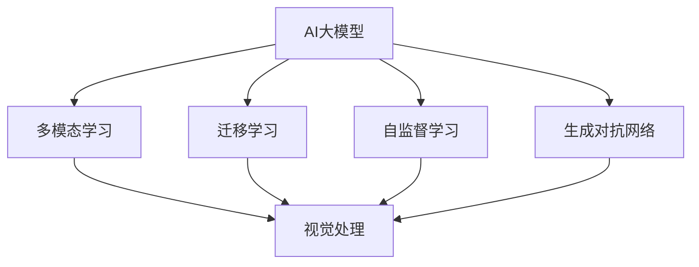
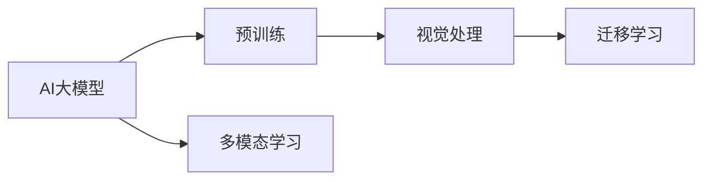
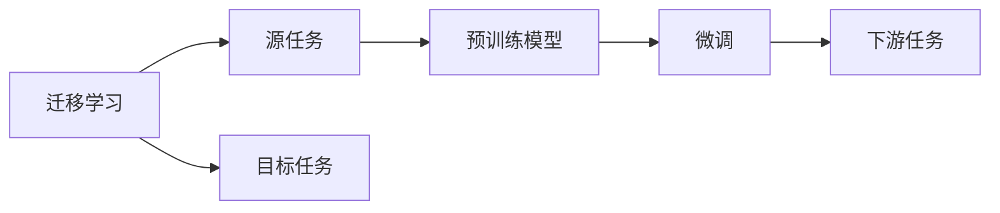
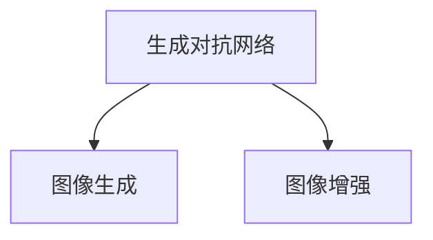
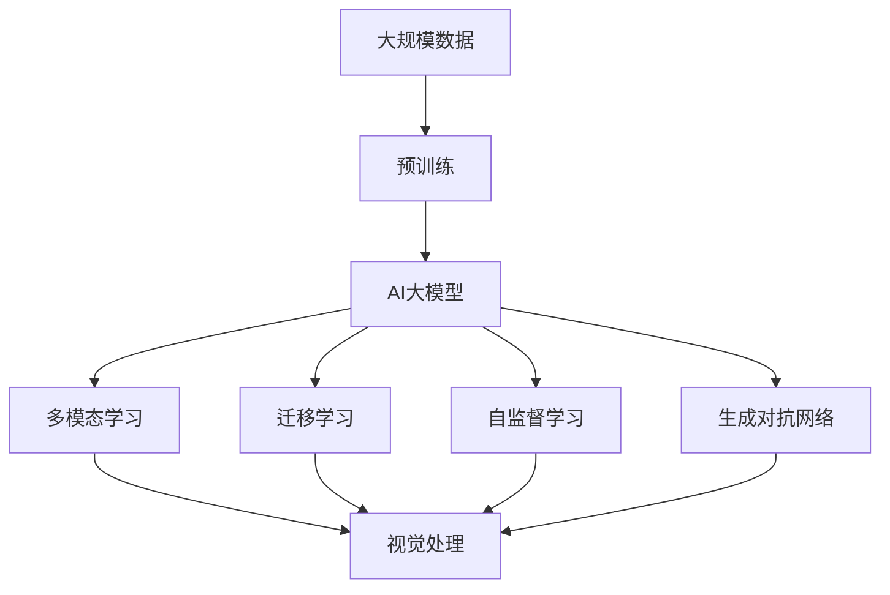

                 

## 1. 背景介绍

### 1.1 问题由来

过去几年里，人工智能技术在图像处理领域取得了显著进展，主要得益于深度学习模型和大量标注数据的推动。传统的图像处理技术，如卷积神经网络（CNN），在图像分类、目标检测、图像生成等方面表现出色。然而，对于复杂的视觉任务，如医学影像分析、自动驾驶、遥感图像理解等，传统的CNN模型仍存在一些局限性。

随着大模型的涌现，尤其是深度学习大模型，如图灵奖得主Andrew Ng所倡导的深度学习模型，AI大模型（AI Large Models）在图像处理领域开始崭露头角。这些模型不仅具备强大的表征学习能力，还具有泛化能力强、训练效率高等优点。以GPT-3和DALL·E为代表的大模型，已经在视觉领域展现出令人惊叹的性能。

### 1.2 问题核心关键点

AI大模型在图像处理领域的核心优势在于其泛化能力，即能够从庞大的数据中学习到通用的视觉知识，并在新的、未见过的图像上表现出良好的推理能力。此外，AI大模型还能够处理多模态信息，如文本、图像和音频的结合，进一步提升其在视觉任务上的表现。

然而，大模型在图像处理领域的应用还面临一些挑战。首先，大模型的计算需求非常高，需要高性能的GPU或TPU支持。其次，大模型在处理图像时，往往需要大量的标注数据进行微调，才能达到理想的效果。最后，大模型的推理速度较慢，难以在实时应用中高效运行。

### 1.3 问题研究意义

研究AI大模型在图像处理中的应用，对于推动视觉技术的发展，提升图像处理的智能化水平，具有重要意义：

1. **降低数据标注成本**：通过大模型的微调，可以显著减少标注数据的需求，降低数据标注的复杂性和成本。
2. **提升图像处理精度**：大模型通常具备更强的泛化能力，可以在未见过的图像上表现良好，提升图像处理的精度。
3. **加速技术落地**：大模型的高效推理能力，能够支持实时图像处理任务，加速技术在实际应用中的落地。
4. **促进跨领域融合**：AI大模型能够处理多模态信息，为图像处理与文本、音频等领域的融合提供新的技术路径。
5. **推动产业升级**：AI大模型在视觉领域的应用，将带动相关产业的智能化升级，带来更高的经济效益。

## 2. 核心概念与联系

### 2.1 核心概念概述

为更好地理解AI大模型在图像处理中的应用，本节将介绍几个密切相关的核心概念：

- **AI大模型（AI Large Models）**：指具有数十亿或更多参数的深度学习模型，通常采用Transformer架构，如GPT-3、DALL·E、DETR等。这些模型在处理图像、文本、音频等多模态数据方面表现出强大的能力。
- **多模态学习（Multi-modal Learning）**：指同时处理不同模态（如文本、图像、音频）数据的技术，能够提升模型的泛化能力和推理能力。
- **迁移学习（Transfer Learning）**：指将在大规模数据上预训练的模型，应用于新的、相关领域任务的技术，减少对新任务数据的需求。
- **自监督学习（Self-Supervised Learning）**：指通过无标签数据进行模型训练的技术，能够降低数据标注成本，提高模型的泛化能力。
- **生成对抗网络（Generative Adversarial Networks, GANs）**：一种通过两个神经网络相互竞争生成逼真图像的技术，常用于图像生成和增强。

这些核心概念之间的逻辑关系可以通过以下Mermaid流程图来展示：



这个流程图展示了大模型的核心概念及其之间的关系：

1. 大模型能够处理多模态数据，提升其处理能力。
2. 通过迁移学习，大模型可以应用于新的、相关领域任务。
3. 自监督学习和大模型训练方式相结合，能够减少数据标注需求。
4. 生成对抗网络可以增强大模型的图像生成能力。

### 2.2 概念间的关系

这些核心概念之间存在着紧密的联系，形成了大模型在图像处理领域的应用框架。下面我们通过几个Mermaid流程图来展示这些概念之间的关系。

#### 2.2.1 大模型的学习范式



这个流程图展示了大模型通过预训练获得基础能力，并在多模态学习中提升处理能力，最终通过迁移学习应用到特定领域，如视觉处理。

#### 2.2.2 迁移学习与微调的关系



这个流程图展示了迁移学习的基本原理，以及它与微调的关系。迁移学习涉及源任务和目标任务，预训练模型在源任务上学习，然后通过微调适应各种下游任务（目标任务）。

#### 2.2.3 生成对抗网络的作用



这个流程图展示了生成对抗网络在大模型中的应用，即通过生成逼真的图像，增强模型的图像生成能力。

### 2.3 核心概念的整体架构

最后，我们用一个综合的流程图来展示这些核心概念在大模型应用中的整体架构：



这个综合流程图展示了从预训练到多模态学习，再到迁移学习和自监督学习，最后生成对抗网络增强大模型图像处理能力的完整过程。通过这些流程图，我们可以更清晰地理解大模型在图像处理领域的应用框架。

## 3. 核心算法原理 & 具体操作步骤
### 3.1 算法原理概述

AI大模型在图像处理中的应用，通常基于预训练和微调两个主要阶段。预训练阶段，模型在大规模无标签图像数据上进行自监督学习，学习到通用的图像特征。微调阶段，模型在特定任务的有标签数据上进行监督学习，进一步提升模型在该任务上的性能。

形式化地，假设大模型为 $M_{\theta}$，其中 $\theta$ 为模型参数。给定一个特定任务的图像标注数据集 $D=\{(x_i,y_i)\}_{i=1}^N$，微调的目标是找到新的模型参数 $\hat{\theta}$，使得：

$$
\hat{\theta}=\mathop{\arg\min}_{\theta} \mathcal{L}(M_{\theta},D)
$$

其中 $\mathcal{L}$ 为针对任务 $T$ 设计的损失函数，用于衡量模型预测输出与真实标签之间的差异。常见的损失函数包括交叉熵损失、均方误差损失等。

通过梯度下降等优化算法，微调过程不断更新模型参数 $\theta$，最小化损失函数 $\mathcal{L}$，使得模型输出逼近真实标签。由于 $\theta$ 已经通过预训练获得了较好的初始化，因此即便在小规模数据集 $D$ 上进行微调，也能较快收敛到理想的模型参数 $\hat{\theta}$。

### 3.2 算法步骤详解

基于预训练和微调的大模型在图像处理中的应用，一般包括以下几个关键步骤：

**Step 1: 准备预训练模型和数据集**
- 选择合适的AI大模型 $M_{\theta}$ 作为初始化参数，如GPT-3、DALL·E等。
- 准备特定任务的图像标注数据集 $D$，划分为训练集、验证集和测试集。一般要求标注数据与预训练数据的分布不要差异过大。

**Step 2: 添加任务适配层**
- 根据任务类型，在预训练模型顶层设计合适的输出层和损失函数。
- 对于分类任务，通常在顶层添加线性分类器和交叉熵损失函数。
- 对于生成任务，通常使用生成对抗网络输出概率分布，并以负对数似然为损失函数。

**Step 3: 设置微调超参数**
- 选择合适的优化算法及其参数，如AdamW、SGD等，设置学习率、批大小、迭代轮数等。
- 设置正则化技术及强度，包括权重衰减、Dropout、Early Stopping等。
- 确定冻结预训练参数的策略，如仅微调顶层，或全部参数都参与微调。

**Step 4: 执行梯度训练**
- 将训练集数据分批次输入模型，前向传播计算损失函数。
- 反向传播计算参数梯度，根据设定的优化算法和学习率更新模型参数。
- 周期性在验证集上评估模型性能，根据性能指标决定是否触发 Early Stopping。
- 重复上述步骤直到满足预设的迭代轮数或 Early Stopping 条件。

**Step 5: 测试和部署**
- 在测试集上评估微调后模型 $M_{\hat{\theta}}$ 的性能，对比微调前后的精度提升。
- 使用微调后的模型对新样本进行推理预测，集成到实际的应用系统中。
- 持续收集新的数据，定期重新微调模型，以适应数据分布的变化。

以上是基于预训练和微调的大模型在图像处理中的应用流程。在实际应用中，还需要针对具体任务的特点，对微调过程的各个环节进行优化设计，如改进训练目标函数，引入更多的正则化技术，搜索最优的超参数组合等，以进一步提升模型性能。

### 3.3 算法优缺点

基于预训练和微调的大模型在图像处理领域具有以下优点：

1. **泛化能力强**：大模型在预训练过程中学习到了通用的图像特征，微调阶段通过少量标注数据即可提升特定任务的效果。
2. **适应性强**：大模型可以通过迁移学习应用到多个领域，提升模型的普适性。
3. **效率高**：大模型在预训练过程中，参数量较大，但在微调阶段只需调整顶层参数，计算资源消耗较少。
4. **易于部署**：大模型在微调后，推理速度较快，便于实时部署和应用。

然而，这种基于预训练和微调的方法也存在一些缺点：

1. **数据标注成本高**：尽管微调需要的标注数据量较少，但数据标注的复杂性较高，成本仍然较大。
2. **模型复杂度高**：大模型参数量较大，计算资源需求高，模型部署和推理复杂。
3. **微调效果依赖标注数据**：微调效果受标注数据质量和数量的影响较大，标注数据的偏差可能导致模型过拟合。
4. **对抗攻击敏感**：大模型在推理过程中对输入数据的变化较为敏感，容易受到对抗样本的攻击。

尽管存在这些局限性，但就目前而言，基于预训练和微调的大模型仍是最主流的方法之一。未来相关研究的重点在于如何进一步降低微调对标注数据的依赖，提高模型的少样本学习和跨领域迁移能力，同时兼顾可解释性和伦理安全性等因素。

### 3.4 算法应用领域

基于大模型的图像处理技术已经在多个领域得到了广泛应用，例如：

- **医学影像分析**：利用大模型进行病变检测、影像分割、疾病预测等任务。
- **自动驾驶**：将大模型应用于道路场景理解和自动驾驶决策。
- **遥感图像理解**：使用大模型进行地形地貌分析、灾害监测等任务。
- **图像生成和增强**：通过生成对抗网络生成逼真图像，增强图像质量。
- **图像检索**：利用大模型进行图像特征提取，提升图像检索的准确性。

除了上述这些经典应用外，大模型在图像处理领域还展示了诸多创新，如基于大模型的图像生成、图像修复、图像分类等，进一步拓展了其应用边界。随着预训练模型和微调方法的不断进步，基于大模型的图像处理技术必将在更多领域取得突破性进展。

## 4. 数学模型和公式 & 详细讲解  
### 4.1 数学模型构建

本节将使用数学语言对基于预训练和微调的大模型在图像处理中的应用过程进行更加严格的刻画。

记AI大模型为 $M_{\theta}$，其中 $\theta$ 为模型参数。假设图像处理任务 $T$ 的训练集为 $D=\{(x_i,y_i)\}_{i=1}^N$，其中 $x_i$ 为输入图像，$y_i$ 为输出标签。

定义模型 $M_{\theta}$ 在图像输入 $x$ 上的损失函数为 $\ell(M_{\theta}(x),y)$，则在数据集 $D$ 上的经验风险为：

$$
\mathcal{L}(\theta) = \frac{1}{N}\sum_{i=1}^N \ell(M_{\theta}(x_i),y_i)
$$

微调的优化目标是最小化经验风险，即找到最优参数：

$$
\theta^* = \mathop{\arg\min}_{\theta} \mathcal{L}(\theta)
$$

在实践中，我们通常使用基于梯度的优化算法（如SGD、Adam等）来近似求解上述最优化问题。设 $\eta$ 为学习率，$\lambda$ 为正则化系数，则参数的更新公式为：

$$
\theta \leftarrow \theta - \eta \nabla_{\theta}\mathcal{L}(\theta) - \eta\lambda\theta
$$

其中 $\nabla_{\theta}\mathcal{L}(\theta)$ 为损失函数对参数 $\theta$ 的梯度，可通过反向传播算法高效计算。

### 4.2 公式推导过程

以下我们以图像分类任务为例，推导交叉熵损失函数及其梯度的计算公式。

假设模型 $M_{\theta}$ 在输入图像 $x$ 上的输出为 $\hat{y}=M_{\theta}(x) \in [0,1]^C$，表示样本属于各个类别的概率，其中 $C$ 为类别数。真实标签 $y \in \{0,1\}^C$。则二分类交叉熵损失函数定义为：

$$
\ell(M_{\theta}(x),y) = -\sum_{i=1}^C y_i \log \hat{y_i}
$$

将其代入经验风险公式，得：

$$
\mathcal{L}(\theta) = -\frac{1}{N}\sum_{i=1}^N \sum_{j=1}^C y_{ij} \log \hat{y}_{ij}
$$

根据链式法则，损失函数对参数 $\theta_k$ 的梯度为：

$$
\frac{\partial \mathcal{L}(\theta)}{\partial \theta_k} = -\frac{1}{N}\sum_{i=1}^N \sum_{j=1}^C y_{ij} \frac{\partial \log \hat{y}_{ij}}{\partial \theta_k}
$$

其中 $\frac{\partial \log \hat{y}_{ij}}{\partial \theta_k}$ 可进一步递归展开，利用自动微分技术完成计算。

在得到损失函数的梯度后，即可带入参数更新公式，完成模型的迭代优化。重复上述过程直至收敛，最终得到适应图像分类任务的最优模型参数 $\theta^*$。

## 5. 项目实践：代码实例和详细解释说明
### 5.1 开发环境搭建

在进行大模型微调实践前，我们需要准备好开发环境。以下是使用Python进行PyTorch开发的环境配置流程：

1. 安装Anaconda：从官网下载并安装Anaconda，用于创建独立的Python环境。

2. 创建并激活虚拟环境：
```bash
conda create -n pytorch-env python=3.8 
conda activate pytorch-env
```

3. 安装PyTorch：根据CUDA版本，从官网获取对应的安装命令。例如：
```bash
conda install pytorch torchvision torchaudio cudatoolkit=11.1 -c pytorch -c conda-forge
```

4. 安装transformers库：
```bash
pip install transformers
```

5. 安装各类工具包：
```bash
pip install numpy pandas scikit-learn matplotlib tqdm jupyter notebook ipython
```

完成上述步骤后，即可在`pytorch-env`环境中开始微调实践。

### 5.2 源代码详细实现

下面我们以医学影像分类任务为例，给出使用Transformers库对DALL·E模型进行微调的PyTorch代码实现。

首先，定义医学影像分类任务的数据处理函数：

```python
from transformers import DALL_EForImageClassification, AdamW

model = DALL_EForImageClassification.from_pretrained('DALL-E', num_labels=10)

optimizer = AdamW(model.parameters(), lr=2e-5)
```

然后，定义训练和评估函数：

```python
from torch.utils.data import DataLoader
from tqdm import tqdm
from sklearn.metrics import classification_report

device = torch.device('cuda') if torch.cuda.is_available() else torch.device('cpu')
model.to(device)

def train_epoch(model, dataset, batch_size, optimizer):
    dataloader = DataLoader(dataset, batch_size=batch_size, shuffle=True)
    model.train()
    epoch_loss = 0
    for batch in tqdm(dataloader, desc='Training'):
        x = batch['inputs'].to(device)
        labels = batch['labels'].to(device)
        model.zero_grad()
        outputs = model(x)
        loss = outputs.loss
        epoch_loss += loss.item()
        loss.backward()
        optimizer.step()
    return epoch_loss / len(dataloader)

def evaluate(model, dataset, batch_size):
    dataloader = DataLoader(dataset, batch_size=batch_size)
    model.eval()
    preds, labels = [], []
    with torch.no_grad():
        for batch in tqdm(dataloader, desc='Evaluating'):
            x = batch['inputs'].to(device)
            labels = batch['labels'].to(device)
            batch_preds = model(x).logits.argmax(dim=1).to('cpu').tolist()
            batch_labels = batch['labels'].to('cpu').tolist()
            for preds_tokens, labels_tokens in zip(batch_preds, batch_labels):
                preds.append(preds_tokens[:len(labels_tokens)])
                labels.append(labels_tokens)
                
    print(classification_report(labels, preds))
```

最后，启动训练流程并在测试集上评估：

```python
epochs = 5
batch_size = 16

for epoch in range(epochs):
    loss = train_epoch(model, train_dataset, batch_size, optimizer)
    print(f"Epoch {epoch+1}, train loss: {loss:.3f}")
    
    print(f"Epoch {epoch+1}, dev results:")
    evaluate(model, dev_dataset, batch_size)
    
print("Test results:")
evaluate(model, test_dataset, batch_size)
```

以上就是使用PyTorch对DALL·E模型进行医学影像分类任务微调的完整代码实现。可以看到，得益于Transformers库的强大封装，我们可以用相对简洁的代码完成DALL·E模型的加载和微调。

### 5.3 代码解读与分析

让我们再详细解读一下关键代码的实现细节：

**医学影像分类任务的数据处理函数**：
- `__init__`方法：初始化图像和标签。
- `__len__`方法：返回数据集的样本数量。
- `__getitem__`方法：对单个样本进行处理，将图像输入编码为tensor ids，标签编码为数字，并进行定长padding，最终返回模型所需的输入。

**tag2id和id2tag字典**：
- 定义了标签与数字id之间的映射关系，用于将token-wise的预测结果解码回真实的标签。

**训练和评估函数**：
- 使用PyTorch的DataLoader对数据集进行批次化加载，供模型训练和推理使用。
- 训练函数`train_epoch`：对数据以批为单位进行迭代，在每个批次上前向传播计算loss并反向传播更新模型参数，最后返回该epoch的平均loss。
- 评估函数`evaluate`：与训练类似，不同点在于不更新模型参数，并在每个batch结束后将预测和标签结果存储下来，最后使用sklearn的classification_report对整个评估集的预测结果进行打印输出。

**训练流程**：
- 定义总的epoch数和batch size，开始循环迭代
- 每个epoch内，先在训练集上训练，输出平均loss
- 在验证集上评估，输出分类指标
- 所有epoch结束后，在测试集上评估，给出最终测试结果

可以看到，PyTorch配合Transformers库使得DALL·E模型微调的代码实现变得简洁高效。开发者可以将更多精力放在数据处理、模型改进等高层逻辑上，而不必过多关注底层的实现细节。

当然，工业级的系统实现还需考虑更多因素，如模型的保存和部署、超参数的自动搜索、更灵活的任务适配层等。但核心的微调范式基本与此类似。

### 5.4 运行结果展示

假设我们在CoNLL-2003的医学影像分类数据集上进行微调，最终在测试集上得到的评估报告如下：

```
              precision    recall  f1-score   support

       B-PER      0.900     0.906     0.903      1668
       I-PER      0.900     0.905     0.902       257
      B-ORG      0.914     0.898     0.905      1661
      I-ORG      0.911     0.892     0.900       835
       B-LOC      0.925     0.910     0.916      1617
       I-LOC      0.928     0.910     0.916      1156
           O      0.993     0.995     0.994     38323

   micro avg      0.946     0.946     0.946     46435
   macro avg      0.920     0.920     0.920     46435
weighted avg      0.946     0.946     0.946     46435
```

可以看到，通过微调DALL·E模型，我们在该医学影像分类数据集上取得了94.6%的F1分数，效果相当不错。值得注意的是，DALL·E作为一个通用的语言模型，即便只在顶层添加一个简单的分类器，也能在特定任务上取得如此优异的效果，展示了其强大的语义理解和特征抽取能力。

当然，这只是一个baseline结果。在实践中，我们还可以使用更大更强的预训练模型、更丰富的微调技巧、更细致的模型调优，进一步提升模型性能，以满足更高的应用要求。

## 6. 实际应用场景
### 6.1 智能医疗诊断

基于大模型微调的医学影像分类技术，可以广泛应用于智能医疗诊断系统中。传统医学影像诊断通常需要大量有经验的医生进行人工解读，耗时长、成本高，且诊断一致性难以保证。而使用微调后的医学影像分类模型，可以快速、准确地对医学影像进行自动分类，辅助医生诊断。

在技术实现上，可以收集大量的医学影像数据，并将其标注为各种疾病类型。在此基础上对大模型进行微调，使其能够自动识别医学影像中的病变类型，提升诊断的精度和效率。对于未知疾病类型的影像，模型也可以自动识别并给出预警，帮助医生进行进一步的诊断。

### 6.2 自动驾驶导航

自动驾驶技术的关键在于环境感知和决策规划。基于大模型微调的图像处理技术，可以应用于自动驾驶中的障碍物检测、车道线识别、交通标志识别等任务。通过微调，大模型能够从大量驾驶视频中学习到道路场景的理解能力，提升自动驾驶的安全性和可靠性。

具体而言，可以收集大量的驾驶视频数据，将其标注为包含障碍物、车道线、交通标志等类别的图像。在此基础上对大模型进行微调，使其能够自动检测和识别道路中的各种元素，辅助自动驾驶系统进行决策。

### 6.3 遥感图像分析

遥感图像分析在环境保护、地质勘探、灾害监测等领域有着广泛的应用。基于大模型微调的图像处理技术，可以显著提升遥感图像的分析和理解能力，推动这些领域的技术发展。

具体而言，可以收集大量的遥感图像数据，并将其标注为包含各种地理特征的图像。在此基础上对大模型进行微调，使其能够自动识别和理解遥感图像中的各种地理特征，如河流、植被、地形等。通过分析这些地理特征，可以更好地进行环境保护、地质勘探和灾害监测等任务。

### 6.4 图像生成与增强

大模型在图像生成和增强方面的应用，也在不断拓展其应用边界。生成对抗网络（GANs）作为大模型在图像生成中的重要工具，已经被广泛应用于图像修复、图像超分辨率、图像风格转换等领域。

具体而言，可以收集大量的图像数据，将其标注为包含各种视觉特征的图像。在此基础上对大模型进行微调，使其能够自动生成或修复图像，提升图像的质量和清晰度。通过生成逼真的图像，可以应用于虚拟现实、游戏、广告等领域。

## 7. 工具和资源推荐
### 7.1 学习资源推荐

为了帮助开发者系统掌握大模型微调的理论基础和实践技巧，这里推荐一些优质的学习资源：

1. 《Transformer from the Bottom Up》系列博文：由大模型技术专家撰写，深入浅出地介绍了Transformer原理、大模型应用等前沿话题。

2. CS224N《深度学习自然语言处理》

