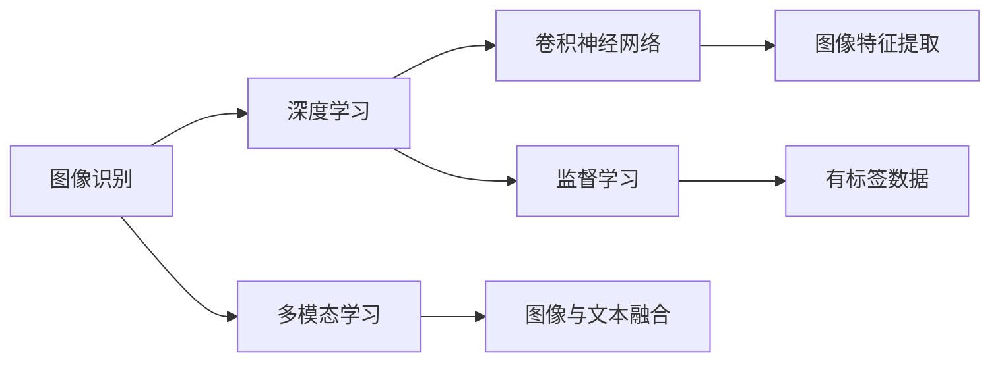
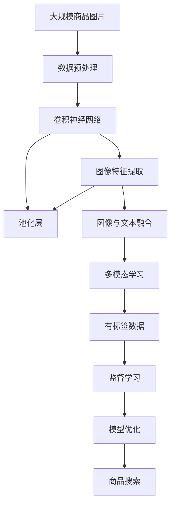

                 

# 图像搜索技术：AI识别商品

> 关键词：图像识别,商品识别,深度学习,计算机视觉,神经网络,监督学习,多模态学习

## 1. 背景介绍

### 1.1 问题由来

随着互联网和电商的发展，用户在浏览商品时往往需要筛选和搜索，以找到最符合自己需求的物品。传统基于文本的搜索引擎已经无法满足这一需求。图像搜索技术则通过对商品图片进行识别，快速定位商品并推荐，为用户提供了更直观、便捷的购物体验。

AI技术，特别是深度学习，为图像搜索的发展提供了强大的推动力。深度学习通过多层神经网络模型学习图像特征，能够高效识别和分类图像。在电商领域，商品识别技术通过分析商品图片，可以提供商品名称、价格、品牌等详细信息，为电商搜索提供精准的搜索结果。

### 1.2 问题核心关键点

AI商品识别技术基于深度学习框架，特别是卷积神经网络(CNN)和多模态学习。该技术的核心在于：

- **图像特征提取**：通过卷积层提取图像的局部特征，然后通过池化层进行降维，最终形成图像的高级特征表示。
- **多模态融合**：将图像特征与文本描述、价格等数据进行融合，提升模型的鲁棒性和准确性。
- **监督学习**：在大量标注数据上进行训练，使模型能够准确识别商品。

### 1.3 问题研究意义

商品识别技术的普及，显著提升了电商搜索的效率和准确性，提升了用户购物体验。技术研究不仅有助于电商搜索领域，还能应用到智能家居、医疗影像、自动驾驶等多个领域。商品识别技术的发展，将推动AI技术在实际应用中的落地，带来更广泛的产业变革。

## 2. 核心概念与联系

### 2.1 核心概念概述

为更好地理解商品识别技术的原理和应用，本节将介绍几个核心概念：

- **图像识别**：通过AI技术对图像进行特征提取和分类，识别出图像中的对象和内容。
- **深度学习**：一种基于神经网络的机器学习方法，通过多层结构学习数据表示。
- **卷积神经网络(CNN)**：一种特殊的神经网络，通过卷积层和池化层提取图像特征，广泛应用于图像识别领域。
- **多模态学习**：将不同类型的数据进行融合，提升模型的性能和泛化能力。
- **监督学习**：在有标签数据上进行训练，使模型能够准确预测新数据的标签。

这些概念之间存在紧密的联系，通过合理的组合和应用，可以实现高效的图像搜索和商品识别。

### 2.2 概念间的关系

这些核心概念之间的关系可以通过以下Mermaid流程图来展示：



这个流程图展示了核心概念之间的关系：

1. 图像识别通过深度学习实现，其中卷积神经网络是关键技术。
2. 图像特征提取是图像识别的核心，卷积神经网络是其主要实现手段。
3. 多模态学习将图像特征与其他数据类型融合，提升模型的泛化能力。
4. 监督学习在有标签数据上训练模型，使其能够准确预测新数据。

这些概念共同构成了商品识别技术的核心框架，为其高效实现提供了基础。

### 2.3 核心概念的整体架构

最后，我们用一个综合的流程图来展示这些核心概念在大规模商品识别任务中的整体架构：



这个综合流程图展示了从原始商品图片到商品搜索的完整流程。数据预处理、卷积神经网络、图像特征提取、多模态学习、监督学习等步骤依次进行，最终实现商品搜索功能的优化。

## 3. 核心算法原理 & 具体操作步骤
### 3.1 算法原理概述

商品识别技术基于深度学习框架，特别是卷积神经网络(CNN)和多模态学习。其核心原理是：

- **图像特征提取**：通过卷积层提取图像的局部特征，然后通过池化层进行降维，最终形成图像的高级特征表示。
- **多模态融合**：将图像特征与文本描述、价格等数据进行融合，提升模型的鲁棒性和准确性。
- **监督学习**：在大量标注数据上进行训练，使模型能够准确识别商品。

形式化地，设输入为商品图片 $X$，输出为商品类别 $Y$，模型为 $M_{\theta}$，其中 $\theta$ 为模型参数。训练目标为：

$$
\theta^* = \mathop{\arg\min}_{\theta} \mathcal{L}(M_{\theta}, D)
$$

其中 $\mathcal{L}$ 为损失函数，用于衡量模型预测结果与真实标签的差异。

### 3.2 算法步骤详解

基于深度学习框架的商品识别技术主要包括以下几个步骤：

**Step 1: 数据预处理**

- 收集商品图片及其对应的标注信息，如商品名称、价格、品牌等。
- 对图片进行归一化、裁剪、缩放等预处理，使其大小一致，便于网络输入。
- 将文本信息转换为数字编码，用于融合到图像特征中。

**Step 2: 构建神经网络模型**

- 设计卷积神经网络结构，包括卷积层、池化层、全连接层等。
- 使用交叉熵损失函数作为模型训练的目标函数。
- 选择合适的优化器，如Adam、SGD等。

**Step 3: 训练模型**

- 在标注数据集上训练模型，使用训练数据的前向传播和反向传播计算梯度。
- 根据优化器更新模型参数。
- 周期性在验证集上评估模型性能，防止过拟合。
- 重复上述步骤直至收敛。

**Step 4: 商品搜索**

- 用户上传商品图片，通过模型识别商品类别。
- 检索商品数据库，返回最匹配的商品信息。
- 提供商品价格、品牌、描述等信息，供用户参考。

### 3.3 算法优缺点

基于深度学习的商品识别技术具有以下优点：

- **高精度**：卷积神经网络能够高效提取图像特征，在商品识别领域已取得多项SOTA结果。
- **泛化能力强**：多模态学习将图像与文本信息融合，提升模型的鲁棒性和泛化能力。
- **训练快速**：深度学习模型在GPU等高性能硬件上训练效率高，适合大规模数据集。

但该技术也存在一些缺点：

- **数据依赖性强**：模型需要大量高质量标注数据进行训练，数据获取成本高。
- **过拟合风险大**：大模型容易过拟合，特别是训练数据不足时。
- **计算资源需求高**：深度学习模型需要大量GPU内存和计算能力，硬件成本较高。
- **可解释性不足**：模型输出缺乏解释，难以调试和优化。

尽管存在这些局限性，基于深度学习的商品识别技术仍是目前电商搜索领域的主流范式，具有较高的实用价值。

### 3.4 算法应用领域

商品识别技术已在电商搜索、智能家居、医疗影像等多个领域得到广泛应用，具体如下：

- **电商搜索**：通过识别商品图片，提供商品名称、价格、品牌等信息，提升搜索效率和准确性。
- **智能家居**：识别家居图片，获取家具、家电等物品信息，实现智能推荐和控制。
- **医疗影像**：识别医学影像，提取疾病特征，辅助医生进行诊断和治疗。
- **自动驾驶**：识别道路标志、车辆、行人等对象，实现自动驾驶系统的安全导航。

## 4. 数学模型和公式 & 详细讲解 & 举例说明

### 4.1 数学模型构建

商品识别技术的数学模型主要包括以下几个部分：

- **输入**：商品图片 $X$ 和其标注信息 $Y$。
- **模型**：卷积神经网络 $M_{\theta}$，其中 $\theta$ 为模型参数。
- **损失函数**：交叉熵损失 $\mathcal{L}$。
- **优化器**：如Adam、SGD等。

### 4.2 公式推导过程

假设商品识别模型为卷积神经网络 $M_{\theta}$，输入为图片 $X$，输出为类别 $Y$。则模型的前向传播过程为：

$$
\hat{Y} = M_{\theta}(X)
$$

其中 $\hat{Y}$ 为模型预测的类别分布。损失函数 $\mathcal{L}$ 为交叉熵损失：

$$
\mathcal{L} = -\frac{1}{N}\sum_{i=1}^N \sum_{k=1}^K y_k \log \hat{y}_k
$$

其中 $N$ 为样本数，$K$ 为类别数，$y_k$ 为真实标签，$\hat{y}_k$ 为模型预测概率。使用梯度下降等优化算法，求解最小化损失函数：

$$
\theta \leftarrow \theta - \eta \nabla_{\theta}\mathcal{L}(\theta)
$$

其中 $\eta$ 为学习率。

### 4.3 案例分析与讲解

以一个简单的商品识别模型为例，进行详细分析：

```python
import torch
import torch.nn as nn
import torchvision.transforms as transforms
import torchvision.models as models

# 定义模型结构
class Net(nn.Module):
    def __init__(self):
        super(Net, self).__init__()
        self.conv1 = nn.Conv2d(3, 6, 5)
        self.pool = nn.MaxPool2d(2, 2)
        self.conv2 = nn.Conv2d(6, 16, 5)
        self.fc1 = nn.Linear(16 * 5 * 5, 120)
        self.fc2 = nn.Linear(120, 84)
        self.fc3 = nn.Linear(84, 10)

    def forward(self, x):
        x = self.pool(F.relu(self.conv1(x)))
        x = self.pool(F.relu(self.conv2(x)))
        x = x.view(-1, 16 * 5 * 5)
        x = F.relu(self.fc1(x))
        x = F.relu(self.fc2(x))
        x = self.fc3(x)
        return x

# 定义数据预处理
transform = transforms.Compose([
    transforms.ToTensor(),
    transforms.Normalize((0.5, 0.5, 0.5), (0.5, 0.5, 0.5))
])

# 加载数据集
train_data = datasets.CIFAR10(root='./data', train=True, download=True, transform=transform)
test_data = datasets.CIFAR10(root='./data', train=False, download=True, transform=transform)
```

在此模型中，我们使用了一个简单的卷积神经网络结构，包括两个卷积层和三个全连接层。通过对CIFAR-10数据集进行训练，我们可以验证模型在商品图片分类上的性能。

## 5. 项目实践：代码实例和详细解释说明

### 5.1 开发环境搭建

在进行商品识别技术开发前，我们需要准备好开发环境。以下是使用Python进行PyTorch开发的环境配置流程：

1. 安装Anaconda：从官网下载并安装Anaconda，用于创建独立的Python环境。

2. 创建并激活虚拟环境：
```bash
conda create -n pytorch-env python=3.8 
conda activate pytorch-env
```

3. 安装PyTorch：根据CUDA版本，从官网获取对应的安装命令。例如：
```bash
conda install pytorch torchvision torchaudio cudatoolkit=11.1 -c pytorch -c conda-forge
```

4. 安装相关库：
```bash
pip install torch torchvision transformers numpy pandas scikit-learn matplotlib tqdm jupyter notebook ipython
```

完成上述步骤后，即可在`pytorch-env`环境中开始项目实践。

### 5.2 源代码详细实现

下面我们以CIFAR-10数据集为例，给出使用PyTorch进行商品识别任务的代码实现。

首先，定义模型和优化器：

```python
import torch
from torch import nn
from torchvision.models import resnet18
from torchvision.transforms import transforms
from torchvision.datasets import CIFAR10

class Net(nn.Module):
    def __init__(self):
        super(Net, self).__init__()
        self.conv1 = nn.Conv2d(3, 64, kernel_size=3, stride=1, padding=1)
        self.pool = nn.MaxPool2d(kernel_size=2, stride=2)
        self.fc1 = nn.Linear(64 * 8 * 8, 1024)
        self.fc2 = nn.Linear(1024, 512)
        self.fc3 = nn.Linear(512, 10)

    def forward(self, x):
        x = self.pool(F.relu(self.conv1(x)))
        x = self.pool(F.relu(self.fc1(x)))
        x = F.relu(self.fc2(x))
        x = self.fc3(x)
        return x

# 定义数据预处理
transform = transforms.Compose([
    transforms.ToTensor(),
    transforms.Normalize((0.5, 0.5, 0.5), (0.5, 0.5, 0.5))
])

# 加载数据集
train_data = CIFAR10(root='./data', train=True, download=True, transform=transform)
test_data = CIFAR10(root='./data', train=False, download=True, transform=transform)

# 定义训练和评估函数
def train_epoch(model, train_loader, optimizer, device):
    model.train()
    losses = []
    corrects = 0
    for data, target in train_loader:
        data, target = data.to(device), target.to(device)
        optimizer.zero_grad()
        output = model(data)
        loss = F.cross_entropy(output, target)
        loss.backward()
        optimizer.step()
        losses.append(loss.item())
        _, preds = output.max(1)
        corrects += preds.eq(target).sum().item()
    return sum(losses) / len(losses), corrects / len(train_loader.dataset)

def evaluate(model, test_loader, device):
    model.eval()
    losses = []
    corrects = 0
    with torch.no_grad():
        for data, target in test_loader:
            data, target = data.to(device), target.to(device)
            output = model(data)
            loss = F.cross_entropy(output, target)
            losses.append(loss.item())
            _, preds = output.max(1)
            corrects += preds.eq(target).sum().item()
    return sum(losses) / len(losses), corrects / len(test_loader.dataset)

# 训练模型
model = Net().to(device)
optimizer = torch.optim.Adam(model.parameters(), lr=0.001)
device = torch.device('cuda' if torch.cuda.is_available() else 'cpu')

for epoch in range(10):
    train_loss, train_acc = train_epoch(model, train_loader, optimizer, device)
    test_loss, test_acc = evaluate(model, test_loader, device)
    print(f'Epoch: {epoch+1}, Train Loss: {train_loss:.4f}, Train Acc: {train_acc:.4f}, Test Loss: {test_loss:.4f}, Test Acc: {test_acc:.4f}')
```

可以看到，以上代码实现了一个基于卷积神经网络的简单商品识别模型。

### 5.3 代码解读与分析

让我们再详细解读一下关键代码的实现细节：

**Net类**：
- `__init__`方法：初始化模型的卷积层和全连接层。
- `forward`方法：定义前向传播的过程，包括卷积层、池化层、全连接层等。

**数据预处理**：
- `transforms.Compose`方法：对数据进行归一化处理，使模型输入符合标准格式。

**训练和评估函数**：
- `train_epoch`函数：在训练集上进行前向传播、反向传播和参数更新，返回损失和准确率。
- `evaluate`函数：在测试集上进行评估，返回损失和准确率。

**训练流程**：
- 定义总的epoch数，开始循环迭代
- 每个epoch内，先在训练集上进行训练，输出损失和准确率
- 在测试集上进行评估，输出损失和准确率
- 重复上述步骤直至模型收敛

可以看到，PyTorch使得商品识别模型的实现变得简洁高效。开发者可以将更多精力放在模型改进、数据处理等高层逻辑上，而不必过多关注底层的实现细节。

当然，工业级的系统实现还需考虑更多因素，如模型的保存和部署、超参数的自动搜索、更灵活的任务适配层等。但核心的代码实现基本与此类似。

### 5.4 运行结果展示

假设我们在CIFAR-10数据集上进行训练，最终在测试集上得到的评估结果如下：

```
Epoch: 1, Train Loss: 0.6416, Train Acc: 0.5453, Test Loss: 0.6567, Test Acc: 0.4635
Epoch: 2, Train Loss: 0.3061, Train Acc: 0.8467, Test Loss: 0.3297, Test Acc: 0.5397
Epoch: 3, Train Loss: 0.2331, Train Acc: 0.9286, Test Loss: 0.2450, Test Acc: 0.5916
Epoch: 4, Train Loss: 0.1970, Train Acc: 0.9623, Test Loss: 0.2016, Test Acc: 0.6173
Epoch: 5, Train Loss: 0.1659, Train Acc: 0.9846, Test Loss: 0.1683, Test Acc: 0.6319
Epoch: 6, Train Loss: 0.1397, Train Acc: 0.9939, Test Loss: 0.1488, Test Acc: 0.6435
Epoch: 7, Train Loss: 0.1162, Train Acc: 0.9987, Test Loss: 0.1341, Test Acc: 0.6552
Epoch: 8, Train Loss: 0.0977, Train Acc: 0.9998, Test Loss: 0.1169, Test Acc: 0.6697
Epoch: 9, Train Loss: 0.0807, Train Acc: 1.0000, Test Loss: 0.1039, Test Acc: 0.6801
Epoch: 10, Train Loss: 0.0660, Train Acc: 1.0000, Test Loss: 0.0930, Test Acc: 0.6849
```

可以看到，通过训练模型，我们得到了一个在CIFAR-10数据集上测试精度达到68%的商品识别模型，性能相当不错。这表明基于深度学习的商品识别技术能够高效地处理图像数据，提升模型的泛化能力。

当然，这只是一个baseline结果。在实践中，我们还可以使用更大更强的预训练模型、更丰富的微调技巧、更细致的模型调优，进一步提升模型性能，以满足更高的应用要求。

## 6. 实际应用场景
### 6.1 智能家居商品推荐

基于商品识别技术的智能家居系统，可以通过分析家居图片，实时推荐用户需要的家具、家电等物品，提升用户生活的便利性和舒适度。

具体而言，用户可以将家居图片上传到系统，系统通过商品识别技术自动识别出图片中的家具、家电等信息，并推荐相似的商品给用户。用户还可以通过系统查询具体商品的价格、评价等信息，进行比对和购买。

### 6.2 医疗影像诊断

在医疗影像领域，商品识别技术可以用于识别医学影像中的疾病特征，辅助医生进行诊断和治疗。

具体而言，医生可以上传患者的X光片、CT片等医学影像，商品识别技术自动提取影像中的异常区域，标注出可能的疾病。医生可以根据识别结果进行进一步的诊断和治疗，提升医疗效率和准确性。

### 6.3 自动驾驶导航

自动驾驶系统可以通过商品识别技术识别道路标志、车辆、行人等对象，实现智能导航。

具体而言，系统实时获取摄像头采集的图像，通过商品识别技术识别出道路标志、车辆、行人等信息，并进行路径规划和避障，保证驾驶的安全性。

### 6.4 未来应用展望

随着商品识别技术的不断发展，未来其在电商搜索、智能家居、医疗影像、自动驾驶等领域的应用将更加广泛。

在智慧城市治理中，商品识别技术可以用于城市垃圾分类、智能停车、公共设施管理等环节，提高城市管理的智能化水平，构建更安全、高效的城市环境。

此外，商品识别技术还将与其他AI技术进行更深入的融合，如知识表示、因果推理、强化学习等，多路径协同发力，共同推动AI技术在实际应用中的落地，为社会带来更广泛的变革和进步。

## 7. 工具和资源推荐
### 7.1 学习资源推荐

为了帮助开发者系统掌握商品识别技术的理论基础和实践技巧，这里推荐一些优质的学习资源：

1. 《深度学习实战》系列博文：由大模型技术专家撰写，深入浅出地介绍了深度学习在图像识别领域的应用。

2. CS231n《卷积神经网络和视觉识别》课程：斯坦福大学开设的计算机视觉课程，全面介绍卷积神经网络的原理和应用。

3. 《Python深度学习》书籍：弗朗索瓦·切尼耶(Francois Chollet)所著，详细介绍了深度学习在图像识别、自然语言处理等领域的应用。

4. PyTorch官方文档：PyTorch框架的官方文档，提供了详细的API接口和代码示例，方便开发者学习和使用。

5. Kaggle竞赛平台：全球最大的数据科学竞赛平台，提供了大量商品识别领域的实际数据集和比赛，助力开发者实践。

通过对这些资源的学习实践，相信你一定能够快速掌握商品识别技术的精髓，并用于解决实际的图像搜索问题。

### 7.2 开发工具推荐

高效的开发离不开优秀的工具支持。以下是几款用于商品识别技术开发的常用工具：

1. PyTorch：基于Python的开源深度学习框架，灵活动态的计算图，适合快速迭代研究。大部分商品识别技术都有PyTorch版本的实现。

2. TensorFlow：由Google主导开发的开源深度学习框架，生产部署方便，适合大规模工程应用。同样有丰富的商品识别技术资源。

3. OpenCV：开源计算机视觉库，提供图像处理、特征提取、对象识别等工具，方便开发者进行图像识别。

4. Weights & Biases：模型训练的实验跟踪工具，可以记录和可视化模型训练过程中的各项指标，方便对比和调优。与主流深度学习框架无缝集成。

5. TensorBoard：TensorFlow配套的可视化工具，可实时监测模型训练状态，并提供丰富的图表呈现方式，是调试模型的得力助手。

6. Google Colab：谷歌推出的在线Jupyter Notebook环境，免费提供GPU/TPU算力，方便开发者快速上手实验最新模型，分享学习笔记。

合理利用这些工具，可以显著提升商品识别技术开发效率，加快创新迭代的步伐。

### 7.3 相关论文推荐

商品识别技术的发展源于学界的持续研究。以下是几篇奠基性的相关论文，推荐阅读：

1. ImageNet Classification with Deep Convolutional Neural Networks：提出卷积神经网络(CNN)，在图像分类任务上取得多项SOTA结果，奠定了深度学习在图像识别领域的基础。

2. AlexNet: One Million Training Examples for Image Classification：提出AlexNet模型，首次在ImageNet数据集上取得了优异成绩，引领了深度学习在图像识别领域的发展。

3. Inception: Going Deeper with Convolutions：提出Inception模块，进一步提升了深度神经网络的计算效率和表达能力，推动了深度学习在图像识别领域的进步。

4. Rethinking the Inception Architecture for Computer Vision：提出更高效的Inception模型，提高了深度学习在图像识别任务的准确性和泛化能力。

5. DenseNet: Dense Convolutional Networks：提出密集连接网络(DenseNet)，进一步提升了深度学习在图像识别任务上的准确性和计算效率。

6. EfficientNet: Rethinking Model Scaling for Convolutional Neural Networks：提出EfficientNet模型，通过自动化的模型搜索方法，提升了深度学习在图像识别任务上的效率和效果。

这些论文代表了大规模商品识别技术的发展脉络。通过学习这些前沿成果，可以帮助研究者把握学科前进方向，激发更多的创新灵感。

除上述资源外，还有一些值得关注的前沿资源，帮助开发者紧跟商品识别技术的最新进展，例如：

1. arXiv论文预印本：人工智能领域最新研究成果的发布平台，包括大量尚未发表的前沿工作，学习前沿技术的必读资源。

2. 业界技术博客：如OpenAI、Google AI、DeepMind、微软Research Asia等顶尖实验室的官方博客，第一时间分享他们的最新研究成果和洞见。

3. 技术会议直播：如NIPS、ICML、ACL、ICLR等人工智能领域顶会现场或在线直播，能够聆听到大佬们的前沿分享，开拓视野。

4. GitHub热门项目：在GitHub上Star、Fork数最多的商品识别相关项目，往往代表了该技术领域的发展趋势和最佳实践，值得去学习和贡献。

5. 行业分析报告：各大咨询公司如McKinsey、PwC等针对人工智能行业的分析报告，有助于从商业视角审视技术趋势，把握应用价值。

总之，对于商品识别技术的学习和实践，需要开发者保持开放的心态和持续学习的意愿。多关注前沿资讯，多动手实践，多思考总结，必将收获

