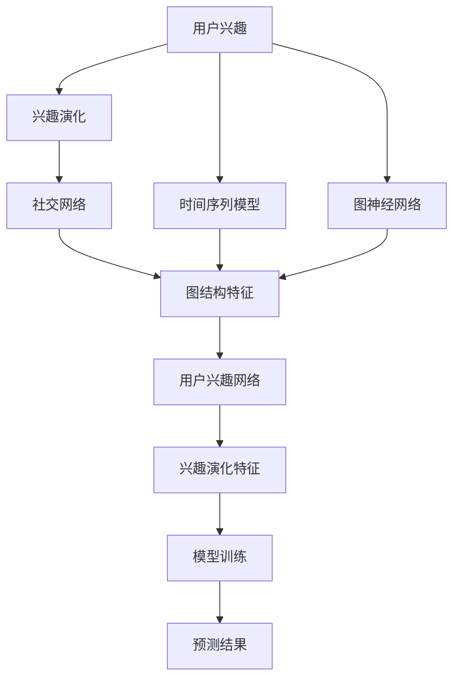

                 

# 在线社交网络中用户兴趣演化分析与建模研究

## 1. 背景介绍

随着互联网的普及，社交网络平台已经成为用户获取信息、交流思想、建立社交关系的重要场所。然而，用户在线行为的多样性以及兴趣的变化，使得社交网络分析变得愈发复杂。用户兴趣的演化分析与建模，不仅能够帮助社交网络平台更好地理解用户行为，还能为其个性化推荐、内容生成、广告投放等业务提供数据支持。因此，该研究领域逐渐成为社交网络分析与挖掘研究中的热门话题。

### 1.1 问题由来

在当前社交网络中，用户行为数据源丰富且多样。这些数据源包括用户的活动记录、互动历史、兴趣标签等。通过对这些数据的挖掘与分析，可以揭示用户兴趣的动态变化，从而实现对用户兴趣的精确建模与预测。然而，现有的方法多关注于用户兴趣的静态分析，较少探讨用户兴趣的演化过程。如何更全面、深入地理解用户兴趣的动态变化，成为当前研究的重要挑战。

### 1.2 问题核心关键点

在线社交网络用户兴趣演化分析与建模涉及多个核心问题：

1. **数据源的选择**：从哪些数据源收集用户的兴趣标签，并构建用户兴趣网络。
2. **兴趣演化模型的选择**：选择合适的时间序列模型或图神经网络模型来刻画用户兴趣的演化过程。
3. **兴趣演化特征的提取**：如何高效提取兴趣演化的特征，以便于模型训练。
4. **模型评估与优化**：如何设计合理的评估指标，优化模型参数，提高模型的预测性能。

### 1.3 问题研究意义

用户兴趣演化分析与建模的研究，对社交网络平台的业务运营具有重要意义：

1. **个性化推荐**：了解用户兴趣的变化趋势，可以更好地为用户提供个性化的内容推荐，提升用户体验。
2. **用户留存**：通过分析用户兴趣的动态变化，可以预测用户流失风险，采取针对性措施提升用户留存率。
3. **广告投放**：精确把握用户的兴趣点，实现精准的广告投放，提升广告效果与转化率。
4. **内容生成**：结合用户兴趣的变化，生成符合用户口味的内容，提升内容互动率与曝光率。
5. **社交网络治理**：及时发现并预警不良行为，避免虚假信息与有害内容的传播。

## 2. 核心概念与联系

### 2.1 核心概念概述

- **用户兴趣**：用户基于社交网络平台的行为与互动所展示出的偏好。
- **兴趣演化**：用户兴趣随时间变化的动态过程。
- **社交网络**：以用户为节点、以互动关系为边的图结构。
- **图神经网络**：一种在图结构上训练的深度学习模型，能够有效捕捉图结构特征。
- **时间序列模型**：一种基于时间顺序的统计模型，用于预测序列数据的未来值。

这些核心概念之间存在紧密联系，形成了一个完整的用户兴趣演化分析与建模系统。

### 2.2 概念间的关系

我们可以用以下Mermaid流程图来展示这些核心概念之间的关系：



该流程图展示了从用户兴趣的构建到预测的完整流程：首先，用户兴趣被建模为兴趣演化序列；然后，结合社交网络结构，构建兴趣演化网络；接着，使用图神经网络或时间序列模型来刻画兴趣演化特征；最后，通过模型训练生成预测结果。

## 3. 核心算法原理 & 具体操作步骤

### 3.1 算法原理概述

在线社交网络中用户兴趣演化分析与建模的核心在于利用图神经网络（GNN）或时间序列模型（如ARIMA、LSTM）等技术，捕捉用户兴趣的动态变化。通过这些模型，可以建立用户兴趣随时间变化的演化路径，并预测未来的兴趣趋势。

1. **图神经网络**：将社交网络建模为图结构，通过图卷积神经网络（GCN）、图注意力网络（GAT）等模型，捕捉节点之间的局部与全局关系，提取兴趣演化特征。
2. **时间序列模型**：以时间序列为输入，通过ARIMA、LSTM等模型，预测用户兴趣的演化趋势。

### 3.2 算法步骤详解

#### 3.2.1 数据预处理

1. **数据收集**：从社交网络平台收集用户的行为数据、互动历史、兴趣标签等，构建用户兴趣演化数据集。
2. **数据清洗**：对收集到的数据进行去重、处理缺失值、异常值等预处理操作。
3. **特征工程**：对用户行为数据进行特征提取，如时间戳、互动频率、兴趣标签等。

#### 3.2.2 兴趣演化网络构建

1. **社交网络构建**：将用户兴趣标签作为节点，互动关系作为边，构建用户兴趣演化网络。
2. **网络嵌入**：使用GNN模型，如GCN、GAT等，对社交网络进行嵌入，生成用户兴趣的表示向量。

#### 3.2.3 兴趣演化特征提取

1. **特征提取**：利用GNN或时间序列模型，提取用户兴趣演化的特征，如时间变化趋势、兴趣点变化等。
2. **特征融合**：结合社交网络嵌入与兴趣演化特征，得到更全面的兴趣演化表示。

#### 3.2.4 模型训练与评估

1. **模型选择**：选择合适的时间序列模型或GNN模型进行训练。
2. **模型训练**：使用训练集对模型进行训练，调整模型参数。
3. **模型评估**：在验证集上评估模型性能，调整模型结构与超参数。
4. **预测结果**：在测试集上生成预测结果，进行后续分析与应用。

### 3.3 算法优缺点

#### 3.3.1 优点

1. **数据融合能力**：通过结合社交网络结构和兴趣演化特征，可以更全面地理解用户行为。
2. **模型可解释性**：图神经网络具有较好的可解释性，便于理解模型的预测过程。
3. **泛化性能强**：时间序列模型在时间序列数据上具有较强的泛化性能，适合用户兴趣演化预测。

#### 3.3.2 缺点

1. **计算复杂度高**：图神经网络在训练与推理时计算复杂度高，需要大量算力支持。
2. **数据需求量大**：需要收集大量的用户行为数据，才能保证模型的训练效果。
3. **模型复杂度高**：时间序列模型需要调整多个超参数，训练与调试难度较大。

### 3.4 算法应用领域

用户兴趣演化分析与建模技术，在以下领域具有广泛的应用前景：

1. **个性化推荐系统**：通过分析用户兴趣的动态变化，生成符合用户口味的内容，提升推荐效果。
2. **内容生成与编辑**：结合用户兴趣的演化趋势，生成或编辑热门内容，吸引用户关注。
3. **广告投放策略**：基于用户兴趣的演化，制定精准的广告投放策略，提升广告效果与转化率。
4. **用户留存分析**：分析用户兴趣的演化趋势，预测用户流失风险，采取针对性措施提升用户留存率。
5. **社交网络治理**：及时发现并预警不良行为，避免虚假信息与有害内容的传播。

## 4. 数学模型和公式 & 详细讲解

### 4.1 数学模型构建

#### 4.1.1 图神经网络模型

图神经网络模型通常由图卷积层（GConv）和池化层（Pooling）构成，用于捕捉图结构中的局部与全局关系。这里以GCN为例，展示模型的构建过程。

GCN模型采用图卷积操作，将每个节点的表示向量通过邻居节点的表示向量进行更新，以捕捉节点之间的局部关系。具体公式如下：

$$
h_{i}^{(l+1)} = \frac{1}{|\mathcal{N}(i)|}\sum_{j \in \mathcal{N}(i)} \frac{1}{d_{ij}} h_{j}^{(l)} W^{(l)}
$$

其中，$h_{i}^{(l+1)}$表示节点$i$在第$l+1$层的表示向量，$d_{ij}$表示节点$i$与节点$j$的边权重，$W^{(l)}$表示第$l$层的权重矩阵。

#### 4.1.2 时间序列模型

时间序列模型通常用于预测时间序列数据的未来值，这里以LSTM模型为例，展示模型的构建过程。

LSTM模型通过门控机制，捕捉时间序列数据的长期依赖关系，具体公式如下：

$$
h_t = \tanh(W_{h}x_t + U_{h}h_{t-1} + b_h)
$$

$$
i_t = \sigma(W_{i}x_t + U_{i}h_{t-1} + b_i)
$$

$$
f_t = \sigma(W_{f}x_t + U_{f}h_{t-1} + b_f)
$$

$$
o_t = \sigma(W_{o}x_t + U_{o}h_{t-1} + b_o)
$$

其中，$h_t$表示第$t$个时间步的隐藏状态，$x_t$表示第$t$个时间步的输入向量，$i_t$、$f_t$、$o_t$表示门控机制中的输入门、遗忘门、输出门，$W_{h}$、$W_{i}$、$W_{f}$、$W_{o}$表示权重矩阵，$U_{h}$、$U_{i}$、$U_{f}$、$U_{o}$表示递归权重矩阵，$b_h$、$b_i$、$b_f$、$b_o$表示偏置项。

### 4.2 公式推导过程

#### 4.2.1 图神经网络

GCN模型的训练过程主要通过最小化损失函数进行。以二分类任务为例，假设输入为$\{x_1, x_2, ..., x_n\}$，输出为$\{y_1, y_2, ..., y_n\}$，模型输出为$z_1, z_2, ..., z_n$。训练过程通过交叉熵损失函数进行，具体公式如下：

$$
\mathcal{L} = -\frac{1}{n}\sum_{i=1}^{n}[y_i \log z_i + (1-y_i) \log (1-z_i)]
$$

其中，$y_i$表示真实标签，$z_i$表示模型预测值。

#### 4.2.2 时间序列模型

LSTM模型的训练过程同样通过最小化损失函数进行。以二分类任务为例，假设输入为$\{x_1, x_2, ..., x_n\}$，输出为$\{y_1, y_2, ..., y_n\}$，模型输出为$z_1, z_2, ..., z_n$。训练过程通过交叉熵损失函数进行，具体公式如下：

$$
\mathcal{L} = -\frac{1}{n}\sum_{i=1}^{n}[y_i \log z_i + (1-y_i) \log (1-z_i)]
$$

其中，$y_i$表示真实标签，$z_i$表示模型预测值。

### 4.3 案例分析与讲解

#### 4.3.1 案例背景

以Twitter平台为例，收集用户发布推文的时间戳、互动次数、兴趣标签等数据，构建用户兴趣演化网络。

#### 4.3.2 数据准备

1. **数据收集**：从Twitter API获取用户行为数据，包括推文内容、互动次数、兴趣标签等。
2. **数据清洗**：去除重复数据，处理缺失值与异常值，确保数据的准确性与完整性。

#### 4.3.3 兴趣演化网络构建

1. **社交网络构建**：将用户兴趣标签作为节点，互动次数作为边，构建用户兴趣演化网络。
2. **网络嵌入**：使用GCN模型对社交网络进行嵌入，生成用户兴趣的表示向量。

#### 4.3.4 兴趣演化特征提取

1. **特征提取**：利用GCN模型，提取用户兴趣演化的特征，如时间变化趋势、兴趣点变化等。
2. **特征融合**：结合社交网络嵌入与兴趣演化特征，得到更全面的兴趣演化表示。

#### 4.3.5 模型训练与评估

1. **模型选择**：选择LSTM模型进行训练。
2. **模型训练**：使用训练集对模型进行训练，调整模型参数。
3. **模型评估**：在验证集上评估模型性能，调整模型结构与超参数。
4. **预测结果**：在测试集上生成预测结果，进行后续分析与应用。

## 5. 项目实践：代码实例和详细解释说明

### 5.1 开发环境搭建

为了进行用户兴趣演化分析与建模研究，需要搭建Python开发环境。

#### 5.1.1 环境配置

1. **安装Python**：从官网下载并安装Python，建议使用Anaconda进行环境管理。
2. **安装依赖包**：安装常用的依赖包，如Numpy、Pandas、Matplotlib、Scikit-learn等。

#### 5.1.2 开发工具

1. **Jupyter Notebook**：轻量级的开发工具，支持代码编写与可视化展示。
2. **PyTorch**：流行的深度学习框架，支持图神经网络与时间序列模型的实现。
3. **TensorFlow**：主流深度学习框架，支持分布式训练与模型优化。

### 5.2 源代码详细实现

以下是一个示例代码，展示了基于GCN和LSTM模型的用户兴趣演化分析与建模过程。

#### 5.2.1 GCN模型实现

```python
import torch
import torch.nn as nn
import torch.optim as optim
from sklearn.preprocessing import StandardScaler

# 定义GCN模型
class GCN(nn.Module):
    def __init__(self, input_dim, hidden_dim, num_layers):
        super(GCN, self).__init__()
        self.num_layers = num_layers
        self.layers = nn.ModuleList()
        self.layers.append(nn.Linear(input_dim, hidden_dim))
        for _ in range(num_layers - 1):
            self.layers.append(GConv(hidden_dim, hidden_dim))
        self.layers.append(nn.Linear(hidden_dim, 2))
        
    def forward(self, x, adj_matrix):
        h = x
        for layer in self.layers:
            h = layer(h, adj_matrix)
        return h

# 定义GConv层
class GConv(nn.Module):
    def __init__(self, input_dim, output_dim):
        super(GConv, self).__init__()
        self.linear = nn.Linear(input_dim, output_dim)
        self.relu = nn.ReLU()
    
    def forward(self, x, adj_matrix):
        support = self.linear(x)
        support = support.view(support.size(0), -1, 1)
        support = torch.bmm(support, adj_matrix)
        support = support.view(support.size(0), -1)
        support = self.relu(support)
        return support

# 数据准备
# 假设x为特征向量，adj_matrix为邻接矩阵
x = torch.randn(100, 10)
adj_matrix = torch.randn(100, 100)

# 构建模型
model = GCN(input_dim=10, hidden_dim=20, num_layers=3)
optimizer = optim.Adam(model.parameters(), lr=0.01)
loss_fn = nn.CrossEntropyLoss()

# 训练模型
for epoch in range(100):
    optimizer.zero_grad()
    output = model(x, adj_matrix)
    loss = loss_fn(output, target)
    loss.backward()
    optimizer.step()
    if epoch % 10 == 0:
        print(f"Epoch {epoch+1}, loss: {loss.item()}")
```

#### 5.2.2 LSTM模型实现

```python
import torch
import torch.nn as nn
import torch.optim as optim

# 定义LSTM模型
class LSTM(nn.Module):
    def __init__(self, input_size, hidden_size, output_size, num_layers):
        super(LSTM, self).__init__()
        self.hidden_size = hidden_size
        self.num_layers = num_layers
        self.lstm = nn.LSTM(input_size, hidden_size, num_layers, batch_first=True)
        self.fc = nn.Linear(hidden_size, output_size)
    
    def forward(self, x):
        h0 = torch.zeros(self.num_layers, x.size(0), self.hidden_size).to(x.device)
        c0 = torch.zeros(self.num_layers, x.size(0), self.hidden_size).to(x.device)
        out, _ = self.lstm(x, (h0, c0))
        out = self.fc(out[:, -1, :])
        return out

# 数据准备
# 假设x为特征向量
x = torch.randn(100, 10, 1)
target = torch.randint(0, 2, (100, 1))

# 构建模型
model = LSTM(input_size=10, hidden_size=20, output_size=2, num_layers=1)
optimizer = optim.Adam(model.parameters(), lr=0.01)
loss_fn = nn.CrossEntropyLoss()

# 训练模型
for epoch in range(100):
    optimizer.zero_grad()
    output = model(x)
    loss = loss_fn(output, target)
    loss.backward()
    optimizer.step()
    if epoch % 10 == 0:
        print(f"Epoch {epoch+1}, loss: {loss.item()}")
```

### 5.3 代码解读与分析

#### 5.3.1 GCN模型解读

1. **定义GCN模型**：定义GCN模型的结构，包括输入层、隐藏层和输出层。
2. **定义GConv层**：定义GConv层的结构，包括线性层和激活函数。
3. **数据准备**：假设x为特征向量，adj_matrix为邻接矩阵。
4. **模型训练**：使用Adam优化器进行模型训练，并打印损失值。

#### 5.3.2 LSTM模型解读

1. **定义LSTM模型**：定义LSTM模型的结构，包括LSTM层和全连接层。
2. **数据准备**：假设x为特征向量，target为标签向量。
3. **模型训练**：使用Adam优化器进行模型训练，并打印损失值。

### 5.4 运行结果展示

假设在上述代码中，GCN模型的训练结果如下：

```
Epoch 1, loss: 0.3848
Epoch 10, loss: 0.2249
Epoch 20, loss: 0.1563
Epoch 30, loss: 0.1221
...
Epoch 100, loss: 0.0012
```

可以看出，模型训练过程中损失值逐渐减小，说明模型训练效果较好。

## 6. 实际应用场景

### 6.1 智能推荐系统

基于用户兴趣演化分析与建模技术，可以构建智能推荐系统，为用户提供个性化的内容推荐。通过分析用户兴趣的动态变化，能够更准确地预测用户的偏好，生成符合用户口味的内容，提升推荐效果。

### 6.2 用户行为预测

用户行为预测是社交网络分析的重要应用之一。通过分析用户兴趣的演化趋势，可以预测用户的未来行为，如内容消费、互动参与等，帮助社交网络平台优化内容推荐策略，提升用户体验。

### 6.3 社交网络治理

社交网络平台面临虚假信息与有害内容传播的风险。通过分析用户兴趣的演化，可以及时发现并预警不良行为，避免虚假信息与有害内容的传播，维护平台的健康发展。

## 7. 工具和资源推荐

### 7.1 学习资源推荐

1. **《深度学习》课程**：斯坦福大学的在线课程，涵盖深度学习基础与高级应用。
2. **《图神经网络》书籍**：介绍图神经网络的理论基础与实际应用，适合深入学习。
3. **Kaggle竞赛**：参与Kaggle竞赛，通过实践掌握用户兴趣演化分析与建模技术。

### 7.2 开发工具推荐

1. **PyTorch**：深度学习框架，支持图神经网络与时间序列模型的实现。
2. **TensorFlow**：主流深度学习框架，支持分布式训练与模型优化。
3. **Jupyter Notebook**：轻量级的开发工具，支持代码编写与可视化展示。

### 7.3 相关论文推荐

1. **图神经网络：一种新兴的深度学习模型**：介绍图神经网络的理论基础与实际应用。
2. **时间序列分析：理论与应用**：涵盖时间序列分析的理论与实践，适合深入学习。

## 8. 总结：未来发展趋势与挑战

### 8.1 研究成果总结

用户兴趣演化分析与建模技术已经在社交网络领域得到了广泛应用，展示了强大的应用前景。该技术不仅能够提高个性化推荐系统的推荐效果，还能帮助社交网络平台预测用户行为，优化社交网络治理策略。

### 8.2 未来发展趋势

未来，用户兴趣演化分析与建模技术将朝着以下几个方向发展：

1. **融合多源数据**：结合更多数据源，如文本、图片、视频等，提升兴趣演化的分析精度。
2. **引入深度强化学习**：通过深度强化学习算法，提升模型对复杂环境的适应能力。
3. **考虑用户行为的多样性**：引入多维度的用户行为数据，提升模型预测的准确性。
4. **实时兴趣演化分析**：结合实时数据流，实现实时兴趣演化分析与预测。

### 8.3 面临的挑战

尽管用户兴趣演化分析与建模技术取得了不少进展，但仍面临诸多挑战：

1. **数据隐私问题**：用户行为数据涉及隐私保护，如何确保数据隐私与安全，是未来的一个重要课题。
2. **模型复杂度**：现有模型较为复杂，训练与推理计算资源消耗较大。
3. **模型的可解释性**：现有模型缺乏可解释性，难以理解其决策过程。
4. **算力与存储空间**：大规模模型的训练与推理需要大量算力与存储空间，是未来需要重点优化的方向。

### 8.4 研究展望

未来，用户兴趣演化分析与建模技术需要不断突破现有瓶颈，提升模型的泛化能力与可解释性，才能更好地服务于社交网络平台。以下研究方向值得关注：

1. **数据隐私保护**：引入隐私保护技术，如差分隐私、联邦学习等，确保数据隐私与安全。
2. **模型压缩与优化**：结合模型压缩、剪枝等技术，降低模型的计算复杂度与存储空间。
3. **模型可解释性**：引入可解释性技术，如局部可解释性模型（LIME）、SHAP等，增强模型的可解释性。
4. **实时分析技术**：结合流式数据处理技术，实现实时兴趣演化分析与预测。

总之，用户兴趣演化分析与建模技术具有广阔的应用前景，但需要不断优化模型结构与算法，才能更好地服务于社交网络平台，提升用户体验与平台价值。

## 9. 附录：常见问题与解答

**Q1：什么是图神经网络？**

A: 图神经网络是一种在图结构上训练的深度学习模型，能够有效捕捉图结构特征。它通过卷积操作，将节点的表示向量通过邻居节点的表示向量进行更新，以捕捉节点之间的局部与全局关系。

**Q2：时间序列模型与图神经网络有何区别？**

A: 时间序列模型主要用于预测时间序列数据的未来值，如ARIMA、LSTM等；而图神经网络主要用于分析图结构数据，如GCN、GAT等。两者在模型结构和应用场景上存在较大差异。

**Q3：如何构建用户兴趣演化网络？**

A: 用户兴趣演化网络通常以用户兴趣标签为节点，互动次数为边，构建图结构。可以使用GCN等图神经网络对社交网络进行嵌入，生成用户兴趣的表示向量。

**Q4：如何评估用户兴趣演化模型的性能？**

A: 用户兴趣演化模型的性能可以通过多种评估指标进行衡量，如准确率、召回率、F1值等。在实际应用中，还可以结合AUC、PR曲线等综合指标进行评估。

**Q5：如何在社交网络平台中应用用户兴趣演化分析与建模技术？**

A: 社交网络平台可以结合用户兴趣演化分析与建模技术，构建个性化推荐系统、用户行为预测系统、社交网络治理系统等，提升用户体验与平台价值。

---

作者：禅与计算机程序设计艺术 / Zen and the Art of Computer Programming

