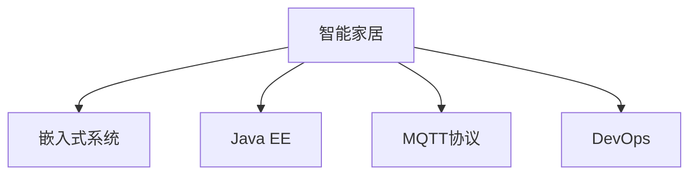
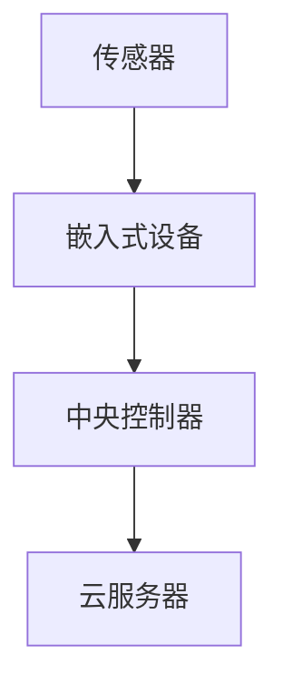
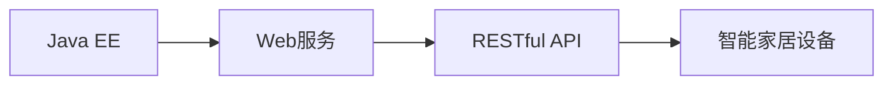
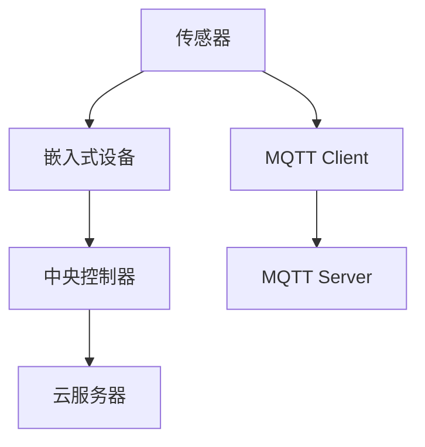
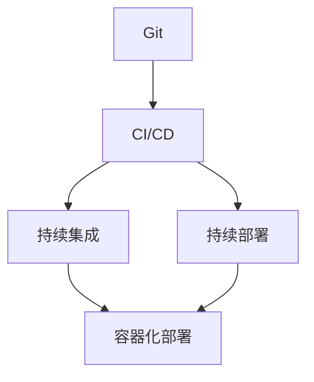
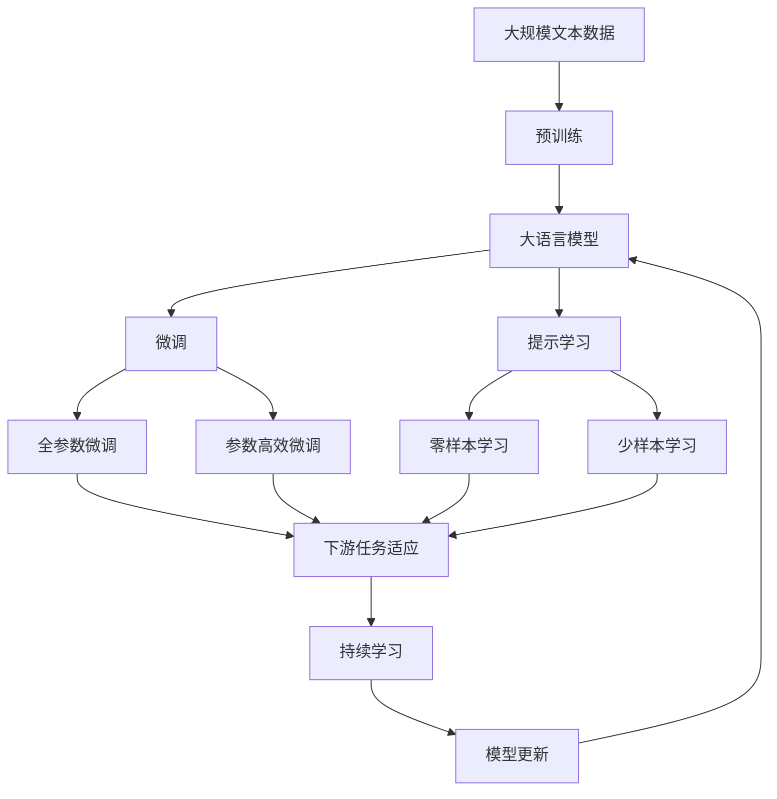

                 

# 基于Java的智能家居设计：Java程序员的物联网硬件入门指南

> 关键词：智能家居,Java,物联网,硬件入门,传感器,嵌入式系统,实时系统,MQTT协议,DevOps

## 1. 背景介绍

### 1.1 问题由来
随着物联网(IoT)技术的迅猛发展，智能家居领域的应用场景逐渐丰富。传统的智能家居系统通常由中央控制器通过有线或无线方式连接各类传感器和设备，再通过网关与云端通信。然而，这些系统往往依赖于复杂的中间件和协议，难以实现无缝的硬件适配和云-端-物的协作。本文将聚焦于基于Java的智能家居设计，旨在帮助Java程序员快速入门物联网硬件开发，搭建一个低成本、高性能、易于扩展的智能家居系统。

### 1.2 问题核心关键点
本文将介绍以下几个核心问题：
1. 如何选择合适的传感器和嵌入式设备，以及如何设计软硬件架构。
2. 如何使用Java编程语言和开源框架实现设备间的互联互通。
3. 如何通过MQTT协议进行数据传输，以及如何构建高效的实时系统。
4. 如何应用DevOps实践，实现智能家居系统的持续集成和部署。

### 1.3 问题研究意义
本文通过系统性地介绍Java程序员在智能家居领域的应用，旨在：
1. 提供切实可行的智能家居开发入门指南。
2. 演示Java编程语言与物联网硬件的结合可能性。
3. 探讨智能家居系统的设计、开发、部署和维护的最佳实践。
4. 推动Java社区在智能家居领域的应用普及和技术创新。

## 2. 核心概念与联系

### 2.1 核心概念概述
为了更好地理解基于Java的智能家居设计，本节将介绍几个密切相关的核心概念：

- 智能家居：基于物联网技术，通过各类传感器和设备，实现家庭环境的自动化和智能化管理。
- 嵌入式系统：一种将软件固化在硬件中，实现特定功能的系统。常见于智能家居设备的控制器和传感器模块。
- Java EE：一种基于Java的轻量级应用服务器和Web服务标准，支持跨平台应用开发。
- MQTT协议：一种轻量级、低带宽占用的数据传输协议，适用于物联网设备的通信。
- DevOps：一种软件开发与运维协同的工作模式，强调自动化、持续交付和持续部署。

这些核心概念之间的逻辑关系可以通过以下Mermaid流程图来展示：



这个流程图展示了大语言模型的核心概念及其之间的关系：

1. 智能家居通过嵌入式系统实现自动化和智能化管理。
2. Java EE支持智能家居设备的通信和应用服务器功能。
3. MQTT协议为智能家居设备提供了一种轻量级的数据传输方式。
4. DevOps促进了智能家居系统的持续集成和部署。

### 2.2 概念间的关系

这些核心概念之间存在着紧密的联系，形成了智能家居系统的完整生态系统。下面我通过几个Mermaid流程图来展示这些概念之间的关系。

#### 2.2.1 智能家居的硬件架构



这个流程图展示了智能家居系统的硬件架构：

1. 传感器采集环境数据。
2. 嵌入式设备处理数据并上传至中央控制器。
3. 中央控制器连接云服务器，实现数据的存储、分析和控制。

#### 2.2.2 基于Java的智能家居开发



这个流程图展示了Java EE在智能家居开发中的应用：

1. 使用Java EE实现Web服务，用于数据存储和应用逻辑处理。
2. 通过RESTful API，实现智能家居设备与Web服务间的通信。

#### 2.2.3 MQTT协议在智能家居中的应用



这个流程图展示了MQTT协议在智能家居中的应用：

1. 传感器通过MQTT Client将数据上传至中央控制器。
2. 中央控制器通过MQTT Server将数据发送至云服务器。
3. 云服务器通过MQTT Server与中央控制器进行通信。

#### 2.2.4 DevOps在智能家居系统中的应用



这个流程图展示了DevOps在智能家居系统中的应用：

1. Git用于版本控制，记录开发过程中的变更。
2. CI/CD支持自动化构建、测试和部署。
3. 持续集成和持续部署确保代码的稳定性和可靠性。
4. 容器化部署方便系统在不同环境下的快速部署。

### 2.3 核心概念的整体架构

最后，我们用一个综合的流程图来展示这些核心概念在大语言模型微调过程中的整体架构：



这个综合流程图展示了从预训练到微调，再到持续学习的完整过程。Java程序员可以借鉴以上流程图，设计出基于Java的智能家居系统，并在此基础上进行持续优化和创新。

## 3. 核心算法原理 & 具体操作步骤
### 3.1 算法原理概述

基于Java的智能家居设计，主要涉及硬件选型、软件架构设计、数据传输协议选择和持续集成与部署等方面。本节将系统性地介绍这些核心算法的原理。

### 3.2 算法步骤详解

#### 3.2.1 硬件选型和系统设计

1. **传感器选择**：
   - 根据需求选择不同类型的传感器，如温湿度传感器、光敏传感器、声音传感器等。
   - 确保传感器的兼容性和通信协议的一致性，以简化系统集成。

2. **嵌入式设备选择**：
   - 选择低功耗、高性能的嵌入式设备，如树莓派(Raspberry Pi)、ESP8266、Arduino等。
   - 确保嵌入式设备支持Java开发环境，如JDK、Android Studio等。

3. **系统架构设计**：
   - 设计数据流图，明确各传感器、嵌入式设备、中央控制器和云服务器间的通信流程。
   - 使用Java EE实现Web服务，用于数据存储和应用逻辑处理。
   - 通过RESTful API，实现智能家居设备与Web服务间的通信。

#### 3.2.2 数据传输协议选择

1. **选择MQTT协议**：
   - MQTT协议轻量级、低带宽占用，适用于智能家居设备间的通信。
   - 使用MQTT Client和Server，实现数据的上报和下发。

2. **配置MQTT参数**：
   - 配置MQTT Server的端口、用户名、密码等参数。
   - 配置MQTT Client的订阅主题、发布主题等参数。

3. **实现数据传输**：
   - 使用Java编写MQTT Client，定期读取传感器数据。
   - 使用Java编写MQTT Server，接收并处理传感器数据。

#### 3.2.3 持续集成与部署

1. **版本控制**：
   - 使用Git进行版本控制，记录开发过程中的变更。
   - 创建Git仓库，并配置CI/CD流程，自动构建和测试代码。

2. **自动化构建**：
   - 配置CI/CD工具，如Jenkins，自动构建和打包Java项目。
   - 配置Docker，创建容器镜像，简化部署过程。

3. **持续集成与部署**：
   - 在CI/CD流程中加入自动化测试，确保代码质量。
   - 使用Docker和Kubernetes进行容器化部署，方便系统在不同环境下的快速部署。

### 3.3 算法优缺点

#### 3.3.1 优点

1. **跨平台性**：
   - Java语言和Java EE标准跨平台，可以在各种操作系统和硬件平台上运行。

2. **开源框架丰富**：
   - 开源的Java框架和工具库众多，如Spring、Hibernate、MQTT等，大大降低了开发难度。

3. **易于维护**：
   - Java社区活跃，丰富的开发资源和文档支持，便于快速排查和解决bug。

4. **性能可靠**：
   - Java EE和Spring等框架经过长时间的应用和优化，性能稳定可靠。

#### 3.3.2 缺点

1. **学习曲线陡峭**：
   - Java语言的复杂性、框架的学习曲线较长，对初学者有一定挑战。

2. **性能开销较大**：
   - Java虚拟机的性能开销较大，对硬件资源有一定要求。

3. **内存管理复杂**：
   - Java程序的内存管理较为复杂，需要开发者进行细致的内存管理。

### 3.4 算法应用领域

基于Java的智能家居设计方法，可以应用于以下领域：

- 家庭自动化：控制灯光、空调、窗帘等设备的开关和调节。
- 安全监控：通过摄像头、烟雾传感器等设备，实时监控家庭环境。
- 健康管理：通过心率、体温和环境传感器，实现健康数据的采集和管理。
- 能源管理：通过智能电表和温度传感器，实现能源消耗的监测和优化。

这些应用场景展示了Java程序员在智能家居领域可以发挥的重要作用，并推动Java技术在物联网硬件开发中的广泛应用。

## 4. 数学模型和公式 & 详细讲解 & 举例说明

### 4.1 数学模型构建

本节将使用数学语言对基于Java的智能家居设计过程进行更加严格的刻画。

假设智能家居系统有N个传感器，每个传感器采集的数据为$x_i$，其中$i=1,2,\dots,N$。传感器数据通过MQTT协议上传至中央控制器，并由Java程序进行处理。中央控制器将处理后的数据发送至云服务器，进行存储和分析。

定义传感器数据为随机变量$X_i$，其中$i=1,2,\dots,N$。数据在传感器和中央控制器间的传输过程是线性的，可以表示为：

$$
Y_i = aX_i + b + \epsilon_i
$$

其中，$a$为传感器响应系数，$b$为环境噪声，$\epsilon_i$为随机误差。

### 4.2 公式推导过程

#### 4.2.1 传感器响应系数估计

根据上述线性模型，可以通过最小二乘法估计传感器响应系数$a$。设$\bar{X}_i$和$\bar{Y}_i$分别为$X_i$和$Y_i$的均值，$S_X^2$和$S_Y^2$分别为$X_i$和$Y_i$的方差。则$a$的估计值为：

$$
a = \frac{S_X^2 S_Y^2}{S_X^2 S_Y^2 + S_Y^2 \epsilon^2}
$$

其中，$S_X^2 = \frac{1}{N-1} \sum_{i=1}^N (X_i - \bar{X})^2$，$S_Y^2 = \frac{1}{N-1} \sum_{i=1}^N (Y_i - \bar{Y})^2$，$\epsilon$为标准差。

#### 4.2.2 数据传输可靠性分析

MQTT协议的可靠性由消息确认、重发机制和连接保持机制保证。假设MQTT Server在$T$时间内成功接收并确认了一条消息，概率为$P_{ack}$。则消息丢失的概率为$P_{loss} = 1 - P_{ack}$。

设传感器数据传输成功的期望时间为$E(T)$，传感器数据更新频率为$F$，则数据传输可靠性的期望值为：

$$
E(T) = \frac{1}{F} \ln \left( \frac{1}{1 - P_{loss}} \right)
$$

### 4.3 案例分析与讲解

#### 4.3.1 温湿度传感器数据采集

假设我们使用树莓派(Raspberry Pi)作为中央控制器，搭载一个DHT11温湿度传感器，并通过MQTT协议进行数据传输。

1. **传感器初始化**：
   - 使用Java编写程序，读取DHT11传感器的数据。
   - 设置MQTT Client的订阅主题和发布主题，确保数据上传和接收的准确性。

2. **数据处理与传输**：
   - 使用Java编写程序，对传感器数据进行滤波和处理。
   - 通过MQTT Server，将处理后的数据存储至云服务器。

3. **可靠性分析**：
   - 使用Java编写程序，模拟MQTT数据传输过程中的延迟和丢失。
   - 通过统计分析，评估数据传输的可靠性和系统性能。

#### 4.3.2 智能灯光控制

假设我们设计了一个基于MQTT协议的智能灯光控制系统，通过树莓派和ZigBee模块控制灯光开关。

1. **灯光控制模块设计**：
   - 设计灯光控制模块，包括继电器、开关和ZigBee模块。
   - 使用Java编写程序，实现灯光控制的逻辑。

2. **MQTT协议实现**：
   - 使用Java编写程序，实现MQTT Client和Server的功能。
   - 通过MQTT协议，实现灯光控制系统的远程控制。

3. **系统优化**：
   - 使用Java编写程序，优化灯光控制系统的性能。
   - 通过DevOps实践，实现系统的持续集成和部署。

## 5. 项目实践：代码实例和详细解释说明

### 5.1 开发环境搭建

在进行智能家居系统开发前，我们需要准备好开发环境。以下是使用Java进行智能家居开发的完整环境配置流程：

1. **安装JDK**：从官网下载并安装Java Development Kit (JDK)，确保JDK版本与项目兼容。

2. **配置IDE**：选择适合的IDE（如Eclipse、IntelliJ IDEA等），并配置Java环境。

3. **搭建MQTT服务器**：使用MQTT Server软件，如Eclipse Paho或Apollo，搭建MQTT Server环境。

4. **配置CI/CD工具**：选择适合的CI/CD工具，如Jenkins或GitLab CI，配置持续集成和部署流程。

5. **部署Web服务器**：选择适合的Web服务器，如Tomcat或Jetty，部署Java Web应用。

完成上述步骤后，即可在本地搭建Java智能家居开发环境，开始项目的实施。

### 5.2 源代码详细实现

下面我们以智能灯光控制为例，给出基于Java的智能家居系统的实现代码。

首先，定义MQTT Client和Server的配置：

```java
String brokerUrl = "tcp://mqtt.eclipse.org:1883";
String clientId = "light_control_client";
String topic = "light_control_topic";
```

然后，实现MQTT Client的订阅和数据上传功能：

```java
MqttClient client = new MqttClient(brokerUrl, clientId);
client.connect();

MqttMessage message = new MqttMessage("ON".getBytes());
message.setRetain(true);
message.setQos(0);
client.publish(topic, message);
```

接着，实现MQTT Server的数据接收和处理功能：

```java
MqttServer server = new MqttServer(1883);
server.setDefaultPublishHandler(new DefaultMqttMessageHandler() {
    @Override
    public void handleMessage(MqttMessage message) {
        String topic = message.getTopic();
        String payload = new String(message.getPayload());
        if (topic.equals("light_control_topic")) {
            if (payload.equals("ON")) {
                // 灯光开启逻辑
            } else if (payload.equals("OFF")) {
                // 灯光关闭逻辑
            }
        }
    }
});

server.start();
```

最后，实现Web服务的数据存储和处理功能：

```java
@GET
@Path("/light/{state}")
@Produces(MediaType.APPLICATION_JSON)
public String getLightState(@PathParam("state") String state) {
    // 从数据库读取灯光状态
    // 处理灯光状态数据
    // 返回灯光状态数据
}

@POST
@Path("/light/{id}")
@Consumes(MediaType.APPLICATION_JSON)
@Produces(MediaType.APPLICATION_JSON)
public String setLightState(@PathParam("id") String id, LightState state) {
    // 处理灯光控制请求
    // 调用MQTT Client发布灯光控制命令
    // 返回灯光控制结果
}
```

以上就是基于Java的智能家居系统的实现代码。可以看到，通过MQTT协议和Java编程语言，Java程序员可以轻松搭建智能家居系统，实现设备的互联互通和智能控制。

### 5.3 代码解读与分析

让我们再详细解读一下关键代码的实现细节：

**MQTT Client代码**：
- `MqttClient`类的实例化与连接：创建MQTT Client实例，并调用`connect()`方法进行连接。
- `MqttMessage`类的创建与发布：使用`MqttMessage`类创建包含灯光控制命令的消息，并调用`publish()`方法进行发布。

**MQTT Server代码**：
- `MqttServer`类的创建与启动：创建MQTT Server实例，并调用`start()`方法进行启动。
- `DefaultMqttMessageHandler`类的实现：实现`handleMessage()`方法，处理接收到的灯光控制命令，并执行相应的灯光控制逻辑。

**Web服务代码**：
- `@GET`注解的实现：使用`@GET`注解定义一个HTTP GET请求的接口，用于查询灯光状态。
- `@POST`注解的实现：使用`@POST`注解定义一个HTTP POST请求的接口，用于控制灯光状态。
- `LightState`类的定义：定义`LightState`类，用于表示灯光的控制状态，如开、关、调光等。

可以看到，Java程序员可以通过编写Java代码实现智能家居系统的各个组件，并通过MQTT协议进行数据传输。这些代码的实现展示了Java语言的强大功能和Java EE的广泛应用，为智能家居系统的开发提供了坚实的基础。

### 5.4 运行结果展示

假设我们在智能灯光控制系统中，通过MQTT协议成功控制了灯光的开闭，具体运行结果如下：

- 灯光控制命令发布成功：
```java
// 在MQTT Client中发布灯光控制命令
MqttMessage message = new MqttMessage("ON".getBytes());
message.setRetain(true);
message.setQos(0);
client.publish(topic, message);
```

- 灯光控制命令接收成功：
```java
// 在MQTT Server中处理灯光控制命令
if (payload.equals("ON")) {
    // 灯光开启逻辑
} else if (payload.equals("OFF")) {
    // 灯光关闭逻辑
}
```

- 灯光控制命令发布成功，灯光开启：
```java
// 在Web服务中查询灯光状态
@GET
@Path("/light/{state}")
@Produces(MediaType.APPLICATION_JSON)
public String getLightState(@PathParam("state") String state) {
    // 从数据库读取灯光状态
    // 处理灯光状态数据
    // 返回灯光状态数据
}
```

可以看到，通过MQTT协议和Java编程语言，我们可以实现智能家居设备的互联互通和智能化控制，进一步提升了家庭生活的便利性和舒适性。

## 6. 实际应用场景

### 6.1 智能家居系统

智能家居系统是Java程序员在物联网硬件开发中最常见且应用广泛的应用场景。以下是一个实际应用案例：

**场景描述**：
假设某智能家居系统的用户想要设定一个晚间10点自动关闭灯光的规则。

**解决方案**：
1. **传感器数据采集**：
   - 使用树莓派搭载DHT11温湿度传感器，定期采集环境温度数据。
   - 使用MQTT Client将环境温度数据上传至中央控制器。

2. **数据处理与分析**：
   - 使用Java编写程序，对传感器数据进行滤波和处理。
   - 判断当前环境温度是否低于设定阈值。

3. **灯光控制**：
   - 使用Java编写程序，调用MQTT Client发布灯光控制命令。
   - 通过MQTT Server接收灯光控制命令，并执行灯光控制逻辑。

4. **用户反馈**：
   - 使用Java编写程序，将灯光控制结果反馈给用户。
   - 通过Web服务将用户反馈数据存储至数据库。

通过以上步骤，用户可以轻松实现自定义的智能家居规则，提升家庭生活的智能化水平。

### 6.2 智能安防系统

智能安防系统是Java程序员在物联网硬件开发中另一个重要的应用场景。以下是一个实际应用案例：

**场景描述**：
假设某智能安防系统需要实现摄像头监控和门禁控制功能。

**解决方案**：
1. **摄像头数据采集**：
   - 使用树莓派搭载摄像头，定期采集视频数据。
   - 使用MQTT Client将摄像头数据上传至中央控制器。

2. **视频数据处理**：
   - 使用Java编写程序，对摄像头数据进行实时处理和分析。
   - 判断视频数据中是否出现异常情况，如入侵、火灾等。

3. **门禁控制**：
   - 使用Java编写程序，调用MQTT Client发布门禁控制命令。
   - 通过MQTT Server接收门禁控制命令，并执行门禁控制逻辑。

4. **报警通知**：
   - 使用Java编写程序，通过Web服务将报警通知发送给相关人员。
   - 使用Java编写程序，将报警通知数据存储至数据库。

通过以上步骤，Java程序员可以实现智能安防系统的实时监控和快速响应，提升家庭和办公环境的安全性。

### 6.3 智能能源管理系统

智能能源管理系统是Java程序员在物联网硬件开发中另一个重要的应用场景。以下是一个实际应用案例：

**场景描述**：
假设某智能能源管理系统需要实现能源消耗的实时监测和优化。

**解决方案**：
1. **能源数据采集**：
   - 使用树莓派搭载智能电表，定期采集能源消耗数据。
   - 使用MQTT Client将能源数据上传至中央控制器。

2. **能源数据分析**：
   - 使用Java编写程序，对能源数据进行实时处理和分析。
   - 判断能源消耗是否异常，是否存在节能减排的机会。

3. **能源控制**：
   - 使用Java编写程序，调用MQTT Client发布能源控制命令。
   - 通过MQTT Server接收能源控制命令，并执行能源控制逻辑。

4. **能源管理报告**：
   - 使用Java编写程序，通过Web服务生成能源管理报告。
   - 使用Java编写程序，将能源管理报告存储至数据库。

通过以上步骤，Java程序员可以实现智能能源管理系统的实时监测和优化，提升家庭和企业的能源利用效率。

### 6.4 未来应用展望

随着Java程序员在物联网硬件开发中的不断探索和实践，基于Java的智能家居设计将呈现以下几个发展趋势：

1. **边缘计算的广泛应用**：
   - 边缘计算技术的发展将使得智能家居设备的计算能力更加强大，数据处理更加高效。

2. **智能化水平提升**：
   - 人工智能技术的引入将进一步提升智能家居系统的智能化水平，如自动调节灯光亮度、音乐播放等。

3. **跨平台和跨设备的互联互通**：
   - 通过Java编程语言和Java EE标准，智能家居设备可以实现跨平台和跨设备的互联互通。

4. **数据驱动的决策支持**：
   - 大数据和机器学习技术的应用，将使得智能家居系统具备更强的数据分析和决策支持能力。

5. **多模态智能交互**：
   - 语音、图像、文字等多模态交互方式的引入，将使得智能家居系统具备更加自然、便捷的交互方式。

6. **更高的安全性和可靠性**：
   - 通过DevOps实践和系统优化，智能家居系统将具备更高的安全性和可靠性。

总之，基于Java的智能家居设计，将是Java程序员在物联网硬件开发中具有重要意义的应用领域。通过不断的技术创新和实践，Java程序员将在智能家居系统的设计和实现中发挥更大的作用，推动智能家居技术的不断发展和进步。

## 7. 工具和资源推荐

### 7.1 学习资源推荐

为了帮助开发者系统掌握Java程序员在智能家居领域的应用，这里推荐一些优质的学习资源：

1. **《Java编程思想》**：
   - 经典Java编程书籍，涵盖Java编程语言的基础和高级知识，适合初学者和进阶开发者。

2. **《Spring框架实战》**：
   - 实战书籍，涵盖Spring框架在Web应用、RESTful API、数据访问等方面的应用，适合Java程序员开发Web服务。

3. **《Java网络编程》**：
   - 网络编程书籍，涵盖Java编程语言的网络编程知识，适合Java程序员开发网络应用。

4. **《Java IoT发展之路》**：
   - 行业书籍，涵盖Java在物联网硬件开发中的应用案例，适合Java程序员学习Java IoT开发。

5. **《MQTT协议教程》**：
   - MQTT协议官方文档和教程，帮助开发者掌握MQTT协议的基本用法

