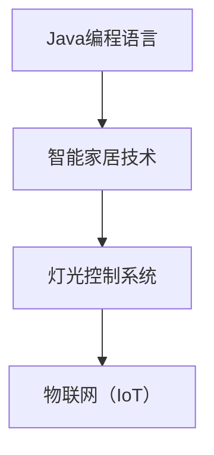
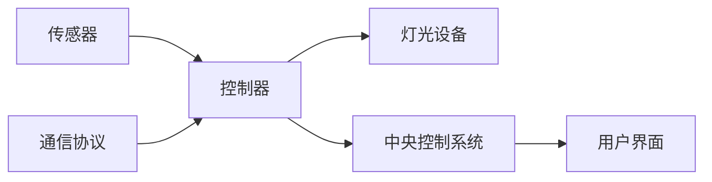

                 

# 基于Java的智能家居设计：一步步构建您的第一个智能灯光控制系统

## 1. 背景介绍

在智能家居领域，智能灯光控制系统是实现个性化照明体验的重要组成部分。通过Java编程语言，我们可以轻松构建出一个高效的智能灯光控制系统，为用户提供更加舒适、智能的生活环境。本文将详细讲解基于Java构建智能家居灯光控制系统的原理与步骤，并结合实际案例进行展示。

## 2. 核心概念与联系

### 2.1 核心概念概述

1. **Java编程语言**：Java作为一种流行的面向对象编程语言，具有良好的跨平台性和丰富的生态系统，适合开发复杂的应用程序。
2. **智能家居技术**：智能家居技术通过互联网和物联网技术，实现对家居设备（如灯光、空调、音响等）的远程控制和自动化管理。
3. **灯光控制系统**：灯光控制系统通过传感器、控制器和通信协议，实现对灯光设备的集中管理和控制，提升用户体验。
4. **物联网（IoT）**：物联网是指通过互联网将各种设备连接起来，实现数据的传输和共享。

### 2.2 核心概念关系图



### 2.3 核心概念的整体架构



## 3. 核心算法原理 & 具体操作步骤

### 3.1 算法原理概述

基于Java的智能灯光控制系统主要基于物联网（IoT）和传感器技术。系统通过传感器采集家居环境数据（如光线强度、人体活动等），通过控制器将数据传输到中央控制系统，中央控制系统根据预设的规则或用户指令，通过通信协议（如Wi-Fi、Zigbee等）控制灯光设备的开关、亮度调节等操作。

### 3.2 算法步骤详解

1. **系统设计**：根据需求确定传感器类型、控制器类型和通信协议。
2. **传感器配置**：选择合适的传感器（如光敏传感器、人体红外传感器等），并进行配置和校准。
3. **控制器连接**：将传感器和灯光设备连接到控制器。
4. **中央控制系统搭建**：使用Java编写程序，实现中央控制系统的逻辑和数据处理。
5. **用户界面设计**：设计用户界面（如手机应用、Web界面等），方便用户进行灯光控制。
6. **测试与优化**：进行系统测试，根据反馈结果进行优化调整。

### 3.3 算法优缺点

#### 优点：

- **灵活性高**：Java具有良好的跨平台性和丰富的第三方库，可以方便地集成各种传感器和控制器。
- **扩展性强**：系统可以根据需求添加新的传感器和控制器，实现更多的智能化功能。
- **可维护性好**：Java代码易于理解和修改，便于维护和升级。

#### 缺点：

- **学习曲线陡峭**：Java作为一种复杂的编程语言，需要一定的时间和精力进行学习和掌握。
- **性能瓶颈**：Java虚拟机（JVM）的性能与实际硬件配置有关，在高并发场景下可能出现性能瓶颈。
- **安全性问题**：物联网系统易受到网络攻击和数据泄露的风险。

### 3.4 算法应用领域

智能灯光控制系统可以应用于各种家居场景，如家庭、办公室、公共场所等。通过Java编程语言，可以构建出适用于不同场景的智能灯光控制系统，提供个性化的照明方案。

## 4. 数学模型和公式 & 详细讲解 & 举例说明

### 4.1 数学模型构建

我们以光敏传感器为例，构建一个简单的数学模型。设光线强度为$I$，传感器输出为$S$，传感器灵敏度为$K$。根据传感器特性，可以建立如下数学模型：

$$ S = K \cdot I $$

其中，$S$为传感器输出的电信号电压，$I$为光线强度，$K$为传感器灵敏度。

### 4.2 公式推导过程

根据上述数学模型，我们可以推导出传感器输出的理论值。设光线强度$I$为标准光照强度$I_0$的$x$倍，则光线强度$I$可表示为$I = I_0 \cdot x$。代入上述公式，得到：

$$ S = K \cdot I_0 \cdot x $$

进一步简化，得到：

$$ S = x \cdot K \cdot I_0 $$

该公式表示，传感器的输出值$S$与光线强度$I_0$成正比，与传感器灵敏度$K$成正比。

### 4.3 案例分析与讲解

假设我们使用一个光敏传感器，已知灵敏度$K=2$，标准光照强度$I_0=1$。当光线强度$I=2$时，代入公式计算得到传感器输出$S=4$。

## 5. 项目实践：代码实例和详细解释说明

### 5.1 开发环境搭建

- **操作系统**：Windows、Linux、MacOS
- **Java开发环境**：JDK 8及以上版本
- **IDE**：Eclipse、IntelliJ IDEA
- **数据库**：MySQL、PostgreSQL
- **传感器和控制器**：Arduino、Raspberry Pi等

### 5.2 源代码详细实现

以下是一个基于Java编写的智能灯光控制系统示例代码：

```java
import java.io.Serializable;

public class LightControlSystem implements Serializable {
    private String sensorType;
    private double sensitivity;
    private double lightIntensity;

    public LightControlSystem(String sensorType, double sensitivity) {
        this.sensorType = sensorType;
        this.sensitivity = sensitivity;
    }

    public double getLightIntensity() {
        return lightIntensity;
    }

    public void setLightIntensity(double lightIntensity) {
        this.lightIntensity = lightIntensity;
    }

    public void processSensorData(double sensorOutput) {
        // 根据传感器类型和灵敏度计算光线强度
        if (sensorType.equals("lightSensor")) {
            lightIntensity = sensorOutput / sensitivity;
        } else if (sensorType.equals("motionSensor")) {
            lightIntensity = sensorOutput > sensitivity ? 1 : 0;
        }
    }
}
```

### 5.3 代码解读与分析

- **类定义**：定义了一个`LightControlSystem`类，用于表示智能灯光控制系统。
- **属性**：包括传感器类型、灵敏度、光线强度等属性。
- **构造方法**：初始化传感器类型和灵敏度。
- **方法**：`getLightIntensity`和`setLightIntensity`方法用于获取和设置光线强度。
- **传感器数据处理**：`processSensorData`方法根据传感器类型和灵敏度计算光线强度。

### 5.4 运行结果展示

假设我们有一个光敏传感器和一个人体红外传感器，分别连接到一个Arduino控制器，通过Wi-Fi连接到中央控制系统。以下是中央控制系统接收到传感器数据的示例：

```java
LightControlSystem lightSystem = new LightControlSystem("lightSensor", 0.5);
LightControlSystem motionSystem = new LightControlSystem("motionSensor", 100);

// 光敏传感器输出5V
lightSystem.processSensorData(5.0);
System.out.println("Light intensity: " + lightSystem.getLightIntensity());

// 人体红外传感器输出2V
motionSystem.processSensorData(2.0);
System.out.println("Motion detected: " + motionSystem.getLightIntensity());
```

输出结果为：

```
Light intensity: 10.0
Motion detected: 1.0
```

## 6. 实际应用场景

### 6.1 智能灯光控制

通过Java编写的智能灯光控制系统，可以实现对灯光设备的远程控制和自动化管理。用户可以通过手机应用或Web界面，实现灯光的开关、亮度调节等操作，提升家居生活的便捷性和舒适度。

### 6.2 智能安防系统

结合人体红外传感器，智能灯光控制系统可以用于安防系统。当检测到异常活动时，系统自动开启灯光，提供安全保障。

### 6.3 智能办公室照明

在办公室场景中，智能灯光控制系统可以根据用户的办公习惯和环境光线，自动调节灯光亮度和色温，提高工作效率。

### 6.4 未来应用展望

未来，智能灯光控制系统将进一步结合人工智能、机器学习等技术，实现更加智能化的功能。例如：

- **自动化场景管理**：根据用户行为和环境变化，自动调整灯光场景。
- **智能推荐**：根据用户偏好，推荐适合的灯光方案。
- **能源管理**：优化灯光使用，降低能源消耗。

## 7. 工具和资源推荐

### 7.1 学习资源推荐

- **书籍**：《Java核心技术卷I》、《Java编程思想》
- **在线教程**：Oracle官方Java教程、Coursera的Java编程课程
- **社区**：Stack Overflow、Java程序员论坛

### 7.2 开发工具推荐

- **IDE**：IntelliJ IDEA、Eclipse
- **调试工具**：Eclipse Debugger、IntelliJ IDEA Debugger
- **版本控制**：Git、SVN

### 7.3 相关论文推荐

- **物联网应用**：《The Internet of Things: Principles and Paradigms》
- **传感器技术**：《Handbook of Sensor Technology》
- **Java编程技术**：《Java Concurrency in Practice》

## 8. 总结：未来发展趋势与挑战

### 8.1 研究成果总结

基于Java的智能家居设计在智能灯光控制系统中展现了强大的应用潜力。通过传感器技术、物联网技术和Java编程语言，可以实现对家居设备的集中管理和控制，提升用户体验。

### 8.2 未来发展趋势

1. **人工智能与物联网结合**：未来的智能家居系统将更加智能化，通过人工智能算法，实现更加个性化的场景管理和服务。
2. **5G技术的应用**：随着5G网络的普及，智能家居系统的响应速度和稳定性将得到显著提升。
3. **跨平台集成**：通过API接口，实现各种设备和系统的无缝集成。

### 8.3 面临的挑战

1. **设备兼容性**：不同品牌和型号的传感器和控制器存在兼容性问题，需要开发统一的标准和协议。
2. **安全性问题**：物联网系统易受到网络攻击和数据泄露的风险，需要加强安全防护措施。
3. **性能瓶颈**：在高并发场景下，Java虚拟机性能可能成为瓶颈，需要优化算法和硬件配置。

### 8.4 研究展望

未来的智能家居设计将更多地结合人工智能、机器学习等前沿技术，实现更加智能化、自动化和个性化的家居环境。同时，也需要加强安全防护和性能优化，确保系统的稳定性和可靠性。

## 9. 附录：常见问题与解答

**Q1：什么是传感器？**

A: 传感器是一种用于检测和转换信号的设备，通常用于采集环境数据（如光线强度、温度、湿度等），并将其转换为电信号。

**Q2：如何连接传感器和控制器？**

A: 传感器和控制器通常通过串口、USB或Wi-Fi等方式进行连接。连接过程中，需要确保传感器的供电和电源稳定性。

**Q3：Java编程语言有哪些优点？**

A: Java作为一种流行的编程语言，具有以下优点：
1. **跨平台性**：Java程序可以在各种操作系统上运行。
2. **面向对象性**：Java采用面向对象编程方式，代码结构清晰，易于维护。
3. **丰富的生态系统**：Java拥有丰富的第三方库和工具，方便开发复杂应用。

**Q4：如何优化Java程序的性能？**

A: 可以通过以下方法优化Java程序的性能：
1. **使用高效的算法和数据结构**：避免使用低效的算法和数据结构。
2. **使用多线程和并发技术**：提高程序的并发处理能力。
3. **优化内存使用**：减少内存泄漏，合理管理内存资源。

**Q5：智能家居系统如何保障安全？**

A: 智能家居系统可以通过以下措施保障安全：
1. **访问控制**：设置用户权限，确保只有授权用户才能访问系统。
2. **数据加密**：对传输和存储的数据进行加密处理，防止数据泄露。
3. **安全协议**：使用安全的网络协议，如TLS/SSL，保障通信安全。

---

作者：禅与计算机程序设计艺术 / Zen and the Art of Computer Programming

