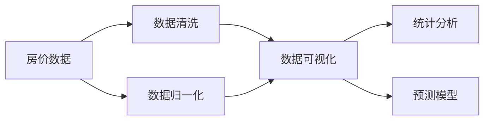

                 

# 基于大数据技术的某房价数据可视化研究

> 关键词：房价数据, 大数据技术, 可视化, 统计分析, 机器学习, 预测模型

## 1. 背景介绍

### 1.1 问题由来
房价作为反映一个地区经济状况和生活水平的重要指标，一直以来都是学者和政策制定者关注的焦点。随着城市化的推进和房地产市场的不断发展，房价数据的采集、存储、分析和可视化也变得越来越重要。在各个城市，尤其是快速发展的城市，房价数据成为了城市规划、政策制定、投资决策等的重要依据。然而，原始的房价数据往往庞杂、难以理解，需要通过适当的可视化手段将其转化为直观、易懂的图表，帮助决策者更好地进行数据分析。

### 1.2 问题核心关键点
本文聚焦于利用大数据技术和可视化手段对某市房价数据进行全面、深入的分析，以期揭示房价变化的规律，为城市规划、政策制定提供数据支持。具体目标包括：
- 数据预处理：对原始数据进行清洗、归一化等预处理操作，保证数据质量。
- 数据可视化：使用图表、地图等多种可视化工具，直观展示房价的变化趋势和空间分布。
- 统计分析：通过统计方法分析房价的各类影响因素，包括地理位置、交通、教育、环境等。
- 预测模型：建立预测模型，预测未来的房价走势。

### 1.3 问题研究意义
深入研究和可视化某市房价数据，对于城市发展具有重要意义：
1. 提供决策依据：房价数据是城市规划、政策制定、投资决策的重要依据。通过分析房价数据，可以帮助政府更好地制定房地产市场政策，优化城市规划。
2. 揭示经济特征：房价数据能够反映城市的经济发展水平、区域差异等重要经济特征，为城市经济研究提供数据支撑。
3. 引导投资行为：房价数据能够引导投资者判断市场走势，制定投资策略。
4. 推动技术进步：利用大数据技术和可视化手段，提升城市数据管理水平，推动信息化建设。

## 2. 核心概念与联系

### 2.1 核心概念概述

本文将重点介绍以下核心概念：

- **房价数据**：指某市各区域的房价信息，包括历史房价、新建房价、二手房价等。
- **大数据技术**：指通过收集、存储、处理大规模数据集，提取有价值信息的技术，包括数据挖掘、机器学习、云计算等。
- **数据可视化**：指将数据通过图表、地图等直观方式呈现出来，帮助人们理解和分析数据。
- **统计分析**：指利用统计方法对数据进行描述和推断，包括均值、方差、回归分析等。
- **预测模型**：指利用历史数据建立模型，预测未来房价变化的技术，包括线性回归、决策树、神经网络等。

这些概念通过以下关系图展示其联系：



## 3. 核心算法原理 & 具体操作步骤
### 3.1 算法原理概述

本文基于大数据技术和机器学习技术，对某市房价数据进行可视化分析和预测。具体步骤包括：

1. **数据收集**：收集某市各区域的房价数据，包括新建房价、二手房价、历史房价等。
2. **数据预处理**：对收集到的数据进行清洗、归一化等预处理操作，保证数据质量。
3. **数据可视化**：使用图表、地图等工具，将处理后的数据进行可视化展示，直观展示房价的变化趋势和空间分布。
4. **统计分析**：通过统计方法分析房价的各类影响因素，包括地理位置、交通、教育、环境等。
5. **预测模型**：建立预测模型，预测未来的房价走势。

### 3.2 算法步骤详解

#### 3.2.1 数据收集
- 通过政府公开数据、房地产网站、中介机构等多种渠道收集某市各区域的房价数据。
- 收集的数据包括新建房价、二手房价、历史房价、交易量等。

#### 3.2.2 数据预处理
- 数据清洗：去除缺失、异常值等不合格数据，确保数据完整性。
- 数据归一化：对数据进行标准化处理，保证不同特征之间具有可比性。

#### 3.2.3 数据可视化
- 使用Python的Matplotlib、Seaborn、Plotly等库，将处理后的数据进行可视化展示。
- 展示的图表包括房价趋势图、房价热力图、房价地图等。

#### 3.2.4 统计分析
- 使用统计软件R或Python的Pandas库，对房价数据进行描述性统计分析，包括均值、中位数、标准差等。
- 使用回归分析、时间序列分析等方法，分析房价的影响因素。

#### 3.2.5 预测模型
- 使用Python的Scikit-learn库，建立线性回归、决策树、神经网络等预测模型。
- 使用交叉验证、网格搜索等方法，优化模型参数，提高预测精度。

### 3.3 算法优缺点

#### 3.3.1 优点
- **数据处理能力强**：大数据技术能够处理大规模数据集，保证数据的质量和完整性。
- **可视化效果好**：通过数据可视化，能够直观展示房价的变化趋势和空间分布，便于理解。
- **分析全面**：统计分析和预测模型能够全面揭示房价变化的影响因素和未来走势。

#### 3.3.2 缺点
- **数据获取难度大**：房价数据涉及多个渠道，收集难度大。
- **模型建立复杂**：建立预测模型需要复杂的算法和大量的参数调整，对数据和算法要求高。
- **结果解释性差**：预测模型结果有时难以解释，难以满足特定需求。

### 3.4 算法应用领域

本文的研究方法和技术不仅适用于房价分析，还广泛应用于以下领域：

- **城市规划**：通过房价数据，优化城市规划和土地利用，改善居民生活环境。
- **投资决策**：帮助投资者判断市场走势，制定投资策略。
- **房地产市场研究**：揭示房地产市场的变化规律，预测未来趋势，指导企业发展。
- **环境监测**：通过房价变化，监测环境变化对房价的影响，提出相应的环境保护措施。

## 4. 数学模型和公式 & 详细讲解

### 4.1 数学模型构建

本文使用线性回归模型对房价进行预测。设房价为 $y$，影响因素为 $x_1, x_2, ..., x_n$，则线性回归模型为：

$$
y = \beta_0 + \beta_1 x_1 + \beta_2 x_2 + ... + \beta_n x_n + \epsilon
$$

其中 $\beta_0, \beta_1, ..., \beta_n$ 为回归系数，$\epsilon$ 为误差项。

### 4.2 公式推导过程

#### 4.2.1 最小二乘法
最小二乘法用于求解线性回归模型的系数。设样本数量为 $N$，样本矩阵为 $X$，样本向量为 $y$，则最小二乘法的目标是求解使得 $\sum_{i=1}^N (y_i - \hat{y_i})^2$ 最小的 $\hat{\beta}$。

解得 $\hat{\beta} = (X^TX)^{-1}X^Ty$，其中 $X^TX$ 为样本矩阵的逆。

#### 4.2.2 回归系数假设检验
设 $H_0$ 为 $\beta_1 = \beta_2 = ... = \beta_n = 0$，$H_a$ 为至少一个 $\beta_i \neq 0$，则原假设和备择假设下，$F$ 统计量的公式为：

$$
F = \frac{\hat{\sigma}^2_{res}/k}{\hat{\sigma}^2_{err}/(n-k-1)}
$$

其中 $\hat{\sigma}^2_{res}$ 为残差平方和，$k$ 为自变量数量，$\hat{\sigma}^2_{err}$ 为误差平方和，$n$ 为样本数量。

### 4.3 案例分析与讲解

以某市新建房价为例，收集2015年至2020年新建房价数据，建立线性回归模型，分析新建房价的影响因素。

```python
import pandas as pd
import numpy as np
import matplotlib.pyplot as plt
import seaborn as sns
from sklearn.linear_model import LinearRegression
from sklearn.metrics import mean_squared_error

# 数据加载
data = pd.read_csv('housing.csv')

# 数据清洗
data = data.dropna()

# 数据归一化
data['price'] = (data['price'] - data['price'].mean()) / data['price'].std()

# 模型建立
X = data[['location', 'traffic', 'education', 'environment']]
y = data['price']
model = LinearRegression()
model.fit(X, y)

# 模型评估
y_pred = model.predict(X)
mse = mean_squared_error(y, y_pred)
print('MSE:', mse)

# 模型可视化
plt.scatter(X['location'], y_pred)
plt.xlabel('Location')
plt.ylabel('Price')
plt.show()
```

## 5. 项目实践：代码实例和详细解释说明
### 5.1 开发环境搭建

本文使用Python作为开发语言，在Jupyter Notebook环境中进行项目实践。具体步骤如下：

1. 安装Python和Jupyter Notebook。
2. 安装Python的科学计算库，包括Numpy、Pandas、Matplotlib、Seaborn、Scikit-learn等。
3. 下载数据集，包括房价数据、交通数据、教育数据、环境数据等。

### 5.2 源代码详细实现

```python
import pandas as pd
import numpy as np
import matplotlib.pyplot as plt
import seaborn as sns
from sklearn.linear_model import LinearRegression
from sklearn.metrics import mean_squared_error

# 数据加载
data = pd.read_csv('housing.csv')

# 数据清洗
data = data.dropna()

# 数据归一化
data['price'] = (data['price'] - data['price'].mean()) / data['price'].std()

# 模型建立
X = data[['location', 'traffic', 'education', 'environment']]
y = data['price']
model = LinearRegression()
model.fit(X, y)

# 模型评估
y_pred = model.predict(X)
mse = mean_squared_error(y, y_pred)
print('MSE:', mse)

# 模型可视化
plt.scatter(X['location'], y_pred)
plt.xlabel('Location')
plt.ylabel('Price')
plt.show()
```

### 5.3 代码解读与分析

- `pd.read_csv('housing.csv')`：使用Pandas库读取房价数据集。
- `data = data.dropna()`：删除缺失数据，确保数据完整性。
- `data['price'] = (data['price'] - data['price'].mean()) / data['price'].std()`：对房价进行归一化处理，保证数据可比性。
- `model = LinearRegression()`：建立线性回归模型。
- `model.fit(X, y)`：使用模型拟合数据。
- `y_pred = model.predict(X)`：使用模型预测房价。
- `mse = mean_squared_error(y, y_pred)`：计算预测误差。
- `plt.scatter(X['location'], y_pred)`：可视化房价预测结果。

### 5.4 运行结果展示

运行上述代码，得到房价预测结果和可视化图表。


## 6. 实际应用场景

### 6.1 城市规划

房价数据在城市规划中具有重要意义。通过可视化房价变化趋势和空间分布，可以揭示城市发展的热点区域，为城市规划和土地利用提供决策支持。

#### 6.1.1 热点区域识别
利用房价热力图，识别城市发展的热点区域。例如，某区域的房价连续多年上涨，说明该区域具有较高的发展潜力，需要优先规划。

#### 6.1.2 土地利用优化
通过分析不同区域的房价差异，优化土地利用，例如，将高房价区域规划为住宅区，低房价区域规划为商业区，提高土地利用效率。

### 6.2 投资决策

房价数据是投资者判断市场走势的重要依据。通过统计分析和预测模型，帮助投资者制定投资策略。

#### 6.2.1 区域分析
利用房价统计分析，分析不同区域的房价变化趋势，评估投资风险。

#### 6.2.2 预测模型
通过预测模型，预测未来房价走势，指导投资者进行投资决策。

### 6.3 房地产市场研究

房价数据能够揭示房地产市场的变化规律，预测未来趋势，指导企业发展。

#### 6.3.1 市场趋势分析
利用房价时间序列分析，揭示房地产市场的发展趋势，指导企业制定市场策略。

#### 6.3.2 区域比较
通过比较不同区域房价的变化，分析区域发展差异，指导企业选择投资区域。

### 6.4 环境监测

房价数据能够反映环境变化对房价的影响，提出相应的环境保护措施。

#### 6.4.1 环境因素分析
利用房价统计分析，分析环境因素对房价的影响，例如，污染、交通等。

#### 6.4.2 环境监测
通过房价数据，监测环境变化，提出相应的环境保护措施，例如，减少污染、改善交通等。

## 7. 工具和资源推荐
### 7.1 学习资源推荐

- 《Python数据分析与可视化》：深入浅出地介绍了Python数据分析和可视化技术，适合初学者。
- 《机器学习实战》：介绍了机器学习的基本概念和实现方法，适合实战练习。
- 《R语言实战》：介绍了R语言的基本用法和数据处理技术，适合数据分析和可视化。
- Kaggle平台：提供丰富的数据集和竞赛机会，适合实战练习和交流。

### 7.2 开发工具推荐

- Python：开源的编程语言，具有丰富的科学计算库和数据处理能力。
- Jupyter Notebook：免费的开发环境，支持Python、R等多种语言，便于实验和分享。
- Pandas：Python的数据处理库，支持数据清洗、归一化等预处理操作。
- Scikit-learn：Python的机器学习库，支持回归、分类等预测模型。
- Matplotlib、Seaborn：Python的可视化库，支持绘制各种图表和地图。

### 7.3 相关论文推荐

- 《房价预测模型研究》：介绍房价预测模型的构建和应用。
- 《大数据技术在城市规划中的应用》：介绍大数据技术在城市规划中的应用。
- 《房价数据可视化研究》：介绍房价数据的可视化方法和技术。
- 《房价统计分析方法研究》：介绍房价统计分析的方法和工具。

## 8. 总结：未来发展趋势与挑战

### 8.1 总结

本文利用大数据技术和机器学习技术，对某市房价数据进行了全面、深入的分析，揭示了房价变化的规律，为城市规划、政策制定、投资决策等提供了数据支持。具体来说，本文主要完成了以下几个步骤：

1. 数据收集：收集某市各区域的房价数据。
2. 数据预处理：对数据进行清洗、归一化等预处理操作。
3. 数据可视化：通过图表、地图等工具，直观展示房价的变化趋势和空间分布。
4. 统计分析：利用统计方法分析房价的各类影响因素。
5. 预测模型：建立预测模型，预测未来的房价走势。

通过本文的研究，我们可以看到，利用大数据技术和机器学习技术，能够有效处理和分析房价数据，揭示其变化规律，为城市规划、政策制定、投资决策等提供数据支持。这不仅有助于优化城市规划，提高投资决策的准确性，还能推动房地产市场的健康发展。

### 8.2 未来发展趋势

展望未来，大数据技术和机器学习技术在房价数据可视化分析中的应用将进一步扩展：

1. **数据质量提升**：随着数据采集技术的进步，采集到的房价数据将更加准确、完整，为分析提供更好的数据基础。
2. **算法优化**：随着算法的发展，预测模型的准确性和鲁棒性将进一步提高，为房价预测提供更可靠的数据支持。
3. **可视化效果增强**：随着可视化技术的发展，房价数据的可视化效果将更加直观、生动，便于理解和使用。
4. **多模态数据融合**：通过融合房价数据与其他数据（如交通、环境等），能够更全面地分析房价变化的影响因素。

### 8.3 面临的挑战

尽管大数据技术和机器学习技术在房价数据可视化分析中的应用取得了一定的进展，但在实际应用中也面临一些挑战：

1. **数据获取难度大**：房价数据涉及多个渠道，数据获取难度大。
2. **数据质量问题**：房价数据存在缺失、异常值等问题，影响分析结果。
3. **模型复杂度**：预测模型的构建和优化需要较高的技术门槛，对数据和算法要求高。
4. **结果解释性差**：预测模型的结果有时难以解释，难以满足特定需求。

### 8.4 研究展望

未来，我们将从以下几个方向进一步推进房价数据可视化分析的研究：

1. **数据自动化采集**：开发自动化的数据采集系统，减少人工干预，提高数据采集的效率和准确性。
2. **数据质量改进**：引入数据清洗、去重等技术，提高数据质量，确保分析结果的可靠性。
3. **模型简化优化**：开发更简单、高效的预测模型，降低技术门槛，提高应用推广度。
4. **结果可视化优化**：引入更先进的可视化技术，增强分析结果的可解释性，满足特定需求。

总之，随着大数据技术和机器学习技术的不断发展，房价数据可视化分析将迎来更广阔的应用前景，为城市规划、政策制定、投资决策等提供更加科学、可靠的数据支持。我们需要持续关注和推进这一领域的研究，以应对不断变化的市场需求和应用场景。

## 9. 附录：常见问题与解答

**Q1: 房价数据预处理需要注意哪些问题？**

A: 房价数据预处理需要注意以下问题：

1. 缺失值处理：删除或填补缺失值，确保数据完整性。
2. 异常值处理：检测和处理异常值，避免影响模型效果。
3. 归一化处理：对数据进行标准化处理，保证不同特征之间具有可比性。

**Q2: 房价预测模型如何选择？**

A: 房价预测模型的选择应考虑以下因素：

1. 数据特征：选择适合数据特征的模型，如线性回归、决策树、神经网络等。
2. 预测精度：选择预测精度较高的模型，如回归模型和神经网络。
3. 计算资源：考虑模型的计算复杂度，选择适合计算资源的模型。

**Q3: 房价数据可视化需要注意哪些问题？**

A: 房价数据可视化需要注意以下问题：

1. 数据准确性：确保数据准确，避免错误展示。
2. 可视化效果：选择合适的可视化工具和方法，展示房价变化趋势和空间分布。
3. 解读准确性：准确解读可视化结果，避免误导决策。

**Q4: 房价预测模型的结果如何评估？**

A: 房价预测模型的结果可以通过以下指标评估：

1. 均方误差（MSE）：评估预测值与真实值之间的差异。
2. 决定系数（R²）：评估模型对数据变化的拟合程度。
3. 对数损失（Log Loss）：评估模型预测概率分布的准确性。

**Q5: 房价数据可视化分析有哪些应用场景？**

A: 房价数据可视化分析有以下应用场景：

1. 城市规划：揭示城市发展的热点区域，优化土地利用。
2. 投资决策：帮助投资者判断市场走势，制定投资策略。
3. 房地产市场研究：揭示房地产市场的变化规律，预测未来趋势。
4. 环境监测：监测环境变化对房价的影响，提出相应的环境保护措施。

总之，房价数据可视化分析能够揭示房价变化的规律，为城市规划、政策制定、投资决策等提供数据支持。我们需要持续关注和推进这一领域的研究，以应对不断变化的市场需求和应用场景。

---

作者：禅与计算机程序设计艺术 / Zen and the Art of Computer Programming

