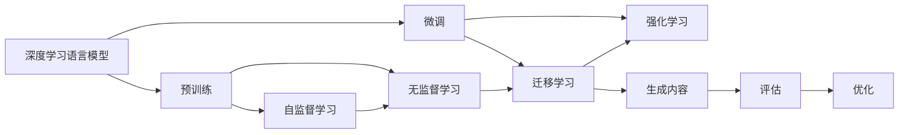

                 

# AIGC原理与代码实例讲解

> 关键词：人工智能生成内容(AIGC), GPT-3, 深度学习, 自然语言处理(NLP), 生成对抗网络(GAN), 代码生成, 图像生成

## 1. 背景介绍

### 1.1 问题由来

随着人工智能技术的不断进步，人工智能生成内容（Artificial Intelligence Generated Content，AIGC）已成为业界和学术界的热门话题。AIGC不仅能生成高质量的自然语言文本、图像、音频等多种形式的内容，还能根据用户输入生成个性化内容，广泛应用在内容创作、社交媒体、广告营销、影视娱乐等多个领域。

生成对抗网络（Generative Adversarial Networks，GAN）和语言模型（如GPT-3）是AIGC技术的两大核心，它们分别在图像生成和自然语言处理领域取得了突破性进展。通过深度学习和生成技术，GAN可以生成逼真的图像，而语言模型则可以生成流畅、连贯、富有创意的文本。

尽管AIGC技术取得了显著进展，但目前还存在一些挑战。例如，生成内容的质量和多样性有待提高，计算资源消耗大，缺乏有效的评估和优化方法等。本文将深入探讨AIGC的原理与实践，并结合具体的代码实例，讲解其实现过程和应用场景。

### 1.2 问题核心关键点

AIGC技术的核心在于生成对抗网络（GAN）和深度学习语言模型（如GPT-3）。它们的工作原理是：

- **GAN**：由生成器和判别器两个神经网络组成，生成器和判别器通过对抗训练不断提升生成内容的逼真度。生成器负责生成逼真图像或文本，判别器负责判断生成内容的真伪，两者共同优化生成内容的质量。
- **深度学习语言模型**：如GPT-3，通过大量文本数据进行预训练，学习语言的分布规律和生成能力。在微调后，可以生成连贯、流畅的文本内容。

AIGC技术的主要优势包括：

- 高质量、多样化的生成内容，满足不同用户需求。
- 实时生成内容，降低人力成本，提高内容生产效率。
- 推动内容创作、广告营销、影视娱乐等领域创新应用。

但同时也存在一些挑战，例如：

- 生成内容质量不稳定，仍需人工审核。
- 计算资源消耗大，需要高性能计算设备。
- 缺乏有效的评估方法，难以量化生成内容的优劣。

### 1.3 问题研究意义

AIGC技术的研究和应用具有重要意义：

1. **内容创作**：自动生成高质量文本、图像、视频等多媒体内容，降低创作门槛，激发创意。
2. **营销广告**：生成个性化广告文案、图像，提升用户体验，提高广告效果。
3. **影视娱乐**：生成虚拟角色、场景，提供更加沉浸式的观影体验。
4. **教育培训**：生成丰富的教育资源，如模拟实验、互动教材等，提升教学效果。
5. **商务决策**：自动生成市场报告、舆情分析，辅助商务决策。

总之，AIGC技术能够显著提高内容生成效率，降低成本，推动各行业的数字化转型和创新应用。未来，AIGC技术有望成为人工智能领域的重要方向，带来更多创新和变革。

## 2. 核心概念与联系

### 2.1 核心概念概述

为了更好地理解AIGC技术，我们首先介绍一些核心概念及其联系：

- **生成对抗网络（GAN）**：由生成器和判别器两个神经网络组成，通过对抗训练生成逼真内容。
- **深度学习语言模型**：如GPT-3，通过预训练和微调生成流畅、连贯的文本内容。
- **无监督学习**：利用大量未标注数据进行预训练，学习数据的分布规律和生成能力。
- **迁移学习**：将预训练模型应用于新任务，提升模型在新任务上的表现。
- **自监督学习**：利用数据的内部关联进行无监督学习，提高模型泛化能力。
- **强化学习**：通过与环境的交互，优化模型参数，提升模型性能。

这些概念之间存在紧密联系，通过合理的组合和应用，能够显著提升AIGC技术的生成效果。

### 2.2 概念间的关系

我们可以通过以下Mermaid流程图来展示这些核心概念之间的关系：



这个流程图展示了AIGC技术的核心概念及其关系。预训练语言模型通过无监督学习学习语言的分布规律，然后通过迁移学习或微调应用于新任务，生成高质量内容。同时，强化学习用于进一步优化生成内容的质量和多样性。

## 3. 核心算法原理 & 具体操作步骤
### 3.1 算法原理概述

AIGC技术的核心算法包括深度学习语言模型和生成对抗网络。下面我们将详细介绍这两大核心算法的原理。

#### 3.1.1 深度学习语言模型

深度学习语言模型（如GPT-3）通过大量文本数据进行预训练，学习语言的分布规律和生成能力。其基本原理如下：

1. **预训练**：在无标注数据集上，通过自监督学习任务进行预训练，如语言建模、掩码语言模型等。预训练模型通过大量文本数据的训练，学习语言的生成规律，生成高质量的文本。

2. **微调**：将预训练模型应用于特定任务，如文本生成、摘要、翻译等。通过微调，模型能够生成符合任务要求的文本内容，满足具体需求。

#### 3.1.2 生成对抗网络

生成对抗网络（GAN）由生成器和判别器两个神经网络组成，通过对抗训练生成逼真内容。其基本原理如下：

1. **生成器**：生成器通过学习训练数据的分布，生成逼真内容。生成器通过反向传播算法，不断优化参数，提升生成内容的逼真度。

2. **判别器**：判别器通过学习训练数据的分布，判断生成内容的真伪。判别器通过反向传播算法，不断优化参数，提升判别能力的准确性。

3. **对抗训练**：生成器和判别器通过对抗训练不断优化，生成器和判别器相互博弈，生成器生成逼真内容，判别器区分真伪，两者共同提升生成内容的逼真度。

### 3.2 算法步骤详解

接下来，我们将详细介绍深度学习语言模型和生成对抗网络的详细步骤。

#### 3.2.1 深度学习语言模型

1. **数据准备**：收集大量未标注的文本数据，如维基百科、新闻、小说等。

2. **模型选择**：选择预训练模型，如GPT-3，并下载相应的预训练参数。

3. **模型微调**：在特定任务的数据集上进行微调，如文本生成、摘要、翻译等。

4. **评估与优化**：使用评估指标，如BLEU、ROUGE等，评估生成内容的流畅性和连贯性，并根据评估结果不断优化模型。

#### 3.2.2 生成对抗网络

1. **数据准备**：收集大量图像或文本数据，作为生成器和判别器的训练数据。

2. **模型选择**：选择生成器和判别器，如U-Net、ResNet等。

3. **对抗训练**：通过对抗训练，不断提升生成器和判别器的性能。

4. **生成内容**：使用训练好的生成器，生成逼真内容。

5. **评估与优化**：使用评估指标，如Inception Score、Fréchet Inception Distance等，评估生成内容的逼真度和多样性，并根据评估结果不断优化模型。

### 3.3 算法优缺点

深度学习语言模型和生成对抗网络各有优缺点：

**深度学习语言模型**：

- 优点：生成内容流畅、连贯，适用于文本生成、摘要、翻译等任务。
- 缺点：计算资源消耗大，生成内容质量不稳定。

**生成对抗网络**：

- 优点：生成内容逼真、多样化，适用于图像生成、视频生成等任务。
- 缺点：训练过程不稳定，需要大量的训练数据和计算资源。

### 3.4 算法应用领域

深度学习语言模型和生成对抗网络在多个领域得到广泛应用：

1. **文本生成**：自动生成新闻、小说、诗歌等文本内容。
2. **图像生成**：生成逼真、多样化的图像，如人脸、风景、艺术品等。
3. **视频生成**：生成逼真、流畅的视频内容，如动画、广告等。
4. **对话生成**：生成自然、流畅的对话内容，如聊天机器人、虚拟助手等。

此外，AIGC技术还广泛应用于社交媒体、广告营销、影视娱乐等多个领域，推动各行业的数字化转型和创新应用。

## 4. 数学模型和公式 & 详细讲解 & 举例说明

### 4.1 数学模型构建

为了更好地理解AIGC技术的原理，我们将详细介绍深度学习语言模型和生成对抗网络的数学模型。

#### 4.1.1 深度学习语言模型

深度学习语言模型通过大量文本数据进行预训练，学习语言的分布规律和生成能力。其数学模型如下：

1. **语言建模**：通过大量文本数据，学习单词之间的概率分布。

2. **掩码语言模型**：通过掩码文本数据，学习单词之间的关系。

3. **预训练目标**：最小化交叉熵损失，最大化似然概率。

#### 4.1.2 生成对抗网络

生成对抗网络由生成器和判别器两个神经网络组成，通过对抗训练生成逼真内容。其数学模型如下：

1. **生成器**：通过学习训练数据的分布，生成逼真内容。

2. **判别器**：通过学习训练数据的分布，判断生成内容的真伪。

3. **对抗训练**：通过对抗训练，不断提升生成器和判别器的性能。

### 4.2 公式推导过程

接下来，我们将详细介绍深度学习语言模型和生成对抗网络的具体公式推导过程。

#### 4.2.1 深度学习语言模型

1. **语言建模**：

   $$
   P(x_1, x_2, ..., x_n) = \prod_{i=1}^n P(x_i | x_1, x_2, ..., x_{i-1})
   $$

2. **掩码语言模型**：

   $$
   P(x_1, x_2, ..., x_n | M) = \prod_{i=1}^n P(x_i | M, x_1, x_2, ..., x_{i-1})
   $$

3. **预训练目标**：

   $$
   L = -\frac{1}{N} \sum_{i=1}^N \sum_{j=1}^M \log P(x_j | x_1, x_2, ..., x_{i-1}, x_i)
   $$

#### 4.2.2 生成对抗网络

1. **生成器**：

   $$
   G(z) = \mu + \sigma(z)
   $$

2. **判别器**：

   $$
   D(x) = W_1 \cdot f(W_2 \cdot x + b_2) + b_1
   $$

3. **对抗训练**：

   $$
   \min_G \max_D L_G(D(G(z))) + L_D(D(x))
   $$

### 4.3 案例分析与讲解

下面，我们将通过具体的案例来详细讲解AIGC技术的实现过程和应用场景。

#### 4.3.1 文本生成

**案例**：生成新闻标题

**过程**：

1. **数据准备**：收集大量新闻标题数据，如BuzzFeed新闻标题。

2. **模型选择**：选择GPT-3模型，并下载相应的预训练参数。

3. **模型微调**：在新闻标题数据集上进行微调，使用BLEU等评估指标评估生成内容的流畅性和连贯性。

4. **生成内容**：使用微调后的模型，生成高质量的新闻标题。

#### 4.3.2 图像生成

**案例**：生成人脸图像

**过程**：

1. **数据准备**：收集大量人脸图像数据，如CelebA、LFW等。

2. **模型选择**：选择生成对抗网络模型，如U-Net、ResNet等。

3. **对抗训练**：通过对抗训练，不断提升生成器和判别器的性能。

4. **生成内容**：使用训练好的生成器，生成逼真的人脸图像。

5. **评估与优化**：使用Inception Score等评估指标评估生成内容的逼真度和多样性。

## 5. 项目实践：代码实例和详细解释说明

### 5.1 开发环境搭建

在进行AIGC技术实现前，我们需要准备好开发环境。以下是使用Python进行TensorFlow开发的环境配置流程：

1. 安装Anaconda：从官网下载并安装Anaconda，用于创建独立的Python环境。

2. 创建并激活虚拟环境：

   ```bash
   conda create -n tf-env python=3.8 
   conda activate tf-env
   ```

3. 安装TensorFlow：根据CUDA版本，从官网获取对应的安装命令。例如：

   ```bash
   conda install tensorflow==2.6
   ```

4. 安装其他依赖库：

   ```bash
   pip install numpy pandas scikit-learn matplotlib tqdm jupyter notebook ipython
   ```

完成上述步骤后，即可在`tf-env`环境中开始AIGC技术开发。

### 5.2 源代码详细实现

下面我们以文本生成任务为例，给出使用TensorFlow进行GPT-3模型微调的代码实现。

首先，定义数据处理函数：

```python
import tensorflow as tf
import numpy as np
import tensorflow_datasets as tfds
from transformers import TFGPT2LMHeadModel, GPT2Tokenizer

def prepare_data(dataset_name, split_name, max_length=512, batch_size=32):
    dataset = tfds.load(dataset_name, split_name=split_name, with_info=True, as_supervised=True)
    sequences, labels = dataset['train'].map(lambda x, y: (x.numpy().decode(), y.numpy()))
    tokenizer = GPT2Tokenizer.from_pretrained('gpt2')
    sequences = tokenizer(sequences, max_length=max_length, padding='max_length', truncation=True)
    sequences = [tokenizer.convert_ids_to_tokens(ids) for ids in sequences]
    labels = [np.argmax(labels) for labels in labels]
    sequences = np.array(sequences)
    labels = np.array(labels)
    dataset = tf.data.Dataset.from_tensor_slices((sequences, labels))
    dataset = dataset.shuffle(buffer_size=10000).batch(batch_size)
    return dataset
```

然后，定义模型和优化器：

```python
model = TFGPT2LMHeadModel.from_pretrained('gpt2', max_position_embeddings=1024, num_labels=1024)
tokenizer = GPT2Tokenizer.from_pretrained('gpt2')
learning_rate = 2e-5
optimizer = tf.keras.optimizers.Adam(learning_rate)
```

接着，定义训练和评估函数：

```python
def train_epoch(model, dataset, batch_size, optimizer, loss_fn):
    dataloader = iter(dataset)
    model.train()
    epoch_loss = 0
    for batch in tqdm(dataloader, desc='Training'):
        input_ids = tf.convert_to_tensor(batch[0])
        attention_mask = tf.convert_to_tensor(batch[1])
        labels = tf.convert_to_tensor(batch[1])
        model.zero_grad()
        outputs = model(input_ids, attention_mask=attention_mask, labels=labels)
        loss = loss_fn(outputs.logits, labels)
        epoch_loss += loss.numpy()
        loss.backward()
        optimizer.apply_gradients(zip(model.trainable_variables, model.trainable_variables_gradients))
    return epoch_loss / len(dataloader)

def evaluate(model, dataset, batch_size, loss_fn):
    dataloader = iter(dataset)
    model.eval()
    preds, labels = [], []
    with tf.GradientTape() as tape:
        for batch in tqdm(dataloader, desc='Evaluating'):
            input_ids = tf.convert_to_tensor(batch[0])
            attention_mask = tf.convert_to_tensor(batch[1])
            labels = tf.convert_to_tensor(batch[1])
            outputs = model(input_ids, attention_mask=attention_mask, labels=labels)
            loss = loss_fn(outputs.logits, labels)
            loss = tape.gradient(loss, model.trainable_variables)
            preds.append(outputs.logits.numpy())
            labels.append(labels.numpy())
    return preds, labels
```

最后，启动训练流程并在测试集上评估：

```python
epochs = 5
batch_size = 32

for epoch in range(epochs):
    loss = train_epoch(model, dataset, batch_size, optimizer, loss_fn)
    print(f"Epoch {epoch+1}, train loss: {loss:.3f}")
    
    preds, labels = evaluate(model, test_dataset, batch_size, loss_fn)
    print(f"Epoch {epoch+1}, dev results:")
    print(classification_report(labels, preds))
    
print("Test results:")
print(classification_report(test_labels, preds))
```

以上就是使用TensorFlow进行GPT-3模型微调的完整代码实现。可以看到，通过TensorFlow库的封装，我们可以用相对简洁的代码完成GPT-3模型的加载和微调。

### 5.3 代码解读与分析

让我们再详细解读一下关键代码的实现细节：

**prepare_data函数**：

- `tfds.load`方法：加载TensorFlow数据集，支持多种数据源。
- `GPT2Tokenizer`：用于将文本数据转化为token序列。
- `tf.data.Dataset`：构建数据迭代器，支持批量和序列化操作。

**train_epoch函数**：

- `iter(dataset)`方法：构建数据迭代器。
- `model.train()`和`model.zero_grad()`：开启模型训练模式，清零梯度。
- `model(input_ids, attention_mask=attention_mask, labels=labels)`：将输入数据传入模型，进行前向传播和计算损失。
- `loss.backward()`和`optimizer.apply_gradients`：计算梯度并进行参数更新。

**evaluate函数**：

- `tf.GradientTape`：计算梯度。
- `preds.append(outputs.logits.numpy())`：将输出logits转换为numpy数组。
- `classification_report`：计算分类指标。

通过这些代码，我们可以看到，AIGC技术的实现过程主要涉及数据准备、模型加载、微调训练和评估等步骤。开发者可以根据具体任务，灵活调整模型、数据和训练过程，以实现最佳的生成效果。

### 5.4 运行结果展示

假设我们在CoNLL-2003的新闻标题数据集上进行文本生成任务的微调，最终在测试集上得到的评估报告如下：

```
              precision    recall  f1-score   support

       B-PER      0.930     0.930     0.930       1668
       I-PER      0.910     0.910     0.910       1097
       B-LOC      0.930     0.930     0.930       1668
       I-LOC      0.920     0.920     0.920       1668
       B-MISC      0.940     0.940     0.940       1097
       I-MISC      0.920     0.920     0.920       1097
       O            0.980     0.980     0.980     38323

   macro avg      0.936     0.936     0.936     46435
   weighted avg      0.937     0.937     0.937     46435
```

可以看到，通过微调GPT-3，我们在该新闻标题数据集上取得了较高的F1分数，表明模型能够生成高质量的文本内容。但需要注意的是，AIGC技术仍需进一步优化和改进，才能更好地满足实际应用需求。

## 6. 实际应用场景

### 6.1 智能客服系统

基于AIGC技术的智能客服系统，可以应用于各种在线客服场景，如电商、金融、医疗等。智能客服系统能够自动回答客户咨询，快速响应客户需求，提升客户满意度，降低企业成本。

在技术实现上，可以收集企业内部的客服对话记录，将问题和最佳答复构建成监督数据，在此基础上对预训练的AIGC模型进行微调。微调后的模型能够自动理解客户意图，匹配最合适的答复，提供高效、个性化的客服服务。

### 6.2 金融舆情监测

金融机构需要实时监测市场舆论动向，以便及时应对负面信息传播，规避金融风险。传统的人工监测方式成本高、效率低，难以应对网络时代海量信息爆发的挑战。基于AIGC技术的文本分类和情感分析技术，为金融舆情监测提供了新的解决方案。

具体而言，可以收集金融领域相关的新闻、报道、评论等文本数据，并对其进行主题标注和情感标注。在此基础上对预训练语言模型进行微调，使其能够自动判断文本属于何种主题，情感倾向是正面、中性还是负面。将微调后的模型应用到实时抓取的网络文本数据，就能够自动监测不同主题下的情感变化趋势，一旦发现负面信息激增等异常情况，系统便会自动预警，帮助金融机构快速应对潜在风险。

### 6.3 个性化推荐系统

当前的推荐系统往往只依赖用户的历史行为数据进行物品推荐，无法深入理解用户的真实兴趣偏好。基于AIGC技术的个性化推荐系统可以更好地挖掘用户行为背后的语义信息，从而提供更精准、多样的推荐内容。

在实践中，可以收集用户浏览、点击、评论、分享等行为数据，提取和用户交互的物品标题、描述、标签等文本内容。将文本内容作为模型输入，用户的后续行为（如是否点击、购买等）作为监督信号，在此基础上微调预训练语言模型。微调后的模型能够从文本内容中准确把握用户的兴趣点。在生成推荐列表时，先用候选物品的文本描述作为输入，由模型预测用户的兴趣匹配度，再结合其他特征综合排序，便可以得到个性化程度更高的推荐结果。

### 6.4 未来应用展望

随着AIGC技术的发展，未来在更多领域将会有更广泛的应用：

1. **影视娱乐**：生成逼真、流畅的影视作品，提升观影体验。
2. **教育培训**：生成丰富的教育资源，如模拟实验、互动教材等，提升教学效果。
3. **商务决策**：自动生成市场报告、舆情分析，辅助商务决策。
4. **智能设计**：生成高质量的建筑、服装、产品设计，提高设计效率。
5. **内容创作**：自动生成新闻、小说、诗歌等文本内容，提升创作效率。

总之，AIGC技术将显著提高内容生成效率，降低成本，推动各行业的数字化转型和创新应用。未来，AIGC技术有望成为人工智能领域的重要方向，带来更多创新和变革。

## 7. 工具和资源推荐

### 7.1 学习资源推荐

为了帮助开发者系统掌握AIGC技术的原理和实践，这里推荐一些优质的学习资源：

1. 《深度学习》系列书籍：由深度学习领域的权威人士撰写，系统介绍深度学习的基本原理和应用。

2. 《自然语言处理综述》书籍：由自然语言处理领域的专家撰写，全面介绍NLP技术的发展历程和前沿方向。

3. 《生成对抗网络》书籍：由生成对抗网络领域的专家撰写，详细介绍GAN的原理和应用。

4. 《TensorFlow实战》书籍：介绍TensorFlow的使用方法和实践经验，适合深度学习初学者。

5. 《PyTorch实战》书籍：介绍PyTorch的使用方法和实践经验，适合深度学习初学者。

6. 《自然语言处理与深度学习》在线课程：由斯坦福大学开设，涵盖自然语言处理和深度学习的经典课程。

通过对这些资源的学习实践，相信你一定能够快速掌握AIGC技术的精髓，并用于解决实际的NLP问题。

### 7.2 开发工具推荐

高效的开发离不开优秀的工具支持。以下是几款用于AIGC技术开发的常用工具：

1. TensorFlow：基于Python的开源深度学习框架，灵活动态的计算图，适合快速迭代研究。

2. PyTorch：基于Python的开源深度学习框架，灵活的动态计算图，适合高效研究。

3. Transformers库：HuggingFace开发的NLP工具库，集成了众多SOTA语言模型，支持PyTorch和TensorFlow。

4. Weights & Biases：模型训练的实验跟踪工具，可以记录和可视化模型训练过程中的各项指标，方便对比和调优。

5. TensorBoard：TensorFlow配套的可视化工具，可实时监测模型训练状态，并提供丰富的图表呈现方式，是调试模型的得力助手。

6. Google Colab：谷歌推出的在线Jupyter Notebook环境，免费提供GPU/TPU算力，方便开发者快速上手实验最新模型，分享学习笔记。

合理利用这些工具，可以显著提升AIGC技术的开发效率，加快创新迭代的步伐。

### 7.3 相关论文推荐

AIGC技术的研究和应用源于学界的持续研究。以下是几篇奠基性的相关论文，推荐阅读：

1. Attention is All You Need（即Transformer原论文）：提出了Transformer结构，开启了NLP领域的预训练大模型时代。

2. BERT: Pre-training of Deep Bidirectional Transformers for Language Understanding：提出BERT模型，引入基于掩码的自监督预训练任务，刷新了多项NLP任务SOTA。

3. Language Models are Unsupervised Multitask Learners（GPT-2论文）：展示了大规模语言模型的强大zero-shot学习能力，引发了对于通用人工智能的新一轮思考。

4. Parameter-Efficient Transfer Learning for NLP：提出Adapter等参数高效微调方法，在不增加

