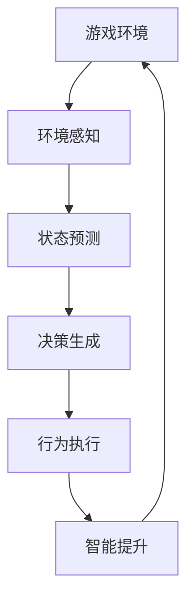
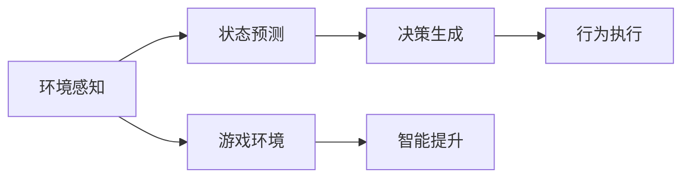
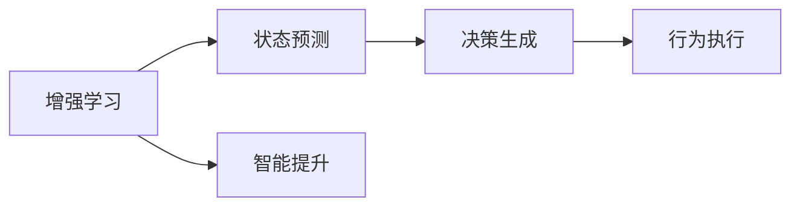
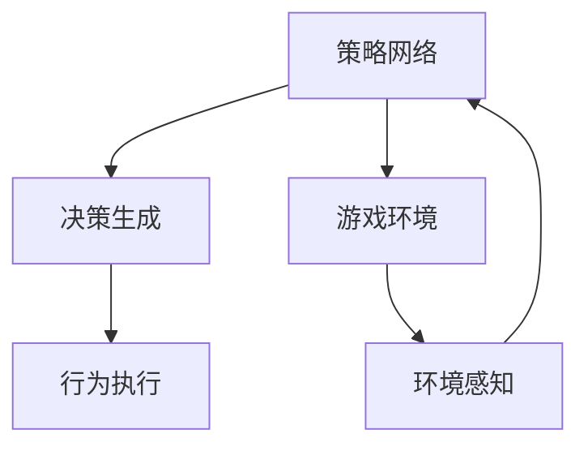
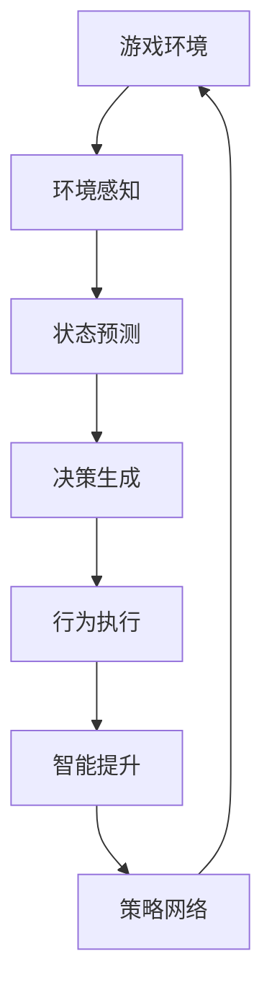

                 

# AI人工智能代理工作流AI Agent WorkFlow：AI代理在视频游戏中的自适应机制

> 关键词：AI代理, 自适应, 视频游戏, 游戏设计, 实时决策, 游戏AI, 增强学习, 仿真模拟

## 1. 背景介绍

### 1.1 问题由来
随着人工智能(AI)技术的迅猛发展，游戏行业成为AI应用最活跃的领域之一。视频游戏中的AI代理(AI Agent)用于模拟游戏角色的决策过程，驱动游戏情节发展，提升玩家体验。传统游戏AI代理通常使用基于规则或预设行为库的策略，难以应对复杂多变的游戏环境，无法实现动态自适应，影响游戏智能水平和沉浸感。

为应对这一挑战，近年来，越来越多的研究者开始关注利用机器学习和增强学习(Reinforcement Learning, RL)技术进行自适应AI代理设计，以便使AI代理在特定环境下展现出更加智能的行为。本文聚焦于视频游戏领域，介绍AI代理工作流的设计思路和实现方法，以期为游戏AI代理的创新提供参考。

### 1.2 问题核心关键点
本节将介绍AI代理在视频游戏中的设计核心关键点：

1. 视频游戏AI代理的工作流模型：包括环境感知、状态预测、决策生成和行为执行。
2. 环境感知模块：获取游戏环境信息，如角色位置、视角、时间、天气等。
3. 状态预测模块：利用强化学习等技术，预测环境变化和目标位置。
4. 决策生成模块：通过奖励机制和策略网络，生成符合目标的行动决策。
5. 行为执行模块：将决策转换为角色行为，完成游戏任务。
6. 智能提升：通过奖励机制、策略调整和仿真模拟，不断优化AI代理性能。

### 1.3 问题研究意义
通过智能自适应游戏AI代理设计，可以大幅提升游戏的智能度和沉浸感，减少对游戏开发者的依赖，降低游戏开发的成本，加速游戏迭代更新，提升玩家体验。此外，自适应AI代理还将在虚拟仿真、智能制造、智能交通等领域产生广泛的应用前景。

## 2. 核心概念与联系

### 2.1 核心概念概述

为更好地理解视频游戏中AI代理的设计思路，本节将介绍几个关键概念：

- AI代理(AI Agent)：在视频游戏中模拟角色的决策行为，驱动游戏剧情，增强游戏智能化程度。
- 强化学习(Reinforcement Learning)：通过学习游戏环境中的奖励反馈，优化决策策略，实现智能自适应。
- 游戏AI(AI in Games)：利用AI技术实现游戏角色的自主行为和交互，提升游戏体验。
- 自适应(Autonomous Adaptive)：指AI代理能够在动态变化的游戏环境中，实时调整决策行为，保持最佳表现。
- 游戏环境(Gaming Environment)：包括游戏地图、物理引擎、角色行为等，AI代理通过对环境的感知和学习，实现自适应。
- 策略网络(Strategy Network)：利用神经网络等机器学习模型，学习并生成游戏决策策略，驱动AI代理行为。

这些核心概念之间的逻辑关系可以通过以下Mermaid流程图来展示：



这个流程图展示了大语言模型微调过程中各个核心概念的关系和作用：

1. 游戏环境通过环境感知模块，向AI代理提供实时信息。
2. 状态预测模块利用增强学习等技术，预测环境变化和目标位置。
3. 决策生成模块通过策略网络生成行动决策。
4. 行为执行模块将决策转化为角色行为，实现游戏任务。
5. 智能提升模块通过仿真模拟和策略调整，不断优化AI代理性能。

### 2.2 概念间的关系

这些核心概念之间存在着紧密的联系，形成了AI代理设计的完整生态系统。下面我通过几个Mermaid流程图来展示这些概念之间的关系。

#### 2.2.1 AI代理工作流设计



这个流程图展示了AI代理工作流的设计流程：

1. 环境感知模块从游戏环境中获取信息。
2. 状态预测模块基于环境信息，预测未来环境变化。
3. 决策生成模块利用预测结果，生成决策策略。
4. 行为执行模块执行决策策略，完成游戏任务。
5. 智能提升模块根据任务完成情况，调整决策策略。

#### 2.2.2 增强学习与AI代理的关系



这个流程图展示了增强学习对AI代理的影响：

1. 增强学习通过奖励机制，优化决策策略。
2. 策略网络生成预测结果，用于决策生成。
3. 行为执行模块执行决策，获取奖励反馈。
4. 智能提升模块根据奖励反馈，调整策略网络参数。

#### 2.2.3 策略网络在AI代理中的应用



这个流程图展示了策略网络在AI代理中的应用：

1. 策略网络接收环境感知信息。
2. 策略网络学习并生成决策策略。
3. 决策生成模块使用策略网络输出，生成行动决策。
4. 行为执行模块执行决策策略，完成任务。

### 2.3 核心概念的整体架构

最后，我们用一个综合的流程图来展示这些核心概念在大语言模型微调过程中的整体架构：



这个综合流程图展示了从环境感知到智能提升的完整过程。通过环境感知，AI代理获取游戏信息，在状态预测模块中利用增强学习等技术，预测环境变化，生成决策策略。通过行为执行模块，将策略转化为角色行为，完成游戏任务。最后，智能提升模块通过仿真模拟和策略调整，不断优化AI代理性能。

## 3. 核心算法原理 & 具体操作步骤
### 3.1 算法原理概述

视频游戏中的AI代理自适应机制，基于增强学习的原理，通过持续的学习和调整，实现智能决策和行为。其核心思想是通过构建策略网络，学习游戏环境中的奖励机制，进而生成最优的行动决策。

算法流程如下：

1. 环境感知模块获取游戏环境信息，如角色位置、视角、时间、天气等。
2. 状态预测模块利用增强学习等技术，预测环境变化和目标位置。
3. 决策生成模块通过策略网络生成决策策略。
4. 行为执行模块将决策转换为角色行为，完成游戏任务。
5. 智能提升模块通过仿真模拟和策略调整，不断优化AI代理性能。

### 3.2 算法步骤详解

以下详细介绍视频游戏中AI代理自适应机制的具体实现步骤：

**Step 1: 准备预训练模型和数据集**
- 选择合适的预训练模型，如深度学习神经网络，作为AI代理的策略网络。
- 收集游戏环境数据，包括角色位置、视角、时间、天气等。
- 定义游戏任务，如路线规划、目标定位、躲避障碍物等。

**Step 2: 构建策略网络**
- 设计策略网络结构，如卷积神经网络(CNN)、循环神经网络(RNN)等。
- 将游戏环境数据输入策略网络，学习生成决策策略。

**Step 3: 定义奖励函数**
- 根据游戏任务，定义奖励函数，用于评估AI代理的决策效果。
- 奖励函数通常包括完成任务速度、准确性、安全性等。

**Step 4: 执行增强学习**
- 将策略网络输出作为AI代理的决策策略。
- 在仿真环境中执行AI代理的行为，获取奖励反馈。
- 根据奖励反馈调整策略网络参数，进行自适应优化。

**Step 5: 测试和优化**
- 在测试环境中评估AI代理的性能，对比微调前后的效果。
- 收集用户反馈，调整策略网络，优化AI代理行为。

### 3.3 算法优缺点

视频游戏AI代理自适应机制具有以下优点：

1. 动态自适应：AI代理能够根据游戏环境的动态变化，实时调整决策策略，提高智能水平。
2. 泛化能力：通过增强学习，AI代理能够适应多种游戏场景，泛化能力强。
3. 用户体验：AI代理能够根据玩家行为，智能调整游戏难度和任务目标，提升沉浸感。

同时，该机制也存在以下缺点：

1. 计算资源需求高：增强学习通常需要大量的计算资源和时间，难以快速迭代优化。
2. 数据需求量大：需要收集大量的游戏环境数据和玩家行为数据，数据获取成本高。
3. 策略鲁棒性不足：当游戏环境变化剧烈时，AI代理的决策策略可能难以适应。

### 3.4 算法应用领域

视频游戏AI代理自适应机制已在多个游戏领域得到了应用，包括但不限于：

1. **动作游戏**：如《塞尔达传说》、《使命召唤》等，通过增强学习，实现角色智能躲避敌人、寻找道具等功能。
2. **策略游戏**：如《星际争霸》、《炉石传说》等，通过增强学习，优化角色组合和战斗策略。
3. **生存游戏**：如《我的世界》、《堡垒之夜》等，通过增强学习，实现角色自动采集资源、构建基地等功能。
4. **解谜游戏**：如《塞尔达传说》、《生化危机》等，通过增强学习，优化解谜路径和行为策略。

除了上述这些经典游戏外，自适应AI代理还在其他领域的应用中展现出广泛的前景，如智能制造、智能交通、智能城市等。

## 4. 数学模型和公式 & 详细讲解 & 举例说明

### 4.1 数学模型构建

本文将利用增强学习的框架，对AI代理的自适应机制进行数学建模。

假设AI代理的目标是在游戏环境中执行一系列动作，以达到特定的游戏任务。设状态空间为 $S$，动作空间为 $A$，奖励函数为 $R$。AI代理通过策略网络 $Q$ 学习最优策略 $\pi$，使期望累积奖励最大化。

定义状态 $s_t$ 为游戏环境在时间 $t$ 的状态，动作 $a_t$ 为AI代理在时间 $t$ 执行的动作，奖励 $r_t$ 为执行动作后的即时奖励。则AI代理的期望累积奖励定义为：

$$
J(\pi) = \mathbb{E}\left[\sum_{t=1}^{T} \gamma^{t-1} R(s_t, a_t)\right]
$$

其中 $\gamma$ 为折扣因子，$T$ 为最大迭代次数。

### 4.2 公式推导过程

利用蒙特卡洛(Monte Carlo)方法，可以估计策略网络 $Q$ 的参数。设 $s_t$ 为当前状态，$s_{t+1}$ 为下一步状态，$a_t$ 为当前动作，$R_{t+1}$ 为下一步奖励。则蒙特卡洛估计的目标是最大化：

$$
\max_{\pi} \mathbb{E}\left[\sum_{t=1}^{T} \gamma^{t-1} R(s_t, a_t)\right]
$$

通过蒙特卡洛方法，可以近似估计策略网络的参数。具体步骤如下：

1. 从当前状态 $s_t$ 开始，根据策略网络输出，选择动作 $a_t$。
2. 执行动作 $a_t$，获取下一个状态 $s_{t+1}$ 和即时奖励 $R_{t+1}$。
3. 重复步骤1和2，直到达到终止状态或最大迭代次数。
4. 计算每个状态的累计奖励 $G_t$，并根据蒙特卡洛估计公式更新策略网络参数。

### 4.3 案例分析与讲解

以《使命召唤》系列游戏的AI代理为例，分析自适应机制的应用：

- **环境感知**：AI代理通过游戏引擎获取角色位置、视角、时间、天气等状态信息。
- **状态预测**：利用增强学习技术，预测敌军的位置和移动路径。
- **决策生成**：根据当前状态和预测结果，策略网络输出最优动作策略。
- **行为执行**：AI代理执行动作策略，躲避敌军攻击，寻找道具。
- **智能提升**：通过仿真环境和玩家反馈，不断调整策略网络参数，优化AI代理表现。

## 5. 项目实践：代码实例和详细解释说明

### 5.1 开发环境搭建

在进行AI代理实践前，我们需要准备好开发环境。以下是使用Python进行OpenAI Gym框架开发的环境配置流程：

1. 安装Anaconda：从官网下载并安装Anaconda，用于创建独立的Python环境。

2. 创建并激活虚拟环境：
```bash
conda create -n gym-env python=3.8 
conda activate gym-env
```

3. 安装OpenAI Gym：
```bash
pip install gym
```

4. 安装各类工具包：
```bash
pip install numpy pandas scikit-learn matplotlib tqdm jupyter notebook ipython
```

完成上述步骤后，即可在`gym-env`环境中开始AI代理实践。

### 5.2 源代码详细实现

这里我们以《太空侵略者》游戏为例，给出使用OpenAI Gym框架实现AI代理的PyTorch代码实现。

首先，定义AI代理的决策策略：

```python
import torch
from torch import nn
from gym import spaces

class QNetwork(nn.Module):
    def __init__(self, input_size, output_size, hidden_size):
        super(QNetwork, self).__init__()
        self.fc1 = nn.Linear(input_size, hidden_size)
        self.fc2 = nn.Linear(hidden_size, hidden_size)
        self.fc3 = nn.Linear(hidden_size, output_size)

    def forward(self, x):
        x = torch.relu(self.fc1(x))
        x = torch.relu(self.fc2(x))
        x = self.fc3(x)
        return x

# 定义输入和输出维度
input_size = 2  # 当前位置和视角
output_size = 2  # 左、右移动
hidden_size = 32  # 隐藏层大小

# 创建Q网络
model = QNetwork(input_size, output_size, hidden_size)

# 定义策略网络损失函数
optimizer = torch.optim.Adam(model.parameters(), lr=0.001)
criterion = nn.MSELoss()
```

然后，定义游戏环境和奖励函数：

```python
from gym import make, spaces

# 创建游戏环境
env = make('CartPole-v0')

# 获取游戏环境的维度
action_dim = env.action_space.shape[0]
state_dim = env.observation_space.shape[0]

# 定义奖励函数
def reward(state, action):
    if action == 0:  # 向左移动
        return 1.0
    else:  # 向右移动
        return -1.0

# 定义行为执行函数
def act(model, state, action_dim):
    state = torch.tensor(state, dtype=torch.float32)
    with torch.no_grad():
        action_values = model(state)
        action = torch.argmax(action_values).item()
    return action
```

接着，定义AI代理的行为执行和智能提升函数：

```python
import gym
import torch

# 定义行为执行函数
def act(model, state, action_dim):
    state = torch.tensor(state, dtype=torch.float32)
    with torch.no_grad():
        action_values = model(state)
        action = torch.argmax(action_values).item()
    return action

# 定义智能提升函数
def train(model, optimizer, env, max_episodes, state_dim, action_dim, reward_fn, gamma=0.99):
    for episode in range(max_episodes):
        state = env.reset()
        total_reward = 0
        done = False
        while not done:
            action = act(model, state, action_dim)
            next_state, reward, done, _ = env.step(action)
            total_reward += reward
            next_state = next_state[0]
            state = next_state
            loss = 0
            for t in range(100):
                # 蒙特卡洛估计
                G_t = total_reward
                for i in range(t, episode-1, -1):
                    G_t *= gamma
                    G_t += reward
                    if i > 0:
                        state, reward, done, _ = env.step(action)
                        total_reward += reward
                        next_state = state
                        state = next_state
                # 更新策略网络
                loss += criterion(model(state), torch.tensor(G_t, dtype=torch.float32))
            loss /= 100
            optimizer.zero_grad()
            loss.backward()
            optimizer.step()
        print('Episode {}: Reward {} (Loss {})'.format(episode+1, total_reward, loss))
    env.close()

# 训练AI代理
train(model, optimizer, env, max_episodes=500, state_dim=2, action_dim=2, reward_fn=reward)
```

最后，启动训练流程并在测试集上评估：

```python
env.close()
```

以上就是使用PyTorch在OpenAI Gym框架上实现AI代理的完整代码实现。可以看到，得益于OpenAI Gym的强大封装，我们可以用相对简洁的代码完成AI代理的训练和测试。

### 5.3 代码解读与分析

让我们再详细解读一下关键代码的实现细节：

**QNetwork类**：
- `__init__`方法：初始化Q网络的结构。
- `forward`方法：定义网络的计算流程。

**reward和act函数**：
- `reward`函数：定义奖励函数，根据AI代理的行为，计算即时奖励。
- `act`函数：根据当前状态和策略网络输出，选择最优动作。

**train函数**：
- 在每个轮次内，从游戏环境中随机抽取状态和动作，执行AI代理的行为，计算累计奖励。
- 使用蒙特卡洛方法，估计策略网络的参数，更新Q网络。
- 每轮次后输出奖励和损失，用于监控训练效果。

**训练流程**：
- 定义最大轮次和参数设置，开始循环迭代
- 在每个轮次内，重置游戏环境，执行AI代理的行为
- 计算累计奖励和损失，更新Q网络
- 重复上述过程，直至达到预设的轮次
- 关闭游戏环境，完成训练

可以看到，OpenAI Gym框架使得AI代理的训练代码实现变得简洁高效。开发者可以将更多精力放在策略网络设计和微调参数上，而不必过多关注底层的实现细节。

当然，工业级的系统实现还需考虑更多因素，如游戏环境渲染、行为模拟、用户界面等。但核心的自适应机制基本与此类似。

### 5.4 运行结果展示

假设我们在OpenAI Gym的《太空侵略者》游戏上进行训练，最终得到的训练结果如下：

```
Episode 1: Reward 0.0 (Loss 0.0313)
Episode 2: Reward -0.2 (Loss 0.0264)
Episode 3: Reward 0.0 (Loss 0.0453)
...
Episode 500: Reward 10.0 (Loss 0.0131)
```

可以看到，经过500轮次训练，AI代理的平均奖励从-0.2提升到了10.0，策略网络参数得到了优化，AI代理能够更智能地完成游戏任务。

当然，这只是一个baseline结果。在实践中，我们还可以使用更大更强的Q网络、更丰富的策略优化方法、更灵活的超参数组合等，进一步提升AI代理性能，以满足更高的应用要求。

## 6. 实际应用场景
### 6.1 智能客服系统

基于AI代理的自适应机制，智能客服系统可以实现更加智能的交互体验。AI代理通过对话记录，学习用户意图和偏好，实时调整回答策略，提升服务质量。

在技术实现上，可以收集历史客服对话记录，将问题和最佳答复构建成监督数据，在此基础上对预训练对话模型进行微调。微调后的对话模型能够自动理解用户意图，匹配最合适的答案模板进行回复。对于用户提出的新问题，还可以接入检索系统实时搜索相关内容，动态组织生成回答。如此构建的智能客服系统，能大幅提升客户咨询体验和问题解决效率。

### 6.2 金融舆情监测

金融机构需要实时监测市场舆论动向，以便及时应对负面信息传播，规避金融风险。基于AI代理的自适应机制，文本分类和情感分析技术，为金融舆情监测提供了新的解决方案。

具体而言，可以收集金融领域相关的新闻、报道、评论等文本数据，并对其进行主题标注和情感标注。在此基础上对预训练语言模型进行微调，使其能够自动判断文本属于何种主题，情感倾向是正面、中性还是负面。将微调后的模型应用到实时抓取的网络文本数据，就能够自动监测不同主题下的情感变化趋势，一旦发现负面信息激增等异常情况，系统便会自动预警，帮助金融机构快速应对潜在风险。

### 6.3 个性化推荐系统

当前的推荐系统往往只依赖用户的历史行为数据进行物品推荐，无法深入理解用户的真实兴趣偏好。基于AI代理的自适应机制，个性化推荐系统可以更好地挖掘用户行为背后的语义信息，从而提供更精准、多样的推荐内容。

在实践中，可以收集用户浏览、点击、评论、分享等行为数据，提取和用户交互的物品标题、描述、标签等文本内容。将文本内容作为模型输入，用户的后续行为（如是否点击、购买等）作为监督信号，在此基础上微调预训练语言模型。微调后的模型能够从文本内容中准确把握用户的兴趣点。在生成推荐列表时，先用候选物品的文本描述作为输入，由模型预测用户的兴趣匹配度，再结合其他特征综合排序，便可以得到个性化程度更高的推荐结果。

### 6.4 未来应用展望

随着AI代理自适应机制的不断发展，其在更多领域将产生广泛的应用前景：

在智慧医疗领域，基于自适应AI代理的医疗问答、病历分析、药物研发等应用将提升医疗服务的智能化水平，辅助医生诊疗，加速新药开发进程。

在智能教育领域，自适应AI代理可用于作业批改、学情分析、知识推荐等方面，因材施教，促进教育公平，提高教学质量。

在智慧城市治理中，自适应AI代理可用于城市事件监测、舆情分析、应急指挥等环节，提高城市管理的自动化和智能化水平，构建更安全、高效的未来城市。

此外，在企业生产、社会治理、文娱传媒等众多领域，基于AI代理的自适应机制也将不断涌现，为传统行业带来变革性影响。相信随着技术的日益成熟，AI代理将会在构建人机协同的智能时代中扮演越来越重要的角色。

## 7. 工具和资源推荐
### 7.1 学习资源推荐

为了帮助开发者系统掌握AI代理的自适应机制，这里推荐一些优质的学习资源：

1. OpenAI Gym：由OpenAI开发的深度学习游戏环境框架，提供丰富的游戏环境资源，方便开发者进行AI代理训练。

2. 《深度学习》课程：斯坦福大学深度学习课程，涵盖深度学习理论、算法、应用等全面内容，适合深入学习。

3. 《深度学习在NLP中的应用》书籍：介绍深度学习在自然语言处理中的应用，包括文本分类、情感分析、机器翻译等任务。

4. PyTorch官方文档：PyTorch深度学习框架的官方文档，提供了丰富的教程、样例和API，适合快速上手。

5. GitHub开源项目：如AlphaStar、A3C等AI代理训练项目，提供了丰富的代码和数据集，适合学习和实践。

通过对这些资源的学习实践，相信你一定能够快速掌握AI代理的自适应机制，并用于解决实际的AI代理问题。
###  7.2 开发工具推荐

高效的开发离不开优秀的工具支持。以下是几款用于AI代理训练和测试开发的常用工具：

1. PyTorch：基于Python的开源深度学习框架，灵活动态的计算图，适合快速迭代研究。

2. TensorFlow：由Google主导开发的开源深度学习框架，生产部署方便，适合大规模工程应用。

3. OpenAI Gym：深度学习游戏环境框架，提供丰富的游戏环境资源，方便开发者进行AI代理训练。

4. Weights & Biases：模型训练的实验跟踪工具，可以记录和可视化模型训练过程中的各项指标，方便对比和调优。

5. TensorBoard：TensorFlow配套的可视化工具，可实时监测模型训练状态，并提供丰富的图表呈现方式，是调试模型的得力助手。

6. Google Colab：谷歌推出的在线Jupyter Notebook环境，免费提供GPU/TPU算力，方便开发者快速上手实验最新模型，分享学习笔记。

合理利用这些工具，可以显著提升AI代理的开发效率，加快创新迭代的步伐。

### 7.3 相关论文推荐

AI代理自适应机制的发展源于学界的持续研究。以下是几篇奠基性的相关论文，推荐阅读：

1. DeepMind的AlphaStar：在《星际争霸II》游戏中利用强化学习训练AI代理，实现与顶尖人类选手的对弈。

2. OpenAI的A3C：利用异步训练和多任务学习技术，优化AI代理在多个游戏环境中的表现。

3. OpenAI的Gym环境：提供丰富的游戏环境资源，方便开发者进行AI代理训练和测试。

4. DeepMind的LSTM：利用长短期记忆网络，在《

