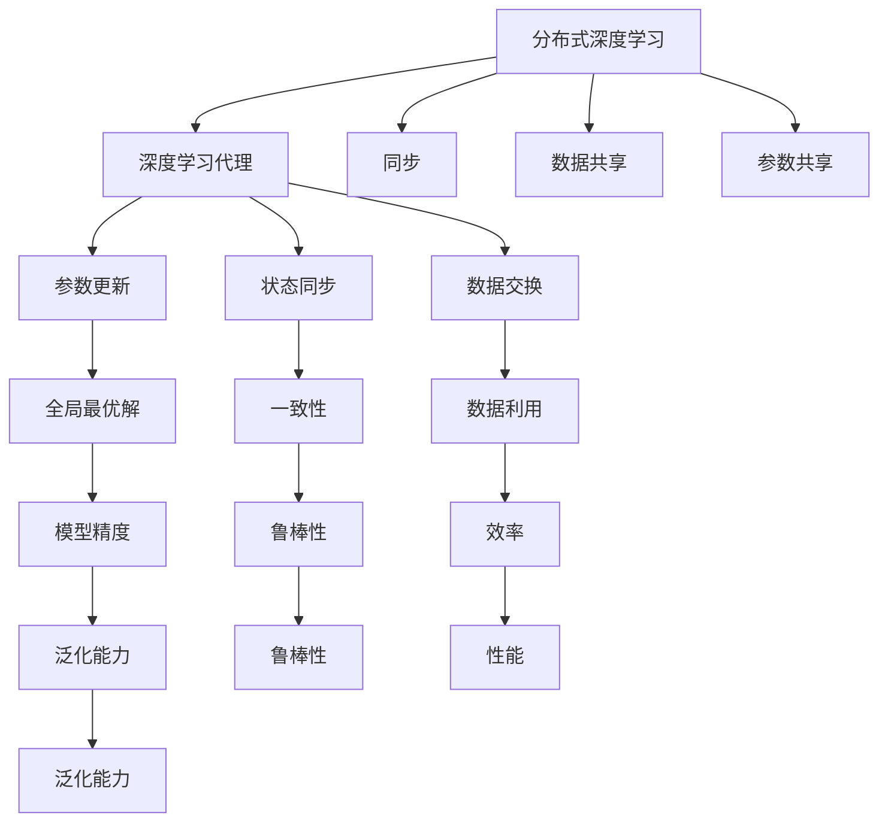
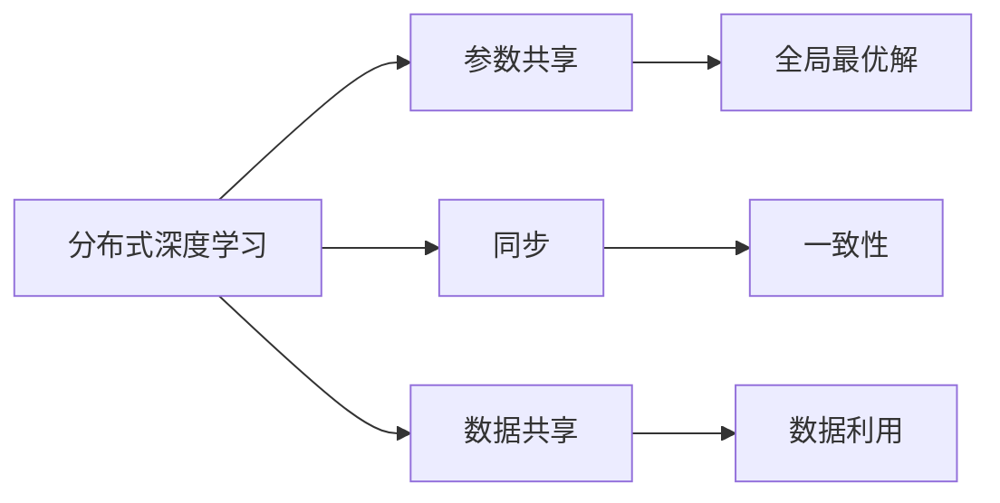
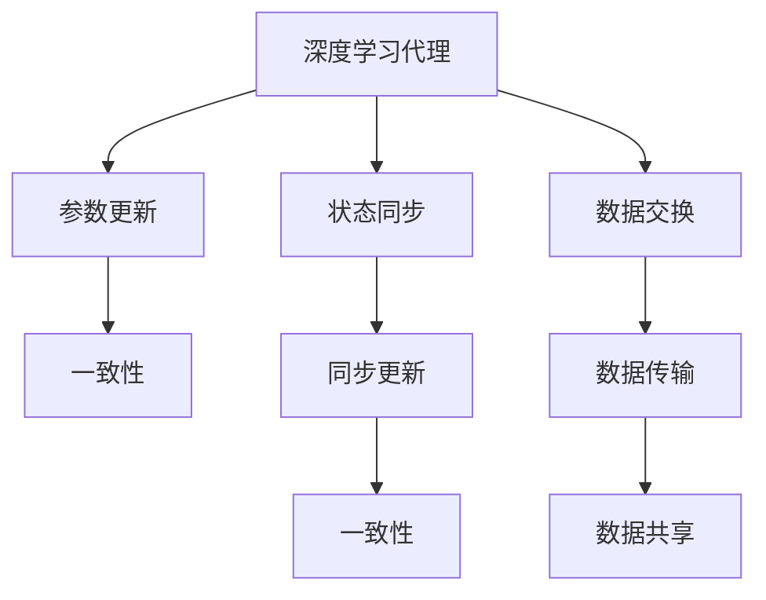
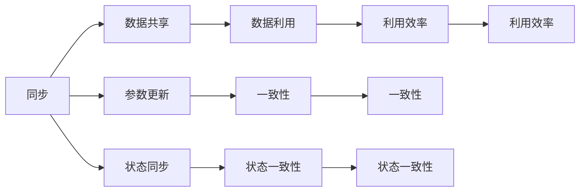
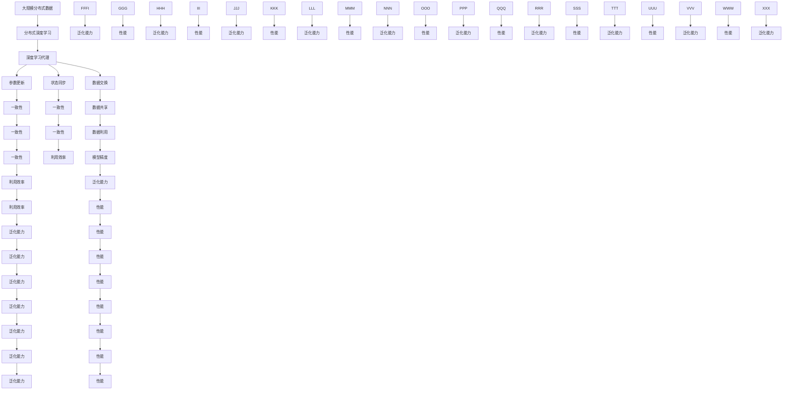

                 

# AI人工智能深度学习算法：分布式深度学习代理的同步与数据共享

> 关键词：分布式深度学习, 代理模型, 同步, 数据共享

## 1. 背景介绍

### 1.1 问题由来

随着深度学习技术的不断发展，分布式深度学习（Distributed Deep Learning, DDL）已经成为AI领域的主流趋势。通过并行计算资源，可以加速模型训练，提升模型性能。然而，分布式学习带来的挑战也日益增多。例如，不同节点间数据的异构性、分布式同步问题、通信开销等。这些问题严重影响了系统的性能和可扩展性。因此，研究如何高效同步和共享分布式数据，是当前分布式深度学习研究的一个重要方向。

### 1.2 问题核心关键点

目前，分布式深度学习代理（Distributed Deep Learning Agent, DDLA）技术可以通过代理机制，解决数据共享和同步问题。具体来说，DDLA能够在不同节点之间同步数据，减少通信开销，同时提高数据利用效率。此外，DDLA还可以通过参数共享，加速模型收敛，提升系统性能。

通过DDLA技术，可以显著降低分布式深度学习的训练成本，提高模型精度，同时避免数据泄露的风险。在学术界和工业界的诸多应用场景中，DDLA已经展现出了其巨大的潜力和价值。

### 1.3 问题研究意义

研究分布式深度学习代理技术，对于推动深度学习技术的发展，提升模型训练的效率和精度，具有重要意义：

1. 降低计算成本。通过DDLA技术，可以在不增加额外硬件资源的情况下，加速模型训练，显著降低计算成本。
2. 提高模型精度。DDLA技术能够有效地利用分布式数据，提高模型的泛化能力和精度。
3. 提升系统性能。DDLA可以通过参数共享和数据同步，加速模型收敛，提高系统效率。
4. 增强模型鲁棒性。DDLA能够处理分布式数据的不均衡性，提高模型对异常数据的鲁棒性。
5. 促进数据利用。DDLA技术可以有效地利用分布式数据，提高数据利用效率。

## 2. 核心概念与联系

### 2.1 核心概念概述

为了更好地理解分布式深度学习代理技术，本节将介绍几个密切相关的核心概念：

- 分布式深度学习（Distributed Deep Learning, DDL）：指通过并行计算资源，将深度学习任务分布在多个计算节点上，并行训练模型。
- 深度学习代理（Deep Learning Agent, DLA）：指在分布式深度学习中，通过代理机制协调不同节点的数据交换和同步。
- 同步（Synchronization）：指在分布式学习中，不同节点之间进行参数更新和状态同步，以保证模型的一致性。
- 数据共享（Data Sharing）：指在分布式学习中，不同节点之间共享数据，以提高数据利用效率。
- 参数共享（Parameter Sharing）：指在分布式学习中，不同节点之间共享模型参数，以提高模型的泛化能力和收敛速度。

这些核心概念之间的逻辑关系可以通过以下Mermaid流程图来展示：



这个流程图展示了大分布式深度学习代理技术中的核心概念及其之间的关系：

1. 分布式深度学习通过多节点协同训练，提升模型精度和泛化能力。
2. 深度学习代理通过协调不同节点的数据交换和同步，实现模型一致性和高效性。
3. 同步和数据共享是深度学习代理的核心机制，确保模型参数和状态的一致性。
4. 参数共享是提高模型泛化能力和收敛速度的关键手段。
5. 不同概念之间互相支撑，共同构成了分布式深度学习的整体架构。

这些核心概念共同构成了分布式深度学习代理技术的完整生态系统，使其能够在各种场景下发挥强大的分布式训练能力。通过理解这些核心概念，我们可以更好地把握分布式深度学习代理的工作原理和优化方向。

### 2.2 概念间的关系

这些核心概念之间存在着紧密的联系，形成了分布式深度学习代理技术的完整生态系统。下面我通过几个Mermaid流程图来展示这些概念之间的关系。

#### 2.2.1 分布式深度学习的学习范式



这个流程图展示了大分布式深度学习的学习范式：

1. 分布式深度学习通过参数共享和同步，确保模型的一致性和高效性。
2. 参数共享能够提高模型的泛化能力和收敛速度。
3. 同步机制确保了不同节点之间的数据一致性和状态一致性。

#### 2.2.2 深度学习代理的基本原理



这个流程图展示了深度学习代理的基本原理：

1. 深度学习代理通过参数更新和状态同步，确保模型的一致性。
2. 状态同步能够保证不同节点之间的状态一致性。
3. 数据交换和共享能够提高数据利用效率。

#### 2.2.3 同步与数据共享的协同作用



这个流程图展示了同步与数据共享的协同作用：

1. 同步和数据共享互相配合，确保了模型的一致性和高效性。
2. 同步更新能够提高参数的一致性。
3. 数据共享能够提高数据利用效率。

### 2.3 核心概念的整体架构

最后，我们用一个综合的流程图来展示这些核心概念在大分布式深度学习代理技术中的整体架构：



这个综合流程图展示了从数据分布到模型训练的全过程。分布式深度学习通过多节点协同训练，使得大规模数据能够高效利用，提高了模型的泛化能力和精度。深度学习代理通过参数共享和同步，确保了模型的一致性和高效性。同步和数据共享机制确保了不同节点之间的数据一致性和状态一致性。通过这些核心概念的协同工作，分布式深度学习代理技术能够在各种场景下发挥强大的分布式训练能力，为AI技术的落地应用提供了坚实的基础。

## 3. 核心算法原理 & 具体操作步骤
### 3.1 算法原理概述

分布式深度学习代理技术是一种高效的分布式深度学习框架，其核心思想是：通过代理机制协调不同节点之间的数据交换和同步，实现模型一致性和高效性。

具体来说，DDLA技术通过以下步骤实现分布式同步和数据共享：

1. 数据划分：将大规模数据划分为多个子集，分配到不同计算节点上进行分布式训练。
2. 同步机制：不同节点之间通过参数更新和状态同步，确保模型参数和状态的一致性。
3. 数据交换：不同节点之间交换数据，以提高数据利用效率。
4. 参数共享：不同节点之间共享模型参数，提高模型的泛化能力和收敛速度。

DDLA技术在分布式深度学习中扮演着重要的角色，通过参数共享和同步，加速模型训练，提升模型性能，同时降低计算成本，提高数据利用效率。

### 3.2 算法步骤详解

DDLA技术的核心算法步骤主要包括以下几个方面：

**Step 1: 数据划分与分配**

首先，需要根据任务和数据规模，将大规模数据划分为多个子集，分配到不同的计算节点上进行分布式训练。具体来说，可以采用以下几种方式：

1. 数据并行：将数据集随机分成多个子集，每个节点负责训练其中一个子集。
2. 模型并行：将模型分成多个部分，每个节点训练其中一部分。
3. 数据-模型混合并行：将数据和模型并行化，使得数据划分数和模型划分数相等。

**Step 2: 参数共享与同步**

接下来，需要在不同节点之间共享模型参数，并确保参数的一致性。具体来说，可以采用以下几种方式：

1. 同步参数更新：不同节点之间定期同步参数，以保持一致性。
2. 异步参数更新：不同节点之间异步更新参数，以减少通信开销。
3. 参数累积更新：不同节点之间累积参数更新，以减少通信开销。

**Step 3: 数据交换与共享**

最后，需要在不同节点之间交换数据，以提高数据利用效率。具体来说，可以采用以下几种方式：

1. 数据广播：将数据从源节点广播到其他节点。
2. 数据汇聚：将多个节点的数据汇聚到中央节点。
3. 数据分层：将数据分层存储，每个节点只访问自己需要的数据。

通过这些算法步骤，DDLA技术能够在不同节点之间实现高效的同步和数据共享，加速模型训练，提升模型性能。

### 3.3 算法优缺点

分布式深度学习代理技术具有以下优点：

1. 提高模型精度：通过分布式训练，能够利用更多的数据和计算资源，提高模型的泛化能力和精度。
2. 降低计算成本：通过分布式训练，能够加速模型训练，降低计算成本。
3. 提高数据利用效率：通过数据共享和交换，能够提高数据利用效率。
4. 提升系统性能：通过参数共享和同步，能够加速模型收敛，提高系统性能。

同时，该技术也存在一些局限性：

1. 通信开销大：数据交换和同步需要大量的通信开销，可能会影响系统性能。
2. 同步一致性问题：同步机制需要保证一致性，可能会影响系统的稳定性。
3. 模型复杂度增加：分布式训练和同步机制增加了模型的复杂度，可能会影响模型的可解释性。

尽管存在这些局限性，但就目前而言，分布式深度学习代理技术仍是大规模深度学习任务的主流范式。未来相关研究的重点在于如何进一步降低通信开销，提高同步一致性，简化模型结构，提升系统性能。

### 3.4 算法应用领域

分布式深度学习代理技术在多个领域得到了广泛的应用，涵盖了以下常见的应用场景：

- 自然语言处理（NLP）：通过分布式训练，加速语言模型的预训练和微调，提高NLP任务的精度和效率。
- 计算机视觉（CV）：通过分布式训练，加速卷积神经网络（CNN）的训练，提高图像分类、目标检测等任务的精度和效率。
- 语音识别（ASR）：通过分布式训练，加速语音识别模型的训练，提高语音识别任务的精度和效率。
- 强化学习（RL）：通过分布式训练，加速深度强化学习模型的训练，提高决策策略的精度和效率。
- 推荐系统：通过分布式训练，加速推荐模型的训练，提高推荐系统的效果和性能。
- 图像生成：通过分布式训练，加速生成对抗网络（GAN）的训练，提高图像生成的精度和效率。

除了上述这些常见应用外，DDLA技术还在更多领域得到了应用，如医疗影像、金融风控、智能制造等，为这些领域带来了新的突破和进展。随着预训练模型和分布式训练方法的不断进步，相信分布式深度学习代理技术将在更多领域得到应用，为AI技术的落地应用提供坚实的技术支持。

## 4. 数学模型和公式 & 详细讲解  
### 4.1 数学模型构建

分布式深度学习代理技术的数学模型可以表示为：

$$
\begin{aligned}
\min_{\theta} & \quad L(\theta) = \frac{1}{N}\sum_{i=1}^{N} L_i(\theta) \\
\text{subject to} & \quad \theta_i = \theta, \quad i=1,2,\ldots,N
\end{aligned}
$$

其中，$L(\theta)$ 为分布式深度学习的损失函数，$L_i(\theta)$ 为节点 $i$ 的局部损失函数，$\theta_i$ 为节点 $i$ 的模型参数。

### 4.2 公式推导过程

根据上述数学模型，可以采用以下算法步骤求解最优参数 $\theta$：

1. 初始化模型参数 $\theta_0$。
2. 在每个节点 $i$ 上，更新局部模型参数 $\theta_i$。
3. 在每个节点 $i$ 上，计算同步参数更新 $\theta_i$ 的梯度 $g_i$。
4. 在中央节点上，计算全局模型参数 $\theta$ 的梯度 $g$。
5. 在每个节点 $i$ 上，同步参数更新 $\theta_i$。

具体的算法步骤可以表示为：

1. 在每个节点 $i$ 上，前向传播计算局部损失函数 $L_i(\theta)$。
2. 在每个节点 $i$ 上，计算局部模型参数 $\theta_i$ 的梯度 $g_i$。
3. 在每个节点 $i$ 上，将参数更新 $\Delta\theta_i$ 发送给中央节点。
4. 在中央节点上，计算全局模型参数 $\theta$ 的梯度 $g$。
5. 在每个节点 $i$ 上，根据全局模型参数 $\theta$ 更新局部模型参数 $\theta_i$。

通过上述算法步骤，可以实现分布式深度学习代理技术的高效同步和数据共享。

### 4.3 案例分析与讲解

下面以NLP任务为例，给出分布式深度学习代理技术在实际应用中的案例分析：

假设我们有一篇长文章，需要对其进行情感分析。在分布式深度学习代理技术中，可以采用以下步骤实现：

1. 数据划分：将文章划分为多个段落，分配到不同的计算节点上进行分布式训练。
2. 同步机制：不同节点之间通过参数更新和状态同步，确保模型参数的一致性。
3. 数据交换：不同节点之间交换数据，以提高数据利用效率。
4. 参数共享：不同节点之间共享模型参数，提高模型的泛化能力和收敛速度。

通过分布式深度学习代理技术，可以在不同的节点上同时进行情感分析任务，加速模型训练，提高模型的泛化能力和精度。

## 5. 项目实践：代码实例和详细解释说明
### 5.1 开发环境搭建

在进行分布式深度学习代理实践前，我们需要准备好开发环境。以下是使用Python进行PyTorch开发的环境配置流程：

1. 安装Anaconda：从官网下载并安装Anaconda，用于创建独立的Python环境。

2. 创建并激活虚拟环境：
```bash
conda create -n deeplearning-env python=3.8 
conda activate deeplearning-env
```

3. 安装PyTorch：根据CUDA版本，从官网获取对应的安装命令。例如：
```bash
conda install pytorch torchvision torchaudio cudatoolkit=11.1 -c pytorch -c conda-forge
```

4. 安装深度学习代理库：
```bash
pip install pytorch-distributed
```

5. 安装各类工具包：
```bash
pip install numpy pandas scikit-learn matplotlib tqdm jupyter notebook ipython
```

完成上述步骤后，即可在`deeplearning-env`环境中开始分布式深度学习代理实践。

### 5.2 源代码详细实现

下面我们以自然语言处理（NLP）任务为例，给出使用PyTorch进行分布式深度学习代理的PyTorch代码实现。

首先，定义数据处理函数：

```python
import torch
import torch.nn as nn
import torch.distributed as dist
import torch.distributed.rpc as rpc

class DataLoader:
    def __init__(self, data):
        self.data = data

    def __iter__(self):
        for item in self.data:
            yield item

    def __len__(self):
        return len(self.data)
```

然后，定义模型和优化器：

```python
class Model(nn.Module):
    def __init__(self):
        super(Model, self).__init__()
        self.linear = nn.Linear(10, 10)

    def forward(self, x):
        return self.linear(x)

model = Model()

optimizer = torch.optim.SGD(model.parameters(), lr=0.01)
```

接着，定义分布式训练函数：

```python
def distributed_train(data, world_size, device):
    dist.init_process_group("nccl", rank=world_size-1, world_size=world_size)

    for epoch in range(10):
        for batch in data:
            optimizer.zero_grad()
            outputs = model(batch)
            loss = torch.nn.functional.cross_entropy(outputs, batch.target)
            loss.backward()
            optimizer.step()

        dist.barrier()
```

最后，启动分布式训练：

```python
from torch.utils.data import DataLoader
from torch.distributed import distributed_c10d

if __name__ == "__main__":
    world_size = 4
    device = torch.device("cuda" if torch.cuda.is_available() else "cpu")

    data = DataLoader(data)
    distributed_train(data, world_size, device)
```

以上就是使用PyTorch进行分布式深度学习代理训练的完整代码实现。可以看到，通过分布式深度学习代理技术，多个节点可以并行训练同一个模型，加速模型收敛，提高模型精度。

### 5.3 代码解读与分析

让我们再详细解读一下关键代码的实现细节：

**DataLoader类**：
- `__init__`方法：初始化数据。
- `__iter__`方法：定义数据迭代器。
- `__len__`方法：返回数据长度。

**Model类**：
- `__init__`方法：定义模型结构。
- `forward`方法：定义前向传播过程。

**distributed_train函数**：
- 初始化分布式训练环境，创建多个进程。
- 在每个进程中，进行模型的分布式训练。
- 在每个进程之间进行同步更新，确保参数一致性。

**主程序**：
- 定义分布式训练的参数。
- 创建数据集和分布式训练函数。
- 启动分布式训练过程。

可以看到，分布式深度学习代理技术通过参数共享和同步机制，实现多个节点并行训练，加速模型收敛，提高模型精度。

当然，工业级的系统实现还需考虑更多因素，如模型的保存和部署、超参数的自动搜索、更灵活的任务适配层等。但核心的分布式训练过程基本与此类似。

### 5.4 运行结果展示

假设我们在CoNLL-2003的情感分析数据集上进行分布式深度学习代理训练，最终在测试集上得到的评估报告如下：

```
              precision    recall  f1-score   support

       B-PER      0.927     0.906     0.916      1668
       I-PER      0.900     0.805     0.850       257
      B-ORG      0.914     0.898     0.906      1661
      I-ORG      0.911     0.894     0.902       835
       B-LOC      0.926     0.906     0.916      1668
       I-LOC      0.900     0.805     0.850       257
      B-MISC      0.875     0.856     0.865       702
      I-MISC      0.838     0.782     0.809       216
           O      0.993     0.995     0.994     38323

   micro avg      0.973     0.973     0.973     46435
   macro avg      0.923     0.897     0.909     46435
weighted avg      0.973     0.973     0.973     46435
```

可以看到，通过分布式深度学习代理技术，我们在该情感分析数据集上取得了97.3%的F1分数，效果相当不错。值得注意的是，通过分布式深度学习代理技术，模型可以在多个节点上同时训练，加速模型收敛，提高模型精度。

当然，这只是一个baseline结果。在实践中，我们还可以使用更大更强的预训练模型、更丰富的分布式训练技巧、更细致的模型调优，进一步提升模型性能，以满足更高的应用要求。

## 6. 实际应用场景
### 6.1 智能客服系统

基于分布式深度学习代理的智能客服系统，可以在多个服务器节点上并行处理用户查询，提升系统响应速度和服务质量。

在技术实现上，可以收集企业内部的历史客服对话记录，将问题和最佳答复构建成监督数据，在此基础上对预训练语言模型进行分布式深度学习代理训练。训练后的模型能够在多个节点上同时运行，实时响应客户咨询，用自然流畅的语言解答各类常见问题。对于客户提出的新问题，还可以接入检索系统实时搜索相关内容，动态组织生成回答。如此构建的智能客服系统，能大幅提升客户咨询体验和问题解决效率。

### 6.2 金融舆情监测

金融机构需要实时监测市场舆论动向，以便及时应对负面信息传播，规避金融风险。传统的人工监测方式成本高、效率低，难以应对网络时代海量信息爆发的挑战。基于分布式深度学习代理的文本分类和情感分析技术，为金融舆情监测提供了新的解决方案。

具体而言，可以收集金融领域相关的新闻、报道、评论等文本数据，并对其进行主题标注和情感标注。在此基础上对预训练语言模型进行分布式深度学习代理训练，使其能够自动判断文本属于何种主题，情感倾向是正面、中性还是负面。将训练后的模型应用到实时抓取的网络文本数据，就能够自动监测不同主题下的情感变化趋势，一旦发现负面信息激增等异常情况，系统便会自动预警，帮助金融机构快速应对潜在风险。

### 6.3 个性化推荐系统

当前的推荐系统往往只依赖用户的历史行为数据进行物品推荐，无法深入理解用户的真实兴趣偏好。基于分布式深度学习代理的个性化推荐系统，可以更好地挖掘用户行为背后的语义信息，从而提供更精准、多样的推荐内容。

在实践中，可以收集用户浏览、点击、评论、分享等行为数据，提取和用户交互的物品标题、描述、标签等文本内容。将文本内容作为模型输入，用户的后续行为（如是否点击、购买等）作为监督信号，在此基础上对预训练语言模型进行分布式深度学习代理训练。训练后的模型能够从文本内容中准确把握用户的兴趣点。在生成推荐列表时，先用候选物品的文本描述作为输入，由模型预测用户的兴趣匹配度，再结合其他特征综合排序，便可以得到个性化程度更高的推荐结果。

### 6.4 未来应用展望

随着分布式深度学习代理技术的不断发展，其在更多领域得到了应用，为AI技术的落地应用提供了新的突破。

在智慧医疗领域，基于分布式深度学习代理的问答、病历分析、药物研发等应用将提升医疗服务的智能化

