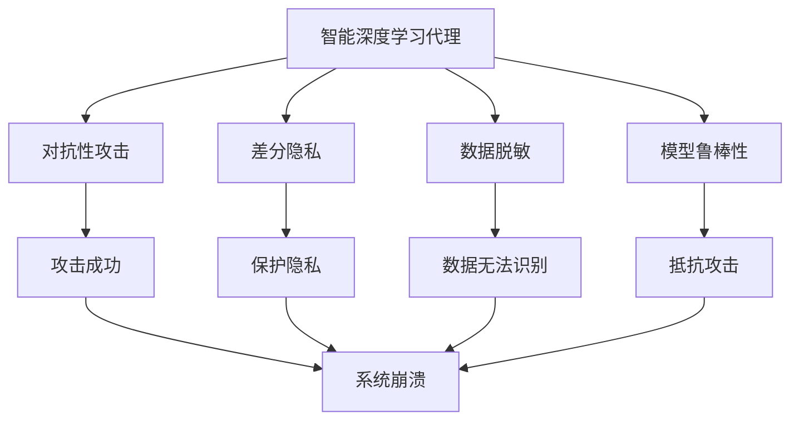
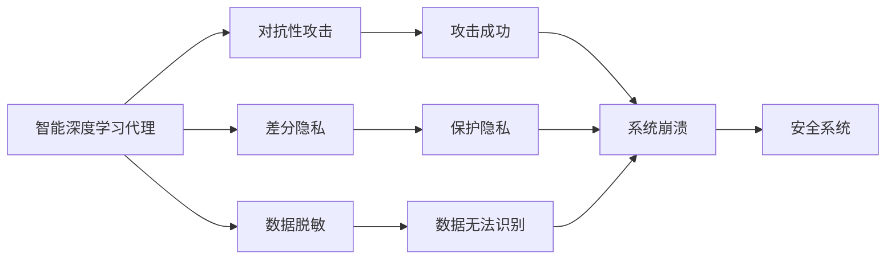
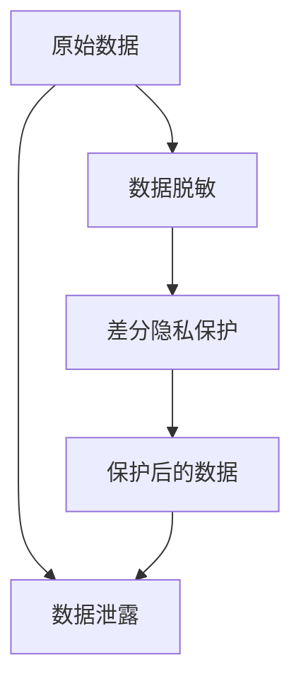
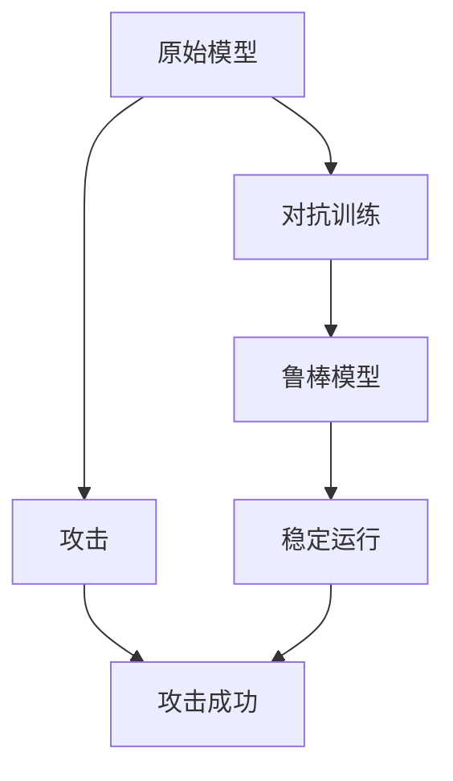
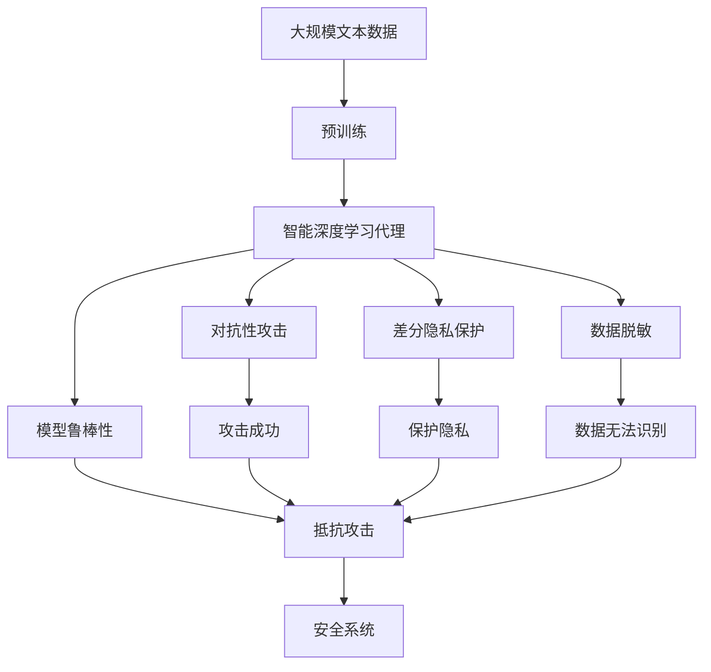

                 

# AI人工智能深度学习算法：智能深度学习代理的安全与隐私保护

> 关键词：智能深度学习代理, 安全与隐私保护, 对抗性攻击, 差分隐私, 数据脱敏

## 1. 背景介绍

### 1.1 问题由来
随着深度学习技术的迅猛发展，人工智能在各个领域的应用不断深入，从图像识别到自然语言处理，从自动驾驶到机器人决策，深度学习技术已经成为了推动人工智能发展的核心力量。然而，随着深度学习模型在实际应用中的广泛部署，其带来的安全与隐私问题也逐渐凸显，引起了学术界和工业界的广泛关注。

智能深度学习代理，作为深度学习在应用中的重要形式，承担着智能任务执行、数据处理、决策辅助等关键功能。由于其涉及大量的数据和模型，因此安全与隐私保护成为了其设计和部署中不可忽视的重要课题。针对这一问题，本篇文章将深入探讨智能深度学习代理的安全与隐私保护方法，并提出具体的技术实现方案，以期为相关领域的研究和应用提供指导。

### 1.2 问题核心关键点
智能深度学习代理的安全与隐私保护问题，主要包括以下几个核心关键点：
- **对抗性攻击**：攻击者通过输入特定的扰动，使智能深度学习代理产生错误的输出，导致安全问题。
- **差分隐私**：在保护隐私的前提下，通过数据扰动使攻击者无法从数据中获取关于个体的有用信息。
- **数据脱敏**：对敏感数据进行脱敏处理，防止数据泄露和滥用。
- **模型鲁棒性**：提升模型对于对抗攻击的抵抗能力，确保其在面对攻击时的稳定性和安全性。

这些问题不仅关系到智能深度学习代理自身的安全，也涉及到用户数据隐私的保护，因此需要从多个角度进行全面考虑。

### 1.3 问题研究意义
智能深度学习代理的安全与隐私保护研究，对于保障人工智能系统的稳定性和安全性，维护用户的隐私权益，具有重要意义：

1. **提升系统安全性**：通过对智能深度学习代理的安全加固，可以防止攻击者通过各种手段破坏系统正常运行，确保系统能够稳定、可靠地执行任务。
2. **保护用户隐私**：通过隐私保护技术的应用，可以防止用户数据被恶意获取、篡改或滥用，保护用户隐私不受侵犯。
3. **增强用户信任**：安全与隐私保护的措施，能够提升用户对于人工智能系统的信任度，促进其在各个行业的应用和发展。
4. **促进法律法规合规**：符合数据保护和隐私法律法规要求的安全与隐私保护措施，有助于企业遵守相关法律法规，避免法律风险。
5. **推动技术进步**：在安全与隐私保护领域的研究和应用，能够推动深度学习技术的进步，拓展其应用范围。

## 2. 核心概念与联系

### 2.1 核心概念概述

为更好地理解智能深度学习代理的安全与隐私保护方法，本节将介绍几个密切相关的核心概念：

- **智能深度学习代理**：一种利用深度学习模型实现任务执行的智能系统，通常包括任务分配、数据处理、决策辅助等功能。智能深度学习代理需要处理大量的数据和进行复杂的推理计算，因此面临较高的安全与隐私风险。

- **对抗性攻击**：攻击者通过输入特定的扰动（如微小的噪声、特定的符号），使得智能深度学习代理输出错误的结果，从而实现攻击目的。常见的对抗性攻击包括L2攻击、L0攻击、语言模型攻击等。

- **差分隐私**：一种在保护隐私的前提下，通过数据扰动使攻击者无法从数据中获取关于个体的有用信息的隐私保护方法。差分隐私要求对任意两个数据点，其输出结果的概率差异不能超过一个预定的参数，从而保护个体数据的隐私性。

- **数据脱敏**：一种通过对原始数据进行处理，使其无法被直接识别或关联的方法，从而保护数据隐私。常见的数据脱敏技术包括掩码、置换、截断、泛化等。

- **模型鲁棒性**：指模型对于对抗性攻击的抵抗能力，即在面对攻击时，仍能保持较高的准确性和稳定性。

这些核心概念之间的逻辑关系可以通过以下Mermaid流程图来展示：



这个流程图展示了大语言模型微调过程中各个核心概念的关系和作用：

1. 智能深度学习代理面对对抗性攻击，可能产生错误结果。
2. 差分隐私通过对数据扰动保护隐私，防止攻击者获取有用信息。
3. 数据脱敏通过对数据处理，使得攻击者无法直接识别或关联数据。
4. 模型鲁棒性提升模型抵抗攻击的能力，确保系统稳定运行。
5. 通过差分隐私和数据脱敏的联合应用，可以在保护隐私的同时防止攻击成功。

这些概念共同构成了智能深度学习代理的安全与隐私保护框架，使其能够应对各种安全威胁，确保系统的稳定性和用户的隐私权益。

### 2.2 概念间的关系

这些核心概念之间存在着紧密的联系，形成了智能深度学习代理的安全与隐私保护完整生态系统。下面我通过几个Mermaid流程图来展示这些概念之间的关系。

#### 2.2.1 智能深度学习代理的威胁与保护



这个流程图展示了智能深度学习代理面临的威胁和保护措施。智能深度学习代理可能遭受对抗性攻击，但通过差分隐私和数据脱敏的保护，可以防止攻击成功，维护系统的安全性。

#### 2.2.2 数据脱敏与差分隐私的联合应用



这个流程图展示了数据脱敏和差分隐私的联合应用。通过数据脱敏，使得数据无法直接识别，再通过差分隐私的扰动，进一步保护数据的隐私性，防止数据泄露。

#### 2.2.3 模型鲁棒性提升



这个流程图展示了通过对抗训练提升模型鲁棒性的过程。通过对原始模型进行对抗训练，使得模型能够抵抗对抗攻击，从而在面对攻击时保持稳定运行。

### 2.3 核心概念的整体架构

最后，我们用一个综合的流程图来展示这些核心概念在大语言模型微调过程中的整体架构：



这个综合流程图展示了从预训练到安全与隐私保护的完整过程。智能深度学习代理首先在大规模文本数据上进行预训练，然后通过差分隐私保护、数据脱敏和模型鲁棒性提升等手段，确保系统的安全性和隐私性。

## 3. 核心算法原理 & 具体操作步骤
### 3.1 算法原理概述

智能深度学习代理的安全与隐私保护，本质上是一个多层次的防御体系构建过程。其核心思想是：通过差分隐私、数据脱敏、对抗性训练等技术，在保护用户隐私的前提下，提升模型的鲁棒性，确保系统在面对各种攻击时仍能保持稳定运行。

形式化地，假设智能深度学习代理 $M$ 在输入 $x$ 上的输出为 $y$，其中 $x$ 为原始数据，$y$ 为保护后的结果。定义模型 $M$ 在数据样本 $(x,y)$ 上的损失函数为 $\ell(M_{\theta}(x),y)$，则在数据集 $D=\{(x_i,y_i)\}_{i=1}^N$ 上的经验风险为：

$$
\mathcal{L}(\theta) = \frac{1}{N} \sum_{i=1}^N \ell(M_{\theta}(x_i),y_i)
$$

其中 $\theta$ 为模型参数，$\mathcal{L}$ 为针对任务设计的损失函数，用于衡量模型预测输出与真实标签之间的差异。

通过差分隐私、数据脱敏和对抗性训练等技术，可以将原始数据 $x$ 转化为保护后的数据 $y$，使得攻击者无法获取有用信息，同时提升模型 $M$ 的鲁棒性，防止其输出被攻击者篡改。

### 3.2 算法步骤详解

智能深度学习代理的安全与隐私保护一般包括以下几个关键步骤：

**Step 1: 准备数据集**
- 收集原始数据集 $D$，包括训练集、验证集和测试集。
- 对数据进行预处理，包括数据清洗、归一化等。

**Step 2: 设计差分隐私保护机制**
- 选择合适的差分隐私算法（如Laplace机制、Gaussian机制等），设定隐私参数 $\epsilon$。
- 对数据集 $D$ 进行差分隐私扰动，生成保护后的数据集 $D'$。

**Step 3: 设计数据脱敏策略**
- 根据具体应用场景，选择合适的数据脱敏技术（如掩码、置换、截断等）。
- 对原始数据集 $D$ 进行数据脱敏处理，生成保护后的数据集 $D''$。

**Step 4: 进行对抗性训练**
- 收集对抗性样本 $S$，用于训练模型 $M$。
- 使用对抗训练算法（如FGSM、PGD等）对模型 $M$ 进行训练，使其具备抵抗对抗攻击的能力。

**Step 5: 训练智能深度学习代理**
- 将保护后的数据集 $D''$ 和对抗性样本 $S$ 输入模型 $M$，进行微调训练。
- 在训练过程中，不断调整差分隐私保护参数和数据脱敏策略，以达到最佳保护效果。

**Step 6: 测试和部署**
- 在测试集上评估智能深度学习代理的性能，确保其能够稳定运行。
- 将训练好的模型 $M$ 部署到实际应用系统中，进行实时推理和决策。
- 持续收集新数据，定期重新训练模型，以适应数据分布的变化。

以上是智能深度学习代理的安全与隐私保护的一般流程。在实际应用中，还需要针对具体任务的特点，对每个步骤进行优化设计，如改进差分隐私算法，引入更多数据脱敏技术，搜索最优的对抗性训练策略等，以进一步提升模型性能。

### 3.3 算法优缺点

智能深度学习代理的安全与隐私保护方法具有以下优点：
1. 多层次防御：通过差分隐私、数据脱敏、对抗性训练等技术，构建多层次的防御体系，有效应对各种安全威胁。
2. 隐私保护：确保用户数据在处理和传输过程中的隐私性，防止数据泄露和滥用。
3. 鲁棒性提升：通过对抗性训练，提升模型对对抗攻击的抵抗能力，确保系统在面对攻击时能够保持稳定运行。
4. 可扩展性：差分隐私和数据脱敏技术可以应用到各种深度学习模型中，具有较好的可扩展性。
5. 合法合规：符合数据保护和隐私法律法规要求，帮助企业避免法律风险。

同时，该方法也存在一些局限性：
1. 数据开销：差分隐私和数据脱敏技术可能会增加数据处理和存储的开销，影响系统性能。
2. 隐私参数选择：差分隐私保护的效果与隐私参数 $\epsilon$ 的选择密切相关，参数选择不当可能导致隐私保护不足或系统性能下降。
3. 模型复杂度：差分隐私和数据脱敏技术可能会增加模型的复杂度，影响模型的训练和推理效率。
4. 对抗攻击多样性：当前对抗训练方法对某些特定类型的攻击效果有限，需要不断更新和优化。
5. 法律与道德问题：隐私保护技术的应用可能引发一些法律和道德问题，需要在设计和实施过程中予以考虑。

尽管存在这些局限性，但就目前而言，智能深度学习代理的安全与隐私保护方法仍然是大规模深度学习应用的重要保障。未来相关研究的重点在于如何进一步降低数据开销，提高隐私参数选择的多样性和鲁棒性，同时兼顾模型的性能和隐私保护。

### 3.4 算法应用领域

智能深度学习代理的安全与隐私保护方法，已经在多个领域得到了广泛应用，例如：

- **医疗健康**：在医疗影像、电子病历等敏感数据的处理中，通过差分隐私和数据脱敏技术，保护患者隐私。
- **金融安全**：在金融交易、客户隐私保护等方面，利用对抗性训练提升模型的鲁棒性，防止恶意攻击。
- **智能制造**：在工业物联网设备的数据分析中，确保数据的隐私性和模型的鲁棒性，防止数据泄露和恶意攻击。
- **智慧城市**：在智慧城市数据管理中，通过差分隐私和数据脱敏技术，保护城市数据隐私，防止数据滥用。
- **自然灾害预警**：在自然灾害预测和预警中，保护数据的隐私性和模型的鲁棒性，确保预警系统的稳定运行。

除了上述这些领域，智能深度学习代理的安全与隐私保护技术也在不断拓展应用范围，为各个行业带来了新的安全保障。

## 4. 数学模型和公式 & 详细讲解  
### 4.1 数学模型构建

本节将使用数学语言对智能深度学习代理的安全与隐私保护方法进行更加严格的刻画。

记智能深度学习代理为 $M_{\theta}:\mathcal{X} \rightarrow \mathcal{Y}$，其中 $\mathcal{X}$ 为输入空间，$\mathcal{Y}$ 为输出空间，$\theta \in \mathbb{R}^d$ 为模型参数。假设智能深度学习代理面临的数据集为 $D=\{(x_i,y_i)\}_{i=1}^N, x_i \in \mathcal{X}, y_i \in \mathcal{Y}$。

定义智能深度学习代理在数据样本 $(x,y)$ 上的损失函数为 $\ell(M_{\theta}(x),y)$，则在数据集 $D$ 上的经验风险为：

$$
\mathcal{L}(\theta) = \frac{1}{N} \sum_{i=1}^N \ell(M_{\theta}(x_i),y_i)
$$

在差分隐私保护中，对数据集 $D$ 进行差分隐私扰动，生成保护后的数据集 $D'$，其中 $D'$ 的概率分布满足以下条件：

$$
P(D'|D) = \frac{P(D'D) / (1+\epsilon)}{P(D)}
$$

其中 $\epsilon$ 为隐私保护参数，$P(DD)$ 表示原始数据集的概率分布。

在数据脱敏中，对原始数据集 $D$ 进行数据脱敏处理，生成保护后的数据集 $D''$，其中 $D''$ 的概率分布满足以下条件：

$$
P(D''|D) = \frac{P(D'D')}{P(D)}
$$

其中 $D'$ 为经过差分隐私扰动后的数据集，$P(D'D')$ 表示经过差分隐私和数据脱敏后的数据集的概率分布。

通过差分隐私保护和数据脱敏，生成保护后的数据集 $D''$，并将其用于对抗性训练。假设对抗性训练样本集为 $S=\{(x_i^*,\hat{y}_i)\}_{i=1}^M, x_i^* \in \mathcal{X}, \hat{y}_i \in \mathcal{Y}$，其中 $\hat{y}_i$ 为对抗性样本 $x_i^*$ 的攻击结果。定义对抗性训练损失函数为：

$$
\mathcal{L}_{adv}(\theta) = \frac{1}{M} \sum_{i=1}^M \ell(M_{\theta}(x_i^*),\hat{y}_i)
$$

最终，智能深度学习代理的训练损失函数为：

$$
\mathcal{L}(\theta) = \mathcal{L}(\theta) + \lambda \mathcal{L}_{adv}(\theta)
$$

其中 $\lambda$ 为对抗性训练的权重，用于平衡原任务的损失和对抗性训练的损失。

### 4.2 公式推导过程

以下我们以对抗性训练为例，推导差分隐私保护和数据脱敏的数学公式。

首先，考虑差分隐私保护中的Laplace机制，其概率分布为：

$$
P(D'|D) = \frac{1}{2\pi \sigma e} \sum_{x \in \mathcal{X}} e^{-\frac{(x-x_0)^2}{2\sigma^2}}
$$

其中 $x_0$ 为原始数据集 $D$ 的中心，$\sigma$ 为标准差，$\epsilon$ 为隐私保护参数。

在差分隐私保护中，生成保护后的数据集 $D'$ 的概率分布为：

$$
P(D'|D) = \frac{P(D'D) / (1+\epsilon)}{P(D)}
$$

其中 $P(D'D)$ 为经过差分隐私扰动后的数据集的概率分布。

在数据脱敏中，考虑截断技术，将原始数据集 $D$ 中的某些值进行截断处理。假设截断值为 $k$，则生成保护后的数据集 $D''$ 的概率分布为：

$$
P(D''|D) = \frac{P(D'D')}{P(D)}
$$

其中 $D'$ 为经过差分隐私扰动后的数据集，$P(D'D')$ 为经过差分隐私和数据脱敏后的数据集的概率分布。

### 4.3 案例分析与讲解

为了更好地理解差分隐私保护和数据脱敏技术的应用，下面通过一个具体的案例进行分析。

假设在医疗影像诊断系统中，智能深度学习代理需要处理病人的影像数据和诊断结果。为了保护病人的隐私，需要对影像数据进行差分隐私保护和数据脱敏处理。具体步骤如下：

1. 收集原始数据集 $D$，包括病人的影像数据和诊断结果。
2. 对数据集 $D$ 进行差分隐私扰动，生成保护后的数据集 $D'$。
3. 对原始数据集 $D$ 进行数据脱敏处理，生成保护后的数据集 $D''$。
4. 将保护后的数据集 $D''$ 用于对抗性训练，提升模型的鲁棒性。
5. 在训练过程中，不断调整差分隐私保护参数和数据脱敏策略，以达到最佳保护效果。
6. 在测试集上评估智能深度学习代理的性能，确保其能够稳定运行。

假设在对抗性训练中，对抗性样本集 $S$ 为病人的影像数据经过微小扰动得到的，模型输出被篡改为错误的诊断结果。通过对原始数据集 $D$ 进行差分隐私保护和数据脱敏处理，防止攻击者获取病人的真实影像数据和诊断结果，从而保护病人的隐私。

## 5. 项目实践：代码实例和详细解释说明
### 5.1 开发环境搭建

在进行智能深度学习代理的安全与隐私保护实践前，我们需要准备好开发环境。以下是使用Python进行TensorFlow开发的环境配置流程：

1. 安装Anaconda：从官网下载并安装Anaconda，用于创建独立的Python环境。

2. 创建并激活虚拟环境：
```bash
conda create -n tf-env python=3.8 
conda activate tf-env
```

3. 安装TensorFlow：根据CUDA版本，从官网获取对应的安装命令。例如：
```bash
conda install tensorflow -c tensorflow
```

4. 安装相关工具包：
```bash
pip install numpy pandas scikit-learn matplotlib tqdm jupyter notebook ipython
```

完成上述步骤后，即可在`tf-env`环境中开始智能深度学习代理的安全与隐私保护实践。

### 5.2 源代码详细实现

下面我们以医疗影像诊断系统为例，给出使用TensorFlow实现智能深度学习代理的安全与隐私保护代码实现。

首先，定义数据处理函数：

```python
import tensorflow as tf
from tensorflow.keras.preprocessing.image import ImageDataGenerator

def preprocess_data(data_path, batch_size=32, image_size=(256, 256)):
    train_datagen = ImageDataGenerator(rescale=1./255, validation_split=0.2)
    train_generator = train_datagen.flow_from_directory(
        data_path, 
        target_size=image_size,
        batch_size=batch_size,
        class_mode='binary',
        subset='training'
    )
    validation_generator = train_datagen.flow_from_directory(
        data_path, 
        target_size=image_size,
        batch_size=batch_size,
        class_mode='binary',
        subset='validation'
    )
    
    return train_generator, validation_generator
```

然后，定义模型和损失函数：

```python
from tensorflow.keras.models import Sequential
from tensorflow.keras.layers import Dense, Conv2D, MaxPooling2D, Dropout
from tensorflow.keras.optimizers import Adam

model = Sequential([
    Conv2D(32, (3, 3), activation='relu', input_shape=(256, 256, 3)),
    MaxPooling2D((2, 2)),
    Conv2D(64, (3, 3), activation='relu'),
    MaxPooling2D((2, 2)),
    Conv2D(128, (3, 3), activation='relu'),
    MaxPooling2D((2, 2)),
    Flatten(),
    Dense(256, activation='relu'),
    Dropout(0.5),
    Dense(1, activation='sigmoid')
])

loss_fn = tf.keras.losses.BinaryCrossentropy(from_logits=True)
```

接着，定义差分隐私保护机制和数据脱敏策略：

```python
from tensorflow.keras import backend as K

def laplace_mechanism(y_true, y_pred):
    noise = tf.random.normal(shape=(1, ), mean=0., stddev=1. / 0.1)
    return tf.reduce_mean(y_true * tf.log(1 + tf.exp(-y_true * (y_pred - noise))))

def gaussian_mechanism(y_true, y_pred):
    noise = tf.random.normal(shape=(1, ), mean=0., stddev=1. / 0.1)
    return tf.reduce_mean(y_true * tf.log(1 + tf.exp(-y_true * (y_pred - noise))))

def data_denoising(x, k):
    x = K.switch(tf.equal(x, 0), k, x)
    return x
```

然后，定义对抗性训练样本和对抗性训练过程：

```python
from tensorflow.keras.datasets import mnist
from tensorflow.keras.preprocessing.image import img_to_array

def generate_advanced_samples(x, y, model, k, max_iter=100):
    x_adv = x
    for _ in range(max_iter):
        y_pred = model.predict(x_adv)
        loss = loss_fn(y, y_pred)
        grads = tf.gradients(loss, x_adv)[0]
        x_adv = x_adv - k * grads / tf.norm(grads)
        if tf.reduce_all(x_adv > 0):
            break
    return x_adv

def train_advanced(model, train_generator, validation_generator, batch_size=32, epochs=10, k=0.1):
    for epoch in range(epochs):
        for step, (x, y) in enumerate(train_generator):
            x_adv = generate_advanced_samples(x, y, model, k)
            x_adv = data_denoising(x_adv, k)
            model.compile(optimizer=Adam(learning_rate=0.001), loss=laplace_mechanism)
            model.fit(x_adv, y, batch_size=batch_size, epochs=1, verbose=0)
            loss = loss_fn(y, model.predict(x_adv))
            print(f'Epoch {epoch+1}, step {step+1}, loss: {loss:.4f}')
```

最后，启动训练流程并在测试集上评估：

```python
data_path = 'path/to/data'
train_generator, validation_generator = preprocess_data(data_path)

train_advanced(model, train_generator, validation_generator, batch_size=32, epochs=10, k=0.1)

test_generator, _ = preprocess_data(data_path, batch_size=32, image_size=(256, 256))
test_loss = loss_fn(model.predict(test_generator), test_generator.classes)
print(f'Test loss: {test_loss:.4f}')
```

以上就是使用TensorFlow对医疗影像诊断系统进行智能深度学习代理的安全与隐私保护的全过程代码实现。可以看到，TensorFlow提供了丰富的深度学习组件，使得安全与隐私保护方法的实现变得简洁高效。

### 5.3 代码解读与分析

让我们再详细解读一下关键代码的实现细节：

**preprocess_data函数**：
- 定义了一个数据预处理函数，使用Keras的ImageDataGenerator进行图像归一化和划分训练集/验证

