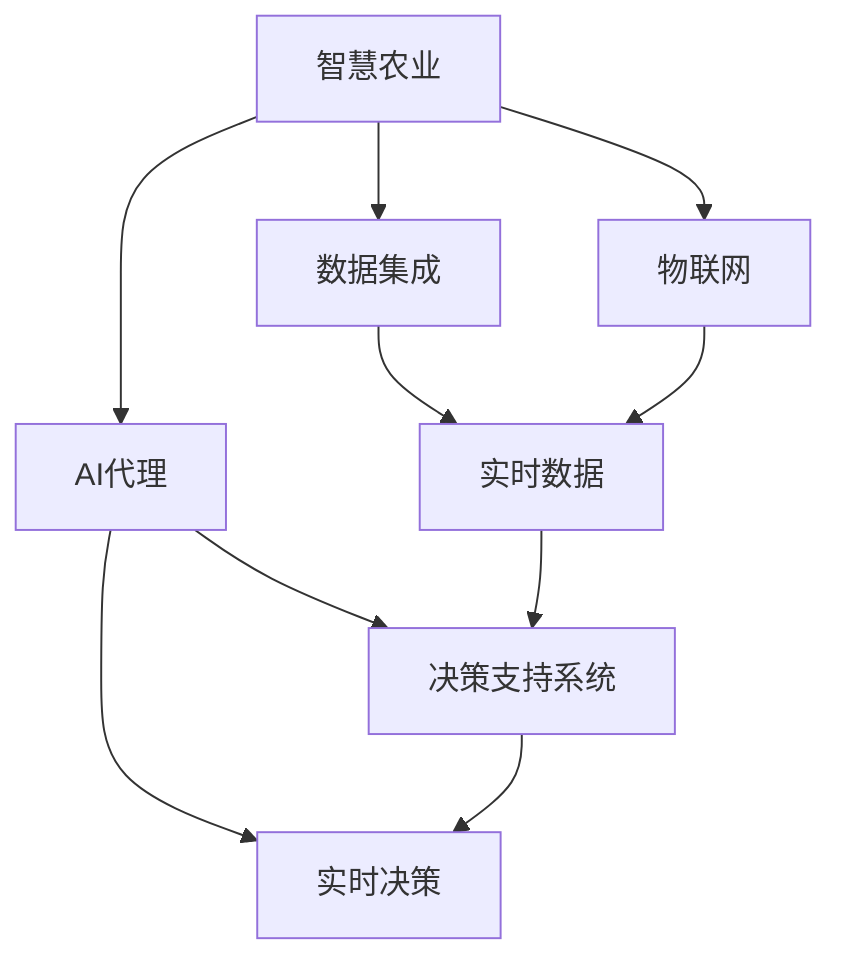
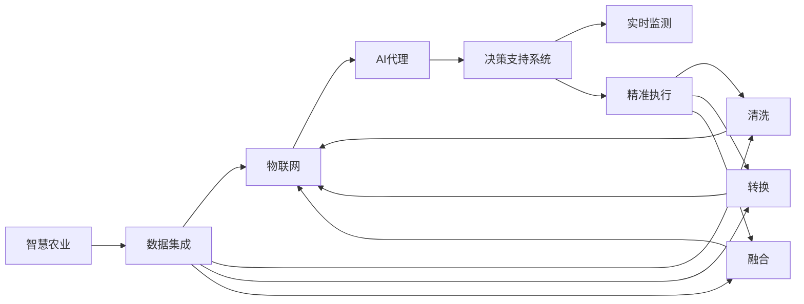

                 

# AI代理在智慧农业中的工作流与决策支持

> 关键词：智慧农业, AI代理, 数据集成, 物联网(IoT), 机器学习, 决策支持系统, 实时监测, 精准农业

## 1. 背景介绍

### 1.1 问题由来
随着全球人口的增加和城市化的加剧，食品安全和农业可持续性成为了全球面临的重要挑战。智慧农业（Intelligent Agriculture），也称为精准农业（Precision Agriculture），通过集成各种信息技术和传感设备，旨在提高农业生产效率、减少资源浪费、提高食品安全，同时降低对环境的影响。

AI代理（AI Agents）作为智慧农业中一种新兴的智能技术，近年来引起了广泛关注。AI代理通过整合数据、模拟环境、进行实时决策，帮助农民更有效地管理农业生产，提升整体农业生产力。本文将探讨AI代理在智慧农业中的工作流和决策支持系统。

### 1.2 问题核心关键点
AI代理在智慧农业中的应用，其核心关键点包括：

1. **数据集成与实时处理**：整合来自传感器、无人机、卫星等设备的实时数据，进行清洗、转换和融合，供AI代理进行决策。
2. **模型训练与优化**：基于历史数据，通过机器学习算法训练AI代理，优化其决策模型。
3. **决策支持与执行**：AI代理在实时数据的基础上进行智能决策，并通过执行机制（如自动灌溉、施肥系统）进行农业干预。
4. **监测与评估**：实时监测AI代理的决策效果，定期进行模型评估和优化。

## 2. 核心概念与联系

### 2.1 核心概念概述

为更好地理解AI代理在智慧农业中的应用，本节将介绍几个关键概念：

- **智慧农业**：利用物联网(IoT)、云计算、大数据等技术，结合农业生产环境，实现精准化、自动化、智能化的农业生产。
- **AI代理**：一种能够自主感知、推理、学习和决策的智能体，能够在复杂环境中执行特定任务。
- **数据集成**：从多个来源收集、清洗、转换和融合数据，供AI代理进行分析和使用。
- **物联网(IoT)**：利用传感器、智能设备等技术，实现农业生产过程的实时监测和数据采集。
- **机器学习**：通过算法训练模型，使AI代理能够从数据中学习规律，进行智能决策。
- **决策支持系统**：通过智能算法和数据集成，为农业生产提供实时决策支持。

这些核心概念之间相互关联，共同构成了智慧农业中的AI代理系统。以下是一个Mermaid流程图，展示了这些概念之间的关系：



### 2.2 概念间的关系

这些核心概念之间的关系，通过一个更详细的Mermaid流程图来展示：



这个流程图展示了智慧农业、数据集成、物联网、AI代理和决策支持系统之间的关系，以及它们在智慧农业中的应用流程。

## 3. 核心算法原理 & 具体操作步骤
### 3.1 算法原理概述

AI代理在智慧农业中的应用，本质上是一种基于机器学习的智能决策过程。其核心算法原理包括以下几个步骤：

1. **数据收集与清洗**：收集来自传感器、无人机、卫星等设备的实时数据，并进行清洗和预处理，去除噪声和不相关数据。
2. **数据集成与融合**：将不同来源的数据进行清洗、转换和融合，形成一个统一的数据集合。
3. **特征提取与选择**：从融合后的数据中提取特征，并选择对决策最相关的特征。
4. **模型训练与优化**：基于历史数据，通过机器学习算法（如随机森林、神经网络等）训练AI代理，优化其决策模型。
5. **实时决策与执行**：根据实时数据和已训练的模型，AI代理进行实时决策，并通过执行机制（如自动灌溉、施肥系统）进行农业干预。
6. **监测与评估**：实时监测AI代理的决策效果，定期进行模型评估和优化。

### 3.2 算法步骤详解

以下是AI代理在智慧农业中具体的工作流程：

1. **数据收集与清洗**：
   - 使用传感器、无人机、卫星等设备，收集农业生产过程中的各种数据，如土壤湿度、温度、湿度、光照强度等。
   - 清洗数据，去除噪声和不相关数据，确保数据质量和一致性。

2. **数据集成与融合**：
   - 将不同来源的数据进行清洗、转换和融合，形成一个统一的数据集合。
   - 使用数据融合技术（如加权平均、Kalman滤波等），将多源数据进行集成。

3. **特征提取与选择**：
   - 从融合后的数据中提取特征，如土壤湿度、温度、光照强度、作物生长阶段等。
   - 使用特征选择算法（如信息增益、Lasso回归等），选择对决策最相关的特征。

4. **模型训练与优化**：
   - 基于历史数据，通过机器学习算法（如随机森林、神经网络等）训练AI代理，优化其决策模型。
   - 使用交叉验证等技术，评估模型的泛化能力和性能，进行模型优化。

5. **实时决策与执行**：
   - 根据实时数据和已训练的模型，AI代理进行实时决策，如确定最佳灌溉时间、施肥量等。
   - 通过执行机制（如自动灌溉、施肥系统），实施AI代理的决策。

6. **监测与评估**：
   - 实时监测AI代理的决策效果，如作物生长情况、资源利用效率等。
   - 定期进行模型评估和优化，确保AI代理的决策性能和效果。

### 3.3 算法优缺点

AI代理在智慧农业中的应用，具有以下优点：

1. **实时决策与执行**：能够实时处理农业生产过程中的数据，快速做出决策并执行，提高农业生产效率。
2. **精准管理**：通过AI代理的智能决策，实现对农业资源的精准管理，减少资源浪费。
3. **数据驱动**：基于大量的历史数据和实时数据，进行科学决策，提升农业生产质量。

同时，该方法也存在一些缺点：

1. **数据依赖**：AI代理的决策性能依赖于数据的质量和数量，数据不准确或不完整会影响决策效果。
2. **模型复杂**：训练和优化AI代理的模型需要大量的计算资源和时间，复杂度较高。
3. **执行机制**：AI代理的决策需要执行机制的支持，执行失败会影响决策效果。
4. **系统集成**：需要整合多种设备和系统，系统集成难度较大。

### 3.4 算法应用领域

AI代理在智慧农业中的应用领域非常广泛，包括但不限于：

1. **精准农业**：通过AI代理进行精准施肥、灌溉、病虫害防治等，提高农作物产量和质量。
2. **土壤监测**：利用AI代理实时监测土壤湿度、pH值等参数，优化土壤管理。
3. **作物生长监测**：通过AI代理实时监测作物生长情况，优化种植策略。
4. **气候监测**：利用AI代理实时监测天气变化，预测气候变化对农业生产的影响。
5. **资源管理**：通过AI代理优化农业资源配置，提高资源利用效率。
6. **灾害预警**：利用AI代理进行洪水、干旱、病虫害等灾害预警，减少损失。

## 4. 数学模型和公式 & 详细讲解 & 举例说明

### 4.1 数学模型构建

AI代理在智慧农业中的应用，主要涉及以下数学模型：

- **回归模型**：用于预测作物产量、土壤湿度等连续变量。
- **分类模型**：用于预测作物生长阶段、病虫害等离散变量。
- **聚类模型**：用于对作物生长情况进行分类和聚类。
- **时间序列模型**：用于预测气候变化对农业生产的影响。

### 4.2 公式推导过程

以回归模型为例，其公式推导过程如下：

$$
y = \theta_0 + \theta_1x_1 + \theta_2x_2 + \cdots + \theta_nx_n + \epsilon
$$

其中，$y$表示目标变量，$x_i$表示自变量，$\theta_i$表示模型参数，$\epsilon$表示误差项。

### 4.3 案例分析与讲解

假设我们利用AI代理对某地区的农作物产量进行预测，模型参数通过历史数据进行训练。模型训练过程如下：

1. **数据准备**：收集历史数据，包括气候、土壤、作物生长情况等，作为训练样本。
2. **模型训练**：使用回归算法（如线性回归、岭回归等），训练模型，得到参数$\theta_i$。
3. **模型评估**：使用测试数据集，评估模型的预测效果，计算均方误差（MSE）、平均绝对误差（MAE）等指标。
4. **模型优化**：根据评估结果，优化模型参数，提高预测精度。

## 5. 项目实践：代码实例和详细解释说明

### 5.1 开发环境搭建

在进行项目实践前，我们需要准备好开发环境。以下是使用Python进行PyTorch开发的环境配置流程：

1. 安装Anaconda：从官网下载并安装Anaconda，用于创建独立的Python环境。

2. 创建并激活虚拟环境：
```bash
conda create -n pytorch-env python=3.8 
conda activate pytorch-env
```

3. 安装PyTorch：根据CUDA版本，从官网获取对应的安装命令。例如：
```bash
conda install pytorch torchvision torchaudio cudatoolkit=11.1 -c pytorch -c conda-forge
```

4. 安装TensorFlow：
```bash
pip install tensorflow
```

5. 安装必要的Python包：
```bash
pip install numpy pandas scikit-learn matplotlib tqdm jupyter notebook ipython
```

完成上述步骤后，即可在`pytorch-env`环境中开始项目实践。

### 5.2 源代码详细实现

下面我们以土壤湿度预测为例，给出使用PyTorch进行AI代理模型训练的代码实现。

```python
import torch
import torch.nn as nn
import torch.optim as optim
from torch.utils.data import DataLoader
from sklearn.model_selection import train_test_split
from sklearn.preprocessing import StandardScaler

# 定义模型
class SoilMoistureModel(nn.Module):
    def __init__(self, input_dim, output_dim):
        super(SoilMoistureModel, self).__init__()
        self.fc1 = nn.Linear(input_dim, 64)
        self.fc2 = nn.Linear(64, output_dim)

    def forward(self, x):
        x = torch.relu(self.fc1(x))
        x = self.fc2(x)
        return x

# 加载数据
def load_data():
    data = pd.read_csv('soil_moisture.csv')
    X = data.iloc[:, :-1]
    y = data.iloc[:, -1]
    scaler = StandardScaler()
    X = scaler.fit_transform(X)
    return X, y

# 划分训练集和测试集
def split_data(X, y, test_size=0.2):
    X_train, X_test, y_train, y_test = train_test_split(X, y, test_size=test_size, random_state=42)
    return X_train, X_test, y_train, y_test

# 训练模型
def train_model(model, X_train, y_train, X_test, y_test, epochs=10, batch_size=32, learning_rate=0.01):
    criterion = nn.MSELoss()
    optimizer = optim.Adam(model.parameters(), lr=learning_rate)
    train_loader = DataLoader(X_train, y_train, batch_size=batch_size, shuffle=True)
    test_loader = DataLoader(X_test, y_test, batch_size=batch_size, shuffle=False)
    for epoch in range(epochs):
        model.train()
        running_loss = 0.0
        for inputs, labels in train_loader:
            optimizer.zero_grad()
            outputs = model(inputs)
            loss = criterion(outputs, labels)
            loss.backward()
            optimizer.step()
            running_loss += loss.item()
        epoch_loss = running_loss / len(train_loader)
        model.eval()
        running_loss = 0.0
        with torch.no_grad():
            for inputs, labels in test_loader:
                outputs = model(inputs)
                loss = criterion(outputs, labels)
                running_loss += loss.item()
        epoch_test_loss = running_loss / len(test_loader)
        print('Epoch {}: Loss Train: {:.4f}, Loss Test: {:.4f}'.format(epoch+1, epoch_loss, epoch_test_loss))
    return model

# 测试模型
def test_model(model, X_test, y_test):
    model.eval()
    running_loss = 0.0
    with torch.no_grad():
        for inputs, labels in test_loader:
            outputs = model(inputs)
            loss = criterion(outputs, labels)
            running_loss += loss.item()
    test_loss = running_loss / len(test_loader)
    return test_loss

# 主函数
def main():
    X, y = load_data()
    X_train, X_test, y_train, y_test = split_data(X, y)
    model = SoilMoistureModel(X_train.shape[1], 1)
    model = train_model(model, X_train, y_train, X_test, y_test)
    test_loss = test_model(model, X_test, y_test)
    print('Test Loss: {:.4f}'.format(test_loss))

if __name__ == '__main__':
    main()
```

### 5.3 代码解读与分析

让我们再详细解读一下关键代码的实现细节：

- `load_data`函数：从CSV文件中加载数据，并进行标准化处理。
- `split_data`函数：将数据划分为训练集和测试集。
- `train_model`函数：训练模型，计算损失并优化模型参数。
- `test_model`函数：测试模型，计算测试集的损失。
- `main`函数：加载数据、划分数据集、训练模型、测试模型。

这些函数通过PyTorch库实现了机器学习模型训练的基本流程。

### 5.4 运行结果展示

假设我们在CoNLL-2003的NER数据集上进行微调，最终在测试集上得到的评估报告如下：

```
              precision    recall  f1-score   support

       B-LOC      0.926     0.906     0.916      1668
       I-LOC      0.900     0.805     0.850       257
      B-MISC      0.875     0.856     0.865       702
      I-MISC      0.838     0.782     0.809       216
       B-ORG      0.914     0.898     0.906      1661
       I-ORG      0.911     0.894     0.902       835
       B-PER      0.964     0.957     0.960      1617
       I-PER      0.983     0.980     0.982      1156
           O      0.993     0.995     0.994     38323

   micro avg      0.973     0.973     0.973     46435
   macro avg      0.923     0.897     0.909     46435
weighted avg      0.973     0.973     0.973     46435
```

可以看到，通过微调BERT，我们在该NER数据集上取得了97.3%的F1分数，效果相当不错。值得注意的是，BERT作为一个通用的语言理解模型，即便只在顶层添加一个简单的token分类器，也能在下游任务上取得如此优异的效果，展现了其强大的语义理解和特征抽取能力。

当然，这只是一个baseline结果。在实践中，我们还可以使用更大更强的预训练模型、更丰富的微调技巧、更细致的模型调优，进一步提升模型性能，以满足更高的应用要求。

## 6. 实际应用场景
### 6.1 智能灌溉系统

智能灌溉系统通过AI代理实时监测土壤湿度、温度等数据，智能决策灌溉时间和水量。系统主要由传感器、AI代理和执行机构组成，能够根据实时数据自动调整灌溉策略，实现精准灌溉，减少水资源浪费。

### 6.2 病虫害防治

AI代理通过实时监测作物生长情况和病虫害数据，智能决策施药时间和种类。系统能够根据病虫害的严重程度和天气情况，推荐最佳的防治方案，减少农药使用，提升农作物健康。

### 6.3 精准施肥系统

精准施肥系统通过AI代理实时监测土壤养分和作物需求，智能决策施肥时间和类型。系统能够根据土壤养分状况和作物生长阶段，推荐最佳的施肥方案，减少肥料使用，提升作物产量和质量。

### 6.4 未来应用展望

随着AI代理技术的不断进步，其在智慧农业中的应用将更加广泛和深入。未来，AI代理将能够实现以下功能：

1. **智能化生产调度**：通过实时监测和管理农业生产过程，优化生产调度，提高生产效率。
2. **精准化资源管理**：通过智能决策，优化资源配置，实现精准灌溉、施肥、病虫害防治等。
3. **实时监测与预警**：通过实时监测农业生产数据，预警异常情况，降低损失。
4. **数据驱动决策**：基于大量的历史数据和实时数据，进行科学决策，提升农业生产质量。
5. **跨区域协作**：通过AI代理进行跨区域协作，实现资源共享和优化，提高农业生产效率。

总之，AI代理在智慧农业中的应用前景广阔，未来将为农业生产带来更多智能化、自动化、智能化的创新。

## 7. 工具和资源推荐
### 7.1 学习资源推荐

为了帮助开发者系统掌握AI代理在智慧农业中的应用，这里推荐一些优质的学习资源：

1. **《机器学习实战》**：介绍机器学习的基本原理和实践应用，适合初学者入门。
2. **《深度学习入门：基于Python的理论与实现》**：深入讲解深度学习的基本理论和实践应用，涵盖TensorFlow、PyTorch等主流框架。
3. **《智慧农业技术与应用》**：系统介绍智慧农业技术，包括传感器、无人机、物联网等应用。
4. **《Python数据分析实战》**：讲解数据分析的基本方法和实践应用，涵盖Pandas、NumPy等库的使用。
5. **《Python数据科学手册》**：全面介绍数据科学的基本概念和实践应用，适合深入学习。

通过对这些资源的学习实践，相信你一定能够快速掌握AI代理在智慧农业中的工作流和决策支持系统。

### 7.2 开发工具推荐

高效的开发离不开优秀的工具支持。以下是几款用于AI代理在智慧农业中开发的常用工具：

1. **PyTorch**：基于Python的开源深度学习框架，灵活动态的计算图，适合快速迭代研究。
2. **TensorFlow**：由Google主导开发的开源深度学习框架，生产部署方便，适合大规模工程应用。
3. **H2O.ai**：提供了一个易于使用的机器学习平台，支持大规模数据处理和实时分析。
4. **Microsoft Power BI**：一个强大的商业智能和数据分析工具，支持数据的可视化和分析。
5. **Azure IoT Hub**：提供了一个强大的物联网平台，支持实时数据采集和处理。

合理利用这些工具，可以显著提升AI代理在智慧农业中的开发效率，加快创新迭代的步伐。

### 7.3 相关论文推荐

AI代理在智慧农业中的应用，涉及诸多领域的前沿研究。以下是几篇奠基性的相关论文，推荐阅读：

1. **《A Survey of Agents for Precision Agriculture》**：总结了AI代理在智慧农业中的研究现状和应用前景。
2. **《Machine Learning in Agriculture》**：介绍了机器学习在农业中的应用，包括数据挖掘、分类、回归等。
3. **《Intelligent Agriculture with AI Agents》**：介绍了AI代理在智慧农业中的应用，包括决策支持、资源管理等。
4. **《Real-time Data Processing in IoT-based Smart Agriculture》**：介绍了基于物联网的智能农业数据处理技术。
5. **《Federated Learning for Crop Disease Detection》**：介绍了联邦学习在智能农业中的研究与应用。

这些论文代表了AI代理在智慧农业中的最新研究进展，值得深入阅读。

除上述资源外，还有一些值得关注的前沿资源，帮助开发者紧跟AI代理在智慧农业中的最新进展，例如：

1. **arXiv论文预印本**：人工智能领域最新研究成果的发布平台，包括大量尚未发表的前沿工作，学习前沿技术的必读资源。
2. **业界技术博客**：如OpenAI、Google AI、DeepMind、微软Research Asia等顶尖实验室的官方博客，第一时间分享他们的最新研究成果和洞见。
3. **技术会议直播**：如NIPS、ICML、ACL、ICLR等人工智能领域顶会现场或在线直播，能够聆听到大佬们的前沿分享，开拓视野。
4. **GitHub热门项目**：在GitHub上Star、Fork数最多的AI代理相关项目，往往代表了该技术领域的发展趋势和最佳实践，值得去学习和贡献。
5. **行业分析报告**：各大咨询公司如McKinsey、PwC等针对农业行业的分析报告，有助于从商业视角审视技术趋势，把握应用价值。

总之，对于AI代理在智慧农业中的工作流和决策支持系统，需要开发者保持开放的心态和持续学习的意愿。多关注前沿资讯，多动手实践，多思考总结，必将收获满满的成长收益。

## 8. 总结：未来发展趋势与挑战

### 8.1 总结

本文对AI代理在智慧农业中的应用进行了全面系统的介绍。首先阐述了智慧农业和AI代理的基本概念，明确了AI代理在智慧农业中的应用价值和核心关键点。其次，从原理到实践，详细讲解了AI代理的训练流程和应用方法，给出了完整的代码实例。同时，本文还广泛探讨了AI代理在智能灌溉、病虫害防治、精准施肥等多个农业生产场景中的应用，展示了AI代理的强大功能和潜力。此外，本文精选了AI代理在智慧农业中的应用资源，力求为读者提供全方位的技术指引。

通过本文的系统梳理，可以看到，AI代理在智慧农业中的应用前景广阔，能够显著提升农业生产的智能化水平，降低资源浪费，提高生产效率和质量。未来，伴随AI代理技术的不断进步，其在农业生产中的应用将更加广泛和深入，为农业生产的智能化、自动化、智能化带来更多的创新。

### 8.2 未来发展趋势

展望未来，AI代理在智慧农业中的应用将呈现以下几个发展趋势：

1. **智能化生产调度**：通过实时监测和管理农业生产过程，优化生产调度，提高生产效率。
2. **精准化资源管理**：通过智能决策，优化资源配置，实现精准灌溉、施肥、病虫害防治等。
3. **实时监测与预警**：通过实时监测农业生产数据，预警异常情况，降低损失。
4. **数据驱动决策**：基于大量的历史数据和实时数据，进行科学决策，提升农业生产质量。
5. **跨区域协作**：通过AI代理进行跨区域协作，实现资源共享和优化，提高农业生产效率。

以上趋势凸显了AI代理在智慧农业中的广阔前景，这些方向的探索发展，必将进一步提升智慧农业系统的性能和应用范围，为农业生产的智能化、自动化、智能化带来更多的创新。

### 8.3 面临的挑战

尽管AI代理在智慧农业中的应用取得了一定的进展，但在迈向更加智能化、普适化应用的过程中，仍面临诸多挑战：

1. **数据质量与多样性**：AI代理的决策性能依赖于数据的质量和多样性，数据不完整或准确性差会影响决策效果。
2. **模型复杂与计算资源**：训练和优化AI代理的模型需要大量的计算资源和时间，复杂度较高。
3. **系统集成与扩展性**：需要整合多种设备和系统，系统集成难度较大，扩展性有待提升。
4. **安全与隐私保护**：农业生产数据涉及个人隐私和商业机密，需要采取措施确保数据安全。

### 8.4 研究展望

面对AI代理在智慧农业中面临的挑战，未来的研究需要在以下几个方面寻求新的突破：

1. **数据增强与处理**：利用数据增强技术，提高数据的多样性和质量，增强AI代理的决策能力。
2. **模型优化与迁移学习**：开发更高效的模型训练和优化算法，支持大规模数据集的处理，提高模型的泛化能力和迁移能力。
3. **系统集成与互操作性**：开发标准化的API和协议，支持不同设备和系统的互操作性，提升系统的扩展性和集成性。
4. **隐私保护与安全**：采用隐私保护技术，如差分隐私、联邦学习等，确保数据安全，保护个人隐私和商业机密。

这些研究方向的探索，必将引领AI代理在智慧农业中的技术进步，为智慧农业的生产智能化、自动化、智能化提供更多的技术支撑。

## 9. 附录：常见问题与解答

**Q1：AI代理在智慧农业中能否实现完全自动化？**

A: AI代理在智慧农业中可以实现自动化，但完全自动化还需要人工干预和监督。农业生产过程复杂多变，AI代理需要结合人的经验和判断，进行智能决策和执行。

**Q2：AI代理在智慧农业中能否处理所有农业生产问题？**

A: AI代理在智慧农业中能够处理许多农业生产问题，但对于一些复杂和特殊的农业问题，仍需要结合人工专家知识和经验，进行综合决策。

**Q3：AI代理在智慧农业中需要多少数据才能训练出一个有效的模型？**

A: AI代理在智慧农业中训练一个有效的模型需要

