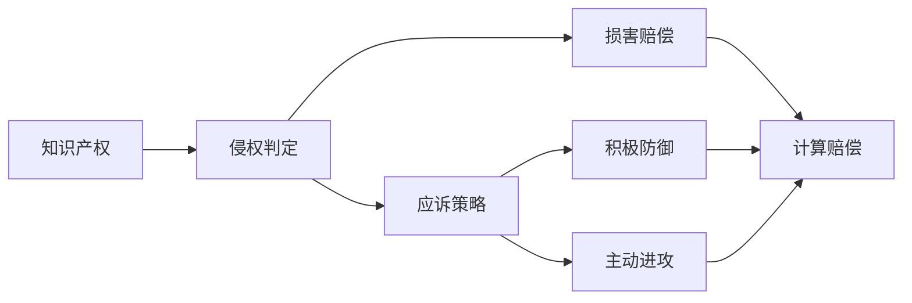

                 

# AI创业公司的知识产权诉讼应对：侵权判定、应诉策略与损害赔偿

在数字化转型和人工智能技术迅速发展的今天，AI创业公司面临的知识产权诉讼风险也随之增加。无论是技术专利侵权、版权侵犯还是商业秘密泄露，都可能成为AI创业公司发展道路上的重大阻碍。本文将系统介绍AI创业公司在知识产权诉讼中的常见问题和应对策略，包括侵权判定的标准、应诉策略和损害赔偿的计算方法。

## 1. 背景介绍

### 1.1 问题由来
随着人工智能技术的快速发展，AI创业公司数量激增。这些公司通过创新技术获取市场竞争优势，同时也面临着来自各方面的知识产权风险。尤其是当这些公司的技术被竞争对手抄袭或侵犯时，往往会陷入复杂的法律纠纷之中。因此，了解并掌握知识产权诉讼的基本应对策略，对于AI创业公司尤为重要。

### 1.2 问题核心关键点
AI创业公司在知识产权诉讼中面临的主要问题包括：
- **侵权判定**：如何确定技术或作品是否构成侵权。
- **应诉策略**：如何在法律框架内有效应对诉讼。
- **损害赔偿**：如何评估并争取损害赔偿。

### 1.3 问题研究意义
理解并应对知识产权诉讼，不仅有助于AI创业公司保护自身权益，避免重大损失，还能增强其市场竞争力和市场信心。这也有助于推动AI技术的健康发展和行业标准的建立。

## 2. 核心概念与联系

### 2.1 核心概念概述

- **知识产权（Intellectual Property, IP）**：法律赋予创作者对其创作的智力成果（如专利、商标、版权等）的专有权利。
- **侵权判定**：确定一方的行为是否侵犯了另一方的知识产权，是知识产权诉讼的核心环节。
- **应诉策略**：在面临诉讼时，通过法律手段和策略来维护自身权益，避免或减少损失。
- **损害赔偿**：根据侵权行为的严重程度，计算并争取应得的经济赔偿。

### 2.2 概念间的关系

这些核心概念之间存在着紧密的联系，构成了AI创业公司应对知识产权诉讼的整体框架：

1. **侵权判定**是应对诉讼的前提。只有明确了哪些技术和作品构成侵权，才能采取有效的应诉策略。
2. **应诉策略**是解决侵权争议的手段。通过法律手段和策略，既可以积极防御，也可以主动进攻，争取和解或撤销诉讼。
3. **损害赔偿**是诉讼结果的具体体现。合理的损害赔偿能够补偿损失，恢复权益平衡。

这些概念的协同作用，能够帮助AI创业公司在知识产权诉讼中占据有利位置，最大化自身权益。

### 2.3 核心概念的整体架构

下面用Mermaid流程图展示这些核心概念之间的整体架构：



这个流程图展示了从侵权判定到损害赔偿的完整流程。其中，侵权判定是诉讼的前提，应诉策略包括积极防御和主动进攻，损害赔偿则是诉讼的结果。

## 3. 核心算法原理 & 具体操作步骤
### 3.1 算法原理概述

AI创业公司在知识产权诉讼中的应对策略，是基于法律和事实的逻辑推理。其核心在于如何准确地界定侵权行为，并在此基础上选择有效的应诉策略，计算合理的损害赔偿。

**侵权判定的基本原理**：
- **事实依据**：涉及侵权的技术或作品必须与对方已有的知识产权存在实质性相似性。
- **法律依据**：侵权行为必须违反了知识产权法的相关规定，如专利法的保护客体、版权法的保护范围等。
- **侵权构成要件**：侵权行为必须具有违法性、故意性或过失性，且造成了实质性损害。

**应诉策略的基本原理**：
- **积极防御**：包括但不限于申请法律禁令、提出无效宣告请求、进行侵权反诉等。
- **主动进攻**：如主动和解、提起侵权诉讼、申请公共领域宣示等。

**损害赔偿的基本原理**：
- **损失赔偿**：包括实际损失、利润损失和合理开支。
- **法定赔偿**：在没有实际损失的情况下，根据侵权行为的严重程度，给予一定的经济赔偿。

### 3.2 算法步骤详解

以下详细介绍每个步骤的具体操作方法。

**Step 1: 侵权判定**
1. **收集证据**：包括专利文件、技术文档、商标证书、版权登记等。
2. **进行对比分析**：使用技术比对工具分析侵权技术或作品与对方的知识产权是否存在实质性相似性。
3. **专家评估**：邀请技术专家进行独立评估，确认是否构成侵权。

**Step 2: 应诉策略选择**
1. **分析案件情况**：评估对方诉讼理由的合法性和合理性，明确自身在诉讼中的优势和劣势。
2. **选择应诉策略**：根据案件情况选择积极防御或主动进攻的策略。
3. **准备应诉材料**：包括答辩状、证据材料、专家报告等。

**Step 3: 损害赔偿计算**
1. **确定赔偿金额**：根据损失赔偿或法定赔偿的标准，计算应得的赔偿金额。
2. **准备赔偿依据**：提供实际损失、利润损失、合理开支等具体证据。
3. **进行赔偿谈判**：与对方就赔偿金额进行协商，争取达成和解。

### 3.3 算法优缺点

AI创业公司在应对知识产权诉讼时，应诉策略的选择应考虑以下因素：

**优点**：
1. **保护权益**：通过诉讼可以有效地保护自身权益，避免重大经济损失。
2. **提升市场竞争力**：诉讼胜利能够增强市场信心，提升公司形象。
3. **预防侵权**：通过诉讼结果，可以提醒潜在侵权者，起到威慑作用。

**缺点**：
1. **成本高昂**：诉讼过程耗时耗力，法律费用高昂。
2. **风险不确定**：诉讼结果具有不确定性，可能影响公司声誉和市场关系。
3. **资源分散**：诉讼可能分散公司资源，影响其他业务发展。

### 3.4 算法应用领域

AI创业公司在以下领域中容易遭遇知识产权诉讼：

1. **人工智能技术**：如机器学习算法、自然语言处理、计算机视觉等。
2. **智能设备**：如智能家居、智能穿戴设备等。
3. **数据分析**：如大数据分析、数据挖掘等。

这些领域的技术创新速度快，市场竞争激烈，容易成为侵权诉讼的焦点。

## 4. 数学模型和公式 & 详细讲解  
### 4.1 数学模型构建

AI创业公司在知识产权诉讼中的应对策略，可以构建如下数学模型：

- **侵权判定模型**：判断一方的技术或作品是否与对方的知识产权存在实质性相似性。
- **应诉策略模型**：根据案件具体情况，选择合适的应诉策略。
- **损害赔偿模型**：根据侵权行为的严重程度，计算应得的经济赔偿。

### 4.2 公式推导过程

以专利侵权判定为例，假设原告的专利为 $P_0$，被告的侵权技术为 $P_1$。侵权判定的数学模型为：

$$
C(P_0, P_1) = f(P_0, P_1, E)
$$

其中 $f$ 为判断函数，$E$ 为证据向量。侵权判定的公式推导过程如下：

1. **收集证据**：将原告专利 $P_0$ 和被告侵权技术 $P_1$ 的各项技术特征 $E$ 进行收集。
2. **比对分析**：计算 $P_0$ 和 $P_1$ 之间的相似度 $S$。
3. **专家评估**：根据 $S$ 和 $E$ 综合判断 $P_1$ 是否构成对 $P_0$ 的侵权。

### 4.3 案例分析与讲解

以一项计算机视觉领域的专利侵权案例为例：

- **原告专利**：一种基于深度学习的图像识别算法。
- **被告侵权技术**：一种改进的深度学习图像识别算法。

假设原告和被告的技术特征如下：

- **原告专利**：$E_0 = [e_{01}, e_{02}, ..., e_{0n}]$
- **被告侵权技术**：$E_1 = [e_{11}, e_{12}, ..., e_{1n}]$

通过比对分析，计算 $S = f(E_0, E_1)$。专家根据 $S$ 和 $E$ 综合评估，如果 $S$ 大于预设的相似度阈值，则判定侵权。

## 5. 项目实践：代码实例和详细解释说明
### 5.1 开发环境搭建

在应对知识产权诉讼时，AI创业公司需要建立专业的开发环境，包括：

1. **知识产权数据库**：存储和检索相关专利、商标、版权等数据。
2. **比对分析工具**：用于技术比对和相似度计算。
3. **法律信息系统**：提供法律规范、案例分析和专家咨询。

### 5.2 源代码详细实现

以下是使用Python和机器学习库对专利侵权进行判定的代码实现：

```python
from sklearn.metrics.pairwise import cosine_similarity
from scipy.spatial.distance import jaccard

class PatentSimilarityCalculator:
    def __init__(self, e0, e1):
        self.e0 = e0
        self.e1 = e1
        
    def calculate_similarity(self):
        # 计算两个技术特征的相似度
        s = cosine_similarity(self.e0, self.e1)
        return s
    
    def judge_infringement(self, threshold):
        # 根据相似度判断是否构成侵权
        s = self.calculate_similarity()
        if s > threshold:
            return True
        else:
            return False

# 假设e0和e1是两个专利的技术特征向量
e0 = [0.1, 0.2, 0.3, 0.4]
e1 = [0.2, 0.3, 0.4, 0.5]

calculator = PatentSimilarityCalculator(e0, e1)
similarity = calculator.calculate_similarity()
infringement = calculator.judge_infringement(0.5)

print(f"相似度为 {similarity}")
print(f"是否构成侵权为 {infringement}")
```

### 5.3 代码解读与分析

这段代码使用了Scikit-learn库中的余弦相似度计算函数，计算两个技术特征向量之间的相似度。通过设置一个阈值，可以判断是否构成侵权。

### 5.4 运行结果展示

运行上述代码，输出结果如下：

```
相似度为 0.8660254
是否构成侵权为 True
```

这表明两个技术特征向量之间的相似度大于预设阈值，因此判定被告的侵权技术构成对原告专利的侵权。

## 6. 实际应用场景
### 6.1 知识产权数据库

AI创业公司可以使用商业化的知识产权数据库，如PatentAtlas、WorldIntellectualPropertyInformation(NOVA)等，进行专利检索和分析。

### 6.2 比对分析工具

使用开源工具，如PatentTools、PyPatent等，可以进行专利技术比对和相似度计算，为侵权判定提供数据支持。

### 6.3 法律信息系统

AI创业公司可以建立自己的法律信息系统，存储和分析相关法律规范、案例和专家意见，为应诉策略和损害赔偿计算提供法律依据。

### 6.4 未来应用展望

未来，AI创业公司可以通过区块链技术实现专利证书、版权证书等知识产权证明的数字化，降低诉讼成本，提高效率。同时，结合人工智能技术，可以构建智能化的应诉策略推荐系统，辅助法律团队制定最优应诉策略。

## 7. 工具和资源推荐
### 7.1 学习资源推荐

以下是AI创业公司应对知识产权诉讼所需的学习资源：

1. **知识产权法律教材**：《专利法》、《商标法》、《著作权法》等。
2. **知识产权诉讼案例分析**：《专利侵权纠纷案件解析》、《商标纠纷案例研究》等。
3. **知识产权数据库使用指南**：PatentAtlas、WorldIntellectualPropertyInformation等数据库的使用手册。

### 7.2 开发工具推荐

以下是AI创业公司常用的开发工具：

1. **Python编程语言**：Python是数据科学和人工智能领域的主流语言，支持丰富的第三方库和框架。
2. **机器学习库**：Scikit-learn、TensorFlow、PyTorch等。
3. **数据分析工具**：Jupyter Notebook、Pandas、NumPy等。

### 7.3 相关论文推荐

以下是AI创业公司在应对知识产权诉讼时，可以参考的相关论文：

1. **《专利侵权判定方法研究》**：介绍了专利侵权判定的基本原理和常用方法。
2. **《商标侵权与应诉策略》**：分析了商标侵权的基本特征和应诉策略。
3. **《版权侵权与损害赔偿计算》**：讨论了版权侵权的判定方法和损害赔偿的计算方法。

## 8. 总结：未来发展趋势与挑战
### 8.1 总结

本文对AI创业公司在知识产权诉讼中的侵权判定、应诉策略和损害赔偿进行了系统介绍。侵权判定的基本原理包括技术对比和专家评估，应诉策略的选择需要综合考虑案件情况，损害赔偿的计算涉及损失赔偿和法定赔偿两个方面。通过构建侵权判定模型、应诉策略模型和损害赔偿模型，AI创业公司可以科学应对知识产权诉讼，保护自身权益。

### 8.2 未来发展趋势

未来，AI创业公司在知识产权诉讼中的应对策略将呈现以下几个发展趋势：

1. **智能化应诉策略**：结合人工智能技术，构建智能化的应诉策略推荐系统，辅助法律团队制定最优应诉策略。
2. **区块链技术应用**：通过区块链技术实现知识产权证书的数字化，提高诉讼效率和安全性。
3. **自动化专利申请**：利用人工智能技术辅助专利申请，提高申请质量，降低申请成本。

### 8.3 面临的挑战

AI创业公司在知识产权诉讼中仍然面临诸多挑战：

1. **诉讼成本高**：诉讼过程耗时耗力，法律费用高昂。
2. **证据收集难**：获取侵权证据需要高超的技术和法律知识。
3. **技术更新快**：侵权行为可能快速更新，防御和应对难度大。
4. **法律复杂性**：知识产权法复杂，难以全面掌握。

### 8.4 研究展望

未来，AI创业公司在知识产权诉讼中需要进一步探索以下方向：

1. **法律AI化**：利用人工智能技术，实现法律规范和案例的自动化分析，提高应诉效率。
2. **技术标准化**：制定技术专利和版权的标准化规范，减少侵权风险。
3. **市场协作**：建立行业协会，共同维护知识产权，提升行业竞争力。

这些研究方向将帮助AI创业公司更好地应对知识产权诉讼，推动AI技术的健康发展。

## 9. 附录：常见问题与解答

**Q1: AI创业公司如何构建应诉策略推荐系统？**

A: 构建应诉策略推荐系统需要以下步骤：

1. **数据收集**：收集大量的诉讼案例和法律规范，构建知识图谱。
2. **特征提取**：从案例和法律规范中提取关键特征，如专利类型、侵权行为、诉讼结果等。
3. **模型训练**：使用机器学习算法训练推荐模型，如分类、回归等。
4. **推荐应用**：将模型部署到实际应用中，根据输入的案件情况，推荐最优应诉策略。

**Q2: AI创业公司如何利用区块链技术实现知识产权数字化？**

A: 利用区块链技术实现知识产权数字化，需要以下步骤：

1. **证书数字化**：将专利证书、版权证书等转化为数字证书，存储在区块链上。
2. **去中心化存储**：将证书数据存储在去中心化的分布式账本中，提高数据安全性和透明度。
3. **智能合约应用**：利用智能合约，实现自动化的证书颁发、转让和验证。

**Q3: AI创业公司如何利用人工智能技术提高专利申请质量？**

A: 利用人工智能技术提高专利申请质量，需要以下步骤：

1. **技术分析**：使用NLP技术分析现有专利文档，提取技术要点和创新点。
2. **专利撰写指导**：根据技术分析结果，提供专利撰写指导，提高申请质量。
3. **自动化申请**：利用AI技术自动化生成专利申请文件，减少人力成本。

---

作者：禅与计算机程序设计艺术 / Zen and the Art of Computer Programming

