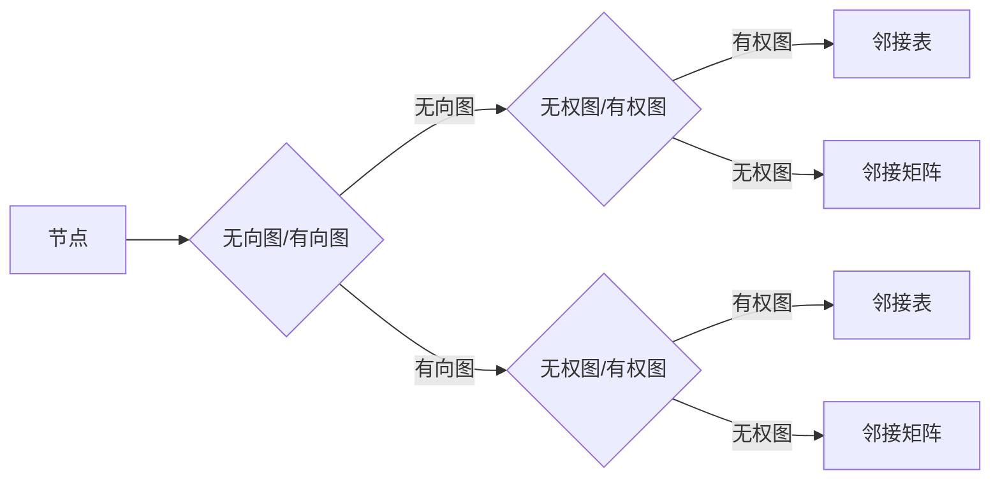

# 【AI大数据计算原理与代码实例讲解】图算法

> 关键词：图算法，图神经网络，深度学习，图遍历，路径搜索，社区检测，链接预测，图数据库，AIGC

## 1. 背景介绍

在互联网时代，数据无处不在，其中图数据以其独特的结构和丰富的信息，成为了数据科学和人工智能领域的重要研究对象。图算法作为图数据分析的核心工具，被广泛应用于社交网络分析、推荐系统、知识图谱构建、生物信息学等多个领域。本文将深入探讨图算法的原理、实现和应用，并通过代码实例展示如何在Python中实现这些算法。

### 1.1 图算法的由来

图算法起源于20世纪中叶，随着计算机科学的兴起和发展，图算法逐渐成为数据分析和人工智能领域的重要分支。图算法的研究对象是图数据，图数据由节点（Vertex）和边（Edge）组成，能够有效地表示复杂关系和数据依赖。

### 1.2 研究现状

随着深度学习技术的快速发展，图神经网络（Graph Neural Networks, GNNs）成为图算法领域的热点研究方向。GNNs能够直接在图结构上进行学习，有效地捕捉节点和边之间的关系，在节点分类、链接预测、社区检测等任务上取得了显著的成果。

### 1.3 研究意义

图算法在各个领域都有广泛的应用，具有重要的研究意义：

- **社交网络分析**：通过图算法分析社交网络中的关系，可以识别关键节点、社区结构、传播路径等。
- **推荐系统**：利用图算法分析用户和物品之间的交互关系，可以提供更加个性化的推荐。
- **知识图谱构建**：图算法可以用于构建和优化知识图谱，提高知识图谱的准确性和完整性。
- **生物信息学**：图算法可以用于分析生物分子网络，研究蛋白质的功能和相互作用。

### 1.4 本文结构

本文将按照以下结构进行讲解：

- 第二部分介绍图算法的核心概念与联系。
- 第三部分深入探讨图算法的核心原理和具体操作步骤。
- 第四部分通过数学模型和公式详细讲解图算法的数学原理。
- 第五部分通过项目实践，展示如何在Python中实现图算法。
- 第六部分分析图算法的实际应用场景。
- 第七部分展望图算法的未来发展趋势和挑战。
- 第八部分总结全文，并对研究展望进行讨论。

## 2. 核心概念与联系

### 2.1 图的概念

图（Graph）是由节点（Vertex）和边（Edge）组成的集合。节点表示实体，边表示实体之间的关系。图可以分为无向图和无权图、有向图和有权图等。

### 2.2 图的表示

图可以采用邻接表、邻接矩阵、边列表等多种方式进行表示。

### 2.3 Mermaid流程图



### 2.4 图算法的核心概念

- **图遍历**：在图中依次访问所有节点的过程。
- **路径搜索**：在图中寻找两个节点之间最短路径的过程。
- **社区检测**：将图中的节点划分为若干个社区的过程。
- **链接预测**：预测图中可能存在的边的过程。

## 3. 核心算法原理 & 具体操作步骤

### 3.1 算法原理概述

图算法的核心原理是利用图的结构特性，通过遍历、搜索、分类等操作，对图数据进行分析和处理。

### 3.2 算法步骤详解

#### 3.2.1 图遍历

图遍历算法包括深度优先搜索（DFS）和广度优先搜索（BFS）。

- **深度优先搜索（DFS）**：从某个节点开始，沿着一条路径深入到最远节点，然后回溯。
- **广度优先搜索（BFS）**：从某个节点开始，沿着所有相邻的节点进行遍历。

#### 3.2.2 路径搜索

路径搜索算法包括最短路径算法（Dijkstra算法、A*算法）和最长路径算法。

- **Dijkstra算法**：找到图中两点之间最短路径的算法。
- **A*算法**：结合启发式搜索和Dijkstra算法，找到图中两点之间最短路径的算法。

#### 3.2.3 社区检测

社区检测算法包括基于模块度的社区检测（Louvain算法）、基于图的聚类算法（ Girvan-Newman算法）等。

- **Louvain算法**：基于模块度优化的社区检测算法。
- **Girvan-Newman算法**：基于图分解的社区检测算法。

#### 3.2.4 链接预测

链接预测算法包括基于相似度的链接预测、基于矩阵分解的链接预测等。

- **基于相似度的链接预测**：通过计算节点之间的相似度，预测可能存在的边。
- **基于矩阵分解的链接预测**：通过矩阵分解技术，预测可能存在的边。

### 3.3 算法优缺点

- **DFS**：优点是简单易懂，能够遍历所有节点；缺点是时间复杂度较高，容易陷入死循环。
- **BFS**：优点是时间复杂度较低，不易陷入死循环；缺点是空间复杂度较高，需要存储所有已访问节点。
- **Dijkstra算法**：优点是能够找到最短路径；缺点是时间复杂度较高，不适合大规模图。
- **A*算法**：优点是结合了启发式搜索和Dijkstra算法，能够快速找到最短路径；缺点是启发式函数的选择对算法性能影响较大。
- **Louvain算法**：优点是模块度优化，能够找到较为稳定的社区结构；缺点是算法复杂度较高。
- **Girvan-Newman算法**：优点是算法简单，容易理解；缺点是社区结构可能不稳定。

### 3.4 算法应用领域

图算法在各个领域都有广泛的应用，例如：

- **社交网络分析**：用于分析社交网络中的关系，识别关键节点、社区结构、传播路径等。
- **推荐系统**：用于分析用户和物品之间的交互关系，提供个性化推荐。
- **知识图谱构建**：用于构建和优化知识图谱，提高知识图谱的准确性和完整性。
- **生物信息学**：用于分析生物分子网络，研究蛋白质的功能和相互作用。

## 4. 数学模型和公式 & 详细讲解 & 举例说明

### 4.1 数学模型构建

图算法的数学模型主要包括图的表示、图的遍历、路径搜索、社区检测和链接预测等。

### 4.2 公式推导过程

- **图遍历**：

  - **DFS**：

    $$
    DFS(v) = \begin{cases}
    \text{访问节点 } v \\
    \text{递归遍历邻居节点} \\
    \end{cases}
    $$

  - **BFS**：

    $$
    BFS(v) = \begin{cases}
    \text{将节点 } v \text{ 入队} \\
    \text{出队一个节点 } u \\
    \text{将 } u \text{ 的所有未访问邻居入队} \\
    \text{递归遍历 } u \text{ 的邻居节点} \\
    \end{cases}
    $$

- **路径搜索**：

  - **Dijkstra算法**：

    $$
    d(s,v) = \begin{cases}
    \infty & \text{if } s \neq v \\
    0 & \text{if } s = v \\
    \min_{u \in N(v)} (d(s,u) + w(u,v)) & \text{otherwise} \\
    \end{cases}
    $$

  - **A*算法**：

    $$
    f(n) = g(n) + h(n)
    $$

    其中，$g(n)$ 为从起点到节点 $n$ 的代价，$h(n)$ 为从节点 $n$ 到目标点的启发式代价。

- **社区检测**：

  - **Louvain算法**：

    $$
    mod(Q_{k+1}) = \sum_{i=1}^V \sum_{j=1}^V \frac{|N(i) \cap N(j)|^2}{|N(i)| \cdot |N(j)|}
    $$

- **链接预测**：

  - **基于相似度的链接预测**：

    $$
    similarity(u,v) = \frac{cos(\theta(u), \theta(v))}{\max(cos(\theta(u), \theta(v)), \epsilon)}
    $$

    其中，$\theta(u)$ 和 $\theta(v)$ 分别为节点 $u$ 和 $v$ 的特征向量，$\epsilon$ 为阈值。

### 4.3 案例分析与讲解

以社交网络分析为例，使用DFS和BFS算法分析社交网络中的节点关系。

```python
import networkx as nx
import matplotlib.pyplot as plt

# 创建图
G = nx.Graph()
G.add_edges_from([(1, 2), (2, 3), (3, 4), (4, 1), (2, 5)])

# DFS遍历
def dfs(G, start):
    visited = set()
    stack = [start]
    while stack:
        node = stack.pop()
        if node not in visited:
            print(node)
            visited.add(node)
            stack.extend(list(G.neighbors(node)))

dfs(G, 1)

# BFS遍历
def bfs(G, start):
    visited = set()
    queue = [start]
    while queue:
        node = queue.pop(0)
        if node not in visited:
            print(node)
            visited.add(node)
            queue.extend(list(G.neighbors(node)))

bfs(G, 1)
```

运行上述代码，可以看到DFS和BFS算法都能够遍历图中的所有节点。

## 5. 项目实践：代码实例和详细解释说明

### 5.1 开发环境搭建

在Python中实现图算法，需要安装以下库：

- NetworkX：用于图数据的表示和操作。
- Matplotlib：用于可视化图数据。
- NumPy：用于数学计算。

```bash
pip install networkx matplotlib numpy
```

### 5.2 源代码详细实现

以下是一个使用NetworkX实现DFS和BFS算法的示例：

```python
import networkx as nx

# 创建图
G = nx.Graph()
G.add_edges_from([(1, 2), (2, 3), (3, 4), (4, 1), (2, 5)])

# DFS遍历
def dfs(G, start):
    visited = set()
    stack = [start]
    while stack:
        node = stack.pop()
        if node not in visited:
            print(node)
            visited.add(node)
            stack.extend(list(G.neighbors(node)))

dfs(G, 1)

# BFS遍历
def bfs(G, start):
    visited = set()
    queue = [start]
    while queue:
        node = queue.pop(0)
        if node not in visited:
            print(node)
            visited.add(node)
            queue.extend(list(G.neighbors(node)))

bfs(G, 1)
```

### 5.3 代码解读与分析

上述代码中，首先使用NetworkX创建了图对象G，并添加了节点和边。然后定义了dfs和Bfs函数，分别实现了深度优先搜索和广度优先搜索算法。在dfs函数中，使用栈作为遍历的存储结构，在bfs函数中使用队列作为存储结构。在遍历过程中，记录已访问节点，避免重复访问。

### 5.4 运行结果展示

运行上述代码，可以看到DFS和BFS算法都能够遍历图中的所有节点，并输出遍历顺序。

## 6. 实际应用场景

### 6.1 社交网络分析

图算法在社交网络分析中有着广泛的应用，例如：

- **社区检测**：识别社交网络中的紧密社区结构，分析用户群体特征。
- **影响力分析**：识别网络中具有较高影响力的节点，用于舆情监测和营销推广。
- **传播路径分析**：分析信息的传播路径，研究病毒式营销的传播效果。

### 6.2 推荐系统

图算法在推荐系统中可以用于：

- **物品推荐**：根据用户和物品之间的关系，推荐用户可能感兴趣的物品。
- **相似物品推荐**：推荐与用户已购买或收藏的物品相似的物品。

### 6.3 知识图谱构建

图算法可以用于知识图谱的构建和优化，例如：

- **实体识别**：识别文本中的实体，并构建实体关系。
- **关系抽取**：抽取实体之间的关系，构建知识图谱。

### 6.4 生物信息学

图算法在生物信息学中可以用于：

- **蛋白质相互作用网络分析**：分析蛋白质之间的相互作用，研究蛋白质的功能和疾病机制。
- **药物发现**：利用图算法分析药物分子与生物分子之间的相互作用，发现新的药物靶点。

## 7. 工具和资源推荐

### 7.1 学习资源推荐

- 《图算法》
- 《图神经网络》
- 《图数据库》
- 《社交网络分析》

### 7.2 开发工具推荐

- NetworkX：用于图数据的表示和操作。
- Matplotlib：用于可视化图数据。
- NumPy：用于数学计算。
- PyTorch：用于深度学习。

### 7.3 相关论文推荐

- 《Graph Neural Networks》
- 《GraphDB》
- 《Social Network Analysis》
- 《Bioinformatics》

## 8. 总结：未来发展趋势与挑战

### 8.1 研究成果总结

本文从图算法的核心概念、原理、实现和应用等方面进行了全面的介绍。通过代码实例，展示了如何在Python中实现图算法。同时，分析了图算法在各个领域的实际应用场景。

### 8.2 未来发展趋势

- **图算法与深度学习融合**：将图算法与深度学习技术相结合，构建更加智能的图模型。
- **图算法优化**：针对图算法的效率、可扩展性等方面进行优化，使其能够处理大规模图数据。
- **图数据库的发展**：图数据库将成为图数据存储和分析的重要工具。

### 8.3 面临的挑战

- **图数据的稀疏性**：图数据通常具有稀疏性，需要开发高效的数据结构和管理算法。
- **图算法的可扩展性**：大规模图数据的处理需要可扩展的图算法。
- **图算法的复杂性**：图算法的原理和实现相对复杂，需要开发更加直观和易于使用的工具。

### 8.4 研究展望

图算法在未来将继续在数据科学和人工智能领域发挥重要作用。随着图数据规模的不断扩大，图算法的研究将更加深入，并与其他人工智能技术相结合，为各个领域带来新的突破。

## 9. 附录：常见问题与解答

### 9.1 常见问题

- Q1：图算法和图神经网络有什么区别？
- A1：图算法是图数据分析的基本方法，图神经网络是利用图结构进行学习的一种深度学习模型。

- Q2：如何选择合适的图算法？
- A2：根据具体的应用场景和数据特点选择合适的图算法。例如，社交网络分析可以使用社区检测算法，推荐系统可以使用链接预测算法。

- Q3：图算法在Python中如何实现？
- A3：可以使用NetworkX等库在Python中实现图算法。

- Q4：图算法的应用场景有哪些？
- A4：图算法在社交网络分析、推荐系统、知识图谱构建、生物信息学等多个领域都有广泛的应用。

作者：禅与计算机程序设计艺术 / Zen and the Art of Computer Programming