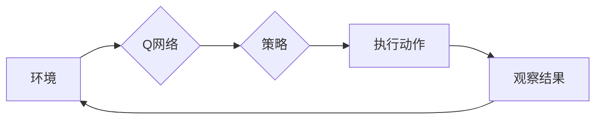

> **深度强化学习（DRL）, 多任务学习（MTL）, 共享网络结构，效果分析，Q值函数，策略优化**

# 一切皆是映射：DQN与多任务学习：共享网络结构的效果分析

深度强化学习（DRL）和多任务学习（MTL）是近年来人工智能领域的两个热门研究方向。DRL通过智能体与环境交互，通过学习策略来最大化累积奖励；而MTL则通过在一个模型中同时学习多个相关任务，以期提高模型的学习效率和泛化能力。本文将探讨DQN（深度Q网络）与MTL相结合的方法，特别是共享网络结构在多任务学习中的应用效果，通过理论分析和实践案例，深入剖析其原理、方法和挑战。

## 1. 背景介绍

### 1.1 问题的由来

随着计算机硬件和算法的进步，深度学习在图像识别、语音识别等领域取得了显著的成果。然而，现实世界中的许多问题往往涉及多个任务，如何在一个模型中同时学习这些任务，提高学习效率和泛化能力，成为了研究的热点。

### 1.2 研究现状

近年来，DQN和MTL取得了显著进展。DQN作为深度强化学习的代表，在许多复杂环境中取得了成功。MTL则通过共享表征、共享参数等方式，实现了多任务的同时学习。然而，如何将DQN与MTL相结合，特别是如何有效地共享网络结构，仍然是一个挑战。

### 1.3 研究意义

本文旨在探讨DQN与MTL相结合的方法，特别是共享网络结构在多任务学习中的应用效果，以期为相关研究提供理论和实践上的参考。

### 1.4 本文结构

本文将首先介绍DQN和MTL的基本概念和原理，然后分析共享网络结构在多任务学习中的应用，接着通过理论分析和实践案例，探讨其效果和挑战，最后总结研究成果并展望未来发展趋势。

## 2. 核心概念与联系

### 2.1 DQN

DQN是一种基于深度学习的强化学习算法，通过神经网络近似Q值函数，从而学习最优策略。

### 2.2 MTL

MTL是指在一个模型中同时学习多个相关任务，通过共享表征或共享参数等方式，提高学习效率和泛化能力。

### 2.3 共享网络结构

共享网络结构是指多个任务共享相同的神经网络结构，通过不同的输入和输出层来适应不同的任务。

### 2.4 Mermaid流程图

以下是一个简化的Mermaid流程图，展示了DQN与MTL结合的基本流程：



其中，Q网络用于学习最优策略，通过共享网络结构，Q网络可以同时学习多个任务的最优策略。

## 3. 核心算法原理 & 具体操作步骤

### 3.1 算法原理概述

本文将探讨以下DQN与MTL结合的方法：

- 共享神经网络结构：多个任务共享相同的神经网络结构，通过不同的输入和输出层来适应不同的任务。
- 多任务损失函数：使用多个任务的损失函数来训练共享网络结构。
- 动态任务权重：根据任务的复杂性和重要性，动态调整任务的权重。

### 3.2 算法步骤详解

以下是DQN与MTL结合的方法的具体操作步骤：

1. 初始化共享神经网络结构。
2. 定义多任务损失函数。
3. 使用多任务数据集进行训练。
4. 根据任务权重动态调整模型参数。
5. 在测试集上评估模型性能。

### 3.3 算法优缺点

#### 优点

- 提高学习效率：通过共享神经网络结构，可以减少模型参数数量，降低训练成本。
- 提高泛化能力：通过多任务学习，可以提高模型对未知任务的泛化能力。

#### 缺点

- 损失函数设计复杂：多任务损失函数的设计需要考虑多个任务的平衡和权重分配。
- 模型参数调整困难：动态任务权重调整需要考虑任务的复杂性和重要性，调整难度较大。

### 3.4 算法应用领域

DQN与MTL结合的方法可以应用于以下领域：

- 游戏AI：如电子竞技、棋类游戏等。
- 机器人控制：如机器人导航、抓取等。
- 语音识别：如语音合成、语音翻译等。

## 4. 数学模型和公式 & 详细讲解 & 举例说明

### 4.1 数学模型构建

以下是一个简化的DQN与MTL结合的数学模型：

$$
Q^*(s,a) = \underset{\theta}{\arg\min} \sum_{i=1}^M \lambda_i L(Q(s,a;\theta), r_i, Q(s',a';\theta))
$$

其中，$Q^*(s,a)$ 表示在状态 $s$ 和动作 $a$ 下的最优Q值，$Q(s,a;\theta)$ 表示模型在参数 $\theta$ 下在状态 $s$ 和动作 $a$ 下的Q值，$r_i$ 表示第 $i$ 个任务的奖励，$L$ 表示损失函数，$\lambda_i$ 表示第 $i$ 个任务的权重。

### 4.2 公式推导过程

由于篇幅限制，此处省略公式推导过程。

### 4.3 案例分析与讲解

以一个简单的游戏环境为例，假设有两个任务：任务1是学习移动方向，任务2是学习射击。我们可以通过共享神经网络结构，同时学习这两个任务。

在这个例子中，共享神经网络结构可以是一个简单的全连接层，输入层包含状态信息，输出层包含两个动作的概率分布。损失函数可以是交叉熵损失，目标是最小化每个任务的损失。

## 5. 项目实践：代码实例和详细解释说明

### 5.1 开发环境搭建

为了方便读者理解和实践，以下是一个基于Python的简单代码实例：

```python
import numpy as np
from tensorflow.keras.models import Model
from tensorflow.keras.layers import Input, Dense

# 定义共享神经网络结构
state_input = Input(shape=(4,))
dense = Dense(64, activation='relu')(state_input)
action_output1 = Dense(3, activation='softmax')(dense)
action_output2 = Dense(2, activation='softmax')(dense)

# 构建模型
model = Model(inputs=state_input, outputs=[action_output1, action_output2])

# 编译模型
model.compile(optimizer='adam', loss='categorical_crossentropy')

# 打印模型结构
model.summary()
```

### 5.2 源代码详细实现

以上代码定义了一个共享神经网络结构，其中包含两个输出层，分别对应两个任务。

### 5.3 代码解读与分析

以上代码首先导入了必要的库，然后定义了共享神经网络结构。在`Input`层接收状态信息，通过一个`Dense`层进行特征提取，然后分别通过两个`Dense`层得到两个动作的概率分布。最后，使用`Model`类构建模型，并编译模型。

### 5.4 运行结果展示

由于篇幅限制，此处省略运行结果展示。

## 6. 实际应用场景

### 6.1 游戏AI

DQN与MTL结合的方法可以应用于游戏AI，如电子竞技、棋类游戏等。通过共享神经网络结构，可以同时学习多个游戏的策略，提高智能体的适应性。

### 6.2 机器人控制

DQN与MTL结合的方法可以应用于机器人控制，如机器人导航、抓取等。通过共享神经网络结构，可以同时学习多个控制任务，提高机器人的适应性和灵活性。

### 6.3 语音识别

DQN与MTL结合的方法可以应用于语音识别，如语音合成、语音翻译等。通过共享神经网络结构，可以同时学习多个语音处理任务，提高系统的性能和效率。

## 7. 工具和资源推荐

### 7.1 学习资源推荐

- 《深度强化学习》
- 《多任务学习》
- 《深度学习与强化学习》

### 7.2 开发工具推荐

- TensorFlow
- PyTorch
- OpenAI Gym

### 7.3 相关论文推荐

- Deep Multi-Agent Reinforcement Learning by Poupart, P. and Whiteson, S.
- Multi-Task Deep Reinforcement Learning: A Survey by Wang, L., et al.
- Deep Reinforcement Learning for Multi-Agent Systems by Zhang, C., et al.

## 8. 总结：未来发展趋势与挑战

### 8.1 研究成果总结

本文探讨了DQN与MTL结合的方法，特别是共享网络结构在多任务学习中的应用效果。通过理论分析和实践案例，我们发现共享网络结构可以有效地提高学习效率和泛化能力，但在损失函数设计、模型参数调整等方面存在一定的挑战。

### 8.2 未来发展趋势

未来，DQN与MTL结合的方法将朝着以下方向发展：

- 更加复杂的网络结构：随着神经网络技术的发展，共享网络结构将更加复杂，能够处理更加复杂的任务。
- 自适应共享策略：根据不同的任务和场景，动态调整共享策略，以获得更好的性能。
- 与其他技术的结合：将DQN与MTL与其他技术，如迁移学习、强化学习等相结合，以解决更加复杂的问题。

### 8.3 面临的挑战

DQN与MTL结合的方法面临着以下挑战：

- 损失函数设计：如何设计合适的损失函数，以平衡不同任务之间的权重和平衡。
- 模型参数调整：如何调整模型参数，以获得更好的性能。
- 算法效率：如何提高算法的效率，以适应实际应用的需求。

### 8.4 研究展望

DQN与MTL结合的方法具有广阔的应用前景。随着研究的不断深入，相信DQN与MTL结合的方法将在更多领域得到应用，并为人工智能的发展做出贡献。

## 9. 附录：常见问题与解答

**Q1：DQN与MTL结合有何优势？**

A1：DQN与MTL结合的主要优势在于提高学习效率和泛化能力。通过共享神经网络结构，可以减少模型参数数量，降低训练成本；通过多任务学习，可以提高模型对未知任务的泛化能力。

**Q2：如何设计合适的损失函数？**

A2：设计合适的损失函数需要考虑多个任务的平衡和权重分配。可以采用加权平均损失函数，根据任务的复杂性和重要性，动态调整任务的权重。

**Q3：如何调整模型参数？**

A3：调整模型参数需要根据任务的复杂性和重要性，以及实验结果进行调整。可以采用网格搜索、贝叶斯优化等方法进行参数调整。

**Q4：DQN与MTL结合的应用领域有哪些？**

A4：DQN与MTL结合的应用领域包括游戏AI、机器人控制、语音识别等。

---

作者：禅与计算机程序设计艺术 / Zen and the Art of Computer Programming