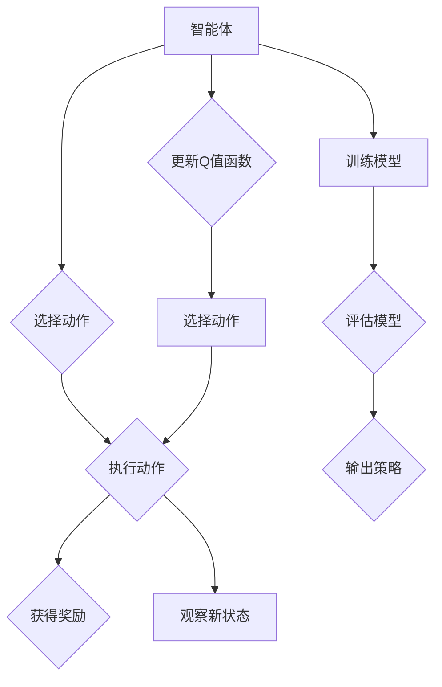

> Q-learning, DQN, 异步方法, A3C, A2C, 强化学习, 联邦学习, 分布式训练

# 一切皆是映射：DQN中的异步方法：A3C与A2C详解

强化学习（Reinforcement Learning，RL）是一种让智能体在与环境交互的过程中学习如何采取最优策略以实现目标的方法。其中，深度Q网络（Deep Q-Network，DQN）是强化学习领域的一项重要突破，它结合了深度学习和Q-learning，使得智能体能够在高维空间中进行有效的学习。然而，DQN在训练过程中存在一定的局限性，如计算量大、样本效率低等。为了解决这些问题，研究者提出了异步方法，其中A3C（Asynchronous Advantage Actor-Critic）和A2C（Asynchronous Advantage Actor-Critic）是最具代表性的两种。本文将深入探讨DQN中的异步方法，并对A3C与A2C进行详细解析。

## 1. 背景介绍

### 1.1 Q-learning与DQN

Q-learning是一种基于值函数的强化学习算法，通过学习状态-动作值函数（Q值）来选择动作。DQN将深度神经网络与Q-learning相结合，通过神经网络来近似Q值函数，从而在复杂的高维环境中进行学习。

### 1.2 DQN的局限性

DQN在训练过程中存在以下局限性：

- **计算量大**：DQN需要迭代更新Q值函数，每个迭代步骤都需要遍历所有可能的动作，计算量巨大。
- **样本效率低**：DQN需要大量的经验数据进行训练，样本效率较低。
- **学习速度慢**：由于DQN依赖于经验回放（Experience Replay），需要大量的数据来填充经验回放池，导致学习速度较慢。

## 2. 核心概念与联系

### 2.1 异步方法

为了解决DQN的局限性，研究者提出了异步方法。异步方法的核心思想是将训练过程分解为多个并行执行的子过程，从而提高计算效率和学习速度。

### 2.2 A3C与A2C

A3C和A2C是两种常见的异步方法。它们的主要区别在于是否使用策略梯度来更新策略网络。

#### Mermaid 流程图



### 2.3 联邦学习

联邦学习（Federated Learning，FL）是异步方法的一种扩展，它允许多个智能体在本地进行训练，并通过聚合模型来更新全局模型。

## 3. 核心算法原理 & 具体操作步骤

### 3.1 算法原理概述

A3C和A2C的核心原理是通过并行训练多个智能体来加速DQN的训练过程。

### 3.2 算法步骤详解

#### A3C

1. 初始化多个智能体，每个智能体运行在不同的线程或机器上。
2. 每个智能体独立地与环境交互，收集经验数据。
3. 将收集到的经验数据发送到中心服务器，用于训练全局模型。
4. 更新全局模型后，将更新后的模型参数发送回每个智能体。

#### A2C

A2C与A3C类似，但不同之处在于：

1. 每个智能体不仅收集经验数据，还直接更新全局模型。
2. 更新全局模型后，将更新后的模型参数发送回每个智能体。

### 3.3 算法优缺点

#### A3C

优点：

- 提高计算效率，加速DQN的训练过程。
- 通过并行训练，可以更好地利用多核CPU和GPU等硬件资源。

缺点：

- 需要中心服务器进行模型参数的存储和分发。
- 可能存在模型参数更新的冲突。

#### A2C

优点：

- 无需中心服务器，降低了部署难度。
- 每个智能体直接更新全局模型，可以更好地利用智能体之间的协作。

缺点：

- 计算效率相对较低，因为每个智能体都需要进行模型训练。
- 需要解决智能体之间的协作问题。

### 3.4 算法应用领域

A3C和A2C在以下领域有广泛的应用：

- 游戏AI：如Atari游戏、StarCraft II等。
- 机器人控制：如机器人导航、抓取等。
- 股票交易：如股票价格预测、交易策略制定等。

## 4. 数学模型和公式 & 详细讲解 & 举例说明

### 4.1 数学模型构建

A3C和A2C的数学模型基于DQN，并引入了策略梯度。

#### 数学公式

$$
Q(s,a) = \sum_{s',a'} \gamma Q(s',a') \pi(a'|s)
$$

其中，$Q(s,a)$ 是状态-动作值函数，$\gamma$ 是折扣因子，$\pi(a'|s)$ 是策略函数。

### 4.2 公式推导过程

A3C和A2C的公式推导过程与DQN类似，但引入了策略梯度。

### 4.3 案例分析与讲解

以Atari游戏为例，A3C和A2C可以用于训练一个智能体在Atari游戏中的策略。

## 5. 项目实践：代码实例和详细解释说明

### 5.1 开发环境搭建

1. 安装Python 3.6及以上版本。
2. 安装TensorFlow 2.0及以上版本。
3. 安装其他必要的库，如NumPy、Pandas等。

### 5.2 源代码详细实现

以下是一个使用TensorFlow实现A3C的简单示例：

```python
import tensorflow as tf

# 定义策略网络
class PolicyNetwork(tf.keras.Model):
    def __init__(self, state_size, action_size):
        super(PolicyNetwork, self).__init__()
        self.fc1 = tf.keras.layers.Dense(128, activation='relu')
        self.fc2 = tf.keras.layers.Dense(action_size)

    def call(self, state):
        x = self.fc1(state)
        return self.fc2(x)

# 定义价值网络
class ValueNetwork(tf.keras.Model):
    def __init__(self, state_size):
        super(ValueNetwork, self).__init__()
        self.fc1 = tf.keras.layers.Dense(128, activation='relu')
        self.fc2 = tf.keras.layers.Dense(1)

    def call(self, state):
        x = self.fc1(state)
        return self.fc2(x)

# 定义A3C算法
class A3CAgent:
    def __init__(self, state_size, action_size):
        self.policy_network = PolicyNetwork(state_size, action_size)
        self.value_network = ValueNetwork(state_size)
        self.optimizer = tf.keras.optimizers.Adam(learning_rate=0.001)

    def act(self, state):
        state = tf.convert_to_tensor(state, dtype=tf.float32)
        act_probs = self.policy_network(state)
        act_dist = tfp.distributions.Categorical(logits=act_probs)
        action = act_dist.sample()
        return action.numpy()[0], act_dist.log_prob(action).numpy()[0]

    def learn(self, rewards, actions, values, dones):
        # 计算优势值
        advantages = rewards - values

        # 计算梯度
        with tf.GradientTape() as tape:
            act_probs = self.policy_network(state)
            values = self.value_network(state)
            log_probs = tf.reduce_sum(tf.one_hot(actions, depth=action_size) * act_probs, axis=1)
            td_errors = rewards + gamma * (1 - dones) * values - values
            loss = -tf.reduce_mean(log_probs * td_errors)

        # 更新参数
        gradients = tape.gradient(loss, self.policy_network.trainable_variables + self.value_network.trainable_variables)
        self.optimizer.apply_gradients(zip(gradients, self.policy_network.trainable_variables))
        self.optimizer.apply_gradients(zip(gradients, self.value_network.trainable_variables))
```

### 5.3 代码解读与分析

以上代码定义了策略网络和价值网络，以及A3C算法的实现。策略网络用于选择动作，价值网络用于评估状态的价值。在learn函数中，我们计算了优势值、梯度，并更新了模型参数。

### 5.4 运行结果展示

运行上述代码，你可以训练一个智能体在Atari游戏中的策略。

## 6. 实际应用场景

A3C和A2C在以下领域有广泛的应用：

- 游戏AI：如Atari游戏、StarCraft II等。
- 机器人控制：如机器人导航、抓取等。
- 股票交易：如股票价格预测、交易策略制定等。

## 7. 工具和资源推荐

### 7.1 学习资源推荐

- 《深度强化学习》
- TensorFlow官方文档
- PyTorch官方文档

### 7.2 开发工具推荐

- TensorFlow
- PyTorch

### 7.3 相关论文推荐

- Asynchronous Methods for Deep Reinforcement Learning
- Asynchronous Advantage Actor-Critic

## 8. 总结：未来发展趋势与挑战

### 8.1 研究成果总结

A3C和A2C是DQN中两种重要的异步方法，它们通过并行训练多个智能体来加速DQN的训练过程，提高了计算效率和学习速度。

### 8.2 未来发展趋势

未来，异步方法的研究将主要集中在以下几个方面：

- 改进算法效率，降低计算量。
- 提高样本效率，减少数据需求。
- 增强模型的可解释性。
- 融合其他强化学习技术，如联邦学习等。

### 8.3 面临的挑战

异步方法在以下方面面临挑战：

- 如何协调多个智能体的训练过程。
- 如何处理数据同步问题。
- 如何保证模型参数的收敛性。

### 8.4 研究展望

随着研究的不断深入，异步方法将在强化学习领域发挥越来越重要的作用，为智能体的训练和应用提供更加高效、鲁棒的方法。

## 9. 附录：常见问题与解答

**Q1：A3C和A2C的主要区别是什么？**

A1：A3C和A2C的主要区别在于是否使用策略梯度来更新策略网络。A3C使用中心服务器来更新全局模型，而A2C则由每个智能体直接更新全局模型。

**Q2：异步方法在哪些领域有应用？**

A2：异步方法在游戏AI、机器人控制、股票交易等领域有广泛的应用。

**Q3：异步方法的主要优势是什么？**

A3：异步方法的主要优势是提高计算效率和学习速度。

**Q4：异步方法的主要挑战是什么？**

A4：异步方法的主要挑战是协调多个智能体的训练过程、处理数据同步问题以及保证模型参数的收敛性。

作者：禅与计算机程序设计艺术 / Zen and the Art of Computer Programming