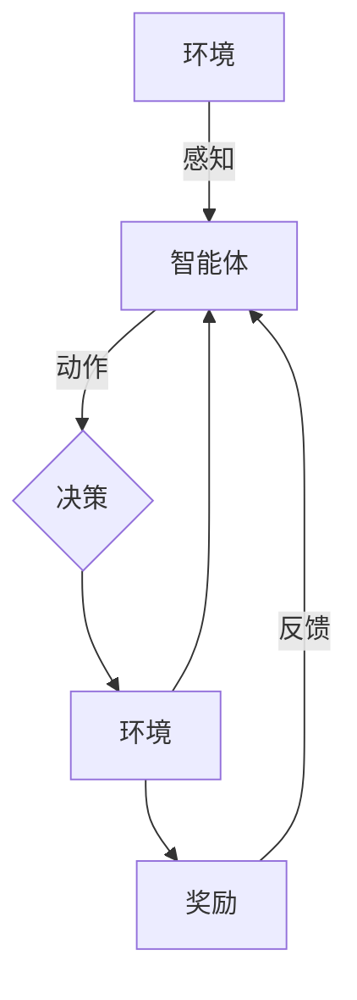

> 关键词：深度Q学习，DQN，强化学习，智慧城市，环境建模，决策优化，智能交通，能源管理，公共安全，应用场景

# 一切皆是映射：DQN在智慧城市中的应用场景与实践

随着城市化进程的加速，智慧城市已成为全球范围内的重要发展方向。智慧城市旨在通过信息技术和物联网技术的融合，提高城市管理的效率，提升居民生活质量，实现可持续发展。在这一过程中，深度强化学习（Deep Reinforcement Learning，DRL）作为一种新兴的智能优化方法，为智慧城市建设提供了新的思路和解决方案。本文将以深度Q网络（Deep Q-Network，DQN）为例，探讨其在智慧城市中的应用场景与实践。

## 1. 背景介绍

### 1.1 问题的由来

智慧城市涉及众多领域，如智能交通、能源管理、公共安全、环境监测等。这些领域普遍面临着复杂的环境建模和决策优化问题。传统的优化方法往往需要大量的先验知识和复杂的模型设计，难以适应动态变化的复杂环境。DQN作为一种基于值函数的强化学习方法，能够有效地解决这类问题。

### 1.2 研究现状

近年来，DQN及其变体在多个领域取得了显著成果。在智慧城市建设中，DQN被应用于多种场景，如智能交通信号控制、能源消耗优化、紧急事件响应等。然而，DQN在实际应用中仍面临诸多挑战，如样本效率低、探索-利用平衡、模型可解释性等。

### 1.3 研究意义

DQN在智慧城市中的应用具有以下意义：

- **提高城市管理效率**：通过智能决策，优化资源配置，提高城市管理效率。
- **提升居民生活质量**：改善交通拥堵、能源浪费、环境污染等问题，提升居民生活质量。
- **促进可持续发展**：实现资源的合理利用和环境的保护，促进城市的可持续发展。

### 1.4 本文结构

本文将分为以下几个部分：

- 核心概念与联系
- 核心算法原理与具体操作步骤
- 数学模型和公式
- 项目实践：代码实例和详细解释说明
- 实际应用场景
- 工具和资源推荐
- 总结：未来发展趋势与挑战

## 2. 核心概念与联系

### 2.1 核心概念

- **强化学习（Reinforcement Learning，RL）**：一种使智能体在与环境交互中学习最优策略的方法。
- **深度学习（Deep Learning，DL）**：一种利用多层神经网络进行特征提取和学习的机器学习技术。
- **深度Q网络（Deep Q-Network，DQN）**：一种结合了深度学习和强化学习的算法，用于学习智能体的最优策略。

### 2.2 核心概念原理和架构的 Mermaid 流程图



### 2.3 核心概念联系

DQN通过将深度学习应用于强化学习，将智能体的感知、决策和执行过程转化为一个端到端的神经网络学习问题。智能体通过与环境交互，学习到最优策略，以实现目标。

## 3. 核心算法原理 & 具体操作步骤

### 3.1 算法原理概述

DQN通过学习值函数来指导智能体的决策。值函数表示在给定状态下，采取某个动作所能获得的最大预期奖励。DQN使用Q函数来近似值函数，并通过深度神经网络进行学习。

### 3.2 算法步骤详解

1. **初始化**：初始化Q网络、目标Q网络、经验池和超参数。
2. **经验收集**：智能体在环境中采取动作，收集经验。
3. **经验回放**：将收集到的经验随机打乱并存储在经验池中。
4. **更新目标Q网络**：从经验池中随机抽取经验，使用Q网络计算当前状态、动作、奖励和下一个状态的最大Q值，并更新目标Q网络。
5. **Q网络更新**：使用目标Q网络计算当前状态和动作的Q值，并使用梯度下降法更新Q网络参数。
6. **迭代**：重复步骤2-5，直到满足停止条件。

### 3.3 算法优缺点

#### 优点

- **端到端学习**：直接从原始输入到最终输出，无需人工设计特征。
- **泛化能力强**：适用于各种复杂环境。
- **自适应性强**：能够根据环境变化调整策略。

#### 缺点

- **样本效率低**：需要大量的样本数据才能收敛。
- **探索-利用平衡**：需要平衡探索和利用，以避免陷入局部最优。
- **模型可解释性差**：难以解释模型的决策过程。

### 3.4 算法应用领域

DQN及其变体在多个领域取得了成功，包括：

- **游戏**：如Atari游戏、围棋、国际象棋等。
- **机器人**：如路径规划、抓取等。
- **智慧城市**：如智能交通、能源管理、公共安全等。

## 4. 数学模型和公式 & 详细讲解 & 举例说明

### 4.1 数学模型构建

DQN的核心是Q函数，其定义为：

$$
Q(s,a) = \sum_{s'} \gamma^T R(s,a,s') + \gamma V(s')
$$

其中，$s$ 是状态，$a$ 是动作，$R$ 是奖励，$s'$ 是下一个状态，$\gamma$ 是折扣因子，$V(s)$ 是值函数。

### 4.2 公式推导过程

DQN的目标是最小化预测的Q值与目标Q值之间的差异。具体来说，损失函数为：

$$
L = \sum_{i=1}^{N} (Q(s_i,a_i) - y_i)^2
$$

其中，$y_i$ 是目标Q值，$N$ 是样本数量。

### 4.3 案例分析与讲解

以下是一个简单的DQN应用案例：智能交通信号控制。

在这个案例中，智能体（控制器）需要根据交通流量、道路状况等因素，决定红绿灯的切换。目标是最小化交通拥堵程度。

- **状态**：状态可以由交通流量、道路状况等特征表示。
- **动作**：动作可以是红绿灯的切换，如绿灯、黄灯、红灯。
- **奖励**：奖励可以是交通拥堵程度，拥堵程度越低，奖励越高。

通过DQN学习，控制器可以学习到在给定状态下，切换到何种红绿灯可以最小化交通拥堵程度。

## 5. 项目实践：代码实例和详细解释说明

### 5.1 开发环境搭建

以下是使用Python和TensorFlow实现DQN的步骤：

1. 安装TensorFlow和相关库：
```bash
pip install tensorflow numpy gym
```

2. 下载并安装OpenAI的Gym环境：
```bash
pip install gym[all]
```

### 5.2 源代码详细实现

以下是一个简单的DQN实现示例：

```python
import numpy as np
import tensorflow as tf
import gym

# 创建环境
env = gym.make('CartPole-v1')

# 创建Q网络
class QNetwork(tf.keras.Model):
    def __init__(self):
        super(QNetwork, self).__init__()
        self.fc1 = tf.keras.layers.Dense(24, activation='relu')
        self.fc2 = tf.keras.layers.Dense(10, activation='linear')

    def call(self, x):
        x = self.fc1(x)
        return self.fc2(x)

# 创建DQN
class DQN:
    def __init__(self, state_size, action_size):
        self.state_size = state_size
        self.action_size = action_size
        self.memory = []
        self.gamma = 0.95
        self.epsilon = 1.0
        self.epsilon_min = 0.01
        self.epsilon_decay = 0.995
        self.learning_rate = 0.001
        self.model = self._build_model()

    def _build_model(self):
        model = tf.keras.Sequential([
            tf.keras.layers.InputLayer(input_shape=(self.state_size,)),
            tf.keras.layers.Dense(24, activation='relu'),
            tf.keras.layers.Dense(self.action_size, activation='linear')
        ])
        model.compile(loss='mse', optimizer=tf.keras.optimizers.Adam(lr=self.learning_rate))
        return model

    def remember(self, state, action, reward, next_state, done):
        self.memory.append((state, action, reward, next_state, done))

    def act(self, state):
        if np.random.rand() <= self.epsilon:
            return np.random.randint(self.action_size)
        act_values = self.model.predict(state)
        return np.argmax(act_values[0])

    def replay(self, batch_size):
        minibatch = random.sample(self.memory, batch_size)
        for state, action, reward, next_state, done in minibatch:
            target = reward
            if not done:
                target = (reward + self.gamma * np.amax(self.model.predict(next_state)[0]))
            target_f = self.model.predict(state)
            target_f[0][action] = target
            self.model.fit(state, target_f, epochs=1, verbose=0)
        if self.epsilon > self.epsilon_min:
            self.epsilon *= self.epsilon_decay

# 实例化DQN
dqn = DQN(state_size=4, action_size=2)

# 训练DQN
episodes = 3000
for e in range(episodes):
    state = env.reset()
    state = np.reshape(state, [1, state_size])
    for time in range(500):
        action = dqn.act(state)
        next_state, reward, done, _ = env.step(action)
        next_state = np.reshape(next_state, [1, state_size])
        dqn.remember(state, action, reward, next_state, done)
        state = next_state
        if done:
            break
    if len(dqn.memory) > 2000:
        dqn.replay(32)

# 关闭环境
env.close()

# 保存模型
dqn.model.save('dqn_cartpole.h5')
```

### 5.3 代码解读与分析

以上代码实现了DQN算法的基本功能：

1. **创建环境**：使用Gym创建CartPole环境。
2. **创建Q网络**：定义Q网络的输入层、隐藏层和输出层。
3. **创建DQN**：定义DQN类，包含记忆池、探索-利用策略、训练和回放方法。
4. **训练DQN**：通过与环境交互，收集经验并更新Q网络参数。
5. **保存模型**：将训练好的模型保存为HDF5文件。

### 5.4 运行结果展示

运行以上代码，可以看到智能体在CartPole环境中取得了较好的表现，能够在较短的时间内稳定控制CartPole。

## 6. 实际应用场景

### 6.1 智能交通

DQN在智能交通领域的应用主要包括：

- **交通信号控制**：根据实时交通流量和道路状况，智能调整红绿灯切换。
- **路径规划**：为车辆提供最优行驶路径，减少交通拥堵。
- **停车管理**：优化停车资源的分配，提高停车效率。

### 6.2 能源管理

DQN在能源管理领域的应用主要包括：

- **智能电网调度**：根据电力需求和发电成本，优化发电计划。
- **能源消耗预测**：预测能源消耗，优化能源分配。
- **储能系统管理**：根据能源价格和消耗预测，优化储能系统的工作模式。

### 6.3 公共安全

DQN在公共安全领域的应用主要包括：

- **火灾预警**：根据火灾风险因素，预测火灾发生概率。
- **地震预警**：根据地震监测数据，预测地震发生概率。
- **人群疏散**：根据火灾、地震等紧急事件，制定人群疏散方案。

### 6.4 未来应用展望

随着DQN及其变体的不断发展，其在智慧城市中的应用将会更加广泛。以下是一些未来应用展望：

- **跨领域应用**：将DQN应用于更多领域，如医疗、教育等。
- **多智能体协作**：研究多智能体DQN，实现多个智能体之间的协同决策。
- **知识增强**：将知识表示和推理技术融入DQN，提高模型的智能水平。

## 7. 工具和资源推荐

### 7.1 学习资源推荐

- 《深度学习（卷二）——强化学习》
- 《深度强化学习：原理与实战》
- 《Reinforcement Learning: An Introduction》

### 7.2 开发工具推荐

- TensorFlow
- PyTorch
- OpenAI Gym

### 7.3 相关论文推荐

- "Deep Reinforcement Learning with Double Q-Learning"
- "Asynchronous Methods for Deep Reinforcement Learning"
- "Prioritized Experience Replay"

## 8. 总结：未来发展趋势与挑战

### 8.1 研究成果总结

DQN作为一种有效的强化学习算法，在智慧城市等领域取得了显著成果。然而，DQN在实际应用中仍面临诸多挑战。

### 8.2 未来发展趋势

- **模型效率提升**：提高DQN的样本效率，降低计算复杂度。
- **探索-利用平衡**：研究更加有效的探索-利用策略。
- **模型可解释性**：提高DQN的可解释性，使其决策过程更加透明。

### 8.3 面临的挑战

- **样本效率**：DQN需要大量的样本数据进行训练，这对于复杂的环境来说是一个挑战。
- **探索-利用平衡**：如何平衡探索和利用，避免陷入局部最优。
- **模型可解释性**：DQN的决策过程难以解释，这对于安全关键的应用来说是一个挑战。

### 8.4 研究展望

未来，DQN及其变体将在智慧城市建设中发挥越来越重要的作用。通过不断优化算法和模型，DQN将为智慧城市的建设提供更加智能、高效、安全的解决方案。

## 9. 附录：常见问题与解答

**Q1：DQN在智慧城市中的应用前景如何？**

A：DQN在智慧城市中的应用前景非常广阔，可以为智能交通、能源管理、公共安全等领域提供有效的解决方案。

**Q2：DQN如何解决样本效率低的问题？**

A：可以通过经验回放、优先级经验回放等方法提高DQN的样本效率。

**Q3：如何提高DQN的可解释性？**

A：可以通过可视化、解释模型等方法提高DQN的可解释性。

**Q4：DQN在智慧城市中的应用场景有哪些？**

A：DQN在智慧城市中的应用场景包括智能交通、能源管理、公共安全等。

**Q5：如何将DQN应用于实际项目中？**

A：可以将DQN集成到现有的项目中，并根据实际需求进行定制化开发。

作者：禅与计算机程序设计艺术 / Zen and the Art of Computer Programming