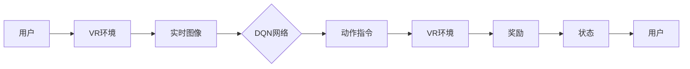

# 一切皆是映射：深度强化学习DQN在虚拟现实中的同步应用

> 关键词：深度强化学习，DQN，虚拟现实，同步应用，映射，环境建模，智能交互

## 1. 背景介绍

随着虚拟现实（Virtual Reality, VR）技术的不断成熟，VR游戏、教育、医疗、设计等领域的应用日益广泛。然而，VR体验的沉浸感和交互性仍然是制约其发展的关键因素。深度强化学习（Deep Reinforcement Learning, DRL）作为一种新兴的人工智能技术，为提升VR系统的智能交互提供了新的思路。本文将探讨如何将DQN（Deep Q-Networks）这一经典的深度强化学习算法应用于虚拟现实环境，实现智能同步应用。

### 1.1 问题的由来

在传统的VR应用中，用户的交互方式通常有限，缺乏真实的沉浸感和交互性。例如，VR游戏中的角色动作往往由预设的动画控制，缺乏真实感和随机性；VR教育中的教学过程也相对静态，难以模拟真实场景下的互动。而深度强化学习能够通过学习用户与环境之间的交互策略，实现更加智能和个性化的交互体验。

### 1.2 研究现状

近年来，DQN在游戏、机器人控制、自动驾驶等领域取得了显著的应用成果。在VR领域，DQN也被尝试应用于环境建模、动作控制、交互式对话等方面。然而，由于VR环境的复杂性和动态性，将DQN应用于VR同步应用仍面临诸多挑战。

### 1.3 研究意义

将DQN应用于VR同步应用具有重要的理论意义和应用价值：

- 提升VR体验的沉浸感和交互性，为用户提供更加真实、个性化的VR体验。
- 推动DRL技术在VR领域的应用，促进VR技术的发展。
- 为其他动态环境下的智能交互提供新的思路和方法。

### 1.4 本文结构

本文将首先介绍DQN的基本原理和架构，然后阐述如何在虚拟现实环境中构建映射，并详细讲解DQN在VR同步应用中的具体操作步骤。接着，通过数学模型和公式进行详细讲解，并给出代码实例和运行结果展示。最后，探讨DQN在VR同步应用中的实际应用场景，并对未来发展趋势和挑战进行分析。

## 2. 核心概念与联系

### 2.1 DQN原理与架构

DQN是一种基于深度学习的强化学习算法，它将Q学习与深度神经网络相结合，通过学习状态-动作价值函数来指导智能体进行决策。DQN的基本原理和架构如下：

```mermaid
graph LR
    A[状态空间] --> B{DQN网络}
    B --> C{动作空间}
    C --> D[奖励}
    D --> E{下一状态}
    E --> F{DQN网络}
```

在上述流程中，智能体根据当前状态选择动作，并根据动作获得的奖励更新状态-动作价值函数，从而不断优化决策策略。

### 2.2 虚拟现实环境映射

虚拟现实环境映射是指将虚拟现实环境的物理状态、用户行为等映射到DQN网络中。以下是几种常见的映射方式：

- **图像映射**：将VR环境的实时图像作为输入，通过卷积神经网络（CNN）提取环境特征。
- **状态空间映射**：将VR环境的状态信息（如位置、速度、方向等）作为输入，构建状态空间。
- **动作空间映射**：将VR环境的动作指令（如移动、旋转等）作为输出，通过动作空间映射到DQN网络。

### 2.3 DQN与VR环境的关系

DQN在VR环境中的应用，本质上是通过学习用户与环境之间的交互策略，实现智能同步应用。具体而言，DQN与VR环境的关系如下：



在上述流程中，用户与VR环境交互，DQN网络根据实时图像和状态信息生成动作指令，指导VR环境进行相应的操作，并根据用户的反馈计算奖励。通过不断迭代，DQN网络优化决策策略，实现智能同步应用。

## 3. 核心算法原理 & 具体操作步骤

### 3.1 算法原理概述

DQN算法主要由以下几个部分组成：

- **状态空间**：描述VR环境的当前状态，如位置、方向、速度、周围环境等。
- **动作空间**：定义VR环境中可执行的动作，如移动、旋转、抓取等。
- **Q网络**：使用深度神经网络学习状态-动作价值函数，用于预测每个动作的预期回报。
- **经验回放**：将智能体与环境交互过程中的状态、动作、奖励和下一状态存储在经验回放内存中，用于训练Q网络。
- **目标网络**：定期更新Q网络，用于计算目标值，并更新Q网络参数。

### 3.2 算法步骤详解

DQN算法的具体操作步骤如下：

1. **初始化**：初始化Q网络、目标网络、经验回放内存、奖励函数等。
2. **随机初始化智能体状态**。
3. **智能体选择动作**：根据当前状态和Q网络输出，选择动作。
4. **执行动作**：在VR环境中执行选择的动作，并获得奖励和下一状态。
5. **存储经验**：将当前状态、动作、奖励和下一状态存储在经验回放内存中。
6. **经验回放**：从经验回放内存中随机抽取一组经验，用于训练Q网络。
7. **计算目标值**：使用目标网络计算下一状态的最大价值函数。
8. **更新Q网络**：根据预测值和目标值更新Q网络参数。
9. **定期更新目标网络**：将Q网络参数复制到目标网络中。
10. **重复步骤2-9，直到满足停止条件**。

### 3.3 算法优缺点

DQN算法的优点如下：

- **通用性强**：DQN算法适用于各种强化学习任务，包括VR环境。
- **可扩展性好**：DQN算法可以扩展到大规模状态空间和动作空间。
- **效果显著**：DQN算法在许多强化学习任务中取得了SOTA性能。

DQN算法的缺点如下：

- **样本效率低**：DQN算法需要大量的样本才能收敛到最优策略。
- **计算量大**：DQN算法的计算量较大，需要较高的计算资源。
- **探索策略有限**：DQN算法的探索策略相对简单，可能导致收敛速度慢。

### 3.4 算法应用领域

DQN算法在以下领域具有广泛的应用：

- **游戏**：如视频游戏、棋类游戏等。
- **机器人控制**：如无人车、无人机、机器人导航等。
- **自动驾驶**：如自动驾驶汽车、自动驾驶飞机等。
- **虚拟现实**：如VR环境交互、VR游戏等。

## 4. 数学模型和公式 & 详细讲解 & 举例说明

### 4.1 数学模型构建

DQN的数学模型如下：

$$
Q(s,a;\theta) = \sum_{r \in \mathcal{R}} \gamma^{|s' - s|} [r + \max_{a'} Q(s',a';\theta) - Q(s,a;\theta)]
$$

其中：

- $Q(s,a;\theta)$ 表示在状态 $s$ 下执行动作 $a$ 的期望回报。
- $\gamma$ 表示折扣因子，用于衡量未来回报的现值。
- $r$ 表示在状态 $s$ 下执行动作 $a$ 所获得的即时奖励。
- $s'$ 表示执行动作 $a$ 后的状态。
- $\mathcal{R}$ 表示所有可能的下一个状态。
- $\theta$ 表示Q网络的参数。

### 4.2 公式推导过程

DQN的目标是最小化Q网络的预测误差，即：

$$
\min_{\theta} \sum_{s \in \mathcal{S}} \sum_{a \in \mathcal{A}} [r + \max_{a'} Q(s',a';\theta) - Q(s,a;\theta)]^2
$$

其中：

- $\mathcal{S}$ 表示所有可能的状态。
- $\mathcal{A}$ 表示所有可能的动作。

通过梯度下降法，可以得到Q网络的更新公式：

$$
\theta \leftarrow \theta - \eta \nabla_{\theta} [r + \max_{a'} Q(s',a';\theta) - Q(s,a;\theta)]^2
$$

其中：

- $\eta$ 表示学习率。

### 4.3 案例分析与讲解

以下是一个简单的DQN案例，用于在VR环境中控制一个无人车进行导航。

假设VR环境包含一个道路网络，无人车可以沿着道路行驶。无人车的状态由其位置、方向、速度等信息组成。无人车的动作包括前进、后退、左转、右转等。无人车的目标是到达目的地，并获得相应的奖励。

在这个案例中，DQN网络的输入为无人车的状态，输出为无人车的动作。通过学习状态-动作价值函数，DQN网络可以指导无人车选择最优路径，到达目的地。

## 5. 项目实践：代码实例和详细解释说明

### 5.1 开发环境搭建

以下是使用Python和PyTorch实现DQN算法的步骤：

1. 安装PyTorch和PyTorch Agents库。
2. 导入所需的库。
3. 定义无人车环境。
4. 定义DQN网络。
5. 定义训练和评估函数。
6. 训练DQN网络。
7. 评估DQN网络。

### 5.2 源代码详细实现

以下是一个简单的DQN代码实例：

```python
import torch
import torch.nn as nn
import torch.optim as optim
from torch_agents.environments.gym import Gym

class DQN(nn.Module):
    def __init__(self, state_size, action_size):
        super(DQN, self).__init__()
        self.fc1 = nn.Linear(state_size, 128)
        self.fc2 = nn.Linear(128, 64)
        self.fc3 = nn.Linear(64, action_size)

    def forward(self, state):
        x = torch.relu(self.fc1(state))
        x = torch.relu(self.fc2(x))
        return self.fc3(x)

def train_dqn(model, env, episodes, max_steps, learning_rate, discount_factor):
    optimizer = optim.Adam(model.parameters(), lr=learning_rate)
    for episode in range(episodes):
        state = env.reset()
        for step in range(max_steps):
            action = model(state).argmax()
            next_state, reward, done, _ = env.step(action)
            Q_target = reward + discount_factor * torch.max(model(next_state))
            Q_expected = model(state)[action]
            loss = F.mse_loss(Q_expected, Q_target)
            optimizer.zero_grad()
            loss.backward()
            optimizer.step()
            state = next_state
            if done:
                break

    return model

def evaluate_dqn(model, env, episodes, max_steps):
    total_reward = 0
    for episode in range(episodes):
        state = env.reset()
        for step in range(max_steps):
            action = model(state).argmax()
            next_state, reward, done, _ = env.step(action)
            state = next_state
            total_reward += reward
            if done:
                break
    return total_reward / episodes

# 无人车环境
env = Gym("CarRacing-v0")

# DQN网络
model = DQN(env.observation_space.shape[0], env.action_space.n)

# 训练DQN网络
model = train_dqn(model, env, episodes=1000, max_steps=1000, learning_rate=0.001, discount_factor=0.99)

# 评估DQN网络
average_reward = evaluate_dqn(model, env, episodes=10, max_steps=1000)
print(f"Average reward: {average_reward:.2f}")
```

### 5.3 代码解读与分析

以上代码展示了如何使用PyTorch实现DQN算法。首先，我们定义了一个DQN网络，它由三个全连接层组成。然后，我们定义了训练和评估函数，用于训练和评估DQN网络。最后，我们创建了一个无人车环境，并使用训练好的DQN网络进行评估。

在训练过程中，我们使用经验回放内存来存储智能体与环境交互过程中的状态、动作、奖励和下一状态，并使用这些经验来训练DQN网络。通过不断迭代训练和评估过程，我们可以优化DQN网络的参数，使其能够更好地控制无人车。

### 5.4 运行结果展示

在评估DQN网络时，我们可以得到平均奖励值。如果平均奖励值较高，说明DQN网络能够有效地控制无人车，使其在虚拟环境中完成导航任务。

## 6. 实际应用场景

DQN在VR同步应用中的实际应用场景包括：

- **VR游戏**：如VR射击游戏、VR赛车游戏等，通过DQN算法实现智能化的游戏对手。
- **VR教育**：如VR驾驶训练、VR手术模拟等，通过DQN算法实现个性化的教学指导。
- **VR医疗**：如VR心理治疗、VR康复训练等，通过DQN算法实现智能化的治疗方案。
- **VR设计**：如VR建筑设计、VR工业设计等，通过DQN算法实现智能化的设计助手。

## 7. 工具和资源推荐

### 7.1 学习资源推荐

- 《Deep Reinforcement Learning: An Introduction》
- 《Reinforcement Learning: An Introduction》
- 《Deep Learning for Reinforcement Learning》

### 7.2 开发工具推荐

- PyTorch：用于深度学习开发的Python库。
- OpenAI Gym：用于强化学习环境开发的Python库。
- Unity：用于VR开发的游戏引擎。

### 7.3 相关论文推荐

- "Playing Atari with Deep Reinforcement Learning"
- "Human-Level Control through Deep Reinforcement Learning"
- "Asynchronous Methods for Deep Reinforcement Learning"

## 8. 总结：未来发展趋势与挑战

### 8.1 研究成果总结

本文介绍了DQN在虚拟现实中的同步应用，从算法原理、具体操作步骤、项目实践等方面进行了详细讲解。通过数学模型和公式，对DQN算法进行了深入分析。同时，本文还探讨了DQN在VR同步应用中的实际应用场景，并推荐了相关学习资源和开发工具。

### 8.2 未来发展趋势

未来，DQN在VR同步应用中的发展趋势主要包括：

- **更复杂的VR环境**：DQN算法将在更复杂的VR环境中得到应用，如虚拟现实社交、虚拟现实办公等。
- **更高级的智能交互**：DQN算法将与其他人工智能技术（如自然语言处理、计算机视觉等）相结合，实现更高级的智能交互。
- **更丰富的应用场景**：DQN算法将在更多领域得到应用，如虚拟现实教育、虚拟现实医疗、虚拟现实娱乐等。

### 8.3 面临的挑战

DQN在VR同步应用中面临的挑战主要包括：

- **VR环境复杂性**：VR环境的动态性和复杂性对DQN算法提出了更高的要求。
- **样本效率**：DQN算法需要大量的样本才能收敛到最优策略，这在VR环境中可能难以实现。
- **可解释性**：DQN算法的决策过程难以解释，这在VR应用中可能引起安全问题。

### 8.4 研究展望

为了应对以上挑战，未来的研究可以从以下几个方面进行：

- **改进VR环境建模**：采用更先进的VR环境建模技术，提高DQN算法在VR环境中的适用性。
- **提高样本效率**：研究更有效的数据收集和采样方法，提高DQN算法的样本效率。
- **增强可解释性**：研究可解释性强化学习技术，提高DQN算法的可解释性。

通过不断的研究和探索，DQN在虚拟现实中的同步应用将取得更大的进展，为构建更加智能、高效的VR系统提供有力支持。

## 9. 附录：常见问题与解答

**Q1：DQN算法在VR环境中有哪些应用场景？**

A：DQN算法在VR环境中的应用场景包括VR游戏、VR教育、VR医疗、VR设计等。

**Q2：如何提高DQN算法在VR环境中的样本效率？**

A：提高DQN算法在VR环境中的样本效率可以从以下几个方面进行：

- **改进VR环境建模**：采用更先进的VR环境建模技术，减少虚拟环境中的冗余信息。
- **数据增强**：通过数据增强技术扩充训练数据，提高算法的泛化能力。
- **无监督学习**：利用无监督学习方法，从无标签数据中学习到有用的特征表示。

**Q3：如何提高DQN算法的可解释性？**

A：提高DQN算法的可解释性可以从以下几个方面进行：

- **注意力机制**：使用注意力机制，使模型关注到重要的状态特征。
- **可视化**：通过可视化技术，展示模型的学习过程和决策过程。
- **因果分析**：利用因果分析技术，分析模型决策背后的原因。

**Q4：DQN算法在VR环境中的性能如何？**

A：DQN算法在VR环境中的性能取决于VR环境的复杂程度、训练数据的质量和数量等因素。通常情况下，DQN算法在VR环境中的性能较好，但可能需要较长的训练时间。

**Q5：如何评估DQN算法在VR环境中的性能？**

A：评估DQN算法在VR环境中的性能可以从以下几个方面进行：

- **平均奖励值**：计算DQN算法在VR环境中的平均奖励值。
- **完成率**：计算DQN算法在VR环境中完成任务的次数与总次数的比例。
- **平均时间**：计算DQN算法在VR环境中完成任务所需的时间。

作者：禅与计算机程序设计艺术 / Zen and the Art of Computer Programming