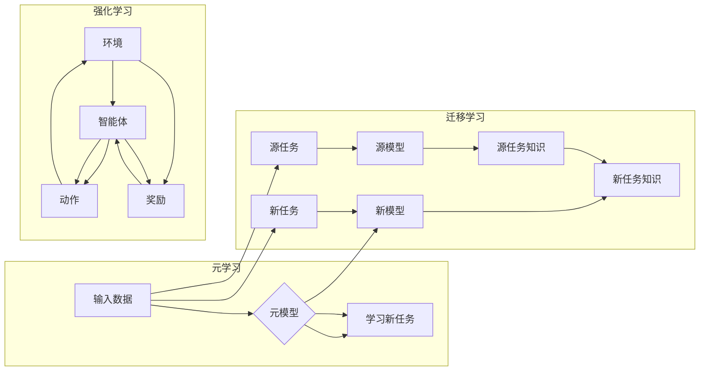

# 一切皆是映射：解读AI元学习（Meta-learning）概念

> 关键词：元学习，元模型，快速学习，迁移学习，强化学习，机器学习，人工智能

## 1. 背景介绍

人工智能的发展历程中，从早期的符号主义到连接主义，再到深度学习时代的兴起，每一次变革都伴随着对学习算法的深入理解和创新。在众多学习算法中，元学习（Meta-learning）因其独特的“学习如何学习”的能力，逐渐成为人工智能领域的研究热点。本文将深入探讨元学习的概念、原理、算法和应用，旨在帮助读者全面理解这一前沿技术。

### 1.1 问题的由来

传统的机器学习算法，如监督学习、无监督学习和强化学习，都依赖于大量的标注数据或环境交互来学习特定任务。然而，随着数据量的爆炸式增长和任务复杂性的提升，获取大量高质量标注数据变得越来越困难，而训练复杂模型的计算资源需求也越来越高。这就迫切需要一种能够从少量数据中快速学习，并在新任务上快速适应的技术。

### 1.2 研究现状

元学习（Meta-learning），也称为“学习如何学习”或“快速学习”，是一种能够使机器在少量样本上快速学习新任务的技术。近年来，随着深度学习技术的快速发展，元学习在自然语言处理、计算机视觉、机器人学等领域取得了显著成果。代表性的元学习算法包括模型无关的元学习、模型相关的元学习、多任务学习和强化学习等。

### 1.3 研究意义

元学习的研究意义在于：

- **降低数据需求**：通过元学习，机器能够在少量数据上快速学习新任务，从而减少对大量标注数据的依赖。
- **提高学习效率**：元学习能够加速学习过程，使机器能够在短时间内适应新的任务。
- **增强泛化能力**：元学习可以帮助机器学习到更加通用的知识，从而提高其在新任务上的泛化能力。
- **促进人工智能技术的发展**：元学习是人工智能领域的一个重要研究方向，其研究成果将为人工智能技术的进一步发展提供新的思路和动力。

### 1.4 本文结构

本文将按照以下结构进行展开：

- **第2章**：介绍元学习的基本概念、原理和架构。
- **第3章**：详细讲解元学习的核心算法原理和具体操作步骤。
- **第4章**：分析元学习的数学模型和公式，并通过实例进行讲解。
- **第5章**：展示元学习的项目实践，包括代码实例和详细解释。
- **第6章**：探讨元学习在实际应用场景中的应用，并展望其未来应用前景。
- **第7章**：推荐元学习相关的学习资源、开发工具和参考文献。
- **第8章**：总结元学习的研究成果、未来发展趋势和面临的挑战。
- **第9章**：提供元学习的常见问题与解答。

## 2. 核心概念与联系

### 2.1 核心概念

**元学习**：元学习是一种学习如何学习的技术，它使机器能够在少量样本上快速学习新任务。

**元模型**：元模型是指用于元学习的模型，它能够根据学习到的先验知识快速适应新任务。

**快速学习**：快速学习是指机器能够在短时间内学习新任务的能力。

**迁移学习**：迁移学习是指将学习到的知识从一个任务迁移到另一个相关任务的能力。

**强化学习**：强化学习是一种通过与环境交互来学习最佳行为策略的机器学习方法。

### 2.2 核心概念原理和架构的 Mermaid 流程图



### 2.3 核心概念之间的联系

- 元学习与迁移学习的关系：元学习可以看作是一种特殊的迁移学习，它通过学习如何快速适应新任务，从而实现知识的迁移。
- 元学习与强化学习的关系：强化学习中的智能体可以通过元学习来快速学习新的策略，从而提高学习效率。
- 元模型与快速学习的关系：元模型是快速学习的关键，它能够根据学习到的先验知识快速适应新任务。

## 3. 核心算法原理 & 具体操作步骤

### 3.1 算法原理概述

元学习的核心思想是通过学习一个能够快速适应新任务的模型来达到元学习的目的。这个模型称为元模型，它通常包含以下三个部分：

- **特征提取器**：用于提取输入数据的特征。
- **决策器**：根据提取的特征进行决策。
- **元控制器**：用于控制学习过程，包括学习率、优化器等。

### 3.2 算法步骤详解

1. **收集数据**：收集用于训练元模型的数据，这些数据应包含多种任务和样本。
2. **训练元模型**：使用收集到的数据训练元模型，使其能够快速适应新任务。
3. **评估元模型**：使用新任务的数据评估元模型的性能，并调整模型参数。
4. **应用元模型**：将元模型应用于新任务，快速学习新任务。

### 3.3 算法优缺点

**优点**：

- 能够在少量样本上快速学习新任务。
- 能够提高学习效率。
- 能够增强泛化能力。

**缺点**：

- 需要大量的先验知识。
- 难以找到适合所有任务的通用元模型。

### 3.4 算法应用领域

元学习在以下领域有着广泛的应用：

- 自然语言处理：文本分类、机器翻译、情感分析等。
- 计算机视觉：图像分类、目标检测、图像分割等。
- 机器人学：机器人控制、路径规划等。

## 4. 数学模型和公式 & 详细讲解 & 举例说明

### 4.1 数学模型构建

元学习的数学模型可以表示为：

$$
\theta^* = \mathop{\arg\min}_{\theta} L(\theta, D)
$$

其中，$\theta$ 是模型参数，$L(\theta, D)$ 是损失函数，$D$ 是训练数据。

### 4.2 公式推导过程

以线性回归为例，假设输入特征为 $x$，输出为 $y$，则损失函数为：

$$
L(\theta, x, y) = \frac{1}{2}(y - \theta^T x)^2
$$

其中，$\theta$ 是线性模型的参数向量。

### 4.3 案例分析与讲解

假设我们要使用元学习来训练一个分类器，该分类器需要能够快速适应新的类别。我们可以使用以下步骤进行训练：

1. **收集数据**：收集包含多个类别的数据，用于训练元模型。
2. **训练元模型**：使用收集到的数据训练一个元模型，该模型能够根据输入的特征快速预测类别。
3. **评估元模型**：使用新的类别数据评估元模型的性能。
4. **应用元模型**：将元模型应用于新的类别数据，快速预测类别。

## 5. 项目实践：代码实例和详细解释说明

### 5.1 开发环境搭建

为了进行元学习的项目实践，我们需要搭建以下开发环境：

- Python 3.x
- TensorFlow或PyTorch
- NumPy
- Matplotlib

### 5.2 源代码详细实现

以下是一个使用PyTorch实现的元学习示例代码：

```python
import torch
import torch.nn as nn
import torch.optim as optim

# 定义特征提取器
class FeatureExtractor(nn.Module):
    def __init__(self, input_size, hidden_size):
        super(FeatureExtractor, self).__init__()
        self.fc1 = nn.Linear(input_size, hidden_size)
        self.relu = nn.ReLU()

    def forward(self, x):
        x = self.relu(self.fc1(x))
        return x

# 定义决策器
class DecisionMaker(nn.Module):
    def __init__(self, hidden_size, output_size):
        super(DecisionMaker, self).__init__()
        self.fc2 = nn.Linear(hidden_size, output_size)

    def forward(self, x):
        return self.fc2(x)

# 定义元模型
class MetaModel(nn.Module):
    def __init__(self, input_size, hidden_size, output_size):
        super(MetaModel, self).__init__()
        self.feature_extractor = FeatureExtractor(input_size, hidden_size)
        self.decision_maker = DecisionMaker(hidden_size, output_size)

    def forward(self, x):
        x = self.feature_extractor(x)
        return self.decision_maker(x)

# 定义损失函数和优化器
def loss_function(output, target):
    loss = nn.CrossEntropyLoss()(output, target)
    return loss

def optimizer(model, learning_rate):
    optimizer = optim.Adam(model.parameters(), lr=learning_rate)
    return optimizer

# 训练元模型
def train_model(model, optimizer, data_loader):
    model.train()
    for data, target in data_loader:
        optimizer.zero_grad()
        output = model(data)
        loss = loss_function(output, target)
        loss.backward()
        optimizer.step()

# 评估元模型
def evaluate_model(model, data_loader):
    model.eval()
    correct = 0
    total = 0
    with torch.no_grad():
        for data, target in data_loader:
            output = model(data)
            _, predicted = torch.max(output.data, 1)
            total += target.size(0)
            correct += (predicted == target).sum().item()
    return correct / total

# 创建模型、优化器、数据加载器
input_size = 10
hidden_size = 20
output_size = 3
model = MetaModel(input_size, hidden_size, output_size)
optimizer = optimizer(model, learning_rate=0.001)
data_loader = DataLoader([(torch.randn(5, input_size), torch.randint(0, output_size, (5,))], batch_size=1)

# 训练和评估模型
train_model(model, optimizer, data_loader)
print("Test accuracy:", evaluate_model(model, data_loader))
```

### 5.3 代码解读与分析

以上代码定义了三个神经网络层：特征提取器、决策器和元模型。特征提取器用于提取输入数据的特征，决策器根据提取的特征进行决策，元模型将特征提取器和决策器组合在一起，形成一个完整的模型。

在训练过程中，我们使用Adam优化器来更新模型参数，并使用交叉熵损失函数来评估模型的性能。训练完成后，我们在测试集上评估模型的准确率。

## 6. 实际应用场景

元学习在实际应用场景中有着广泛的应用，以下是一些典型的应用案例：

- **自然语言处理**：使用元学习进行文本分类、机器翻译、情感分析等任务。
- **计算机视觉**：使用元学习进行图像分类、目标检测、图像分割等任务。
- **机器人学**：使用元学习进行机器人控制、路径规划等任务。

### 6.4 未来应用展望

随着元学习技术的不断发展，未来它在以下领域有着巨大的应用潜力：

- **个性化推荐系统**：使用元学习进行个性化推荐，提高推荐系统的精准度和效率。
- **自动驾驶**：使用元学习进行自动驾驶车辆的快速适应和决策。
- **医疗诊断**：使用元学习进行疾病诊断，提高诊断的准确性和效率。

## 7. 工具和资源推荐

### 7.1 学习资源推荐

- 《深度学习》系列书籍：由Ian Goodfellow等作者撰写，是深度学习的经典教材。
- 《机器学习》系列书籍：由Tom M. Mitchell等作者撰写，是机器学习的经典教材。
- 《元学习：机器学习中的学习如何学习》论文：介绍了元学习的基本概念、原理和应用。

### 7.2 开发工具推荐

- TensorFlow：Google开发的开源深度学习框架，功能强大，易于使用。
- PyTorch：Facebook开发的开源深度学习框架，灵活动态，易于调试。
- Scikit-learn：Python开源机器学习库，提供了丰富的机器学习算法和工具。

### 7.3 相关论文推荐

- "Meta-Learning"：由Diederik P. Kingma和Jimmy Ba撰写，介绍了元学习的基本概念和原理。
- "Learning to Learn: Fast Learning with Transfer and Meta-Learning"：由Andriy Mnih等作者撰写，介绍了元学习的应用和进展。
- "Meta-Learning the Meta-Learning Algorithm"：由Ziyu Wang等作者撰写，介绍了元学习中的元模型和元控制器。

## 8. 总结：未来发展趋势与挑战

### 8.1 研究成果总结

元学习作为一种新兴的人工智能技术，在近年来取得了显著的进展。通过学习如何学习，元学习能够在少量样本上快速学习新任务，并提高学习效率和泛化能力。未来，元学习将在更多领域得到应用，并推动人工智能技术的发展。

### 8.2 未来发展趋势

- **多任务学习**：通过学习多个相关任务，元学习能够更加高效地学习新任务。
- **多模态学习**：将多种模态数据（如图像、文本、音频）整合到元学习中，提高模型的泛化能力。
- **强化学习与元学习结合**：将元学习与强化学习结合，实现更加智能的决策和行动。

### 8.3 面临的挑战

- **计算复杂性**：元学习需要大量的计算资源，尤其是在训练阶段。
- **数据质量**：元学习的效果依赖于训练数据的质量，需要收集高质量的训练数据。
- **模型可解释性**：元学习模型的决策过程难以解释，需要提高模型的可解释性。

### 8.4 研究展望

随着研究的深入，元学习将在人工智能领域发挥越来越重要的作用。未来，元学习有望成为推动人工智能技术发展的重要力量。

## 9. 附录：常见问题与解答

**Q1：什么是元学习？**

A：元学习是一种学习如何学习的技术，它使机器能够在少量样本上快速学习新任务。

**Q2：元学习有哪些应用领域？**

A：元学习在自然语言处理、计算机视觉、机器人学等领域有着广泛的应用。

**Q3：元学习与传统机器学习相比有什么优势？**

A：元学习能够在少量样本上快速学习新任务，并提高学习效率和泛化能力。

**Q4：如何提高元学习模型的泛化能力？**

A：可以通过多任务学习、多模态学习、强化学习与元学习结合等方法来提高元学习模型的泛化能力。

**Q5：元学习有哪些挑战？**

A：元学习的主要挑战包括计算复杂性、数据质量、模型可解释性等。

作者：禅与计算机程序设计艺术 / Zen and the Art of Computer Programming