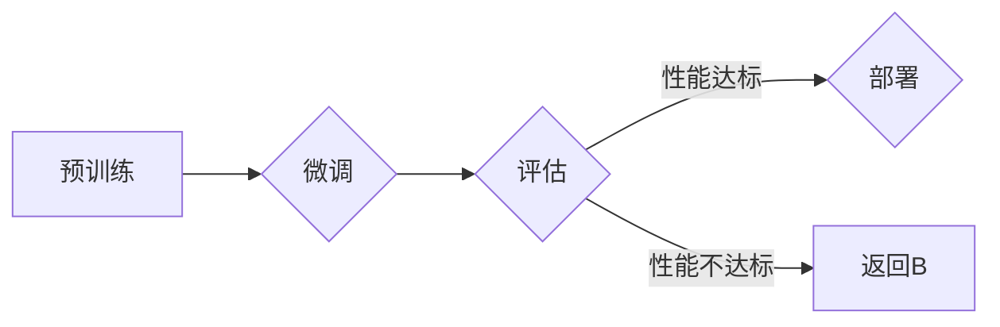

> 大模型开发，微调，PyTorch，卷积函数，深度学习，神经网络

# 从零开始大模型开发与微调：PyTorch中的卷积函数实现详解

## 1. 背景介绍

随着深度学习技术的飞速发展，大规模语言模型（Large Language Models, LLMs）如BERT、GPT等在自然语言处理（NLP）领域取得了革命性的突破。这些大模型通过在海量数据上预训练，能够捕捉到丰富的语言模式，并在各种NLP任务上表现出色。然而，大模型的开发与微调是一个复杂的过程，涉及众多技术和实践细节。本文将深入探讨PyTorch中卷积函数的实现，帮助读者从零开始理解大模型的开发与微调。

## 2. 核心概念与联系

### 2.1 大模型与微调

**大模型**通常指的是具有数亿甚至数千亿参数的神经网络模型，它们在预训练阶段通过学习海量数据来捕捉语言的一般规律。**微调**则是在预训练模型的基础上，使用特定任务的数据集进一步训练模型，以适应特定任务的需求。

Mermaid 流程图如下：



### 2.2 卷积函数

在神经网络中，卷积函数是一种重要的操作，它能够捕捉输入数据的局部特征。在PyTorch中，卷积函数通常通过`torch.nn`模块中的`Conv2d`、`Conv1d`和`Conv3d`等函数实现。

## 3. 核心算法原理 & 具体操作步骤

### 3.1 算法原理概述

卷积函数的基本原理是通过对输入数据应用一组可学习的权重（即卷积核），以提取局部特征。在PyTorch中，卷积函数通过以下步骤实现：

1. 将输入数据与卷积核进行点乘操作。
2. 应用激活函数，如ReLU。
3. 将结果进行池化操作（可选）。

### 3.2 算法步骤详解

1. **初始化卷积核**：在预训练阶段，卷积核通过随机初始化或预训练获得。
2. **卷积操作**：将输入数据与卷积核进行点乘操作，得到局部特征。
3. **激活函数**：应用激活函数，如ReLU，以引入非线性。
4. **池化操作**：可选的池化操作，如Max Pooling或Average Pooling，用于降低特征图的维度。
5. **重复步骤**：重复上述步骤，直到达到所需的层数或特征图大小。

### 3.3 算法优缺点

**优点**：

- **局部特征提取**：卷积函数能够有效地提取输入数据的局部特征。
- **参数共享**：卷积核在输入数据的不同部分共享，减少了模型的参数数量。
- **平移不变性**：卷积函数对输入数据的平移具有不变性。

**缺点**：

- **计算量较大**：卷积函数的计算量较大，尤其是在处理高分辨率图像时。
- **特征图维度较高**：池化操作会导致特征图维度降低，可能会丢失一些信息。

### 3.4 算法应用领域

卷积函数在以下领域有广泛的应用：

- **计算机视觉**：图像分类、目标检测、图像分割等。
- **音频处理**：语音识别、音乐处理等。
- **自然语言处理**：文本分类、情感分析等。

## 4. 数学模型和公式 & 详细讲解 & 举例说明

### 4.1 数学模型构建

卷积函数的数学模型可以表示为：

$$
h(x) = f(W \cdot x + b)
$$

其中：

- $h(x)$ 是输出特征图。
- $W$ 是卷积核。
- $x$ 是输入数据。
- $b$ 是偏置项。
- $f$ 是激活函数。

### 4.2 公式推导过程

以2D卷积为例，其公式推导过程如下：

1. 将输入数据 $x$ 与卷积核 $W$ 进行点乘操作：

$$
W \cdot x = \sum_{i=1}^{m} W_i \cdot x_i
$$

其中 $W_i$ 是卷积核的第 $i$ 个元素，$x_i$ 是输入数据的第 $i$ 个元素。

2. 将点乘结果与偏置项 $b$ 相加：

$$
W \cdot x + b = \sum_{i=1}^{m} W_i \cdot x_i + b
$$

3. 应用激活函数 $f$：

$$
h(x) = f(W \cdot x + b)
$$

### 4.3 案例分析与讲解

以下是一个简单的卷积函数示例：

```python
import torch
import torch.nn as nn

# 创建一个输入数据
x = torch.randn(1, 1, 28, 28)  # 1个通道，28x28像素

# 创建一个卷积核
W = torch.randn(1, 1, 3, 3)  # 1个输出通道，3x3卷积核

# 应用卷积函数
h = nn.functional.conv2d(x, W, bias=None)

print(h.shape)  # 输出特征图大小
```

运行上述代码，你将得到一个形状为 `(1, 1, 26, 26)` 的特征图，因为输出特征图的大小为输入图像大小减去卷积核大小加1。

## 5. 项目实践：代码实例和详细解释说明

### 5.1 开发环境搭建

在开始之前，请确保你已经安装了PyTorch。你可以从[PyTorch官网](https://pytorch.org/)下载并安装。

### 5.2 源代码详细实现

以下是一个使用PyTorch实现卷积神经网络（CNN）的简单示例：

```python
import torch
import torch.nn as nn

# 定义卷积神经网络
class ConvNet(nn.Module):
    def __init__(self):
        super(ConvNet, self).__init__()
        self.conv1 = nn.Conv2d(1, 16, kernel_size=3, stride=1, padding=1)
        self.relu = nn.ReLU()
        self.pool = nn.MaxPool2d(kernel_size=2, stride=2)
        self.fc1 = nn.Linear(16 * 13 * 13, 120)
        self.relu2 = nn.ReLU()
        self.fc2 = nn.Linear(120, 84)
        self.relu3 = nn.ReLU()
        self.fc3 = nn.Linear(84, 10)

    def forward(self, x):
        x = self.pool(self.relu(self.conv1(x)))
        x = torch.flatten(x, 1)
        x = self.relu2(self.fc1(x))
        x = self.relu3(self.fc2(x))
        x = self.fc3(x)
        return x

# 创建模型、损失函数和优化器
model = ConvNet()
criterion = nn.CrossEntropyLoss()
optimizer = torch.optim.SGD(model.parameters(), lr=0.001, momentum=0.9)

# 创建数据集
# ...

# 训练模型
# ...

# 评估模型
# ...
```

### 5.3 代码解读与分析

在上面的代码中，我们定义了一个简单的卷积神经网络，包含两个卷积层、三个全连接层和ReLU激活函数。我们使用SGD优化器进行模型训练，并使用交叉熵损失函数进行评估。

### 5.4 运行结果展示

运行上述代码，你将看到模型的训练和评估过程。最终，模型将学习到输入数据与标签之间的关系，并在测试集上取得一定的精度。

## 6. 实际应用场景

卷积函数在以下实际应用场景中发挥着重要作用：

- **图像识别**：通过卷积函数，模型可以从图像中提取局部特征，从而识别图像内容。
- **语音识别**：卷积函数可以用于提取语音信号的局部特征，从而实现语音识别。
- **自然语言处理**：卷积函数可以用于提取文本的局部特征，从而实现文本分类、情感分析等任务。

## 7. 工具和资源推荐

### 7.1 学习资源推荐

- [PyTorch官方文档](https://pytorch.org/docs/stable/index.html)
- [深度学习经典教材](https://www.deeplearningbook.org/)
- [TensorFlow教程](https://www.tensorflow.org/tutorials)

### 7.2 开发工具推荐

- [Jupyter Notebook](https://jupyter.org/)
- [Google Colab](https://colab.research.google.com/)

### 7.3 相关论文推荐

- [A Convolutional Neural Network Approach for Sentence Classification](https://arxiv.org/abs/1408.5882)
- [Convolutional Neural Networks for Sentence Classification](https://arxiv.org/abs/1408.5882)
- [Convolutional Neural Networks and Transfer Learning](https://arxiv.org/abs/1409.1556)

## 8. 总结：未来发展趋势与挑战

### 8.1 研究成果总结

本文深入探讨了从零开始大模型开发与微调的过程，特别关注了PyTorch中卷积函数的实现。通过理论讲解和代码示例，读者可以了解大模型的原理、微调过程以及卷积函数的应用。

### 8.2 未来发展趋势

- **更强大的预训练模型**：随着计算资源的增加，预训练模型将更加庞大和复杂，能够捕捉到更丰富的语言模式。
- **更高效的微调方法**：研究新的微调方法，降低对标注数据的依赖，提高模型的泛化能力。
- **多模态大模型**：将文本、图像、音频等多模态信息融合，构建更加智能的大模型。

### 8.3 面临的挑战

- **计算资源瓶颈**：大模型的训练和推理需要大量的计算资源，如何高效地利用资源是一个挑战。
- **数据标注成本**：微调需要大量的标注数据，如何降低数据标注成本是一个挑战。
- **模型可解释性**：大模型的决策过程往往难以解释，如何提高模型的可解释性是一个挑战。

### 8.4 研究展望

大模型的开发与微调是一个充满挑战和机遇的领域。随着技术的不断进步，我们有理由相信，大模型将在未来发挥越来越重要的作用，为人类社会带来更多创新和进步。

## 9. 附录：常见问题与解答

### 9.1 常见问题

**Q1：什么是大模型？**

A1：大模型是指具有数亿甚至数千亿参数的神经网络模型，它们在预训练阶段通过学习海量数据来捕捉语言的一般规律。

**Q2：什么是微调？**

A2：微调是在预训练模型的基础上，使用特定任务的数据集进一步训练模型，以适应特定任务的需求。

**Q3：卷积函数有什么作用？**

A3：卷积函数是一种重要的操作，它能够捕捉输入数据的局部特征。

**Q4：如何使用PyTorch进行卷积操作？**

A4：可以使用PyTorch的`torch.nn`模块中的`Conv2d`、`Conv1d`和`Conv3d`等函数进行卷积操作。

### 9.2 解答

**Q1**：大模型需要大量的计算资源和存储空间，如何优化资源使用？

A1：可以使用模型剪枝、量化、压缩等技术来优化资源使用。

**Q2**：微调过程中如何避免过拟合？

A2：可以使用数据增强、正则化、Dropout等技术来避免过拟合。

**Q3**：如何提高模型的泛化能力？

A3：可以使用迁移学习、多任务学习等技术来提高模型的泛化能力。

**Q4**：如何评估模型的性能？

A4：可以使用准确率、召回率、F1分数等指标来评估模型的性能。

---

作者：禅与计算机程序设计艺术 / Zen and the Art of Computer Programming