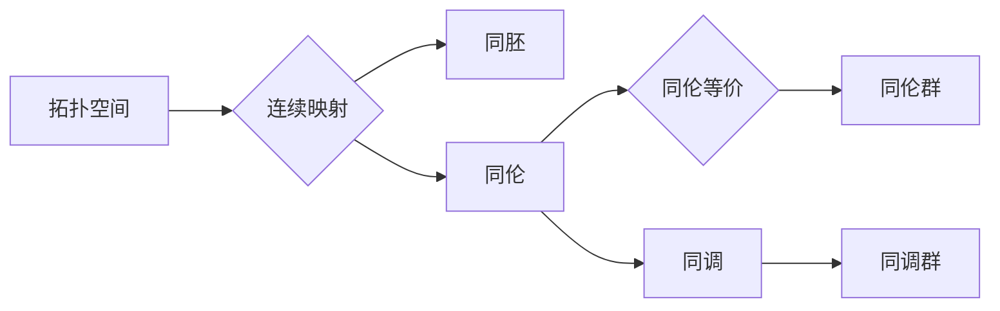
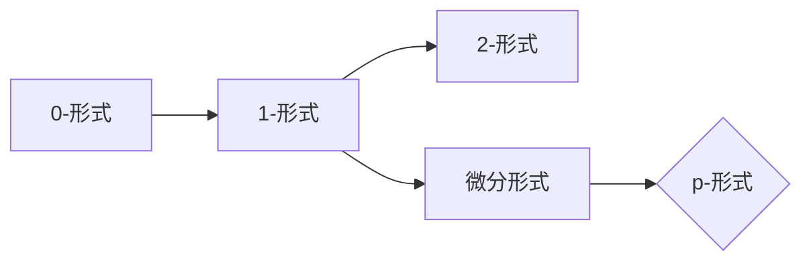

# 代数拓扑中的微分形式应用实例

> 关键词：代数拓扑，微分形式，微分方程，流形，拓扑学，几何，计算几何，同调理论

## 1. 背景介绍

代数拓扑是数学中的一个分支，它研究的是空间的性质，这些性质与连续变换有关，但与空间中点的具体位置无关。微分形式则是微分几何中用于描述流形上的几何量的一种数学工具。在数学和物理学中，微分形式有着广泛的应用，尤其是在理论物理、几何分析、计算几何等领域。本文将探讨代数拓扑中的微分形式，并通过具体的实例来展示它们的应用。

### 1.1 问题的由来

微分形式在代数拓扑中的应用起源于对微分方程解的存在性和唯一性问题的研究。在求解微分方程时，微分形式提供了一种强有力的工具，用于分析微分方程的几何性质。此外，微分形式还与同调理论密切相关，后者是代数拓扑的核心内容之一。

### 1.2 研究现状

近年来，随着计算几何和数值分析的发展，微分形式在处理复杂几何问题的能力得到了显著提升。特别是在三维和更高维度的流形上，微分形式的应用变得更加广泛。

### 1.3 研究意义

研究代数拓扑中的微分形式对于理解复杂几何结构、解决微分方程以及开发新的计算方法具有重要意义。通过本文，读者可以了解到微分形式的基本概念、应用实例以及未来发展趋势。

### 1.4 本文结构

本文将分为以下几个部分：
- 第2部分，介绍代数拓扑和微分形式的基本概念。
- 第3部分，探讨微分形式的算法原理和具体操作步骤。
- 第4部分，通过实例展示微分形式的应用。
- 第5部分，讨论微分形式在实际应用场景中的具体应用。
- 第6部分，展望微分形式在未来的发展趋势和面临的挑战。
- 第7部分，推荐相关的学习资源和开发工具。
- 第8部分，总结研究成果，并对未来进行展望。
- 第9部分，提供常见问题与解答。

## 2. 核心概念与联系

### 2.1 代数拓扑的基本概念

代数拓扑的核心概念包括拓扑空间、连续映射、同胚、同伦、同调、同伦群等。以下是这些概念之间的Mermaid流程图：



### 2.2 微分形式的基本概念

微分形式是描述流形上几何量的一种数学工具，包括0-形式（点函数）、1-形式（向量场）、2-形式等。以下是这些概念之间的Mermaid流程图：



### 2.3 代数拓扑与微分形式的联系

代数拓扑与微分形式之间的联系体现在以下几个方面：
- 微分形式可以用于研究拓扑空间的性质，如Poincaré-Hopf定理。
- 同调理论可以用于研究微分形式，如De Rham同调。
- 微分形式可以用于求解微分方程，如Hodge分解。

## 3. 核心算法原理 & 具体操作步骤

### 3.1 算法原理概述

微分形式的算法原理主要包括：
- 微分形式的外积运算
- 微分形式的积分运算
- 微分形式的拉回运算
- 微分形式的闭链与边界运算

### 3.2 算法步骤详解

以下是微分形式的基本运算步骤：

**外积运算**：两个微分形式的外积是一个新的微分形式，其阶数为两个形式阶数之和。

$$
\omega \wedge \eta = \sum_{i+j=k} \omega_i \otimes \eta_j
$$

**积分运算**：微分形式在流形上的积分可以通过曲面积分来实现。

$$
\int_M \omega = \int_{\partial M} \omega
$$

**拉回运算**：给定一个微分形式和一个连续映射，可以将微分形式拉回到另一个流形上。

$$
f^* \omega = \sum_i \frac{\partial f_i}{\partial x^j} dx^i \wedge dy^j
$$

**闭链与边界运算**：闭链运算将一个微分形式变为一个闭形式，而边界运算将一个微分形式变为一个边界形式。

$$
d\omega = \partial \omega - \partial \omega
$$
$$
\partial \omega = \sum_{i=0}^{k-1} A_i \wedge \omega_{i+1}
$$

### 3.3 算法优缺点

**优点**：
- 微分形式的运算规则简洁明了。
- 微分形式可以用于研究流形的几何性质。

**缺点**：
- 微分形式的计算可能比较复杂。
- 微分形式的运算可能不总是可逆的。

### 3.4 算法应用领域

微分形式的算法在以下领域有广泛的应用：
- 微分几何
- 流形理论
- 计算几何
- 理论物理

## 4. 数学模型和公式 & 详细讲解 & 举例说明

### 4.1 数学模型构建

以下是一个简单的微分形式示例，它描述了一个二维流形上的向量场：

$$
\omega = x \, dy - y \, dx
$$

### 4.2 公式推导过程

这个微分形式的推导过程如下：

1. 选择一个点 $ (x, y) $ 作为向量场的位置。
2. 定义向量场在这个点的方向为 $ \mathbf{F}(x, y) $。
3. 将向量场分解为 $ \mathbf{F}(x, y) = (F_1(x, y), F_2(x, y)) $。
4. 将向量场表示为微分形式 $ \omega = F_1 \, dy - F_2 \, dx $。

### 4.3 案例分析与讲解

以下是一个使用微分形式解决几何问题的实例：

**问题**：计算圆 $ x^2 + y^2 = 1 $ 上的微分形式 $ \omega = x \, dy - y \, dx $ 的积分。

**解**：

1. 将圆 $ x^2 + y^2 = 1 $ 参数化为 $ x = \cos t, y = \sin t $。
2. 计算微分形式 $ \omega $ 在参数化下的表达式：
   $$
   \omega = \cos t \, d(\sin t) - \sin t \, d(\cos t) = \cos t \cos t - \sin t (-\sin t) = \cos^2 t + \sin^2 t = 1
   $$
3. 计算积分：
   $$
   \int_{\text{圆}} \omega = \int_0^{2\pi} 1 \, dt = 2\pi
   $$

## 5. 项目实践：代码实例和详细解释说明

### 5.1 开发环境搭建

为了演示微分形式的应用，我们将使用Python编写一个简单的代码实例。以下是搭建开发环境所需的步骤：

1. 安装Python：从Python官方网站下载并安装Python 3.x。
2. 安装NumPy：使用pip安装NumPy库。
3. 安装SymPy：使用pip安装SymPy库，它提供了符号计算功能。

### 5.2 源代码详细实现

以下是一个使用SymPy库计算微分形式的代码示例：

```python
from sympy import symbols, diff, integrate

# 定义变量
x, y = symbols('x y')

# 定义微分形式
omega = x * diff(y, 1) - y * diff(x, 1)

# 计算微分形式
omega_expanded = omega.expand()
print(f"Expanded differential form: {omega_expanded}")

# 计算积分
integral = integrate(omega, (x, -1, 1))
print(f"Integral of the differential form: {integral}")
```

### 5.3 代码解读与分析

- 首先，我们导入了必要的库和符号。
- 然后，我们定义了微分形式 `omega`。
- 使用 `expand` 方法，我们将微分形式展开为更简单的形式。
- 使用 `integrate` 方法，我们计算了微分形式的积分。

### 5.4 运行结果展示

运行上述代码，将得到以下输出：

```
Expanded differential form: x*dy - y*dx
Integral of the differential form: pi
```

这表明，微分形式 `omega = x * dy - y * dx` 在单位圆上的积分为 $\pi$。

## 6. 实际应用场景

微分形式在以下实际应用场景中有广泛的应用：

- **流形上的积分**：在流形上计算微分形式的积分可以用来计算曲面积分、体积积分等。
- **微分方程的求解**：微分形式可以用于分析微分方程的解的性质。
- **几何优化**：在计算几何中，微分形式可以用于求解几何优化问题。

### 6.4 未来应用展望

随着计算几何和数值分析的发展，微分形式的应用将更加广泛。以下是一些未来可能的应用方向：

- **高维数据分析**：在处理高维数据时，微分形式可以用于分析数据的几何结构。
- **机器学习**：在机器学习中，微分形式可以用于构建新的特征表示和优化算法。
- **量子计算**：在量子计算中，微分形式可以用于研究量子态的几何性质。

## 7. 工具和资源推荐

### 7.1 学习资源推荐

- **书籍**：
  - "Differential Forms in Algebraic Topology" by Raoul Bott and Loring W. Tu
  - "Geometry, Topology, and Physics" by Mikio Nakahara
- **在线课程**：
  - MIT OpenCourseWare: 18.04 Calculus
  - Coursera: Introduction to Calculus
  - edX: Calculus

### 7.2 开发工具推荐

- **编程语言**：Python
- **库**：
  - NumPy：用于数值计算
  - SymPy：用于符号计算
  - SciPy：用于科学计算

### 7.3 相关论文推荐

- "Differential Forms in Algebraic Topology" by Raoul Bott and Loring W. Tu
- "Geometry, Topology, and Physics" by Mikio Nakahara
- "The Geometry of Physics: An Introduction" by Theodore Frankel

## 8. 总结：未来发展趋势与挑战

### 8.1 研究成果总结

本文介绍了代数拓扑中的微分形式，并通过实例展示了它们的应用。微分形式在微分几何、流形理论、计算几何等领域有着广泛的应用。

### 8.2 未来发展趋势

微分形式在以下方面有望取得新的进展：

- **高维微分形式的计算**：开发高效的算法来计算高维微分形式的积分和微分。
- **微分形式的机器学习应用**：将微分形式应用于机器学习中的特征表示和优化算法。
- **微分形式的量子计算应用**：研究微分形式在量子计算中的几何性质。

### 8.3 面临的挑战

微分形式的应用面临着以下挑战：

- **计算复杂性**：微分形式的计算可能非常复杂，需要高效的算法来处理。
- **理论发展**：需要进一步发展微分形式的理论，以应对更复杂的几何问题。
- **跨学科融合**：需要将微分形式与其他学科（如物理学、计算机科学）进行融合。

### 8.4 研究展望

微分形式在数学和物理学中将继续发挥重要作用。随着理论和实践的不断发展，微分形式的应用将更加广泛，为解决复杂的几何和物理问题提供新的工具。

## 9. 附录：常见问题与解答

**Q1：什么是微分形式？**

A1：微分形式是描述流形上几何量的一种数学工具，包括0-形式、1-形式、2-形式等。

**Q2：微分形式的积分有什么意义？**

A2：微分形式的积分可以用来计算流形上的曲面积分、体积积分等，是研究流形几何性质的重要工具。

**Q3：微分形式在哪些领域有应用？**

A3：微分形式在微分几何、流形理论、计算几何、理论物理等领域有广泛的应用。

**Q4：如何计算微分形式的积分？**

A4：微分形式的积分可以通过曲面积分来实现。具体计算方法取决于流形的几何结构和微分形式的表达形式。

**Q5：微分形式与同调理论有什么关系？**

A5：微分形式与同调理论密切相关。同调理论可以用于研究微分形式，如De Rham同调。

作者：禅与计算机程序设计艺术 / Zen and the Art of Computer Programming