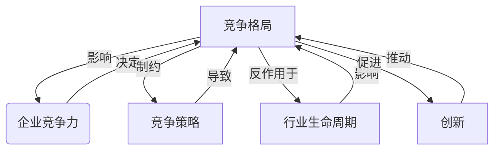
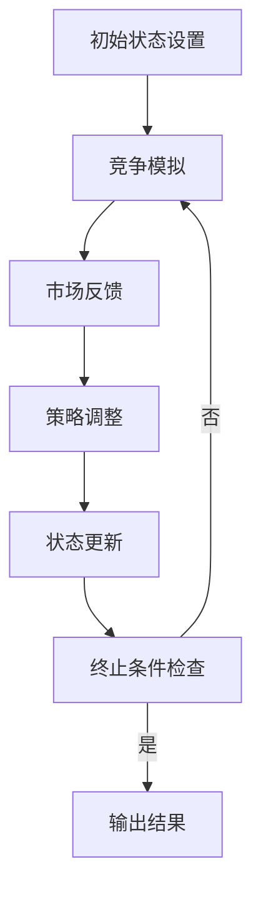

# 商业领域的竞争格局长期演变

## 1. 背景介绍

### 1.1 问题的由来

在当今瞬息万变的商业环境中,企业面临着激烈的竞争压力。市场格局的变化、新兴技术的涌现、消费者偏好的转变等因素,都使得企业必须时刻保持警惕,适应变化,以确保可持续发展。然而,竞争格局的演变并非一蹴而就,而是一个长期、复杂的过程,需要企业深入理解其中的内在规律和驱动力。

### 1.2 研究现状

许多学者和实践者都对商业竞争格局的演变进行了深入研究。一些著名的理论和模型,如波特的五力模型、产业生命周期理论、蓝海战略等,为我们理解竞争格局的变迁提供了有力的分析工具。然而,这些理论和模型往往局限于特定的时间段或行业,难以全面解释竞争格局的长期演变过程。

### 1.3 研究意义

深入探究商业领域竞争格局的长期演变规律,对于企业制定长远发展战略、把握市场机遇、应对潜在威胁具有重要意义。通过揭示竞争格局变迁的内在驱动力,企业可以更好地预测未来的市场趋势,做出前瞻性的决策。同时,这也有助于政府制定有效的产业政策,促进行业的健康发展。

### 1.4 本文结构

本文将从以下几个方面深入探讨商业领域竞争格局的长期演变:

1. 核心概念与联系
2. 核心算法原理与具体操作步骤
3. 数学模型和公式详细讲解与举例说明
4. 项目实践:代码实例和详细解释说明
5. 实际应用场景
6. 工具和资源推荐
7. 总结:未来发展趋势与挑战
8. 附录:常见问题与解答

## 2. 核心概念与联系

在探讨商业竞争格局的长期演变之前,我们需要明确几个核心概念及其内在联系。

1. **竞争格局(Competitive Landscape)**: 指某一特定市场或行业中,各参与者(企业)的相对实力、市场地位、竞争策略等的总体格局。它反映了市场参与者之间的竞争关系和力量对比。

2. **竞争力(Competitiveness)**: 指企业在市场竞争中获胜的能力。它是企业综合实力的体现,包括产品质量、成本控制、创新能力、品牌影响力等多个方面。

3. **竞争策略(Competitive Strategy)**: 指企业为获取竞争优势而采取的一系列行动方案。不同的竞争策略会导致企业在市场中的定位和竞争格局发生变化。

4. **行业生命周期(Industry Life Cycle)**: 描述了一个行业从诞生、成长、成熟到衰退的整个过程。行业生命周期的不同阶段,竞争格局会发生显著变化。

5. **创新(Innovation)**: 指企业推出新产品、新服务、新商业模式等,以获取竞争优势的行为。创新是推动竞争格局演变的关键驱动力。

这些核心概念相互关联、相互影响,共同构成了竞争格局演变的基础框架。企业的竞争力决定了其在竞争格局中的地位,而竞争策略则影响着竞争格局的变迁。同时,行业生命周期和创新又会反过来改变企业的竞争力和策略选择。

## 3. 核心算法原理与具体操作步骤

### 3.1 算法原理概述

为了理解商业竞争格局的长期演变规律,我们需要建立一个动态模型,将各种影响因素纳入考量。这个模型的核心算法原理是基于复杂系统理论和演化博弈论。

复杂系统理论认为,一个系统由多个相互作用的元素组成,这些元素之间的非线性关系会导致系统整体行为的出现。商业竞争格局可被视为一个复杂系统,其中企业作为元素,通过竞争、合作等行为相互影响。

演化博弈论则研究了在动态环境下,参与者如何通过不断试错和学习来调整策略,以获得最大利益。在商业竞争中,企业也在不断尝试新的竞争策略,并根据市场反馈进行调整,从而推动竞争格局的演变。

### 3.2 算法步骤详解

我们将竞争格局的长期演变过程分为以下几个步骤:

1. **初始状态设置**

   确定初始时刻的行业参与者(企业)、它们的竞争力、所采取的竞争策略等参数。这些参数可以基于历史数据或专家经验进行设置。

2. **竞争模拟**

   根据企业的竞争力和策略,模拟它们在市场中的竞争行为,包括产品定价、营销推广、创新投入等。这一步骤可以借助代理模型(Agent-based Model)来实现。

3. **市场反馈**

   根据竞争模拟的结果,计算每个企业的市场表现,如销售额、市场份额、利润等指标。这些指标将作为市场对企业竞争行为的反馈。

4. **策略调整**

   企业根据市场反馈,调整自身的竞争策略。调整策略的方式可以是基于规则的决策,也可以借助机器学习算法实现。

5. **状态更新**

   根据调整后的竞争策略,更新企业的竞争力、市场地位等参数,进入下一个竞争周期。

6. **终止条件检查**

   判断是否达到设定的终止条件,如模拟时间到期、行业进入稳定状态等。如果未达到终止条件,则返回第2步,重复竞争模拟、市场反馈、策略调整的过程。

通过不断迭代上述步骤,我们可以模拟出竞争格局随时间的动态演变过程。

### 3.3 算法优缺点

上述算法的优点在于:

1. 能够动态模拟竞争格局的长期演变过程,揭示其内在规律。
2. 将多种影响因素(如企业竞争力、策略、行业生命周期等)纳入考量,模型更加全面。
3. 借助机器学习等技术,可以实现企业策略的自适应调整,增强模型的智能性。

但同时,该算法也存在一些缺点和挑战:

1. 模型参数设置的复杂性,需要大量的历史数据和专家知识作为输入。
2. 计算量较大,尤其是在企业数量较多、策略空间较大的情况下,模拟过程会变得非常耗时。
3. 难以完全捕捉人类决策的复杂性和非理性因素,如情绪、直觉等。

### 3.4 算法应用领域

上述算法不仅可以应用于商业竞争格局的研究,还可以推广到其他领域,如:

1. **生物进化**:模拟物种在环境变迁中的适应性进化过程。
2. **社会学**:研究社会群体之间的互动关系及其长期演变趋势。
3. **国际关系**:分析国家之间的力量对比及其变化,预测潜在的冲突和联盟。
4. **技术创新**:探究新技术在市场中的扩散和替代过程。

总的来说,该算法为研究复杂系统中的动态演化过程提供了一种有效的建模和模拟方法。

## 4. 数学模型和公式详细讲解与举例说明

### 4.1 数学模型构建

为了量化描述竞争格局的演变,我们需要构建一个数学模型。该模型的核心是一个状态方程,描述了系统状态(即竞争格局)在每个时间步长内的变化。

设 $s_t$ 表示时刻 $t$ 的系统状态,包括所有企业的竞争力、市场份额等参数。我们定义状态转移方程如下:

$$s_{t+1} = F(s_t, a_t)$$

其中,函数 $F$ 描述了系统状态的演化规则,它取决于当前状态 $s_t$ 和所有企业在该时刻采取的行动 $a_t$。

企业的行动 $a_t$ 由其竞争策略 $\pi$ 决定,即:

$$a_t = \pi(s_t)$$

这里的竞争策略 $\pi$ 可以是基于规则的,也可以是通过机器学习算法获得的策略函数。

进一步,我们可以将企业的竞争力、市场份额等指标视为状态 $s_t$ 的不同分量,并为每个分量建立独立的更新方程。例如,对于企业 $i$ 的竞争力 $c_i$,其更新方程可以是:

$$c_i^{t+1} = c_i^t + \alpha_1 r_i^t - \alpha_2 \sum_{j \neq i} c_j^t$$

其中,$r_i^t$ 表示企业 $i$ 在时刻 $t$ 的收益,系数 $\alpha_1$ 和 $\alpha_2$ 分别控制了收益对竞争力的正向影响和其他企业竞争力的负向影响。

通过构建这样的数学模型,我们可以更精确地描述和分析竞争格局的演变过程。

### 4.2 公式推导过程

下面我们将推导出企业市场份额的更新公式。假设市场总需求为 $D$,企业 $i$ 的产品价格为 $p_i$,其他企业的平均价格为 $\bar{p}$,则企业 $i$ 的需求函数可以写为:

$$q_i = D \cdot \frac{(\bar{p}/p_i)^\gamma}{\sum_j (\bar{p}/p_j)^\gamma}$$

其中,参数 $\gamma > 0$ 表示价格对需求的敏感程度。当 $\gamma$ 较大时,价格较低的企业将获得更多的市场需求。

进一步,假设企业的成本函数为 $C_i(q_i)$,利润为:

$$\pi_i = p_i q_i - C_i(q_i)$$

企业将选择使利润最大化的价格 $p_i^*$,即:

$$p_i^* = \arg\max_{p_i} \pi_i$$

在均衡状态下,所有企业的价格和产量都将达到稳定值。设企业 $i$ 的均衡产量为 $q_i^*$,则其市场份额为:

$$s_i = \frac{q_i^*}{\sum_j q_j^*}$$

通过对上述方程进行求解,我们可以得到企业市场份额的更新公式:

$$s_i^{t+1} = s_i^t + \beta_1 (\pi_i^t - \bar{\pi}^t) - \beta_2 \sum_{j \neq i} s_j^t$$

其中,系数 $\beta_1$ 和 $\beta_2$ 分别控制了利润差异和其他企业市场份额对当前企业份额的影响程度。

这个公式揭示了市场份额演变的内在规律:企业的市场份额将随着其相对利润的增加而提高,但同时也会受到其他企业份额的抑制。通过将这一公式纳入状态方程,我们可以更准确地模拟竞争格局的动态变化。

### 4.3 案例分析与讲解

为了更好地理解上述数学模型和公式,我们来分析一个具体的案例。假设有三家企业 A、B、C 在某个市场中竞争,它们的初始竞争力和市场份额如下:

- 企业 A: 竞争力 = 0.7,市场份额 = 0.4
- 企业 B: 竞争力 = 0.5,市场份额 = 0.3
- 企业 C: