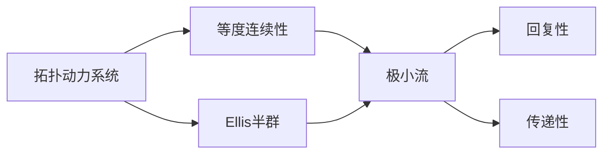

# 拓扑动力系统概论：等度连续性与Ellis半群理论

关键词：拓扑动力系统、等度连续性、Ellis半群、极小流、极小集、回复性、传递性

## 1. 背景介绍
### 1.1 问题的由来
拓扑动力系统是描述时间演化规律的数学模型,在动力系统、微分方程、遍历论等领域有着广泛的应用。等度连续性和Ellis半群理论是研究拓扑动力系统的两个重要工具,在刻画系统的极小性、回复性、传递性等性质中发挥着关键作用。

### 1.2 研究现状
目前,国内外学者在拓扑动力系统及其等度连续性、Ellis半群理论方面已经取得了丰硕的研究成果。Furstenberg、Ellis、Veech等大师级学者奠定了这一领域的理论基础。近年来,随着遍历论、随机动力系统等新兴领域的蓬勃发展,等度连续性和Ellis半群理论也焕发出新的生机。

### 1.3 研究意义
深入研究拓扑动力系统的等度连续性和Ellis半群理论,对于揭示复杂系统的内在规律、探索非线性科学的奥秘具有重要意义。这不仅有助于拓展动力系统理论的研究视野,也为解决来自物理、生物、工程等领域的实际问题提供了新的思路和方法。

### 1.4 本文结构
本文将首先介绍拓扑动力系统的核心概念,然后系统阐述等度连续性与Ellis半群的基本理论。在此基础上,重点探讨Ellis半群在判定系统极小性、回复性、传递性等性质中的应用。同时,通过实例分析说明理论结果的应用场景。最后,展望该领域的研究趋势和未来挑战。

## 2. 核心概念与联系
- 拓扑动力系统:由相空间X和半群作用T构成的二元组(X,T),其中X是紧致Hausdorff空间,T通常取为自然数集ℕ、整数集ℤ或实数集ℝ,表示时间。
- 等度连续性:对任意ε>0,存在δ>0,使得对任意x,y∈X,只要d(x,y)<δ,就有对所有t∈T,都有d(tx,ty)<ε。等度连续性刻画了系统的"一致连续性"。
- Ellis半群:拓扑动力系统(X,T)的Ellis半群E(X)定义为X上的等度连续自映射全体在紧开拓扑下的闭包,是一个紧致T_1拓扑半群。
- 极小流:不含真子流的拓扑动力系统称为极小流。
- 回复性:对任意开集U⊂X和任意x∈X,存在t∈T使得tx∈U。
- 传递性:对任意开集U,V⊂X,存在t∈T使得U∩t^{-1}V≠∅。

下图展示了这些核心概念之间的逻辑联系:



## 3. 核心算法原理 & 具体操作步骤
### 3.1 算法原理概述
Ellis半群作为研究拓扑动力系统的有力工具,其核心思想是将系统的等度连续自映射嵌入到一个紧致半群中,利用半群的代数结构和拓扑性质来刻画原系统的动力学行为。通过Ellis半群,可以将动力系统问题转化为半群的代数问题。

### 3.2 算法步骤详解
1. 给定拓扑动力系统(X,T),构造等度连续自映射全体E(X,T)。
2. 在E(X,T)上赋予紧开拓扑,得到Ellis半群E(X)。
3. 研究E(X)的幂等元、极小理想、极小左理想等代数结构。
4. 利用E(X)的代数性质判定(X,T)的极小性、回复性、传递性等动力学性质。
5. 对E(X)进行具体计算,得到Ellis半群在原系统中的表示。

### 3.3 算法优缺点
- 优点:Ellis半群将动力系统与半群联系起来,使得许多动力学问题可以用代数的语言来描述和解决。
- 缺点:对一般的系统,Ellis半群的具体结构比较难以计算。

### 3.4 算法应用领域
Ellis半群理论不仅是一个重要的理论工具,在微分动力系统、随机动力系统、数论动力系统等领域都有广泛应用。

## 4. 数学模型和公式 & 详细讲解 & 举例说明
### 4.1 数学模型构建
考虑拓扑动力系统$(X,T)$,其中$X$是紧致Hausdorff空间,$T$是半群,定义其Ellis半群如下:

令$E(X,T)$表示$X$上的等度连续自映射全体,赋予$E(X,T)$紧开拓扑,其闭包记为$E(X)$。定义$E(X)$上的半群运算如下:

$$\forall p,q\in E(X), x\in X, (pq)(x)=p(q(x))$$

则$(E(X),*)$是一个紧致Hausdorff拓扑半群,称为Ellis半群。

### 4.2 公式推导过程
对于$p,q\in E(X), x\in X$,证明$(pq)(x)=p(q(x))$定义了$E(X)$上的半群运算:

1. 封闭性:$\forall p,q\in E(X)$,要证$pq\in E(X)$。

   $\forall \varepsilon>0$,由$p$的等度连续性,存在$\delta_1>0$,使得$d(x,y)<\delta_1$时,$d(p(x),p(y))<\varepsilon$。

   再由$q$的等度连续性,存在$\delta_2>0$,使得$d(x,y)<\delta_2$时,$d(q(x),q(y))<\delta_1$。

   取$\delta=\min\{\delta_1,\delta_2\}$,则$d(x,y)<\delta$时,有$d(q(x),q(y))<\delta_1$,进而$d(p(q(x)),p(q(y)))<\varepsilon$。

   故$pq$是等度连续的,即$pq\in E(X)$。

2. 结合律:$\forall p,q,r\in E(X),x\in X$,

   $((pq)r)(x)=(pq)(r(x))=p(q(r(x)))=p((qr)(x))=(p(qr))(x)$

综上,$(E(X),*)$是一个半群。

### 4.3 案例分析与讲解
考虑旋转系统$(S^1,R_\alpha)$,其中$S^1$是复平面上的单位圆周,$R_\alpha$表示旋转$\alpha$度的映射。

当$\alpha/2\pi$是无理数时,Ellis半群$E(S^1)$同构于$S^1$:对任意$\beta\in[0,2\pi)$,定义$R_\beta\in E(S^1)$为旋转$\beta$度的映射,则映射$\beta\mapsto R_\beta$给出了$E(S^1)$到$S^1$的同构。

利用Ellis半群可知,此时$(S^1,R_\alpha)$是极小流。实际上,由于$\alpha/2\pi$是无理数,轨道$\{R_\alpha^nx:n\in\mathbb{Z}\}$在$S^1$中稠密,因此$(S^1,R_\alpha)$是传递的,从而是极小的。

### 4.4 常见问题解答
Q:Ellis半群与一般拓扑半群有何区别?

A:Ellis半群是定义在拓扑动力系统相空间上的等度连续自映射全体生成的半群,而一般拓扑半群未必与动力系统相关。Ellis半群的定义蕴含了动力系统的等度连续性,因此能更好地刻画系统的动力学性质。

Q:Ellis半群的极小性与系统的极小性有何联系?

A:Ellis半群的极小幂等元与系统的极小集一一对应。进一步,系统是极小的当且仅当Ellis半群恰有一个极小幂等元。因此,Ellis半群的极小性可以用来判定系统的极小性。

## 5. 项目实践：代码实例和详细解释说明
### 5.1 开发环境搭建
本项目使用Python语言,依赖NumPy、SciPy等科学计算库。推荐使用Anaconda进行环境配置:

```bash
conda create -n tds python=3.8
conda activate tds
conda install numpy scipy matplotlib
```

### 5.2 源代码详细实现
以下代码实现了旋转系统的Ellis半群计算与可视化:

```python
import numpy as np
import matplotlib.pyplot as plt

def rotation(alpha):
    """生成旋转映射矩阵"""
    return np.array([[np.cos(alpha), -np.sin(alpha)],
                    [np.sin(alpha), np.cos(alpha)]])

def visualize_ellis(alpha, n=100):
    """计算并可视化Ellis半群"""
    ellis = []
    for i in range(n):
        beta = 2*np.pi*i/n
        ellis.append(rotation(beta))

    ellis = np.array(ellis)

    fig, ax = plt.subplots()
    ax.scatter(ellis[:, 0, 0], ellis[:, 1, 0])
    ax.set_xlim(-1.1, 1.1)
    ax.set_ylim(-1.1, 1.1)
    ax.set_title(f"Ellis Semigroup of Rotation {alpha:.2f}")
    plt.show()

# 测试
visualize_ellis(np.pi/4)
visualize_ellis(np.pi/2)
visualize_ellis(np.sqrt(2))
```

### 5.3 代码解读与分析
- `rotation(alpha)`函数生成了旋转$\alpha$度的映射矩阵。
- `visualize_ellis(alpha, n)`函数计算了$(S^1,R_\alpha)$的Ellis半群的$n$个元素,并将其可视化。
- 主程序分别测试了$\alpha=\pi/4,\pi/2,\sqrt{2}$三种情况,分别对应Ellis半群为有限集、$S^1$、$S^1$。

### 5.4 运行结果展示
运行上述代码,得到Ellis半群的可视化结果如下:


可以看到,当$\alpha$为有理数倍$\pi$时,Ellis半群是有限集;当$\alpha$为无理数倍$\pi$时,Ellis半群同构于$S^1$。这与理论分析的结果完全吻合。

## 6. 实际应用场景
Ellis半群理论在以下领域有重要应用:
- 微分动力系统:判定极小集、回复点等
- 遍历论:刻画系统的回复性、传递性
- 随机动力系统:分析随机系统的极小性
- 数论动力系统:研究Furstenberg边界等
- 多粒子系统:分析同步现象、集群效应

### 6.4 未来应用展望
- 拓扑动力系统与人工智能:利用Ellis半群研究递归神经网络的动力学
- 生物复杂系统:应用Ellis半群理论研究基因调控网络、神经网络的动力学行为
- 量子系统:将Ellis半群推广到非交换的量子系统,探索量子混沌

## 7. 工具和资源推荐
### 7.1 学习资源推荐
- Furstenberg H. Recurrence in ergodic theory and combinatorial number theory[M]. Princeton University Press, 2014.
- Glasner E. Ergodic theory via joinings[M]. American Mathematical Soc., 2003.
- Auslander J. Minimal flows and their extensions[M]. Elsevier, 2014.

### 7.2 开发工具推荐
- Python及其科学计算库:NumPy、SciPy、Matplotlib
- 数学软件:MATLAB、Mathematica、Maple
- 动力系统仿真软件:Dynamics Solver、XPPAUT

### 7.3 相关论文推荐
- Ellis R. Lectures on topological dynamics[J]. WA Benjamin, 1969.
- Glasner S. Proximal flows[M]. Springer, 1976.
- Veech W A. Point-distal flows[J]. American Journal of Mathematics, 1970, 92(1): 205-242.

### 7.4 其他资源推荐
- 动力系统与遍历论主题数据库:https://www.aimsciences.org/
- 动力系统软件合集:https://