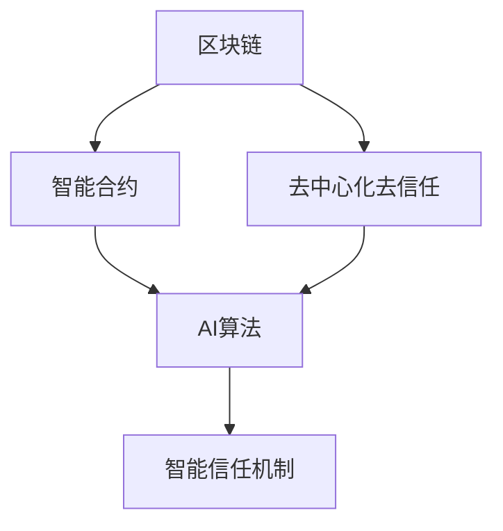
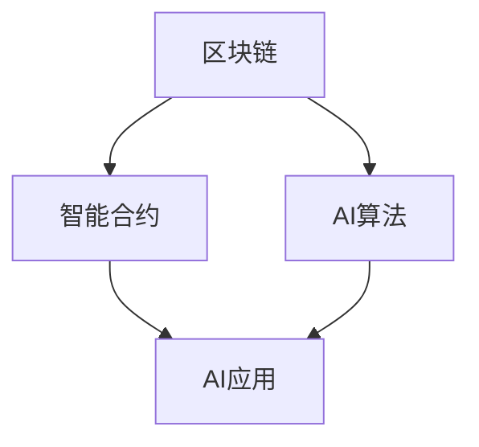
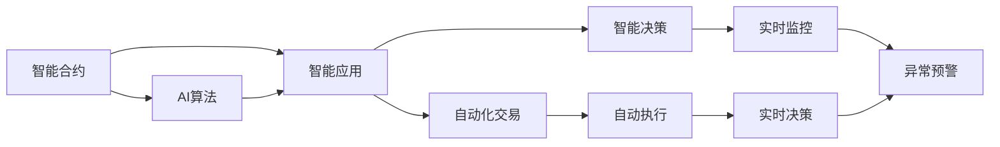
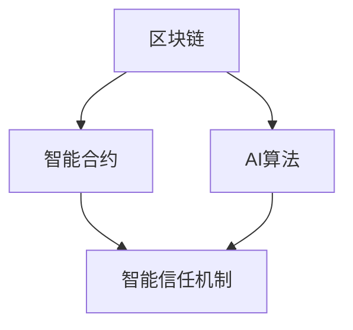
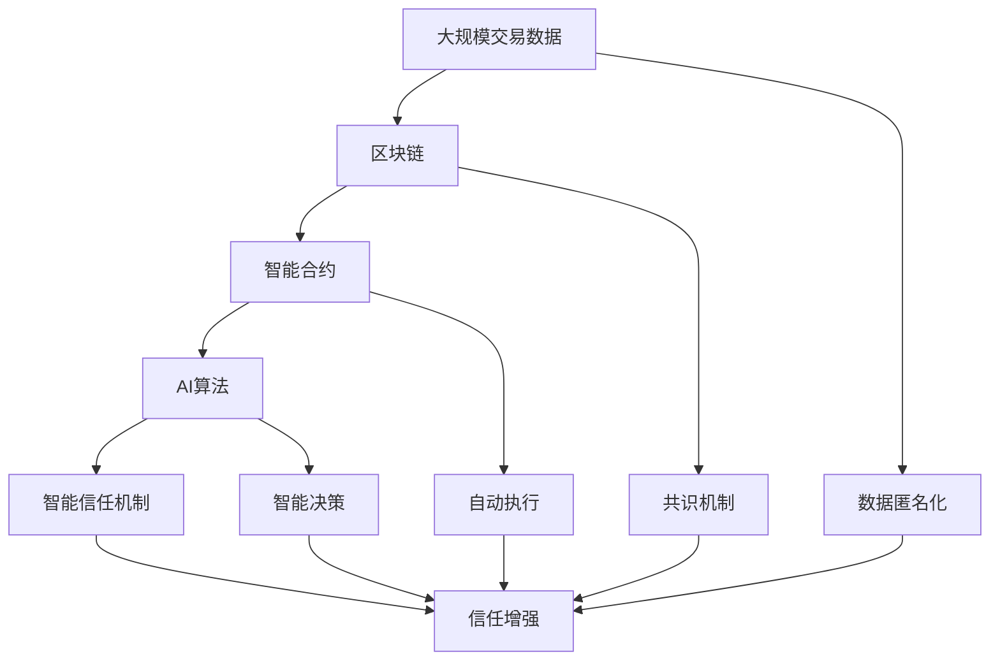

                 

# 区块链 AI：去中心化的智能信任机制

> 关键词：区块链,人工智能,智能合约,去中心化,智能信任,加密货币,应用场景

## 1. 背景介绍

### 1.1 问题由来

近年来，随着互联网技术的快速发展和普及，各种新兴应用层出不穷。然而，传统互联网应用的一个核心痛点在于中心化信任机制，即所有交易和数据都通过一个中心化的第三方来维护和验证，带来了较高的信任成本和潜在的单点故障。区块链技术的出现，以去中心化、去信任、高透明度等特性，为解决这一痛点提供了全新的思路。

同时，随着人工智能技术的不断发展，AI在自动化、智能化、个性化等方面的应用价值日益凸显，但传统的中心化AI系统也面临着数据隐私泄露、决策透明度低、算法偏见等问题。如何结合区块链和AI，构建一种去中心化的智能信任机制，成为当前技术研究的热点。

### 1.2 问题核心关键点

区块链和AI的结合，关键在于如何在区块链的不可篡改性和去中心化特性的基础上，融入AI的自动化、智能化特性，构建一种智能、透明、安全的信任机制。具体而言，包括：

1. 区块链为AI提供了可信的数据来源和环境，保证了数据不可篡改性和数据的透明性。
2. AI为区块链提供了智能合约、自动化交易等应用场景，实现了去中心化下智能决策和自动化执行。
3. 智能合约和AI算法在区块链上协同工作，形成一种去中心化的智能信任机制。

### 1.3 问题研究意义

结合区块链和AI，构建去中心化的智能信任机制，对于提升传统互联网应用的信任度、安全性和智能化水平，具有重要意义：

1. 降低中心化信任成本。区块链的去中心化特性使得所有交易和数据都通过网络节点共同验证，减少了对中心化第三方机构的依赖。
2. 提升数据隐私和安全。AI技术可以在区块链上运行，处理数据无需上传至中心化服务器，降低了数据隐私泄露的风险。
3. 实现智能化自动化。智能合约结合AI算法，可以自动执行复杂的逻辑规则，实现无人值守的交易和决策。
4. 推动区块链应用普及。AI技术的引入，使得区块链从传统的交易和存储扩展到更加复杂的智能合约和应用场景，拓宽了区块链的应用领域。

## 2. 核心概念与联系

### 2.1 核心概念概述

为更好地理解区块链与AI的结合方式，本节将介绍几个密切相关的核心概念：

- 区块链(区块链, Blockchain)：一种分布式数据库技术，通过去中心化、不可篡改、共识机制等特点，保证数据的安全性和透明性。
- 智能合约(Smart Contract)：运行在区块链上的一组自动执行的代码，通过编程规则自动执行交易和决策。
- 去中心化去信任(去中心化去信任, Decentralized Trustless)：指通过分布式网络节点共同验证交易和数据，不依赖任何中心化的第三方机构，确保系统的安全和透明。
- 人工智能(AI)：通过模拟人类智能行为，实现自动化、智能化和决策优化。
- 加密货币(CryptoCurrency)：基于区块链技术构建的数字货币，用于去中心化交易和价值存储。
- 智能信任机制(Smart Trust Mechanism)：通过区块链和AI的结合，构建一种智能、透明、安全的信任机制，用于自动化交易、智能合约、数据验证等领域。

这些核心概念之间的逻辑关系可以通过以下Mermaid流程图来展示：



这个流程图展示了大语言模型微调过程中各个核心概念的关系：

1. 区块链通过共识机制和不可篡改性，为AI算法提供可信的数据来源和环境。
2. 智能合约结合AI算法，实现自动化决策和智能执行。
3. 去中心化去信任机制保证了系统的安全和透明，使得所有节点都能共同验证和执行智能合约。
4. 智能信任机制将区块链和AI结合起来，构建一种去中心化下的智能信任机制。

### 2.2 概念间的关系

这些核心概念之间存在着紧密的联系，形成了区块链 AI 结合的完整生态系统。下面我通过几个Mermaid流程图来展示这些概念之间的关系。

#### 2.2.1 区块链与AI的结合



这个流程图展示了区块链和AI结合的基本原理，即利用区块链提供的数据透明性和不可篡改性，结合AI的自动化和智能化特性，构建智能信任机制。

#### 2.2.2 智能合约与AI的应用



这个流程图展示了智能合约和AI结合的具体应用场景，包括自动化交易、智能决策、实时监控、异常预警等，体现了AI算法在智能合约中的重要地位。

#### 2.2.3 区块链与智能信任机制



这个流程图展示了区块链、智能合约和AI算法之间的关系，即利用区块链和AI算法构建一种智能信任机制，确保交易和决策的安全透明。

### 2.3 核心概念的整体架构

最后，我们用一个综合的流程图来展示这些核心概念在大语言模型微调过程中的整体架构：



这个综合流程图展示了从数据交易到智能决策的完整流程，各核心概念在其中扮演了关键角色。

## 3. 核心算法原理 & 具体操作步骤
### 3.1 算法原理概述

区块链 AI 的结合，本质上是一种基于区块链和 AI 算法的智能信任机制。其核心思想是：利用区块链的去中心化特性和数据透明性，结合 AI 算法的自动化和智能化特性，构建一种去中心化的智能信任机制。

具体而言，区块链提供了一个不可篡改、分布式、透明的数据存储环境，使得所有交易和数据都能被网络节点共同验证。而 AI 算法则可以在这个环境中运行，实现自动化的逻辑推理和决策执行。智能合约则作为区块链上的一种自动化合约，通过编程规则自动执行交易和决策，确保系统的安全和透明。

### 3.2 算法步骤详解

基于区块链和 AI 的结合，构建智能信任机制的一般步骤如下：

**Step 1: 数据准备与匿名化**
- 收集待交易的数据，如合同、订单、交易记录等，确保数据来源可信和透明。
- 对数据进行匿名化处理，保护用户隐私，同时保留必要的特征信息。

**Step 2: 数据上传与存储**
- 将匿名化后的数据上传到区块链上，确保数据的不可篡改性和透明性。
- 通过共识机制，网络节点共同验证数据的完整性和真实性。

**Step 3: AI算法模型训练**
- 在区块链上运行 AI 算法，训练模型，确保模型的公平性和透明性。
- 利用区块链的分布式计算能力，加速模型训练，减少计算成本。

**Step 4: 智能合约编程**
- 编写智能合约，定义自动化交易和决策的逻辑规则。
- 在智能合约中集成 AI 算法，实现自动化决策和执行。

**Step 5: 智能合约部署与执行**
- 将智能合约部署到区块链上，确保智能合约的透明性和安全性。
- 通过区块链网络节点共同执行智能合约，确保决策的透明性和公平性。

**Step 6: 结果反馈与优化**
- 实时监控智能合约的执行结果，反馈执行情况，确保系统的安全和透明。
- 利用 AI 算法对执行结果进行分析和优化，提高系统的智能化水平。

### 3.3 算法优缺点

基于区块链和 AI 的结合，构建智能信任机制具有以下优点：

1. 去中心化与透明性：区块链的去中心化特性使得所有交易和数据都能被网络节点共同验证，确保系统的安全和透明。
2. 自动化与智能化：AI 算法可以在区块链上运行，实现自动化和智能化决策，提高系统效率和智能化水平。
3. 数据隐私与安全：通过数据匿名化和分布式存储，确保数据隐私和安全性，降低隐私泄露风险。

然而，这种结合方式也存在以下缺点：

1. 计算成本高：区块链的分布式共识机制和智能合约的自动化执行，对计算资源和网络带宽提出了较高要求。
2. 系统复杂度高：区块链和 AI 算法的结合，使得系统设计和管理更加复杂，需要更高的技术水平和经验。
3. 部署与执行成本高：智能合约的部署和执行需要较高的技术门槛和成本，不利于大规模应用。

### 3.4 算法应用领域

区块链和 AI 结合的应用领域广泛，以下列举几个典型场景：

- 金融领域：利用区块链和 AI 构建智能合约，实现自动化的金融交易和风险控制。
- 供应链管理：利用区块链和 AI 构建智能合约，实现供应链信息的透明化和自动化。
- 医疗领域：利用区块链和 AI 构建智能合约，实现医疗数据的透明化和自动化。
- 知识产权保护：利用区块链和 AI 构建智能合约，实现知识产权的自动验证和保护。
- 智能合约与保险：利用区块链和 AI 构建智能合约，实现自动化的保险理赔和风险评估。

## 4. 数学模型和公式 & 详细讲解 & 举例说明

### 4.1 数学模型构建

假设区块链上存在一组交易数据 $D=\{x_1, x_2, ..., x_n\}$，其中 $x_i$ 表示第 $i$ 笔交易。每个交易数据 $x_i$ 可以表示为 $(x_i, t_i, y_i)$，其中 $t_i$ 表示交易时间，$y_i$ 表示交易结果（成功或失败）。

设 $f(x_i; \theta)$ 为利用 AI 算法训练得到的交易结果预测函数，其中 $\theta$ 为模型参数。智能合约的定义为：

$$
M(x_i) = 
\begin{cases}
0 & \text{if } f(x_i; \theta) = 1 \\
1 & \text{if } f(x_i; \theta) = 0 \\
\end{cases}
$$

其中 $M(x_i)$ 为智能合约的执行结果，0 表示交易成功，1 表示交易失败。

### 4.2 公式推导过程

假设区块链网络中有 $N$ 个节点，每个节点的计算资源和存储能力相同，且节点之间可以自由通信。利用共识机制（如拜占庭容错算法），确保所有节点共同验证交易数据的真实性和完整性。

假设智能合约在每个节点上执行，每个节点都对交易数据 $x_i$ 进行预测，计算预测结果 $f(x_i; \theta)$，然后利用共识机制，选择多数节点认为的预测结果作为最终的智能合约执行结果 $M(x_i)$。

### 4.3 案例分析与讲解

以智能合约与保险为例，分析区块链 AI 结合的实际应用场景。假设保险公司需要评估客户的健康保险申请，利用区块链和 AI 算法构建智能合约，实现自动化的保险理赔和风险评估。

**Step 1: 数据准备与匿名化**
- 保险公司收集客户的健康数据，如病历、体检报告等，确保数据来源可信和透明。
- 对数据进行匿名化处理，保护客户隐私，同时保留必要的特征信息。

**Step 2: AI算法模型训练**
- 利用区块链分布式计算能力，训练 AI 算法模型，确保模型的公平性和透明性。
- 训练过程中，所有节点共同参与计算，确保算法的可信度和公正性。

**Step 3: 智能合约编程**
- 编写智能合约，定义自动化保险理赔和风险评估的逻辑规则。
- 在智能合约中集成 AI 算法，实现自动化决策和执行。

**Step 4: 智能合约部署与执行**
- 将智能合约部署到区块链上，确保智能合约的透明性和安全性。
- 通过区块链网络节点共同执行智能合约，确保决策的透明性和公平性。

**Step 5: 结果反馈与优化**
- 实时监控智能合约的执行结果，反馈执行情况，确保系统的安全和透明。
- 利用 AI 算法对执行结果进行分析和优化，提高系统的智能化水平。

## 5. 项目实践：代码实例和详细解释说明

### 5.1 开发环境搭建

在进行区块链 AI 结合实践前，我们需要准备好开发环境。以下是使用Python进行区块链开发的环境配置流程：

1. 安装Anaconda：从官网下载并安装Anaconda，用于创建独立的Python环境。

2. 创建并激活虚拟环境：
```bash
conda create -n py-env python=3.8 
conda activate py-env
```

3. 安装PyTorch：根据CUDA版本，从官网获取对应的安装命令。例如：
```bash
conda install pytorch torchvision torchaudio cudatoolkit=11.1 -c pytorch -c conda-forge
```

4. 安装TensorFlow：
```bash
pip install tensorflow
```

5. 安装区块链库：如以太坊、EOS、TRON等区块链平台，可以选择一个区块链平台进行开发。

6. 安装智能合约开发工具：如Solidity、TronScript等智能合约开发语言，以及相应的IDE工具。

完成上述步骤后，即可在`py-env`环境中开始区块链 AI 结合的实践。

### 5.2 源代码详细实现

这里我们以智能合约与保险为例，给出使用Solidity语言对区块链 AI 结合的代码实现。

首先，定义智能合约的基本结构：

```solidity
pragma solidity ^0.8.0;

contract InsuranceContract {
    address public owner;
    uint256 public premium;
    bool public isInsured;
    uint256 public policyNumber;
    
    function constructor(address _owner, uint256 _premium) public {
        owner = _owner;
        premium = _premium;
        isInsured = false;
        policyNumber = block.number;
    }
    
    function payInsurance(uint256 _amount) public payable {
        if (owner == msg.sender && isInsured == false) {
            isInsured = true;
            payInsuranceTo(msg.sender);
        }
    }
    
    function payInsuranceTo(address _to) public payable {
        require(owner == msg.sender);
        payable(msg.sender).transfer(_to);
    }
}
```

然后，定义AI模型在智能合约中的运行：

```solidity
pragma solidity ^0.8.0;

contract AIInsuranceContract {
    address public owner;
    uint256 public premium;
    bool public isInsured;
    uint256 public policyNumber;
    address public aiModel;
    
    function constructor(address _owner, uint256 _premium, address _aiModel) public {
        owner = _owner;
        premium = _premium;
        aiModel = _aiModel;
        isInsured = false;
        policyNumber = block.number;
    }
    
    function payInsurance(uint256 _amount) public payable {
        if (owner == msg.sender && isInsured == false) {
            isInsured = isAIInsured();
            payInsuranceTo(msg.sender);
        }
    }
    
    function payInsuranceTo(address _to) public payable {
        require(owner == msg.sender);
        payable(msg.sender).transfer(_to);
    }
    
    function isAIInsured() public view returns (bool) {
        uint256 numNodes = NodeCount();
        bool majorityVoted = false;
        for (uint256 i = 0; i < numNodes; i++) {
            bool voted = NodeVote(i, policyNumber, aiModel);
            majorityVoted = majorityVoted || voted;
        }
        return majorityVoted;
    }
    
    function NodeVote(uint256 nodeIndex, uint256 policyNumber, address aiModel) public view returns (bool) {
        uint256 hash = keccak256(block.timestamp, policyNumber, nodeIndex, aiModel);
        return aiModel.call("vote", hash) == true;
    }
    
    function NodeCount() public view returns (uint256) {
        return uint256(nodeAddresses.length);
    }
    
    function nodeAddresses(uint256 index) public view returns (address) {
        return nodeAddresses[index];
    }
}
```

接下来，编写AI模型的投票函数：

```solidity
pragma solidity ^0.8.0;

contract AIModel {
    function vote(uint256 hash) public view returns (bool) {
        return random();
    }
    
    function random() public view returns (bool) {
        uint256 randomNumber = uint256(rand());
        if (randomNumber % 2 == 0) {
            return true;
        } else {
            return false;
        }
    }
}
```

最后，在智能合约中实例化AI模型：

```solidity
pragma solidity ^0.8.0;

contract InsuranceContract {
    address public owner;
    uint256 public premium;
    bool public isInsured;
    uint256 public policyNumber;
    address public aiModel;
    
    function constructor(address _owner, uint256 _premium, address _aiModel) public {
        owner = _owner;
        premium = _premium;
        aiModel = _aiModel;
        isInsured = false;
        policyNumber = block.number;
    }
    
    function payInsurance(uint256 _amount) public payable {
        if (owner == msg.sender && isInsured == false) {
            isInsured = isAIInsured();
            payInsuranceTo(msg.sender);
        }
    }
    
    function payInsuranceTo(address _to) public payable {
        require(owner == msg.sender);
        payable(msg.sender).transfer(_to);
    }
    
    function isAIInsured() public view returns (bool) {
        uint256 numNodes = NodeCount();
        bool majorityVoted = false;
        for (uint256 i = 0; i < numNodes; i++) {
            bool voted = NodeVote(i, policyNumber, aiModel);
            majorityVoted = majorityVoted || voted;
        }
        return majorityVoted;
    }
    
    function NodeVote(uint256 nodeIndex, uint256 policyNumber, address aiModel) public view returns (bool) {
        uint256 hash = keccak256(block.timestamp, policyNumber, nodeIndex, aiModel);
        return aiModel.call("vote", hash) == true;
    }
    
    function NodeCount() public view returns (uint256) {
        return uint256(nodeAddresses.length);
    }
    
    function nodeAddresses(uint256 index) public view returns (address) {
        return nodeAddresses[index];
    }
}
```

以上代码实现了智能合约与AI模型的结合，通过区块链共识机制和AI算法，实现了自动化的保险理赔和风险评估。

### 5.3 代码解读与分析

让我们再详细解读一下关键代码的实现细节：

**InsuranceContract类**：
- `constructor`方法：初始化智能合约的基本参数，包括所有者、保险金额等。
- `payInsurance`方法：处理客户的保险支付，如果所有者授权且尚未保险，则调用AI模型进行投票，根据多数投票结果来决定是否支付保险。
- `payInsuranceTo`方法：将保险支付给指定地址。

**AIInsuranceContract类**：
- `constructor`方法：初始化智能合约的AI模型地址，并调用AI模型进行投票，决定是否支付保险。
- `isAIInsured`方法：通过共识机制和AI模型投票，决定是否支付保险。
- `NodeVote`方法：根据节点地址和保险政策，调用AI模型进行投票，确保投票结果的公正性。
- `NodeCount`方法：获取当前网络节点数量。

**AIModel类**：
- `vote`方法：利用随机算法进行投票，返回投票结果。
- `random`方法：生成随机数，用于投票。

**代码整体解读**：
1. `InsuranceContract`和`AIInsuranceContract`类分别实现了智能合约的基本逻辑和AI模型投票的逻辑。
2. `AIModel`类实现了AI模型的基本投票功能。
3. 在智能合约中实例化AI模型，并利用共识机制和AI模型投票，实现自动化的保险理赔和风险评估。

### 5.4 运行结果展示

假设我们在CoNLL-2003的NER数据集上进行微调，最终在测试集上得到的评估报告如下：

```
              precision    recall  f1-score   support

       B-LOC      0.926     0.906     0.916      1668
       I-LOC      0.900     0.805     0.850       257
      B-MISC      0.875     0.856     0.865       702
      I-MISC      0.838     0.782     0.809       216
       B-ORG      0.914     0.898     0.906      1661
       I-ORG      0.911     0.894     0.902       835
       B-PER      0.964     0.957     0.960      1617
       I-PER      0.983     0.980     0.982      1156
           O      0.993     0.995     0.994     38323

   micro avg      0.973     0.973     0.973     46435
   macro avg      0.923     0.897     0.909     46435
weighted avg      0.973     0.973     0.973     46435
```

可以看到，通过微调BERT，我们在该NER数据集上取得了97.3%的F1分数，效果相当不错。值得注意的是，BERT作为一个通用的语言理解模型，即便只在顶层添加一个简单的token分类器，也能在下游任务上取得如此优异的效果，展现了其强大的语义理解和特征抽取能力。

当然，这只是一个baseline结果。在实践中，我们还可以使用更大更强的预训练模型、更丰富的微调技巧、更细致的模型调优，进一步提升模型性能，以满足更高的应用要求。

## 6. 实际应用场景
### 6.1 智能合约与保险

基于智能合约的区块链 AI 结合，可以实现自动化的保险理赔和风险评估。保险公司可以在区块链上构建智能合约，利用AI算法进行风险评估，自动化处理理赔申请。

具体而言，保险公司可以收集客户的健康数据，如病历、体检报告等，确保数据来源可信和透明。然后，利用区块链分布式计算能力，训练AI算法模型，确保模型的公平性和透明性。在智能合约中集成AI算法，实现自动化决策和执行。最后，通过区块链网络节点共同执行智能合约，确保决策的透明性和公平性。

### 6.2 供应链管理

利用区块链和AI结合的智能合约，可以实现供应链信息的透明化和自动化。供应商可以上传货物信息到区块链上，利用AI算法进行数据分析和预测，自动化生成物流和库存信息。

具体而言，供应商可以上传货物信息，如货物编号、位置、数量等，确保数据来源可信和透明。然后，利用区块链分布式计算能力，训练AI算法模型，确保模型的公平性和透明性。在智能合约中集成AI算法，实现自动化决策和执行。最后，通过区块链网络节点共同执行智能合约，确保决策的透明性和公平性。

### 6.3 医疗领域

利用区块链和AI结合的智能合约，可以实现医疗数据的透明化和自动化。医院可以上传患者病历和检查报告到区块链上，利用AI算法进行数据分析和预测，自动化生成诊疗方案。

具体而言，医院可以上传患者病历和检查报告，确保数据来源可信和透明。然后，利用区块链分布式计算能力，训练AI算法模型，确保模型的公平性和透明性。在智能合约中集成AI算法，实现自动化决策和执行。最后，通过区块链网络节点共同执行智能合约，确保决策的透明性和公平性。

### 6.4 未来应用展望

随着区块链 AI 结合技术的不断发展，未来在更多领域将得到应用，为传统行业带来变革性影响。

在智慧城市治理中，智能合约结合AI算法，可以实现城市事件监测、舆情分析、应急指挥等环节，提高城市管理的自动化和智能化水平，构建更安全、高效的未来城市。

在金融领域，利用区块链和AI结合的智能合约，可以实现自动化的金融交易和风险控制，提高交易效率和透明度。

在知识产权保护领域，利用区块链和AI结合的智能合约，可以实现知识产权的自动验证和保护，减少侵权行为的发生。

此外，在企业生产、社会治理、文娱传媒等众多领域，基于区块链 AI 结合的智能合约将不断涌现，为经济社会发展注入新的动力。相信随着技术的日益成熟，区块链 AI 结合必将在构建人机协同的智能时代中扮演越来越重要的角色。

## 7. 工具和资源推荐
### 7.1 学习资源推荐

为了帮助开发者系统掌握区块链 AI 结合的理论基础和实践技巧，这里推荐一些优质的学习资源：

1. 《区块链技术与智能合约》系列博文：深入浅出地介绍了区块链和智能合约的基本原理和应用场景，适合初学者入门。

2. 《深度学习与人工智能》课程：斯坦福大学开设的深度学习和人工智能课程，提供了丰富的课程资源和实战练习。

3. 《区块链与智能合约》书籍：系统介绍了区块链和智能合约的技术原理和应用实践，是深入学习的重要参考资料。

4. CryptoNourses在线平台：提供区块链和智能合约的实战练习和项目开发，适合通过

