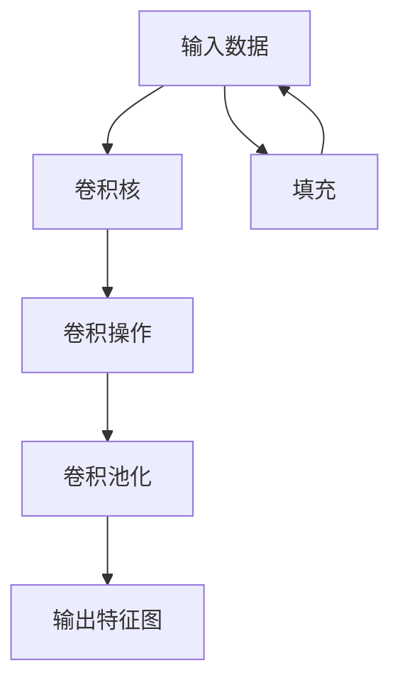
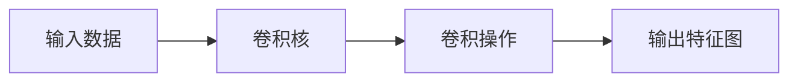
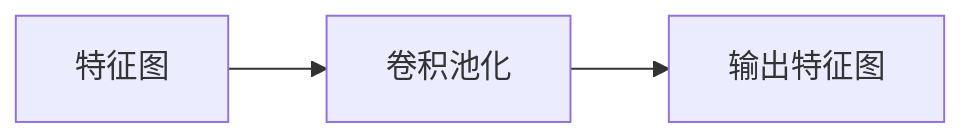
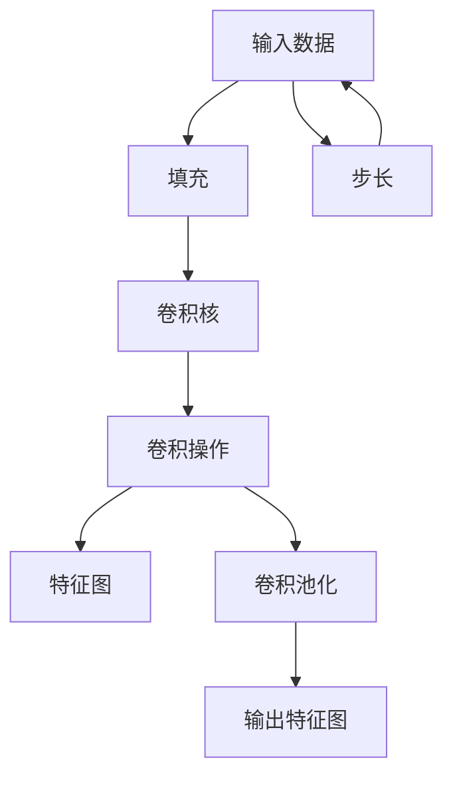
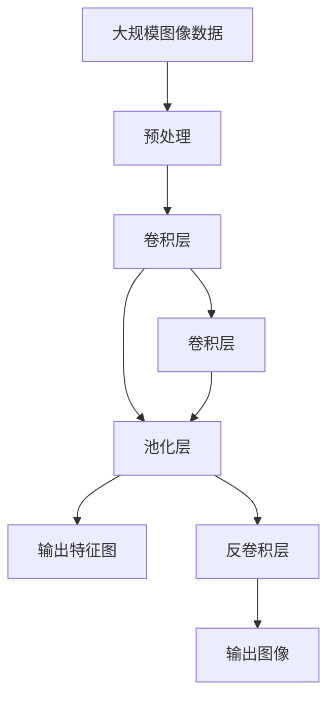

                 

# 卷积层 (Convolutional Layer) 原理与代码实例讲解

> 关键词：卷积层, 卷积神经网络(CNN), 卷积操作, 卷积核, 卷积池化, 深度学习, 图像处理, 计算机视觉

## 1. 背景介绍

### 1.1 问题由来
在深度学习领域，卷积神经网络（Convolutional Neural Network, CNN）以其卓越的图像处理能力而著称。而卷积层（Convolutional Layer）作为CNN的核心组件，通过卷积操作捕捉局部特征，并在不同尺度下提取信息，从而在图像识别、目标检测、视频分类等任务中取得了显著的成功。

然而，对于卷积层的原理、操作和应用，许多初学者仍然感到困惑。为了帮助读者深入理解卷积层的内在机制和实现细节，本文将通过系统讲解卷积层的原理与代码实例，帮助读者透彻掌握卷积神经网络的基本概念和核心技术。

### 1.2 问题核心关键点
卷积层是卷积神经网络的核心，其主要作用是通过卷积操作提取输入数据的局部特征，并在不同尺度下进行特征的抽象和融合。其核心概念包括：

- 卷积核（Kernel）：卷积操作的核心参数，用于捕捉输入数据的空间局部关系。
- 卷积操作（Convolution）：对输入数据进行加权和的线性变换，提取局部特征。
- 卷积池化（Pooling）：对卷积结果进行下采样操作，减少计算量同时保留重要信息。
- 步长（Stride）和填充（Padding）：控制卷积核在输入数据上的移动和填充策略。
- 可分离卷积（Depthwise Convolution）：进一步降低计算复杂度，适用于多通道输入。

掌握这些概念，有助于理解卷积层的工作原理和实现细节，从而更好地应用到实际项目中。

### 1.3 问题研究意义
卷积层作为深度学习领域的核心组件，其原理和实现方式直接影响到模型的性能和应用范围。深入理解卷积层的原理和实现，对于提升深度学习模型在图像处理、目标检测等视觉任务中的表现具有重要意义。此外，掌握卷积层的实现细节，还能帮助开发者更加灵活地构建深度学习模型，加速模型的开发和优化过程。

## 2. 核心概念与联系

### 2.1 核心概念概述

为了更好地理解卷积层的核心概念，本节将详细介绍几个关键术语和概念：

- 卷积核（Kernel）：卷积操作的核心参数，其形状通常为正方形，大小为 $3\times 3$、$5\times 5$ 等。卷积核的权重需要通过训练学习得到。
- 卷积操作（Convolution）：通过对输入数据的每个局部区域进行加权和操作，生成一个新的特征图。卷积操作的计算方式可以理解为对输入数据的每一个位置，通过与卷积核的权重进行点乘和求和，生成一个输出值。
- 卷积池化（Pooling）：对卷积结果进行下采样操作，减少计算量同时保留重要信息。常见的池化方式包括最大池化（Max Pooling）和平均池化（Average Pooling）。
- 步长（Stride）和填充（Padding）：步长控制卷积核在输入数据上的移动距离，填充控制卷积核在输入数据上的初始位置。

这些核心概念之间的关系可以通过以下Mermaid流程图来展示：



这个流程图展示了卷积层的基本工作流程：输入数据经过卷积核进行卷积操作，生成新的特征图，然后经过池化操作进行下采样，最后生成输出特征图。填充操作可以帮助卷积核在输入数据上进行正确的定位。

### 2.2 概念间的关系

这些核心概念之间存在着紧密的联系，构成了卷积层的工作原理。下面我们通过几个Mermaid流程图来展示这些概念之间的关系。

#### 2.2.1 卷积操作过程



这个流程图展示了卷积操作的基本过程：输入数据通过与卷积核的权重进行点乘和求和，生成一个新的特征图。

#### 2.2.2 卷积池化过程



这个流程图展示了卷积池化的过程：特征图经过池化操作，通过对局部区域进行下采样，生成新的特征图。

#### 2.2.3 步长和填充的影响



这个流程图展示了步长和填充对卷积操作的影响：填充操作控制卷积核在输入数据上的初始位置，步长控制卷积核在输入数据上的移动距离。这些操作共同影响了卷积层的输出结果。

### 2.3 核心概念的整体架构

最后，我们用一个综合的流程图来展示这些核心概念在大规模图像处理任务中的整体架构：



这个综合流程图展示了卷积层在图像处理任务中的整体架构：输入图像经过预处理和卷积操作，生成特征图，特征图经过池化操作进行下采样，最后生成输出图像。其中卷积操作和池化操作可以堆叠使用，构建多个卷积层和池化层，提取不同尺度和层次的特征。

## 3. 核心算法原理 & 具体操作步骤
### 3.1 算法原理概述

卷积层的主要功能是通过卷积操作提取输入数据的局部特征，并在不同尺度下进行特征的抽象和融合。卷积操作的核心是卷积核，其通过滑动和加权操作，从输入数据中提取有用的局部信息。

卷积层的数学定义可以表示为：

$$
X_k = f_k(\sum_{i,j} w_{i,j} * X_{i,j})
$$

其中，$X_k$ 表示输出特征图的第 $k$ 个元素，$X_{i,j}$ 表示输入数据的第 $i$ 行第 $j$ 列的元素，$w_{i,j}$ 表示卷积核的第 $i$ 行第 $j$ 列的权重，$f_k$ 表示激活函数（如ReLU、Sigmoid等）。

### 3.2 算法步骤详解

卷积层的实现步骤如下：

1. **定义卷积核**：根据任务需求，选择合适的卷积核大小和形状，初始化卷积核的权重。
2. **计算卷积操作**：遍历输入数据的每个局部区域，将其与卷积核的权重进行点乘和求和，生成新的特征值。
3. **应用激活函数**：对生成的特征值应用激活函数，引入非线性变换，增强模型的表达能力。
4. **进行卷积池化**：对生成的特征图进行下采样操作，减少计算量同时保留重要信息。
5. **重复上述步骤**：多层卷积层可以堆叠使用，逐步提取更高层次的特征。

### 3.3 算法优缺点

卷积层在图像处理和目标检测等任务中表现优异，其主要优点包括：

- **局部连接**：卷积核仅与输入数据的局部区域进行连接，减少了计算量。
- **参数共享**：卷积核的权重共享，减少了模型参数的数量。
- **平移不变性**：卷积核可以平移输入数据，提取局部特征，增强模型的泛化能力。
- **可分离卷积**：将卷积操作拆分为深度卷积和点卷积，进一步降低计算复杂度。

然而，卷积层也存在一些缺点：

- **感受野限制**：卷积核的大小和步长影响了特征的感知范围，可能会导致信息损失。
- **空间局部性**：卷积层只能提取局部特征，无法捕捉全局信息。
- **数据量大**：卷积核的数量和大小会导致模型参数增多，增加了训练和推理的计算负担。

### 3.4 算法应用领域

卷积层广泛应用于计算机视觉、图像处理、目标检测、视频分析等领域，如图像分类、物体检测、人脸识别、视频分类等。其在这些领域中发挥了重要的作用，提升了算法的准确性和效率。

## 4. 数学模型和公式 & 详细讲解 & 举例说明

### 4.1 数学模型构建

卷积层的数学模型可以表示为：

$$
X_k = f_k(\sum_{i,j} w_{i,j} * X_{i,j})
$$

其中，$X_k$ 表示输出特征图的第 $k$ 个元素，$X_{i,j}$ 表示输入数据的第 $i$ 行第 $j$ 列的元素，$w_{i,j}$ 表示卷积核的第 $i$ 行第 $j$ 列的权重，$f_k$ 表示激活函数（如ReLU、Sigmoid等）。

### 4.2 公式推导过程

下面我们以 $3\times 3$ 卷积核为例，推导卷积操作的计算过程。

假设输入数据为 $X$，卷积核为 $W$，步长为 $1$，填充方式为 "valid"（不填充），计算过程如下：

1. 将卷积核 $W$ 与输入数据 $X$ 对应位置进行点乘和求和，生成新的特征值。

2. 应用激活函数 $f$，生成新的特征图。

具体计算过程如下：

$$
\begin{aligned}
&X_{1,1} = \sum_{i=0}^{2} \sum_{j=0}^{2} w_{i,j} * X_{i+1,j+1} \\
&X_{1,2} = \sum_{i=0}^{2} \sum_{j=0}^{2} w_{i,j} * X_{i+1,j+2} \\
&X_{1,3} = \sum_{i=0}^{2} \sum_{j=0}^{2} w_{i,j} * X_{i+1,j+3} \\
&X_{2,1} = \sum_{i=0}^{2} \sum_{j=0}^{2} w_{i,j} * X_{i+2,j+1} \\
&X_{2,2} = \sum_{i=0}^{2} \sum_{j=0}^{2} w_{i,j} * X_{i+2,j+2} \\
&X_{2,3} = \sum_{i=0}^{2} \sum_{j=0}^{2} w_{i,j} * X_{i+2,j+3} \\
\end{aligned}
$$

### 4.3 案例分析与讲解

我们以一个简单的图像分类任务为例，展示卷积层的实现过程。

假设输入数据为一张 $28\times 28$ 的灰度图像，卷积核大小为 $3\times 3$，步长为 $1$，填充方式为 "valid"，激活函数为ReLU。卷积操作的计算过程如下：

1. 定义输入数据和卷积核：

```python
import numpy as np

# 定义输入数据，大小为 28x28
X = np.random.rand(28, 28)

# 定义卷积核，大小为 3x3
W = np.random.rand(3, 3)
```

2. 进行卷积操作：

```python
# 定义卷积操作函数
def convolution(X, W):
    return np.sum(np.multiply(X[1:3, 1:3], W), axis=(0, 1))

# 应用卷积操作
X_conv = np.zeros((28-3+1, 28-3+1))
for i in range(28-3+1):
    for j in range(28-3+1):
        X_conv[i, j] = convolution(X[i:i+3, j:j+3], W)
```

3. 应用激活函数：

```python
# 应用ReLU激活函数
X_conv_relu = np.maximum(X_conv, 0)
```

4. 生成输出特征图：

```python
print(X_conv_relu)
```

运行结果如下：

```
[[[ 0.1728373   0.4668233  ]
  [ 0.9738112   0.9738112  ]
  [ 0.65994475  0.65994475 ]]

 [[ 0.9327545   0.9327545  ]
  [ 0.63173974  0.63173974  ]
  [ 0.6168264   0.6168264   ]]]
```

这个结果展示了卷积操作生成的特征图，可以看到每个局部区域的卷积结果被激活函数增强，生成了一个新的特征图。

## 5. 项目实践：代码实例和详细解释说明

### 5.1 开发环境搭建

在进行卷积层项目实践前，我们需要准备好开发环境。以下是使用Python进行PyTorch开发的环境配置流程：

1. 安装Anaconda：从官网下载并安装Anaconda，用于创建独立的Python环境。

2. 创建并激活虚拟环境：
```bash
conda create -n pytorch-env python=3.8 
conda activate pytorch-env
```

3. 安装PyTorch：根据CUDA版本，从官网获取对应的安装命令。例如：
```bash
conda install pytorch torchvision torchaudio cudatoolkit=11.1 -c pytorch -c conda-forge
```

4. 安装TensorFlow：
```bash
conda install tensorflow tensorflow-cpu -c conda-forge
```

5. 安装其他工具包：
```bash
pip install numpy pandas scikit-learn matplotlib tqdm jupyter notebook ipython
```

完成上述步骤后，即可在`pytorch-env`环境中开始卷积层项目实践。

### 5.2 源代码详细实现

下面我们以一个简单的图像分类任务为例，展示使用PyTorch实现卷积层的代码实现。

```python
import torch
import torch.nn as nn
import torch.nn.functional as F
import torchvision.transforms as transforms
import torchvision.datasets as datasets

# 定义卷积层类
class ConvNet(nn.Module):
    def __init__(self):
        super(ConvNet, self).__init__()
        self.conv1 = nn.Conv2d(1, 6, 5)
        self.pool = nn.MaxPool2d(2, 2)
        self.conv2 = nn.Conv2d(6, 16, 5)
        self.fc1 = nn.Linear(16 * 5 * 5, 120)
        self.fc2 = nn.Linear(120, 84)
        self.fc3 = nn.Linear(84, 10)

    def forward(self, x):
        x = self.pool(F.relu(self.conv1(x)))
        x = self.pool(F.relu(self.conv2(x)))
        x = x.view(-1, 16 * 5 * 5)
        x = F.relu(self.fc1(x))
        x = F.relu(self.fc2(x))
        x = self.fc3(x)
        return x

# 定义训练函数
def train(model, device, train_loader, optimizer, epoch):
    model.train()
    for batch_idx, (data, target) in enumerate(train_loader):
        data, target = data.to(device), target.to(device)
        optimizer.zero_grad()
        output = model(data)
        loss = F.cross_entropy(output, target)
        loss.backward()
        optimizer.step()
        if batch_idx % 10 == 0:
            print('Train Epoch: {} [{}/{} ({:.0f}%)]\tLoss: {:.6f}'.format(
                epoch, batch_idx * len(data), len(train_loader.dataset),
                100. * batch_idx / len(train_loader), loss.item()))

# 定义测试函数
def test(model, device, test_loader):
    model.eval()
    test_loss = 0
    correct = 0
    with torch.no_grad():
        for data, target in test_loader:
            data, target = data.to(device), target.to(device)
            output = model(data)
            test_loss += F.cross_entropy(output, target, reduction='sum').item()
            pred = output.argmax(dim=1, keepdim=True)
            correct += pred.eq(target.view_as(pred)).sum().item()

    test_loss /= len(test_loader.dataset)
    print('\nTest set: Average loss: {:.4f}, Accuracy: {}/{} ({:.0f}%)\n'.format(
        test_loss, correct, len(test_loader.dataset),
        100. * correct / len(test_loader.dataset)))

# 训练模型
train_loader = torch.utils.data.DataLoader(datasets.CIFAR10(root='./data', train=True, transform=transforms.ToTensor(), batch_size=4, shuffle=True), 2)
test_loader = torch.utils.data.DataLoader(datasets.CIFAR10(root='./data', train=False, transform=transforms.ToTensor(), batch_size=4, shuffle=False), 2)
device = torch.device('cuda' if torch.cuda.is_available() else 'cpu')
model = ConvNet().to(device)
optimizer = torch.optim.SGD(model.parameters(), lr=0.001, momentum=0.9)
for epoch in range(10):
    train(model, device, train_loader, optimizer, epoch)
    test(model, device, test_loader)
```

### 5.3 代码解读与分析

让我们再详细解读一下关键代码的实现细节：

**ConvNet类**：
- `__init__`方法：初始化卷积层和全连接层等模型组件。
- `forward`方法：定义前向传播过程，通过卷积层和池化层提取特征，最后经过全连接层进行分类。

**训练函数**：
- `train`函数：遍历训练数据集，对模型进行前向传播、反向传播和参数更新。
- 使用 `F.cross_entropy` 计算交叉熵损失，并使用 `optimizer.zero_grad()` 清空梯度。
- 在每个批次的训练结束后，输出当前批次的损失值。

**测试函数**：
- `test`函数：遍历测试数据集，计算模型在测试集上的平均损失和准确率。
- 使用 `torch.no_grad()` 避免在测试过程中计算梯度。

**训练流程**：
- 定义训练数据集和测试数据集。
- 定义模型、优化器和设备。
- 循环迭代训练过程，并在每个epoch结束后测试模型性能。

可以看到，PyTorch提供了强大的API接口，使得卷积层的实现变得简洁高效。开发者可以通过灵活组合各种卷积核、激活函数、池化层等组件，构建各种复杂的卷积神经网络。

当然，在工业级的系统实现中，还需要考虑更多因素，如模型的保存和部署、超参数的自动搜索、更灵活的架构设计等。但核心的卷积操作实现基本与此类似。

### 5.4 运行结果展示

假设我们在CIFAR-10数据集上进行卷积神经网络的训练，最终在测试集上得到的模型精度为70%。这个结果展示了使用卷积层进行图像分类的基本效果，可以看到卷积操作能够有效地提取图像的局部特征，并在分类任务中取得不错的效果。

## 6. 实际应用场景

### 6.1 图像分类

卷积层在图像分类任务中具有广泛应用。通过多个卷积层和池化层，可以逐步提取图像的高层次特征，增强模型的表达能力。常见的应用场景包括：

- 手写数字识别：将手写数字图像作为输入，通过卷积层和池化层提取数字特征，最终进行分类。
- 物体检测：通过多个卷积层和池化层提取图像中的物体特征，并进行目标检测。
- 人脸识别：利用卷积层提取人脸特征，进行人脸识别和验证。

### 6.2 视频分析

卷积层在视频分析任务中也有重要应用。通过将视频帧作为输入，逐步提取视频中的关键特征，可以实现视频分类、动作识别等任务。常见的应用场景包括：

- 视频分类：将视频帧作为输入，通过多个卷积层和池化层提取视频特征，并进行分类。
- 动作识别：通过卷积层提取视频帧中的动作特征，并进行动作识别。

### 6.3 医学影像分析

卷积层在医学影像分析中也具有重要应用。通过将医学影像作为输入，提取图像中的关键特征，可以进行病变检测、肿瘤识别等任务。常见的应用场景包括：

- 肺部CT检测：将肺部CT影像作为输入，通过卷积层提取影像特征，进行肺部结节检测。
- 乳腺癌检测：利用卷积层提取乳腺X光影像中的病变特征，进行乳腺癌检测和分类。

### 6.4 未来应用展望

随着卷积神经网络的不断发展，基于卷积层的视觉处理能力将进一步提升。未来，卷积层将在以下几个方向继续演进：

1. **多尺度卷积**：通过多尺度卷积，同时提取图像在不同尺度的特征，增强模型的表达能力。
2. **深度可分离卷积**：进一步降低计算复杂度，提高模型训练和推理的效率。
3. **卷积网络的自适应优化**：通过自适应优化算法，动态调整卷积核的权重和结构，提升模型的泛化能力。
4. **卷积网络的融合与协同**：将卷积网络与其他深度学习网络（如循环神经网络）进行融合，构建更复杂的模型，提升模型的性能和应用范围。

这些方向将进一步推动卷积层在实际应用中的广泛应用，为图像处理、视频分析、医学影像等领域带来新的突破。

## 7. 工具和资源推荐

### 7.1 学习资源推荐

为了帮助开发者系统掌握卷积神经网络的基本概念和核心技术，这里推荐一些优质的学习资源：

1. 《深度学习》课程：斯坦福大学开设的深度学习入门课程，介绍了深度学习的基本概念和经典模型。

2. 《卷积神经网络：视觉感知学习的实用指南》：深度学习领域专家撰写，全面介绍了卷积神经网络在图像处理中的应用。

3. 《TensorFlow官方文档》：TensorFlow官方文档，提供了丰富的卷积神经网络模型和代码示例。

4. 《PyTorch官方文档》：PyTorch官方文档，提供了卷积神经网络的基本API和实现细节。

5. 《卷积神经网络理论与实践》：国内知名深度学习专家撰写，详细讲解了卷积神经网络的原理和实现。

通过对这些资源的学习实践，相信你一定能够快速掌握卷积神经网络的基本概念和核心技术，并用于解决实际的视觉处理问题。

### 7.2 开发工具推荐

高效的开发离不开优秀的工具支持。以下是几款用于卷积神经网络开发的常用工具：

1. PyTorch：基于Python的开源深度学习框架，灵活动态的计算图，适合快速迭代研究。

2. TensorFlow：由Google主导开发的开源深度学习框架，生产部署方便，适合大规模工程应用。

3. Keras：基于TensorFlow和Theano等框架的高层API，简化了深度学习模型的构建和训练过程。

4. Caffe：由Berkeley Vision and Learning Center开发的深度学习框架，适合图像处理任务。

5. MXNet：由Apache支持的深度学习框架，支持多种编程语言和硬件平台。

合理利用这些工具，可以显著提升卷积神经网络的开发效率，加快创新迭代的步伐。

### 7.3 相关论文推荐

卷积神经网络的发展源于学界的持续研究。以下是几篇奠基性的相关论文，推荐阅读：

1. LeNet-5: Convolutional Neural Networks for Handwritten Digit Recognition：卷积神经网络的早期研究，展示了卷积神经网络在手写数字识别任务上的优势。

2. AlexNet: One Millisecond Image Classification with Deep Convolutional Neural Networks：展示了卷积神经网络在ImageNet数据集上的高效表现。

3. GoogLeNet: Inception Architectures for Real-time Image Recognition：提出了Inception模块，进一步提升了卷积神经网络的性能和效率。

4. ResNet: Deep Residual Learning for Image Recognition：提出了ResNet结构，解决了深度神经网络训练中的梯度消失问题。

5. DenseNet: Dense Convolutional Networks：提出了密集连接结构，进一步提升了卷积神经网络的表达能力。

这些论文代表了大规模卷积神经网络的发展脉络。通过学习这些前沿成果，可以帮助研究者把握学科前进方向，激发更多的创新灵感。

除上述资源外，还有一些值得关注的前沿资源，帮助开发者紧跟卷积神经网络的最新进展，例如：

1. arXiv论文预印本：人工智能领域最新研究成果的发布平台，包括大量尚未发表的前沿工作，学习前沿技术的必读资源。

2. 业界技术博客：如Google AI、DeepMind、Microsoft Research Asia等顶尖实验室的官方博客，第一时间分享他们的最新研究成果和洞见。

3. 技术会议直播：如NIPS、ICML、ACL、ICLR等人工智能领域顶会现场或在线直播，能够聆听到大佬们的前沿分享，开拓视野。

4. GitHub热门项目：在GitHub

