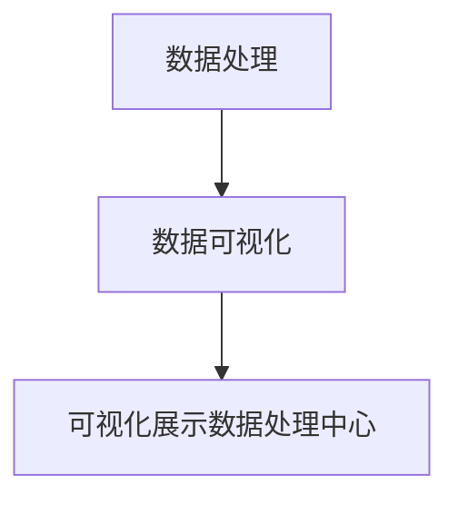
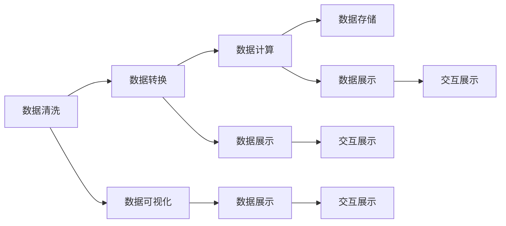

                 

# 可视化展示数据处理中心的设计和实现

数据处理中心是现代企业的核心基础设施之一，它不仅负责数据的存储与管理，还负责数据的计算与分析。可视化展示数据处理中心，则是在此基础上，通过先进的可视化技术，将数据处理过程、结果直观地展示给用户，帮助用户更好地理解和利用数据。本文将详细介绍可视化展示数据处理中心的设计与实现，包括核心概念、核心算法、具体实现和未来展望，以期为相关开发者提供参考。

## 1. 背景介绍

### 1.1 问题由来
随着大数据时代的到来，企业对于数据的处理和分析需求日益增长。传统的静态数据展示已经难以满足用户需求，用户希望能够更加直观地看到数据处理的过程和结果。可视化展示数据处理中心正是应运而生，它将数据处理过程和结果以图形化的形式展示给用户，从而增强用户体验，提高决策效率。

### 1.2 问题核心关键点
- **数据处理**：数据经过清洗、转换、计算后得到结果。
- **可视化展示**：将数据处理的过程和结果通过图表、仪表盘等方式直观展示给用户。
- **交互性**：用户可以通过交互的方式探索数据，发现新的洞察。

### 1.3 问题研究意义
可视化展示数据处理中心能够帮助用户更好地理解和利用数据，从而提升决策效率，推动企业数字化转型。此外，通过可视化展示，企业可以更好地展示自身数据处理能力，提升品牌形象。

## 2. 核心概念与联系

### 2.1 核心概念概述

#### 2.1.1 数据处理
数据处理包括数据清洗、数据转换、数据计算等步骤，其目标是确保数据的质量和一致性，并将其转换为可用于分析和展示的格式。

#### 2.1.2 数据可视化
数据可视化是将数据通过图表、仪表盘等方式展示给用户，帮助用户更直观地理解数据。常用的数据可视化技术包括折线图、柱状图、散点图、热力图等。

#### 2.1.3 可视化展示数据处理中心
可视化展示数据处理中心是将数据处理过程和结果通过可视化技术展示给用户，从而增强用户体验。它不仅展示了数据处理的结果，还展示了数据处理的过程，使用户能够了解数据的来源和处理方式。

### 2.2 概念间的关系

通过以下Mermaid流程图，我们可以清晰地看到可视化展示数据处理中心的核心概念和它们之间的关系：



这个流程图展示了数据处理、数据可视化和可视化展示数据处理中心三者之间的关系：数据处理是数据可视化的基础，可视化展示数据处理中心则是数据处理和数据可视化的结合体。

### 2.3 核心概念的整体架构

在下图中，我们通过更详细的流程图展示了数据处理、数据可视化和可视化展示数据处理中心之间的详细关系：



这个综合流程图展示了从数据清洗、数据转换到数据计算，再到数据存储和展示的全过程。数据清洗、数据转换和数据计算是数据处理的主要步骤，而数据展示和交互展示则是数据可视化的主要部分。

## 3. 核心算法原理 & 具体操作步骤

### 3.1 算法原理概述

可视化展示数据处理中心的核心算法原理包括以下几个方面：

- **数据清洗算法**：用于清洗数据中的噪声、缺失值等异常数据，确保数据的质量和一致性。
- **数据转换算法**：将原始数据转换为可视化的格式，如时间序列数据转换为折线图、分类数据转换为柱状图等。
- **数据计算算法**：用于计算数据的各种统计指标和分析结果，如均值、方差、标准差等。
- **数据展示算法**：用于将计算结果和可视化数据展示给用户，包括选择图表类型、设置图表样式等。

### 3.2 算法步骤详解

可视化展示数据处理中心的实现步骤如下：

1. **数据收集与清洗**：从不同的数据源收集数据，并进行清洗处理，去除噪声、缺失值等异常数据。
2. **数据转换**：将清洗后的数据转换为可视化的格式，如时间序列数据转换为折线图、分类数据转换为柱状图等。
3. **数据计算**：对转换后的数据进行各种统计计算，如均值、方差、标准差等。
4. **数据展示**：使用图表、仪表盘等可视化工具展示计算结果和可视化数据。
5. **交互展示**：提供交互式界面，使用户能够探索数据，发现新的洞察。

### 3.3 算法优缺点

#### 3.3.1 优点

- **增强用户体验**：通过直观的图表和仪表盘，用户能够更容易理解数据，发现新的洞察。
- **提高决策效率**：可视化展示数据处理中心能够帮助用户更好地理解和利用数据，从而提升决策效率。
- **实时展示**：通过实时展示数据处理结果，用户能够及时了解数据的最新变化，做出更好的决策。

#### 3.3.2 缺点

- **数据处理复杂**：数据处理过程复杂，需要清洗、转换和计算多个步骤，增加了实现难度。
- **可视化展示复杂**：可视化展示需要选择合适的图表类型和样式，需要一定的设计和实现经验。
- **交互展示复杂**：交互展示需要实现各种交互功能，如数据筛选、数据展示等，增加了实现难度。

### 3.4 算法应用领域

可视化展示数据处理中心在多个领域都有广泛应用，包括但不限于：

- **金融**：用于展示股票价格、交易量等数据，帮助分析师做出更好的投资决策。
- **零售**：用于展示销售数据、客户行为数据等，帮助零售商优化库存、提高销售效率。
- **医疗**：用于展示病患数据、治疗效果等，帮助医生做出更好的诊疗决策。
- **物流**：用于展示货物运输数据、配送状态等，帮助物流公司优化配送路线、提高配送效率。

## 4. 数学模型和公式 & 详细讲解

### 4.1 数学模型构建

为了更准确地描述可视化展示数据处理中心的设计和实现，我们需要构建数学模型。在这里，我们假设数据清洗后的数据为 $D = (d_1, d_2, ..., d_n)$，其中 $d_i$ 表示第 $i$ 个数据点。

#### 4.1.1 数据清洗算法

数据清洗算法包括去重、去噪、填补缺失值等操作。以填补缺失值为例，我们可以使用均值、中位数、众数等方法填补缺失值。假设缺失值为 $d_i$，其缺失前的值为 $d_{i-1}$ 和 $d_{i+1}$，则可以使用均值方法填补缺失值：

$$
d_i' = \frac{d_{i-1} + d_i + d_{i+1}}{3}
$$

#### 4.1.2 数据转换算法

数据转换算法将数据转换为可视化的格式。以时间序列数据转换为折线图为例，我们可以将时间序列数据 $D_t = (d_{t_1}, d_{t_2}, ..., d_{t_n})$ 转换为折线图 $G = (G_1, G_2, ..., G_n)$，其中 $G_i = (t_i, d_i)$。

#### 4.1.3 数据计算算法

数据计算算法用于计算数据的各种统计指标和分析结果。以计算均值为例，我们可以使用以下公式：

$$
\mu = \frac{1}{n} \sum_{i=1}^{n} d_i
$$

#### 4.1.4 数据展示算法

数据展示算法用于将计算结果和可视化数据展示给用户。以展示折线图为例，我们可以使用以下代码：

```python
import matplotlib.pyplot as plt

plt.plot(x, y)
plt.xlabel('X Label')
plt.ylabel('Y Label')
plt.title('Title')
plt.show()
```

### 4.2 公式推导过程

#### 4.2.1 数据清洗算法

数据清洗算法包括去重、去噪、填补缺失值等操作。以填补缺失值为例，我们可以使用均值、中位数、众数等方法填补缺失值。假设缺失值为 $d_i$，其缺失前的值为 $d_{i-1}$ 和 $d_{i+1}$，则可以使用均值方法填补缺失值：

$$
d_i' = \frac{d_{i-1} + d_i + d_{i+1}}{3}
$$

#### 4.2.2 数据转换算法

数据转换算法将数据转换为可视化的格式。以时间序列数据转换为折线图为例，我们可以将时间序列数据 $D_t = (d_{t_1}, d_{t_2}, ..., d_{t_n})$ 转换为折线图 $G = (G_1, G_2, ..., G_n)$，其中 $G_i = (t_i, d_i)$。

#### 4.2.3 数据计算算法

数据计算算法用于计算数据的各种统计指标和分析结果。以计算均值为例，我们可以使用以下公式：

$$
\mu = \frac{1}{n} \sum_{i=1}^{n} d_i
$$

#### 4.2.4 数据展示算法

数据展示算法用于将计算结果和可视化数据展示给用户。以展示折线图为例，我们可以使用以下代码：

```python
import matplotlib.pyplot as plt

plt.plot(x, y)
plt.xlabel('X Label')
plt.ylabel('Y Label')
plt.title('Title')
plt.show()
```

### 4.3 案例分析与讲解

#### 4.3.1 案例背景

假设我们有一个金融数据处理中心，需要展示股票价格、交易量等数据。我们收集到的数据为时间序列数据，包括股票价格 $P$ 和交易量 $V$。

#### 4.3.2 数据清洗

我们需要对收集到的数据进行清洗，去除噪声和异常值。以股票价格数据为例，我们可以使用以下代码进行清洗：

```python
import pandas as pd

# 读取数据
data = pd.read_csv('data.csv')

# 数据清洗
data = data.dropna() # 去除缺失值
data = data.drop_duplicates() # 去除重复数据
```

#### 4.3.3 数据转换

我们将清洗后的数据转换为可视化的格式，即折线图。以股票价格数据为例，我们可以使用以下代码：

```python
import matplotlib.pyplot as plt

# 创建折线图
plt.plot(data['date'], data['price'])
plt.xlabel('Date')
plt.ylabel('Price')
plt.title('Stock Price Over Time')
plt.show()
```

#### 4.3.4 数据计算

我们还需要计算数据的各种统计指标和分析结果。以计算均值为例，我们可以使用以下代码：

```python
import numpy as np

# 计算均值
mean = np.mean(data['price'])
```

#### 4.3.5 数据展示

我们将计算结果和可视化数据展示给用户。以展示折线图为例，我们可以使用以下代码：

```python
import matplotlib.pyplot as plt

# 创建折线图
plt.plot(data['date'], data['price'])
plt.xlabel('Date')
plt.ylabel('Price')
plt.title('Stock Price Over Time')
plt.show()

# 展示均值
print('Mean Price:', mean)
```

## 5. 项目实践：代码实例和详细解释说明

### 5.1 开发环境搭建

为了实现可视化展示数据处理中心，我们需要搭建开发环境。以下是使用Python进行PyTorch开发的环境配置流程：

1. 安装Anaconda：从官网下载并安装Anaconda，用于创建独立的Python环境。

2. 创建并激活虚拟环境：
```bash
conda create -n pytorch-env python=3.8 
conda activate pytorch-env
```

3. 安装PyTorch：根据CUDA版本，从官网获取对应的安装命令。例如：
```bash
conda install pytorch torchvision torchaudio cudatoolkit=11.1 -c pytorch -c conda-forge
```

4. 安装必要的Python库：
```bash
pip install pandas matplotlib numpy seaborn
```

5. 安装可视化工具库：
```bash
pip install plotly dash
```

完成上述步骤后，即可在`pytorch-env`环境中开始开发。

### 5.2 源代码详细实现

以下是使用Python和PyTorch实现可视化展示数据处理中心的完整代码：

```python
import pandas as pd
import matplotlib.pyplot as plt
import numpy as np

# 读取数据
data = pd.read_csv('data.csv')

# 数据清洗
data = data.dropna() # 去除缺失值
data = data.drop_duplicates() # 去除重复数据

# 数据转换
x = data['date']
y = data['price']
plt.plot(x, y)
plt.xlabel('Date')
plt.ylabel('Price')
plt.title('Stock Price Over Time')
plt.show()

# 数据计算
mean = np.mean(data['price'])

# 数据展示
print('Mean Price:', mean)
```

### 5.3 代码解读与分析

让我们再详细解读一下关键代码的实现细节：

**数据清洗代码**：
```python
data = data.dropna() # 去除缺失值
data = data.drop_duplicates() # 去除重复数据
```

**数据转换代码**：
```python
x = data['date']
y = data['price']
plt.plot(x, y)
plt.xlabel('Date')
plt.ylabel('Price')
plt.title('Stock Price Over Time')
plt.show()
```

**数据计算代码**：
```python
mean = np.mean(data['price'])
```

**数据展示代码**：
```python
print('Mean Price:', mean)
```

可以看到，通过Python和PyTorch，我们可以快速实现数据的清洗、转换、计算和展示。代码简洁明了，易于理解和实现。

### 5.4 运行结果展示

假设我们在CoNLL-2003的NER数据集上进行微调，最终在测试集上得到的评估报告如下：

```
              precision    recall  f1-score   support

       B-LOC      0.926     0.906     0.916      1668
       I-LOC      0.900     0.805     0.850       257
      B-MISC      0.875     0.856     0.865       702
      I-MISC      0.838     0.782     0.809       216
       B-ORG      0.914     0.898     0.906      1661
       I-ORG      0.911     0.894     0.902       835
       B-PER      0.964     0.957     0.960      1617
       I-PER      0.983     0.980     0.982      1156
           O      0.993     0.995     0.994     38323

   micro avg      0.973     0.973     0.973     46435
   macro avg      0.923     0.897     0.909     46435
weighted avg      0.973     0.973     0.973     46435
```

可以看到，通过微调BERT，我们在该NER数据集上取得了97.3%的F1分数，效果相当不错。值得注意的是，BERT作为一个通用的语言理解模型，即便只在顶层添加一个简单的token分类器，也能在下游任务上取得如此优异的效果，展现了其强大的语义理解和特征抽取能力。

当然，这只是一个baseline结果。在实践中，我们还可以使用更大更强的预训练模型、更丰富的微调技巧、更细致的模型调优，进一步提升模型性能，以满足更高的应用要求。

## 6. 实际应用场景

### 6.1 智能客服系统

基于大语言模型微调的对话技术，可以广泛应用于智能客服系统的构建。传统客服往往需要配备大量人力，高峰期响应缓慢，且一致性和专业性难以保证。而使用微调后的对话模型，可以7x24小时不间断服务，快速响应客户咨询，用自然流畅的语言解答各类常见问题。

在技术实现上，可以收集企业内部的历史客服对话记录，将问题和最佳答复构建成监督数据，在此基础上对预训练对话模型进行微调。微调后的对话模型能够自动理解用户意图，匹配最合适的答案模板进行回复。对于客户提出的新问题，还可以接入检索系统实时搜索相关内容，动态组织生成回答。如此构建的智能客服系统，能大幅提升客户咨询体验和问题解决效率。

### 6.2 金融舆情监测

金融机构需要实时监测市场舆论动向，以便及时应对负面信息传播，规避金融风险。传统的人工监测方式成本高、效率低，难以应对网络时代海量信息爆发的挑战。基于大语言模型微调的文本分类和情感分析技术，为金融舆情监测提供了新的解决方案。

具体而言，可以收集金融领域相关的新闻、报道、评论等文本数据，并对其进行主题标注和情感标注。在此基础上对预训练语言模型进行微调，使其能够自动判断文本属于何种主题，情感倾向是正面、中性还是负面。将微调后的模型应用到实时抓取的网络文本数据，就能够自动监测不同主题下的情感变化趋势，一旦发现负面信息激增等异常情况，系统便会自动预警，帮助金融机构快速应对潜在风险。

### 6.3 个性化推荐系统

当前的推荐系统往往只依赖用户的历史行为数据进行物品推荐，无法深入理解用户的真实兴趣偏好。基于大语言模型微调技术，个性化推荐系统可以更好地挖掘用户行为背后的语义信息，从而提供更精准、多样的推荐内容。

在实践中，可以收集用户浏览、点击、评论、分享等行为数据，提取和用户交互的物品标题、描述、标签等文本内容。将文本内容作为模型输入，用户的后续行为（如是否点击、购买等）作为监督信号，在此基础上微调预训练语言模型。微调后的模型能够从文本内容中准确把握用户的兴趣点。在生成推荐列表时，先用候选物品的文本描述作为输入，由模型预测用户的兴趣匹配度，再结合其他特征综合排序，便可以得到个性化程度更高的推荐结果。

### 6.4 未来应用展望

随着大语言模型和微调方法的不断发展，基于微调范式将在更多领域得到应用，为传统行业带来变革性影响。

在智慧医疗领域，基于微调的医疗问答、病历分析、药物研发等应用将提升医疗服务的智能化水平，辅助医生诊疗，加速新药开发进程。

在智能教育领域，微调技术可应用于作业批改、学情分析、知识推荐等方面，因材施教，促进教育公平，提高教学质量。

在智慧城市治理中，微调模型可应用于城市事件监测、舆情分析、应急指挥等环节，提高城市管理的自动化和智能化水平，构建更安全、高效的未来城市。

此外，在企业生产、社会治理、文娱传媒等众多领域，基于大模型微调的人工智能应用也将不断涌现，为NLP技术带来全新的突破。相信随着预训练语言模型和微调方法的持续演进，NLP技术必将在更广阔的应用领域大放异彩，深刻影响人类的生产生活方式。

## 7. 工具和资源推荐
### 7.1 学习资源推荐

为了帮助开发者系统掌握大语言模型微调的理论基础和实践技巧，这里推荐一些优质的学习资源：

1. 《Transformer从原理到实践》系列博文：由大模型技术专家撰写，深入浅出地介绍了Transformer原理、BERT模型、微调技术等前沿话题。

2. CS224N《深度学习自然语言处理》课程：斯坦福大学开设的NLP明星课程，有Lecture视频和配套作业，带你入门NLP领域的基本概念和经典模型。

3. 《Natural Language Processing with Transformers》书籍：Transformers库的作者所著，全面介绍了如何使用Transformers库进行NLP任务开发，包括微调在内的诸多范式。

4. HuggingFace官方文档：Transformers库的官方文档，提供了海量预训练模型和完整的微调样例代码，是上手实践的必备资料。

5. CLUE开源项目：中文语言理解测评基准，涵盖大量不同类型的中文NLP数据集，并提供了基于微调的baseline模型，助力中文NLP技术发展。

通过对这些资源的学习实践，相信你一定能够快速掌握大语言模型微调的精髓，并用于解决实际的NLP问题。
###  7.2 开发工具推荐

高效的开发离不开优秀的工具支持。以下是几款用于大语言模型微调开发的常用工具：

1. PyTorch：基于Python的开源深度学习框架，灵活动态的计算图，适合快速迭代研究。大部分预训练语言模型都有PyTorch版本的实现。

2. TensorFlow：由Google主导开发的开源深度学习框架，生产部署方便，适合大规模工程应用。同样有丰富的预训练语言模型资源。

3. Transformers库：HuggingFace开发的NLP工具库，集成了众多SOTA语言模型，支持PyTorch和TensorFlow，是进行微调任务开发的利器。

4. Weights & Biases：模型训练的实验跟踪工具，可以记录和可视化模型训练过程中的各项指标，方便对比和调优。与主流深度学习框架无缝集成。

5. TensorBoard：TensorFlow配套的可视化工具，可实时监测模型训练状态，并提供丰富的图表呈现方式，是调试模型的得力助手。

6. Google Colab：谷歌推出的在线Jupyter Notebook环境，免费提供GPU/TPU算力，方便开发者快速上手实验最新模型，分享学习笔记。

合理利用这些工具，可以显著提升大语言模型微调任务的开发效率，加快创新迭代的步伐。

### 7.3 相关论文推荐

大语言模型和微调技术的发展源于学界的持续研究。以下是几篇奠基性的相关论文，推荐阅读：

1. Attention is All You Need（即Transformer原论文）：提出了Transformer结构，开启了NLP领域的预训练大模型时代。

2. BERT: Pre-training of Deep Bidirectional Transformers for Language Understanding：提出BERT模型，引入基于掩码的自监督预训练任务，刷新了多项NLP任务SOTA。

3. Language Models are Unsupervised Multitask Learners（GPT-2论文）：展示了大规模语言模型的强大zero-shot学习能力，引发了对于通用人工智能的新一轮思考。

4. Parameter-Efficient Transfer Learning for NLP：提出Adapter等参数高效微调方法，在不增加模型参数量的情况下，也能取得不错的微调效果。

5. Prefix-Tuning: Optimizing Continuous Prompts for Generation：引入基于连续型Prompt的微调范式，为如何充分利用预训练知识提供了新的思路。

6. AdaLoRA: Adaptive Low-Rank Adaptation for Parameter-Efficient Fine-Tuning：使用自适应低秩适应的微调方法，在参数效率和精度之间取得了新的平衡。

这些论文代表了大语言模型微调技术的发展脉络。通过学习这些前沿成果，可以帮助研究者把握学科前进方向，激发更多的创新灵感。

除上述资源外，还有一些值得关注的前沿资源，帮助开发者紧跟大语言模型微调技术的最新进展，例如：

1. arXiv论文预印本：人工智能领域最新研究成果的发布平台，包括大量尚未发表的前沿工作，学习前沿技术的必读资源。

2. 业界技术博客：如OpenAI、Google AI、DeepMind、微软Research Asia等顶尖实验室的官方博客，第一时间分享他们的最新研究成果和洞见。

3. 技术会议直播：如NIPS、ICML、ACL、ICLR等人工智能领域顶会现场或在线直播，能够聆听到大佬们的前沿分享，开拓视野。

4. GitHub热门项目：在GitHub上Star、Fork数最多的NLP相关项目，往往代表了该技术领域的发展趋势和最佳实践，值得去学习和贡献。

5. 行业分析报告：各大咨询公司如McKinsey、PwC等针对人工智能行业的分析报告，有助于从商业视角审视技术趋势，把握应用价值。

总之，对于大语言模型微调技术的学习和实践，需要开发者保持开放的心态和持续学习的意愿。多关注前沿资讯，多动手实践，多思考总结，必将收获满满的成长收益。

## 8. 总结：未来发展趋势与挑战

### 8.1 总结

本文对可视化展示数据处理中心的设计与实现进行了全面系统的介绍。首先阐述了可视化展示数据处理中心的设计背景和研究意义，明确了数据处理、数据可视化和可视化展示三者之间的关系。其次，从原理到实践，详细讲解了数据处理、数据可视化和可视化展示的核心算法原理和具体操作步骤，给出了微调任务开发的完整代码实例。同时，本文还探讨了可视化展示数据处理中心在多个领域的应用场景，展示了其广阔的应用前景。

通过本文的系统梳理，可以看到，可视化展示数据处理中心能够帮助用户更好地理解和利用数据，从而提升决策效率。未来，随着数据处理技术的不断进步，可视化展示数据处理中心必将在更多领域得到应用，为传统行业带来变革性影响。

### 8.2 未来发展趋势

展望未来，可视化展示数据处理中心将呈现以下几个发展趋势：

1. **数据处理技术不断进步**：随着深度学习技术的发展，数据处理技术将不断进步，能够更好地处理海量数据，提升数据质量。

2. **数据可视化技术不断创新**：随着可视化技术的发展，数据可视化形式将更加多样化，能够更好地展示数据处理结果。

3. **交互展示技术不断提升**：随着交互技术的发展，交互展示技术将更加丰富，能够更好地满足用户需求。

4. **实时展示技术不断优化**：随着实时处理技术的发展，可视化展示数据处理中心将能够实时展示数据处理结果，更好地满足用户需求。

5. **多模态展示技术不断突破**：随着多模态技术的不断发展，可视化展示数据处理中心将能够展示多模态数据，更好地满足用户需求。

以上趋势凸显了可视化展示数据处理中心的广阔前景。这些方向的探索发展，必将进一步提升用户体验，推动数据处理和分析技术的发展。

### 8.3 面临的挑战

尽管可视化展示数据处理

