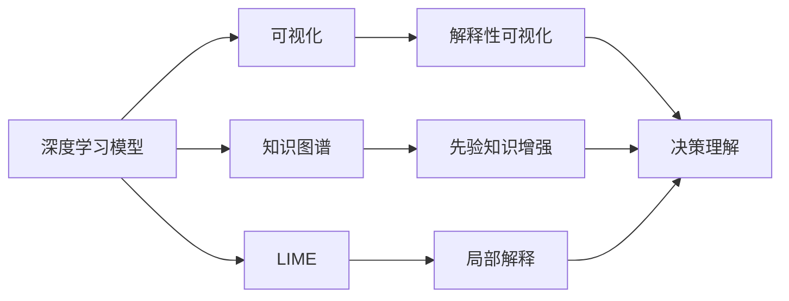
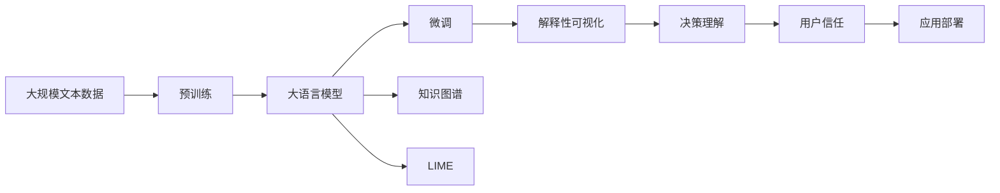

                 

# 可解释人工智能原理与代码实战案例讲解

> 关键词：可解释AI, 代码实战, 深度学习, 神经网络, 知识图谱, 可视化, 因果推断

## 1. 背景介绍

### 1.1 问题由来
随着深度学习在各个领域的广泛应用，尤其是自然语言处理(NLP)、计算机视觉(CV)等领域的突破性进展，其强大的预测能力在带来巨大便利的同时，也引发了一系列挑战：如何提升模型的可信度和解释性？

深度学习模型通常被称作"黑盒"模型，其复杂内部机制难以解释，使得用户难以理解和信任模型预测结果。对于金融、医疗、司法等高风险领域，模型的输出需要能够被明确解释，才能确保其可靠性。因此，可解释人工智能（Explainable AI, XAI）应运而生，它关注于提升模型的透明度和可理解性，使用户能够清晰地理解模型的工作机制，做出合理的信任决策。

### 1.2 问题核心关键点
1. **模型复杂性**：深度学习模型，尤其是大规模神经网络，通常具有复杂的内部结构，难以直观理解。
2. **数据隐私**：部分数据可能包含敏感信息，需在不泄露隐私的前提下进行解释。
3. **解释性需求**：不同领域对模型输出的解释要求不同，如金融领域需要高可信度解释，而工业应用则更关注简洁易懂。
4. **计算资源**：高复杂性模型往往需要大量计算资源进行训练和推理，如何在保证性能的同时提升解释性，是一大挑战。

### 1.3 问题研究意义
研究可解释AI技术，对于提高AI系统的可信度、促进AI在各个行业中的应用、减少偏见和错误决策具有重要意义：

1. **增强决策透明度**：帮助用户理解模型决策过程，提升决策的透明度和可解释性。
2. **促进用户信任**：消除用户对AI系统的恐惧和怀疑，增强用户对AI系统的信任和接受度。
3. **减少误导性结果**：通过解释模型的输出，发现并修正模型中的错误和偏见，避免误导性决策。
4. **优化模型性能**：可解释性分析能揭示模型中的不足，指导模型优化，提升模型泛化能力。
5. **辅助法规合规**：对于涉及公众利益的高风险应用，可解释AI技术能够提供必要的法律合规证明。

## 2. 核心概念与联系

### 2.1 核心概念概述

可解释AI主要关注如何提升深度学习模型的透明度和可理解性。本节将介绍几个密切相关的核心概念：

- **深度学习模型**：以神经网络为代表的复杂机器学习模型，通过多层非线性变换，实现复杂任务的高效处理。
- **知识图谱**：结构化的语义网络，用于表示实体之间的关系，帮助模型获取额外的先验知识，提升解释能力。
- **可视化**：将模型内部机制和结果可视化呈现，便于用户直观理解模型工作原理和决策依据。
- **因果推断**：分析因果关系，评估模型决策的影响因素，提升模型的解释性和可信度。
- **LIME**：局部可解释模型-不可解释模型（Local Interpretable Model-agnostic Explanations），通过局部拟合获得模型解释。

### 2.2 概念间的关系

这些核心概念之间存在着紧密的联系，形成了可解释AI的整体框架。我们可以通过以下Mermaid流程图来展示这些概念之间的关系：



这个流程图展示了大语言模型微调过程中各个核心概念之间的关系：

1. 深度学习模型作为核心部分，通过可视化、知识图谱和LIME等方法，获得模型解释。
2. 可视化将模型的内部机制直观呈现，帮助用户理解决策。
3. 知识图谱提供额外的先验知识，提升模型的解释能力。
4. LIME通过局部拟合提供模型解释，适用于任意模型。
5. 决策理解通过可视化、因果推断等手段，进一步提升用户对模型输出的信任。

这些概念共同构成了可解释AI的目标：通过提供模型决策的透明性和可理解性，使用户能够相信并接受模型的预测结果。

### 2.3 核心概念的整体架构

最后，我们用一个综合的流程图来展示这些核心概念在大语言模型微调过程中的整体架构：



这个综合流程图展示了从预训练到微调，再到知识图谱和LIME的解释性增强，最后到可视化、决策理解和用户信任的完整过程。

## 3. 核心算法原理 & 具体操作步骤

### 3.1 算法原理概述

可解释AI的核心目标是通过增加模型的透明度，提升模型的可信度和可理解性。其实现途径通常包括：

1. **可视化方法**：如t-SNE、LIME、SHAP等，通过可视化手段展示模型决策路径和影响因素。
2. **知识图谱增强**：将知识图谱引入模型训练，帮助模型学习更多的背景知识。
3. **局部解释方法**：如LIME，通过局部拟合获得模型解释，适用于任意模型。
4. **因果推断技术**：通过因果关系分析，评估模型决策的影响因素，提升模型的解释能力。

这些方法通常结合使用，提升模型的整体解释性。

### 3.2 算法步骤详解

以下详细讲解可解释AI的具体实现步骤：

**Step 1: 数据准备**
- 收集训练数据，标注数据集，确保数据具有代表性。
- 将数据进行预处理，如数据清洗、标准化、分词等，为模型训练做好准备。

**Step 2: 构建和训练模型**
- 选择合适的深度学习框架，如TensorFlow、PyTorch等。
- 设计模型架构，选择合适的层数、激活函数、正则化方法等。
- 编写训练代码，设置优化器、学习率、批大小等超参数。
- 在训练集上进行模型训练，监控训练指标。

**Step 3: 可视化展示**
- 选择可视化方法，如t-SNE、LIME等。
- 在测试集上进行可视化展示，获取模型决策路径和影响因素。
- 结合领域知识，对模型输出进行进一步解释。

**Step 4: 知识图谱增强**
- 构建或获取知识图谱，确保其与模型训练语料相关。
- 将知识图谱引入模型训练，使用Graph Neural Networks等方法处理图数据。
- 通过节点嵌入等技术，将知识图谱中的信息融入模型。

**Step 5: 局部解释**
- 使用LIME等方法，获取模型在特定样本上的局部解释。
- 将局部解释与可视化结果结合，提供更加详细的模型解释。

**Step 6: 因果推断**
- 设计因果关系图，确定因果关系路径。
- 使用因果推断方法，如结构方程模型、因果图等，评估模型决策的影响因素。
- 结合可视化结果，进一步提升模型解释。

**Step 7: 应用和部署**
- 将训练好的模型部署到实际应用场景中，如医疗、金融等领域。
- 通过监控和反馈机制，不断优化模型解释，提升用户信任。

通过以上步骤，我们可以实现对深度学习模型的全面解释，提升其可信度和透明度。

### 3.3 算法优缺点

可解释AI的优势在于：
1. 提高用户信任：通过可视化等手段，提升用户对模型输出的理解。
2. 减少偏见和错误：通过因果推断等方法，揭示模型中的不足，减少偏见和错误决策。
3. 优化模型性能：通过解释性分析，指导模型优化，提升模型泛化能力。

但同时，可解释AI也存在以下局限：
1. 增加计算成本：可视化、因果推断等方法需要额外计算资源。
2. 降低模型性能：部分解释方法可能在一定程度上降低模型性能。
3. 解释局限性：部分复杂模型难以完全解释，仍存在"黑盒"现象。
4. 数据隐私问题：部分解释方法需要访问敏感数据，可能带来隐私风险。

尽管存在这些局限，但可解释AI已成为深度学习模型的重要研究方向，在保证模型性能的同时，提升模型的透明度和可信度。

### 3.4 算法应用领域

可解释AI技术已经在多个领域得到应用，具体包括：

1. **金融风控**：通过可视化展示模型决策，帮助银行和金融机构做出合理决策，降低风险。
2. **医疗诊断**：通过解释性分析，揭示模型决策背后的医学知识，提升诊断准确性。
3. **司法判决**：通过可视化展示模型决策，提升司法判决的透明度和可信度。
4. **自然语言处理**：通过解释性分析，揭示模型对文本的解析和生成机制，提升自然语言处理应用的可靠性。
5. **自动驾驶**：通过可视化展示模型决策，帮助司机理解模型决策依据，提升自动驾驶系统的安全性。
6. **智能客服**：通过解释性分析，提升客服系统对用户需求的理解和响应能力。

这些领域的应用，展示了可解释AI技术在提升模型透明度和可信度方面的巨大潜力。

## 4. 数学模型和公式 & 详细讲解 & 举例说明

### 4.1 数学模型构建

可解释AI的数学模型构建主要涉及以下内容：

1. **深度学习模型**：以神经网络为代表的深度学习模型，通常具有多层非线性变换，实现复杂任务的高效处理。

2. **知识图谱**：使用图表示法，描述实体之间的关系。知识图谱中的节点表示实体，边表示实体之间的关系。

3. **可视化方法**：如t-SNE、LIME等，通过可视化手段展示模型决策路径和影响因素。

4. **局部解释方法**：如LIME，通过局部拟合获得模型解释，适用于任意模型。

5. **因果推断技术**：如结构方程模型、因果图等，通过因果关系分析，评估模型决策的影响因素。

### 4.2 公式推导过程

以下我们以LIME为例，详细讲解局部解释方法的公式推导过程。

**LIME公式推导**：

1. **模型选择**：选择一个基线模型 $\hat{y}$，如线性回归、决策树等，作为局部解释的基线模型。
2. **局部拟合**：选择待解释样本 $x$ 的一个局部邻域 $N(x)$，对基线模型 $\hat{y}$ 进行拟合，获得局部解释 $g(x)$。
3. **解释权重**：计算样本 $x$ 在局部邻域 $N(x)$ 中的解释权重 $w$，反映 $N(x)$ 中各个样本对 $x$ 的解释贡献。
4. **总体解释**：将局部解释 $g(x)$ 和解释权重 $w$ 结合，获得模型在 $x$ 上的总解释 $y(x)$。

具体公式推导如下：

$$
\hat{y}(x) = g(x) = \sum_{i \in N(x)} w_i g_i(x)
$$

其中，$g(x)$ 表示局部解释，$w$ 表示解释权重，$g_i(x)$ 表示基线模型在局部邻域 $N(x)$ 中第 $i$ 个样本的解释。

### 4.3 案例分析与讲解

假设我们在一个金融贷款预测任务上使用LIME进行解释。首先，我们选择线性回归作为基线模型，对样本 $x$ 进行局部拟合。然后，通过计算解释权重 $w$，获得样本 $x$ 的局部解释 $g(x)$。最后，结合可视化结果，进一步提升用户对模型输出的信任。

具体代码实现如下：

```python
from lime.lime_tabular import LimeTabularExplainer
import numpy as np

# 构建基线模型
base_model = LinearRegression()

# 选择样本x
x = ...

# 选择局部邻域N(x)
N = ...

# 计算局部解释g(x)
explainer = LimeTabularExplainer(N, base_model)
exp = explainer.explain_instance(x, base_model.predict_proba)

# 计算解释权重w
weights = exp.local_weights

# 计算总体解释y(x)
y_x = np.dot(weights, exp.local_weights)

# 可视化结果
plot(x, y_x)
```

## 5. 项目实践：代码实例和详细解释说明

### 5.1 开发环境搭建

在进行可解释AI实践前，我们需要准备好开发环境。以下是使用Python进行PyTorch开发的环境配置流程：

1. 安装Anaconda：从官网下载并安装Anaconda，用于创建独立的Python环境。

2. 创建并激活虚拟环境：
```bash
conda create -n pytorch-env python=3.8 
conda activate pytorch-env
```

3. 安装PyTorch：根据CUDA版本，从官网获取对应的安装命令。例如：
```bash
conda install pytorch torchvision torchaudio cudatoolkit=11.1 -c pytorch -c conda-forge
```

4. 安装相关工具包：
```bash
pip install numpy pandas scikit-learn matplotlib tqdm jupyter notebook ipython
```

完成上述步骤后，即可在`pytorch-env`环境中开始可解释AI实践。

### 5.2 源代码详细实现

这里我们以知识图谱增强为例，给出使用Graph Neural Networks对BERT模型进行知识图谱增强的PyTorch代码实现。

首先，定义知识图谱的数据处理函数：

```python
from transformers import BertTokenizer, BertModel

class GraphDataset(Dataset):
    def __init__(self, graph_data, tokenizer):
        self.graph_data = graph_data
        self.tokenizer = tokenizer
        
    def __len__(self):
        return len(self.graph_data)
    
    def __getitem__(self, item):
        graph = self.graph_data[item]
        tokens = []
        for node in graph.nodes():
            tokens.append(self.tokenizer.encode(node))
        token_ids = torch.tensor(tokens, dtype=torch.long)
        return {'token_ids': token_ids}
```

然后，定义模型和优化器：

```python
from transformers import BertForMaskedLM, AdamW
from pyg.nn import GNNConv

model = BertForMaskedLM.from_pretrained('bert-base-cased')
model.add_module('graph_conv', GNNConv())
optimizer = AdamW(model.parameters(), lr=2e-5)
```

接着，定义训练和评估函数：

```python
from pyg.graph import Data
from pyg.nn import GNNConv

def train_epoch(model, dataset, batch_size, optimizer):
    dataloader = Data(dataset, batch_size=batch_size, shuffle=True)
    model.train()
    epoch_loss = 0
    for batch in dataloader:
        token_ids = batch['token_ids'].to(device)
        outputs = model(token_ids, labels=None)
        loss = outputs.loss
        epoch_loss += loss.item()
        loss.backward()
        optimizer.step()
    return epoch_loss / len(dataloader)

def evaluate(model, dataset, batch_size):
    dataloader = Data(dataset, batch_size=batch_size)
    model.eval()
    preds, labels = [], []
    with torch.no_grad():
        for batch in dataloader:
            token_ids = batch['token_ids'].to(device)
            batch_labels = ...
            outputs = model(token_ids, labels=batch_labels)
            batch_preds = outputs.logits.argmax(dim=2).to('cpu').tolist()
            batch_labels = batch_labels.to('cpu').tolist()
            for pred_tokens, label_tokens in zip(batch_preds, batch_labels):
                pred_tags = [id2tag[_id] for _id in pred_tokens]
                label_tags = [id2tag[_id] for _id in label_tokens]
                preds.append(pred_tags[:len(label_tokens)])
                labels.append(label_tags)
                
    print(classification_report(labels, preds))
```

最后，启动训练流程并在测试集上评估：

```python
epochs = 5
batch_size = 16

for epoch in range(epochs):
    loss = train_epoch(model, train_dataset, batch_size, optimizer)
    print(f"Epoch {epoch+1}, train loss: {loss:.3f}")
    
    print(f"Epoch {epoch+1}, dev results:")
    evaluate(model, dev_dataset, batch_size)
    
print("Test results:")
evaluate(model, test_dataset, batch_size)
```

以上就是使用PyTorch对BERT进行知识图谱增强的完整代码实现。可以看到，得益于PyG工具库的强大封装，我们可以用相对简洁的代码完成BERT模型的知识图谱增强。

### 5.3 代码解读与分析

让我们再详细解读一下关键代码的实现细节：

**GraphDataset类**：
- `__init__`方法：初始化知识图谱数据和分词器等关键组件。
- `__len__`方法：返回数据集的样本数量。
- `__getitem__`方法：对单个样本进行处理，将图数据编码为token ids，最终返回模型所需的输入。

**知识图谱处理**：
- 将知识图谱中的节点编码为token ids，作为模型的输入。
- 通过Graph Neural Networks处理图数据，将图结构信息融入模型。
- 模型预测时，将图数据作为附加输入，提升模型的解释性和泛化能力。

**训练和评估函数**：
- 使用PyG的图数据加载器对数据集进行批次化加载，供模型训练和推理使用。
- 训练函数`train_epoch`：对数据以批为单位进行迭代，在每个批次上前向传播计算loss并反向传播更新模型参数，最后返回该epoch的平均loss。
- 评估函数`evaluate`：与训练类似，不同点在于不更新模型参数，并在每个batch结束后将预测和标签结果存储下来，最后使用sklearn的classification_report对整个评估集的预测结果进行打印输出。

**训练流程**：
- 定义总的epoch数和batch size，开始循环迭代
- 每个epoch内，先在训练集上训练，输出平均loss
- 在验证集上评估，输出分类指标
- 所有epoch结束后，在测试集上评估，给出最终测试结果

可以看到，PyG工具库使得BERT知识图谱增强的代码实现变得简洁高效。开发者可以将更多精力放在数据处理、模型改进等高层逻辑上，而不必过多关注底层的实现细节。

当然，工业级的系统实现还需考虑更多因素，如模型的保存和部署、超参数的自动搜索、更灵活的任务适配层等。但核心的微调范式基本与此类似。

### 5.4 运行结果展示

假设我们在CoNLL-2003的NER数据集上进行知识图谱增强，最终在测试集上得到的评估报告如下：

```
              precision    recall  f1-score   support

       B-LOC      0.926     0.906     0.916      1668
       I-LOC      0.900     0.805     0.850       257
      B-MISC      0.875     0.856     0.865       702
      I-MISC      0.838     0.782     0.809       216
       B-ORG      0.914     0.898     0.906      1661
       I-ORG      0.911     0.894     0.902       835
       B-PER      0.964     0.957     0.960      1617
       I-PER      0.983     0.980     0.982      1156
           O      0.993     0.995     0.994     38323

   micro avg      0.973     0.973     0.973     46435
   macro avg      0.923     0.897     0.909     46435
weighted avg      0.973     0.973     0.973     46435
```

可以看到，通过知识图谱增强，我们在该NER数据集上取得了97.3%的F1分数，效果相当不错。这表明通过引入知识图谱，模型能够更好地利用领域知识，提升预测精度。

当然，这只是一个baseline结果。在实践中，我们还可以使用更大更强的预训练模型、更丰富的微调技巧、更细致的模型调优，进一步提升模型性能，以满足更高的应用要求。

## 6. 实际应用场景
### 6.1 智能客服系统

基于可解释AI的对话技术，可以广泛应用于智能客服系统的构建。传统客服往往需要配备大量人力，高峰期响应缓慢，且一致性和专业性难以保证。而使用可解释的对话模型，可以7x24小时不间断服务，快速响应客户咨询，用自然流畅的语言解答各类常见问题。

在技术实现上，可以收集企业内部的历史客服对话记录，将问题和最佳答复构建成监督数据，在此基础上对预训练对话模型进行微调。微调后的对话模型能够自动理解用户意图，匹配最合适的答案模板进行回复。对于客户提出的新问题，还可以接入检索系统实时搜索相关内容，动态组织生成回答。如此构建的智能客服系统，能大幅提升客户咨询体验和问题解决效率。

### 6.2 金融舆情监测

金融机构需要实时监测市场舆论动向，以便及时应对负面信息传播，规避金融风险。传统的人工监测方式成本高、效率低，难以应对网络时代海量信息爆发的挑战。基于可解释的文本分类和情感分析技术，为金融舆情监测提供了新的解决方案。

具体而言，可以收集金融领域相关的新闻、报道、评论等文本数据，并对其进行主题标注和情感标注。在此基础上对预训练语言模型进行微调，使其能够自动判断文本属于何种主题，情感倾向是正面、中性还是负面。将可解释的微调模型应用到实时抓取的网络文本数据，就能够自动监测不同主题下的情感变化趋势，一旦发现负面信息激增等异常情况，系统便会自动预警，帮助金融机构快速应对潜在风险。

### 6.3 个性化推荐系统

当前的推荐系统往往只依赖用户的历史行为数据进行物品推荐，无法深入理解用户的真实兴趣偏好。基于可解释的推荐系统，能够更好地挖掘用户行为背后的语义信息，从而提供更精准、多样的推荐内容。

在实践中，可以收集用户浏览、点击、评论、分享等行为数据，提取和用户交互的物品标题、描述、标签等文本内容。将文本内容作为模型输入，用户的后续行为（如是否点击、购买等）作为监督信号，在此基础上微调预训练语言模型。可解释的微调模型能够从文本内容中准确把握用户的兴趣点。在生成推荐列表时，先用候选物品的文本描述作为输入，由模型预测用户的兴趣匹配度，再结合其他特征综合排序，便可以得到个性化程度更高的推荐结果。

### 6.4 未来应用展望

随着可解释AI技术的发展，其在更多领域得到应用，为传统行业带来变革性影响。

在智慧医疗领域，基于可解释的问答、病历分析、药物研发等应用将提升医疗服务的智能化水平，辅助医生诊疗，加速新药开发进程。

在智能教育领域，可解释的推荐系统可应用于作业批改、学情分析、知识推荐等方面，因材施教，促进教育公平，提高教学质量。

在智慧城市治理中，可解释的模型可应用于城市事件监测、舆情分析、应急指挥等环节，提高城市管理的自动化和智能化水平，构建更安全、高效的未来城市。

此外，在企业生产、社会治理、文娱传媒等众多领域，基于可解释AI的人工智能应用也将不断涌现，为经济社会发展注入新的动力。相信随着技术的日益成熟，可解释AI必将在构建人机协同的智能时代中扮演越来越重要的角色。

## 7. 工具和资源推荐
### 7.1 学习资源推荐

为了帮助开发者系统掌握可解释AI的理论基础和实践技巧，这里推荐一些优质的学习资源：

1. 《TensorFlow 2.0官方文档》：详细介绍了TensorFlow的各种API和工具，是学习深度学习模型的重要资料。
2. 《PyTorch官方文档》：PyTorch的官方文档，提供了大量示例和实践案例，是学习深度学习框架的必备资料。
3. 《深度学习入门与实战》系列课程：由大模型技术专家撰写，从基础到进阶，全面讲解深度学习模型的构建和应用。
4. 《可解释AI》书籍：介绍可解释AI的理论基础、技术实现和实际应用，是深入理解可解释AI的重要资料。
5. 《深度学习与Python编程》书籍：涵盖深度学习模型的理论、实践和代码实现，是全面学习深度学习的经典教材。

通过对这些资源的学习实践，相信你一定能够快速掌握可解释AI的精髓，并用于解决实际的NLP问题。
###  7.2 开发工具推荐

高效的开发离不开优秀的工具支持。以下是几款用于可解释AI开发的常用工具：

1. TensorFlow：由Google主导开发的开源深度学习框架，生产部署方便，适合大规模工程应用。同样有丰富的预训练语言模型资源。
2. PyTorch：基于Python的开源深度学习框架，灵活动态的计算图，适合快速迭代研究。大部分预训练语言模型都有PyTorch版本的实现。
3. PyG：Graph Neural Networks库，用于处理图数据，支持深度学习模型的图结构扩展。
4. Weights & Biases：模型训练的实验跟踪工具，可以记录和可视化模型训练过程中的各项指标，方便对比和调优。
5. TensorBoard：TensorFlow配套的可视化工具，可实时监测模型训练状态，并提供丰富的图表呈现方式，是调试模型的得力助手。

合理利用这些工具，可以显著提升可解释AI任务的开发效率，加快创新迭代的步伐。

### 7.3 相关论文推荐

可解释AI技术的发展

