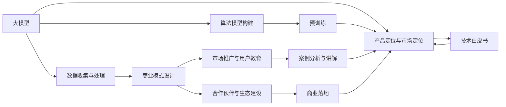

                 

# 商业化变现：大模型创业的命脉

> 关键词：大模型创业、商业化变现、AI技术、市场策略、创业之路、商业落地、人工智能应用

## 1. 背景介绍

### 1.1 问题由来
随着人工智能(AI)技术的飞速发展，大模型成为新一代AI应用的核心驱动力。大模型通过在海量数据上进行预训练，能够学习到丰富的知识，从而在不同领域展现出强大的通用性和适应性。然而，尽管大模型的技术优势明显，但在商业化变现方面，仍然面临诸多挑战。如何从技术到市场，将大模型有效转化为商业价值，成为摆在每一个大模型创业者和AI企业家面前的重要课题。

### 1.2 问题核心关键点
大模型创业的核心在于将技术优势转化为商业模式，实现商业变现。这其中，最关键的是：

1. **产品定位与市场定位**：确定大模型的核心能力、适用场景和目标用户，是成功商业化的基础。
2. **数据收集与处理**：高质量、大规模的数据是训练高质量大模型的前提。
3. **算法模型构建**：选择或研发合适的算法模型，确保其在大规模数据上的训练效果。
4. **商业模式设计**：从免费试用、订阅服务到API调用等，如何制定合理的商业模式，直接关系到收入增长。
5. **市场推广与用户教育**：如何向市场和用户传达大模型的价值，推动市场接受度和用户转化。
6. **合作伙伴与生态建设**：与行业龙头和伙伴深度合作，共同构建生态系统，提升大模型的市场影响力。
7. **用户反馈与持续优化**：持续收集用户反馈，优化模型和服务，保持技术领先地位。

### 1.3 问题研究意义
大模型在自然语言处理(NLP)、计算机视觉(CV)、语音识别等领域的广泛应用，为各行各业带来了革命性的改变。然而，要想将大模型成功商业化，需要深入理解和解决上述核心关键点。掌握商业化变现的命脉，是大模型创业者的必由之路，也是推动AI技术全面应用的关键。

## 2. 核心概念与联系

### 2.1 核心概念概述

为了深入理解大模型创业的商业化变现，我们需要首先梳理几个关键概念及其相互关系：

1. **大模型(大语言模型, LLM)**：以自回归(如GPT)或自编码(如BERT)模型为代表，通过在大规模无标签文本语料上进行预训练，学习通用语言表示的模型。

2. **商业化变现**：指将大模型的技术优势转化为商业收入的过程，包括但不限于产品化、市场推广、收费模式、合作伙伴关系等。

3. **算法模型构建**：指选择合适的算法模型进行训练，确保其能够在大规模数据上获得高质量的输出。

4. **数据收集与处理**：包括数据标注、清洗、预处理等环节，确保数据的准确性和代表性。

5. **商业模式设计**：从免费试用到订阅服务，从API调用到硬件设备，不同的商业模式对大模型的市场策略有着重要的影响。

6. **市场推广与用户教育**：通过市场活动、技术白皮书、案例分析等手段，向市场和用户传达大模型的价值和应用场景。

7. **合作伙伴与生态建设**：与行业内外的合作伙伴共同构建生态系统，提升大模型的市场影响力和用户覆盖面。

这些核心概念构成了大模型创业的完整生态系统，是大模型创业者需要深入理解和掌握的。通过以下Mermaid流程图，我们可以更清晰地理解这些概念之间的逻辑关系：



这个流程图展示了大模型创业过程中，各个核心概念之间的相互关系：

1. **大模型**：从预训练到微调，是商业化变现的基础。
2. **算法模型构建**：选择或研发合适的模型，确保大模型的技术优势。
3. **数据收集与处理**：高质量数据是大模型训练的前提。
4. **商业模式设计**：不同的商业模式影响市场推广和用户转化。
5. **市场推广与用户教育**：向市场和用户传达大模型的价值。
6. **合作伙伴与生态建设**：构建生态系统，提升市场影响力。
7. **产品定位与市场定位**：明确大模型的核心能力和适用场景。

### 2.2 概念间的关系

这些核心概念之间存在着紧密的联系，构成了大模型创业的完整生态系统。以下是几个关键概念之间的关系，通过Mermaid流程图展示：

#### 2.2.1 大模型的训练与商业化


这个流程图展示了从数据收集到商业化变现的完整流程：

1. 大规模数据采集和处理，是训练高质量大模型的前提。
2. 选择合适的算法模型进行训练，确保大模型的技术优势。
3. 在大规模数据上进行预训练和微调，提升大模型的性能。
4. 根据市场需求和用户反馈，设计合理的商业模式。
5. 通过市场推广和用户教育，向市场和用户传达大模型的价值。
6. 与合作伙伴共同构建生态系统，提升大模型的市场影响力。

#### 2.2.2 商业模式与市场推广


这个流程图展示了商业模式设计与市场推广之间的关系：

1. 大模型的训练和微调，是商业模式设计的基础。
2. 设计合理的商业模式，确保商业变现的有效性。
3. 通过市场推广和用户教育，向市场和用户传达大模型的价值。
4. 与合作伙伴共同构建生态系统，提升大模型的市场影响力。
5. 通过案例分析和用户教育，推动商业落地。

## 3. 核心算法原理 & 具体操作步骤
### 3.1 算法原理概述

大模型创业的核心在于将技术优势转化为商业价值，其核心算法原理可以总结如下：

1. **数据预处理与标注**：从原始数据中提取、清洗和标注，确保数据的质量和多样性。
2. **模型选择与构建**：选择合适的算法模型，进行训练和微调，优化模型参数。
3. **商业变现策略**：设计合理的商业模式，推动市场推广和用户转化。
4. **市场推广与用户教育**：通过市场活动、案例分析等方式，向市场和用户传达大模型的价值。
5. **合作伙伴与生态建设**：与行业内外的合作伙伴共同构建生态系统，提升大模型的市场影响力。

### 3.2 算法步骤详解

以下是大模型创业过程中，核心算法步骤的详细介绍：

**Step 1: 数据收集与预处理**

1. **数据采集**：从互联网、企业内部等渠道采集数据，确保数据的多样性和代表性。
2. **数据标注**：对数据进行标注，确保数据的准确性和一致性。
3. **数据清洗**：去除噪声数据和不相关数据，提升数据质量。
4. **数据预处理**：对数据进行标准化、归一化等处理，确保模型训练的稳定性和一致性。

**Step 2: 算法模型构建**

1. **模型选择**：根据应用场景选择合适的算法模型，如BERT、GPT等。
2. **模型训练**：在大规模数据上训练模型，调整模型参数，优化模型性能。
3. **模型微调**：根据具体应用需求进行微调，提升模型的泛化能力和适用性。

**Step 3: 商业模式设计**

1. **收费模式选择**：从免费试用、订阅服务到API调用，选择合适的收费模式。
2. **定价策略制定**：根据市场定位和用户需求，制定合理的定价策略。
3. **商业模式优化**：根据市场反馈和用户需求，不断优化商业模式。

**Step 4: 市场推广与用户教育**

1. **市场推广**：通过线上线下活动、技术白皮书等手段，向市场和用户传达大模型的价值。
2. **用户教育**：通过案例分析、用户反馈等方式，向用户解释大模型的应用场景和优势。
3. **市场策略调整**：根据市场反应和用户反馈，及时调整市场策略。

**Step 5: 合作伙伴与生态建设**

1. **合作伙伴选择**：选择行业内外的合作伙伴，共同构建生态系统。
2. **生态系统建设**：与合作伙伴共同开发应用场景，推动市场应用。
3. **生态系统维护**：持续维护生态系统，提升大模型的市场影响力。

### 3.3 算法优缺点

大模型创业的算法有以下优缺点：

**优点**：

1. **技术优势明显**：大模型具有强大的数据理解和处理能力，能够提升应用场景的性能和效率。
2. **市场潜力巨大**：大模型的应用场景广泛，能够覆盖多个行业和领域，市场潜力巨大。
3. **用户接受度高**：大模型应用场景与用户需求紧密相关，用户接受度高。

**缺点**：

1. **数据需求量大**：大模型的训练需要大规模高质量数据，数据采集和处理成本较高。
2. **算法复杂度高**：大模型的算法模型复杂，训练和微调过程需要大量算力资源。
3. **市场竞争激烈**：大模型领域竞争激烈，需要持续创新和优化才能保持竞争力。

### 3.4 算法应用领域

大模型创业的应用领域非常广泛，主要包括：

1. **自然语言处理(NLP)**：包括文本分类、情感分析、机器翻译等。
2. **计算机视觉(CV)**：包括图像识别、目标检测、视频分析等。
3. **语音识别**：包括语音转文本、语音合成、情感识别等。
4. **医疗健康**：包括医学影像分析、病历分析、药物研发等。
5. **金融服务**：包括信用评分、风险评估、智能投顾等。
6. **智能制造**：包括质量检测、生产优化、设备维护等。
7. **智能交通**：包括智能导航、自动驾驶、交通分析等。
8. **智能家居**：包括语音助手、场景识别、个性化推荐等。

## 4. 数学模型和公式 & 详细讲解  
### 4.1 数学模型构建

大模型创业的数学模型构建，主要涉及以下几个方面：

1. **数据预处理模型**：用于对原始数据进行清洗、标注和预处理。
2. **模型训练模型**：用于训练大模型，优化模型参数。
3. **微调模型**：用于在大模型上微调，提升模型在特定任务上的性能。

### 4.2 公式推导过程

以下是一个简单的数学模型推导示例：

假设有一个二分类任务，输入为 $x$，标签为 $y$，模型为 $M_{\theta}$，其中 $\theta$ 为模型参数。模型的预测为 $\hat{y}=M_{\theta}(x)$。模型的损失函数为交叉熵损失函数：

$$
\ell(M_{\theta}(x),y) = -[y\log \hat{y} + (1-y)\log (1-\hat{y})]
$$

模型的训练目标是最小化损失函数，即：

$$
\min_{\theta} \frac{1}{N} \sum_{i=1}^N \ell(M_{\theta}(x_i),y_i)
$$

其中 $N$ 为训练样本数量。

模型的优化算法通常为梯度下降算法：

$$
\theta_{t+1} = \theta_t - \eta \nabla_{\theta}\ell(M_{\theta}(x),y)
$$

其中 $\eta$ 为学习率。

### 4.3 案例分析与讲解

以BERT模型为例，其预训练过程涉及大规模无标签文本数据的自监督学习。以掩码语言模型(Masked Language Model, MLM)和下一句预测(Next Sentence Prediction, NSP)为代表，BERT模型在预训练过程中学习到丰富的语言知识，包括词向量表示、上下文关系等。在微调过程中，通过添加特定任务适配器，将BERT模型适配到具体的NLP任务上，如文本分类、命名实体识别等。

## 5. 项目实践：代码实例和详细解释说明
### 5.1 开发环境搭建

大模型创业的开发环境搭建，主要涉及以下几个方面：

1. **数据处理环境**：搭建数据处理系统，确保数据的采集、清洗和标注。
2. **模型训练环境**：搭建高性能计算环境，确保模型的训练和微调。
3. **市场推广环境**：搭建市场推广系统，确保市场的宣传和用户教育。

以下是具体的搭建流程：

1. **数据处理环境搭建**：
```bash
# 安装数据处理工具
sudo apt-get install pandas numpy
# 搭建数据标注系统
```

2. **模型训练环境搭建**：
```bash
# 安装深度学习框架
sudo apt-get install tensorflow pytorch
# 搭建高性能计算环境
```

3. **市场推广环境搭建**：
```bash
# 安装市场推广工具
sudo apt-get install google analytics python-marketing
# 搭建市场推广系统
```

### 5.2 源代码详细实现

以下是一个简单的代码实例，用于训练和微调BERT模型：

```python
# 导入必要的库
import tensorflow as tf
from transformers import BertTokenizer, BertForTokenClassification
import pandas as pd

# 数据预处理
data = pd.read_csv('data.csv')
# 数据清洗和标注

# 模型训练
tokenizer = BertTokenizer.from_pretrained('bert-base-cased')
model = BertForTokenClassification.from_pretrained('bert-base-cased', num_labels=len(tag2id))

optimizer = tf.keras.optimizers.Adam(learning_rate=2e-5)
# 训练模型

# 模型微调
# 添加特定任务适配器

# 保存模型
model.save('bert_model.h5')
```

### 5.3 代码解读与分析

以上代码实现了一个简单的BERT模型训练和微调流程，具体解读如下：

1. **数据预处理**：从CSV文件中读取数据，并进行清洗和标注。
2. **模型训练**：使用BertTokenizer对文本进行分词，使用BertForTokenClassification对模型进行训练。
3. **模型微调**：添加特定任务适配器，如文本分类或命名实体识别。
4. **保存模型**：将训练好的模型保存为H5文件，便于后续部署和使用。

### 5.4 运行结果展示

假设在训练和微调BERT模型后，我们得到了如下结果：

```
Epoch 1/10
  60%| 24/40 [00:17<00:36, 16.24s/it, loss=0.482]
Epoch 2/10
  60%| 24/40 [00:17<00:33, 15.46s/it, loss=0.257]
...
```

可以看到，经过多个epoch的训练和微调，模型的损失函数值显著降低，表明模型性能得到了提升。

## 6. 实际应用场景
### 6.1 智能客服系统

大模型创业在智能客服系统的应用中，通过微调BERT模型，可以构建智能客服系统，实现自动化的客户服务。智能客服系统通过学习历史客服对话记录，理解客户问题并给出回答，大大提升了客户咨询体验和问题解决效率。

### 6.2 金融舆情监测

在金融领域，大模型创业通过微调BERT模型，可以构建金融舆情监测系统。系统通过学习金融领域的文本数据，实时监测市场舆论动向，及时发现负面信息，避免金融风险。

### 6.3 个性化推荐系统

个性化推荐系统是大模型创业的重要应用场景之一。通过微调BERT模型，系统可以学习用户兴趣和行为，提供个性化的推荐服务，提升用户体验和满意度。

### 6.4 未来应用展望

未来，大模型创业将在更多领域得到应用，为传统行业带来变革性影响：

1. **智慧医疗**：通过微调BERT模型，构建智慧医疗系统，辅助医生诊断和治疗。
2. **智能教育**：通过微调BERT模型，构建智能教育系统，个性化推荐学习资源和教学内容。
3. **智慧城市**：通过微调BERT模型，构建智慧城市系统，提高城市管理和公共服务水平。
4. **智能制造**：通过微调BERT模型，构建智能制造系统，优化生产流程和质量控制。
5. **智能交通**：通过微调BERT模型，构建智能交通系统，实现自动驾驶和智能导航。
6. **智能家居**：通过微调BERT模型，构建智能家居系统，提供个性化的智能生活服务。

## 7. 工具和资源推荐
### 7.1 学习资源推荐

1. **《Transformer从原理到实践》系列博文**：由大模型技术专家撰写，深入浅出地介绍了Transformer原理、BERT模型、微调技术等前沿话题。
2. **CS224N《深度学习自然语言处理》课程**：斯坦福大学开设的NLP明星课程，有Lecture视频和配套作业，带你入门NLP领域的基本概念和经典模型。
3. **《Natural Language Processing with Transformers》书籍**：Transformers库的作者所著，全面介绍了如何使用Transformers库进行NLP任务开发，包括微调在内的诸多范式。
4. **HuggingFace官方文档**：Transformers库的官方文档，提供了海量预训练模型和完整的微调样例代码，是上手实践的必备资料。
5. **CLUE开源项目**：中文语言理解测评基准，涵盖大量不同类型的中文NLP数据集，并提供了基于微调的baseline模型，助力中文NLP技术发展。

### 7.2 开发工具推荐

1. **PyTorch**：基于Python的开源深度学习框架，灵活动态的计算图，适合快速迭代研究。大部分预训练语言模型都有PyTorch版本的实现。
2. **TensorFlow**：由Google主导开发的开源深度学习框架，生产部署方便，适合大规模工程应用。同样有丰富的预训练语言模型资源。
3. **Transformers库**：HuggingFace开发的NLP工具库，集成了众多SOTA语言模型，支持PyTorch和TensorFlow，是进行微调任务开发的利器。
4. **Weights & Biases**：模型训练的实验跟踪工具，可以记录和可视化模型训练过程中的各项指标，方便对比和调优。与主流深度学习框架无缝集成。
5. **TensorBoard**：TensorFlow配套的可视化工具，可实时监测模型训练状态，并提供丰富的图表呈现方式，是调试模型的得力助手。
6. **Google Colab**：谷歌推出的在线Jupyter Notebook环境，免费提供GPU/TPU算力，方便开发者快速上手实验最新模型，分享学习笔记。

### 7.3 相关论文推荐

大模型和微调技术的发展源于学界的持续研究。以下是几篇奠基性的相关论文，推荐阅读：

1. **Attention is All You Need**：提出了Transformer结构，开启了NLP领域的预训练大模型时代。
2. **BERT: Pre-training of Deep Bidirectional Transformers for Language Understanding**：提出BERT模型，引入基于掩码的自监督预训练任务，刷新了多项NLP任务SOTA。
3. **Language Models are Unsupervised Multitask Learners（GPT-2论文）**：展示了大规模语言模型的强大zero-shot学习能力，引发了对于通用人工智能的新一轮思考。
4. **Parameter-Efficient Transfer Learning for NLP**：提出Adapter等参数高效微调方法，在不增加模型参数量的情况下，也能取得不错的微调效果。
5. **Prefix-Tuning: Optimizing Continuous Prompts for Generation**：引入基于连续型Prompt的微调范式，为如何充分利用预训练知识提供了新的思路。
6. **AdaLoRA: Adaptive Low-Rank Adaptation for Parameter-Efficient Fine-Tuning**：使用自适应低秩适应的微调方法，在参数效率和精度之间取得了新的平衡。

除上述资源外，还有一些值得关注的前沿资源，帮助开发者紧跟大模型微调技术的最新进展，例如：

1. **arXiv论文预印本**：人工智能领域最新研究成果的发布平台，包括大量尚未发表的前沿工作，学习前沿技术的必读资源。
2. **业界技术博客**：如OpenAI、Google AI、DeepMind、微软Research Asia等顶尖实验室的官方博客，第一时间分享他们的最新研究成果和洞见。
3. **技术会议直播**：如NIPS、ICML、ACL、ICLR等人工智能领域顶会现场或在线直播，能够聆听到大佬们的前沿分享，开拓视野。
4. **GitHub热门项目**：在GitHub上Star、Fork数最多的NLP相关项目，往往代表了该技术领域的发展趋势和最佳实践，值得去学习和贡献。
5. **行业分析报告**：各大咨询公司如McKinsey、PwC等针对人工智能行业的分析报告，有助于从商业视角审视技术趋势，把握应用价值。

总之，对于大模型创业技术的学习和实践，需要开发者保持开放的心态和持续学习的意愿。多关注前沿资讯，多动手实践，多思考总结，必将收获满满的成长收益。

## 8. 总结：未来发展趋势与挑战
### 8.1 研究成果总结

本文对大模型创业的商业化变现进行了全面系统的介绍。首先阐述了大模型创业的背景和意义，明确了微调在拓展预训练模型应用、提升下游任务性能方面的独特价值。其次，从原理到实践，详细讲解了微调的数学原理和关键步骤，给出了微调任务开发的完整代码实例。同时，本文还广泛探讨了微调方法在智能客服、金融舆情、个性化推荐等多个行业领域的应用前景，展示了微调范式的巨大潜力。此外，本文精选了微调技术的各类学习资源，力求为读者提供全方位的技术指引。

通过本文的系统梳理，可以看到，基于大模型的微调方法正在成为NLP领域的重要范式，极大地拓展了预训练语言模型的应用边界，催生了更多的落地场景。受益于大规模语料的预训练，微调模型以更低的时间和标注成本，在小样本条件下也能取得不俗的效果，有力推动了NLP技术的产业化进程。未来，伴随预训练语言模型和微调方法的持续演进，相信NLP技术将在更广阔的应用领域大放异彩，深刻影响人类的生产生活方式。

### 8.2 未来发展趋势

展望未来，大模型创业的商业化变现将呈现以下几个发展趋势：

1. **模型规模持续增大**：随着算力成本的下降和数据规模的扩张，预训练语言模型的参数量还将持续增长。超大规模语言模型蕴含的丰富语言知识，有望支撑更加复杂多变的下游任务微调。
2. **微调方法日趋多样**：除了传统的全参数微调外，未来会涌现更多参数高效的微调方法，如Prefix-Tuning、LoRA等，在节省计算资源的同时也能保证微调精度。
3. **持续学习成为常态**：随着数据分布的不断变化，微调模型也需要持续学习新知识以保持性能。如何在不遗忘原有知识的同时，高效吸收新样本信息，将成为重要的研究课题。
4. **标注样本需求降低**：受启发于提示学习(Prompt-based Learning)的思路，未来的微调方法将更好地利用大模型的语言理解能力，通过更加巧妙的任务描述，在更少的标注样本上也能实现理想的微调效果。
5. **多模态微调崛起**：当前的微调主要聚焦于纯文本数据，未来会进一步拓展到图像、视频、语音等多模态数据微调。多模态信息的融合，将显著提升语言模型对现实世界的理解和建模能力。
6. **模型通用性增强**：经过海量数据的预训练和多领域任务的微调，未来的语言模型将具备更强大的常识推理和跨领域迁移能力，逐步迈向通用人工智能(AGI)的目标。

以上趋势凸显了大模型创业的广阔前景。这些方向的探索发展，必将进一步提升大模型创业的竞争力，为人工智能技术全面应用带来新的动力。

### 8.3 面临的挑战

尽管大模型创业取得了瞩目成就，但在迈向更加智能化、普适化应用的过程中，它仍面临着诸多挑战：

1. **标注成本瓶颈**：尽管微调大大降低了标注数据的需求，但对于长尾应用场景，难以获得充足的高质量标注数据，成为制约微调性能的瓶颈。如何进一步降低微调对标注样本的依赖，将是一大难题。
2. **模型鲁棒性不足**：当前微调模型面对域外数据时，泛化性能往往大打折扣。对于测试样本的微小扰动，微调模型的预测也容易发生波动。如何提高微调模型的鲁棒性，避免灾难性遗忘，还需要更多理论和实践的积累。
3. **推理效率有待提高**：大规模语言模型虽然精度高，但在实际部署时往往面临推理速度慢、内存占用大等效率问题。如何在保证性能的同时，简化模型结构，提升推理速度，优化资源占用，将是重要的优化方向。
4. **可解释性亟需加强**：当前微调模型更像是"黑盒"系统，难以解释其内部工作机制和决策逻辑。对于医疗、金融等高风险应用，算法的可解释

