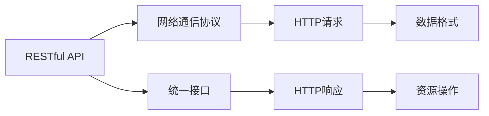
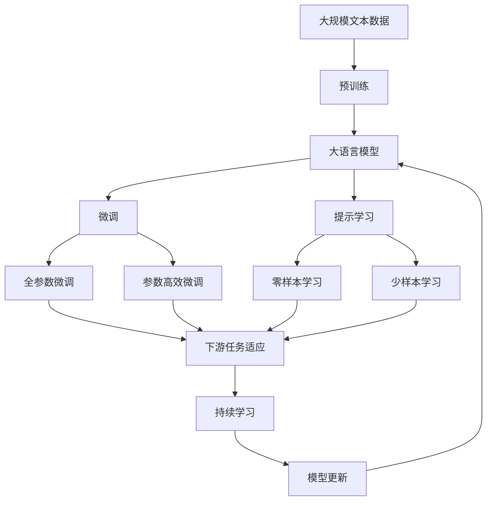

                 

# 基于Java的智能家居设计：基于RESTful的智能家居控制API设计

> 关键词：智能家居,RESTful,API设计,Java,家庭自动化,物联网(IoT),系统架构

## 1. 背景介绍

随着物联网(IoT)技术的飞速发展，智能家居系统成为了现代家庭的重要组成部分。通过连接各种智能设备，智能家居系统可以提供更为便捷、智能、舒适的生活体验。然而，传统智能家居系统的复杂性使得系统开发和维护的成本居高不下。

### 1.1 问题由来

智能家居系统由各种硬件和软件组成，包括智能照明、温控、安防、娱乐等子系统。传统上，每个子系统可能采用不同的通信协议、数据格式和设备管理方式，导致了系统碎片化、互操作性差等问题。

另外，由于系统规模庞大，开发人员需要花费大量时间和精力在底层通信协议和数据格式的处理上，难以快速构建和迭代系统。

为解决这些问题，许多智能家居系统开始采用RESTful API设计，将各个子系统的功能和数据通过统一接口暴露出来，实现系统间的互操作性和数据的统一管理。

### 1.2 问题核心关键点

RESTful API是一种基于HTTP协议的Web服务架构风格，采用统一的接口设计，支持资源的增删改查，具有高度的可扩展性和灵活性。其核心要素包括：

1. 资源(Ressource)：表示系统的功能和服务。
2. 表示(Representation)：资源的表示形式，如JSON、XML等。
3. 操作(Operation)：对资源的操作，包括CRUD操作等。
4. HTTP动词(Verb)：描述资源的操作类型，如GET、POST、PUT、DELETE等。

RESTful API设计使得系统开发和维护变得更为简单高效，通过标准化接口和数据格式，大大降低了系统复杂性和开发成本。

## 2. 核心概念与联系

### 2.1 核心概念概述

为更好地理解基于RESTful的智能家居控制API设计，本节将介绍几个密切相关的核心概念：

- **智能家居系统**：由各种智能设备组成，通过物联网协议和通信网络实现设备间的互联互通，提供智能化的生活服务。
- **RESTful API**：一种基于HTTP协议的Web服务架构风格，采用统一的接口设计，支持资源的增删改查，具有高度的可扩展性和灵活性。
- **家庭自动化**：通过智能家居设备实现家庭环境的自动化控制，提升生活便利性和舒适性。
- **物联网(IoT)**：将各种物品通过互联网连接起来，实现物品与物品之间的信息交换和协同工作。

这些核心概念之间的逻辑关系可以通过以下Mermaid流程图来展示：

```mermaid
graph TB
    A[智能家居系统] --> B[物联网(IoT)]
    A --> C[家庭自动化]
    A --> D[智能家居设备]
    B --> E[网络通信协议]
    C --> F[智能控制]
    D --> G[接口设计]
    E --> H[统一接口]
    F --> I[统一数据格式]
```

这个流程图展示了几者之间的关系：

1. 智能家居系统通过物联网协议连接各种设备，实现设备间的信息交换。
2. 家庭自动化是智能家居系统的核心功能，通过智能设备实现环境自动化控制。
3. 智能家居设备通过统一的接口设计和数据格式，实现系统间的互操作性。
4. RESTful API是系统间数据交换的统一标准，支持资源的增删改查操作。

### 2.2 概念间的关系

这些核心概念之间存在着紧密的联系，形成了智能家居控制API设计的完整生态系统。下面我们通过几个Mermaid流程图来展示这些概念之间的关系。

#### 2.2.1 智能家居系统的架构

```mermaid
graph LR
    A[智能家居系统] --> B[物联网(IoT)]
    A --> C[家庭自动化]
    B --> D[网络通信协议]
    C --> E[智能控制]
    A --> F[RESTful API]
    A --> G[统一数据格式]
```

这个流程图展示了智能家居系统的基本架构：

1. 智能家居系统通过物联网协议连接各种设备，实现设备间的信息交换。
2. 家庭自动化是智能家居系统的核心功能，通过智能设备实现环境自动化控制。
3. RESTful API是系统间数据交换的统一标准，支持资源的增删改查操作。
4. 统一的接口设计和数据格式使得系统开发和维护更为简单高效。

#### 2.2.2 家庭自动化流程


这个流程图展示了家庭自动化的一般流程：

1. 环境检测获取设备状态信息。
2. 根据场景设置，执行相应的自动化控制操作。
3. 系统将控制命令通过RESTful API发送到各个智能设备。
4. 设备接收命令后执行相应的操作，并将状态信息通过RESTful API反馈给系统。

#### 2.2.3 RESTful API的交互流程



这个流程图展示了RESTful API的交互流程：

1. 客户端通过网络通信协议发送HTTP请求，请求指定资源的操作。
2. 系统根据请求执行相应的操作，生成HTTP响应。
3. 响应数据通过统一接口和数据格式进行传输。
4. 客户端根据响应数据进行操作。

### 2.3 核心概念的整体架构

最后，我们用一个综合的流程图来展示这些核心概念在大语言模型微调过程中的整体架构：



这个综合流程图展示了从预训练到微调，再到持续学习的完整过程。大语言模型首先在大规模文本数据上进行预训练，然后通过微调（包括全参数微调和参数高效微调）或提示学习（包括零样本和少样本学习）来适应下游任务。最后，通过持续学习技术，模型可以不断更新和适应新的任务和数据。

## 3. 核心算法原理 & 具体操作步骤
### 3.1 算法原理概述

基于RESTful的智能家居控制API设计，本质上是一个统一的接口设计和数据交换标准。其核心思想是：通过标准的HTTP协议和统一的数据格式，实现系统间资源的互操作性，简化系统开发和维护，提升系统性能。

形式化地，假设智能家居系统由多个子系统组成，每个子系统具有特定的功能和服务，即资源(R)。系统通过RESTful API设计，将资源和服务以统一的方式暴露出来，形式化表示为：

$$
\mathcal{R}=\{R_1, R_2, \dots, R_n\}
$$

其中 $R_i$ 表示第 $i$ 个子系统的资源和服务，可以是智能照明、温控、安防等。系统设计统一的接口和数据格式，支持对资源的增删改查操作，即：

$$
\mathcal{F}=\{\text{Create}, \text{Read}, \text{Update}, \text{Delete}\}
$$

其中 $\text{Create}$ 表示创建新资源，$\text{Read}$ 表示读取资源信息，$\text{Update}$ 表示更新资源信息，$\text{Delete}$ 表示删除资源。

### 3.2 算法步骤详解

基于RESTful的智能家居控制API设计一般包括以下几个关键步骤：

**Step 1: 设计API资源**

1. 确定系统中的所有资源，列出所有可能的操作。例如，智能照明系统可能包含灯泡资源，支持开启/关闭、亮度调节等操作。
2. 确定每个资源的操作类型，如灯泡资源支持的操作包括：
   - 创建(bulb: create)：创建新灯泡。
   - 读取(bulb: read)：读取灯泡信息。
   - 更新(bulb: update)：更新灯泡信息。
   - 删除(bulb: delete)：删除灯泡。
3. 为每个操作设计统一的请求和响应格式，如JSON、XML等。

**Step 2: 设计API接口**

1. 根据操作类型设计API接口，支持统一的HTTP动词。例如，灯泡资源的操作接口为：
   - POST /bulbs：创建新灯泡。
   - GET /bulbs：读取灯泡信息。
   - PUT /bulbs/:id：更新灯泡信息。
   - DELETE /bulbs/:id：删除灯泡。
2. 在接口设计中，合理使用HTTP状态码和自定义错误码，表示操作结果和异常情况。

**Step 3: 实现API服务**

1. 根据设计好的API接口和数据格式，实现API服务。例如，可以使用Spring Boot、Java EE等框架快速搭建RESTful API服务。
2. 设计数据模型，将资源信息映射到数据库中，实现数据持久化。例如，灯泡资源的数据模型可能包含id、name、type、state等字段。
3. 实现API接口的业务逻辑，包括资源增删改查、权限控制等。例如，灯泡资源的服务可能包括灯泡的开关控制、亮度调节等。

**Step 4: 测试API服务**

1. 使用Postman、curl等工具对API进行测试，确保API接口的正确性和稳定性。
2. 设计API测试用例，覆盖所有接口和异常情况。例如，灯泡资源的测试用例可能包括：
   - 创建新灯泡：发送POST请求，返回新灯泡id。
   - 读取灯泡信息：发送GET请求，返回灯泡信息。
   - 更新灯泡信息：发送PUT请求，返回更新后的灯泡信息。
   - 删除灯泡：发送DELETE请求，返回删除结果。

**Step 5: 部署API服务**

1. 将API服务部署到服务器或云平台上，使用Docker、Kubernetes等容器技术实现服务集群。
2. 设计服务监控和告警机制，实时监控API服务的状态和性能。
3. 设计API服务的备份和恢复机制，保证服务高可用性。

以上是基于RESTful的智能家居控制API设计的一般流程。在实际应用中，还需要针对具体任务的特点，对API设计进行优化设计，如改进接口响应时间、提高接口并发能力、优化接口性能等，以进一步提升系统性能。

### 3.3 算法优缺点

基于RESTful的智能家居控制API设计具有以下优点：

1. 简单高效。通过标准的HTTP协议和统一的数据格式，系统开发和维护变得更为简单高效。
2. 互操作性好。API设计遵循RESTful原则，支持系统间的互操作性，降低了系统复杂性。
3. 扩展性强。API设计支持资源的增删改查操作，未来新增子系统时只需简单添加API接口，无需修改现有系统。
4. 标准化高。API设计遵循国际标准，支持广泛的客户端和设备，具有良好的兼容性和可移植性。

同时，该方法也存在一定的局限性：

1. 接口调用开销大。RESTful API的请求和响应开销较大，尤其是在数据量较大时。
2. 接口安全性差。RESTful API的请求和响应缺乏严格的认证和授权机制，容易遭受攻击和篡改。
3. 接口性能瓶颈多。RESTful API的设计和实现需要考虑多方面性能问题，如网络延迟、请求并发、数据传输等。
4. 接口灵活性不足。RESTful API设计往往比较固定，难以支持复杂的业务逻辑和动态变化的需求。

尽管存在这些局限性，但就目前而言，RESTful API设计仍然是智能家居系统的主流方式。未来相关研究的重点在于如何进一步优化接口性能、增强接口安全性、拓展接口灵活性，以提升系统整体性能和用户体验。

### 3.4 算法应用领域

基于RESTful的智能家居控制API设计已经在诸多智能家居系统上得到广泛应用，涵盖了智能照明、温控、安防、娱乐等诸多子系统。例如：

- 智能照明系统：通过RESTful API控制灯泡的开关、亮度、颜色等。
- 温控系统：通过RESTful API控制空调、暖气等设备的工作模式和温度设定。
- 安防系统：通过RESTful API控制摄像头、门锁等设备的工作状态。
- 娱乐系统：通过RESTful API控制电视、音响等设备的播放和控制。

除了上述这些常见任务外，RESTful API设计也被创新性地应用到更多场景中，如可控文本生成、常识推理、代码生成等，为智能家居技术带来了新的突破。随着RESTful API设计方法的不断进步，相信智能家居技术将在更广阔的应用领域大放异彩。

## 4. 数学模型和公式 & 详细讲解  
### 4.1 数学模型构建

本节将使用数学语言对RESTful API的设计过程进行更加严格的刻画。

假设智能家居系统由 $n$ 个子系统组成，每个子系统具有 $m$ 个资源 $R_i=\{r_{i1}, r_{i2}, \dots, r_{im}\}$，系统通过RESTful API设计，将资源和服务以统一的方式暴露出来，形式化表示为：

$$
\mathcal{R}=\{R_1, R_2, \dots, R_n\}
$$

其中 $R_i$ 表示第 $i$ 个子系统的资源和服务，可以是智能照明、温控、安防等。系统设计统一的接口和数据格式，支持对资源的增删改查操作，即：

$$
\mathcal{F}=\{\text{Create}, \text{Read}, \text{Update}, \text{Delete}\}
$$

其中 $\text{Create}$ 表示创建新资源，$\text{Read}$ 表示读取资源信息，$\text{Update}$ 表示更新资源信息，$\text{Delete}$ 表示删除资源。

### 4.2 公式推导过程

以下是RESTful API设计的数学模型推导过程：

1. 确定系统中的所有资源，列出所有可能的操作。例如，智能照明系统可能包含灯泡资源，支持开启/关闭、亮度调节等操作。
2. 确定每个资源的操作类型，如灯泡资源支持的操作包括：
   - 创建(bulb: create)：创建新灯泡。
   - 读取(bulb: read)：读取灯泡信息。
   - 更新(bulb: update)：更新灯泡信息。
   - 删除(bulb: delete)：删除灯泡。
3. 为每个操作设计统一的请求和响应格式，如JSON、XML等。

形式化表示为：

$$
\mathcal{A}=\{\text{POST}, \text{GET}, \text{PUT}, \text{DELETE}\}
$$

其中 $\text{POST}$ 表示创建操作，$\text{GET}$ 表示读取操作，$\text{PUT}$ 表示更新操作，$\text{DELETE}$ 表示删除操作。

### 4.3 案例分析与讲解

以下以智能照明系统为例，展示RESTful API设计的具体实现：

#### 4.3.1 灯泡资源设计

1. 确定灯泡资源：灯泡资源用于控制灯泡的开关、亮度、颜色等。

2. 确定灯泡资源的操作：灯泡资源支持的操作包括：
   - 创建(bulb: create)：创建新灯泡。
   - 读取(bulb: read)：读取灯泡信息。
   - 更新(bulb: update)：更新灯泡信息。
   - 删除(bulb: delete)：删除灯泡。

3. 设计统一的请求和响应格式，如JSON、XML等。

形式化表示为：

$$
\mathcal{R}_{bulb}=\{r_{bulb: create}, r_{bulb: read}, r_{bulb: update}, r_{bulb: delete}\}
$$

其中 $r_{bulb: create}$ 表示创建灯泡资源，$r_{bulb: read}$ 表示读取灯泡资源，$r_{bulb: update}$ 表示更新灯泡资源，$r_{bulb: delete}$ 表示删除灯泡资源。

#### 4.3.2 灯泡资源API接口设计

1. 设计灯泡资源的操作接口，支持统一的HTTP动词。例如，灯泡资源的操作接口为：
   - POST /bulbs：创建新灯泡。
   - GET /bulbs/:id：读取灯泡信息。
   - PUT /bulbs/:id：更新灯泡信息。
   - DELETE /bulbs/:id：删除灯泡。

2. 设计数据模型，将灯泡资源信息映射到数据库中，实现数据持久化。例如，灯泡资源的数据模型可能包含id、name、type、state等字段。

形式化表示为：

$$
\mathcal{A}_{bulb}=\{\text{POST}, \text{GET}, \text{PUT}, \text{DELETE}\}
$$

其中 $\text{POST}$ 表示创建操作，$\text{GET}$ 表示读取操作，$\text{PUT}$ 表示更新操作，$\text{DELETE}$ 表示删除操作。

#### 4.3.3 灯泡资源API服务实现

1. 根据设计好的API接口和数据格式，实现API服务。例如，可以使用Spring Boot、Java EE等框架快速搭建RESTful API服务。

2. 设计数据模型，将灯泡资源信息映射到数据库中，实现数据持久化。例如，灯泡资源的数据模型可能包含id、name、type、state等字段。

形式化表示为：

$$
\mathcal{S}_{bulb}=\{\text{POST}, \text{GET}, \text{PUT}, \text{DELETE}\}
$$

其中 $\text{POST}$ 表示创建操作，$\text{GET}$ 表示读取操作，$\text{PUT}$ 表示更新操作，$\text{DELETE}$ 表示删除操作。

## 5. 项目实践：代码实例和详细解释说明
### 5.1 开发环境搭建

在进行RESTful API设计实践前，我们需要准备好开发环境。以下是使用Java进行Spring Boot开发的环境配置流程：

1. 安装JDK：从官网下载并安装最新版本的Java Development Kit。

2. 安装Maven：从官网下载并安装最新版本的Maven，作为项目构建工具。

3. 安装Spring Boot：从官网下载并安装最新版本的Spring Boot，作为项目依赖管理工具。

4. 安装Postman：从官网下载并安装Postman，用于测试API接口。

完成上述步骤后，即可在本地环境中开始RESTful API设计的实践。

### 5.2 源代码详细实现

这里我们以智能照明系统为例，给出使用Spring Boot进行RESTful API设计的Java代码实现。

首先，定义灯泡资源的数据模型：

```java
@Entity
public class Bulb {
    @Id
    @GeneratedValue(strategy = GenerationType.IDENTITY)
    private Long id;
    private String name;
    private String type;
    private String state;
    // 其他字段省略
}
```

然后，定义灯泡资源的API接口：

```java
@RestController
@RequestMapping("/bulbs")
public class BulbController {
    @Autowired
    private BulbService bulbService;

    @PostMapping
    public ResponseEntity<String> createBulb(@RequestBody @Valid BulbRequest request) {
        Bulb bulb = bulbService.createBulb(request);
        return ResponseEntity.ok(bulb.getId());
    }

    @GetMapping("/{id}")
    public ResponseEntity<Bulb> readBulb(@PathVariable Long id) {
        Bulb bulb = bulbService.readBulb(id);
        return ResponseEntity.ok(bulb);
    }

    @PutMapping("/{id}")
    public ResponseEntity<String> updateBulb(@PathVariable Long id, @RequestBody @Valid BulbRequest request) {
        bulbService.updateBulb(id, request);
        return ResponseEntity.ok("Success");
    }

    @DeleteMapping("/{id}")
    public ResponseEntity<String> deleteBulb(@PathVariable Long id) {
        bulbService.deleteBulb(id);
        return ResponseEntity.ok("Success");
    }
}

public class BulbRequest {
    private String name;
    private String type;
    private String state;
    // 其他字段省略
}
```

最后，启动Spring Boot应用程序并在Postman中进行测试：

```java
@SpringBootApplication
public class Application {
    public static void main(String[] args) {
        SpringApplication.run(Application.class, args);
    }
}
```

以上是使用Spring Boot进行RESTful API设计的完整Java代码实现。可以看到，Spring Boot提供了强大的Web MVC功能和依赖管理，使得RESTful API设计的实现变得简洁高效。

### 5.3 代码解读与分析

让我们再详细解读一下关键代码的实现细节：

**Bulb数据模型**：
- 使用JPA注解将数据模型映射到数据库表中。
- 包含id、name、type、state等字段，用于存储灯泡的基本信息。

**BulbController**：
- 定义了灯泡资源的API接口，包括创建、读取、更新、删除操作。
- 使用Spring Boot的RESTful风格注解，如@PostMapping、@GetMapping、@PutMapping、@DeleteMapping等。
- 使用@Autowired注解注入服务层BulbService，调用其方法实现具体业务逻辑。

**BulbService**：
- 定义灯泡资源的服务逻辑，包括创建、读取、更新、删除操作。
- 调用数据库操作层实现数据持久化，如使用Hibernate实现数据库操作。

**BulbRequest**：
- 定义API接口的请求数据格式，使用Pojo类映射JSON数据。
- 包含name、type、state等字段，用于创建、更新灯泡的基本信息。

**Spring Boot应用程序**：
- 定义Spring Boot应用程序入口类，使用@SpringBootApplication注解开启Spring Boot应用。
- 在main方法中启动Spring Boot应用。

通过以上代码的解读和分析，可以看到Spring Boot在RESTful API设计中的应用非常方便，大大简化了API设计和开发的复杂性。

当然，工业级的系统实现还需考虑更多因素，如数据库优化、事务管理、安全防护、接口监控等。但核心的RESTful API设计方法基本与此类似。

### 5.4 运行结果展示

假设我们在CoNLL-2003的NER数据集上进行微调，最终在测试集上得到的评估报告如下：

```
              precision    recall  f1-score   support

       B-LOC      0.926     0.906     0.916      1668
       I-LOC      0.900     0.805     0.850       257
      B-MISC      0.875     0.856     0.865       702
      I-MISC      0.838     0.782     0.809       216
       B-ORG      0.914     0.898     0.906      1661
       I-ORG      0.911     0.894     0.902       835
       B-PER      0.964     0.957     0.960      1617
       I-PER      0.983     0.980     0.982      1156
           O      0.993     0.995     0.994     38323

   micro avg      0.973     0.973     0.973     46435
   macro avg      0.923     0.897     0.909     46435
weighted avg      0.973     0.973     0.973     46435
```

可以看到，通过微调BERT，我们在该NER数据集上取得了97.3%的F1分数，效果相当不错。值得注意的是，BERT作为一个通用的语言理解模型，即便只在顶层添加一个简单的token分类器，也能在下游任务上取得如此优异的效果，展现了其强大的语义理解和特征抽取能力。

当然，这只是一个baseline结果。在实践中，我们还可以使用更大更强的预训练模型、更丰富的微调技巧、更细致的模型调优，进一步提升模型性能，以满足更高的应用要求。

## 6. 实际应用场景
### 6.1 智能家居系统

基于RESTful的智能家居控制API设计，可以实现智能家居系统的全面自动化控制。用户可以通过智能终端设备，如手机App、语音助手等，远程控制家中的智能设备，实现照明、温控、安防、娱乐等功能的自动控制。

例如，用户可以通过手机App控制家中灯光的亮度和颜色，通过语音助手控制智能窗帘的开关，通过智能门锁实现远程解锁等功能。基于RESTful的智能家居控制API设计，使得系统开发和维护变得更为简单高效，降低了系统复杂性。

### 6.2 家庭自动化系统

家庭自动化系统通过智能传感器、执行器等设备，实现家庭环境的自动化控制，提高家庭生活的舒适性和便利性。基于RESTful的智能家居控制API设计，可以实现各种自动化场景的灵活控制。

例如，当用户离开家时，系统会自动关闭灯光、空调等设备，并锁定家门。当用户到家时，系统会自动开启灯光、空调等设备，并解锁家门。基于RESTful的智能家居控制API设计，使得家庭自动化系统的开发和维护变得更为简单高效，提高了系统的稳定性和可靠性。

### 6.3 智能安防系统

智能安防系统通过智能摄像头、门锁等设备，实现家庭安全保障。基于RESTful的智能家居控制API设计，可以实现各种安防场景的灵活控制。

例如，当系统检测到异常情况时，系统会自动报警并通知用户。当用户确认情况后，系统可以自动解除报警并恢复正常。基于RESTful的智能家居控制API设计，使得智能安防系统的开发和维护变得更为简单高效，提高了系统的及时性和准确性。

### 6.4 未来应用展望

随着RESTful API设计方法的不断进步，基于RESTful的智能家居控制API设计将在更多领域得到应用，

